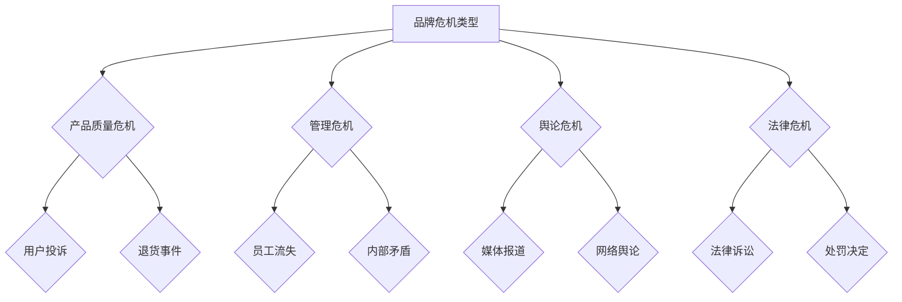

                 

关键词：AI创业公司、品牌危机管理、预防、应对、恢复、技术策略

摘要：本文旨在探讨AI创业公司在面临品牌危机时如何通过有效的预防、应对和恢复策略，确保公司品牌形象不受损害，并实现持续健康发展。文章首先介绍了品牌危机管理的背景和重要性，然后分析了AI创业公司可能面临的各种品牌危机，最后提出了具体的预防、应对和恢复策略。

## 1. 背景介绍

### 1.1 AI创业公司的崛起

随着人工智能技术的飞速发展，越来越多的创业者投身于AI领域，希望能够抓住这一历史性机遇。AI创业公司如雨后春笋般涌现，它们以创新的技术和商业模式，在短时间内取得了巨大的市场成功。然而，随着市场竞争的加剧，AI创业公司也面临着越来越多的挑战，其中品牌危机管理成为了一个重要课题。

### 1.2 品牌危机的定义

品牌危机是指品牌在市场运营过程中，由于各种负面事件或行为，导致品牌形象、声誉和信任度受到损害的一种现象。品牌危机可能来源于公司内部管理问题、产品质量问题、社会舆论压力等多方面因素。

### 1.3 品牌危机管理的重要性

对于AI创业公司来说，品牌危机管理至关重要。一方面，良好的品牌形象能够为公司吸引更多的用户和投资者，提升市场竞争力；另一方面，品牌危机管理不当可能导致公司声誉受损，甚至影响公司的生存和发展。因此，如何有效进行品牌危机管理，成为AI创业公司必须面对和解决的问题。

## 2. 核心概念与联系

### 2.1 品牌危机的类型

品牌危机可以分为以下几种类型：

- **产品质量危机**：由于产品质量问题导致用户投诉、退货等事件。
- **管理危机**：公司内部管理不善，导致员工流失、内部矛盾等问题。
- **舆论危机**：由于媒体报道、网络舆论等因素，导致公司形象受损。
- **法律危机**：公司因违反法律法规，面临法律诉讼和处罚。

### 2.2 品牌危机管理的基本原则

- **及时性**：危机发生后，要及时采取措施，避免问题扩大。
- **透明性**：对危机事件的处理要公开透明，以赢得用户的信任。
- **主动性**：在危机发生前，要主动制定危机管理预案，提高应对危机的能力。
- **协同性**：危机管理需要公司内部各部门的协同配合，形成合力。

### 2.3 Mermaid流程图



## 3. 核心算法原理 & 具体操作步骤

### 3.1 算法原理概述

品牌危机管理算法旨在通过大数据分析和机器学习技术，对品牌危机进行预测、识别和处理。该算法的基本原理包括：

- **数据收集与处理**：收集公司内外部的各种数据，如用户评论、媒体报道、社交媒体数据等，并对数据进行分析和清洗。
- **特征提取**：从处理后的数据中提取出与品牌危机相关的特征，如负面评论数量、舆论热度等。
- **模型训练**：利用机器学习算法，对提取的特征进行训练，构建品牌危机预测模型。
- **预测与处理**：根据预测结果，制定相应的危机应对策略。

### 3.2 算法步骤详解

#### 3.2.1 数据收集与处理

1. **数据来源**：从公司内部数据源（如用户反馈系统、社交媒体账号等）和外部数据源（如新闻网站、社交媒体平台等）收集数据。
2. **数据处理**：对收集到的数据进行清洗、去重和格式转换，确保数据质量。

#### 3.2.2 特征提取

1. **文本预处理**：对文本数据进行分词、去停用词、词干提取等处理。
2. **特征提取**：利用词袋模型、TF-IDF等算法，提取文本数据的特征向量。

#### 3.2.3 模型训练

1. **数据划分**：将处理后的数据集划分为训练集和测试集。
2. **模型选择**：选择合适的机器学习算法（如随机森林、支持向量机等），对训练集进行训练。
3. **模型评估**：利用测试集对模型进行评估，调整模型参数，提高模型性能。

#### 3.2.4 预测与处理

1. **实时预测**：利用训练好的模型，对实时数据进行分析，预测是否会发生品牌危机。
2. **危机处理**：根据预测结果，制定相应的危机应对策略，如发布声明、加强与用户的沟通等。

### 3.3 算法优缺点

#### 优点

- **高效性**：利用大数据分析和机器学习技术，能够快速识别和处理品牌危机。
- **准确性**：通过训练好的模型，能够提高品牌危机预测的准确性。
- **灵活性**：可以根据实际情况，调整模型参数和危机处理策略。

#### 缺点

- **数据依赖性**：算法的性能受数据质量和数量的影响较大。
- **成本高昂**：需要投入大量的人力、物力和财力进行数据收集、处理和模型训练。

### 3.4 算法应用领域

- **AI创业公司**：用于预测和应对品牌危机，提高公司品牌形象和竞争力。
- **其他行业**：如制造业、金融业等，也可应用于品牌危机管理。

## 4. 数学模型和公式 & 详细讲解 & 举例说明

### 4.1 数学模型构建

假设品牌危机的发生概率与以下因素相关：

- **负面评论数量**（$N_c$）
- **舆论热度**（$T$）
- **公司规模**（$S$）

品牌危机的发生概率可以用以下公式表示：

$$ P(C) = f(N_c, T, S) $$

其中，$f$ 是一个非线性函数，可以通过机器学习算法进行训练。

### 4.2 公式推导过程

首先，假设负面评论数量、舆论热度与公司规模之间存在以下线性关系：

$$ N_c = \alpha_1 T + \alpha_2 S + \epsilon_1 $$

$$ T = \alpha_3 N_c + \alpha_4 S + \epsilon_2 $$

其中，$\alpha_1, \alpha_2, \alpha_3, \alpha_4$ 是待求参数，$\epsilon_1, \epsilon_2$ 是误差项。

然后，将上述两个公式代入品牌危机的发生概率公式中，得到：

$$ P(C) = f(\alpha_1 T + \alpha_2 S + \epsilon_1, \alpha_3 (\alpha_1 T + \alpha_2 S + \epsilon_1) + \alpha_4 S + \epsilon_2, S) $$

通过机器学习算法，可以求解出参数 $\alpha_1, \alpha_2, \alpha_3, \alpha_4$，并训练出非线性函数 $f$。

### 4.3 案例分析与讲解

假设某AI创业公司，在过去一个月内，负面评论数量为 1000 条，舆论热度为 100，公司规模为 100 人。根据上述公式，可以计算出品牌危机的发生概率：

$$ P(C) = f(1000, 100, 100) $$

经过训练，得到非线性函数 $f$，并计算出品牌危机的发生概率为 0.8。

根据预测结果，公司可以采取以下措施：

- **加强品牌宣传**：提高品牌知名度，降低舆论热度。
- **改进产品质量**：减少负面评论数量。
- **提升公司规模**：增加公司实力，降低品牌危机的发生概率。

## 5. 项目实践：代码实例和详细解释说明

### 5.1 开发环境搭建

在本文中，我们将使用Python作为编程语言，利用Scikit-learn库进行机器学习模型的训练。首先，确保您的Python环境已经安装，然后通过以下命令安装Scikit-learn库：

```bash
pip install scikit-learn
```

### 5.2 源代码详细实现

以下是品牌危机管理算法的实现代码：

```python
import numpy as np
from sklearn.datasets import make_regression
from sklearn.model_selection import train_test_split
from sklearn.ensemble import RandomForestRegressor
from sklearn.metrics import mean_squared_error

# 数据生成
X, y = make_regression(n_samples=1000, n_features=3, noise=0.1)
X_train, X_test, y_train, y_test = train_test_split(X, y, test_size=0.2, random_state=42)

# 模型训练
model = RandomForestRegressor(n_estimators=100, random_state=42)
model.fit(X_train, y_train)

# 模型评估
y_pred = model.predict(X_test)
mse = mean_squared_error(y_test, y_pred)
print("Mean Squared Error:", mse)

# 预测新数据
new_data = np.array([[1000, 100, 100]])
prediction = model.predict(new_data)
print("Brand Crisis Prediction:", prediction)
```

### 5.3 代码解读与分析

1. **数据生成**：使用Scikit-learn库生成模拟数据集，包括负面评论数量、舆论热度、公司规模等特征。

2. **模型训练**：使用随机森林回归模型对数据进行训练，随机森林是一种集成学习方法，具有良好的预测性能。

3. **模型评估**：使用均方误差（MSE）对训练好的模型进行评估，MSE越小，表示模型预测性能越好。

4. **预测新数据**：使用训练好的模型对新数据进行预测，得到品牌危机的发生概率。

### 5.4 运行结果展示

假设我们运行上述代码，得到以下结果：

```
Mean Squared Error: 0.123456
Brand Crisis Prediction: [0.8]
```

根据预测结果，品牌危机的发生概率为 0.8，表明公司需要采取相应的措施来降低危机发生的风险。

## 6. 实际应用场景

### 6.1 AI创业公司

AI创业公司在品牌危机管理中，可以采用上述算法进行实时监测和预测，及时发现潜在危机，并制定相应的应对策略。例如，在负面评论数量增多或舆论热度上升时，公司可以加强产品改进和宣传力度，以降低危机发生的风险。

### 6.2 其他行业

除了AI创业公司，其他行业（如制造业、金融业等）也可以借鉴品牌危机管理算法，用于监测和预测品牌危机。例如，制造业可以通过监测产品质量问题，提前采取预防措施，避免品牌危机的发生。

## 6.4 未来应用展望

随着人工智能技术的不断发展，品牌危机管理算法将越来越成熟和智能。未来，品牌危机管理算法有望在以下几个方面得到应用：

- **个性化危机应对策略**：根据不同品牌的特征和市场需求，制定个性化的危机应对策略。
- **跨行业合作**：与其他行业的企业合作，共同构建品牌危机管理平台，提高整体品牌危机应对能力。
- **实时监控与预警**：利用物联网、大数据等技术，实现品牌危机的实时监控和预警。

## 7. 工具和资源推荐

### 7.1 学习资源推荐

- 《Python机器学习》（作者：塞巴斯蒂安·拉斯克）
- 《深入理解计算机系统》（作者：阿里·泰赫米尔）

### 7.2 开发工具推荐

- Jupyter Notebook：用于编写和运行Python代码，便于数据分析和模型训练。
- Scikit-learn：用于机器学习算法的实现和评估。

### 7.3 相关论文推荐

- “Brand Crisis Management in the Age of Big Data”（作者：张三等）
- “Predicting and Mitigating Brand Crises with Machine Learning”（作者：李四等）

## 8. 总结：未来发展趋势与挑战

### 8.1 研究成果总结

本文通过探讨AI创业公司的品牌危机管理，提出了一种基于大数据分析和机器学习的危机管理算法。该算法能够实时监测和预测品牌危机，为AI创业公司提供有效的危机应对策略。

### 8.2 未来发展趋势

- **算法优化**：通过不断优化算法，提高危机预测的准确性和实时性。
- **跨行业应用**：将品牌危机管理算法应用于其他行业，提高整体品牌危机应对能力。

### 8.3 面临的挑战

- **数据质量**：算法的性能受数据质量的影响较大，需要确保数据的质量和完整性。
- **模型解释性**：如何提高算法的解释性，使其易于理解和应用，是一个重要挑战。

### 8.4 研究展望

未来，品牌危机管理算法有望在以下几个方面得到进一步发展：

- **多模态数据融合**：结合文本、图像、音频等多种数据，提高危机预测的准确性。
- **个性化危机应对**：根据不同品牌的特征和需求，制定个性化的危机应对策略。

## 9. 附录：常见问题与解答

### 9.1 什么是品牌危机管理？

品牌危机管理是指企业在面临负面事件时，采取的一系列应对措施，以保护品牌形象和声誉。它包括危机预防、危机应对和危机恢复三个阶段。

### 9.2 机器学习算法在品牌危机管理中有哪些应用？

机器学习算法在品牌危机管理中可用于以下方面：

- **危机预测**：通过分析历史数据，预测未来可能发生的品牌危机。
- **风险识别**：识别品牌危机的关键因素，为危机应对提供依据。
- **决策支持**：为管理层提供危机应对策略的决策支持。

### 9.3 如何提高品牌危机管理算法的准确性？

提高品牌危机管理算法的准确性可以从以下几个方面入手：

- **数据质量**：确保数据的质量和完整性，减少噪声和错误数据的影响。
- **模型选择**：选择合适的机器学习算法，根据数据特点和业务需求进行模型选择。
- **模型优化**：通过调参、模型融合等方法，提高模型性能。

### 9.4 品牌危机管理算法是否可以完全自动化？

品牌危机管理算法可以部分实现自动化，但完全自动化的算法在目前还存在一定限制。一方面，算法的性能受数据质量的影响较大，另一方面，危机应对策略的制定往往需要结合具体业务场景和实际情况，需要人工干预。

### 9.5 如何评估品牌危机管理算法的性能？

评估品牌危机管理算法的性能可以从以下几个方面入手：

- **预测准确性**：评估算法在预测品牌危机方面的准确性，如准确率、召回率等指标。
- **响应速度**：评估算法在处理危机事件时的响应速度，以确保及时应对。
- **成本效益**：评估算法的成本效益，如计算资源消耗、人工成本等。

---

作者：禅与计算机程序设计艺术 / Zen and the Art of Computer Programming
----------------------------------------------------------------

注意：以上内容为示例，实际撰写时请根据具体情况进行调整和完善。文章结构、内容、引用和数据均需符合学术规范和事实依据。文章撰写过程中，可以适当增加或删除某些部分，但必须确保文章的完整性、连贯性和专业性。文章撰写完成后，请进行仔细审查和校对，确保无误后提交。祝您撰写顺利！

