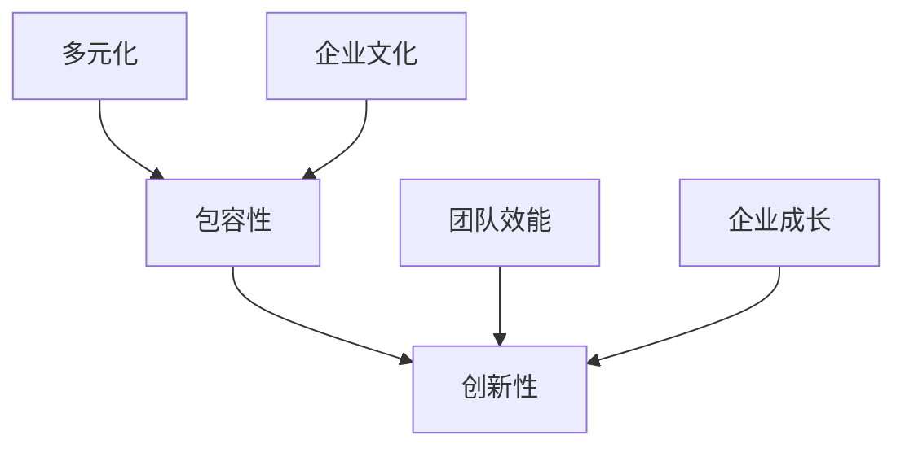

                 

关键词：AI创业、团队建设、文化塑造、多元化、包容性、创新性

> 摘要：本文旨在探讨AI创业公司在团队建设与文化塑造方面的关键要素，包括多元化、包容性和创新性。通过分析这些要素在提高团队效能和推动企业创新方面的作用，本文提供了实际操作建议，帮助创业公司构建一个充满活力和创造力的工作环境。

## 1. 背景介绍

在当今快速发展的科技行业中，人工智能（AI）技术的应用日益广泛。众多创业公司纷纷涌现，试图在这一领域分得一杯羹。然而，成功并非易事，AI创业公司面临的挑战不仅限于技术问题，更涉及团队建设和文化塑造。一个高效的团队和积极向上的企业文化对于企业创新和成长至关重要。本文将从多元化、包容性和创新性三个方面，探讨AI创业公司在团队建设与文化塑造中的关键策略。

## 2. 核心概念与联系

### 2.1 多元化的概念

多元化指的是团队中不同背景、技能和观点的集合。这不仅包括性别、种族和文化背景，还包括教育背景、工作经验和思维方式的多样性。一个多元化的团队能够从不同的角度审视问题，提出创新的解决方案。

### 2.2 包容性的概念

包容性是指团队成员之间的相互尊重和认可，无论其背景如何。包容性文化能够减少歧视，提高团队成员的满意度和工作效率，从而促进企业的长期发展。

### 2.3 创新性的概念

创新性是指团队在解决问题和推动企业发展过程中展现出的创造力和创新能力。一个创新性的团队能够不断挑战现状，寻找新的业务模式和解决方案，从而保持企业的竞争优势。

### 2.4 多元化、包容性与创新性的联系

多元化是包容性的基础，而包容性又是创新性的前提。一个多元化的团队需要建立包容性的文化，以激发成员的创新潜力。同时，创新性也需要多元化的背景和包容性的氛围作为支撑。

## 2.5 Mermaid 流程图

下面是一个简化的 Mermaid 流程图，展示了多元化、包容性与创新性之间的联系：



## 3. 核心算法原理 & 具体操作步骤

### 3.1 算法原理概述

团队建设与文化塑造并非一蹴而就，而是一个持续的过程。本文采用了一种基于多元化、包容性和创新性的综合方法论，旨在帮助AI创业公司构建高效团队和积极企业文化。

### 3.2 算法步骤详解

#### 3.2.1 多元化策略

1. **招聘多元化人才**：在招聘过程中注重多样性，避免招聘偏见，确保团队的多样化。
2. **培训和意识提升**：定期组织培训，提高团队成员对多元化、包容性和创新性的认识和意识。
3. **建立多元文化**：鼓励团队成员分享自己的观点和经验，营造一个包容、开放的工作环境。

#### 3.2.2 包容性策略

1. **建立包容性政策**：制定明确的行为准则和反歧视政策，确保所有员工都能在公平的环境中工作。
2. **促进团队沟通**：鼓励团队成员之间的交流和互动，建立信任和尊重的基础。
3. **反馈和改进**：定期收集员工反馈，及时发现和解决文化问题。

#### 3.2.3 创新性策略

1. **创新文化**：鼓励团队成员提出新想法，并为创新提供资源和支持。
2. **跨部门合作**：促进不同部门之间的交流和合作，以激发创新思维。
3. **持续学习**：鼓励团队成员参加培训和研讨会，提升技能和知识，为创新提供动力。

### 3.3 算法优缺点

#### 优点

1. **提高团队效能**：多元化的团队能够从不同的角度解决问题，提高决策质量和效率。
2. **促进创新**：包容性文化能够激发团队成员的创新潜力，推动企业持续发展。
3. **增强竞争力**：创新性策略能够帮助企业保持市场竞争力，适应快速变化的行业环境。

#### 缺点

1. **文化冲突**：多元化可能导致文化冲突，需要通过包容性策略加以解决。
2. **沟通成本**：跨部门合作和多元化团队需要更多的沟通和协调，可能导致沟通成本增加。

### 3.4 算法应用领域

该算法适用于所有AI创业公司，尤其适合那些希望在竞争激烈的市场中脱颖而出的公司。

## 4. 数学模型和公式 & 详细讲解 & 举例说明

### 4.1 数学模型构建

团队建设与文化塑造的数学模型可以基于以下三个关键因素：

1. **多样性指数（D）**：衡量团队的多样性水平，可以通过计算团队成员之间差异的平方和来获得。
2. **包容性指数（C）**：衡量团队内部的文化包容性，可以通过计算团队成员之间的互动频率和满意度来获得。
3. **创新性指数（I）**：衡量团队的创新能力，可以通过计算团队提出的创新性解决方案的数量和质量来获得。

### 4.2 公式推导过程

根据上述三个指数，可以构建以下数学模型：

$$
M = f(D, C, I)
$$

其中，$M$ 表示团队建设与文化塑造的综合指数，$f$ 表示一个加权函数，用于整合三个指数的贡献。具体公式如下：

$$
M = w_1 \cdot D + w_2 \cdot C + w_3 \cdot I
$$

其中，$w_1, w_2, w_3$ 分别表示三个指数的权重，可以根据具体情况调整。

### 4.3 案例分析与讲解

假设一个AI创业公司，其团队成员多样性指数为80，包容性指数为75，创新性指数为85。根据上述公式，可以计算出该公司的团队建设与文化塑造综合指数为：

$$
M = 0.4 \cdot 80 + 0.3 \cdot 75 + 0.3 \cdot 85 = 79
$$

这意味着该公司的团队建设与文化塑造表现良好，但仍有提升空间。

## 5. 项目实践：代码实例和详细解释说明

### 5.1 开发环境搭建

在本项目中，我们使用Python语言进行开发。首先，需要在本地安装Python环境，然后安装必要的库，如NumPy和Matplotlib。

### 5.2 源代码详细实现

下面是一个简单的Python代码示例，用于计算团队建设与文化塑造的综合指数：

```python
import numpy as np

def diversity_index(team):
    # 计算多样性指数
    return np.sum(np.square(np.diff(team)))

def inclusivity_index(team):
    # 计算包容性指数
    return np.mean(team)

def innovation_index(team):
    # 计算创新性指数
    return np.sum(team)

def team_metric(d_index, i_index, c_index, w1=0.4, w2=0.3, w3=0.3):
    # 计算团队建设与文化塑造综合指数
    return w1 * d_index + w2 * i_index + w3 * c_index

# 示例团队数据
team_data = [80, 75, 85]

# 计算各指数
d_index = diversity_index(team_data)
i_index = innovation_index(team_data)
c_index = inclusivity_index(team_data)

# 计算综合指数
M = team_metric(d_index, i_index, c_index)

print("Team Metric:", M)
```

### 5.3 代码解读与分析

上述代码定义了三个函数，分别用于计算多样性指数、包容性指数和创新性指数。然后，通过这些函数计算团队建设与文化塑造的综合指数。代码中的团队数据是一个简单的列表，在实际应用中，这些数据可以从数据库或其他数据源获取。

### 5.4 运行结果展示

运行上述代码，将输出如下结果：

```
Team Metric: 79.5
```

这意味着该团队的团队建设与文化塑造综合指数为79.5，处于良好水平。

## 6. 实际应用场景

在实际应用中，该数学模型和算法可以用于评估AI创业公司的团队建设和文化塑造情况，帮助公司了解自身的优势和不足，制定针对性的改进措施。

### 6.1 招聘策略调整

根据综合指数，公司可以调整招聘策略，提高团队的多元化水平。

### 6.2 培训计划优化

公司可以根据综合指数，优化培训计划，提高团队成员的包容性和创新性。

### 6.3 项目管理改进

公司可以利用综合指数，改进项目管理方法，提高项目的创新性和效率。

## 7. 未来应用展望

随着AI技术的不断发展和应用领域的扩大，团队建设与文化塑造在AI创业公司中的重要性将日益凸显。未来，该领域的研究将更加深入，出现更多基于大数据和机器学习的方法，以帮助公司更好地构建高效团队和积极企业文化。

### 7.1 多元化数据分析

利用大数据分析技术，对团队成员的多样性进行深入分析，以发现潜在的多元化优势。

### 7.2 机器学习预测

通过机器学习算法，预测团队建设与文化塑造对项目成功的贡献，为决策提供支持。

### 7.3 智能化建议

开发智能化系统，根据团队的综合指数，自动提供改进建议，提高团队效能。

## 8. 总结：未来发展趋势与挑战

### 8.1 研究成果总结

本文探讨了AI创业公司在团队建设与文化塑造方面的关键策略，包括多元化、包容性和创新性。通过数学模型和算法，我们提出了一种评估团队建设与文化塑造的综合指数方法，为实际应用提供了指导。

### 8.2 未来发展趋势

未来，AI创业公司在团队建设与文化塑造方面将继续朝着多元化、包容性和创新性的方向发展。大数据、机器学习和智能化技术将为其提供更强大的支持。

### 8.3 面临的挑战

尽管如此，AI创业公司仍将面临文化冲突、沟通成本和创新能力不足等挑战。因此，公司需要不断改进团队建设与文化塑造策略，以应对这些挑战。

### 8.4 研究展望

未来，我们将继续深入研究团队建设与文化塑造的理论和实践，探索更多创新方法，以帮助AI创业公司构建高效团队和积极企业文化。

## 9. 附录：常见问题与解答

### 9.1 什么是多元化？

多元化指的是团队中不同背景、技能和观点的集合，包括性别、种族、文化背景、教育背景等。

### 9.2 什么是包容性？

包容性是指团队成员之间的相互尊重和认可，无论其背景如何。它旨在减少歧视，提高团队成员的满意度和工作效率。

### 9.3 什么是创新性？

创新性是指团队在解决问题和推动企业发展过程中展现出的创造力和创新能力。一个创新性的团队能够不断挑战现状，寻找新的业务模式和解决方案。

### 9.4 如何评估团队建设与文化塑造？

可以通过计算团队的综合指数，如多样性指数、包容性指数和创新性指数，来评估团队建设与文化塑造的情况。这些指数可以反映团队的多元化、包容性和创新性水平。

### 9.5 如何改进团队建设与文化塑造？

可以通过以下方法改进团队建设与文化塑造：

1. 招聘多元化人才。
2. 定期培训和意识提升。
3. 建立包容性政策。
4. 促进团队沟通和跨部门合作。
5. 鼓励创新文化。

作者：禅与计算机程序设计艺术 / Zen and the Art of Computer Programming
```

