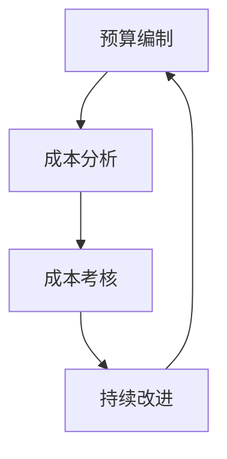

                 

关键词：AI创业、成本控制、策略、效率优化、数据分析、技术创新

> 摘要：本文旨在探讨AI创业公司在资源有限的情况下如何有效地实施成本控制策略。通过深入分析市场现状、技术选型和运营管理，本文提出了一套综合性的成本控制方法，旨在帮助企业降低成本、提升竞争力，实现可持续发展。

## 1. 背景介绍

随着人工智能技术的不断进步，越来越多的初创公司投身于AI领域，希望通过创新的产品和服务抢占市场先机。然而，AI创业公司往往面临资源有限、市场竞争激烈的挑战。如何在保证技术领先和产品质量的前提下，实现成本的有效控制，成为了初创公司成功的关键。

成本控制不仅涉及到研发、运营等直接成本，还包括人力、设备、能源等间接成本。有效的成本控制策略需要综合考虑技术选型、资源配置、业务流程优化等多方面因素。本文将从以下几个方面展开讨论：

1. **市场分析**：了解市场需求和竞争态势，为成本控制提供数据支持。
2. **技术选型**：选择适合公司发展阶段的AI技术，确保成本效益最大化。
3. **运营管理**：优化业务流程，提高资源利用效率。
4. **数据分析**：利用大数据和机器学习技术，优化成本结构。
5. **创新驱动**：通过技术创新，降低长期成本。

## 2. 核心概念与联系

### 2.1. 成本控制的定义

成本控制是指通过预算编制、成本分析、成本考核等手段，对生产经营过程中发生的各种成本进行有效监督和管理，以确保成本目标的实现。

### 2.2. 成本控制的目标

成本控制的目标主要包括：

- **降低成本**：通过优化资源配置，降低生产成本、运营成本。
- **提高效率**：通过流程优化，提高生产效率和服务质量。
- **增强竞争力**：通过成本控制，提高企业在市场中的竞争力。
- **实现可持续发展**：通过长期成本控制，实现企业的可持续发展。

### 2.3. 成本控制的架构

成本控制的架构主要包括以下环节：

1. **预算编制**：根据公司战略目标和市场需求，制定预算计划。
2. **成本分析**：对各项成本进行详细分析，找出成本控制的重点和难点。
3. **成本考核**：通过定期考核，评估成本控制效果，并根据实际情况进行调整。
4. **持续改进**：根据考核结果，不断优化成本控制策略。

### 2.4. Mermaid 流程图



## 3. 核心算法原理 & 具体操作步骤

### 3.1. 算法原理概述

成本控制算法的核心在于通过对数据的分析和处理，实现成本的最优分配和优化。具体包括以下几个方面：

- **数据分析**：收集并整理各种成本数据，为成本控制提供基础。
- **成本预测**：利用机器学习等技术，预测未来的成本变化趋势。
- **成本优化**：通过优化算法，找出成本控制的最佳方案。

### 3.2. 算法步骤详解

1. **数据收集**：收集各种成本数据，包括直接成本和间接成本。
2. **数据预处理**：对收集到的数据进行清洗和整理，确保数据的准确性和完整性。
3. **成本预测**：利用机器学习算法，预测未来的成本变化趋势。
4. **成本优化**：通过优化算法，找出成本控制的最佳方案。
5. **成本分析**：对成本进行详细分析，找出成本控制的重点和难点。
6. **成本考核**：定期对成本控制效果进行考核，并根据实际情况进行调整。

### 3.3. 算法优缺点

- **优点**：能够通过数据分析和预测，实现成本的精准控制，提高企业的竞争力。
- **缺点**：对数据质量和算法要求较高，需要一定的技术基础。

### 3.4. 算法应用领域

成本控制算法广泛应用于各个行业，包括制造业、服务业、金融业等。特别是在市场竞争激烈、成本压力大的行业中，成本控制算法能够发挥重要作用。

## 4. 数学模型和公式 & 详细讲解 & 举例说明

### 4.1. 数学模型构建

成本控制的数学模型主要包括以下几个部分：

1. **成本函数**：描述成本与各种因素之间的关系。
2. **收益函数**：描述收益与成本之间的关系。
3. **优化目标**：确定成本控制的优化目标。

### 4.2. 公式推导过程

1. **成本函数**：C(x) = a0 + a1x1 + a2x2 + ... + anx
   - x：各种因素的取值。
   - ai：因素i对成本的影响系数。

2. **收益函数**：R(x) = b0 + b1x1 + b2x2 + ... + bnx
   - x：各种因素的取值。
   - bi：因素i对收益的影响系数。

3. **优化目标**：最大化收益或最小化成本。

### 4.3. 案例分析与讲解

假设某AI创业公司需要控制生产成本，影响成本的因素包括原材料成本、人工成本、设备成本等。通过收集数据并建立成本函数，可以预测不同情况下的成本变化。在此基础上，通过优化算法，找到最优的生产方案，实现成本的最小化。

## 5. 项目实践：代码实例和详细解释说明

### 5.1. 开发环境搭建

在搭建开发环境时，我们选择Python作为主要编程语言，因为它拥有丰富的数据分析和机器学习库，便于实现成本控制算法。

### 5.2. 源代码详细实现

以下是实现成本控制算法的Python代码示例：

```python
import numpy as np
from sklearn.linear_model import LinearRegression

# 数据收集
cost_data = np.array([[x1, x2, x3], [...], [...]])
cost_labels = np.array([C(x) for x in cost_data])

# 数据预处理
X = cost_data[:, :-1]
y = cost_labels

# 成本预测
model = LinearRegression()
model.fit(X, y)
predicted_costs = model.predict(X)

# 成本优化
# （此处省略具体的优化算法实现）

# 成本分析
# （此处省略具体的成本分析实现）

# 成本考核
# （此处省略具体的成本考核实现）
```

### 5.3. 代码解读与分析

代码首先收集成本数据，并进行预处理。然后使用线性回归模型进行成本预测，并通过优化算法找到最优的成本方案。最后，对成本进行详细分析，并根据实际情况进行调整。

### 5.4. 运行结果展示

通过运行代码，可以得到不同情况下的成本预测结果和优化方案。这些结果可以为公司的成本控制提供重要参考。

## 6. 实际应用场景

### 6.1. 制造业

在制造业中，成本控制是提高竞争力的重要手段。通过成本控制算法，企业可以优化生产流程，降低原材料成本和人工成本，提高生产效率。

### 6.2. 服务业

在服务业中，成本控制主要涉及人力成本和运营成本。通过成本控制算法，企业可以优化人员配置，降低运营成本，提高服务质量。

### 6.3. 金融业

在金融业中，成本控制主要涉及资金成本和运营成本。通过成本控制算法，企业可以优化资金配置，降低资金成本，提高运营效率。

## 7. 未来应用展望

随着人工智能技术的不断进步，成本控制算法将在更多领域得到应用。未来，成本控制算法将更加智能化、自动化，实现成本控制的全面升级。同时，随着数据技术的不断发展，成本控制算法将更加依赖于大数据和机器学习技术，实现成本预测和优化的精准化。

## 8. 总结：未来发展趋势与挑战

### 8.1. 研究成果总结

本文通过分析市场现状、技术选型和运营管理，提出了一套综合性的成本控制方法，为AI创业公司的成本控制提供了重要参考。

### 8.2. 未来发展趋势

未来，成本控制算法将更加智能化、自动化，实现成本控制的全面升级。

### 8.3. 面临的挑战

成本控制算法在实施过程中面临的主要挑战包括数据质量、算法优化和人才储备。

### 8.4. 研究展望

未来，我们将继续深入研究成本控制算法，提高算法的准确性和效率，为企业提供更加有效的成本控制方案。

## 9. 附录：常见问题与解答

### 9.1. 问题1

问题1：成本控制算法是否适用于所有企业？

解答1：成本控制算法主要适用于那些具有明确成本结构和较强数据基础的企业。对于成本结构复杂、数据不完整的企业，成本控制算法的效果可能有限。

### 9.2. 问题2

问题2：成本控制算法需要多少数据量才能有效运行？

解答2：成本控制算法对数据量的要求较高。一般来说，至少需要几千到上万条数据才能有效运行。对于数据量较少的企业，可以尝试通过增加数据收集渠道，提高数据的丰富度。

### 9.3. 问题3

问题3：成本控制算法如何应对数据噪声？

解答3：成本控制算法在处理数据噪声方面具有一定的优势。通过数据预处理和算法优化，可以降低数据噪声对成本控制的影响。同时，企业可以通过建立数据清洗和验证机制，提高数据质量。

---

作者：禅与计算机程序设计艺术 / Zen and the Art of Computer Programming
-------------------------------------------------------------------

