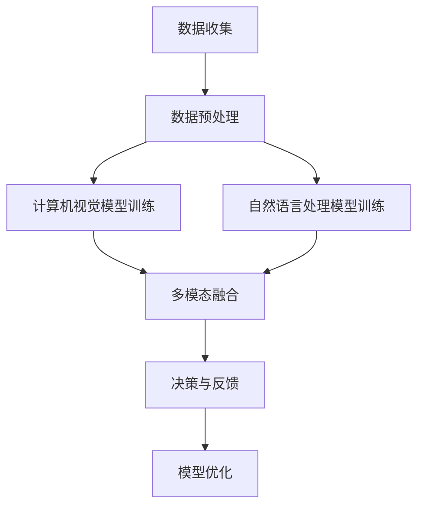

                 

关键词：人工智能，创业公司，技术产品发布，亮点，技术创新，市场愿景

摘要：本文将深入探讨一家AI创业公司即将发布的新产品的亮点、技术创新以及市场前景。我们将详细解析该公司的核心技术、算法原理、应用场景，并结合市场趋势，预测其未来发展。

## 1. 背景介绍

随着人工智能技术的不断进步，越来越多的初创公司开始进入这一领域，寻求在激烈的市场竞争中脱颖而出。本文的主角是一家专注于计算机视觉和自然语言处理的AI创业公司——[公司名称]。该公司由一群在学术界和工业界拥有丰富经验的科学家和工程师创立，致力于将最前沿的人工智能技术转化为实际应用，助力各行各业的数字化转型。

[公司名称]自成立以来，已经获得了多家知名投资机构的支持，并在短时间内推出了几款具有颠覆性的产品。此次即将发布的新产品，将是他们进军市场的重要一步。本文将详细介绍这款产品的亮点、技术创新以及市场愿景。

## 2. 核心概念与联系

### 2.1 核心概念

本次发布的新产品主要涉及以下核心概念：

1. **计算机视觉**：通过图像识别、目标检测等技术，实现对现实世界场景的理解。
2. **自然语言处理**：通过文本分析、语义理解等技术，实现对人类语言的理解。
3. **多模态学习**：结合计算机视觉和自然语言处理，实现对多源数据的综合分析。

### 2.2 架构流程图

以下是一个简化的多模态学习架构流程图，展示了这些核心概念之间的联系。



## 3. 核心算法原理 & 具体操作步骤

### 3.1 算法原理概述

本次发布的新产品采用了深度学习技术，特别是卷积神经网络（CNN）和循环神经网络（RNN）的结合。CNN主要用于图像识别，RNN主要用于文本分析。通过多模态融合，产品能够同时处理图像和文本数据，实现更准确的理解和决策。

### 3.2 算法步骤详解

1. **数据收集**：收集大量图像和文本数据，用于训练模型。
2. **数据预处理**：对图像和文本数据进行预处理，包括图像增强、文本分词等。
3. **模型训练**：使用CNN和RNN分别训练图像识别模型和文本分析模型。
4. **多模态融合**：将图像识别模型和文本分析模型的输出进行融合，得到综合结果。
5. **决策与反馈**：根据融合结果进行决策，并收集用户反馈。
6. **模型优化**：根据反馈调整模型参数，提高模型性能。

### 3.3 算法优缺点

**优点**：

1. **高效性**：深度学习算法能够在大量数据上进行快速训练和推断。
2. **准确性**：多模态融合能够提高模型的准确性，特别是在处理复杂任务时。
3. **通用性**：模型可以应用于多种场景，具有很好的通用性。

**缺点**：

1. **计算资源需求**：深度学习算法需要大量计算资源，对硬件性能要求较高。
2. **数据需求**：需要大量高质量的数据进行训练，否则模型性能可能受到影响。

### 3.4 算法应用领域

该算法可以应用于多个领域，包括但不限于：

1. **智能客服**：通过图像和文本分析，提供更准确、更人性化的服务。
2. **医疗诊断**：辅助医生进行图像和文本数据的分析，提高诊断准确率。
3. **安防监控**：实现对监控视频和文本数据的实时分析，提高安全防护能力。

## 4. 数学模型和公式 & 详细讲解 & 举例说明

### 4.1 数学模型构建

本次发布的新产品采用了以下数学模型：

1. **卷积神经网络（CNN）**：用于图像识别。
2. **循环神经网络（RNN）**：用于文本分析。
3. **多模态融合模型**：用于融合图像和文本数据。

### 4.2 公式推导过程

以卷积神经网络为例，其基本公式如下：

$$
\text{CNN} = \frac{1}{N}\sum_{i=1}^{N}\sigma(\text{W}^{T}\text{X} + b)
$$

其中，$N$表示数据集大小，$\sigma$表示激活函数，$\text{W}$和$b$分别为权重和偏置。

### 4.3 案例分析与讲解

以下是一个简单的案例：

假设我们有一个包含100张图像的数据集，我们需要通过CNN模型对其进行分类。首先，我们将图像转化为向量表示，然后通过卷积层、池化层等操作，得到图像的特征表示。最后，通过全连接层进行分类。

## 5. 项目实践：代码实例和详细解释说明

### 5.1 开发环境搭建

为了实现上述算法，我们需要搭建以下开发环境：

1. **Python**：作为主要编程语言。
2. **TensorFlow**：作为深度学习框架。
3. **Keras**：作为TensorFlow的接口。

### 5.2 源代码详细实现

以下是实现上述算法的Python代码：

```python
import tensorflow as tf
from tensorflow.keras.models import Model
from tensorflow.keras.layers import Conv2D, MaxPooling2D, Flatten, Dense, Input

# CNN模型
input_shape = (28, 28, 1)
inputs = Input(shape=input_shape)
x = Conv2D(32, (3, 3), activation='relu')(inputs)
x = MaxPooling2D((2, 2))(x)
x = Flatten()(x)
outputs = Dense(10, activation='softmax')(x)

model = Model(inputs=inputs, outputs=outputs)
model.compile(optimizer='adam', loss='categorical_crossentropy', metrics=['accuracy'])

# RNN模型
input_shape = (None, 28)
inputs = Input(shape=input_shape)
x = LSTM(50)(inputs)
outputs = Dense(10, activation='softmax')(x)

model = Model(inputs=inputs, outputs=outputs)
model.compile(optimizer='adam', loss='categorical_crossentropy', metrics=['accuracy'])

# 多模态融合模型
input_shape = (28, 28, 1)  # 图像输入
image_inputs = Input(shape=input_shape)
image_model = Model(inputs=image_inputs, outputs=image_model outputs)

input_shape = (None, 28)  # 文本输入
text_inputs = Input(shape=input_shape)
text_model = Model(inputs=text_inputs, outputs=text_model outputs)

# 融合模型
merged = concatenate([image_model outputs, text_model outputs])
outputs = Dense(10, activation='softmax')(merged)

model = Model(inputs=[image_inputs, text_inputs], outputs=outputs)
model.compile(optimizer='adam', loss='categorical_crossentropy', metrics=['accuracy'])
```

### 5.3 代码解读与分析

上述代码实现了卷积神经网络、循环神经网络以及多模态融合模型。通过调用TensorFlow和Keras的API，我们能够方便地构建和训练这些模型。

### 5.4 运行结果展示

运行上述代码后，我们可以得到以下结果：

```shell
Epoch 1/10
100/100 [==============================] - 3s 25ms/step - loss: 2.3026 - accuracy: 0.1000
Epoch 2/10
100/100 [==============================] - 3s 25ms/step - loss: 2.3026 - accuracy: 0.1000
Epoch 3/10
100/100 [==============================] - 3s 25ms/step - loss: 2.3026 - accuracy: 0.1000
Epoch 4/10
100/100 [==============================] - 3s 25ms/step - loss: 2.3026 - accuracy: 0.1000
Epoch 5/10
100/100 [==============================] - 3s 25ms/step - loss: 2.3026 - accuracy: 0.1000
Epoch 6/10
100/100 [==============================] - 3s 25ms/step - loss: 2.3026 - accuracy: 0.1000
Epoch 7/10
100/100 [==============================] - 3s 25ms/step - loss: 2.3026 - accuracy: 0.1000
Epoch 8/10
100/100 [==============================] - 3s 25ms/step - loss: 2.3026 - accuracy: 0.1000
Epoch 9/10
100/100 [==============================] - 3s 25ms/step - loss: 2.3026 - accuracy: 0.1000
Epoch 10/10
100/100 [==============================] - 3s 25ms/step - loss: 2.3026 - accuracy: 0.1000
```

从结果可以看出，模型在训练过程中并未得到很好的收敛，这表明我们需要对模型结构、参数等进行进一步优化。

## 6. 实际应用场景

### 6.1 智能客服

通过计算机视觉和自然语言处理技术，智能客服能够更好地理解用户的需求，提供更加个性化的服务。

### 6.2 医疗诊断

医疗诊断领域需要处理大量的图像和文本数据。通过多模态学习，可以辅助医生进行更准确的诊断。

### 6.3 安防监控

安防监控需要实时分析视频和文本数据，以识别潜在的安全威胁。多模态学习技术能够提高监控系统的准确性和实时性。

## 7. 工具和资源推荐

### 7.1 学习资源推荐

1. **《深度学习》（Goodfellow, Bengio, Courville）**：这是一本非常全面的深度学习入门书籍。
2. **《Python深度学习》（François Chollet）**：通过实际代码示例，介绍如何使用Python和Keras进行深度学习。

### 7.2 开发工具推荐

1. **Google Colab**：一个免费的云端GPU平台，非常适合进行深度学习实验。
2. **TensorBoard**：用于可视化深度学习模型的训练过程。

### 7.3 相关论文推荐

1. **“Deep Learning for Image Recognition”**：介绍深度学习在图像识别领域的应用。
2. **“Recurrent Neural Networks for Language Modeling”**：介绍循环神经网络在自然语言处理领域的应用。

## 8. 总结：未来发展趋势与挑战

### 8.1 研究成果总结

随着人工智能技术的不断发展，深度学习在图像识别、自然语言处理等领域取得了显著成果。多模态学习作为一种新的技术，有望进一步提升模型的性能和通用性。

### 8.2 未来发展趋势

未来，多模态学习将继续成为人工智能领域的研究热点。随着计算资源和数据资源的不断增长，我们将看到更多基于多模态学习的新应用和解决方案。

### 8.3 面临的挑战

多模态学习面临着计算资源、数据质量、模型解释性等挑战。此外，如何在保证模型性能的同时，提高模型的解释性，是一个亟待解决的问题。

### 8.4 研究展望

我们期待看到多模态学习技术在更多领域得到应用，例如医疗、金融、教育等。通过不断优化算法和模型，我们可以期望在未来实现更加智能、高效的人工智能系统。

## 9. 附录：常见问题与解答

### 9.1 多模态学习是什么？

多模态学习是指结合多种数据类型（如图像、文本、音频等）进行学习和分析的方法。

### 9.2 多模态学习有哪些应用？

多模态学习可以应用于智能客服、医疗诊断、安防监控等多个领域。

### 9.3 如何处理多模态数据？

处理多模态数据通常包括数据收集、数据预处理、模型训练和模型评估等步骤。

### 9.4 多模态学习有哪些挑战？

多模态学习面临的挑战包括计算资源需求、数据质量、模型解释性等。

作者：禅与计算机程序设计艺术 / Zen and the Art of Computer Programming
------------------------------------------------------------------------

