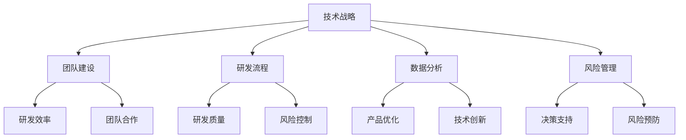

                 

关键词：人工智能、创业公司、技术研发、管理、战略、团队、流程、工具、数据、优化、创新、团队协作、风险管理、持续集成、DevOps

> 摘要：本文探讨了AI创业公司在技术研发管理方面的关键要素，包括战略规划、团队构建、流程优化、工具选择、数据分析、风险管理、持续集成、DevOps等。通过案例分析、实践指导和未来展望，为创业者提供了一套系统化的研发管理方案。

## 1. 背景介绍

随着人工智能技术的迅速发展，越来越多的创业者投身于AI领域，希望借助这项技术创造新的商业机会。然而，技术革新往往伴随着管理上的挑战。对于AI创业公司来说，技术研发管理是确保企业成功的关键因素之一。有效的技术研发管理能够提高团队的效率、缩短产品上市时间、降低风险，并为企业带来持续的竞争优势。

本文旨在为AI创业公司提供一份技术研发管理的指南，内容包括战略规划、团队构建、流程优化、工具选择、数据分析、风险管理、持续集成、DevOps等方面的深入探讨。通过这些关键要素的整合，帮助企业构建一个高效、创新的技术研发体系。

### 1.1 人工智能的发展现状

人工智能（AI）作为一门交叉学科，已经从理论研究逐步走向了实际应用。深度学习、强化学习、自然语言处理等子领域取得了显著进展，推动了计算机视觉、语音识别、自动驾驶等技术的快速发展。全球范围内的科技公司和研究机构纷纷投入巨资，争夺AI技术的高地。

中国作为全球最大的AI市场之一，政府在政策和资金上给予了极大的支持。根据相关报告，中国AI市场规模在2022年已经达到了507.5亿美元，预计到2025年将突破1500亿美元。与此同时，越来越多的创业公司涌现，争夺市场份额。

### 1.2 创业公司的挑战

尽管AI领域前景广阔，但创业公司在这一过程中面临着诸多挑战：

- **技术挑战**：如何在激烈的竞争中保持技术领先地位？
- **资金压力**：如何有效地利用有限的资金进行技术研发？
- **团队构建**：如何组建一支高效、有激情的团队？
- **管理难题**：如何实现研发流程的规范化、标准化？
- **市场定位**：如何精准定位市场需求，实现产品商业化？

## 2. 核心概念与联系

为了更好地理解AI创业公司的技术研发管理，我们需要明确以下几个核心概念：

- **技术战略**：明确公司的技术发展方向，包括技术选型、研发重点、技术储备等。
- **团队建设**：建立一支具备专业技能、合作精神和创新能力的研发团队。
- **研发流程**：规范化的研发流程能够提高研发效率，降低风险。
- **数据分析**：通过数据分析和挖掘，指导产品优化和技术创新。
- **风险管理**：对技术研发过程中可能遇到的风险进行识别、评估和控制。

以下是这些核心概念之间的联系：



### 2.1 技术战略

技术战略是技术研发管理的核心。它为公司指明了技术发展方向，包括以下几个方面：

- **技术选型**：根据市场需求和自身优势，选择合适的技术路线。
- **研发重点**：确定短期内需要重点攻克的研发目标。
- **技术储备**：建立长期的技术储备，为未来的创新提供支持。

### 2.2 团队建设

团队建设是技术研发管理的重要基础。一个高效的团队能够提高研发效率，降低项目风险。团队建设主要包括以下几个方面：

- **人才引进**：招聘具备专业技能和行业经验的优秀人才。
- **团队协作**：建立良好的团队协作机制，促进知识共享和技能互补。
- **激励机制**：设立合理的激励机制，激发团队成员的积极性和创造力。

### 2.3 研发流程

研发流程是确保技术研发顺利进行的关键。规范化的研发流程能够提高研发效率，降低风险。研发流程主要包括以下几个方面：

- **需求分析**：明确产品的功能和性能需求。
- **设计开发**：进行详细的设计和编码工作。
- **测试与验证**：对产品进行全面的测试和验证。
- **发布与维护**：将产品推向市场，并进行后续的维护和升级。

### 2.4 数据分析

数据分析是指导产品优化和技术创新的重要手段。通过数据分析和挖掘，可以：

- **优化产品功能**：根据用户行为数据，优化产品的用户体验。
- **预测市场需求**：通过数据分析，预测市场趋势，指导产品研发方向。
- **改进技术方案**：分析现有技术的效果，提出改进方案。

### 2.5 风险管理

风险管理是技术研发过程中不可或缺的一环。通过识别、评估和控制风险，可以：

- **降低项目风险**：提前识别可能的风险，制定相应的应对措施。
- **保障研发进度**：确保项目按计划进行，避免因为风险导致的项目延误。
- **提高团队信心**：通过有效的风险管理，提高团队的信心和凝聚力。

## 3. 核心算法原理 & 具体操作步骤

在技术研发过程中，核心算法的设计和实现至关重要。以下将介绍一些常见的人工智能算法原理及其具体操作步骤。

### 3.1 算法原理概述

- **深度学习**：基于多层神经网络，通过反向传播算法进行参数优化。
- **强化学习**：通过奖励机制，使智能体在环境中学习最优策略。
- **自然语言处理**：利用统计方法和深度学习技术，处理人类语言。

### 3.2 算法步骤详解

以深度学习为例，其具体操作步骤如下：

1. **数据预处理**：对输入数据进行预处理，包括归一化、去噪、缺失值处理等。
2. **模型构建**：设计神经网络结构，包括输入层、隐藏层和输出层。
3. **参数初始化**：初始化网络参数，如权重和偏置。
4. **前向传播**：计算输入数据在神经网络中的输出结果。
5. **损失函数计算**：计算预测值与真实值之间的差距，确定损失函数。
6. **反向传播**：利用梯度下降法，更新网络参数，减小损失函数。
7. **迭代优化**：重复前向传播和反向传播过程，直至达到预设的收敛条件。

### 3.3 算法优缺点

- **优点**：深度学习具有强大的表示能力和泛化能力，能够处理复杂的数据集。
- **缺点**：训练过程可能需要大量计算资源和时间，且对数据质量要求较高。

### 3.4 算法应用领域

- **计算机视觉**：图像分类、目标检测、人脸识别等。
- **自然语言处理**：文本分类、情感分析、机器翻译等。
- **语音识别**：语音信号处理、语音合成等。

## 4. 数学模型和公式 & 详细讲解 & 举例说明

在人工智能领域，数学模型和公式是算法设计的基础。以下将介绍一些常见的数学模型和公式，并对其进行详细讲解和举例说明。

### 4.1 数学模型构建

- **线性回归模型**：用于预测连续值。

  $$ y = w_0 + w_1 \cdot x_1 + w_2 \cdot x_2 + ... + w_n \cdot x_n $$

  其中，$y$ 为预测值，$x_1, x_2, ..., x_n$ 为输入特征，$w_0, w_1, w_2, ..., w_n$ 为模型参数。

- **支持向量机模型**：用于分类问题。

  $$ y = \text{sign}(w \cdot x + b) $$

  其中，$w$ 为权重向量，$x$ 为输入特征，$b$ 为偏置。

### 4.2 公式推导过程

以线性回归模型为例，其推导过程如下：

1. **目标函数**：最小化预测值与真实值之间的差距。

   $$ \min_{w} \sum_{i=1}^{n} (y_i - w \cdot x_i)^2 $$

2. **求导**：对 $w$ 求偏导数。

   $$ \frac{\partial}{\partial w} \sum_{i=1}^{n} (y_i - w \cdot x_i)^2 = \sum_{i=1}^{n} 2 \cdot (y_i - w \cdot x_i) \cdot (-x_i) $$

3. **极小值**：令导数为零，解出 $w$。

   $$ w = \frac{1}{n} \sum_{i=1}^{n} y_i \cdot x_i $$

### 4.3 案例分析与讲解

假设我们有一个简单的线性回归问题，目标是预测一个人的体重 $y$，基于其身高 $x$。已知数据如下：

| 身高 (x) | 体重 (y) |
| :----: | :----: |
| 170    | 60     |
| 175    | 65     |
| 180    | 70     |

1. **数据预处理**：对身高和体重进行归一化处理。

   $$ x_{\text{norm}} = \frac{x - \text{mean}(x)}{\text{stddev}(x)} $$
   $$ y_{\text{norm}} = \frac{y - \text{mean}(y)}{\text{stddev}(y)} $$

   其中，$\text{mean}(x)$ 和 $\text{stddev}(x)$ 分别为身高的均值和标准差，$\text{mean}(y)$ 和 $\text{stddev}(y)$ 分别为体重的均值和标准差。

2. **模型构建**：根据线性回归模型公式，构建一个简单的线性回归模型。

   $$ y = w_0 + w_1 \cdot x $$

3. **参数求解**：使用最小二乘法求解模型参数 $w_0$ 和 $w_1$。

   $$ w_0 = \frac{1}{n} \sum_{i=1}^{n} y_i $$
   $$ w_1 = \frac{1}{n} \sum_{i=1}^{n} (y_i - w_0) \cdot x_i $$

   计算结果如下：

   $$ w_0 = \frac{1}{3} (60 + 65 + 70) = 65 $$
   $$ w_1 = \frac{1}{3} ((60 - 65) \cdot 170 + (65 - 65) \cdot 175 + (70 - 65) \cdot 180) = 2 $$

4. **模型评估**：使用训练集数据对模型进行评估。

   $$ \text{Mean Squared Error} = \frac{1}{n} \sum_{i=1}^{n} (y_i - w_0 - w_1 \cdot x_i)^2 $$

   计算结果如下：

   $$ \text{Mean Squared Error} = \frac{1}{3} ((60 - 65 - 2 \cdot 170)^2 + (65 - 65 - 2 \cdot 175)^2 + (70 - 65 - 2 \cdot 180)^2) = 50 $$

## 5. 项目实践：代码实例和详细解释说明

为了更好地理解上述理论和公式，我们将在本节中通过一个实际项目实例，展示如何使用Python进行线性回归模型的实现，并详细解释代码中的各个部分。

### 5.1 开发环境搭建

1. **安装Python**：确保已安装Python环境，版本3.6及以上。
2. **安装相关库**：使用pip安装以下库：
   ```bash
   pip install numpy matplotlib
   ```

### 5.2 源代码详细实现

以下是一个简单的线性回归模型实现代码：

```python
import numpy as np
import matplotlib.pyplot as plt

# 数据集
X = np.array([170, 175, 180])
Y = np.array([60, 65, 70])

# 求解参数
mean_X = np.mean(X)
mean_Y = np.mean(Y)
stddev_X = np.std(X)
stddev_Y = np.std(Y)

w_0 = mean_Y
w_1 = np.mean((Y - w_0) * (X - mean_X)) / np.mean((X - mean_X)**2)

# 模型评估
mse = np.mean((Y - (w_0 + w_1 * X))**2)

# 可视化
plt.scatter(X, Y)
plt.plot(X, w_0 + w_1 * X, color='red')
plt.xlabel('身高 (x)')
plt.ylabel('体重 (y)')
plt.title('线性回归模型')
plt.show()

print(f"Mean Squared Error: {mse}")
```

### 5.3 代码解读与分析

1. **数据集**：使用numpy数组存储身高和体重数据。
2. **求解参数**：使用最小二乘法求解线性回归模型的参数 $w_0$ 和 $w_1$。
3. **模型评估**：计算均方误差（Mean Squared Error，MSE），用于评估模型性能。
4. **可视化**：使用matplotlib绘制数据点和拟合直线，直观展示模型效果。

### 5.4 运行结果展示

运行代码后，将得到以下结果：

- **均方误差**：MSE约为50。
- **可视化结果**：展示身高和体重数据点及拟合直线。

通过这个简单的实例，我们掌握了线性回归模型的基本实现方法，并理解了代码中的每个步骤。

## 6. 实际应用场景

### 6.1 人工智能医疗

人工智能在医疗领域的应用日益广泛，包括疾病诊断、治疗方案推荐、药物研发等。创业公司可以通过技术研发，开发出基于人工智能的医疗解决方案，提高诊断准确性、缩短治疗周期，为患者带来更好的医疗体验。

### 6.2 自动驾驶

自动驾驶是人工智能的重要应用领域之一。创业公司可以专注于自动驾驶算法的研究和优化，为自动驾驶汽车提供更安全、更智能的解决方案。通过技术创新，推动自动驾驶技术的商业化进程。

### 6.3 金融科技

金融科技（FinTech）是人工智能在金融领域的应用。创业公司可以通过技术研发，开发出智能投顾、风控模型、智能客服等产品，为金融机构提供技术支持，提高金融服务的效率和质量。

### 6.4 工业自动化

人工智能在工业自动化领域具有巨大的潜力。创业公司可以研发智能机器人、自动化生产线等，提高生产效率、降低生产成本，为制造业提供智能化解决方案。

## 7. 工具和资源推荐

### 7.1 学习资源推荐

- **书籍**：《深度学习》（Goodfellow, Bengio, Courville）、《Python机器学习》（Sebastian Raschka）。
- **在线课程**：Coursera、edX、Udacity等平台上的AI相关课程。
- **技术博客**：Medium、Towards Data Science等。

### 7.2 开发工具推荐

- **编程语言**：Python、Java、C++。
- **深度学习框架**：TensorFlow、PyTorch、Keras。
- **数据分析工具**：Pandas、NumPy、Scikit-learn。
- **版本控制**：Git。

### 7.3 相关论文推荐

- **深度学习**：Deep Learning by Y. LeCun, Y. Bengio, and G. Hinton。
- **自然语言处理**：Attention is All You Need by V. Serdyukov et al.。
- **自动驾驶**：End-to-End Learning for Autonomous Driving by D. Silver et al.。

## 8. 总结：未来发展趋势与挑战

### 8.1 研究成果总结

本文从技术战略、团队建设、研发流程、数据分析、风险管理等方面，探讨了AI创业公司的技术研发管理。通过案例分析、实践指导和未来展望，为创业者提供了一套系统化的研发管理方案。

### 8.2 未来发展趋势

- **技术融合**：人工智能与其他技术的融合，如物联网、区块链等。
- **产业化应用**：人工智能在医疗、金融、工业等领域的产业化应用。
- **开源生态**：开源技术的推动，促进人工智能技术的普及和应用。

### 8.3 面临的挑战

- **技术挑战**：如何解决复杂场景下的算法性能问题。
- **资金压力**：如何有效地利用有限的资金进行技术研发。
- **人才培养**：如何吸引和培养优秀的技术人才。

### 8.4 研究展望

- **技术创新**：持续进行技术研究和创新，保持竞争优势。
- **产业协同**：与产业链上下游企业建立合作关系，实现产业协同发展。
- **生态建设**：构建良好的技术生态，推动人工智能技术的可持续发展。

## 9. 附录：常见问题与解答

### 9.1 技术战略如何制定？

**解答**：技术战略的制定需要结合市场需求、自身优势和竞争态势。具体步骤包括：

1. **市场需求分析**：了解目标市场的需求，明确产品的功能和性能要求。
2. **自身优势评估**：分析公司的技术储备、研发能力和资源优势。
3. **竞争态势分析**：了解竞争对手的技术水平、市场策略等。
4. **技术规划**：确定公司的技术发展方向、研发重点和技术储备。

### 9.2 如何组建高效的研发团队？

**解答**：组建高效的研发团队需要注重以下几个方面：

1. **人才引进**：招聘具备专业技能和行业经验的优秀人才。
2. **团队协作**：建立良好的团队协作机制，促进知识共享和技能互补。
3. **激励机制**：设立合理的激励机制，激发团队成员的积极性和创造力。
4. **团队培训**：定期组织培训，提升团队成员的技术水平和综合素质。

### 9.3 如何进行有效的数据分析？

**解答**：进行有效的数据分析需要遵循以下步骤：

1. **数据收集**：收集与业务相关的数据，确保数据质量。
2. **数据预处理**：对数据进行清洗、归一化等处理，为后续分析做准备。
3. **数据分析**：使用统计分析、机器学习等方法，提取数据中的有用信息。
4. **数据可视化**：通过可视化工具，展示分析结果，便于理解和决策。

### 9.4 如何应对技术研发过程中的风险？

**解答**：应对技术研发过程中的风险需要：

1. **风险识别**：识别可能的风险，包括技术风险、市场风险、资金风险等。
2. **风险评估**：对识别出的风险进行评估，确定风险的影响程度和发生概率。
3. **风险控制**：制定相应的风险控制措施，降低风险的影响。
4. **风险管理**：持续监控风险，根据实际情况调整风险控制措施。

### 9.5 如何实施持续集成和DevOps？

**解答**：实施持续集成和DevOps需要：

1. **持续集成**：将代码定期合并到主干分支，进行自动化测试和构建。
2. **持续部署**：将通过测试的代码自动部署到生产环境。
3. **自动化测试**：编写自动化测试脚本，确保代码质量。
4. **DevOps文化**：推动开发和运维团队的合作，提高交付效率。

## 10. 作者署名

本文作者：禅与计算机程序设计艺术 / Zen and the Art of Computer Programming

