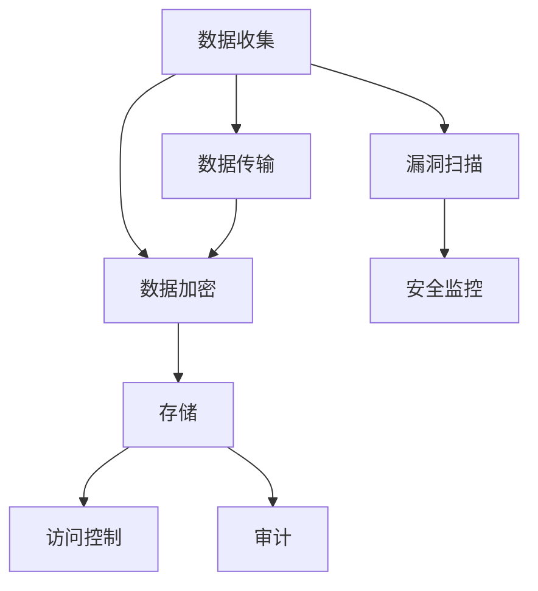

                 

关键词：数据安全、AI、创业公司、加密、隐私保护、合规性

> 摘要：随着人工智能技术的迅猛发展，AI创业公司在数据处理和存储过程中面临着前所未有的安全挑战。本文将深入探讨AI创业公司的数据安全策略，包括数据加密、隐私保护、合规性以及常见安全漏洞的应对方法，以期为AI创业公司的数据安全提供实用指南。

## 1. 背景介绍

近年来，人工智能（AI）技术飞速发展，已经在金融、医疗、零售、制造等多个领域产生了深远影响。许多创业者纷纷投身于AI创业浪潮中，希望通过创新的AI应用改变世界。然而，随着数据的规模和复杂性不断增加，数据安全问题变得愈发突出。

AI创业公司面临着以下数据安全挑战：

- **数据泄露风险**：大量敏感数据在收集、存储、处理和传输过程中可能被未授权访问。
- **数据篡改风险**：恶意攻击者可能篡改数据，导致模型训练结果失真。
- **合规性问题**：需要遵循多种法律法规，如《通用数据保护条例》（GDPR）、《加州消费者隐私法案》（CCPA）等。
- **内部威胁**：员工误操作或恶意行为也可能导致数据泄露。

## 2. 核心概念与联系

### 2.1 数据安全策略的核心概念

数据安全策略包括以下核心概念：

- **加密**：通过加密技术保护数据在传输和存储过程中的安全性。
- **访问控制**：通过访问控制机制确保只有授权用户可以访问敏感数据。
- **审计**：记录系统中的所有活动，以便在出现问题时进行追踪。
- **漏洞扫描**：定期扫描系统以发现和修复潜在的安全漏洞。

### 2.2 数据安全架构

以下是一个简化版的数据安全架构，用于展示各个核心概念之间的联系：



## 3. 核心算法原理 & 具体操作步骤

### 3.1 算法原理概述

数据安全策略的核心在于加密技术。加密技术通过将明文数据转换为密文，确保数据在未经授权的情况下无法被读取。常用的加密算法包括对称加密和非对称加密。

- **对称加密**：加密和解密使用相同的密钥，如AES。
- **非对称加密**：加密和解密使用不同的密钥，如RSA。

### 3.2 算法步骤详解

1. **数据加密**

   - 对敏感数据进行加密。
   - 使用对称加密算法（如AES）生成一个密钥。
   - 将密钥使用非对称加密算法（如RSA）加密，并与数据一起存储或传输。

2. **数据解密**

   - 接收加密数据。
   - 使用非对称加密算法解密密钥。
   - 使用解密后的密钥对数据进行解密。

### 3.3 算法优缺点

- **对称加密**：速度快，但密钥管理复杂。
- **非对称加密**：密钥管理简单，但速度较慢。

### 3.4 算法应用领域

加密技术广泛应用于各种数据安全场景，包括：

- 数据存储：确保存储在数据库中的数据安全。
- 数据传输：确保数据在网络传输过程中的安全。
- 数据访问：确保只有授权用户可以访问敏感数据。

## 4. 数学模型和公式 & 详细讲解 & 举例说明

### 4.1 数学模型构建

加密和解密过程可以使用以下数学模型表示：

- **加密**：$C = E_K(P)$，其中$C$是加密后的数据，$K$是密钥，$P$是明文数据。
- **解密**：$P = D_K(C)$，其中$C$是加密后的数据，$K$是密钥，$P$是解密后的数据。

### 4.2 公式推导过程

- 对称加密算法（如AES）的加密和解密公式：
  - $C = \text{AES}_K(P)$
  - $P = \text{AES}_K(C)$
- 非对称加密算法（如RSA）的加密和解密公式：
  - $C = M^e \mod N$
  - $P = C^d \mod N$

### 4.3 案例分析与讲解

假设使用AES和RSA加密算法对数据$P = "Hello, World!"$进行加密和解密。

1. **AES加密**：

   - 选择密钥$K$。
   - $C = \text{AES}_K(P)$。

2. **RSA加密**：

   - 选择公钥$e$和模数$N$。
   - $C = M^e \mod N$。

3. **RSA解密**：

   - 选择私钥$d$。
   - $P = C^d \mod N$。

## 5. 项目实践：代码实例和详细解释说明

### 5.1 开发环境搭建

- 安装Python环境。
- 安装加密算法库，如`pycryptodome`。

### 5.2 源代码详细实现

```python
from Cryptodome.PublicKey import RSA
from Cryptodome.Cipher import AES, PKCS1_OAEP

# RSA密钥生成
key = RSA.generate(2048)
private_key = key.export_key()
public_key = key.publickey().export_key()

# AES密钥生成
aes_key = AES.keyderivation('sha256', public_key, b'salt', 32)

# RSA加密
cipher_rsa = PKCS1_OAEP.new(RSA.import_key(public_key))
cipher_aes = AES.new(aes_key, AES.MODE_EAX)
ciphertext, tag = cipher_aes.encrypt_and_digest(b'Hello, World!')

# RSA解密
cipher_rsa = PKCS1_OAEP.new(RSA.import_key(private_key))
aes_key = cipher_rsa.decrypt(cipher_aes.nonce)
cipher_aes = AES.new(aes_key, AES.MODE_EAX, nonce=cipher_aes.nonce)
plaintext = cipher_aes.decrypt_and_verify(ciphertext, tag)
print(plaintext.decode())
```

### 5.3 代码解读与分析

- 生成RSA密钥。
- 生成AES密钥。
- 使用RSA加密AES密钥。
- 使用AES加密明文数据。
- 使用RSA解密AES密钥。
- 使用AES解密密文数据。

## 6. 实际应用场景

### 6.1 数据存储

在数据存储过程中，加密技术可以确保数据在磁盘上的安全性。例如，使用AES加密数据库中的敏感数据。

### 6.2 数据传输

在数据传输过程中，加密技术可以确保数据在网络传输中的安全性。例如，使用TLS加密HTTP请求。

### 6.3 数据访问

在数据访问过程中，访问控制机制可以确保只有授权用户可以访问敏感数据。例如，使用身份验证和授权机制限制对数据的访问。

## 7. 工具和资源推荐

### 7.1 学习资源推荐

- 《密码学：理论与实践》（密码学入门经典）
- 《Python密码学编程》（Python密码学库的详细使用教程）

### 7.2 开发工具推荐

- PyCryptoDome：Python加密算法库。
- OpenSSL：开源加密库。

### 7.3 相关论文推荐

- "A Survey of Cryptographic Techniques for Data Security"：数据安全加密技术综述。
- "Efficient Cryptographic Techniques for Data Security in Cloud Computing"：云计算中的高效数据安全加密技术。

## 8. 总结：未来发展趋势与挑战

### 8.1 研究成果总结

- 加密技术已成为数据安全的核心手段。
- 多种加密算法和技术的应用不断丰富。
- 数据安全合规性成为企业关注的焦点。

### 8.2 未来发展趋势

- 加密算法的优化和性能提升。
- 数据安全技术的集成和应用。
- 自动化和智能化的数据安全解决方案。

### 8.3 面临的挑战

- 加密算法的安全性和效率之间的平衡。
- 数据安全合规性的全球化和多样化。
- 内部威胁和外部攻击的防范。

### 8.4 研究展望

- 开发更高效、更安全的加密算法。
- 探索新的数据安全技术和应用。
- 加强数据安全合规性管理。

## 9. 附录：常见问题与解答

### 9.1 问题1

**问题**：如何确保加密算法的安全性？

**解答**：确保加密算法的安全性的方法包括：

- 使用经过充分验证的加密算法，如AES和RSA。
- 定期更新加密算法和密钥。
- 遵循最佳安全实践，如使用强密码和双因素认证。

### 9.2 问题2

**问题**：如何处理数据泄露事件？

**解答**：处理数据泄露事件的方法包括：

- 立即停止数据泄露。
- 进行全面调查，找出数据泄露的原因。
- 通知受影响的用户，并提供补救措施。
- 评估和改进现有的数据安全策略。

## 作者署名

作者：禅与计算机程序设计艺术 / Zen and the Art of Computer Programming

----------------------------------------------------------------

以上就是关于《AI创业公司的数据安全策略》的文章内容，希望对您有所帮助。如果您有任何问题或建议，请随时告诉我。谢谢！

