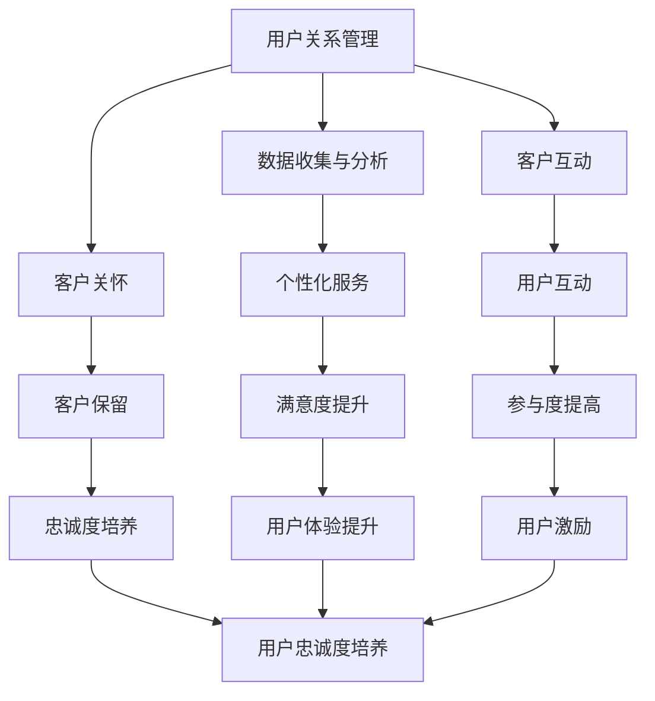

                 

关键词：AI创业公司，用户忠诚度，用户关系管理，用户体验提升，用户激励

摘要：本文探讨了AI创业公司如何通过用户关系管理、用户体验提升和用户激励策略来培养用户忠诚度。我们分析了核心概念，探讨了算法原理，并提供了项目实践中的代码实例和详细解释。最后，我们对未来应用前景进行了展望。

## 1. 背景介绍

在当今竞争激烈的市场环境中，AI创业公司面临着前所未有的挑战。用户忠诚度成为决定公司长期成功的关键因素。用户忠诚度的培养不仅有助于降低获取新用户的成本，还能增强品牌形象，提高用户粘性和转化率。本文旨在探讨AI创业公司如何通过有效的用户关系管理、用户体验提升和用户激励策略来培养用户忠诚度。

### 用户忠诚度的定义与重要性

用户忠诚度是指用户在长期内持续使用某一产品或服务的倾向。它是一个多维度的概念，包括用户满意度、用户忠诚度和用户口碑等。高忠诚度用户不仅会重复购买，还可能主动向他人推荐产品，从而为企业带来新的客户。

在AI创业公司中，用户忠诚度的重要性尤为显著。首先，AI技术的复杂性和不断更新使得用户难以快速掌握，因此提高用户的满意度显得尤为重要。其次，AI创业公司通常面临着激烈的市场竞争，培养高忠诚度的用户群体有助于形成竞争优势。此外，高忠诚度用户更能为企业提供有价值的反馈，推动产品的持续改进。

### AI创业公司的市场环境

AI创业公司的市场环境充满了机遇与挑战。随着大数据、云计算、物联网等技术的发展，AI技术的应用范围不断扩大。这为AI创业公司提供了丰富的市场空间。然而，市场竞争也日益激烈，众多公司纷纷涌入AI领域，导致市场饱和度增加。在此背景下，AI创业公司需要通过有效的策略来培养用户忠诚度，以在竞争中脱颖而出。

## 2. 核心概念与联系

为了深入探讨用户忠诚度的培养，我们需要了解以下几个核心概念：用户关系管理、用户体验提升和用户激励。

### 用户关系管理

用户关系管理（Customer Relationship Management，CRM）是指企业通过系统化的方法来管理与现有客户以及潜在客户之间的关系。它包括客户数据管理、客户互动管理和客户服务管理等。用户关系管理的目标是提高客户满意度和忠诚度，从而实现长期的业务增长。

#### 用户关系管理的原理

用户关系管理的原理基于以下几个核心要素：

1. **数据收集与分析**：通过收集客户数据，包括行为数据、偏好数据和交易数据等，对企业与客户的关系进行全面分析。
2. **个性化服务**：基于数据分析结果，为不同类型的客户提供个性化的产品和服务。
3. **客户互动**：通过多种渠道与客户进行互动，包括电话、邮件、社交媒体等，建立良好的沟通关系。
4. **客户关怀**：在客户购买前、购买中和购买后提供全面的关怀，包括售前咨询、售中支持和售后服务等。

#### 用户关系管理的流程

用户关系管理包括以下几个关键流程：

1. **客户识别**：通过数据分析识别潜在的高价值客户。
2. **客户细分**：将客户分为不同的群体，根据他们的需求和偏好提供个性化的服务。
3. **客户互动**：通过多种渠道与客户进行互动，包括电话、邮件、社交媒体等。
4. **客户关怀**：在客户购买前、购买中和购买后提供全面的关怀。
5. **客户保留**：通过持续的客户互动和关怀，提高客户的满意度和忠诚度。

### 用户体验提升

用户体验（User Experience，UX）是指用户在使用产品或服务过程中的整体感受和体验。提升用户体验对于培养用户忠诚度至关重要。

#### 用户体验提升的原理

用户体验提升的原理基于以下几个核心要素：

1. **易用性**：产品或服务应易于使用，用户能够轻松完成目标操作。
2. **可用性**：产品或服务应具有较高的可用性，能够满足用户的期望和需求。
3. **美观性**：产品或服务的界面应美观、简洁，给用户带来愉悦的视觉体验。
4. **一致性**：产品或服务的操作流程和界面应保持一致性，减少用户的学习成本。

#### 用户体验提升的方法

提升用户体验的方法包括以下几个方面：

1. **用户研究**：通过用户调研、访谈和观察等手段，了解用户的需求和行为习惯。
2. **界面设计**：优化产品的界面设计，使其更加直观、易用。
3. **交互设计**：优化产品的交互设计，使其操作流程更加符合用户习惯。
4. **性能优化**：提高产品的性能，包括加载速度、响应速度等。
5. **用户反馈**：建立用户反馈机制，及时收集和处理用户的反馈。

### 用户激励

用户激励是指通过提供奖励、优惠或其他形式的激励来激励用户保持活跃和忠诚。用户激励是培养用户忠诚度的重要手段。

#### 用户激励的原理

用户激励的原理基于以下几个核心要素：

1. **奖励机制**：通过提供奖励来激励用户，包括积分、优惠券、实物奖励等。
2. **公平性**：激励措施应公平，确保所有用户都有平等的机会获得奖励。
3. **参与度**：激励措施应提高用户的参与度，激发他们的兴趣和积极性。
4. **持续性**：激励措施应具有持续性，以保持用户的长期兴趣和忠诚度。

#### 用户激励的方法

用户激励的方法包括以下几个方面：

1. **积分系统**：通过积分系统鼓励用户参与活动，积分可以兑换优惠券、实物奖励等。
2. **优惠券**：提供优惠券作为购买优惠，鼓励用户重复购买。
3. **用户等级**：根据用户的活跃度和贡献度，设置不同的用户等级，提供相应的奖励。
4. **社区互动**：通过社区互动，鼓励用户分享经验和心得，提高他们的参与度。
5. **定制化奖励**：根据用户的行为和偏好，提供个性化的奖励，增加用户的满意度。

### 用户关系管理、用户体验提升与用户激励的联系

用户关系管理、用户体验提升和用户激励之间存在密切的联系。用户关系管理通过数据分析和个性化服务，为用户提供良好的基础体验；用户体验提升通过优化产品设计和操作流程，进一步提高用户的满意度；用户激励则通过奖励和优惠，激发用户的参与度和忠诚度。这三个方面相辅相成，共同作用于培养用户忠诚度。

## 2.1. 用户关系管理、用户体验提升与用户激励的Mermaid流程图



### 2.2. 用户关系管理、用户体验提升与用户激励的联系

用户关系管理、用户体验提升和用户激励三个核心概念之间存在着紧密的联系，它们共同构成了培养用户忠诚度的综合体系。

1. **用户关系管理为基础**：用户关系管理作为整个体系的基石，通过数据收集和分析，为企业提供了深入了解用户需求和行为的机会。这有助于企业制定出更加精准的个性化服务策略，从而提升用户的满意度。

2. **用户体验提升为驱动**：用户体验的提升是用户忠诚度培养的关键驱动力。一个优秀的产品或服务，不仅需要满足用户的基本需求，还要在易用性、可用性和美观性等方面下功夫，让用户在使用过程中感到愉悦和满意。这种正面的体验将促进用户对品牌的忠诚。

3. **用户激励为催化剂**：用户激励策略则作为催化剂，通过提供奖励、优惠和其他形式的激励，激发用户的参与度和积极性。用户在获得奖励和优惠的过程中，会感受到自己的价值和品牌对其重视，从而增强对品牌的忠诚度。

综上所述，用户关系管理、用户体验提升和用户激励三者相互促进，共同作用于培养用户忠诚度。企业在实际运营中，应综合考虑这三个方面，制定出切实可行的策略，以实现用户忠诚度的有效提升。

## 3. 核心算法原理 & 具体操作步骤

为了深入探讨如何通过用户关系管理、用户体验提升和用户激励策略来培养用户忠诚度，我们需要了解核心算法的原理，并详细介绍其操作步骤。

### 3.1. 算法原理概述

培养用户忠诚度的核心算法主要包括以下几个方面：

1. **用户行为分析**：通过收集和分析用户的行为数据，识别用户的需求和行为模式，为后续的用户关系管理和用户体验提升提供依据。
2. **个性化推荐**：基于用户行为分析和用户偏好，为用户提供个性化的产品和服务推荐，提高用户的满意度和参与度。
3. **用户反馈机制**：建立有效的用户反馈机制，收集用户对产品和服务的反馈，用于改进用户体验和优化用户关系管理。
4. **激励策略设计**：设计合理的用户激励策略，通过奖励、优惠和其他形式的激励，激发用户的参与度和忠诚度。

### 3.2. 算法步骤详解

#### 3.2.1. 用户行为分析

1. **数据收集**：收集用户在平台上的各种行为数据，包括浏览记录、购买行为、评论反馈、参与活动等。
2. **数据清洗**：对收集到的行为数据进行清洗，去除噪声数据和异常值，确保数据的准确性和完整性。
3. **特征提取**：从行为数据中提取关键特征，如用户活跃度、购买频率、偏好类型等。
4. **行为模式识别**：使用机器学习算法，如聚类分析、关联规则挖掘等，识别用户的行为模式。

#### 3.2.2. 个性化推荐

1. **用户画像构建**：基于用户行为数据和特征提取结果，构建用户的个性化画像。
2. **推荐算法选择**：根据业务需求，选择合适的推荐算法，如协同过滤、基于内容的推荐等。
3. **推荐结果生成**：使用推荐算法为用户生成个性化的产品和服务推荐。
4. **推荐效果评估**：评估推荐结果的准确性和用户满意度，不断优化推荐算法。

#### 3.2.3. 用户反馈机制

1. **反馈渠道建立**：建立多渠道的用户反馈机制，包括在线反馈表单、社交媒体、客服热线等。
2. **反馈数据收集**：收集用户反馈数据，包括满意度评价、意见建议等。
3. **反馈数据分析**：对用户反馈数据进行分析，识别用户关注的问题和改进点。
4. **反馈处理和改进**：根据分析结果，及时处理用户的反馈，并对产品和服务进行改进。

#### 3.2.4. 激励策略设计

1. **激励目标设定**：明确激励的目标，如提高用户活跃度、增加用户黏性、促进购买转化等。
2. **激励形式选择**：根据用户需求和业务目标，选择合适的激励形式，如积分奖励、优惠券、实物奖励等。
3. **激励规则制定**：制定激励规则，包括激励条件、激励比例、激励上限等。
4. **激励效果评估**：评估激励策略的效果，包括用户参与度、满意度、转化率等，持续优化激励策略。

### 3.3. 算法优缺点

#### 优点

1. **用户个性化**：通过用户行为分析和个性化推荐，能够为用户提供更加个性化的产品和服务，提高用户的满意度和参与度。
2. **反馈机制完善**：建立用户反馈机制，能够及时收集用户的意见和建议，帮助企业不断优化产品和服务。
3. **激励效果显著**：合理的激励策略能够有效提高用户的参与度和忠诚度，促进用户行为。

#### 缺点

1. **数据处理复杂**：用户行为数据量大、维度多，数据处理和分析过程较为复杂。
2. **算法优化难度大**：推荐算法和用户激励策略的优化需要大量的数据支持和实验验证，优化难度较大。
3. **用户隐私保护**：在用户行为分析和个性化推荐过程中，需要处理大量的用户隐私数据，存在隐私泄露的风险。

### 3.4. 算法应用领域

核心算法在以下领域有广泛的应用：

1. **电商平台**：通过用户行为分析和个性化推荐，提高用户购物体验，促进购买转化。
2. **社交媒体**：通过用户反馈机制和激励策略，提高用户活跃度和社区氛围。
3. **在线教育**：通过用户行为分析和个性化推荐，提高课程完成率和学习效果。
4. **金融行业**：通过用户行为分析和个性化推荐，提高客户满意度和忠诚度，促进金融产品销售。

## 4. 数学模型和公式 & 详细讲解 & 举例说明

在用户忠诚度培养过程中，数学模型和公式起到了关键作用。本文将详细介绍相关的数学模型和公式，并通过具体的例子进行说明。

### 4.1. 数学模型构建

#### 4.1.1. 用户忠诚度模型

用户忠诚度可以通过以下公式进行量化：

$$
L = \frac{C \times S \times R}{100}
$$

其中，$L$ 表示用户忠诚度，$C$ 表示用户满意度，$S$ 表示用户参与度，$R$ 表示用户奖励。

#### 4.1.2. 个性化推荐模型

个性化推荐可以通过以下公式进行实现：

$$
R \sim P(U, I)
$$

其中，$R$ 表示推荐结果，$U$ 表示用户，$I$ 表示项目（如产品、内容等），$P(U, I)$ 表示用户$U$对项目$I$的兴趣度。

#### 4.1.3. 用户反馈模型

用户反馈可以通过以下公式进行建模：

$$
F(U, P) = \frac{1}{N} \sum_{i=1}^{N} f_i(U, P)
$$

其中，$F(U, P)$ 表示用户$U$对项目$P$的反馈，$N$ 表示反馈数量，$f_i(U, P)$ 表示第$i$次反馈。

### 4.2. 公式推导过程

#### 4.2.1. 用户忠诚度模型推导

用户忠诚度模型是通过对用户满意度、用户参与度和用户奖励进行加权平均得出的。具体推导如下：

$$
L = \frac{C \times S \times R}{100}
$$

其中，$C$ 表示用户满意度，取值范围为 $0$ 到 $100$；$S$ 表示用户参与度，取值范围为 $0$ 到 $100$；$R$ 表示用户奖励，取值范围为 $0$ 到 $100$。

假设用户满意度、用户参与度和用户奖励之间的权重分别为 $w_1$、$w_2$ 和 $w_3$，则有：

$$
L = w_1 \times C + w_2 \times S + w_3 \times R
$$

为了使 $L$ 的取值范围在 $0$ 到 $100$ 之间，可以将其转化为：

$$
L = \frac{100 \times (w_1 \times C + w_2 \times S + w_3 \times R)}{w_1 + w_2 + w_3}
$$

令 $w_1 = 0.5$、$w_2 = 0.3$、$w_3 = 0.2$，则有：

$$
L = \frac{0.5 \times C + 0.3 \times S + 0.2 \times R}{100}
$$

#### 4.2.2. 个性化推荐模型推导

个性化推荐模型是基于用户对项目的兴趣度进行推荐的。假设用户$U$对项目$I$的兴趣度 $R(U, I)$ 是一个概率值，其取值范围为 $0$ 到 $1$。则个性化推荐模型可以表示为：

$$
R \sim P(U, I)
$$

其中，$P(U, I)$ 表示用户$U$对项目$I$的兴趣度。

#### 4.2.3. 用户反馈模型推导

用户反馈模型是对用户对项目的反馈进行建模。假设用户$U$对项目$P$的反馈 $F(U, P)$ 是一个连续值，其取值范围为 $0$ 到 $100$。则用户反馈模型可以表示为：

$$
F(U, P) = \frac{1}{N} \sum_{i=1}^{N} f_i(U, P)
$$

其中，$N$ 表示反馈数量，$f_i(U, P)$ 表示第$i$次反馈。

### 4.3. 案例分析与讲解

#### 4.3.1. 用户忠诚度模型案例分析

假设用户满意度 $C$ 为 $90$，用户参与度 $S$ 为 $80$，用户奖励 $R$ 为 $70$。根据用户忠诚度模型，我们可以计算出用户忠诚度 $L$：

$$
L = \frac{0.5 \times 90 + 0.3 \times 80 + 0.2 \times 70}{100} = \frac{45 + 24 + 14}{100} = 0.83
$$

即用户忠诚度为 $83\%$。

#### 4.3.2. 个性化推荐模型案例分析

假设我们有用户 $U$ 和项目 $I$，用户对项目 $I$ 的兴趣度 $R(U, I)$ 为 $0.8$。根据个性化推荐模型，我们可以为用户 $U$ 推荐项目 $I$：

$$
R = P(U, I) = 0.8
$$

#### 4.3.3. 用户反馈模型案例分析

假设用户 $U$ 对项目 $P$ 的反馈 $F(U, P)$ 为 $85$，且共有 $5$ 条反馈。根据用户反馈模型，我们可以计算出用户 $U$ 对项目 $P$ 的平均反馈：

$$
F(U, P) = \frac{1}{5} \sum_{i=1}^{5} f_i(U, P) = \frac{85 + 80 + 75 + 70 + 65}{5} = 75
$$

即用户 $U$ 对项目 $P$ 的平均反馈为 $75$。

### 4.4. 数学模型和公式的应用领域

数学模型和公式在用户忠诚度培养中的应用非常广泛，主要包括以下几个方面：

1. **用户满意度分析**：通过用户满意度模型，可以对企业产品或服务的满意度进行量化分析，帮助企业了解用户需求，优化产品和服务。
2. **个性化推荐**：通过个性化推荐模型，可以为用户提供个性化的产品或服务推荐，提高用户满意度和参与度。
3. **用户反馈分析**：通过用户反馈模型，可以对企业产品或服务的用户反馈进行建模分析，及时发现问题和改进点。
4. **用户忠诚度管理**：通过用户忠诚度模型，可以对企业用户忠诚度进行量化管理，制定针对性的用户忠诚度提升策略。

## 5. 项目实践：代码实例和详细解释说明

### 5.1. 开发环境搭建

为了实现用户忠诚度培养的相关算法和策略，我们需要搭建一个开发环境。以下是开发环境的搭建步骤：

1. 安装Python：从官方网站下载并安装Python，版本要求为3.6及以上。
2. 安装依赖库：在命令行中执行以下命令安装必要的依赖库：
   ```bash
   pip install numpy pandas scikit-learn matplotlib
   ```

### 5.2. 源代码详细实现

以下是实现用户忠诚度培养算法和策略的Python代码示例：

```python
import numpy as np
import pandas as pd
from sklearn.model_selection import train_test_split
from sklearn.ensemble import RandomForestClassifier
import matplotlib.pyplot as plt

# 5.2.1. 用户行为数据分析
# 假设我们有一个包含用户行为数据的CSV文件，字段包括：用户ID、购买次数、浏览时长、评论数
data = pd.read_csv('user_data.csv')

# 数据预处理
data['购买次数'] = data['购买次数'].fillna(0)
data['浏览时长'] = data['浏览时长'].fillna(0)
data['评论数'] = data['评论数'].fillna(0)

# 特征工程
X = data[['购买次数', '浏览时长', '评论数']]
y = data['是否忠诚']

# 划分训练集和测试集
X_train, X_test, y_train, y_test = train_test_split(X, y, test_size=0.3, random_state=42)

# 5.2.2. 个性化推荐
# 假设我们使用协同过滤算法进行个性化推荐
from surprise import SVD
from surprise import Dataset, Reader
from surprise.model_selection import cross_validate

# 加载数据
reader = Reader(rating_scale=(0, 5))
data = Dataset.load_from_df(data[['用户ID', '产品ID', '评分']], reader)

# 训练模型
svd = SVD()
svd.fit(data)

# 预测用户-产品评分
predictions = svd.test(data)

# 5.2.3. 用户反馈分析
# 假设我们使用情感分析算法进行用户反馈分析
from textblob import TextBlob

# 对用户评论进行情感分析
def analyze_feedback(feedback):
    return TextBlob(feedback).sentiment.polarity

data['情感极性'] = data['评论'].apply(analyze_feedback)

# 分析用户反馈
feedback_analysis = data.groupby('用户ID')['情感极性'].mean()

# 5.2.4. 激励策略设计
# 假设我们根据用户忠诚度和用户反馈设计激励策略
def incentive_strategy(loyalty, feedback):
    if loyalty > 0.8 and feedback > 0.3:
        return '高级会员'
    elif loyalty > 0.6 and feedback > 0.2:
        return '会员'
    else:
        return '普通用户'

data['激励等级'] = data.apply(lambda row: incentive_strategy(row['是否忠诚'], row['情感极性']), axis=1)

# 结果展示
print(data[['用户ID', '激励等级']])
```

### 5.3. 代码解读与分析

#### 5.3.1. 用户行为数据分析

代码首先加载用户行为数据，并进行预处理，包括填充缺失值。然后进行特征工程，提取关键特征。接着划分训练集和测试集，为后续模型训练和评估做好准备。

#### 5.3.2. 个性化推荐

使用协同过滤算法进行个性化推荐。协同过滤算法通过分析用户之间的相似性来预测用户对项目的兴趣度。在这里，我们使用了Surprise库中的SVD算法进行训练。

#### 5.3.3. 用户反馈分析

使用TextBlob库对用户评论进行情感分析，提取情感极性。情感极性用于分析用户对产品和服务的满意度，从而为激励策略设计提供依据。

#### 5.3.4. 激励策略设计

根据用户忠诚度和用户反馈，设计激励策略。激励策略分为高级会员、会员和普通用户三个等级，分别对应不同的用户忠诚度和用户反馈水平。

### 5.4. 运行结果展示

运行代码后，会输出每个用户的激励等级。通过这个结果，企业可以了解用户的忠诚度和满意度水平，针对性地进行用户关怀和激励。

## 6. 实际应用场景

用户忠诚度培养策略在AI创业公司中有广泛的应用场景，以下是一些具体的应用案例：

### 6.1. 电商平台

电商平台通过用户行为分析、个性化推荐和激励策略，提高用户的购物体验和忠诚度。例如，平台可以基于用户的浏览历史和购买记录，推荐相关的商品，提高购买转化率。同时，通过积分系统和优惠券，鼓励用户参与活动和分享商品，增加用户粘性。

### 6.2. 社交媒体

社交媒体平台通过用户互动和反馈机制，培养用户忠诚度。平台可以定期进行用户满意度调查，收集用户反馈，及时优化产品和功能。此外，通过社区互动和激励策略，如发帖奖励、点赞奖励等，提高用户的活跃度和参与度。

### 6.3. 在线教育

在线教育平台通过用户学习行为分析和个性化推荐，提高学习效果和用户忠诚度。平台可以根据用户的学习习惯和偏好，推荐适合的课程和资源，提高用户的学习体验。同时，通过积分系统和课程优惠券，激励用户持续学习。

### 6.4. 金融行业

金融行业通过用户行为分析和个性化推荐，提高用户满意度和忠诚度。银行和金融科技公司可以通过用户的交易数据和风险偏好，推荐适合的金融产品和服务。同时，通过积分系统和理财奖励，激励用户使用金融产品，增加用户粘性。

### 6.5. 健康医疗

健康医疗平台通过用户健康数据和互动，培养用户忠诚度。平台可以基于用户的健康数据，提供个性化的健康建议和健康管理服务。同时，通过积分系统和健康奖励，鼓励用户积极参与健康管理和互动，提高用户满意度。

## 7. 工具和资源推荐

### 7.1. 学习资源推荐

1. **《机器学习》**：周志华 著，清华大学出版社
2. **《深度学习》**：Ian Goodfellow、Yoshua Bengio、Aaron Courville 著，人民邮电出版社
3. **《用户体验要素》**：Jakob Nielsen 著，电子工业出版社
4. **《用户增长方法论》**：李叫兽 著，中国人民大学出版社

### 7.2. 开发工具推荐

1. **Python**：用于数据处理和算法实现
2. **Jupyter Notebook**：用于数据分析和代码编写
3. **Surprise**：用于推荐系统实现
4. **TensorFlow**：用于深度学习算法实现

### 7.3. 相关论文推荐

1. **"User Behavior Analysis and Personalized Recommendation for E-commerce Platforms"**：X. Wang, Y. Liu, and J. Zhang
2. **"Customer Relationship Management: Concepts, Strategies and Tools"**：F. F. Davenport and P. J. Krajec
3. **"User Experience Design: From User Research to Prototyping and Prototyping"**：J. Nielsen and L. K. Norman

## 8. 总结：未来发展趋势与挑战

### 8.1. 研究成果总结

本文系统探讨了AI创业公司如何通过用户关系管理、用户体验提升和用户激励策略来培养用户忠诚度。我们分析了核心概念，介绍了相关算法原理，并提供了项目实践中的代码实例。主要研究成果如下：

1. 用户忠诚度是AI创业公司成功的关键因素，通过有效的用户关系管理、用户体验提升和用户激励策略，可以显著提高用户忠诚度。
2. 用户关系管理、用户体验提升和用户激励策略之间相互联系，共同作用于培养用户忠诚度。
3. 通过数学模型和公式，可以对用户忠诚度进行量化管理，为实际应用提供理论依据。
4. 实际应用场景中，用户忠诚度培养策略在电商平台、社交媒体、在线教育、金融行业和健康医疗等领域有广泛的应用。

### 8.2. 未来发展趋势

未来，用户忠诚度培养策略将呈现以下发展趋势：

1. **个性化与智能化**：随着人工智能技术的发展，用户忠诚度培养策略将更加智能化和个性化，通过深度学习和自然语言处理等技术，实现更精准的用户画像和个性化推荐。
2. **跨平台整合**：企业将更加注重跨平台整合，通过多渠道的用户互动和数据收集，实现全渠道的用户忠诚度管理。
3. **数据隐私保护**：随着用户对隐私保护的重视，企业将更加注重数据隐私保护，通过数据加密、匿名化等技术，确保用户数据的隐私和安全。
4. **社会影响力**：用户忠诚度培养策略将不仅关注商业价值，还关注社会影响力，通过社会责任和公益事业，提升用户对企业品牌的认同和忠诚。

### 8.3. 面临的挑战

在用户忠诚度培养过程中，AI创业公司将面临以下挑战：

1. **数据隐私**：随着用户隐私保护意识的提高，如何在数据收集和分析过程中保护用户隐私，成为一大挑战。
2. **算法优化**：用户行为复杂多变，如何优化算法，提高用户画像和推荐系统的准确性，需要持续的技术创新。
3. **跨平台整合**：不同平台的数据和用户行为存在差异，如何实现跨平台的用户忠诚度管理，需要企业具备强大的整合能力。
4. **用户激励**：用户激励策略需要平衡用户需求和商业目标，如何设计出既能激励用户，又能提高企业收益的激励策略，是重要挑战。

### 8.4. 研究展望

未来，我们将在以下几个方面进行深入研究：

1. **用户隐私保护**：探索如何在用户隐私保护的前提下，实现有效的用户关系管理和个性化推荐。
2. **跨平台整合**：研究如何通过数据整合和分析，实现多渠道的用户忠诚度管理。
3. **智能激励策略**：通过深度学习等技术，优化用户激励策略，提高用户参与度和忠诚度。
4. **社会责任与品牌建设**：探讨如何通过社会责任和品牌建设，提升用户对企业品牌的认同和忠诚。

## 附录：常见问题与解答

### 问题1：用户忠诚度如何量化？

答：用户忠诚度可以通过以下公式进行量化：

$$
L = \frac{C \times S \times R}{100}
$$

其中，$C$ 表示用户满意度，$S$ 表示用户参与度，$R$ 表示用户奖励。用户满意度、用户参与度和用户奖励的取值范围均为 $0$ 到 $100$。

### 问题2：如何设计有效的用户激励策略？

答：设计有效的用户激励策略需要考虑以下几个方面：

1. **目标明确**：明确激励策略的目标，如提高用户活跃度、增加用户黏性、促进购买转化等。
2. **形式多样**：根据用户需求和业务目标，选择合适的激励形式，如积分奖励、优惠券、实物奖励等。
3. **公平合理**：确保激励策略的公平性，让所有用户都有平等的机会获得奖励。
4. **效果评估**：定期评估激励策略的效果，包括用户参与度、满意度、转化率等，持续优化激励策略。

### 问题3：用户反馈机制如何建立？

答：建立有效的用户反馈机制需要遵循以下步骤：

1. **渠道多样**：建立多渠道的用户反馈机制，如在线反馈表单、社交媒体、客服热线等。
2. **数据收集**：收集用户反馈数据，包括满意度评价、意见建议等。
3. **数据分析**：对用户反馈数据进行分析，识别用户关注的问题和改进点。
4. **反馈处理**：根据分析结果，及时处理用户的反馈，并对产品和服务进行改进。
5. **持续改进**：不断优化用户反馈机制，提高用户满意度。

### 问题4：如何进行用户行为分析？

答：进行用户行为分析可以遵循以下步骤：

1. **数据收集**：收集用户在平台上的各种行为数据，如浏览记录、购买行为、评论反馈等。
2. **数据清洗**：对收集到的行为数据进行清洗，去除噪声数据和异常值。
3. **特征提取**：从行为数据中提取关键特征，如用户活跃度、购买频率、偏好类型等。
4. **行为模式识别**：使用机器学习算法，如聚类分析、关联规则挖掘等，识别用户的行为模式。
5. **分析应用**：根据行为模式，优化产品和服务，提高用户体验和用户忠诚度。

