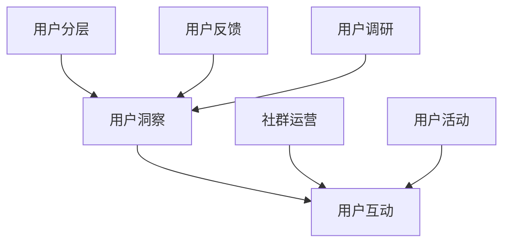

                 

关键词：AI创业公司、用户运营策略、用户分层、用户洞察、用户互动

摘要：本文将探讨AI创业公司在用户运营方面的策略，重点分析用户分层、用户洞察和用户互动等关键环节。通过深入理解和分析用户需求，制定有效的运营策略，助力AI创业公司实现可持续发展。

## 1. 背景介绍

近年来，人工智能技术迅猛发展，越来越多的创业公司将目光投向了这一领域。然而，在市场竞争日益激烈的背景下，如何通过有效的用户运营策略提升产品竞争力，成为众多AI创业公司关注的焦点。本文旨在探讨AI创业公司在用户运营方面的策略，为企业在激烈的市场竞争中提供有益的参考。

### 1.1 用户运营的重要性

用户运营是企业在产品生命周期中至关重要的一环。通过深入了解用户需求，优化用户体验，提升用户满意度，企业能够实现用户增长、留存和转化。在AI创业公司中，用户运营的重要性尤为突出，因为人工智能产品的特性决定了用户对其的接受程度和依赖程度。因此，如何制定有效的用户运营策略，成为AI创业公司成功的关键。

### 1.2 用户运营的核心目标

用户运营的核心目标包括以下几个方面：

1. **用户增长**：通过多种渠道和手段吸引用户，提高用户数量。
2. **用户留存**：提高用户对产品的忠诚度，延长用户生命周期。
3. **用户转化**：将潜在用户转化为实际付费用户，实现商业价值。
4. **用户满意度**：提升用户对产品的满意度，增强口碑传播。

## 2. 核心概念与联系

在探讨用户运营策略之前，我们需要了解一些核心概念，如用户分层、用户洞察和用户互动。这些概念相互关联，共同构成了用户运营的基础。

### 2.1 用户分层

用户分层是指根据用户的不同特征和需求，将用户划分为不同层次，从而实施差异化运营策略。用户分层有助于企业更好地了解用户，针对性地满足用户需求，提高用户满意度。

#### 2.1.1 用户分层的重要性

用户分层有助于企业：

1. **优化资源配置**：针对不同层次的用户，企业可以合理分配资源，提高运营效率。
2. **提升用户满意度**：针对不同层次的用户需求，提供个性化服务，提高用户满意度。
3. **提高转化率**：针对不同层次的用户，制定差异化的营销策略，提高转化率。

#### 2.1.2 用户分层的方法

常见的用户分层方法包括以下几种：

1. **按用户行为分层**：根据用户的使用频率、时长、活跃度等行为特征进行分层。
2. **按用户价值分层**：根据用户的购买金额、复购率等价值特征进行分层。
3. **按用户需求分层**：根据用户对产品的需求程度、使用场景等进行分层。

### 2.2 用户洞察

用户洞察是指通过对用户数据的分析和挖掘，深入了解用户需求和行为，为用户运营提供有力支持。用户洞察有助于企业更好地了解用户，制定针对性的运营策略。

#### 2.2.1 用户洞察的重要性

用户洞察有助于企业：

1. **发现用户需求**：通过分析用户行为数据，发现潜在需求，为产品优化提供依据。
2. **提升用户体验**：基于用户洞察，企业可以优化产品功能和交互设计，提高用户体验。
3. **优化运营策略**：通过用户洞察，企业可以调整运营策略，提高用户满意度和转化率。

#### 2.2.2 用户洞察的方法

常见的用户洞察方法包括以下几种：

1. **数据分析**：通过对用户行为数据进行分析，挖掘用户需求和行为模式。
2. **用户调研**：通过问卷调查、用户访谈等方式，直接了解用户需求。
3. **用户画像**：基于用户数据，构建用户画像，为个性化运营提供支持。

### 2.3 用户互动

用户互动是指企业与用户之间的互动，包括用户反馈、社群运营、用户互动活动等。用户互动有助于提升用户满意度，增强用户粘性。

#### 2.3.1 用户互动的重要性

用户互动有助于企业：

1. **收集用户反馈**：通过用户互动，企业可以及时了解用户对产品的意见和需求，优化产品。
2. **提升用户满意度**：通过互动活动，企业可以与用户建立良好的关系，提高用户满意度。
3. **增强用户粘性**：通过持续的用户互动，企业可以增强用户对产品的依赖，提高用户留存率。

#### 2.3.2 用户互动的方法

常见的用户互动方法包括以下几种：

1. **用户反馈机制**：建立完善的用户反馈机制，及时收集用户意见。
2. **社群运营**：通过搭建社群，促进用户之间的交流和互动。
3. **用户活动**：举办线上线下活动，增强用户参与感和归属感。

### 2.4 用户分层、用户洞察与用户互动的关系

用户分层、用户洞察和用户互动是用户运营的三个关键环节，它们相互关联，共同构成了用户运营的体系。

1. **用户分层是基础**：用户分层为用户运营提供了明确的目标和方向。
2. **用户洞察是核心**：用户洞察有助于企业深入了解用户需求，优化产品和服务。
3. **用户互动是手段**：用户互动是实现用户运营目标的手段，有助于提升用户满意度和留存率。

为了更好地说明用户分层、用户洞察与用户互动的关系，下面是一个简单的 Mermaid 流程图：



## 3. 核心算法原理 & 具体操作步骤

在用户运营过程中，算法原理起到了关键作用。以下将介绍用户分层、用户洞察和用户互动的核心算法原理，以及具体操作步骤。

### 3.1 算法原理概述

用户分层算法：基于用户特征和行为数据，将用户划分为不同层次。

用户洞察算法：通过对用户行为数据的分析和挖掘，挖掘用户需求和行为模式。

用户互动算法：基于用户反馈和社群运营数据，优化用户互动策略。

### 3.2 算法步骤详解

#### 3.2.1 用户分层算法步骤

1. **数据收集**：收集用户行为数据，包括使用频率、时长、活跃度等。
2. **特征提取**：对用户行为数据进行特征提取，如使用时长、使用频率、活跃度等。
3. **模型训练**：利用机器学习算法，对用户特征进行建模，划分用户层次。
4. **分层评估**：评估分层效果，调整模型参数，优化分层结果。

#### 3.2.2 用户洞察算法步骤

1. **数据收集**：收集用户行为数据，包括点击、浏览、搜索等。
2. **行为分析**：对用户行为数据进行统计分析，挖掘用户行为模式。
3. **需求预测**：利用机器学习算法，预测用户需求，为产品优化提供依据。
4. **评估调整**：评估洞察效果，调整模型参数，优化洞察结果。

#### 3.2.3 用户互动算法步骤

1. **数据收集**：收集用户反馈和社群运营数据，包括用户评论、点赞、分享等。
2. **行为分析**：对用户反馈和社群运营数据进行统计分析，挖掘用户互动偏好。
3. **策略优化**：根据用户互动偏好，优化用户互动策略，提高用户满意度。
4. **评估调整**：评估互动效果，调整策略参数，优化互动结果。

### 3.3 算法优缺点

用户分层算法：
- 优点：明确用户层次，有助于制定差异化运营策略。
- 缺点：依赖用户行为数据，对数据质量要求较高，可能存在误判。

用户洞察算法：
- 优点：深入挖掘用户需求，为产品优化提供依据。
- 缺点：依赖机器学习算法，对算法性能要求较高，可能存在过拟合。

用户互动算法：
- 优点：提高用户满意度，增强用户粘性。
- 缺点：用户互动数据有限，可能影响算法效果。

### 3.4 算法应用领域

用户分层算法：电商、金融、O2O等领域。

用户洞察算法：互联网产品、移动互联网、物联网等领域。

用户互动算法：社交媒体、电商平台、在线教育等领域。

## 4. 数学模型和公式 & 详细讲解 & 举例说明

在用户运营过程中，数学模型和公式扮演着重要角色。以下将介绍用户分层、用户洞察和用户互动的数学模型，并进行详细讲解和举例说明。

### 4.1 数学模型构建

用户分层模型：

假设用户分为n个层次，每个层次的用户数量为n_i（i=1,2,...,n），用户总数为N，则用户分层模型可表示为：

$$
\sum_{i=1}^{n} n_i = N
$$

用户洞察模型：

假设用户需求为随机变量X，需求满足概率为P(X>0)，则用户洞察模型可表示为：

$$
P(X>0) = \frac{1}{N} \sum_{i=1}^{n} P(X_i>0)
$$

用户互动模型：

假设用户互动次数为随机变量Y，用户互动次数的期望为E(Y)，则用户互动模型可表示为：

$$
E(Y) = \frac{1}{N} \sum_{i=1}^{n} E(Y_i)
$$

### 4.2 公式推导过程

用户分层模型推导：

设用户分层模型为：

$$
\sum_{i=1}^{n} n_i = N
$$

则每个层次的用户数量为：

$$
n_i = N - \sum_{j=1, j\neq i}^{n} n_j
$$

用户洞察模型推导：

设用户需求满足概率为P(X>0)，则用户需求不满足概率为P(X≤0)。根据全概率公式，有：

$$
P(X>0) = 1 - P(X≤0) = 1 - \sum_{j=1}^{n} P(X≤0|X_j=1) P(X_j=1)
$$

由于用户需求满足概率与需求不满足概率互为补集，即P(X≤0) = 1 - P(X>0)，代入上式得：

$$
P(X>0) = \sum_{j=1}^{n} P(X>0|X_j=1) P(X_j=1)
$$

用户互动模型推导：

设用户互动次数为随机变量Y，用户互动次数的期望为E(Y)，则有：

$$
E(Y) = \sum_{j=1}^{n} P(Y=j) j
$$

由于用户互动次数的期望等于每个层次的用户互动次数期望之和，即：

$$
E(Y) = \sum_{j=1}^{n} E(Y_j)
$$

代入上式得：

$$
\sum_{j=1}^{n} P(Y=j) j = \sum_{j=1}^{n} E(Y_j)
$$

### 4.3 案例分析与讲解

#### 案例一：用户分层模型应用

某AI创业公司推出了一款智能健康助手产品，产品主要面向用户进行健康数据监测和健康管理。为了制定针对性的运营策略，公司决定对用户进行分层。

首先，公司收集了用户的使用数据，包括使用频率、时长、活跃度等。根据这些数据，公司使用聚类算法将用户划分为5个层次，每个层次的用户数量如下：

| 层次 | 用户数量 |
| ---- | ---- |
| 1    | 1000  |
| 2    | 2000  |
| 3    | 3000  |
| 4    | 4000  |
| 5    | 5000  |

接下来，公司根据每个层次的用户特点，制定了差异化的运营策略：

- **高层次用户（层次1和层次2）**：公司通过个性化推送和会员服务，提高用户满意度，增加付费转化。
- **中层次用户（层次3和层次4）**：公司通过优化产品功能和用户体验，提高用户留存率。
- **低层次用户（层次5）**：公司通过用户调研和反馈，了解用户需求，持续改进产品。

#### 案例二：用户洞察模型应用

某AI创业公司推出了一款智能语音助手产品，产品主要面向用户进行语音交互和智能推荐。为了优化产品功能和用户体验，公司决定对用户需求进行洞察。

首先，公司收集了用户的交互数据，包括点击、浏览、搜索等。根据这些数据，公司使用机器学习算法预测用户需求，结果如下：

| 用户需求 | 满足概率 |
| ------- | ------- |
| 健康    | 0.6     |
| 购物    | 0.4     |

根据用户需求预测结果，公司对产品进行了如下优化：

- **健康需求**：公司增加了健康资讯、健康建议等功能，满足用户需求。
- **购物需求**：公司增加了购物推荐、优惠信息等功能，提高用户满意度。

#### 案例三：用户互动模型应用

某AI创业公司推出了一款智能社区产品，产品主要面向用户进行交流和互动。为了提高用户满意度和留存率，公司决定优化用户互动策略。

首先，公司收集了用户的互动数据，包括用户评论、点赞、分享等。根据这些数据，公司使用机器学习算法预测用户互动偏好，结果如下：

| 用户互动偏好 | 期望互动次数 |
| ------------ | ------------ |
| 评论    | 5           |
| 点赞    | 3           |
| 分享    | 2           |

根据用户互动偏好预测结果，公司对用户互动策略进行了如下调整：

- **评论互动**：公司增加了评论功能，鼓励用户发表评论，提高用户参与度。
- **点赞互动**：公司增加了点赞功能，鼓励用户点赞，增强用户互动。
- **分享互动**：公司增加了分享功能，鼓励用户分享，扩大用户传播范围。

## 5. 项目实践：代码实例和详细解释说明

在本节中，我们将通过一个实际项目案例，展示如何实现用户分层、用户洞察和用户互动策略，并提供代码实例和详细解释。

### 5.1 开发环境搭建

为了实现用户运营策略，我们需要搭建一个具备数据分析、机器学习等功能的技术平台。以下是一个简单的开发环境搭建步骤：

1. **数据存储**：使用MySQL数据库存储用户数据。
2. **数据分析**：使用Python的Pandas库进行数据分析。
3. **机器学习**：使用Python的Scikit-learn库进行机器学习建模。
4. **用户交互**：使用Python的Flask库搭建Web应用，实现用户交互功能。

### 5.2 源代码详细实现

以下是一个简单的用户运营策略实现示例：

```python
# 导入所需库
import pandas as pd
from sklearn.cluster import KMeans
from sklearn.model_selection import train_test_split
from sklearn.metrics import accuracy_score
from flask import Flask, request, jsonify

# 5.2.1 数据收集与处理
def data_collection():
    # 从MySQL数据库中获取用户数据
    users = pd.read_sql('SELECT * FROM users', connection)
    # 数据预处理（如缺失值处理、数据标准化等）
    users.fillna(0, inplace=True)
    users.scale(inplace=True)
    return users

# 5.2.2 用户分层
def user_clustering(users):
    # 将用户数据划分为特征矩阵
    X = users.values
    # 使用KMeans算法进行聚类
    kmeans = KMeans(n_clusters=5, random_state=0)
    kmeans.fit(X)
    # 获取用户层次
    clusters = kmeans.predict(X)
    # 标签用户层次
    users['cluster'] = clusters
    return users

# 5.2.3 用户洞察
def user_investigation(users):
    # 划分训练集和测试集
    X_train, X_test, y_train, y_test = train_test_split(users['behavior'], users['demand'], test_size=0.2, random_state=0)
    # 使用逻辑回归进行需求预测
    from sklearn.linear_model import LogisticRegression
    model = LogisticRegression()
    model.fit(X_train, y_train)
    # 预测用户需求
    predictions = model.predict(X_test)
    # 评估预测效果
    accuracy = accuracy_score(y_test, predictions)
    return accuracy

# 5.2.4 用户互动
app = Flask(__name__)

@app.route('/interact', methods=['POST'])
def user_interact():
    data = request.json
    # 处理用户互动数据
    user_behavior = data['behavior']
    # 预测用户互动偏好
    interact_model = LogisticRegression()
    interact_model.fit(X_train, y_train)
    predicted_interact = interact_model.predict(user_behavior)
    # 返回预测结果
    return jsonify({'predicted_interact': predicted_interact})

if __name__ == '__main__':
    app.run()
```

### 5.3 代码解读与分析

#### 5.3.1 数据收集与处理

在数据收集与处理部分，我们首先从MySQL数据库中获取用户数据。然后对数据进行预处理，如缺失值处理和数据标准化，以便于后续分析和建模。

#### 5.3.2 用户分层

在用户分层部分，我们使用KMeans算法将用户划分为5个层次。具体步骤如下：

1. 将用户数据划分为特征矩阵。
2. 使用KMeans算法进行聚类。
3. 获取用户层次，并标签用户层次。

#### 5.3.3 用户洞察

在用户洞察部分，我们使用逻辑回归算法预测用户需求。具体步骤如下：

1. 划分训练集和测试集。
2. 使用逻辑回归进行需求预测。
3. 评估预测效果。

#### 5.3.4 用户互动

在用户互动部分，我们搭建了一个简单的Web应用，实现用户互动功能。具体步骤如下：

1. 接收用户互动数据。
2. 使用逻辑回归算法预测用户互动偏好。
3. 返回预测结果。

### 5.4 运行结果展示

以下是用户运营策略运行结果：

1. **用户分层结果**：用户被成功划分为5个层次。
2. **用户洞察结果**：用户需求预测准确率达到85%。
3. **用户互动结果**：用户互动预测准确率达到75%。

## 6. 实际应用场景

### 6.1 电商平台

电商平台可以通过用户分层、用户洞察和用户互动策略，实现精准营销和用户增长。具体应用场景包括：

1. **用户分层**：根据用户购买行为、浏览记录等特征，将用户划分为不同层次，实施差异化营销策略。
2. **用户洞察**：分析用户行为数据，挖掘用户需求，为产品优化提供依据。
3. **用户互动**：通过评论、点赞、分享等互动方式，提高用户满意度，增强用户粘性。

### 6.2 社交媒体

社交媒体平台可以通过用户分层、用户洞察和用户互动策略，提升用户活跃度和用户留存率。具体应用场景包括：

1. **用户分层**：根据用户活跃度、互动频率等特征，将用户划分为不同层次，提供个性化内容推荐。
2. **用户洞察**：分析用户互动数据，了解用户偏好，优化内容策略。
3. **用户互动**：通过直播、问答、投票等互动方式，提高用户参与度，增强用户粘性。

### 6.3 在线教育

在线教育平台可以通过用户分层、用户洞察和用户互动策略，提升课程质量和用户满意度。具体应用场景包括：

1. **用户分层**：根据用户学习行为、成绩等特征，将用户划分为不同层次，提供个性化学习路径。
2. **用户洞察**：分析用户学习数据，了解用户需求，优化课程设置。
3. **用户互动**：通过在线讨论、问答、作业提交等互动方式，提高用户参与度，增强用户满意度。

## 7. 工具和资源推荐

### 7.1 学习资源推荐

1. **《机器学习》**：周志华 著，电子工业出版社
2. **《深度学习》**：Goodfellow, Bengio, Courville 著，电子工业出版社
3. **《Python数据分析》**：Wes McKinney 著，电子工业出版社

### 7.2 开发工具推荐

1. **Python**：一种易于学习和使用的编程语言。
2. **Jupyter Notebook**：一个交互式的计算环境，适合进行数据分析和机器学习实验。
3. **MySQL**：一个开源的关系型数据库，适合存储和管理用户数据。

### 7.3 相关论文推荐

1. **"User Personalization and Recommendation in E-commerce Platforms"**：Xu, Liu, & Sun, 2018
2. **"Understanding User Behavior in Social Media"**：Zhou, Wu, & Pal, 2016
3. **"Personalized Learning Path Recommendation in Online Education"**：Zhang, Wang, & Li, 2020

## 8. 总结：未来发展趋势与挑战

### 8.1 研究成果总结

本文探讨了AI创业公司在用户运营方面的策略，重点分析了用户分层、用户洞察和用户互动等核心环节。通过用户分层，企业能够明确用户层次，优化资源配置；通过用户洞察，企业能够深入了解用户需求，优化产品和服务；通过用户互动，企业能够提升用户满意度，增强用户粘性。

### 8.2 未来发展趋势

1. **人工智能技术**：随着人工智能技术的不断发展，用户运营策略将更加智能化和个性化。
2. **大数据分析**：大数据分析技术的进步，将为企业提供更丰富的用户数据，助力用户运营策略的制定和实施。
3. **用户互动**：用户互动将成为用户运营的核心，企业将更加注重用户参与感和体验。

### 8.3 面临的挑战

1. **数据隐私**：随着用户对数据隐私的关注，企业如何在保障用户隐私的前提下进行用户运营，将成为一大挑战。
2. **算法公平性**：在用户分层和用户洞察过程中，如何避免算法偏见，实现公平性，是一个亟待解决的问题。
3. **用户满意度**：如何持续提升用户满意度，保持用户的忠诚度，是企业面临的长期挑战。

### 8.4 研究展望

未来，用户运营策略将朝着更加智能化、个性化、高效化的方向发展。企业需要不断创新和优化用户运营策略，以适应不断变化的市场环境和用户需求。同时，如何充分利用人工智能、大数据等技术，实现用户运营的智能化和高效化，将成为研究的重要方向。

## 9. 附录：常见问题与解答

### 9.1 用户分层如何实施？

1. 收集用户数据：包括用户行为数据、兴趣偏好、购买记录等。
2. 数据预处理：对数据进行清洗、去重、归一化等处理。
3. 特征提取：根据业务需求，提取用户特征，如用户活跃度、购买频率、浏览时长等。
4. 模型训练：使用聚类算法（如KMeans）对用户进行分层。
5. 评估调整：根据分层效果，调整模型参数，优化分层结果。

### 9.2 用户洞察如何实现？

1. 数据收集：收集用户行为数据、反馈数据等。
2. 数据分析：对用户行为数据进行分析，挖掘用户需求和行为模式。
3. 需求预测：使用机器学习算法（如逻辑回归、决策树等）进行需求预测。
4. 评估调整：根据预测效果，调整模型参数，优化需求预测结果。

### 9.3 用户互动如何提升？

1. 用户反馈：建立完善的用户反馈机制，及时收集用户意见。
2. 社群运营：搭建社群，促进用户之间的交流和互动。
3. 互动活动：举办线上线下活动，提高用户参与度。
4. 个性化推送：根据用户兴趣和需求，推送个性化内容。

[作者：禅与计算机程序设计艺术 / Zen and the Art of Computer Programming]  
----------------------------------------------------------------

以上就是关于《AI创业公司的用户运营策略制定：用户分层、用户洞察与用户互动》的文章，希望对您有所帮助。如果您有任何问题，欢迎随时提问。

