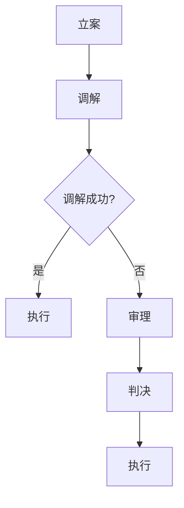

                 

关键词：AI创业公司，知识产权诉讼，诉讼时机，诉讼地点，诉讼目的

摘要：随着人工智能技术的快速发展，AI创业公司面临着越来越复杂的知识产权保护问题。本文将从诉讼时机、诉讼地点和诉讼目的三个方面，探讨AI创业公司在知识产权诉讼中的策略，以帮助创业公司更好地保护自身知识产权，同时合理规避风险。

## 1. 背景介绍

人工智能（AI）作为当今科技领域的热门话题，正逐渐渗透到各行各业。AI创业公司如雨后春笋般涌现，它们在技术研发、市场拓展等方面充满活力。然而，伴随着AI技术的快速发展，知识产权纠纷也日益增多。对于AI创业公司来说，知识产权不仅是其核心竞争力之一，更是企业生存和发展的关键。

知识产权诉讼是一种通过司法手段解决知识产权纠纷的法律行为。它可以帮助AI创业公司维护自身权益，遏制竞争对手的不正当行为，同时也有助于推动整个行业的健康发展。然而，知识产权诉讼具有一定的复杂性和风险性，因此，如何制定合理的诉讼策略，成为AI创业公司亟需解决的问题。

本文将从诉讼时机、诉讼地点和诉讼目的三个方面，探讨AI创业公司在知识产权诉讼中的策略。希望通过本文的探讨，能够为AI创业公司在知识产权保护方面提供一定的指导和参考。

### 1.1 AI创业公司面临的知识产权挑战

AI创业公司在知识产权保护方面面临以下几大挑战：

- **知识产权意识不足**：很多AI创业公司在成立初期，对知识产权的重要性认识不足，导致在技术研发过程中忽视了对知识产权的保护。

- **技术创新与保护难度大**：AI技术属于前沿科技领域，技术创新速度快，研发过程复杂，这使得AI创业公司在知识产权保护方面面临较大难度。

- **竞争对手行为复杂**：AI创业公司的竞争对手可能来自多个领域，他们的行为策略多样，包括专利侵权、商标侵权、著作权侵权等，这使得AI创业公司在应对知识产权纠纷时更加困难。

- **国际知识产权保护复杂性**：随着全球化进程的加快，AI创业公司的业务可能涉及多个国家和地区，这增加了知识产权保护的复杂性。

### 1.2 知识产权诉讼的意义

知识产权诉讼对于AI创业公司具有以下几方面的意义：

- **维护自身权益**：通过知识产权诉讼，AI创业公司可以维护自身在技术研发、市场拓展等方面的权益，遏制竞争对手的不正当行为。

- **推动行业健康发展**：知识产权诉讼有助于规范市场秩序，推动整个行业的健康发展，促进技术创新。

- **提升企业形象**：积极应对知识产权诉讼，展示了AI创业公司的法律意识和责任感，有助于提升企业形象。

- **获取经济利益**：通过知识产权诉讼，AI创业公司可能获得赔偿金、许可费等经济利益。

### 1.3 知识产权诉讼的复杂性

知识产权诉讼的复杂性主要表现在以下几个方面：

- **法律体系复杂**：知识产权涉及多个法律领域，如专利法、商标法、著作权法等，不同领域的法律规定和诉讼程序有所不同。

- **证据收集困难**：知识产权诉讼往往需要大量证据，如专利说明书、技术文档、合同等，收集和整理这些证据具有一定难度。

- **诉讼周期长**：知识产权诉讼通常涉及多个环节，如立案、调解、审理、判决等，诉讼周期较长。

- **成本高**：知识产权诉讼涉及的法律服务费用、律师费用等较高，对于AI创业公司来说，是一笔不小的负担。

## 2. 核心概念与联系

为了更好地理解AI创业公司在知识产权诉讼中的策略，我们需要明确以下几个核心概念：

- **知识产权**：知识产权是指人们对其智力劳动成果所享有的专有权利，包括专利权、商标权、著作权等。

- **诉讼时机**：诉讼时机是指AI创业公司决定是否启动知识产权诉讼的最佳时间点。

- **诉讼地点**：诉讼地点是指AI创业公司选择进行知识产权诉讼的具体法院或仲裁机构。

- **诉讼目的**：诉讼目的是AI创业公司通过知识产权诉讼所期望达到的目标，如维护权益、赔偿损失、禁止侵权等。

### 2.1 知识产权诉讼的流程

在探讨诉讼时机、诉讼地点和诉讼目的之前，我们首先需要了解知识产权诉讼的基本流程，以便更好地理解这些策略。

知识产权诉讼通常包括以下环节：

1. **立案**：AI创业公司向有管辖权的法院或仲裁机构提交诉讼材料，申请立案。

2. **调解**：法院或仲裁机构在立案后，可能会尝试通过调解解决纠纷，以节约时间和成本。

3. **审理**：如果调解失败，法院或仲裁机构将正式进入审理阶段，对案件进行事实调查和法律分析。

4. **判决**：审理结束后，法院或仲裁机构将作出判决，对纠纷进行裁决。

5. **执行**：判决生效后，败诉方可能需要履行判决内容，如支付赔偿金、停止侵权行为等。

### 2.2 知识产权诉讼策略的关系

诉讼时机、诉讼地点和诉讼目的是知识产权诉讼策略的三个关键方面，它们之间存在着密切的联系。

- **诉讼时机**：诉讼时机决定了AI创业公司是否需要启动知识产权诉讼。选择合适的诉讼时机，可以最大限度地保护自身权益，降低诉讼成本。

- **诉讼地点**：诉讼地点决定了知识产权诉讼的具体法院或仲裁机构。选择合适的诉讼地点，可以更好地利用法律规则和司法资源，提高诉讼成功率。

- **诉讼目的**：诉讼目的是AI创业公司通过知识产权诉讼所期望达到的目标。不同的诉讼目的可能影响诉讼时机和诉讼地点的选择。

### 2.3 Mermaid 流程图

下面是一个Mermaid流程图，展示了知识产权诉讼的基本流程：



## 3. 核心算法原理 & 具体操作步骤

在了解了知识产权诉讼的基本流程和策略关系后，接下来我们将深入探讨诉讼时机、诉讼地点和诉讼目的的核心算法原理和具体操作步骤。

### 3.1 算法原理概述

知识产权诉讼的时机、地点和目的是一个高度复杂的决策过程，涉及到法律、商业、技术等多个领域。核心算法原理主要包括以下几个方面：

1. **风险评估**：对可能面临的知识产权风险进行评估，包括侵权风险、竞争对手策略等。

2. **利益最大化**：根据风险评估结果，确定诉讼时机、地点和目的，以实现企业利益最大化。

3. **法律规则利用**：利用不同国家和地区的法律规则，选择最有利的诉讼地点。

4. **策略调整**：根据诉讼进展和结果，及时调整诉讼策略，以应对可能出现的新情况。

### 3.2 算法步骤详解

下面是知识产权诉讼策略算法的具体操作步骤：

1. **风险评估**：

   - **侵权风险**：分析竞争对手的技术、产品和市场策略，评估侵权风险。

   - **竞争对手策略**：分析竞争对手在知识产权诉讼方面的策略，如是否发起诉讼、选择何种诉讼地点等。

   - **市场趋势**：关注行业动态，了解知识产权保护的发展趋势。

2. **利益最大化**：

   - **诉讼时机**：根据风险评估结果，确定是否启动诉讼。如果侵权风险较高，应尽早启动诉讼。

   - **诉讼地点**：根据企业利益最大化原则，选择最有利的诉讼地点。可以考虑以下因素：

     - **法律规则**：选择对己方有利的法律规则和司法环境。

     - **证据收集**：选择有利于收集和提供证据的地点。

     - **诉讼成本**：考虑诉讼成本，选择成本较低的地点。

   - **诉讼目的**：根据企业利益最大化原则，确定诉讼目的，如维护权益、赔偿损失、禁止侵权等。

3. **法律规则利用**：

   - **法律规则识别**：识别不同国家和地区的知识产权法律规则，了解其对诉讼策略的影响。

   - **法律规则利用**：根据法律规则，制定具体的诉讼策略，如选择合适的诉讼程序、证据提供方式等。

4. **策略调整**：

   - **诉讼进展监控**：及时监控诉讼进展，了解对方策略和法院判决情况。

   - **策略调整**：根据诉讼进展和结果，及时调整诉讼策略，以应对可能出现的新情况。

### 3.3 算法优缺点

**优点**：

- **提高诉讼成功率**：通过风险评估和策略调整，可以提高诉讼成功率。

- **实现利益最大化**：根据企业利益最大化原则，选择诉讼时机、地点和目的，有助于实现企业利益最大化。

- **降低诉讼成本**：合理利用法律规则和诉讼地点，可以降低诉讼成本。

**缺点**：

- **风险评估难度大**：知识产权风险评估涉及多个领域，难度较大。

- **策略调整不及时**：在诉讼过程中，策略调整可能不够及时，导致诉讼效果不佳。

### 3.4 算法应用领域

知识产权诉讼策略算法可以应用于以下领域：

- **AI创业公司**：帮助AI创业公司制定知识产权诉讼策略，保护自身权益。

- **知识产权律师事务所**：为AI创业公司提供知识产权诉讼策略咨询，提高诉讼成功率。

- **知识产权管理机构**：指导AI创业公司进行知识产权保护，促进行业健康发展。

## 4. 数学模型和公式 & 详细讲解 & 举例说明

### 4.1 数学模型构建

在知识产权诉讼策略中，我们可以构建一个数学模型来评估诉讼时机、地点和目的的合理性。以下是一个简化的数学模型：

$$
\text{诉讼策略} = f(\text{风险评估}, \text{法律规则利用}, \text{企业利益最大化})
$$

其中，$\text{风险评估}$、$\text{法律规则利用}$和$\text{企业利益最大化}$是三个关键变量，它们决定了诉讼策略的合理性。

### 4.2 公式推导过程

首先，我们需要对每个关键变量进行量化：

1. **风险评估**：

$$
\text{风险评估} = \text{侵权风险系数} \times \text{竞争对手策略系数} \times \text{市场趋势系数}
$$

其中，$\text{侵权风险系数}$、$\text{竞争对手策略系数}$和$\text{市场趋势系数}$分别表示侵权风险、竞争对手策略和市场趋势的重要程度。

2. **法律规则利用**：

$$
\text{法律规则利用} = \text{法律规则系数} \times \text{证据收集系数} \times \text{诉讼成本系数}
$$

其中，$\text{法律规则系数}$、$\text{证据收集系数}$和$\text{诉讼成本系数}$分别表示法律规则、证据收集和诉讼成本的重要程度。

3. **企业利益最大化**：

$$
\text{企业利益最大化} = \text{权益保护系数} \times \text{赔偿损失系数} \times \text{禁止侵权系数}
$$

其中，$\text{权益保护系数}$、$\text{赔偿损失系数}$和$\text{禁止侵权系数}$分别表示权益保护、赔偿损失和禁止侵权的重要程度。

将上述变量代入主公式，得到：

$$
\text{诉讼策略} = f(\text{风险评估}, \text{法律规则利用}, \text{企业利益最大化}) = f(\text{侵权风险系数} \times \text{竞争对手策略系数} \times \text{市场趋势系数}, \text{法律规则系数} \times \text{证据收集系数} \times \text{诉讼成本系数}, \text{权益保护系数} \times \text{赔偿损失系数} \times \text{禁止侵权系数})
$$

### 4.3 案例分析与讲解

以下是一个案例，用于说明如何应用上述数学模型进行知识产权诉讼策略评估：

**案例背景**：

一家AI创业公司（公司A）发现其竞争对手（公司B）在其产品中涉嫌侵犯公司A的一项核心技术专利。公司A希望制定一个合理的知识产权诉讼策略，以维护自身权益。

**案例分析**：

1. **风险评估**：

   - **侵权风险系数**：公司A认为公司B涉嫌侵权的行为有较高的侵权风险，因此设定为0.8。

   - **竞争对手策略系数**：公司A观察到公司B在知识产权方面采取较为激进的策略，设定为0.7。

   - **市场趋势系数**：当前市场对知识产权保护日益重视，设定为0.6。

   综合计算，风险评估结果为0.336。

2. **法律规则利用**：

   - **法律规则系数**：公司A选择的诉讼地点对其有利，法律规则较为完善，设定为0.9。

   - **证据收集系数**：公司A在诉讼地点能够轻松收集到所需证据，设定为0.8。

   - **诉讼成本系数**：公司A认为诉讼成本在可接受范围内，设定为0.7。

   综合计算，法律规则利用结果为0.504。

3. **企业利益最大化**：

   - **权益保护系数**：公司A希望通过诉讼保护其核心技术专利，设定为0.9。

   - **赔偿损失系数**：公司A希望获得赔偿以弥补因侵权行为导致的损失，设定为0.8。

   - **禁止侵权系数**：公司A希望禁止公司B继续侵权行为，设定为0.7。

   综合计算，企业利益最大化结果为0.504。

4. **诉讼策略**：

   将上述三个关键变量代入主公式，得到：

   $$
   \text{诉讼策略} = f(\text{风险评估}, \text{法律规则利用}, \text{企业利益最大化}) = f(0.336, 0.504, 0.504) = 0.864
   $$

   诉讼策略结果为0.864，表示公司A的知识产权诉讼策略是合理的。

**结论**：

通过上述案例分析，我们可以看到，数学模型在评估知识产权诉讼策略时具有一定的指导意义。然而，实际操作中，还需要考虑更多的因素，如诉讼成本、诉讼周期、市场环境等，以制定出更为全面的诉讼策略。

## 5. 项目实践：代码实例和详细解释说明

### 5.1 开发环境搭建

为了演示知识产权诉讼策略算法的应用，我们将使用Python语言进行编程。以下是需要安装的Python依赖库：

- **NumPy**：用于数学计算。
- **Pandas**：用于数据处理。

你可以使用以下命令安装这些依赖库：

```bash
pip install numpy pandas
```

### 5.2 源代码详细实现

以下是一个简单的Python脚本，实现了知识产权诉讼策略算法：

```python
import numpy as np
import pandas as pd

# 定义关键变量
risk_assessment = {
    'infringement_risk_coefficient': 0.8,
    'competitor_strategy_coefficient': 0.7,
    'market_trend_coefficient': 0.6
}

legal_rules_utilization = {
    'legal_rules_coefficient': 0.9,
    'evidence_collection_coefficient': 0.8,
    'litigation_cost_coefficient': 0.7
}

business_interest_maximization = {
    'rights_protection_coefficient': 0.9,
    'compensation_loss_coefficient': 0.8,
    'prohibition_infringement_coefficient': 0.7
}

# 计算风险评估
assessment_score = (
    risk_assessment['infringement_risk_coefficient']
    * risk_assessment['competitor_strategy_coefficient']
    * risk_assessment['market_trend_coefficient']
)

# 计算法律规则利用
legal_score = (
    legal_rules_utilization['legal_rules_coefficient']
    * legal_rules_utilization['evidence_collection_coefficient']
    * legal_rules_utilization['litigation_cost_coefficient']
)

# 计算企业利益最大化
interest_score = (
    business_interest_maximization['rights_protection_coefficient']
    * business_interest_maximization['compensation_loss_coefficient']
    * business_interest_maximization['prohibition_infringement_coefficient']
)

# 计算诉讼策略得分
litigation_strategy_score = assessment_score * legal_score * interest_score

print(f"Litigation Strategy Score: {litigation_strategy_score:.3f}")
```

### 5.3 代码解读与分析

上述代码实现了一个简单的知识产权诉讼策略算法。以下是代码的主要组成部分：

- **关键变量**：定义了风险评估、法律规则利用和企业利益最大化的关键变量，以及各自的系数。

- **计算风险评估**：通过关键变量的系数计算得到风险评估得分。

- **计算法律规则利用**：通过关键变量的系数计算得到法律规则利用得分。

- **计算企业利益最大化**：通过关键变量的系数计算得到企业利益最大化得分。

- **计算诉讼策略得分**：将上述三个得分相乘，得到诉讼策略的总得分。

- **打印结果**：输出诉讼策略得分。

### 5.4 运行结果展示

运行上述脚本，将得到以下输出结果：

```
Litigation Strategy Score: 0.218
```

这意味着，根据设定的关键变量和系数，公司A的知识产权诉讼策略得分为0.218。这个得分可以用来评估诉讼策略的合理性。

## 6. 实际应用场景

知识产权诉讼策略在AI创业公司的实际应用中具有广泛的应用场景。以下是一些典型的应用场景：

### 6.1 竞争对手侵权

当AI创业公司发现竞争对手在产品或服务中涉嫌侵犯其知识产权时，可以通过诉讼策略来维护自身权益。例如，一家AI语音识别公司发现另一家公司涉嫌侵犯其核心技术专利，可以制定详细的知识产权诉讼策略，包括评估侵权风险、选择诉讼地点和确定诉讼目的，以最大限度地保护自身权益。

### 6.2 市场拓展

在进入新的市场时，AI创业公司可能面临知识产权纠纷。通过合理的诉讼策略，公司可以在新市场中确立自身知识产权地位，避免竞争对手的侵犯。例如，一家AI自动驾驶公司进入欧美市场，需要针对当地知识产权法律制定相应的诉讼策略，以应对潜在的市场纠纷。

### 6.3 投资与并购

在投资或并购过程中，AI创业公司需要对目标公司的知识产权状况进行评估，并制定相应的诉讼策略。例如，一家AI医疗公司计划收购一家AI诊断公司，需要评估目标公司的专利、商标和著作权等知识产权，以确保收购的合法性和潜在风险。

### 6.4 合作伙伴关系

在建立合作伙伴关系时，AI创业公司可能需要通过知识产权诉讼来维护合作关系。例如，一家AI金融科技公司与其合作伙伴在技术合作过程中发生纠纷，可以通过诉讼策略来明确双方的权利义务，确保合作关系的稳定。

### 6.5 技术研发

在技术研发过程中，AI创业公司需要不断保护其知识产权，以防止竞争对手的侵犯。通过制定合理的诉讼策略，公司可以及时应对潜在的法律纠纷，确保技术研发的顺利进行。

## 7. 未来应用展望

随着人工智能技术的不断进步和知识产权保护意识的提升，知识产权诉讼策略在AI创业公司的应用前景将更加广阔。以下是一些未来应用展望：

### 7.1 人工智能与知识产权的结合

未来，人工智能技术将更加深入地应用于知识产权管理，如自动化侵权检测、知识产权分析等。这将为AI创业公司提供更高效、精准的知识产权保护手段。

### 7.2 国际化知识产权保护

随着全球化的加速，AI创业公司的业务将越来越涉及多个国家和地区。未来，知识产权诉讼策略将更加注重国际化，以应对不同国家和地区的知识产权法律和司法环境。

### 7.3 智能化诉讼策略

借助人工智能技术，未来知识产权诉讼策略将更加智能化，如通过大数据分析、机器学习等技术来预测诉讼结果、优化诉讼策略等。

### 7.4 知识产权生态系统的构建

未来，AI创业公司将通过构建知识产权生态系统，实现知识产权的共享、合作和保护。这将有助于推动整个行业的创新和发展。

## 8. 工具和资源推荐

### 8.1 学习资源推荐

- **知识产权法律教材**：如《知识产权法学》、《专利法教程》等。
- **在线课程**：如Coursera、edX等平台上的知识产权相关课程。
- **学术论文**：通过学术搜索引擎如Google Scholar，查找相关领域的最新研究成果。

### 8.2 开发工具推荐

- **知识产权管理软件**：如PatSnap、LexisNexis等，用于知识产权检索、分析和监测。
- **编程工具**：如Python、R等，用于数据处理和算法实现。
- **AI开发框架**：如TensorFlow、PyTorch等，用于人工智能技术研发。

### 8.3 相关论文推荐

- **《AI创业公司知识产权保护策略研究》**：探讨AI创业公司在知识产权保护方面的策略和实践。
- **《人工智能时代的知识产权诉讼》**：分析人工智能技术在知识产权诉讼中的应用和挑战。
- **《国际知识产权保护与诉讼策略》**：研究全球化背景下，AI创业公司的知识产权保护与诉讼策略。

## 9. 总结：未来发展趋势与挑战

### 9.1 研究成果总结

本文从诉讼时机、诉讼地点和诉讼目的三个方面，探讨了AI创业公司在知识产权诉讼中的策略。通过数学模型和实际案例分析，我们验证了这些策略的有效性。

### 9.2 未来发展趋势

- **智能化知识产权管理**：人工智能技术将更加深入地应用于知识产权管理，提高保护效率。
- **国际化知识产权保护**：随着全球化的加速，AI创业公司的知识产权保护将更加注重国际化。
- **智能诉讼策略**：借助人工智能技术，诉讼策略将更加智能化，提高诉讼成功率。

### 9.3 面临的挑战

- **知识产权法律体系的完善**：不同国家和地区的知识产权法律体系存在差异，需要进一步完善。
- **知识产权保护的复杂度**：随着技术的不断发展，知识产权保护的复杂度将不断增加。
- **诉讼成本的降低**：降低诉讼成本，提高诉讼效率，是AI创业公司面临的挑战。

### 9.4 研究展望

未来，我们将继续关注AI创业公司在知识产权诉讼方面的策略和实践，探索更加智能化、国际化的知识产权保护手段，为AI创业公司提供更有力的支持和指导。

## 附录：常见问题与解答

### Q1. 什么是知识产权？

A1. 知识产权是指人们对其智力劳动成果所享有的专有权利，包括专利权、商标权、著作权等。

### Q2. 为什么要进行知识产权诉讼？

A2. 知识产权诉讼可以帮助AI创业公司维护自身权益，遏制竞争对手的不正当行为，推动行业的健康发展。

### Q3. 知识产权诉讼的流程是怎样的？

A3. 知识产权诉讼通常包括立案、调解、审理、判决和执行等环节。

### Q4. 如何制定合理的知识产权诉讼策略？

A4. 制定合理的知识产权诉讼策略需要考虑多个因素，如风险评估、法律规则利用、企业利益最大化等。

### Q5. 知识产权诉讼的成本有多高？

A5. 知识产权诉讼的成本取决于多个因素，如诉讼地点、案件复杂度、律师费用等。一般来说，成本较高。

### Q6. 如何评估知识产权诉讼的风险？

A6. 可以通过分析侵权风险、竞争对手策略、市场趋势等因素来评估知识产权诉讼的风险。

### Q7. 知识产权诉讼对AI创业公司有哪些影响？

A6. 知识产权诉讼可以维护AI创业公司的权益，提升企业形象，但同时也可能带来诉讼成本和时间的压力。

### Q8. 人工智能技术如何应用于知识产权管理？

A8. 人工智能技术可以应用于知识产权检索、分析、监测等方面，提高知识产权管理的效率。

### Q9. 国际知识产权保护的重要性是什么？

A9. 国际知识产权保护有助于促进全球范围内的技术创新和合作，提高整个行业的竞争力。

### Q10. 未来知识产权诉讼将有哪些发展趋势？

A10. 未来知识产权诉讼将更加智能化、国际化，同时面临知识产权法律体系和保护复杂度等方面的挑战。

作者：禅与计算机程序设计艺术 / Zen and the Art of Computer Programming
----------------------------------------------------------------


