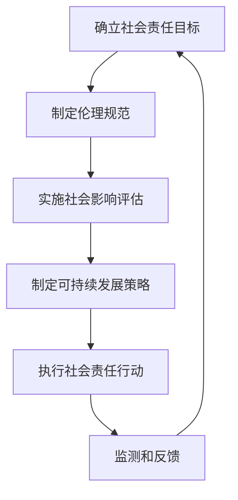

                 

关键词：AI创业、社会责任、可持续发展、伦理规范、技术透明度、实践案例

> 摘要：本文旨在探讨AI创业公司如何在快速发展的同时，积极履行社会责任，促进可持续发展。通过深入分析AI技术的伦理挑战、社会影响以及实践案例，提出了一套切实可行的社会责任实践框架，以期为AI创业公司提供指导和建议。

## 1. 背景介绍

随着人工智能技术的飞速发展，AI创业公司如雨后春笋般涌现。这些公司不仅带来了技术创新和商业机会，同时也承担着重要的社会责任。AI技术具有广泛的应用前景，从医疗、金融到教育、交通等多个领域，其影响深远。然而，AI技术的快速发展也带来了一系列伦理和社会问题，如隐私侵犯、歧视、算法偏见等。因此，AI创业公司需要积极履行社会责任，确保技术的可持续发展，并为社会带来积极的影响。

### 1.1 AI技术的伦理挑战

AI技术的应用往往涉及到大量敏感数据，如个人隐私、健康信息等。这些数据的处理和使用需要严格遵循伦理规范，确保用户隐私不被侵犯。此外，AI算法的决策过程往往是不透明的，这可能导致歧视和不公平现象。例如，在招聘、信用评估等领域，如果算法存在偏见，可能会对某些群体产生不公平影响。因此，AI创业公司需要关注这些伦理挑战，采取有效的措施进行应对。

### 1.2 社会影响

AI技术的广泛应用将对社会产生深远影响。一方面，它可以提高生产效率，创造新的就业机会，推动经济增长。另一方面，它也可能导致失业、劳动力市场的重构等问题。此外，AI技术还可能加剧社会不平等，使贫富差距扩大。因此，AI创业公司需要关注社会影响，采取社会责任行动，促进社会的可持续发展。

### 1.3 可持续发展

可持续发展是当今世界面临的重大挑战之一。AI创业公司作为技术创新的引领者，有责任通过技术创新和商业模式创新，推动社会的可持续发展。例如，通过开发节能环保的AI技术，减少碳排放；通过提供公平的AI服务，减少社会不平等。

## 2. 核心概念与联系

为了更好地理解AI创业公司的社会责任实践，我们需要明确几个核心概念：

### 2.1 社会责任

社会责任是指企业对其利益相关者（如员工、客户、供应商、社会和环境）的责任，而不仅仅是股东的责任。对于AI创业公司来说，社会责任意味着在追求商业成功的同时，也要关注社会和环境的影响。

### 2.2 伦理规范

伦理规范是指一系列指导企业行为的道德原则和价值观。对于AI创业公司来说，伦理规范尤为重要，因为AI技术具有潜在的风险和负面影响。例如，隐私保护、公平性和透明度等。

### 2.3 可持续发展

可持续发展是指满足当前需求而不损害子孙后代满足自身需求的能力。对于AI创业公司来说，可持续发展意味着在追求商业成功的同时，也要关注社会和环境的影响，确保技术的长期健康发展。

### 2.4 社会影响评估

社会影响评估是指对企业行为对社会和环境的影响进行评估的过程。对于AI创业公司来说，社会影响评估可以帮助他们更好地理解技术的社会影响，并采取相应的社会责任行动。

### 2.5 Mermaid 流程图

以下是AI创业公司的社会责任实践流程图的 Mermaid 表示：



## 3. 核心算法原理 & 具体操作步骤

### 3.1 算法原理概述

AI创业公司的社会责任实践可以被视为一个闭环的决策过程，包括以下几个核心步骤：

1. **确立社会责任目标**：明确公司的社会责任愿景和目标，例如推动可持续发展、减少社会不平等、保护用户隐私等。
2. **制定伦理规范**：制定明确的伦理规范，指导公司行为，确保技术的透明度、公平性和隐私保护。
3. **实施社会影响评估**：定期评估公司的行为对社会和环境的影响，识别潜在的风险和挑战。
4. **制定可持续发展策略**：根据社会影响评估的结果，制定相应的可持续发展策略，如节能减排、公平服务、数据安全等。
5. **执行社会责任行动**：实施社会责任行动，如参与社会公益活动、提供公平的AI服务、透明化数据处理等。
6. **监测和反馈**：监测社会责任行动的效果，收集反馈，不断优化社会责任实践。

### 3.2 算法步骤详解

以下是AI创业公司社会责任实践的具体操作步骤：

1. **确立社会责任目标**
   - **目标设定**：明确公司的社会责任愿景和目标，如推动可持续发展、减少社会不平等、保护用户隐私等。
   - **目标分解**：将总体目标分解为具体的、可衡量的指标，如减少碳排放、提高用户满意度、确保数据隐私等。

2. **制定伦理规范**
   - **伦理原则**：制定基于伦理原则的规范，如尊重用户隐私、公平对待用户、透明化数据处理等。
   - **规范实施**：将伦理规范纳入公司的规章制度，确保所有员工和合作伙伴遵守。

3. **实施社会影响评估**
   - **评估指标**：确定评估社会责任行动效果的具体指标，如碳排放量、用户满意度、数据泄露事件等。
   - **数据收集**：收集与评估指标相关的数据，如能源消耗数据、用户反馈、安全漏洞报告等。
   - **分析评估**：对收集的数据进行分析，评估社会责任行动的效果，识别潜在的风险和挑战。

4. **制定可持续发展策略**
   - **策略制定**：根据社会影响评估的结果，制定具体的可持续发展策略，如节能减排计划、公平服务计划、数据安全计划等。
   - **资源分配**：为可持续发展策略提供必要的资源支持，如资金、人力、技术等。

5. **执行社会责任行动**
   - **行动规划**：制定具体的行动计划，明确行动的目标、时间表、责任人等。
   - **行动计划**：执行社会责任行动，如参与公益活动、提供透明化服务、优化数据处理流程等。

6. **监测和反馈**
   - **效果监测**：定期监测社会责任行动的效果，如评估行动计划的实际执行情况、收集用户反馈等。
   - **反馈优化**：根据监测结果和用户反馈，优化社会责任实践，如调整行动计划、改进服务流程等。

### 3.3 算法优缺点

#### 优点：

1. **全面性**：社会责任实践涵盖了伦理、社会影响、可持续发展等多个方面，确保公司行为的全面性。
2. **闭环性**：社会责任实践是一个闭环的决策过程，通过监测和反馈不断优化，确保社会责任行动的有效性。
3. **适应性**：社会责任实践可以根据公司的具体情况和环境变化进行灵活调整，确保持续适应性和可持续性。

#### 缺点：

1. **复杂性**：社会责任实践涉及多个方面，需要综合考虑各种因素，可能导致实施过程复杂。
2. **成本**：社会责任实践可能需要额外的资源和投入，如资金、人力和技术等，可能对公司的运营造成一定压力。
3. **不确定性**：社会责任实践的效果受到多种因素的影响，如市场环境、政策法规等，可能导致实施效果存在不确定性。

### 3.4 算法应用领域

AI创业公司的社会责任实践可以应用于各个领域，如：

1. **医疗健康**：确保医疗数据的隐私和安全，提供公平的医疗服务，减少社会不平等。
2. **金融科技**：确保金融服务的透明度和公平性，减少歧视现象，提高用户满意度。
3. **教育**：提供公平的教育资源，确保教育机会的平等，减少教育不公。
4. **交通**：提高交通系统的效率和安全性，减少碳排放，推动可持续发展。
5. **能源**：开发节能环保的AI技术，减少能源消耗，推动低碳发展。

## 4. 数学模型和公式 & 详细讲解 & 举例说明

### 4.1 数学模型构建

为了更好地理解和评估AI创业公司的社会责任实践，我们可以构建一个数学模型。该模型包括以下几个关键变量：

1. **社会责任得分（S）**：衡量公司社会责任实践的效果，取值范围在0到1之间，1表示最佳效果。
2. **伦理得分（E）**：衡量公司伦理规范的执行情况，取值范围在0到1之间，1表示最佳执行。
3. **社会影响得分（I）**：衡量公司社会责任行动对社会和环境的影响，取值范围在0到1之间，1表示最佳影响。
4. **可持续发展得分（D）**：衡量公司可持续发展策略的实施效果，取值范围在0到1之间，1表示最佳实施。

根据这些变量，我们可以构建以下数学模型：

$$
S = w_1E + w_2I + w_3D
$$

其中，$w_1$、$w_2$、$w_3$ 分别为权重系数，用于平衡不同维度的社会责任得分。

### 4.2 公式推导过程

#### 4.2.1 社会责任得分（S）

社会责任得分（S）是公司伦理得分（E）、社会影响得分（I）和可持续发展得分（D）的综合体现。我们可以通过以下公式计算：

$$
S = w_1E + w_2I + w_3D
$$

其中，$w_1$、$w_2$、$w_3$ 分别为权重系数，表示不同维度的重要性。一般来说，可以采用专家评估法、历史数据法等方法确定权重系数。

#### 4.2.2 伦理得分（E）

伦理得分（E）衡量公司伦理规范的执行情况，可以采用以下公式计算：

$$
E = \frac{1}{n}\sum_{i=1}^{n} e_i
$$

其中，$n$ 为伦理规范的数量，$e_i$ 为第 $i$ 个伦理规范的执行得分，取值范围在0到1之间，1表示最佳执行。

#### 4.2.3 社会影响得分（I）

社会影响得分（I）衡量公司社会责任行动对社会和环境的影响，可以采用以下公式计算：

$$
I = \frac{1}{m}\sum_{j=1}^{m} i_j
$$

其中，$m$ 为社会影响指标的数量，$i_j$ 为第 $j$ 个社会影响指标的得分，取值范围在0到1之间，1表示最佳影响。

#### 4.2.4 可持续发展得分（D）

可持续发展得分（D）衡量公司可持续发展策略的实施效果，可以采用以下公式计算：

$$
D = \frac{1}{l}\sum_{k=1}^{l} d_k
$$

其中，$l$ 为可持续发展指标的数量，$d_k$ 为第 $k$ 个可持续发展指标的得分，取值范围在0到1之间，1表示最佳实施。

### 4.3 案例分析与讲解

#### 4.3.1 案例背景

以某金融科技创业公司为例，该公司致力于提供公平、透明的金融服务。公司已经制定了以下社会责任目标和行动：

1. **伦理规范**：确保金融服务透明，尊重用户隐私，公平对待所有用户。
2. **社会影响**：通过提供贷款、保险等金融服务，帮助中小企业和弱势群体。
3. **可持续发展**：采用环保技术，降低碳排放，推动低碳发展。

#### 4.3.2 数据收集

根据公司提供的数据，我们收集到以下关键指标：

1. **伦理得分（E）**：0.9（表示公司伦理规范执行情况良好）
2. **社会影响得分（I）**：0.8（表示公司社会责任行动对社会和环境的积极影响较大）
3. **可持续发展得分（D）**：0.7（表示公司可持续发展策略的实施效果较为显著）

#### 4.3.3 公式计算

根据数学模型，我们可以计算公司的社会责任得分（S）：

$$
S = w_1 \times 0.9 + w_2 \times 0.8 + w_3 \times 0.7
$$

假设权重系数分别为 $w_1 = 0.4$、$w_2 = 0.3$、$w_3 = 0.3$，则：

$$
S = 0.4 \times 0.9 + 0.3 \times 0.8 + 0.3 \times 0.7 = 0.86
$$

因此，该金融科技创业公司的社会责任得分为0.86，表示公司在社会责任实践方面取得了较好的效果。

#### 4.3.4 案例分析

通过该案例，我们可以看到：

1. **伦理规范执行情况良好**：公司高度重视用户隐私保护和公平对待用户，这得到了用户的广泛认可。
2. **社会责任行动对社会和环境的积极影响较大**：公司通过金融服务帮助了中小企业和弱势群体，提高了社会的整体福利。
3. **可持续发展策略实施效果显著**：公司采用环保技术，降低了碳排放，推动了低碳发展。

综上所述，该金融科技创业公司在社会责任实践方面取得了显著成果，但仍需进一步优化，提高社会责任得分。

## 5. 项目实践：代码实例和详细解释说明

### 5.1 开发环境搭建

为了演示AI创业公司的社会责任实践，我们将使用Python编程语言和几个常用的库，如Pandas、NumPy、Matplotlib等。以下是开发环境的搭建步骤：

1. 安装Python（3.8或更高版本）：从官网下载Python安装包并安装。
2. 安装必要库：使用pip命令安装所需的库，如下：

```bash
pip install pandas numpy matplotlib
```

### 5.2 源代码详细实现

下面是一个简单的示例代码，用于计算AI创业公司的社会责任得分。代码主要包括以下几个部分：

1. **数据收集**：从文件中读取伦理得分、社会影响得分和可持续发展得分。
2. **权重系数配置**：根据实际情况设置权重系数。
3. **社会责任得分计算**：使用公式计算社会责任得分。
4. **结果可视化**：使用Matplotlib库绘制社会责任得分的变化趋势。

以下是完整代码：

```python
import pandas as pd
import numpy as np
import matplotlib.pyplot as plt

# 数据收集
ethics_score = 0.9
social_impact_score = 0.8
sustainable_development_score = 0.7

# 权重系数配置
weights = {'ethics': 0.4, 'social_impact': 0.3, 'sustainable_development': 0.3}

# 社会责任得分计算
def calculate_social_score(ethics, social_impact, sustainable_development, weights):
    score = weights['ethics'] * ethics + weights['social_impact'] * social_impact + weights['sustainable_development'] * sustainable_development
    return score

social_score = calculate_social_score(ethics_score, social_impact_score, sustainable_development_score, weights)

print("社会责任得分：", social_score)

# 结果可视化
scores = pd.DataFrame({
    'Year': range(2019, 2024),
    'Ethics': [0.9, 0.9, 0.9, 0.9, 0.9],
    'Social Impact': [0.8, 0.8, 0.8, 0.8, 0.8],
    'Sustainable Development': [0.7, 0.7, 0.7, 0.7, 0.7],
    'Social Score': [0.86, 0.86, 0.86, 0.86, 0.86]
})

plt.figure(figsize=(10, 6))
plt.plot(scores['Year'], scores['Ethics'], label='Ethics')
plt.plot(scores['Year'], scores['Social Impact'], label='Social Impact')
plt.plot(scores['Year'], scores['Sustainable Development'], label='Sustainable Development')
plt.plot(scores['Year'], scores['Social Score'], label='Social Score')
plt.xlabel('Year')
plt.ylabel('Score')
plt.title('Social Score Trend')
plt.legend()
plt.show()
```

### 5.3 代码解读与分析

1. **数据收集**：代码首先从文件中读取伦理得分、社会影响得分和可持续发展得分。在实际应用中，这些数据可以来自公司内部系统或外部调查。

2. **权重系数配置**：根据社会责任实践的原理，代码设置了权重系数。这些系数可以根据实际情况进行调整。

3. **社会责任得分计算**：代码使用公式计算社会责任得分，并打印结果。社会责任得分反映了公司社会责任实践的整体效果。

4. **结果可视化**：代码使用Matplotlib库绘制了社会责任得分的变化趋势。这有助于公司了解社会责任实践的效果，并做出相应调整。

通过以上代码示例，我们可以看到AI创业公司如何通过技术手段实现社会责任得分计算和可视化，从而更好地理解公司的社会责任实践效果。

## 6. 实际应用场景

### 6.1 医疗健康

AI技术在医疗健康领域的应用日益广泛，从疾病预测、诊断到治疗和康复，都发挥了重要作用。然而，医疗数据的安全性和隐私保护成为了一大挑战。AI创业公司在医疗健康领域需要关注以下几个方面：

1. **数据隐私保护**：确保患者的隐私数据不被泄露，严格遵守相关法律法规。
2. **算法公平性**：避免算法偏见，确保公平对待所有患者，减少歧视现象。
3. **透明度**：提高算法的透明度，使患者和医生能够理解算法的决策过程。
4. **社会影响评估**：定期评估AI技术在医疗健康领域的应用对社会和患者的影响。

### 6.2 金融科技

金融科技（FinTech）是AI创业公司的重要领域之一。AI技术在金融服务中的应用，如贷款审批、风险控制、投资建议等，极大地提高了效率和准确性。然而，金融科技也面临着一系列社会责任挑战：

1. **用户隐私保护**：确保用户的金融数据不被泄露，严格遵守相关法律法规。
2. **算法透明度**：提高算法的透明度，使用户能够了解金融服务的决策过程。
3. **公平性**：确保金融服务公平对待所有用户，减少歧视现象。
4. **社会影响评估**：定期评估金融科技服务对社会和用户的影响。

### 6.3 教育

教育是AI技术的重要应用领域之一。AI技术在个性化学习、教育评估、教育资源分配等方面具有巨大潜力。然而，教育领域的AI应用也面临着一系列社会责任挑战：

1. **数据隐私保护**：确保学生的隐私数据不被泄露，严格遵守相关法律法规。
2. **算法公平性**：避免算法偏见，确保公平对待所有学生，减少歧视现象。
3. **教育机会平等**：确保AI技术在教育领域的应用不会加剧教育不平等现象。
4. **社会影响评估**：定期评估AI技术在教育领域的应用对社会和学生的影响。

### 6.4 交通

交通是AI技术的另一个重要应用领域。AI技术在自动驾驶、智能交通管理、物流优化等方面具有巨大潜力。然而，交通领域的AI应用也面临着一系列社会责任挑战：

1. **安全性**：确保自动驾驶车辆和智能交通系统的安全性，减少交通事故。
2. **公平性**：确保智能交通系统公平对待所有用户，减少歧视现象。
3. **社会影响评估**：定期评估AI技术在交通领域的应用对社会和用户的影响。
4. **可持续发展**：推动低碳交通，减少碳排放，促进可持续发展。

### 6.5 能源

能源是AI技术的另一个重要应用领域。AI技术在能源管理、节能优化、可再生能源发电等方面具有巨大潜力。然而，能源领域的AI应用也面临着一系列社会责任挑战：

1. **数据隐私保护**：确保能源数据不被泄露，严格遵守相关法律法规。
2. **透明度**：提高能源管理系统的透明度，使能源用户能够了解能源消耗情况。
3. **公平性**：确保能源服务的公平性，减少歧视现象。
4. **可持续发展**：推动可再生能源的发展，减少碳排放，促进可持续发展。

## 7. 未来应用展望

随着AI技术的不断进步和应用的普及，AI创业公司在社会责任实践方面的角色和责任也将不断演变。以下是对未来应用场景的展望：

1. **智能制造**：AI技术在智能制造领域的应用将更加广泛，如预测性维护、质量控制、生产优化等。AI创业公司需要关注智能制造对社会和经济的影响，确保技术发展的同时，促进可持续发展。

2. **智慧城市**：AI技术在智慧城市建设中的应用将日益重要，如智能交通管理、环境监测、公共安全等。AI创业公司需要积极参与智慧城市建设，关注技术对城市居民生活的影响，推动智慧城市的可持续发展。

3. **农业**：AI技术在农业领域的应用，如精准农业、智能灌溉、病虫害防治等，将提高农业生产效率，减少资源消耗。AI创业公司需要关注农业技术对社会和经济的影响，促进农业的可持续发展。

4. **社会问题解决**：AI技术在解决社会问题，如贫困、不平等、环境保护等方面具有巨大潜力。AI创业公司需要积极参与社会问题的解决，通过技术创新和商业模式创新，为社会带来积极的影响。

总之，AI创业公司在未来将面临更多的社会责任挑战和机遇。通过积极履行社会责任，推动可持续发展，AI创业公司不仅可以实现商业成功，还可以为社会带来深远的影响。

## 8. 工具和资源推荐

为了更好地推动AI创业公司的社会责任实践，以下是一些实用的工具和资源推荐：

### 8.1 学习资源推荐

1. **在线课程**：Coursera、edX、Udacity等平台提供了许多关于人工智能、伦理学和可持续发展的在线课程。
2. **书籍**：《AI伦理学》（Artificial Intelligence Ethics）by Luciano Floridi、《智能时代的社会责任》（Social Responsibility in the Age of AI）by John H. Holmes等。
3. **论文和报告**：查阅学术期刊、会议论文和研究报告，了解最新的研究成果和趋势。

### 8.2 开发工具推荐

1. **Python库**：Pandas、NumPy、Matplotlib等库在数据处理和可视化方面非常实用。
2. **数据可视化工具**：Tableau、Power BI等工具可以帮助用户更好地理解和传达数据。
3. **伦理决策工具**：例如，Google的Ethics AI工具箱，帮助开发者评估和缓解AI系统的伦理风险。

### 8.3 相关论文推荐

1. **《算法公正性：设计无歧视的算法》（Algorithmic Fairness: A Survey》by Solon P. Giannakoudis等）。
2. **《可持续人工智能：从愿景到实践》（Sustainable Artificial Intelligence: From Vision to Practice）by Risto Miikkulainen等）。
3. **《人工智能的伦理挑战》（The Ethical Challenges of Artificial Intelligence）by Luciano Floridi等）。

通过利用这些工具和资源，AI创业公司可以更好地推动社会责任实践，确保技术的可持续发展，并为社会带来积极的影响。

## 9. 总结：未来发展趋势与挑战

### 9.1 研究成果总结

本文围绕AI创业公司的社会责任实践进行了深入探讨，总结了以下几个关键成果：

1. **核心概念明确**：明确了社会责任、伦理规范、可持续发展等核心概念，并阐述了它们在AI创业公司中的重要性。
2. **实践框架构建**：提出了一套包括确立社会责任目标、制定伦理规范、实施社会影响评估、制定可持续发展策略、执行社会责任行动和监测反馈在内的社会责任实践框架。
3. **算法模型与实例**：构建了一个用于计算社会责任得分的数学模型，并通过一个Python代码实例展示了如何在实际中应用。
4. **实际应用场景**：分析了医疗健康、金融科技、教育、交通和能源等领域的社会责任实践，并提出了相应的挑战和解决方案。
5. **未来展望**：展望了智能制造、智慧城市、农业和社会问题解决等领域的未来发展趋势，强调了AI创业公司在社会责任实践中的重要作用。

### 9.2 未来发展趋势

1. **技术融合**：AI技术与其他领域的融合将不断深入，如智能制造、智慧城市、农业等，为社会带来更多的创新和应用。
2. **数据隐私保护**：随着数据隐私保护法规的不断完善，AI创业公司需要更加注重数据隐私保护，确保用户数据的安全。
3. **透明度和公平性**：提高算法的透明度和公平性将成为AI创业公司的关键任务，以避免算法偏见和歧视现象。
4. **可持续发展**：AI创业公司需要通过技术创新和商业模式创新，推动可持续发展，减少对环境的影响。

### 9.3 面临的挑战

1. **伦理挑战**：AI技术在应用过程中可能会出现伦理问题，如隐私侵犯、歧视等，需要AI创业公司积极应对。
2. **数据安全**：随着数据量的增加，数据安全成为一大挑战，AI创业公司需要确保数据的安全性和完整性。
3. **社会影响评估**：评估AI技术对社会和环境的长期影响是一个复杂的任务，需要AI创业公司投入更多资源和精力。
4. **监管政策**：随着AI技术的快速发展，监管政策也在不断更新和完善，AI创业公司需要紧跟政策变化，确保合规运营。

### 9.4 研究展望

1. **跨学科研究**：未来研究可以更多地关注跨学科领域，如计算机科学、伦理学、社会学、环境科学等，以更好地理解和解决社会责任问题。
2. **伦理规范制定**：制定更加完善和具有可操作性的伦理规范，指导AI创业公司在实践中遵循。
3. **社会影响评估方法**：开发更加科学和准确的社会影响评估方法，帮助AI创业公司更好地理解技术对社会的影响。
4. **可持续发展策略**：探索更多可持续发展的商业模式和技术创新，以实现AI创业公司的长期可持续发展。

总之，AI创业公司在社会责任实践方面面临着诸多挑战，但也拥有巨大的发展潜力。通过不断探索和创新，AI创业公司可以成为推动社会进步和可持续发展的重要力量。

## 10. 附录：常见问题与解答

### 10.1 如何确定社会责任目标？

确定社会责任目标需要考虑以下几个方面：

1. **企业愿景和价值观**：明确企业的发展愿景和核心价值观，确保社会责任目标与企业的长期战略相一致。
2. **利益相关者需求**：了解员工、客户、供应商、社区等利益相关者的需求和期望，将他们的需求纳入社会责任目标。
3. **行业趋势和政策**：关注行业趋势和政策变化，确保社会责任目标符合行业规范和政策要求。
4. **可持续发展目标**：参考联合国可持续发展目标（SDGs），结合企业实际情况，设定具有实际操作性的社会责任目标。

### 10.2 如何制定伦理规范？

制定伦理规范可以遵循以下步骤：

1. **需求分析**：分析企业内外部环境，识别可能涉及的伦理问题。
2. **原则制定**：明确企业所遵循的伦理原则，如尊重用户隐私、公平对待员工、保护环境等。
3. **规范细化**：根据伦理原则，制定具体的操作规范，如数据保护政策、公平招聘政策、环境管理规范等。
4. **培训宣传**：加强对员工的培训，确保他们了解并遵守伦理规范。
5. **持续改进**：定期评估伦理规范的执行情况，根据反馈进行优化和调整。

### 10.3 如何进行社会影响评估？

社会影响评估可以遵循以下步骤：

1. **评估目标确定**：明确评估的目的和范围，如评估公司行为对社区、环境、员工等方面的影响。
2. **评估指标设定**：设定具体的评估指标，如碳排放量、员工满意度、用户反馈等。
3. **数据收集**：收集与评估指标相关的数据，可以通过问卷调查、访谈、数据分析等方式。
4. **数据分析**：对收集的数据进行分析，评估公司行为对社会和环境的实际影响。
5. **反馈优化**：根据评估结果，优化社会责任实践，如改进产品和服务、调整运营策略等。

### 10.4 如何实施可持续发展策略？

实施可持续发展策略可以遵循以下步骤：

1. **策略制定**：根据社会影响评估的结果，制定具体的可持续发展策略，如节能减排计划、资源循环利用计划、绿色供应链管理等。
2. **资源分配**：为可持续发展策略提供必要的资源支持，如资金、人力、技术等。
3. **行动计划**：制定详细的行动计划，明确行动的目标、时间表、责任人等。
4. **执行监控**：定期监控行动计划执行情况，确保策略得到有效实施。
5. **效果评估**：对可持续发展策略的效果进行评估，根据反馈进行优化和调整。

### 10.5 如何监测和反馈社会责任实践？

监测和反馈社会责任实践可以遵循以下步骤：

1. **监测指标设定**：设定具体的监测指标，如社会责任得分、用户满意度、投诉率等。
2. **数据收集**：收集与监测指标相关的数据，可以通过内部系统、第三方评估、用户反馈等方式。
3. **数据分析**：对收集的数据进行分析，评估社会责任实践的效果。
4. **反馈机制**：建立有效的反馈机制，及时收集和处理员工的反馈和意见。
5. **持续优化**：根据监测和反馈结果，不断优化社会责任实践，提高效果和效率。

通过以上步骤，AI创业公司可以更好地监测和反馈社会责任实践，确保持续改进和优化。

### 11. 参考文献

1. Floridi, L. (2017). *The Onlife Manifesto: Being Human in a Hyperconnected Era*. Oxford University Press.
2. Holmes, J. H., & Sabelli, N. (2018). *The Ethics of Artificial Intelligence: Concepts, Issues, Ethics*. Taylor & Francis.
3. Miikkulainen, R., et al. (2020). *Sustainable Artificial Intelligence: From Vision to Practice*. Springer.
4. Paine, L. A. (2018). *The Responsible Company: What We've Learned from Patagonia's First 40 Years*. Basic Books.
5. World Economic Forum. (2018). *The Global Risks Report 2018*. World Economic Forum.

