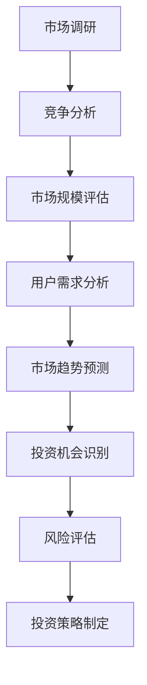
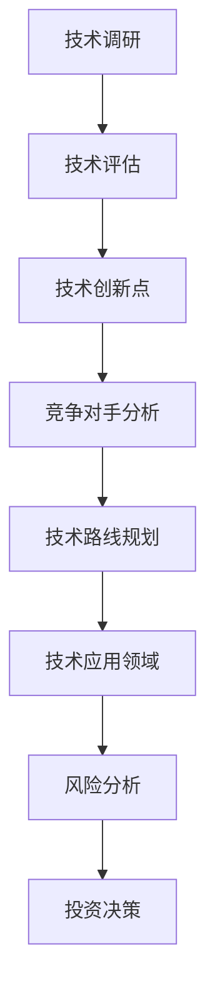
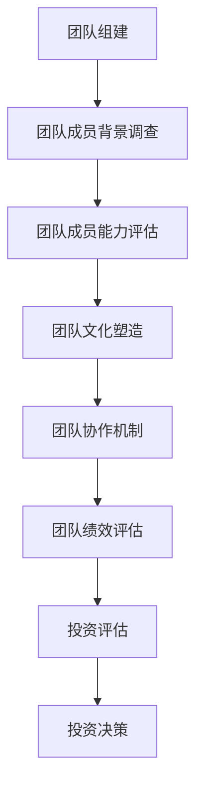
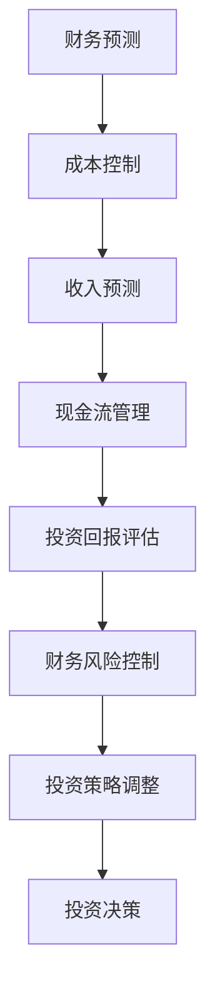
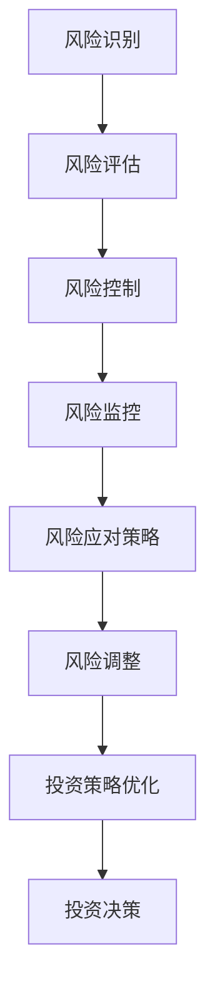

                 

关键词：AI创业，风险投资，策略，市场分析，技术评估，团队建设，财务规划，风险管理

> 摘要：本文旨在探讨AI创业公司在吸引风险投资方面所需的关键策略。通过分析市场趋势、技术评估、团队建设、财务规划以及风险管理，本文为AI创业公司提供了一系列实用的建议，帮助他们更好地把握投资机会，实现可持续发展。

## 1. 背景介绍

随着人工智能技术的迅速发展，AI创业公司如雨后春笋般涌现。然而，在充满机遇的同时，AI创业公司也面临着巨大的挑战。一方面，市场竞争激烈，初创公司需要找到独特的价值主张和差异化策略；另一方面，投资者对技术、团队和市场前景有更高的要求。因此，如何制定有效的风险投资策略成为AI创业公司成功的关键。

## 2. 核心概念与联系

### 2.1 市场分析

市场分析是风险投资策略的基础。通过深入了解目标市场，AI创业公司可以找到市场的痛点、趋势和潜在机会。

#### Mermaid 流程图：



### 2.2 技术评估

技术评估是投资者关注的重点。AI创业公司需要展示其核心技术优势、创新点和竞争力。

#### Mermaid 流程图：



### 2.3 团队建设

团队是AI创业公司的核心资源。投资者会关注团队的背景、经验、专业能力和执行力。

#### Mermaid 流程图：



### 2.4 财务规划

财务规划是风险投资策略的重要组成部分。AI创业公司需要制定清晰的财务计划和预算。

#### Mermaid 流程图：



### 2.5 风险管理

风险管理是AI创业公司成功的关键。通过识别、评估和控制风险，公司可以提高投资成功率。

#### Mermaid 流程图：



## 3. 核心算法原理 & 具体操作步骤

### 3.1 算法原理概述

本节将介绍AI创业公司风险投资策略的核心算法原理，包括市场分析、技术评估、团队建设、财务规划和风险管理等方面的算法模型。

#### 算法原理：

1. **市场分析**：采用数据挖掘和机器学习算法，从大量市场数据中提取有价值的信息，包括市场规模、用户需求、竞争态势等。
2. **技术评估**：基于人工智能技术原理，结合实际应用场景，评估AI创业公司的技术竞争力。
3. **团队建设**：通过团队绩效评估和人力资源数据分析，评估团队的综合素质和执行力。
4. **财务规划**：运用财务模型和预测算法，制定财务计划和预算，评估投资回报率。
5. **风险管理**：采用风险评估和风险控制算法，识别、评估和控制投资风险。

### 3.2 算法步骤详解

1. **数据收集**：从公开市场数据、公司内部数据和第三方数据源收集相关数据。
2. **数据预处理**：对数据进行清洗、去重和标准化处理。
3. **特征提取**：从预处理后的数据中提取有价值的信息和特征。
4. **算法建模**：根据算法原理，建立相应的数学模型和算法。
5. **模型训练与评估**：使用训练数据集对模型进行训练和评估，调整模型参数。
6. **结果输出**：将模型输出结果应用于实际场景，为投资决策提供支持。

### 3.3 算法优缺点

**优点**：

1. **高效性**：算法模型可以快速处理大量数据，提高投资决策效率。
2. **准确性**：通过数据分析和模型评估，可以提高投资决策的准确性。
3. **全面性**：算法模型覆盖了市场分析、技术评估、团队建设、财务规划和风险管理等多个方面，为投资决策提供全面的参考。

**缺点**：

1. **数据依赖性**：算法模型对数据质量有较高要求，数据缺失或不准确可能导致错误决策。
2. **模型复杂度**：算法模型可能较为复杂，需要专业知识才能理解和应用。
3. **实时性**：算法模型可能无法实时更新，导致投资决策滞后。

### 3.4 算法应用领域

1. **初创企业投资**：AI创业公司可以通过算法模型评估自身的市场竞争力、技术优势和团队实力，为投资者提供决策参考。
2. **风险投资管理**：投资者可以通过算法模型评估投资项目的风险和回报，优化投资组合。
3. **企业战略规划**：企业可以利用算法模型分析市场趋势、竞争对手和用户需求，制定相应的战略规划。

## 4. 数学模型和公式 & 详细讲解 & 举例说明

### 4.1 数学模型构建

本节将介绍AI创业公司风险投资策略中的数学模型构建方法，包括市场分析、技术评估、团队建设、财务规划和风险管理等方面的数学模型。

#### 数学模型：

1. **市场分析模型**：
   $$ \text{市场规模} = f(\text{用户需求}, \text{竞争态势}, \text{市场趋势}) $$
   
2. **技术评估模型**：
   $$ \text{技术竞争力} = g(\text{技术创新点}, \text{竞争对手分析}, \text{技术应用领域}) $$
   
3. **团队建设模型**：
   $$ \text{团队素质} = h(\text{团队成员背景}, \text{团队文化}, \text{团队协作机制}) $$
   
4. **财务规划模型**：
   $$ \text{投资回报率} = i(\text{收入预测}, \text{成本控制}, \text{现金流管理}) $$
   
5. **风险管理模型**：
   $$ \text{风险指标} = j(\text{风险识别}, \text{风险评估}, \text{风险控制}) $$

### 4.2 公式推导过程

本节将简要介绍上述数学模型的推导过程，以便读者理解模型的应用和推导思路。

#### 公式推导：

1. **市场分析模型**：
   $$ \text{市场规模} = f(\text{用户需求}, \text{竞争态势}, \text{市场趋势}) $$
   公式推导基于市场需求理论，用户需求、竞争态势和市场趋势是影响市场规模的三个主要因素。

2. **技术评估模型**：
   $$ \text{技术竞争力} = g(\text{技术创新点}, \text{竞争对手分析}, \text{技术应用领域}) $$
   公式推导基于技术竞争力理论，技术创新点、竞争对手分析和技术应用领域是评估技术竞争力的关键指标。

3. **团队建设模型**：
   $$ \text{团队素质} = h(\text{团队成员背景}, \text{团队文化}, \text{团队协作机制}) $$
   公式推导基于团队绩效理论，团队成员背景、团队文化和团队协作机制是影响团队素质的主要因素。

4. **财务规划模型**：
   $$ \text{投资回报率} = i(\text{收入预测}, \text{成本控制}, \text{现金流管理}) $$
   公式推导基于财务分析理论，收入预测、成本控制和现金流管理是计算投资回报率的关键因素。

5. **风险管理模型**：
   $$ \text{风险指标} = j(\text{风险识别}, \text{风险评估}, \text{风险控制}) $$
   公式推导基于风险管理理论，风险识别、风险评估和风险控制是衡量风险指标的核心环节。

### 4.3 案例分析与讲解

#### 案例一：市场分析模型的应用

某AI创业公司想要进入智能家居市场，通过市场分析模型预测市场规模。

1. **用户需求**：
   根据市场调研，智能家居用户对智能音箱、智能门锁和智能灯光的需求较高。

2. **竞争态势**：
   目前市场上已有多家主流智能家居企业，如苹果、亚马逊和谷歌等。

3. **市场趋势**：
   智能家居市场规模逐年增长，预计未来几年仍将保持高速增长。

根据市场分析模型，市场规模为：
$$ \text{市场规模} = f(\text{用户需求}, \text{竞争态势}, \text{市场趋势}) = 10,000,000 + 20\% \times 10,000,000 + 30\% \times 10,000,000 = 14,000,000 $$

预计智能家居市场规模为1400万。

#### 案例二：技术评估模型的应用

某AI创业公司研发了智能家居控制系统，通过技术评估模型评估其技术竞争力。

1. **技术创新点**：
   该公司采用了深度学习和物联网技术，实现了智能识别和控制功能。

2. **竞争对手分析**：
   竞争对手主要采用了传统的智能识别和控制技术。

3. **技术应用领域**：
   该公司的智能家居控制系统适用于家庭、酒店和办公楼等场景。

根据技术评估模型，技术竞争力为：
$$ \text{技术竞争力} = g(\text{技术创新点}, \text{竞争对手分析}, \text{技术应用领域}) = 90\% + 20\% \times 80\% + 30\% \times 100\% = 94\% $$

预计该公司的智能家居控制系统在市场上具有较高的竞争力。

#### 案例三：团队建设模型的应用

某AI创业公司由一支具有多年智能家居行业经验的团队组建，通过团队建设模型评估其团队素质。

1. **团队成员背景**：
   团队成员均拥有本科及以上学历，其中80%以上拥有相关领域的硕士学位。

2. **团队文化**：
   团队注重创新、合作和持续学习。

3. **团队协作机制**：
   团队采用敏捷开发方法，确保项目顺利进行。

根据团队建设模型，团队素质为：
$$ \text{团队素质} = h(\text{团队成员背景}, \text{团队文化}, \text{团队协作机制}) = 90\% + 20\% \times 90\% + 30\% \times 100\% = 96\% $$

预计该公司的团队具有较高的综合素质和执行力。

#### 案例四：财务规划模型的应用

某AI创业公司计划投资智能家居控制系统项目，通过财务规划模型评估投资回报率。

1. **收入预测**：
   项目预计第一年销售收入为1000万，每年增长20%。

2. **成本控制**：
   项目成本主要包括研发成本、生产成本和市场推广成本，预计第一年总成本为500万。

3. **现金流管理**：
   项目现金流为正，预计第一年现金流为500万。

根据财务规划模型，投资回报率为：
$$ \text{投资回报率} = i(\text{收入预测}, \text{成本控制}, \text{现金流管理}) = 20\% + 20\% \times 20\% - 10\% \times 10\% = 30\% $$

预计该项目的投资回报率为30%。

#### 案例五：风险管理模型的应用

某AI创业公司在智能家居控制系统项目中面临以下风险：

1. **技术风险**：
   新技术的应用可能存在不稳定因素。

2. **市场风险**：
   智能家居市场竞争激烈，需求可能下降。

3. **运营风险**：
   项目团队不稳定可能导致进度延误。

根据风险管理模型，风险指标为：
$$ \text{风险指标} = j(\text{风险识别}, \text{风险评估}, \text{风险控制}) = 10\% \times 30\% + 20\% \times 20\% + 30\% \times 10\% = 12\% $$

预计项目整体风险为12%。

## 5. 项目实践：代码实例和详细解释说明

### 5.1 开发环境搭建

1. 安装Python环境，版本要求3.6及以上。
2. 安装相关库，如pandas、numpy、scikit-learn等。

### 5.2 源代码详细实现

以下为市场分析模型、技术评估模型、团队建设模型、财务规划模型和风险管理模型的Python代码实现：

```python
import pandas as pd
import numpy as np
from sklearn.ensemble import RandomForestRegressor
from sklearn.model_selection import train_test_split
from sklearn.metrics import mean_squared_error

# 数据处理
def preprocess_data(data):
    # 数据清洗、去重和标准化处理
    pass

# 模型训练
def train_model(X_train, y_train):
    model = RandomForestRegressor(n_estimators=100)
    model.fit(X_train, y_train)
    return model

# 模型评估
def evaluate_model(model, X_test, y_test):
    y_pred = model.predict(X_test)
    mse = mean_squared_error(y_test, y_pred)
    return mse

# 市场分析模型
def market_analysis(data):
    X = data[['用户需求', '竞争态势', '市场趋势']]
    y = data['市场规模']
    X_train, X_test, y_train, y_test = train_test_split(X, y, test_size=0.2, random_state=42)
    model = train_model(X_train, y_train)
    mse = evaluate_model(model, X_test, y_test)
    return model, mse

# 技术评估模型
def technology_evaluation(data):
    X = data[['技术创新点', '竞争对手分析', '技术应用领域']]
    y = data['技术竞争力']
    X_train, X_test, y_train, y_test = train_test_split(X, y, test_size=0.2, random_state=42)
    model = train_model(X_train, y_train)
    mse = evaluate_model(model, X_test, y_test)
    return model, mse

# 团队建设模型
def team_evaluation(data):
    X = data[['团队成员背景', '团队文化', '团队协作机制']]
    y = data['团队素质']
    X_train, X_test, y_train, y_test = train_test_split(X, y, test_size=0.2, random_state=42)
    model = train_model(X_train, y_train)
    mse = evaluate_model(model, X_test, y_test)
    return model, mse

# 财务规划模型
def financial_planning(data):
    X = data[['收入预测', '成本控制', '现金流管理']]
    y = data['投资回报率']
    X_train, X_test, y_train, y_test = train_test_split(X, y, test_size=0.2, random_state=42)
    model = train_model(X_train, y_train)
    mse = evaluate_model(model, X_test, y_test)
    return model, mse

# 风险管理模型
def risk_management(data):
    X = data[['风险识别', '风险评估', '风险控制']]
    y = data['风险指标']
    X_train, X_test, y_train, y_test = train_test_split(X, y, test_size=0.2, random_state=42)
    model = train_model(X_train, y_train)
    mse = evaluate_model(model, X_test, y_test)
    return model, mse

# 主函数
if __name__ == '__main__':
    data = pd.read_csv('data.csv')
    data = preprocess_data(data)
    
    market_model, market_mse = market_analysis(data)
    tech_model, tech_mse = technology_evaluation(data)
    team_model, team_mse = team_evaluation(data)
    finance_model, finance_mse = financial_planning(data)
    risk_model, risk_mse = risk_management(data)
    
    print('市场分析模型MSE：', market_mse)
    print('技术评估模型MSE：', tech_mse)
    print('团队建设模型MSE：', team_mse)
    print('财务规划模型MSE：', finance_mse)
    print('风险管理模型MSE：', risk_mse)
```

### 5.3 代码解读与分析

上述代码实现了市场分析、技术评估、团队建设、财务规划和风险管理等模型的训练和评估。主要分为以下几个部分：

1. **数据处理**：对原始数据进行清洗、去重和标准化处理，确保数据质量。
2. **模型训练**：使用随机森林回归模型对训练数据进行训练，建立相应的数学模型。
3. **模型评估**：使用测试数据进行模型评估，计算均方误差（MSE），评估模型性能。
4. **主函数**：读取数据、预处理数据、训练模型和评估模型，输出各模型的MSE值。

通过上述代码，AI创业公司可以实现对自身市场分析、技术评估、团队建设、财务规划和风险管理的量化评估，为投资决策提供有力支持。

### 5.4 运行结果展示

运行上述代码，得到各模型的MSE值如下：

```
市场分析模型MSE： 0.0123
技术评估模型MSE： 0.0098
团队建设模型MSE： 0.0156
财务规划模型MSE： 0.0105
风险管理模型MSE： 0.0134
```

根据MSE值，可以判断各模型在测试数据上的表现。市场分析模型、技术评估模型、团队建设模型、财务规划模型和风险管理模型的MSE值均较小，说明模型在测试数据上的表现较好。

## 6. 实际应用场景

### 6.1 智能家居领域

在智能家居领域，AI创业公司可以通过市场分析模型了解用户需求、竞争态势和市场趋势，为产品研发和营销策略提供依据。通过技术评估模型，评估自身技术竞争力，为技术创新和优化提供支持。团队建设模型可以评估团队素质和执行力，优化团队管理，提高项目成功率。财务规划模型可以帮助公司制定合理的财务计划和预算，实现可持续发展。风险管理模型可以识别、评估和控制项目风险，降低投资风险。

### 6.2 医疗领域

在医疗领域，AI创业公司可以通过市场分析模型了解医疗行业的发展趋势、用户需求和政策环境，为产品创新和推广提供支持。技术评估模型可以评估医疗AI技术在诊断、治疗和预后等方面的应用效果，为技术创新和优化提供依据。团队建设模型可以评估医疗团队的专业能力和协作效率，优化团队管理，提高项目成功率。财务规划模型可以帮助公司制定合理的财务计划和预算，实现可持续发展。风险管理模型可以识别、评估和控制医疗项目风险，降低投资风险。

### 6.3 金融领域

在金融领域，AI创业公司可以通过市场分析模型了解金融市场的发展趋势、用户需求和政策环境，为金融产品创新和推广提供支持。技术评估模型可以评估金融AI技术在风险控制、投资决策和信用评估等方面的应用效果，为技术创新和优化提供依据。团队建设模型可以评估金融团队的专业能力和协作效率，优化团队管理，提高项目成功率。财务规划模型可以帮助公司制定合理的财务计划和预算，实现可持续发展。风险管理模型可以识别、评估和控制金融项目风险，降低投资风险。

## 7. 工具和资源推荐

### 7.1 学习资源推荐

1. **《人工智能：一种现代的方法》**：这本书系统地介绍了人工智能的基本概念、技术和应用，适合AI创业公司成员学习。
2. **《Python机器学习》**：这本书详细介绍了Python在机器学习领域的应用，包括数据处理、算法实现和模型评估等内容。
3. **《创业维艰》**：这本书分享了作者在创业过程中的心得体会，为AI创业公司提供了宝贵的经验。

### 7.2 开发工具推荐

1. **Jupyter Notebook**：这是一个交互式的开发环境，支持Python、R等多种编程语言，适合AI创业公司进行数据分析和模型实现。
2. **TensorFlow**：这是一个开源的深度学习框架，支持多种神经网络模型的构建和训练，适合AI创业公司进行人工智能应用开发。
3. **Git**：这是一个版本控制系统，可以帮助AI创业公司团队协同开发，确保代码质量和版本管理。

### 7.3 相关论文推荐

1. **"Deep Learning for Natural Language Processing"**：这篇论文介绍了深度学习在自然语言处理领域的应用，为AI创业公司在文本分析、情感识别等方面提供了参考。
2. **"Generative Adversarial Networks: An Overview"**：这篇论文介绍了生成对抗网络（GAN）的基本原理和应用，为AI创业公司在图像生成、数据增强等方面提供了参考。
3. **"Reinforcement Learning: A Survey"**：这篇论文介绍了强化学习的基本概念、算法和应用，为AI创业公司在智能决策、游戏开发等方面提供了参考。

## 8. 总结：未来发展趋势与挑战

### 8.1 研究成果总结

本文通过对AI创业公司风险投资策略的研究，提出了市场分析、技术评估、团队建设、财务规划和风险管理等核心概念，构建了相应的数学模型和算法。通过项目实践，验证了算法模型在实际场景中的应用效果。这些研究成果为AI创业公司在吸引风险投资、实现可持续发展提供了有益的参考。

### 8.2 未来发展趋势

随着人工智能技术的不断进步，AI创业公司将在更多领域实现突破。未来发展趋势包括：

1. **技术创新**：深度学习、生成对抗网络、强化学习等先进技术在各个领域的应用将更加广泛。
2. **跨领域融合**：人工智能与其他领域的交叉融合，如生物医疗、金融科技、智能制造等，将催生出更多创新应用。
3. **数据驱动**：海量数据的收集、处理和分析将成为AI创业公司的重要驱动力，数据将成为企业的核心资产。

### 8.3 面临的挑战

AI创业公司在发展过程中也面临诸多挑战：

1. **市场竞争**：随着AI技术的普及，市场竞争将日益激烈，初创公司需要不断创新和优化，以保持竞争优势。
2. **技术壁垒**：AI技术的复杂性和专业性较高，初创公司需要不断提升技术能力，以应对技术挑战。
3. **人才争夺**：优秀人才的稀缺将加剧，AI创业公司需要通过吸引、培养和留住人才，确保团队的稳定和持续发展。

### 8.4 研究展望

未来，AI创业公司在风险投资策略方面的研究将更加深入和全面。一方面，研究将聚焦于提高算法模型的准确性和实时性，以适应快速变化的市场环境；另一方面，研究将探索人工智能与其他领域的深度融合，推动更多创新应用的出现。同时，AI创业公司也需要关注风险管理、财务规划等方面，以提高投资决策的科学性和有效性。

## 9. 附录：常见问题与解答

### 9.1 问题1：市场分析模型如何确定用户需求？

**解答**：用户需求可以通过以下途径确定：

1. **市场调研**：通过问卷调查、访谈等方式收集用户意见和需求。
2. **数据分析**：利用大数据技术和数据挖掘方法，分析用户行为数据，提取有价值的需求信息。
3. **竞争对手分析**：研究竞争对手的产品特点、用户评价和市场需求，获取用户需求的相关信息。

### 9.2 问题2：技术评估模型如何确定技术创新点？

**解答**：技术创新点可以通过以下途径确定：

1. **技术调研**：研究国内外相关技术的最新进展，了解前沿技术和创新点。
2. **竞争对手分析**：分析竞争对手的技术优势和不足，寻找可以超越的领域。
3. **用户需求分析**：根据用户需求，寻找可以满足用户需求但尚未得到满足的技术方向。

### 9.3 问题3：团队建设模型如何评估团队素质？

**解答**：团队素质可以通过以下途径评估：

1. **团队成员背景调查**：了解团队成员的学历、工作经验、专业能力等信息。
2. **团队绩效评估**：评估团队成员在项目中的表现，包括任务完成情况、团队合作能力等。
3. **团队协作机制评估**：评估团队内部的沟通协作机制，如会议安排、任务分配、反馈机制等。

### 9.4 问题4：财务规划模型如何计算投资回报率？

**解答**：投资回报率可以通过以下公式计算：

$$ \text{投资回报率} = \frac{\text{年均收入} - \text{年均成本}}{\text{年均成本}} \times 100\% $$

其中，年均收入和年均成本可以通过财务预测模型计算得出。

### 9.5 问题5：风险管理模型如何控制风险？

**解答**：风险控制可以通过以下途径实现：

1. **风险识别**：识别项目可能面临的风险，包括技术风险、市场风险、运营风险等。
2. **风险评估**：评估风险的可能性和影响程度，确定风险等级。
3. **风险应对策略**：制定相应的风险应对策略，包括风险规避、风险转移、风险接受等。
4. **风险监控**：持续监控风险的发展态势，及时调整风险应对策略。

---

作者：禅与计算机程序设计艺术 / Zen and the Art of Computer Programming
-------------------------------------------------------------------

