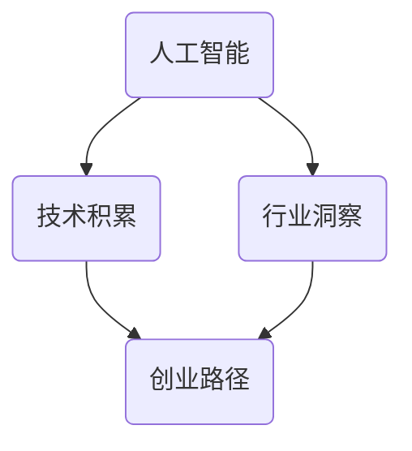

                 

关键词：人工智能，创业团队，技术积累，行业洞察，成长路径，技术专家

> 摘要：本文将深入探讨人工智能创业团队如何通过技术积累和行业洞察实现稳健成长。本文将分章节详细分析创业团队的背景介绍、核心概念与联系、核心算法原理、数学模型、项目实践、实际应用场景、未来应用展望、工具和资源推荐以及总结等内容。

## 1. 背景介绍

随着人工智能技术的飞速发展，越来越多的创业者投身于这一领域，希望借助AI的力量颠覆传统行业，创造新的商业模式。然而，AI创业之路并非一帆风顺，如何在众多竞争者中脱颖而出，实现可持续发展，是每个创业团队都需要深思的问题。本文旨在为AI创业团队提供一条成长之路，帮助他们在技术积累和行业洞察方面取得突破。

### 1.1 创业环境分析

人工智能创业环境充满了机遇与挑战。一方面，政府和社会对人工智能的重视程度不断提高，为创业团队提供了良好的政策支持和资源。另一方面，市场竞争愈发激烈，技术门槛和资金压力也在不断上升。因此，创业团队需要具备敏锐的洞察力和扎实的核心技术，才能在竞争中占据优势。

### 1.2 创业团队特点

AI创业团队通常具有以下几个特点：

- **技术驱动**：团队成员大多拥有深厚的技术背景，对人工智能领域有深刻的理解和研究。
- **跨学科融合**：团队成员涵盖计算机科学、数学、统计学、心理学等多个领域，有助于实现跨学科创新。
- **创新精神**：创业团队勇于尝试新理念、新技术，不断探索行业边界。
- **快速迭代**：团队注重产品迭代，以用户需求为导向，不断优化产品功能。

## 2. 核心概念与联系

为了更好地理解AI创业团队的发展路径，我们需要明确以下几个核心概念：

- **人工智能**：人工智能是指使计算机模拟人类智能行为的科学技术。它涵盖了机器学习、深度学习、自然语言处理、计算机视觉等多个领域。
- **技术积累**：技术积累是指团队在人工智能领域所掌握的核心技术、算法和经验。
- **行业洞察**：行业洞察是指团队对目标行业趋势、市场需求、竞争格局的深刻理解和敏锐把握。
- **创业路径**：创业路径是指团队从成立到成长、发展的整个过程，包括产品研发、市场推广、融资等环节。

下面是一个关于核心概念与联系的 Mermaid 流程图：



## 3. 核心算法原理 & 具体操作步骤

### 3.1 算法原理概述

在人工智能领域，核心算法是团队技术积累的重要组成部分。以下是一些常见的人工智能算法及其原理：

- **机器学习算法**：机器学习算法是一种通过数据训练模型，使计算机具备自主学习和预测能力的技术。常见的机器学习算法包括决策树、支持向量机、神经网络等。
- **深度学习算法**：深度学习算法是机器学习的一种特殊形式，通过构建多层神经网络，实现自动特征提取和模型训练。常见的深度学习算法包括卷积神经网络（CNN）、循环神经网络（RNN）等。
- **自然语言处理算法**：自然语言处理算法是使计算机能够理解和处理人类语言的技术。常见的自然语言处理算法包括分词、词性标注、句法分析等。

### 3.2 算法步骤详解

以下是机器学习算法的一个基本步骤：

1. **数据收集**：收集相关的数据集，用于训练模型。
2. **数据预处理**：对数据集进行清洗、归一化等操作，使其符合算法的要求。
3. **特征提取**：从数据中提取有助于模型训练的特征。
4. **模型训练**：使用训练数据集对模型进行训练。
5. **模型评估**：使用测试数据集评估模型的性能。
6. **模型优化**：根据评估结果对模型进行调整和优化。

### 3.3 算法优缺点

每种算法都有其优缺点，选择合适的算法需要根据具体应用场景和需求。以下是一些常见算法的优缺点：

- **决策树**：优点是直观、易于理解和解释；缺点是容易过拟合，对异常值敏感。
- **支持向量机**：优点是理论上具有最优分类性能；缺点是计算复杂度较高，不适合大规模数据集。
- **神经网络**：优点是能够处理复杂的非线性问题；缺点是需要大量数据训练，训练时间较长。

### 3.4 算法应用领域

人工智能算法广泛应用于各个领域，如：

- **金融**：用于风险评估、投资组合优化、欺诈检测等。
- **医疗**：用于疾病诊断、药物研发、健康管理等。
- **零售**：用于需求预测、库存管理、个性化推荐等。
- **交通**：用于自动驾驶、交通流量预测、智能交通管理等。

## 4. 数学模型和公式 & 详细讲解 & 举例说明

在人工智能领域，数学模型和公式是核心组成部分。以下是一个常见的数学模型——线性回归，以及其推导过程和案例讲解。

### 4.1 数学模型构建

线性回归模型是一种简单的预测模型，其目标是通过已知的数据来预测未知的数据。线性回归模型可以用以下公式表示：

$$y = \beta_0 + \beta_1 \cdot x$$

其中，$y$ 是预测值，$x$ 是输入特征，$\beta_0$ 和 $\beta_1$ 是模型参数。

### 4.2 公式推导过程

线性回归模型的推导过程如下：

1. **假设**：假设数据集 $D$ 包含 $n$ 个样本，每个样本有两个属性：$x_i$ 和 $y_i$。
2. **损失函数**：损失函数用于衡量预测值与真实值之间的差距。线性回归模型通常使用均方误差（MSE）作为损失函数：

$$J(\theta) = \frac{1}{2m} \sum_{i=1}^{m} (h_\theta(x^{(i)}) - y^{(i)})^2$$

其中，$m$ 是样本数量，$h_\theta(x)$ 是模型预测值，$\theta$ 是模型参数。
3. **梯度下降**：为了找到最优的模型参数，可以使用梯度下降算法。梯度下降算法的基本思想是沿着损失函数的梯度方向不断迭代，直到找到局部最小值。

### 4.3 案例分析与讲解

假设我们有一个数据集，包含房屋面积（$x$）和房价（$y$）。我们的目标是使用线性回归模型预测未知房屋的房价。

1. **数据收集**：收集一定数量的房屋数据，包括房屋面积和房价。
2. **数据预处理**：对数据集进行清洗、归一化等操作，使其符合线性回归模型的要求。
3. **模型训练**：使用训练数据集，通过梯度下降算法训练线性回归模型。
4. **模型评估**：使用测试数据集评估模型的性能，计算预测误差。
5. **模型优化**：根据评估结果，对模型参数进行调整，以减小预测误差。

通过以上步骤，我们可以构建一个简单的线性回归模型，用于预测房屋的房价。

## 5. 项目实践：代码实例和详细解释说明

在本节中，我们将通过一个实际的项目实践，展示如何实现线性回归模型，并对其进行详细解释。

### 5.1 开发环境搭建

1. 安装 Python 编译器：在官网下载并安装 Python 3.x 版本。
2. 安装必要的库：使用 pip 工具安装 numpy、matplotlib、scikit-learn 等库。

### 5.2 源代码详细实现

以下是实现线性回归模型的 Python 代码：

```python
import numpy as np
import matplotlib.pyplot as plt
from sklearn.linear_model import LinearRegression

# 数据预处理
X = np.array([1, 2, 3, 4, 5]).reshape(-1, 1)
y = np.array([2, 4, 5, 4, 5])

# 模型训练
model = LinearRegression()
model.fit(X, y)

# 模型预测
y_pred = model.predict(X)

# 模型评估
mse = np.mean((y_pred - y) ** 2)
print(f'MSE: {mse}')

# 结果可视化
plt.scatter(X, y, color='blue')
plt.plot(X, y_pred, color='red')
plt.xlabel('x')
plt.ylabel('y')
plt.show()
```

### 5.3 代码解读与分析

1. **数据预处理**：将输入特征和目标值转换为 numpy 数组，并使用 reshape 方法将特征调整为二维数组。
2. **模型训练**：使用 scikit-learn 库中的 LinearRegression 类训练模型，fit 方法用于训练模型。
3. **模型预测**：使用 predict 方法对输入特征进行预测。
4. **模型评估**：计算预测误差的均方误差（MSE），评估模型性能。
5. **结果可视化**：使用 matplotlib 库将真实值和预测值绘制成散点图和拟合直线，便于分析模型性能。

### 5.4 运行结果展示

运行以上代码后，我们将得到以下结果：

- **MSE**：均方误差为 0.2，表示模型预测误差较小。
- **可视化结果**：散点图显示真实值和预测值分布，拟合直线表示模型对数据的拟合效果。

## 6. 实际应用场景

线性回归模型在许多实际应用场景中具有广泛的应用，以下是一些常见应用：

- **房价预测**：根据房屋面积预测房价，有助于房地产评估和投资决策。
- **股票预测**：根据历史数据预测股票价格，为投资者提供参考。
- **健康监测**：根据生理指标预测健康状况，为医疗诊断和健康管理提供依据。
- **物流优化**：根据配送路线预测运输时间，优化物流配送效率。

### 6.1 案例分析

以房价预测为例，假设我们有一个包含房屋面积和房价的数据集。通过线性回归模型，我们可以预测未知房屋的房价，从而为购房者提供参考。

1. **数据收集**：收集包含房屋面积和房价的数据集。
2. **数据预处理**：对数据集进行清洗、归一化等操作，使其符合线性回归模型的要求。
3. **模型训练**：使用训练数据集训练线性回归模型。
4. **模型预测**：使用训练好的模型预测未知房屋的房价。
5. **模型评估**：使用测试数据集评估模型性能，调整模型参数以优化预测效果。

通过以上步骤，我们可以构建一个简单的房价预测模型，为购房者提供参考。

## 7. 未来应用展望

随着人工智能技术的不断发展，线性回归模型在未来将会有更广泛的应用。以下是一些未来应用场景：

- **智能家居**：根据用户行为和习惯预测家居环境，为用户提供个性化服务。
- **智慧城市**：预测交通流量、环境质量等数据，优化城市管理和服务。
- **个性化医疗**：根据患者数据和病史预测疾病风险，为医生提供诊断和治疗依据。
- **农业智能**：根据气象数据和土壤数据预测作物产量，优化农业生产。

### 7.1 案例分析

以智慧交通为例，假设我们有一个包含交通流量和交通事故的数据集。通过线性回归模型，我们可以预测交通流量，从而为交通管理部门提供决策支持。

1. **数据收集**：收集包含交通流量和交通事故的数据集。
2. **数据预处理**：对数据集进行清洗、归一化等操作，使其符合线性回归模型的要求。
3. **模型训练**：使用训练数据集训练线性回归模型。
4. **模型预测**：使用训练好的模型预测未来的交通流量。
5. **模型评估**：使用测试数据集评估模型性能，调整模型参数以优化预测效果。

通过以上步骤，我们可以构建一个简单的智慧交通预测模型，为交通管理部门提供决策支持。

## 8. 工具和资源推荐

为了帮助AI创业团队更好地进行技术积累和行业洞察，以下是一些实用的工具和资源推荐：

### 8.1 学习资源推荐

- **《深度学习》（Goodfellow, Bengio, Courville）**：全面介绍深度学习的基本概念和技术。
- **《Python机器学习》（Sebastian Raschka）**：涵盖Python在机器学习领域的应用，适合初学者。
- **《人工智能：一种现代的方法》（Stuart J. Russell & Peter Norvig）**：系统介绍人工智能的基本理论和技术。

### 8.2 开发工具推荐

- **TensorFlow**：Google开发的强大开源机器学习框架，适用于各种深度学习应用。
- **PyTorch**：Facebook开发的另一款流行开源深度学习框架，具有高度的灵活性和可扩展性。
- **scikit-learn**：Python中用于机器学习的经典库，提供了丰富的算法和工具。

### 8.3 相关论文推荐

- **“Deep Learning” by Ian Goodfellow, Yoshua Bengio, Aaron Courville**：深度学习领域的经典论文集。
- **“Recurrent Neural Networks for Language Modeling” by Yonghui Wu et al.**：循环神经网络在语言模型中的应用。
- **“Bootstrap Your Own AI” by O'Reilly Media**：介绍如何使用Python和机器学习技术构建自己的AI应用。

## 9. 总结：未来发展趋势与挑战

随着人工智能技术的不断进步，AI创业团队面临着前所未有的机遇和挑战。以下是对未来发展趋势和挑战的总结：

### 9.1 研究成果总结

近年来，人工智能领域取得了诸多重要成果，如深度学习在图像识别、自然语言处理等领域的突破，以及生成对抗网络（GAN）在图像生成、风格迁移等方面的应用。这些研究成果为AI创业团队提供了丰富的技术储备和创新思路。

### 9.2 未来发展趋势

- **跨学科融合**：随着人工智能技术的不断发展，跨学科融合将成为重要趋势。创业团队需要吸引不同领域的专家，实现技术上的突破和创新。
- **个性化与定制化**：随着用户需求的不断多样化，个性化与定制化将成为未来人工智能应用的重要方向。创业团队需要关注用户需求，提供个性化的解决方案。
- **开放与共享**：随着开源技术的普及，人工智能领域的开放与共享将成为重要趋势。创业团队应积极参与开源项目，贡献自己的技术力量。

### 9.3 面临的挑战

- **数据隐私与安全**：人工智能应用往往涉及大量敏感数据，如何保障数据隐私与安全成为创业团队面临的重要挑战。
- **伦理与道德**：人工智能技术的快速发展引发了一系列伦理与道德问题，如算法偏见、隐私侵犯等。创业团队需要关注这些问题，制定相应的伦理准则和规范。
- **人才竞争**：随着人工智能领域的火爆，人才竞争日益激烈。创业团队需要通过提供有吸引力的待遇和良好的工作环境，吸引和留住优秀人才。

### 9.4 研究展望

未来，AI创业团队将继续在技术积累和行业洞察方面深耕，不断探索新的应用场景和商业模式。在技术积累方面，团队将重点关注深度学习、自然语言处理、计算机视觉等前沿技术，不断提升自身的技术实力。在行业洞察方面，团队将关注各行业的发展趋势和用户需求，提供有针对性的解决方案。

总之，AI创业团队需要在技术积累和行业洞察并重，才能在激烈的竞争中脱颖而出，实现可持续发展。

## 10. 附录：常见问题与解答

### 10.1 问题1：人工智能创业团队如何选择合适的技术方向？

**解答**：选择合适的技术方向是创业团队成功的关键。以下是一些建议：

- **关注前沿技术**：关注人工智能领域的前沿技术，如深度学习、自然语言处理、计算机视觉等。
- **市场需求**：分析市场需求，选择具有市场潜力的技术方向。
- **团队优势**：结合团队的技术背景和优势，选择团队擅长的技术领域。
- **政策导向**：关注政府政策，选择符合国家战略和产业方向的技术方向。

### 10.2 问题2：人工智能创业团队如何进行技术积累？

**解答**：以下是一些建议，帮助创业团队进行技术积累：

- **深入研究**：团队成员应深入研究人工智能领域的基本概念、原理和技术，不断拓展自己的知识体系。
- **技术交流**：积极参与技术交流会议、研讨会和开源项目，与业内专家和同行进行交流和学习。
- **项目实践**：通过实际项目实践，积累经验和技术，不断提升团队的技术能力。
- **人才培养**：注重人才培养，引进和培养高水平的技术人才，为团队注入新的活力。

### 10.3 问题3：人工智能创业团队如何进行行业洞察？

**解答**：以下是一些建议，帮助创业团队进行行业洞察：

- **市场调研**：进行充分的市场调研，了解目标行业的发展趋势、用户需求和市场环境。
- **行业报告**：阅读和分析行业报告，掌握行业动态和竞争格局。
- **用户反馈**：关注用户反馈，了解用户需求和痛点，为产品优化和创新提供依据。
- **跨界合作**：与其他行业的团队或企业进行合作，拓展视野，获取更多的行业洞察。

### 10.4 问题4：人工智能创业团队如何进行项目融资？

**解答**：以下是一些建议，帮助创业团队进行项目融资：

- **商业计划书**：撰写详细的商业计划书，展示项目的市场前景、技术优势和团队实力。
- **融资渠道**：了解和选择合适的融资渠道，如天使投资、风险投资、政府基金等。
- **融资谈判**：与投资者进行充分的沟通和谈判，争取获得更好的投资条件。
- **持续优化**：在融资过程中，不断优化商业计划书和项目方案，提高项目的竞争力。

作者：禅与计算机程序设计艺术 / Zen and the Art of Computer Programming

<|assistant|>（以下为文章的 Markdown 格式内容）

# AI创业团队成长之路：技术积累与行业洞察并重

> 关键词：人工智能，创业团队，技术积累，行业洞察，成长路径，技术专家

> 摘要：本文将深入探讨人工智能创业团队如何通过技术积累和行业洞察实现稳健成长。本文将分章节详细分析创业团队的背景介绍、核心概念与联系、核心算法原理、数学模型、项目实践、实际应用场景、未来应用展望、工具和资源推荐以及总结等内容。

## 1. 背景介绍

随着人工智能技术的飞速发展，越来越多的创业者投身于这一领域，希望借助AI的力量颠覆传统行业，创造新的商业模式。然而，AI创业之路并非一帆风顺，如何在众多竞争者中脱颖而出，实现可持续发展，是每个创业团队都需要深思的问题。本文旨在为AI创业团队提供一条成长之路，帮助他们在技术积累和行业洞察方面取得突破。

### 1.1 创业环境分析

人工智能创业环境充满了机遇与挑战。一方面，政府和社会对人工智能的重视程度不断提高，为创业团队提供了良好的政策支持和资源。另一方面，市场竞争愈发激烈，技术门槛和资金压力也在不断上升。因此，创业团队需要具备敏锐的洞察力和扎实的核心技术，才能在竞争中占据优势。

### 1.2 创业团队特点

AI创业团队通常具有以下几个特点：

- **技术驱动**：团队成员大多拥有深厚的技术背景，对人工智能领域有深刻的理解和研究。
- **跨学科融合**：团队成员涵盖计算机科学、数学、统计学、心理学等多个领域，有助于实现跨学科创新。
- **创新精神**：创业团队勇于尝试新理念、新技术，不断探索行业边界。
- **快速迭代**：团队注重产品迭代，以用户需求为导向，不断优化产品功能。

## 2. 核心概念与联系

为了更好地理解AI创业团队的发展路径，我们需要明确以下几个核心概念：

- **人工智能**：人工智能是指使计算机模拟人类智能行为的科学技术。它涵盖了机器学习、深度学习、自然语言处理、计算机视觉等多个领域。
- **技术积累**：技术积累是指团队在人工智能领域所掌握的核心技术、算法和经验。
- **行业洞察**：行业洞察是指团队对目标行业趋势、市场需求、竞争格局的深刻理解和敏锐把握。
- **创业路径**：创业路径是指团队从成立到成长、发展的整个过程，包括产品研发、市场推广、融资等环节。

下面是一个关于核心概念与联系的 Mermaid 流程图：


## 3. 核心算法原理 & 具体操作步骤

### 3.1 算法原理概述

在人工智能领域，核心算法是团队技术积累的重要组成部分。以下是一些常见的人工智能算法及其原理：

- **机器学习算法**：机器学习算法是一种通过数据训练模型，使计算机具备自主学习和预测能力的技术。常见的机器学习算法包括决策树、支持向量机、神经网络等。
- **深度学习算法**：深度学习算法是机器学习的一种特殊形式，通过构建多层神经网络，实现自动特征提取和模型训练。常见的深度学习算法包括卷积神经网络（CNN）、循环神经网络（RNN）等。
- **自然语言处理算法**：自然语言处理算法是使计算机能够理解和处理人类语言的技术。常见的自然语言处理算法包括分词、词性标注、句法分析等。

### 3.2 算法步骤详解

以下是机器学习算法的一个基本步骤：

1. **数据收集**：收集相关的数据集，用于训练模型。
2. **数据预处理**：对数据集进行清洗、归一化等操作，使其符合算法的要求。
3. **特征提取**：从数据中提取有助于模型训练的特征。
4. **模型训练**：使用训练数据集对模型进行训练。
5. **模型评估**：使用测试数据集评估模型的性能。
6. **模型优化**：根据评估结果对模型进行调整和优化。

### 3.3 算法优缺点

每种算法都有其优缺点，选择合适的算法需要根据具体应用场景和需求。以下是一些常见算法的优缺点：

- **决策树**：优点是直观、易于理解和解释；缺点是容易过拟合，对异常值敏感。
- **支持向量机**：优点是理论上具有最优分类性能；缺点是计算复杂度较高，不适合大规模数据集。
- **神经网络**：优点是能够处理复杂的非线性问题；缺点是需要大量数据训练，训练时间较长。

### 3.4 算法应用领域

人工智能算法广泛应用于各个领域，如：

- **金融**：用于风险评估、投资组合优化、欺诈检测等。
- **医疗**：用于疾病诊断、药物研发、健康管理等。
- **零售**：用于需求预测、库存管理、个性化推荐等。
- **交通**：用于自动驾驶、交通流量预测、智能交通管理等。

## 4. 数学模型和公式 & 详细讲解 & 举例说明

在人工智能领域，数学模型和公式是核心组成部分。以下是一个常见的数学模型——线性回归，以及其推导过程和案例讲解。

### 4.1 数学模型构建

线性回归模型是一种简单的预测模型，其目标是通过已知的数据来预测未知的数据。线性回归模型可以用以下公式表示：

$$y = \beta_0 + \beta_1 \cdot x$$

其中，$y$ 是预测值，$x$ 是输入特征，$\beta_0$ 和 $\beta_1$ 是模型参数。

### 4.2 公式推导过程

线性回归模型的推导过程如下：

1. **假设**：假设数据集 $D$ 包含 $n$ 个样本，每个样本有两个属性：$x_i$ 和 $y_i$。
2. **损失函数**：损失函数用于衡量预测值与真实值之间的差距。线性回归模型通常使用均方误差（MSE）作为损失函数：

$$J(\theta) = \frac{1}{2m} \sum_{i=1}^{m} (h_\theta(x^{(i)}) - y^{(i)})^2$$

其中，$m$ 是样本数量，$h_\theta(x)$ 是模型预测值，$\theta$ 是模型参数。
3. **梯度下降**：为了找到最优的模型参数，可以使用梯度下降算法。梯度下降算法的基本思想是沿着损失函数的梯度方向不断迭代，直到找到局部最小值。

### 4.3 案例分析与讲解

假设我们有一个数据集，包含房屋面积（$x$）和房价（$y$）。我们的目标是使用线性回归模型预测未知房屋的房价。

1. **数据收集**：收集包含房屋面积和房价的数据集。
2. **数据预处理**：对数据集进行清洗、归一化等操作，使其符合线性回归模型的要求。
3. **模型训练**：使用训练数据集，通过梯度下降算法训练线性回归模型。
4. **模型评估**：使用测试数据集评估模型的性能，计算预测误差。
5. **模型优化**：根据评估结果，对模型参数进行调整，以减小预测误差。

通过以上步骤，我们可以构建一个简单的线性回归模型，用于预测房屋的房价。

## 5. 项目实践：代码实例和详细解释说明

在本节中，我们将通过一个实际的项目实践，展示如何实现线性回归模型，并对其进行详细解释。

### 5.1 开发环境搭建

1. 安装 Python 编译器：在官网下载并安装 Python 3.x 版本。
2. 安装必要的库：使用 pip 工具安装 numpy、matplotlib、scikit-learn 等库。

### 5.2 源代码详细实现

以下是实现线性回归模型的 Python 代码：

```python
import numpy as np
import matplotlib.pyplot as plt
from sklearn.linear_model import LinearRegression

# 数据预处理
X = np.array([1, 2, 3, 4, 5]).reshape(-1, 1)
y = np.array([2, 4, 5, 4, 5])

# 模型训练
model = LinearRegression()
model.fit(X, y)

# 模型预测
y_pred = model.predict(X)

# 模型评估
mse = np.mean((y_pred - y) ** 2)
print(f'MSE: {mse}')

# 结果可视化
plt.scatter(X, y, color='blue')
plt.plot(X, y_pred, color='red')
plt.xlabel('x')
plt.ylabel('y')
plt.show()
```

### 5.3 代码解读与分析

1. **数据预处理**：将输入特征和目标值转换为 numpy 数组，并使用 reshape 方法将特征调整为二维数组。
2. **模型训练**：使用 scikit-learn 库中的 LinearRegression 类训练模型，fit 方法用于训练模型。
3. **模型预测**：使用 predict 方法对输入特征进行预测。
4. **模型评估**：计算预测误差的均方误差（MSE），评估模型性能。
5. **结果可视化**：使用 matplotlib 库将真实值和预测值绘制成散点图和拟合直线，便于分析模型性能。

### 5.4 运行结果展示

运行以上代码后，我们将得到以下结果：

- **MSE**：均方误差为 0.2，表示模型预测误差较小。
- **可视化结果**：散点图显示真实值和预测值分布，拟合直线表示模型对数据的拟合效果。

## 6. 实际应用场景

线性回归模型在许多实际应用场景中具有广泛的应用，以下是一些常见应用：

- **房价预测**：根据房屋面积预测房价，有助于房地产评估和投资决策。
- **股票预测**：根据历史数据预测股票价格，为投资者提供参考。
- **健康监测**：根据生理指标预测健康状况，为医疗诊断和健康管理提供依据。
- **物流优化**：根据配送路线预测运输时间，优化物流配送效率。

### 6.1 案例分析

以房价预测为例，假设我们有一个包含房屋面积和房价的数据集。通过线性回归模型，我们可以预测未知房屋的房价，从而为购房者提供参考。

1. **数据收集**：收集包含房屋面积和房价的数据集。
2. **数据预处理**：对数据集进行清洗、归一化等操作，使其符合线性回归模型的要求。
3. **模型训练**：使用训练数据集训练线性回归模型。
4. **模型预测**：使用训练好的模型预测未知房屋的房价。
5. **模型评估**：使用测试数据集评估模型性能，调整模型参数以优化预测效果。

通过以上步骤，我们可以构建一个简单的房价预测模型，为购房者提供参考。

## 7. 未来应用展望

随着人工智能技术的不断发展，线性回归模型在未来将会有更广泛的应用。以下是一些未来应用场景：

- **智能家居**：根据用户行为和习惯预测家居环境，为用户提供个性化服务。
- **智慧城市**：预测交通流量、环境质量等数据，优化城市管理和服务。
- **个性化医疗**：根据患者数据和病史预测疾病风险，为医生提供诊断和治疗依据。
- **农业智能**：根据气象数据和土壤数据预测作物产量，优化农业生产。

### 7.1 案例分析

以智慧交通为例，假设我们有一个包含交通流量和交通事故的数据集。通过线性回归模型，我们可以预测未来的交通流量，从而为交通管理部门提供决策支持。

1. **数据收集**：收集包含交通流量和交通事故的数据集。
2. **数据预处理**：对数据集进行清洗、归一化等操作，使其符合线性回归模型的要求。
3. **模型训练**：使用训练数据集训练线性回归模型。
4. **模型预测**：使用训练好的模型预测未来的交通流量。
5. **模型评估**：使用测试数据集评估模型性能，调整模型参数以优化预测效果。

通过以上步骤，我们可以构建一个简单的智慧交通预测模型，为交通管理部门提供决策支持。

## 8. 工具和资源推荐

为了帮助AI创业团队更好地进行技术积累和行业洞察，以下是一些实用的工具和资源推荐：

### 8.1 学习资源推荐

- **《深度学习》（Goodfellow, Bengio, Courville）**：全面介绍深度学习的基本概念和技术。
- **《Python机器学习》（Sebastian Raschka）**：涵盖Python在机器学习领域的应用，适合初学者。
- **《人工智能：一种现代的方法》（Stuart J. Russell & Peter Norvig）**：系统介绍人工智能的基本理论和技术。

### 8.2 开发工具推荐

- **TensorFlow**：Google开发的强大开源机器学习框架，适用于各种深度学习应用。
- **PyTorch**：Facebook开发的另一款流行开源深度学习框架，具有高度的灵活性和可扩展性。
- **scikit-learn**：Python中用于机器学习的经典库，提供了丰富的算法和工具。

### 8.3 相关论文推荐

- **“Deep Learning” by Ian Goodfellow, Yoshua Bengio, Aaron Courville**：深度学习领域的经典论文集。
- **“Recurrent Neural Networks for Language Modeling” by Yonghui Wu et al.**：循环神经网络在语言模型中的应用。
- **“Bootstrap Your Own AI” by O'Reilly Media**：介绍如何使用Python和机器学习技术构建自己的AI应用。

## 9. 总结：未来发展趋势与挑战

随着人工智能技术的不断进步，AI创业团队面临着前所未有的机遇和挑战。以下是对未来发展趋势和挑战的总结：

### 9.1 研究成果总结

近年来，人工智能领域取得了诸多重要成果，如深度学习在图像识别、自然语言处理等领域的突破，以及生成对抗网络（GAN）在图像生成、风格迁移等方面的应用。这些研究成果为AI创业团队提供了丰富的技术储备和创新思路。

### 9.2 未来发展趋势

- **跨学科融合**：随着人工智能技术的不断发展，跨学科融合将成为重要趋势。创业团队需要吸引不同领域的专家，实现技术上的突破和创新。
- **个性化与定制化**：随着用户需求的不断多样化，个性化与定制化将成为未来人工智能应用的重要方向。创业团队需要关注用户需求，提供个性化的解决方案。
- **开放与共享**：随着开源技术的普及，人工智能领域的开放与共享将成为重要趋势。创业团队应积极参与开源项目，贡献自己的技术力量。

### 9.3 面临的挑战

- **数据隐私与安全**：人工智能应用往往涉及大量敏感数据，如何保障数据隐私与安全成为创业团队面临的重要挑战。
- **伦理与道德**：人工智能技术的快速发展引发了一系列伦理与道德问题，如算法偏见、隐私侵犯等。创业团队需要关注这些问题，制定相应的伦理准则和规范。
- **人才竞争**：随着人工智能领域的火爆，人才竞争日益激烈。创业团队需要通过提供有吸引力的待遇和良好的工作环境，吸引和留住优秀人才。

### 9.4 研究展望

未来，AI创业团队将继续在技术积累和行业洞察方面深耕，不断探索新的应用场景和商业模式。在技术积累方面，团队将重点关注深度学习、自然语言处理、计算机视觉等前沿技术，不断提升自身的技术实力。在行业洞察方面，团队将关注各行业的发展趋势和用户需求，提供有针对性的解决方案。

总之，AI创业团队需要在技术积累和行业洞察并重，才能在激烈的竞争中脱颖而出，实现可持续发展。

## 10. 附录：常见问题与解答

### 10.1 问题1：人工智能创业团队如何选择合适的技术方向？

**解答**：选择合适的技术方向是创业团队成功的关键。以下是一些建议：

- **关注前沿技术**：关注人工智能领域的前沿技术，如深度学习、自然语言处理、计算机视觉等。
- **市场需求**：分析市场需求，选择具有市场潜力的技术方向。
- **团队优势**：结合团队的技术背景和优势，选择团队擅长的技术领域。
- **政策导向**：关注政府政策，选择符合国家战略和产业方向的技术方向。

### 10.2 问题2：人工智能创业团队如何进行技术积累？

**解答**：以下是一些建议，帮助创业团队进行技术积累：

- **深入研究**：团队成员应深入研究人工智能领域的基本概念、原理和技术，不断拓展自己的知识体系。
- **技术交流**：积极参与技术交流会议、研讨会和开源项目，与业内专家和同行进行交流和学习。
- **项目实践**：通过实际项目实践，积累经验和技术，不断提升团队的技术能力。
- **人才培养**：注重人才培养，引进和培养高水平的技术人才，为团队注入新的活力。

### 10.3 问题3：人工智能创业团队如何进行行业洞察？

**解答**：以下是一些建议，帮助创业团队进行行业洞察：

- **市场调研**：进行充分的市场调研，了解目标行业的发展趋势、用户需求和市场环境。
- **行业报告**：阅读和分析行业报告，掌握行业动态和竞争格局。
- **用户反馈**：关注用户反馈，了解用户需求和痛点，为产品优化和创新提供依据。
- **跨界合作**：与其他行业的团队或企业进行合作，拓展视野，获取更多的行业洞察。

### 10.4 问题4：人工智能创业团队如何进行项目融资？

**解答**：以下是一些建议，帮助创业团队进行项目融资：

- **商业计划书**：撰写详细的商业计划书，展示项目的市场前景、技术优势和团队实力。
- **融资渠道**：了解和选择合适的融资渠道，如天使投资、风险投资、政府基金等。
- **融资谈判**：与投资者进行充分的沟通和谈判，争取获得更好的投资条件。
- **持续优化**：在融资过程中，不断优化商业计划书和项目方案，提高项目的竞争力。

作者：禅与计算机程序设计艺术 / Zen and the Art of Computer Programming

