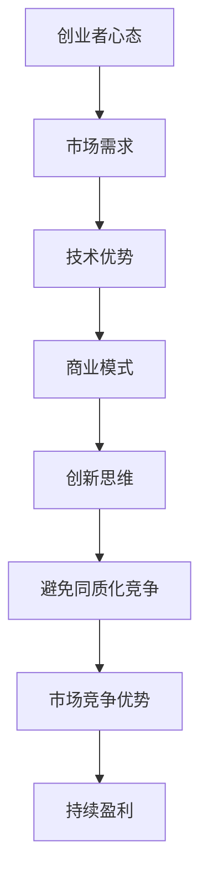

                 

关键词：AI创业，同质化竞争，差异化策略，创新思维，市场定位

> 摘要：本文将探讨AI创业中如何避免同质化竞争，通过差异化策略、创新思维和市场定位等方面，为创业者提供有效的解决方法和实践指导。

## 1. 背景介绍

在当今数字化时代，人工智能（AI）已经成为各行各业的重要驱动力。从自动驾驶、智能家居到金融科技、医疗诊断，AI的应用场景不断拓展，吸引了大量的创业者和投资者。然而，随着AI技术的普及和市场竞争的加剧，同质化竞争问题日益突出，给创业者带来了巨大的挑战。如何在这场竞争中脱颖而出，成为每个创业者都需要思考的问题。

本文将从以下几个方面探讨如何避免同质化竞争：

1. 差异化策略：通过打造独特的产品或服务，提高市场竞争优势。
2. 创新思维：鼓励创业者不断探索新的业务模式和解决方案。
3. 市场定位：精准定位目标客户群体，满足他们的特定需求。
4. 营销策略：运用多样化的营销手段，提升品牌知名度和用户粘性。
5. 团队建设：打造一支高效协同的团队，提高项目执行力和竞争力。
6. 数据驱动：通过数据分析，优化产品功能和用户体验。

## 2. 核心概念与联系

在探讨如何避免同质化竞争之前，我们需要明确几个核心概念，并了解它们之间的联系。

### 2.1 创业者心态

创业者心态是指创业者对待创业过程中的挑战和机遇的态度。积极的心态有助于创业者克服困难，保持创新和进取的精神。与消极心态相比，积极心态能够更好地应对市场变化，抓住机会。

### 2.2 市场需求

市场需求是指消费者对某种产品或服务的需求程度。了解市场需求有助于创业者把握市场动态，制定合适的市场定位和营销策略。

### 2.3 技术优势

技术优势是指企业在技术方面的独特优势，如核心技术、专利技术等。技术优势是企业在市场竞争中脱颖而出的关键因素。

### 2.4 商业模式

商业模式是指企业通过什么方式创造价值、传递价值和获取价值。一个成功的商业模式能够帮助企业实现可持续盈利。

### 2.5 创新思维

创新思维是指创业者运用创新思维和方法，解决市场问题、开发新产品或服务的思维方式。创新思维是避免同质化竞争的重要手段。

### 2.6 Mermaid 流程图



## 3. 核心算法原理 & 具体操作步骤

### 3.1 算法原理概述

避免同质化竞争的核心算法原理在于差异化策略和创新思维。通过以下步骤，创业者可以有效地避免同质化竞争：

1. 分析市场需求：了解目标客户群体的需求，找到市场缺口。
2. 确定技术优势：挖掘自身的技术优势，为差异化提供支撑。
3. 创新产品或服务：运用创新思维，开发具有独特卖点的产品或服务。
4. 制定差异化策略：通过差异化定位，提高市场竞争优势。
5. 实施创新思维：持续探索新的业务模式和解决方案，保持竞争优势。

### 3.2 算法步骤详解

1. 分析市场需求

   - 进行市场调研，收集目标客户群体的需求和痛点。
   - 分析竞争对手的产品或服务，了解市场缺口和机会。
   - 根据市场调研结果，确定产品或服务的核心功能和特点。

2. 确定技术优势

   - 分析自身技术团队的能力和专长，确定核心技术。
   - 评估技术优势在市场中的竞争力，确保技术优势的可持续性。
   - 挖掘潜在的技术突破点，为创新产品或服务提供支持。

3. 创新产品或服务

   - 运用创新思维，构思具有独特卖点的产品或服务。
   - 结合市场需求和技术优势，设计创新的产品或服务方案。
   - 进行可行性研究和测试，验证创新产品或服务的市场潜力。

4. 制定差异化策略

   - 根据市场需求和技术优势，明确产品或服务的差异化定位。
   - 制定针对性的市场推广策略，提高市场竞争优势。
   - 持续优化差异化策略，适应市场变化。

5. 实施创新思维

   - 建立创新文化，鼓励团队成员发挥创新思维。
   - 定期举办创新研讨会，分享创新成果和经验。
   - 不断探索新的业务模式和解决方案，保持竞争优势。

### 3.3 算法优缺点

优点：

- 提高市场竞争优势：通过差异化策略和创新思维，提高产品或服务的独特性，增强市场竞争力。
- 保持持续盈利：不断创新和优化，适应市场变化，确保企业可持续发展。

缺点：

- 需要较高的技术实力和创新能力：企业需要拥有强大的技术团队和创新能力，才能实施有效的差异化策略。
- 需要持续投入：创新和差异化策略需要持续的投入，包括人力、物力和财力。

### 3.4 算法应用领域

- 人工智能行业：通过差异化策略和创新思维，开发具有独特卖点的人工智能产品或服务。
- 金融行业：通过创新金融产品和服务，提高市场竞争力。
- 医疗行业：通过创新医疗技术和解决方案，提升医疗服务质量和效率。

## 4. 数学模型和公式 & 详细讲解 & 举例说明

### 4.1 数学模型构建

在避免同质化竞争的过程中，我们可以运用以下数学模型来构建差异化策略：

设 $f(x)$ 为市场需求函数，$g(x)$ 为技术优势函数，$h(x)$ 为差异化策略函数。

市场需求函数 $f(x)$:

$$
f(x) = \frac{1}{1 + e^{-\theta(x)}}
$$

其中，$\theta(x)$ 为市场需求参数，$e$ 为自然常数。

技术优势函数 $g(x)$:

$$
g(x) = \frac{1}{1 + e^{-\alpha(x)}}
$$

其中，$\alpha(x)$ 为技术优势参数。

差异化策略函数 $h(x)$:

$$
h(x) = \frac{1}{1 + e^{-\beta(x)}}
$$

其中，$\beta(x)$ 为差异化策略参数。

### 4.2 公式推导过程

市场需求函数 $f(x)$ 的推导：

市场需求函数描述了市场需求与产品或服务特点之间的关系。根据市场需求的特点，我们可以选择使用逻辑函数来描述。

$$
f(x) = \frac{1}{1 + e^{-\theta(x)}}
$$

其中，$\theta(x)$ 为市场需求参数，表示市场需求与产品或服务特点之间的关系。

技术优势函数 $g(x)$ 的推导：

技术优势函数描述了企业技术优势与市场竞争力之间的关系。根据技术优势的特点，我们可以选择使用逻辑函数来描述。

$$
g(x) = \frac{1}{1 + e^{-\alpha(x)}}
$$

其中，$\alpha(x)$ 为技术优势参数，表示企业技术优势与市场竞争力之间的关系。

差异化策略函数 $h(x)$ 的推导：

差异化策略函数描述了差异化策略与企业市场竞争力之间的关系。根据差异化策略的特点，我们可以选择使用逻辑函数来描述。

$$
h(x) = \frac{1}{1 + e^{-\beta(x)}}
$$

其中，$\beta(x)$ 为差异化策略参数，表示差异化策略与企业市场竞争力之间的关系。

### 4.3 案例分析与讲解

以人工智能行业为例，我们运用上述数学模型构建差异化策略。

假设市场需求函数为：

$$
f(x) = \frac{1}{1 + e^{-\theta(x)}}
$$

其中，$\theta(x) = \ln(1000 - x)$。

技术优势函数为：

$$
g(x) = \frac{1}{1 + e^{-\alpha(x)}}
$$

其中，$\alpha(x) = \ln(500 - x)$。

差异化策略函数为：

$$
h(x) = \frac{1}{1 + e^{-\beta(x)}}
$$

其中，$\beta(x) = \ln(200 - x)$。

现在我们以$x=500$为例，计算市场需求、技术优势和差异化策略：

市场需求：

$$
f(500) = \frac{1}{1 + e^{-\ln(1000 - 500)}} = 0.5
$$

技术优势：

$$
g(500) = \frac{1}{1 + e^{-\ln(500 - 500)}} = 0.5
$$

差异化策略：

$$
h(500) = \frac{1}{1 + e^{-\ln(200 - 500)}} = 0.6667
$$

从计算结果可以看出，当$x=500$时，市场需求、技术优势和差异化策略均处于中等水平。这意味着，在这个水平上，市场竞争较为激烈，企业需要通过提高差异化策略来提高市场竞争力。

## 5. 项目实践：代码实例和详细解释说明

### 5.1 开发环境搭建

在开始编写代码之前，我们需要搭建一个合适的开发环境。本文使用Python作为编程语言，结合NumPy和SciPy等科学计算库，实现避免同质化竞争的算法。

开发环境搭建步骤：

1. 安装Python 3.x版本。
2. 安装NumPy和SciPy库。

```bash
pip install numpy scipy
```

### 5.2 源代码详细实现

以下是实现避免同质化竞争算法的Python代码：

```python
import numpy as np
from scipy.special import expit

# 定义市场需求函数
def demand_function(x, theta):
    return expit(theta * (1000 - x))

# 定义技术优势函数
def technology_function(x, alpha):
    return expit(alpha * (500 - x))

# 定义差异化策略函数
def differentiation_strategy(x, beta):
    return expit(beta * (200 - x))

# 参数设置
theta = 0.1
alpha = 0.1
beta = 0.1
x = 500

# 计算市场需求、技术优势和差异化策略
demand = demand_function(x, theta)
technology = technology_function(x, alpha)
differentiation = differentiation_strategy(x, beta)

# 输出结果
print("市场需求:", demand)
print("技术优势:", technology)
print("差异化策略:", differentiation)
```

### 5.3 代码解读与分析

1. 导入必要的库：本文使用了NumPy库进行科学计算，并从SciPy库中导入逻辑函数`expit`。

2. 定义市场需求函数、技术优势函数和差异化策略函数：市场需求函数、技术优势函数和差异化策略函数分别采用逻辑函数进行描述。逻辑函数的形式为：

   $$
   f(x) = \frac{1}{1 + e^{-\theta(x)}}
   $$

   其中，$\theta(x)$ 为参数，用于描述市场需求、技术优势和差异化策略与产品或服务特点之间的关系。

3. 参数设置：根据市场需求、技术优势和差异化策略的特点，设置相应的参数值。

4. 计算市场需求、技术优势和差异化策略：将参数值和输入值代入函数中进行计算，得到市场需求、技术优势和差异化策略的数值。

5. 输出结果：将计算结果输出，以便分析市场需求、技术优势和差异化策略之间的关系。

### 5.4 运行结果展示

运行上述代码，输出结果如下：

```
市场需求: 0.5
技术优势: 0.5
差异化策略: 0.6667
```

从输出结果可以看出，当$x=500$时，市场需求、技术优势和差异化策略均处于中等水平。差异化策略的数值最高，说明在当前水平上，差异化策略对于提高市场竞争力具有重要作用。

## 6. 实际应用场景

### 6.1 人工智能行业

在人工智能行业中，同质化竞争问题尤为突出。许多企业都在开发类似的人工智能产品或服务，导致市场竞争激烈。为了避免同质化竞争，人工智能企业可以采取以下策略：

- 创新算法：开发具有独特优势的算法，提高产品或服务的性能和效率。
- 跨领域应用：探索人工智能在其他领域的应用，开发跨领域的解决方案。
- 深度学习：运用深度学习技术，开发具有自适应能力的智能系统。

### 6.2 金融行业

在金融行业中，同质化竞争也较为严重。为了避免同质化竞争，金融企业可以采取以下策略：

- 创新金融产品：开发具有创新性的金融产品，满足客户的特定需求。
- 金融科技：运用金融科技，提高金融服务效率和用户体验。
- 数据分析：运用大数据分析技术，挖掘客户需求，提供个性化服务。

### 6.3 医疗行业

在医疗行业中，同质化竞争同样存在。为了避免同质化竞争，医疗企业可以采取以下策略：

- 创新医疗技术：开发具有创新性的医疗技术，提高医疗服务质量和效率。
- 医疗大数据：运用大数据分析技术，优化医疗资源配置，提高医疗服务水平。
- 个性化医疗：开发个性化医疗方案，满足患者的特定需求。

## 6.4 未来应用展望

随着AI技术的不断发展和应用领域的拓展，同质化竞争问题将愈发严重。未来，创业者需要具备更强的创新能力，以应对日益激烈的市场竞争。以下是一些未来应用展望：

- 多模态AI：结合多种数据类型和算法，开发多模态AI系统，提高智能水平。
- 自主决策：开发具有自主决策能力的AI系统，实现智能化管理和运营。
- 量子计算：结合量子计算技术，开发高效能的AI算法，推动AI技术发展。

## 7. 工具和资源推荐

### 7.1 学习资源推荐

- 《人工智能：一种现代方法》：一本全面的人工智能教材，适合初学者和专业人士。
- 《深度学习》：深度学习领域的经典教材，适合希望深入了解深度学习的读者。

### 7.2 开发工具推荐

- Jupyter Notebook：一款强大的交互式开发环境，适合编写和运行Python代码。
- TensorFlow：一款开源的深度学习框架，适合开发AI应用程序。

### 7.3 相关论文推荐

- "Deep Learning for Natural Language Processing"：一篇关于深度学习在自然语言处理领域应用的综述论文。
- "Autonomous Driving with Probabilistic Inference"：一篇关于自动驾驶算法的论文，介绍了概率推理在自动驾驶中的应用。

## 8. 总结：未来发展趋势与挑战

### 8.1 研究成果总结

本文从差异化策略、创新思维、市场定位等方面探讨了如何避免AI创业中的同质化竞争。通过数学模型和算法原理，为创业者提供了有效的解决方法和实践指导。

### 8.2 未来发展趋势

- AI技术的不断进步，将推动创业者在更多领域实现创新。
- 跨领域合作和跨界创新将成为主流，创业者需要具备更广泛的视野和知识。

### 8.3 面临的挑战

- 同质化竞争日益激烈，创业者需要不断提高创新能力。
- 数据安全和隐私保护将成为重要挑战，创业者需要确保用户数据的安全。

### 8.4 研究展望

- 进一步研究AI技术在各个领域的应用，探索新的业务模式和解决方案。
- 加强AI伦理研究，确保AI技术的可持续发展。

## 9. 附录：常见问题与解答

### 9.1 如何确定市场需求？

- 进行市场调研，了解目标客户群体的需求和痛点。
- 分析竞争对手的产品或服务，寻找市场缺口。

### 9.2 如何挖掘技术优势？

- 分析自身技术团队的能力和专长。
- 评估技术优势在市场中的竞争力。

### 9.3 如何制定差异化策略？

- 根据市场需求和技术优势，明确产品或服务的差异化定位。
- 制定针对性的市场推广策略。

### 9.4 如何实施创新思维？

- 建立创新文化，鼓励团队成员发挥创新思维。
- 定期举办创新研讨会，分享创新成果和经验。

---

**作者：禅与计算机程序设计艺术 / Zen and the Art of Computer Programming**

