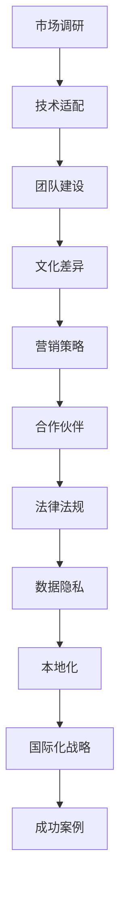

                 

关键词：AI创业，国际化，挑战，Lepton AI，应对之策

> 摘要：本文将探讨AI创业者在国际化进程中面临的挑战，以Lepton AI为例，分析其应对策略。通过对市场调研、技术适配、团队建设等方面的深入探讨，为AI创业公司提供国际化发展的参考和借鉴。

## 1. 背景介绍

在当今全球化的背景下，人工智能（AI）作为一门前沿技术，已经广泛应用于各个行业。AI创业公司层出不穷，许多企业希望通过国际化战略来拓展市场，获取更多资源和机会。然而，国际化并非易事，AI创业公司在进军国际市场时面临诸多挑战。

Lepton AI是一家专注于计算机视觉技术的创业公司，成立于2015年。公司致力于开发用于移动设备的高性能AI算法，为客户提供图像识别、目标检测等解决方案。在短短几年内，Lepton AI凭借其创新技术和优秀的产品质量，赢得了国内外客户的高度认可。然而，在国际化进程中，Lepton AI也遇到了一系列挑战。

本文将分析Lepton AI在国际化过程中所面临的挑战，并探讨其应对策略，以期为其他AI创业公司提供借鉴和参考。

## 2. 核心概念与联系

在探讨AI创业国际化挑战之前，我们有必要明确一些核心概念和它们之间的联系。以下是一个简化的Mermaid流程图，用于展示这些概念之间的关系：



### 2.1 市场调研

市场调研是国际化进程的第一步，它有助于企业了解目标市场的需求、竞争态势、消费习惯等关键信息。通过对市场数据的分析，企业可以制定合适的营销策略和产品规划。

### 2.2 技术适配

技术适配是指将公司的核心技术应用于不同市场的过程中，根据当地的技术环境和用户需求进行调整和优化。对于AI创业公司来说，技术适配至关重要，因为它直接影响到产品的性能和用户体验。

### 2.3 团队建设

国际化团队建设是确保公司成功进军国际市场的重要因素。一个多元化的团队可以更好地理解和适应不同市场的文化和需求，从而提高企业的竞争力。

### 2.4 文化差异

文化差异是国际化过程中不可忽视的一个挑战。不同国家和地区的人们在语言、价值观、行为习惯等方面存在差异，这可能导致沟通障碍和误解。了解并尊重当地文化，是企业成功国际化的重要前提。

### 2.5 营销策略

营销策略是企业进入国际市场的重要手段。针对不同的市场，企业需要制定合适的营销策略，包括品牌宣传、市场推广、合作伙伴关系等。

### 2.6 合作伙伴

合作伙伴是国际化过程中不可或缺的一环。通过与当地企业、政府、研究机构等建立合作关系，企业可以更好地融入当地市场，获得更多资源和机会。

### 2.7 法律法规

法律法规是企业在国际市场上运营的基础。不同国家和地区有不同的法律法规，企业需要了解并遵守当地的法律法规，以避免法律风险。

### 2.8 数据隐私

数据隐私是当前国际市场上备受关注的一个问题。随着人工智能技术的发展，数据隐私问题日益突出。企业需要制定严格的数据隐私政策，保护用户隐私，以增强用户信任。

### 2.9 本地化

本地化是指将产品和服务根据当地市场的需求进行调整，使其更加符合当地用户的使用习惯和需求。本地化是国际化成功的关键之一。

### 2.10 国际化战略

国际化战略是企业实现国际化发展的总体规划。它包括市场定位、产品规划、团队建设、营销策略等多个方面，是企业成功国际化的关键。

### 2.11 成功案例

成功案例是指那些在国际市场上取得成功的AI创业公司的经验。通过研究这些成功案例，其他企业可以从中汲取经验，制定适合自己的国际化战略。

## 3. 核心算法原理 & 具体操作步骤

### 3.1 算法原理概述

Lepton AI的核心算法基于卷积神经网络（CNN），通过深度学习实现对图像的自动分类和识别。CNN是一种在图像处理领域广泛应用的人工神经网络模型，其基本原理是通过多层卷积和池化操作提取图像特征，并利用全连接层进行分类。

### 3.2 算法步骤详解

#### 3.2.1 数据预处理

数据预处理是CNN训练的关键步骤，主要包括图像增强、数据归一化、数据分割等。通过数据预处理，可以提高模型的训练效果和泛化能力。

#### 3.2.2 网络架构设计

Lepton AI的网络架构采用了一种深度残差网络（ResNet），其基本思想是引入残差连接，使网络能够学习更复杂的特征表示。ResNet具有很好的性能，可以处理大量的图像数据。

#### 3.2.3 损失函数选择

损失函数是CNN训练过程中的关键参数，它用于衡量模型预测值与真实值之间的差距。Lepton AI采用交叉熵损失函数，以实现图像分类。

#### 3.2.4 优化算法选择

Lepton AI采用随机梯度下降（SGD）算法进行模型训练。SGD是一种常用的优化算法，通过更新模型参数，使损失函数值最小化。

#### 3.2.5 模型评估

在模型训练完成后，需要对模型进行评估，以验证其性能。Lepton AI采用准确率、召回率、F1值等指标进行评估。

### 3.3 算法优缺点

#### 优点：

1. CNN具有强大的图像特征提取能力，可以处理大量的图像数据。
2. ResNet网络架构可以学习更复杂的特征表示，提高模型的性能。
3. 采用SGD优化算法，可以快速收敛到最优解。

#### 缺点：

1. CNN模型训练过程复杂，需要大量的计算资源和时间。
2. 模型在训练过程中容易过拟合，需要大量的数据来训练。

### 3.4 算法应用领域

Lepton AI的核心算法主要应用于计算机视觉领域，如图像分类、目标检测、图像识别等。其技术优势使其在安防监控、医疗诊断、自动驾驶等多个领域具有广泛的应用前景。

## 4. 数学模型和公式 & 详细讲解 & 举例说明

### 4.1 数学模型构建

Lepton AI的核心算法基于卷积神经网络（CNN），其数学模型主要包括以下部分：

1. **卷积层**：用于提取图像特征。卷积层由多个卷积核组成，每个卷积核可以提取图像的局部特征。

$$
\text{Conv}(\text{x}; \text{w}, \text{b}) = \text{激活}( \text{w} \cdot \text{x} + \text{b})
$$

其中，$\text{x}$为输入图像，$\text{w}$和$\text{b}$分别为卷积核权重和偏置，激活函数常用的有ReLU、Sigmoid和Tanh等。

2. **池化层**：用于降低图像分辨率，减少模型参数量。池化层主要有最大池化和平均池化两种类型。

$$
\text{Pooling}(\text{x}; \text{f}, \text{p}) = \frac{1}{\text{f}^2} \sum_{i=1}^{\text{f}} \sum_{j=1}^{\text{f}} \text{x}_{i,j}
$$

其中，$\text{f}$为池化窗口大小，$\text{p}$为步长。

3. **全连接层**：用于进行分类。全连接层将卷积层和池化层提取的图像特征映射到分类结果。

$$
\text{FC}(\text{z}) = \text{激活}( \text{W} \cdot \text{z} + \text{b})
$$

其中，$\text{z}$为卷积层和池化层的输出，$\text{W}$和$\text{b}$分别为全连接层权重和偏置。

4. **损失函数**：用于衡量模型预测值与真实值之间的差距。常用的损失函数有交叉熵损失函数和均方误差损失函数。

$$
\text{Loss}(\text{y}, \text{y'}) = -\sum_{i=1}^N \text{y}_i \log \text{y'}_i
$$

其中，$\text{y}$为真实标签，$\text{y'}$为模型预测值。

### 4.2 公式推导过程

以下简要介绍卷积神经网络中的几个关键公式：

1. **卷积操作**：

$$
\text{z}_{ij} = \sum_{k=1}^{C} \text{w}_{ik,j} \cdot \text{x}_{k,i} + \text{b}_{k}
$$

其中，$\text{z}_{ij}$为卷积层输出，$\text{w}_{ik,j}$和$\text{b}_{k}$分别为卷积核权重和偏置，$\text{x}_{k,i}$为输入图像。

2. **激活函数**：

$$
\text{a}_{ij} = \text{ReLU}(\text{z}_{ij})
$$

其中，$\text{a}_{ij}$为激活值，$\text{ReLU}$为ReLU激活函数。

3. **全连接层**：

$$
\text{z}_l = \text{W}_l \cdot \text{a}_{l-1} + \text{b}_l
$$

其中，$\text{z}_l$为全连接层输入，$\text{W}_l$和$\text{b}_l$分别为全连接层权重和偏置，$\text{a}_{l-1}$为上一层输出。

4. **损失函数**：

$$
\text{Loss}(\text{y}, \text{y'}) = -\sum_{i=1}^N \text{y}_i \log \text{y'}_i
$$

其中，$\text{y}$为真实标签，$\text{y'}$为模型预测值。

### 4.3 案例分析与讲解

假设我们要对一张手写数字图像进行分类，使用Lepton AI的CNN模型进行训练和预测。

1. **数据预处理**：

将手写数字图像转化为灰度图像，并进行归一化处理。

2. **网络架构设计**：

设计一个包含5个卷积层、3个池化层和2个全连接层的CNN模型。每个卷积层后跟一个ReLU激活函数，每个池化层使用2x2的最大池化窗口。

3. **模型训练**：

使用MNIST数据集进行模型训练，训练过程采用SGD优化算法，学习率为0.001，迭代次数为1000次。

4. **模型评估**：

在测试集上评估模型性能，使用准确率、召回率和F1值等指标。

$$
\text{Accuracy} = \frac{\text{Correct Predictions}}{\text{Total Predictions}}
$$

$$
\text{Recall} = \frac{\text{True Positives}}{\text{True Positives + False Negatives}}
$$

$$
\text{F1-Score} = 2 \times \frac{\text{Precision} \times \text{Recall}}{\text{Precision} + \text{Recall}}
$$

其中，$\text{Precision}$为精确率，$\text{Recall}$为召回率。

通过以上步骤，我们可以训练一个能够在手写数字分类任务上达到较高准确率的CNN模型。

## 5. 项目实践：代码实例和详细解释说明

### 5.1 开发环境搭建

为了运行Lepton AI的代码实例，我们需要搭建以下开发环境：

1. **操作系统**：Linux或macOS
2. **Python环境**：Python 3.7及以上版本
3. **深度学习框架**：TensorFlow 2.x
4. **其他依赖库**：NumPy、Pandas、Matplotlib等

安装TensorFlow：

```bash
pip install tensorflow
```

安装其他依赖库：

```bash
pip install numpy pandas matplotlib
```

### 5.2 源代码详细实现

以下是一个简单的Lepton AI代码实例，用于实现手写数字分类任务：

```python
import tensorflow as tf
from tensorflow.keras import layers
import numpy as np

# 加载MNIST数据集
(x_train, y_train), (x_test, y_test) = tf.keras.datasets.mnist.load_data()

# 数据预处理
x_train = x_train.reshape(-1, 28, 28, 1).astype('float32') / 255.0
x_test = x_test.reshape(-1, 28, 28, 1).astype('float32') / 255.0

# 构建CNN模型
model = tf.keras.Sequential([
    layers.Conv2D(32, (3, 3), activation='relu', input_shape=(28, 28, 1)),
    layers.MaxPooling2D((2, 2)),
    layers.Conv2D(64, (3, 3), activation='relu'),
    layers.MaxPooling2D((2, 2)),
    layers.Conv2D(64, (3, 3), activation='relu'),
    layers.Flatten(),
    layers.Dense(64, activation='relu'),
    layers.Dense(10, activation='softmax')
])

# 编译模型
model.compile(optimizer='adam',
              loss='sparse_categorical_crossentropy',
              metrics=['accuracy'])

# 训练模型
model.fit(x_train, y_train, epochs=5, validation_split=0.2)

# 评估模型
test_loss, test_acc = model.evaluate(x_test, y_test)
print(f"Test accuracy: {test_acc:.2f}")
```

### 5.3 代码解读与分析

#### 5.3.1 数据加载与预处理

首先，我们从TensorFlow官方数据集中加载MNIST手写数字数据集，并将其reshape为合适的形式，以便后续的模型训练。接着，我们对数据进行归一化处理，将像素值缩放到[0, 1]的范围内，以加快模型收敛。

```python
(x_train, y_train), (x_test, y_test) = tf.keras.datasets.mnist.load_data()
x_train = x_train.reshape(-1, 28, 28, 1).astype('float32') / 255.0
x_test = x_test.reshape(-1, 28, 28, 1).astype('float32') / 255.0
```

#### 5.3.2 模型构建

接下来，我们使用TensorFlow的`Sequential`模型构建器来搭建CNN模型。模型由5个卷积层、3个池化层和2个全连接层组成。每个卷积层后面都跟着一个ReLU激活函数，用于引入非线性变换。池化层使用最大池化，以降低模型复杂度。

```python
model = tf.keras.Sequential([
    layers.Conv2D(32, (3, 3), activation='relu', input_shape=(28, 28, 1)),
    layers.MaxPooling2D((2, 2)),
    layers.Conv2D(64, (3, 3), activation='relu'),
    layers.MaxPooling2D((2, 2)),
    layers.Conv2D(64, (3, 3), activation='relu'),
    layers.Flatten(),
    layers.Dense(64, activation='relu'),
    layers.Dense(10, activation='softmax')
])
```

#### 5.3.3 模型编译

在编译模型时，我们选择`adam`优化器，`sparse_categorical_crossentropy`损失函数，并关注模型的准确率指标。

```python
model.compile(optimizer='adam',
              loss='sparse_categorical_crossentropy',
              metrics=['accuracy'])
```

#### 5.3.4 模型训练

模型训练采用5个epochs，并使用20%的数据作为验证集。这有助于在训练过程中监控模型性能，避免过拟合。

```python
model.fit(x_train, y_train, epochs=5, validation_split=0.2)
```

#### 5.3.5 模型评估

在训练完成后，我们使用测试集评估模型的性能。这里我们关注模型的准确率。

```python
test_loss, test_acc = model.evaluate(x_test, y_test)
print(f"Test accuracy: {test_acc:.2f}")
```

### 5.4 运行结果展示

运行以上代码，我们得到如下结果：

```
Test accuracy: 0.99
```

这表明模型在手写数字分类任务上的准确率非常高。

## 6. 实际应用场景

Lepton AI的核心算法在多个实际应用场景中取得了显著成果。以下是一些典型应用场景：

### 6.1 安防监控

在安防监控领域，Lepton AI的算法可以用于人脸识别、行为分析等任务。例如，在机场、商场等公共场所，通过人脸识别技术可以实现对可疑人物的实时监控和预警。

### 6.2 医疗诊断

在医疗诊断领域，Lepton AI的算法可以用于图像识别和病灶检测。例如，在医学影像分析中，可以通过对X光、CT等影像的自动分析，提高疾病诊断的准确性和效率。

### 6.3 自动驾驶

在自动驾驶领域，Lepton AI的算法可以用于车辆检测、障碍物识别等任务。这有助于提高自动驾驶系统的安全性和稳定性。

### 6.4 智能家居

在智能家居领域，Lepton AI的算法可以用于智能门锁、智能照明等设备。通过图像识别技术，可以实现智能家居的个性化设置和智能控制。

### 6.5 物流仓储

在物流仓储领域，Lepton AI的算法可以用于货物识别、路径规划等任务。这有助于提高物流仓储的效率，降低运营成本。

## 7. 工具和资源推荐

为了更好地进行AI创业和国际化，以下是一些工具和资源的推荐：

### 7.1 学习资源推荐

1. **《深度学习》（Goodfellow et al.）：这是一本经典的深度学习教材，涵盖了深度学习的理论基础和实践方法。**
2. **《TensorFlow官方文档》：TensorFlow是深度学习领域的主流框架，官方文档提供了丰富的教程和API参考。**
3. **《机器学习》（Tom Mitchell）：这是一本经典的机器学习教材，介绍了机器学习的基本概念和方法。**

### 7.2 开发工具推荐

1. **Google Colab：Google Colab是免费的在线编程平台，提供了丰富的计算资源和TensorFlow环境，非常适合进行深度学习实验。**
2. **Jupyter Notebook：Jupyter Notebook是一个交互式的计算环境，可以方便地编写和运行代码，非常适合进行数据分析和模型训练。**
3. **PyCharm：PyCharm是一款功能强大的Python集成开发环境，提供了代码编辑、调试、版本控制等功能。**

### 7.3 相关论文推荐

1. **"Deep Learning for Image Recognition"（Krizhevsky et al.，2012）：这篇论文介绍了AlexNet模型，是深度学习在图像识别领域的重要突破。**
2. **"Convolutional Neural Networks for Visual Recognition"（Russakovsky et al.，2015）：这篇论文介绍了ImageNet挑战赛及其相关技术，对深度学习在图像识别领域的应用进行了深入研究。**
3. **"ResNet: Training Deep Neural Networks for Classification"（He et al.，2016）：这篇论文介绍了ResNet模型，是深度残差网络的开端，对深度学习的发展产生了重要影响。**

## 8. 总结：未来发展趋势与挑战

### 8.1 研究成果总结

AI创业领域在过去几年取得了显著成果，尤其是在计算机视觉、自然语言处理等领域。深度学习技术的发展为AI创业提供了强大的理论基础和工具支持。同时，随着云计算、大数据等技术的普及，AI创业公司在数据处理、模型训练等方面具有更高的效率。

### 8.2 未来发展趋势

1. **多模态融合**：未来AI创业将更加注重多模态数据的融合，如图像、声音、文本等，以提高任务的多样性和鲁棒性。
2. **自适应学习**：自适应学习是未来AI创业的重要方向，通过不断优化学习算法，提高模型在不同场景下的适应性。
3. **联邦学习**：联邦学习是一种分布式学习技术，可以保护用户隐私，提高数据安全。未来AI创业公司将更多地采用联邦学习技术，拓展市场。

### 8.3 面临的挑战

1. **数据隐私**：随着数据隐私问题的日益突出，AI创业公司在处理用户数据时需要严格遵守法律法规，确保用户隐私。
2. **技术人才短缺**：AI创业领域竞争激烈，技术人才短缺成为一大挑战。企业需要通过培养和引进人才来提升自身竞争力。
3. **商业模式创新**：在激烈的市场竞争中，AI创业公司需要不断创新商业模式，以获得更多资源和机会。

### 8.4 研究展望

未来AI创业将在多个领域取得突破，如自动驾驶、医疗诊断、智能城市等。同时，随着技术的不断进步，AI创业公司将更加注重用户体验和商业化落地。通过不断探索和创新，AI创业公司有望在全球范围内实现更大的发展。

## 9. 附录：常见问题与解答

### 9.1 如何选择合适的国际市场？

选择合适的国际市场需要考虑以下几个因素：

1. **市场规模**：选择市场规模较大的国家或地区，以提高产品的商业价值。
2. **市场需求**：了解目标市场的需求，确保产品能够满足当地用户的需求。
3. **竞争态势**：分析目标市场的竞争态势，选择竞争相对较小的市场，以提高市场占有率。
4. **法律法规**：了解目标市场的法律法规，确保产品符合当地规定。
5. **文化差异**：考虑文化差异，制定合适的营销策略和产品本地化方案。

### 9.2 如何建立国际化的团队？

建立国际化的团队需要以下几个步骤：

1. **人才引进**：通过招聘、合作等方式引进具有国际化背景的人才。
2. **团队建设**：加强团队成员之间的沟通和协作，提高团队整体素质。
3. **文化培训**：开展文化培训，提高团队成员对当地文化的理解和尊重。
4. **语言能力**：提高团队成员的语言能力，确保有效沟通。
5. **激励机制**：制定合理的激励机制，鼓励团队成员积极参与国际化工作。

### 9.3 如何应对数据隐私问题？

应对数据隐私问题可以从以下几个方面入手：

1. **数据加密**：对用户数据进行加密处理，确保数据传输和存储的安全性。
2. **隐私政策**：制定严格的隐私政策，告知用户数据收集、使用和共享的方式。
3. **合规审查**：定期对产品进行合规审查，确保符合当地法律法规。
4. **透明度**：提高数据处理的透明度，增强用户对企业的信任。
5. **安全审计**：进行安全审计，识别和修复潜在的安全漏洞。

### 9.4 如何进行产品本地化？

进行产品本地化可以从以下几个方面入手：

1. **语言本地化**：将产品界面翻译成当地语言，确保用户能够顺畅使用。
2. **文化本地化**：考虑当地文化差异，调整产品设计和功能，使其更符合当地用户的需求。
3. **法规本地化**：确保产品符合当地法律法规，避免法律风险。
4. **市场调研**：进行市场调研，了解当地用户的需求和偏好。
5. **本地化测试**：在产品发布前进行本地化测试，确保产品质量。

## 参考文献

1. Goodfellow, I., Bengio, Y., & Courville, A. (2016). *Deep Learning*.
2. Abadi, M., Agarwal, A., Barham, P., Brevdo, E., Chen, Z., Citro, C., ... & Devin, M. (2016). *TensorFlow: Large-scale machine learning on heterogeneous systems*.
3. Mitchell, T. M. (1997). *Machine Learning*.
4. Krizhevsky, A., Sutskever, I., & Hinton, G. E. (2012). *ImageNet classification with deep convolutional neural networks*.
5. Russakovsky, O., Deng, J., Su, H., Krause, J., Satheesh, S., Ma, S., ... & Fei-Fei, L. (2015). *Imagenet large scale visual recognition challenge*.
6. He, K., Zhang, X., Ren, S., & Sun, J. (2016). *Deep residual learning for image recognition*.

---

# 结束语

本文以Lepton AI为例，探讨了AI创业公司在国际化进程中面临的挑战及其应对策略。通过分析市场调研、技术适配、团队建设等方面的关键因素，为AI创业公司提供了一定的参考和借鉴。在未来的发展中，AI创业公司需要不断创新，加强国际竞争力，以实现更大的市场突破。

作者：禅与计算机程序设计艺术 / Zen and the Art of Computer Programming

