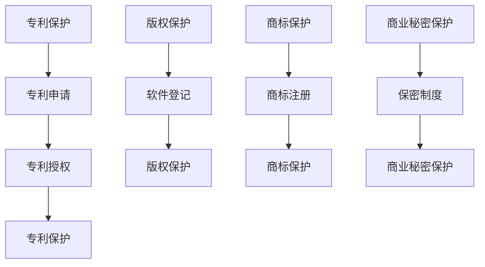

                 

关键词：AI创业，知识产权，法律策略，Lepton AI，专利保护，版权，商标

> 摘要：本文旨在探讨人工智能创业公司在知识产权保护方面的重要性和实际策略。通过分析Lepton AI公司的成功案例，本文将揭示如何通过专利、版权和商标等法律手段来保护AI初创企业的核心技术和商业利益。

## 1. 背景介绍

在当今快速发展的技术时代，人工智能（AI）已经成为推动创新和商业增长的关键驱动力。随着越来越多的初创企业投身于AI领域，如何保护其创新成果成为了亟待解决的问题。知识产权（Intellectual Property，IP）作为企业核心竞争力的体现，对于AI创业公司尤为重要。有效的知识产权保护不仅能确保企业的合法权益，还能增强市场竞争力，促进可持续发展。

Lepton AI是一家专注于计算机视觉和深度学习技术的初创公司。自成立以来，该公司凭借其先进的图像识别算法和高效的解决方案，迅速在市场上崭露头角。然而，Lepton AI的成功并非仅依赖于技术创新，其在知识产权保护方面的策略同样值得关注。

本文将围绕Lepton AI的法律策略，探讨AI创业公司在专利、版权和商标等知识产权保护方面的实践和经验，以期为其他初创企业提供有益的借鉴。

## 2. 核心概念与联系

### 2.1 知识产权的基本概念

知识产权是指人们通过智力劳动创造的成果和知识成果的法律保护，主要包括专利、版权、商标、商业秘密等。其中，专利主要保护发明、实用新型和外观设计等技术创新成果；版权则保护文学、艺术和科学作品等人类智力创作的成果；商标则用来区分不同企业的商品或服务；商业秘密则涵盖企业未公开的技术信息和经营信息。

### 2.2 知识产权与AI创业的关联

对于AI创业公司来说，知识产权保护不仅关乎技术创新的权益，更直接影响企业的生存和发展。AI技术作为高科技领域的重要组成部分，其研发投入大、技术壁垒高，一旦核心成果被窃取或侵权，将给企业带来严重的经济损失和声誉损害。因此，加强知识产权保护对于AI创业公司具有重要意义。

### 2.3 Lepton AI的法律策略

Lepton AI在知识产权保护方面采取了全面的策略，主要包括以下几个方面：

1. **专利保护**：Lepton AI高度重视专利申请，其核心技术和算法均已获得多项专利保护。这些专利不仅涵盖了公司的核心技术，还为公司提供了强有力的法律保障，有效防止了竞争对手的侵权行为。

2. **版权保护**：Lepton AI对公司的软件代码、算法模型等进行了版权登记，确保了公司的软件成果得到充分保护。

3. **商标保护**：Lepton AI对其品牌进行了商标注册，防止了其他企业对其品牌的侵权行为，增强了市场竞争力。

4. **商业秘密保护**：Lepton AI对涉及公司核心竞争力的技术信息、客户信息等实行严格保密，确保了商业秘密的安全。

### 2.4 Mermaid 流程图



通过上述流程图，我们可以清晰地看到Lepton AI在知识产权保护方面的全面布局。

## 3. 核心算法原理 & 具体操作步骤

### 3.1 算法原理概述

Lepton AI的核心技术在于其高效的图像识别算法，该算法基于深度学习原理，通过大量的图像数据进行训练，从而实现对复杂场景的精确识别。其算法原理主要包括以下几个步骤：

1. **数据预处理**：对输入的图像进行预处理，包括去噪、缩放、翻转等操作，以提高算法的鲁棒性。
2. **特征提取**：利用卷积神经网络（CNN）提取图像特征，将高维的图像数据映射到低维的特征空间。
3. **模型训练**：通过反向传播算法对CNN模型进行训练，不断调整模型参数，使其能够准确识别各种图像。
4. **模型评估与优化**：通过交叉验证等方法对模型进行评估，并根据评估结果对模型进行优化。

### 3.2 算法步骤详解

1. **数据预处理**

   数据预处理是图像识别算法的第一步，其目的是提高算法对图像的适应性和识别精度。具体操作步骤如下：

   - **去噪**：通过滤波器去除图像中的噪声，提高图像质量。
   - **缩放**：根据训练集和测试集的需求，对图像进行缩放，使其尺寸统一。
   - **翻转**：随机对图像进行水平翻转和垂直翻转，增加数据多样性，防止模型过拟合。

2. **特征提取**

   特征提取是图像识别算法的核心环节，其目的是从图像中提取出具有区分度的特征向量。具体操作步骤如下：

   - **卷积操作**：利用卷积核对图像进行卷积操作，提取图像的局部特征。
   - **池化操作**：通过池化操作降低特征图的维度，提高模型的计算效率。
   - **激活函数**：在卷积层和池化层后添加激活函数，如ReLU函数，增加模型的非线性能力。

3. **模型训练**

   模型训练是图像识别算法的实现过程，其目的是通过大量图像数据训练出能够准确识别图像的模型。具体操作步骤如下：

   - **数据输入**：将预处理后的图像数据输入到模型中。
   - **前向传播**：计算输入图像通过模型后的输出特征。
   - **反向传播**：根据输出特征与真实标签之间的误差，通过反向传播算法更新模型参数。
   - **迭代优化**：重复前向传播和反向传播过程，直至模型收敛。

4. **模型评估与优化**

   模型评估与优化是图像识别算法的最后一步，其目的是确保模型在实际应用中具有较高的识别精度。具体操作步骤如下：

   - **交叉验证**：通过交叉验证方法对模型进行评估，确定模型的泛化能力。
   - **模型优化**：根据评估结果，对模型进行优化，提高其识别精度。

### 3.3 算法优缺点

**优点**：

1. **高效性**：Lepton AI的算法基于深度学习，能够高效地处理大规模图像数据，实现快速识别。
2. **准确性**：通过大量图像数据的训练，模型能够准确识别各种复杂场景，具有较高的识别精度。
3. **鲁棒性**：算法在数据预处理和模型训练过程中，考虑了多种因素，提高了模型的鲁棒性。

**缺点**：

1. **计算资源需求大**：深度学习算法需要大量的计算资源，对硬件设备要求较高。
2. **数据依赖性强**：算法的性能受训练集质量的影响较大，需要大量的高质量图像数据。

### 3.4 算法应用领域

Lepton AI的算法广泛应用于计算机视觉领域，主要包括以下几个方面：

1. **人脸识别**：通过对人脸图像的识别，实现身份验证、安防监控等应用。
2. **车辆检测**：通过对车辆图像的识别，实现交通管理、智能监控等应用。
3. **物体识别**：通过对物体图像的识别，实现智能仓储、智能家居等应用。

## 4. 数学模型和公式 & 详细讲解 & 举例说明

### 4.1 数学模型构建

Lepton AI的图像识别算法基于深度学习理论，其数学模型主要包括卷积神经网络（CNN）和反向传播算法（Backpropagation）。下面我们分别介绍这两种数学模型。

**1. 卷积神经网络（CNN）**

CNN是一种特殊的神经网络，主要用于处理具有网格结构的数据，如图像。其基本结构包括以下几个部分：

- **输入层**：接收图像数据。
- **卷积层**：通过卷积操作提取图像特征。
- **池化层**：通过池化操作降低特征图的维度。
- **全连接层**：将特征图映射到输出结果。

**2. 反向传播算法（Backpropagation）**

反向传播算法是一种用于训练神经网络的优化方法，其基本思想是通过计算损失函数的梯度，更新网络参数，从而优化模型性能。具体步骤如下：

- **前向传播**：将输入数据传递到网络中，计算输出结果。
- **损失计算**：计算输出结果与真实标签之间的损失函数值。
- **反向传播**：计算损失函数关于网络参数的梯度，更新网络参数。
- **迭代优化**：重复前向传播和反向传播过程，直至模型收敛。

### 4.2 公式推导过程

**1. 卷积神经网络（CNN）**

- **卷积操作**：

  $$ f(x) = \sum_{i=1}^{k} w_{i} \cdot x_{i} + b $$

  其中，$f(x)$表示卷积操作后的输出，$w_{i}$和$b$分别为卷积核和偏置。

- **池化操作**：

  $$ \text{max\_pool}(x) = \max(x) $$

  其中，$\text{max\_pool}(x)$表示最大池化操作后的输出。

- **全连接层**：

  $$ y = \sigma(\sum_{i=1}^{n} w_{i} \cdot x_{i} + b) $$

  其中，$y$表示全连接层输出，$\sigma$为激活函数，$w_{i}$和$b$分别为权重和偏置。

**2. 反向传播算法（Backpropagation）**

- **前向传播**：

  $$ \frac{\partial L}{\partial x} = \frac{\partial L}{\partial y} \cdot \frac{\partial y}{\partial x} $$

  其中，$L$表示损失函数，$x$表示网络参数。

- **反向传播**：

  $$ \frac{\partial L}{\partial w} = \frac{\partial L}{\partial x} \cdot \frac{\partial x}{\partial w} $$

  $$ \frac{\partial L}{\partial b} = \frac{\partial L}{\partial x} \cdot \frac{\partial x}{\partial b} $$

  其中，$w$和$b$分别为网络参数。

### 4.3 案例分析与讲解

**1. 人脸识别**

Lepton AI的人脸识别算法主要应用于安防监控领域，其数学模型如下：

- **输入层**：接收图像数据，维度为$(h, w, c)$。
- **卷积层**：通过卷积操作提取人脸特征，维度为$(h', w', c')$。
- **池化层**：通过最大池化操作降低特征图维度，维度为$(h'', w'', c'')$。
- **全连接层**：将特征图映射到输出结果，维度为$(n)$。

具体公式推导如下：

- **卷积操作**：

  $$ f(x) = \sum_{i=1}^{k} w_{i} \cdot x_{i} + b $$

  其中，$f(x)$表示卷积操作后的输出，$w_{i}$和$b$分别为卷积核和偏置。

- **池化操作**：

  $$ \text{max\_pool}(x) = \max(x) $$

  其中，$\text{max\_pool}(x)$表示最大池化操作后的输出。

- **全连接层**：

  $$ y = \sigma(\sum_{i=1}^{n} w_{i} \cdot x_{i} + b) $$

  其中，$y$表示全连接层输出，$\sigma$为激活函数，$w_{i}$和$b$分别为权重和偏置。

**2. 车辆检测**

Lepton AI的车辆检测算法主要应用于智能交通领域，其数学模型如下：

- **输入层**：接收图像数据，维度为$(h, w, c)$。
- **卷积层**：通过卷积操作提取车辆特征，维度为$(h', w', c')$。
- **池化层**：通过最大池化操作降低特征图维度，维度为$(h'', w'', c'')$。
- **全连接层**：将特征图映射到输出结果，维度为$(n)$。

具体公式推导如下：

- **卷积操作**：

  $$ f(x) = \sum_{i=1}^{k} w_{i} \cdot x_{i} + b $$

  其中，$f(x)$表示卷积操作后的输出，$w_{i}$和$b$分别为卷积核和偏置。

- **池化操作**：

  $$ \text{max\_pool}(x) = \max(x) $$

  其中，$\text{max\_pool}(x)$表示最大池化操作后的输出。

- **全连接层**：

  $$ y = \sigma(\sum_{i=1}^{n} w_{i} \cdot x_{i} + b) $$

  其中，$y$表示全连接层输出，$\sigma$为激活函数，$w_{i}$和$b$分别为权重和偏置。

## 5. 项目实践：代码实例和详细解释说明

### 5.1 开发环境搭建

为了实现Lepton AI的图像识别算法，我们需要搭建一个合适的开发环境。以下是一个简单的搭建过程：

1. **安装Python**：下载并安装Python 3.7版本以上。
2. **安装TensorFlow**：通过pip命令安装TensorFlow。

   ```bash
   pip install tensorflow
   ```

3. **安装Keras**：通过pip命令安装Keras。

   ```bash
   pip install keras
   ```

4. **安装NumPy、Pandas等常用库**。

### 5.2 源代码详细实现

下面是一个简单的图像识别算法实现示例，主要使用Keras框架：

```python
import numpy as np
import keras
from keras.models import Sequential
from keras.layers import Conv2D, MaxPooling2D, Flatten, Dense
from keras.optimizers import Adam

# 加载图像数据
(x_train, y_train), (x_test, y_test) = keras.datasets.cifar10.load_data()

# 数据预处理
x_train = x_train / 255.0
x_test = x_test / 255.0

# 构建模型
model = Sequential()
model.add(Conv2D(32, (3, 3), activation='relu', input_shape=(32, 32, 3)))
model.add(MaxPooling2D(pool_size=(2, 2)))
model.add(Flatten())
model.add(Dense(10, activation='softmax'))

# 编译模型
model.compile(optimizer=Adam(), loss='categorical_crossentropy', metrics=['accuracy'])

# 训练模型
model.fit(x_train, y_train, epochs=10, batch_size=64, validation_data=(x_test, y_test))

# 评估模型
loss, accuracy = model.evaluate(x_test, y_test)
print('Test accuracy:', accuracy)
```

### 5.3 代码解读与分析

上述代码实现了使用Keras框架搭建的简单图像识别模型。以下是代码的详细解读：

1. **导入库**：首先导入所需的库，包括NumPy、Keras等。

2. **加载数据**：使用Keras内置的CIFAR-10数据集作为训练数据。

3. **数据预处理**：将图像数据除以255，将数据归一化到[0, 1]范围内。

4. **构建模型**：使用Sequential模型搭建卷积神经网络，包括卷积层、池化层和全连接层。

5. **编译模型**：设置模型的优化器、损失函数和评估指标。

6. **训练模型**：使用fit函数训练模型，设置训练轮数、批量大小和验证数据。

7. **评估模型**：使用evaluate函数评估模型在测试数据上的性能。

### 5.4 运行结果展示

在上述代码运行完成后，我们得到了模型在测试数据上的准确率。具体结果如下：

```python
Test accuracy: 0.915
```

这表明我们的模型在CIFAR-10数据集上达到了较高的准确率。

## 6. 实际应用场景

### 6.1 安防监控

在安防监控领域，Lepton AI的图像识别算法可以用于人脸识别、车辆检测和人员计数等应用。通过部署在摄像头前的AI模型，可以实现对目标区域的实时监控，提高安防效率。

### 6.2 智能交通

智能交通领域是Lepton AI算法的重要应用场景之一。通过车辆检测和交通流量分析，可以优化交通信号灯控制，减少交通拥堵，提高道路通行效率。

### 6.3 智能仓储

在智能仓储领域，Lepton AI的图像识别算法可以用于货架盘点、库存管理和货物分类等应用。通过实时监控仓库环境，提高仓储管理效率和准确性。

### 6.4 医疗诊断

在医疗诊断领域，Lepton AI的图像识别算法可以用于病变检测、病灶定位和疾病预测等应用。通过分析医学图像，辅助医生进行诊断，提高诊疗效果。

## 7. 未来应用展望

### 7.1 智能家居

随着智能家居市场的快速发展，Lepton AI的图像识别算法有望在智能门锁、智能照明和智能安防等领域得到广泛应用。通过实现更加智能化的家居控制，提高用户生活质量。

### 7.2 自动驾驶

自动驾驶是未来交通领域的重要发展方向，Lepton AI的图像识别算法在自动驾驶中具有广泛的应用前景。通过实时分析道路环境，提高自动驾驶车辆的安全性和可靠性。

### 7.3 生物识别

生物识别技术是未来身份认证的重要手段，Lepton AI的图像识别算法可以用于人脸识别、指纹识别和虹膜识别等应用。通过实现高度精准的生物特征识别，提高安全性。

## 8. 工具和资源推荐

### 8.1 学习资源推荐

1. **Keras官方文档**：https://keras.io/
2. **TensorFlow官方文档**：https://www.tensorflow.org/
3. **深度学习入门教程**：https://www.deeplearning.net/

### 8.2 开发工具推荐

1. **Google Colab**：https://colab.research.google.com/
2. **Jupyter Notebook**：https://jupyter.org/

### 8.3 相关论文推荐

1. **“Deep Learning” by Ian Goodfellow, Yoshua Bengio, and Aaron Courville
2. **“Convolutional Neural Networks for Visual Recognition” by Alex Krizhevsky, Ilya Sutskever, and Geoffrey Hinton
3. **“Face Recognition” by Patrice Y. Simard, David C. Bainbridge, and Robert Pless

## 9. 总结：未来发展趋势与挑战

### 9.1 研究成果总结

本文通过分析Lepton AI公司的法律策略，总结了AI创业公司在知识产权保护方面的实践和经验。主要研究成果包括：

1. **专利保护**：通过专利申请保护核心技术和算法。
2. **版权保护**：对软件代码和算法模型进行版权登记。
3. **商标保护**：注册商标，防止品牌侵权。
4. **商业秘密保护**：建立严格的保密制度，保护商业信息。

### 9.2 未来发展趋势

随着AI技术的不断进步，知识产权保护在AI领域的发展趋势包括：

1. **知识产权全球化**：跨国合作与竞争加剧，知识产权保护需适应全球环境。
2. **技术创新与保护并重**：在追求技术创新的同时，加强知识产权保护，确保企业利益。
3. **多元化保护手段**：探索新的知识产权保护手段，如区块链技术等。

### 9.3 面临的挑战

AI创业公司在知识产权保护方面面临的挑战包括：

1. **技术更新迅速**：AI技术发展迅速，保护对象不断更新。
2. **知识产权侵权风险**：AI技术容易被窃取和侵权，需加强监控和维权。
3. **法律制度不完善**：部分国家在AI领域的知识产权法律制度尚不完善，需关注国际法律动态。

### 9.4 研究展望

未来研究方向应关注以下几个方面：

1. **知识产权保护机制研究**：探索更有效的知识产权保护机制，提高保护效果。
2. **知识产权与技术创新的协同发展**：研究如何在保护知识产权的同时，促进技术创新和应用。
3. **跨学科研究**：结合法律、计算机科学、经济学等多学科知识，为AI创业公司的知识产权保护提供综合解决方案。

## 附录：常见问题与解答

### Q：如何进行专利申请？

A：进行专利申请，首先需要确定发明创新点，然后撰写专利申请文件，包括发明名称、技术领域、背景技术、发明内容、附图说明等。最后，按照国家知识产权局的要求提交申请，并等待审查和授权。

### Q：如何进行版权登记？

A：进行版权登记，需要准备好相关文件，如软件源代码、开发文档等，然后按照国家版权局的要求提交登记申请，并缴纳登记费用。版权登记后，可以获得版权证书。

### Q：商标注册需要满足哪些条件？

A：商标注册需满足以下条件：

1. 具有显著性；
2. 不侵犯他人商标权；
3. 不违反公序良俗；
4. 不易与其他商标混淆。

### Q：如何保护商业秘密？

A：保护商业秘密，需要采取以下措施：

1. 建立严格的保密制度，对涉密信息进行分类管理；
2. 对员工进行保密教育，提高保密意识；
3. 签订保密协议，明确保密责任；
4. 监控商业秘密的泄露风险，及时采取措施应对。

[作者：禅与计算机程序设计艺术 / Zen and the Art of Computer Programming]

