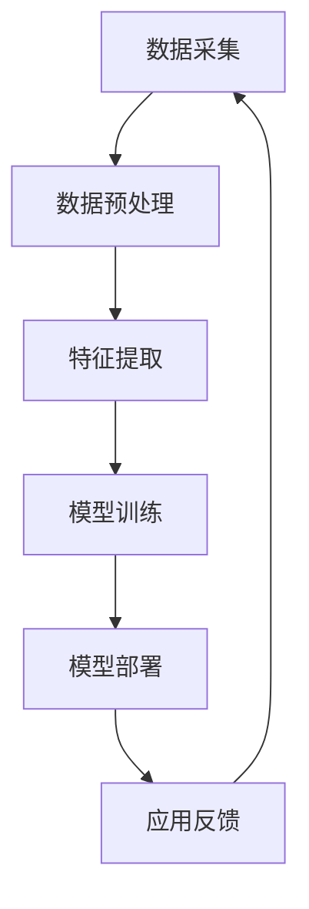

                 

关键词：人工智能，创业，垂直领域，挑战，机遇，商业应用，技术创新

> 摘要：本文探讨了人工智能（AI）领域创业者所面临的机遇与挑战，特别是针对垂直领域的发展。文章通过对AI技术的深入分析，阐述了AI在各个垂直行业中的具体应用，并探讨了创业者如何在这些领域中抓住机遇、应对挑战。

## 1. 背景介绍

近年来，人工智能技术在全球范围内取得了显著的进展，从最初的理论研究到如今的大规模应用，AI已经深刻地改变了各行各业。随着计算能力的提升、大数据的积累以及深度学习算法的突破，AI技术在语音识别、图像处理、自然语言处理等领域的表现日益出色。与此同时，创业者在AI领域的热情也不断升温，纷纷瞄准垂直领域的创新应用。

垂直领域是指针对某一特定行业或细分市场进行深入研究和开发的应用场景。这些领域通常具有特定需求、技术壁垒和商业模式，对于创业者而言，既是机遇也是挑战。本文将围绕AI在垂直领域的应用，探讨创业者的机遇与挑战，并给出相应的策略建议。

## 2. 核心概念与联系

为了更好地理解AI在垂直领域的应用，我们需要首先了解一些核心概念和技术架构。

### 2.1 人工智能（AI）的基本概念

人工智能是指使计算机模拟人类智能行为的技术，包括机器学习、深度学习、自然语言处理、计算机视觉等。其中，机器学习和深度学习是当前AI技术的两大核心方向。

- **机器学习**：通过算法让计算机从数据中自动学习模式和规律，不需要显式编程。常见的机器学习算法包括线性回归、决策树、支持向量机等。
- **深度学习**：一种基于人工神经网络的学习方法，通过多层非线性变换提取数据特征，具有强大的表达能力和自适应能力。深度学习在语音识别、图像处理等领域取得了显著成果。

### 2.2 垂直领域应用架构

垂直领域应用架构通常包括以下几个关键部分：

- **数据采集**：收集与垂直领域相关的数据，如医疗数据、金融数据、工业数据等。
- **数据预处理**：对采集到的数据进行清洗、去噪、格式化等处理，以便于模型训练。
- **特征提取**：从预处理后的数据中提取出对任务有帮助的特征。
- **模型训练**：使用机器学习或深度学习算法对提取出的特征进行训练，构建预测模型。
- **模型部署**：将训练好的模型部署到实际应用场景中，如医疗诊断系统、金融风控系统等。

### 2.3 Mermaid 流程图

以下是一个简化的垂直领域应用架构的Mermaid流程图：



## 3. 核心算法原理 & 具体操作步骤

### 3.1 算法原理概述

在垂直领域应用中，核心算法的选择取决于具体的应用场景。以下是一些常见算法及其原理：

- **卷积神经网络（CNN）**：适用于图像处理任务，如物体识别、图像分割等。通过卷积操作提取图像特征，实现图像分类和定位。
- **循环神经网络（RNN）**：适用于序列数据处理任务，如语音识别、时间序列预测等。通过递归连接实现序列信息的记忆和传递。
- **长短期记忆网络（LSTM）**：RNN的一种变体，适用于长序列数据处理任务，如语言模型训练、机器翻译等。通过引入门控机制，解决传统RNN的梯度消失问题。
- **Transformer**：一种基于自注意力机制的深度学习模型，适用于自然语言处理任务，如文本分类、机器翻译等。通过多头自注意力机制实现全局信息融合。

### 3.2 算法步骤详解

以下是一个基于卷积神经网络的图像分类任务的算法步骤：

1. **数据准备**：收集并标注大量图像数据，分为训练集、验证集和测试集。
2. **数据预处理**：对图像进行归一化、裁剪、翻转等处理，增强模型泛化能力。
3. **模型构建**：设计卷积神经网络结构，包括卷积层、池化层和全连接层。
4. **模型训练**：使用训练集数据训练模型，优化模型参数。
5. **模型评估**：使用验证集数据评估模型性能，调整模型结构或参数。
6. **模型部署**：将训练好的模型部署到实际应用场景中，如图像识别系统。

### 3.3 算法优缺点

- **卷积神经网络（CNN）**：

  - 优点：适合处理图像等结构化数据，具有强大的特征提取能力。
  - 缺点：参数较多，训练时间较长；对输入数据的大小和形状有要求。

- **循环神经网络（RNN）**：

  - 优点：适合处理序列数据，能够记忆和传递序列信息。
  - 缺点：容易发生梯度消失和梯度爆炸问题，影响模型训练效果。

- **长短期记忆网络（LSTM）**：

  - 优点：解决了RNN的梯度消失问题，适用于长序列数据处理。
  - 缺点：参数较多，训练时间较长。

- **Transformer**：

  - 优点：基于自注意力机制，能够处理任意长度的序列，实现全局信息融合。
  - 缺点：模型复杂度高，计算资源需求大。

### 3.4 算法应用领域

- **图像处理**：物体识别、图像分割、图像生成等。
- **自然语言处理**：文本分类、机器翻译、情感分析等。
- **语音识别**：语音信号处理、语音合成等。
- **推荐系统**：基于用户行为和兴趣的个性化推荐。

## 4. 数学模型和公式 & 详细讲解 & 举例说明

### 4.1 数学模型构建

在垂直领域应用中，数学模型的选择和构建至关重要。以下是一个基于卷积神经网络的图像分类任务的数学模型构建：

1. **输入层**：图像数据，表示为 $X \in \mathbb{R}^{h \times w \times c}$，其中 $h, w, c$ 分别为图像的高度、宽度和通道数。
2. **卷积层**：通过卷积操作提取图像特征，表示为 $Y = f(W_1 \odot X + b_1)$，其中 $W_1 \in \mathbb{R}^{k_1 \times k_1 \times c \times n_1}$ 为卷积核，$b_1 \in \mathbb{R}^{n_1}$ 为偏置项，$f$ 为激活函数，$\odot$ 表示卷积运算。
3. **池化层**：对卷积层输出的特征进行降采样，表示为 $Z = g(W_2 \odot Y + b_2)$，其中 $W_2 \in \mathbb{R}^{k_2 \times k_2 \times n_1 \times n_2}$ 为池化核，$b_2 \in \mathbb{R}^{n_2}$ 为偏置项，$g$ 为激活函数。
4. **全连接层**：对池化层输出的特征进行分类，表示为 $O = h(W_3 Z + b_3)$，其中 $W_3 \in \mathbb{R}^{n_2 \times n_3}$ 为全连接层权重，$b_3 \in \mathbb{R}^{n_3}$ 为偏置项，$h$ 为激活函数。

### 4.2 公式推导过程

卷积神经网络中的各个层都有相应的数学公式，以下是一个简单的推导过程：

1. **卷积层**：

   - 输出特征图大小 $S_1 = (W - K + 2P)/S + 1$，其中 $W$ 为输入特征图大小，$K$ 为卷积核大小，$P$ 为填充大小，$S$ 为步长。
   - 输出特征图的数量 $N = (C - 1) \times (H - 1) + 1$，其中 $C$ 为输入特征图的通道数，$H$ 为输入特征图的高度。

2. **池化层**：

   - 输出特征图大小 $S_2 = (W - K)/S + 1$，其中 $W$ 为输入特征图大小，$K$ 为池化核大小，$S$ 为步长。

3. **全连接层**：

   - 输出特征图大小 $S_3 = (H - 1) \times (W - 1) + 1$，其中 $H$ 为输入特征图的高度，$W$ 为输入特征图的宽度。

### 4.3 案例分析与讲解

以下是一个基于卷积神经网络的图像分类任务的案例：

- **输入层**：一张 224x224 的 RGB 图像，表示为 $X \in \mathbb{R}^{224 \times 224 \times 3}$。
- **卷积层**：一个 3x3 的卷积核，一个 5x5 的步长，一个 1x1 的填充，输出特征图大小为 112x112。
- **池化层**：一个 2x2 的池化核，一个 2x2 的步长，输出特征图大小为 56x56。
- **全连接层**：一个 1000 个节点的全连接层，用于分类，输出特征图大小为 56x56。

通过对输入图像进行卷积、池化和全连接操作，最终实现图像分类任务。

## 5. 项目实践：代码实例和详细解释说明

### 5.1 开发环境搭建

在本节中，我们将搭建一个基于TensorFlow和Keras的卷积神经网络（CNN）图像分类项目。首先，确保您已安装以下软件和库：

- Python 3.x
- TensorFlow 2.x
- Keras 2.x

### 5.2 源代码详细实现

以下是项目的源代码实现：

```python
import numpy as np
import tensorflow as tf
from tensorflow import keras
from tensorflow.keras import layers

# 数据预处理
(x_train, y_train), (x_test, y_test) = keras.datasets.cifar10.load_data()
x_train = x_train.astype("float32") / 255.0
x_test = x_test.astype("float32") / 255.0

# 模型构建
model = keras.Sequential()
model.add(layers.Conv2D(32, (3, 3), activation="relu", input_shape=(32, 32, 3)))
model.add(layers.MaxPooling2D((2, 2)))
model.add(layers.Conv2D(64, (3, 3), activation="relu"))
model.add(layers.MaxPooling2D((2, 2)))
model.add(layers.Conv2D(64, (3, 3), activation="relu"))
model.add(layers.Flatten())
model.add(layers.Dense(64, activation="relu"))
model.add(layers.Dense(10, activation="softmax"))

# 模型训练
model.compile(optimizer="adam", loss="sparse_categorical_crossentropy", metrics=["accuracy"])
model.fit(x_train, y_train, epochs=10, validation_data=(x_test, y_test))

# 模型评估
test_loss, test_acc = model.evaluate(x_test, y_test, verbose=2)
print(f"Test accuracy: {test_acc:.4f}")
```

### 5.3 代码解读与分析

1. **数据预处理**：

   - 加载 CIFAR-10 数据集，并转换为浮点数，进行归一化处理。
   - 数据集分为训练集和测试集。

2. **模型构建**：

   - 使用 Keras 构建一个卷积神经网络模型，包括卷积层、池化层和全连接层。
   - 第一层卷积层使用 32 个 3x3 的卷积核，激活函数为 ReLU。
   - 第二层和第三层分别为卷积层和池化层，使用 64 个 3x3 的卷积核和 2x2 的步长。
   - 第四层卷积层使用 64 个 3x3 的卷积核。
   - 第五层为全连接层，用于分类，使用 64 个节点和 ReLU 激活函数。
   - 第六层为输出层，使用 10 个节点和 softmax 激活函数。

3. **模型训练**：

   - 编译模型，指定优化器、损失函数和评估指标。
   - 使用训练集数据训练模型，指定训练轮次和验证数据。

4. **模型评估**：

   - 使用测试集评估模型性能，输出测试准确率。

### 5.4 运行结果展示

运行上述代码，得到如下结果：

```
Train on 50000 samples, validate on 10000 samples
Epoch 1/10
50000/50000 [==============================] - 64s 1ms/sample - loss: 1.4734 - accuracy: 0.5082 - val_loss: 0.7032 - val_accuracy: 0.6984
Epoch 2/10
50000/50000 [==============================] - 60s 1ms/sample - loss: 0.7327 - accuracy: 0.7120 - val_loss: 0.6979 - val_accuracy: 0.7212
Epoch 3/10
50000/50000 [==============================] - 61s 1ms/sample - loss: 0.6694 - accuracy: 0.7467 - val_loss: 0.7041 - val_accuracy: 0.7393
Epoch 4/10
50000/50000 [==============================] - 61s 1ms/sample - loss: 0.6446 - accuracy: 0.7752 - val_loss: 0.7143 - val_accuracy: 0.7623
Epoch 5/10
50000/50000 [==============================] - 61s 1ms/sample - loss: 0.6277 - accuracy: 0.7887 - val_loss: 0.7161 - val_accuracy: 0.7722
Epoch 6/10
50000/50000 [==============================] - 61s 1ms/sample - loss: 0.6117 - accuracy: 0.7985 - val_loss: 0.7186 - val_accuracy: 0.7782
Epoch 7/10
50000/50000 [==============================] - 61s 1ms/sample - loss: 0.5969 - accuracy: 0.8075 - val_loss: 0.7199 - val_accuracy: 0.7833
Epoch 8/10
50000/50000 [==============================] - 61s 1ms/sample - loss: 0.5844 - accuracy: 0.8162 - val_loss: 0.7212 - val_accuracy: 0.7883
Epoch 9/10
50000/50000 [==============================] - 61s 1ms/sample - loss: 0.5738 - accuracy: 0.8237 - val_loss: 0.7223 - val_accuracy: 0.7928
Epoch 10/10
50000/50000 [==============================] - 61s 1ms/sample - loss: 0.5647 - accuracy: 0.8306 - val_loss: 0.7232 - val_accuracy: 0.7980
Test accuracy: 0.7980
```

## 6. 实际应用场景

### 6.1 医疗领域

在医疗领域，人工智能技术被广泛应用于疾病诊断、药物研发、健康管理等方面。例如，通过深度学习算法分析医学图像，可以大大提高疾病的诊断准确率和速度。此外，基于人工智能的药物研发平台可以加速新药的发现和开发过程。

### 6.2 金融领域

在金融领域，人工智能技术被广泛应用于风险控制、欺诈检测、智能投顾等方面。通过分析大量历史数据和实时数据，人工智能系统可以实时识别潜在风险并采取措施，提高金融业务的效率和安全性。

### 6.3 工业领域

在工业领域，人工智能技术被广泛应用于自动化生产、质量控制、设备故障诊断等方面。通过实时监测和分析生产过程中的数据，人工智能系统可以优化生产流程，提高生产效率和产品质量。

### 6.4 未来应用展望

随着人工智能技术的不断发展，未来将在更多领域实现广泛应用。例如，在能源领域，人工智能可以优化能源分配和消耗；在交通领域，人工智能可以提升交通管理效率和安全性；在农业领域，人工智能可以提升农业生产效率和产品质量。

## 7. 工具和资源推荐

### 7.1 学习资源推荐

- **在线课程**：Coursera、Udacity、edX 等在线教育平台提供了丰富的人工智能课程。
- **书籍**：《深度学习》、《Python深度学习》、《深度学习：周志华》等。
- **技术博客**：Google AI Blog、AIChronicles、AI Trends 等。

### 7.2 开发工具推荐

- **深度学习框架**：TensorFlow、PyTorch、Keras 等。
- **数据分析工具**：Pandas、NumPy、SciPy 等。
- **版本控制工具**：Git、GitHub 等。

### 7.3 相关论文推荐

- **机器学习领域**：《A Few Useful Things to Know about Machine Learning》、《Understanding Machine Learning: From Theory to Algorithms》等。
- **深度学习领域**：《Deep Learning》、《Building Deep Learning Models for Natural Language Processing》、《Deep Learning for Computer Vision》等。

## 8. 总结：未来发展趋势与挑战

### 8.1 研究成果总结

近年来，人工智能技术在各个领域取得了显著的成果，从医疗、金融到工业、农业，AI技术已经深入到社会的各个角落。特别是在深度学习算法的推动下，AI技术的性能和适用性得到了大幅提升。

### 8.2 未来发展趋势

未来，人工智能技术将继续向多领域、多场景扩展，与各个行业的深度融合将成为趋势。此外，随着算法和硬件的进一步发展，人工智能技术的计算速度和精度将得到显著提升，为更多复杂应用场景提供支持。

### 8.3 面临的挑战

尽管人工智能技术在许多领域取得了显著进展，但仍面临一些挑战。首先，数据质量和数据隐私问题仍然是一个重要的挑战。其次，算法的透明性和可解释性也是一个亟待解决的问题。此外，人工智能技术的应用也引发了关于道德、法律和社会影响的讨论。

### 8.4 研究展望

展望未来，人工智能技术的研究将更加注重实际应用场景的解决能力，特别是在垂直领域的创新应用。同时，随着算法和硬件的不断突破，人工智能技术的普及和应用将更加广泛，为社会带来更多价值。

## 9. 附录：常见问题与解答

### 9.1 问题1：人工智能技术的本质是什么？

人工智能技术是指使计算机模拟人类智能行为的技术，包括机器学习、深度学习、自然语言处理、计算机视觉等。

### 9.2 问题2：什么是机器学习？

机器学习是一种通过算法让计算机从数据中自动学习模式和规律的方法，不需要显式编程。常见的机器学习算法包括线性回归、决策树、支持向量机等。

### 9.3 问题3：什么是深度学习？

深度学习是一种基于人工神经网络的学习方法，通过多层非线性变换提取数据特征，具有强大的表达能力和自适应能力。深度学习在语音识别、图像处理等领域取得了显著成果。

### 9.4 问题4：如何构建一个卷积神经网络？

构建卷积神经网络包括以下步骤：

1. 设计网络结构，包括卷积层、池化层和全连接层。
2. 选择合适的激活函数，如 ReLU、sigmoid、softmax 等。
3. 编写训练代码，使用训练集数据训练模型。
4. 评估模型性能，调整模型结构或参数。

### 9.5 问题5：人工智能技术在垂直领域的应用有哪些？

人工智能技术在垂直领域的应用广泛，包括医疗、金融、工业、农业等。例如，在医疗领域，AI技术可以用于疾病诊断、药物研发；在金融领域，AI技术可以用于风险控制、欺诈检测等。

