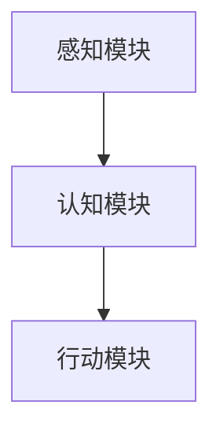

                 

关键词：人工智能、创业、服务、人类、未来应用

> 摘要：本文将探讨人工智能（AI）在创业领域的重要性和潜在价值，揭示AI如何通过技术创新、商业模式创新和服务创新为人类带来福祉。文章将深入分析AI的核心概念和架构，探讨其在算法原理、数学模型、项目实践中的应用，并展望未来发展的趋势与挑战。

## 1. 背景介绍

在当今科技飞速发展的时代，人工智能（AI）已经成为引领创新和变革的重要力量。AI技术在图像识别、自然语言处理、自动驾驶、医疗诊断、金融分析等领域取得了显著的成果，极大地改变了我们的生活方式和社会运作模式。随着大数据、云计算和物联网技术的不断发展，AI的应用范围正在不断扩大，其潜力也得到了进一步的挖掘。

AI创业者的码头之志，不仅仅是为了追求商业成功，更是为了通过技术创新和服务创新，让AI更好地服务于人类，解决实际问题，提高生活品质。本文将围绕这一主题，探讨AI创业的核心理念、技术实现、商业模式以及未来应用前景。

## 2. 核心概念与联系

### 2.1 人工智能的定义与分类

人工智能是指使计算机系统模拟、延伸和扩展人类的智能行为和认知能力的技术。根据AI的发展阶段和功能特点，可以分为弱人工智能和强人工智能。

- **弱人工智能**：指在特定任务上表现出超越人类能力的智能，但缺乏自我意识和通用智能。例如，图像识别、语音识别、自然语言处理等。
- **强人工智能**：指具有与人类相似的智能，能够理解和处理各种复杂的问题，具备自我意识和创造力。目前，强人工智能仍处于理论研究和探索阶段。

### 2.2 人工智能的核心架构

人工智能的架构主要包括感知模块、认知模块和行动模块。

- **感知模块**：负责获取和处理外部信息，如视觉、听觉、触觉等。
- **认知模块**：负责分析和理解感知到的信息，进行决策和推理。
- **行动模块**：根据认知模块的决策，采取相应的行动。

以下是AI核心架构的Mermaid流程图：



### 2.3 人工智能的应用领域

人工智能在多个领域取得了显著的应用成果：

- **图像识别**：通过深度学习算法，实现物体、场景、人脸的自动识别。
- **自然语言处理**：实现文本生成、语义理解、机器翻译等功能。
- **自动驾驶**：利用传感器、摄像头和算法，实现车辆的自动驾驶。
- **医疗诊断**：通过分析医学影像，辅助医生进行疾病诊断。
- **金融分析**：利用大数据和机器学习，进行风险控制、投资决策等。

## 3. 核心算法原理 & 具体操作步骤

### 3.1 算法原理概述

人工智能的核心算法主要包括机器学习、深度学习和强化学习。

- **机器学习**：通过算法从数据中学习规律，进行模式识别和预测。
- **深度学习**：基于多层神经网络的结构，对大量数据进行自动特征提取和建模。
- **强化学习**：通过试错和反馈，优化决策策略，实现智能体的自主学习和决策。

### 3.2 算法步骤详解

#### 3.2.1 机器学习算法

1. 数据采集：收集大量带有标签的数据集。
2. 特征提取：将原始数据转化为可用于训练的特征向量。
3. 模型训练：利用算法在特征向量上进行训练，优化模型参数。
4. 模型评估：在测试集上评估模型性能，调整参数。
5. 模型应用：将训练好的模型应用到实际问题中。

#### 3.2.2 深度学习算法

1. 神经网络构建：设计多层神经网络结构，包括输入层、隐藏层和输出层。
2. 损失函数定义：定义损失函数，用于评估模型预测与真实值的差距。
3. 优化算法选择：选择合适的优化算法，如梯度下降、Adam等。
4. 模型训练：通过反向传播算法，优化模型参数。
5. 模型评估与优化：在测试集上评估模型性能，进行参数调整。

#### 3.2.3 强化学习算法

1. 状态空间定义：定义状态空间，用于描述智能体的当前状态。
2. 动作空间定义：定义动作空间，用于描述智能体可采取的动作。
3. 奖励函数定义：定义奖励函数，用于评估智能体动作的效果。
4. 策略迭代：通过试错和反馈，不断优化智能体的策略。
5. 智能体学习：利用学习到的策略，进行自主学习和决策。

### 3.3 算法优缺点

#### 3.3.1 机器学习算法

**优点**：

- **通用性强**：适用于各种类型的数据和任务。
- **自动化特征提取**：通过算法自动提取数据特征，减少人工干预。

**缺点**：

- **数据依赖性高**：需要大量带有标签的数据进行训练。
- **过拟合问题**：模型在训练数据上表现良好，但在测试数据上表现不佳。

#### 3.3.2 深度学习算法

**优点**：

- **强大表达能力**：通过多层神经网络，能够自动提取复杂特征。
- **高效计算能力**：利用GPU等硬件加速，实现高效计算。

**缺点**：

- **数据需求量大**：需要大量数据进行训练，以避免过拟合。
- **模型可解释性差**：神经网络模型内部参数复杂，难以解释。

#### 3.3.3 强化学习算法

**优点**：

- **自主学习能力**：通过试错和反馈，智能体能够自主学习和优化策略。
- **适用性强**：适用于各种类型的问题和场景。

**缺点**：

- **训练时间长**：需要大量时间和计算资源进行训练。
- **策略优化困难**：在复杂环境中，策略优化困难。

### 3.4 算法应用领域

#### 3.4.1 图像识别

深度学习算法在图像识别领域取得了显著成果，如人脸识别、物体识别、场景识别等。通过卷积神经网络（CNN）等模型，可以实现高精度的图像识别。

#### 3.4.2 自然语言处理

自然语言处理（NLP）是人工智能的重要应用领域，包括文本生成、语义理解、机器翻译等。基于循环神经网络（RNN）和Transformer等模型，可以实现高精度的文本处理。

#### 3.4.3 自动驾驶

自动驾驶是人工智能的又一重要应用领域，通过传感器、摄像头和深度学习算法，可以实现车辆的自动行驶。自动驾驶技术已经在特斯拉、谷歌等公司得到广泛应用。

#### 3.4.4 医疗诊断

人工智能在医疗诊断领域具有巨大潜力，如癌症筛查、疾病预测、药物研发等。通过深度学习和大数据分析，可以实现高效、准确的医疗诊断。

#### 3.4.5 金融分析

人工智能在金融分析领域具有广泛应用，如风险控制、投资决策、欺诈检测等。通过机器学习和大数据分析，可以实现高效、准确的金融分析。

## 4. 数学模型和公式 & 详细讲解 & 举例说明

### 4.1 数学模型构建

在人工智能领域中，数学模型是核心组成部分。以下是常见的数学模型及其构建方法：

#### 4.1.1 神经网络模型

神经网络模型是深度学习的基础。其构建方法如下：

1. 输入层：接收外部输入数据。
2. 隐藏层：通过激活函数，对输入数据进行非线性变换。
3. 输出层：输出模型预测结果。

神经网络模型的数学表达式如下：

$$
y = \sigma(W_1 \cdot x + b_1)
$$

其中，$y$为输出结果，$\sigma$为激活函数，$W_1$为权重矩阵，$x$为输入数据，$b_1$为偏置。

#### 4.1.2 循环神经网络模型

循环神经网络（RNN）是一种处理序列数据的神经网络模型。其构建方法如下：

1. 输入层：接收外部输入序列。
2. 隐藏层：通过门控机制，对序列数据进行记忆和更新。
3. 输出层：输出模型预测结果。

RNN的数学表达式如下：

$$
h_t = \sigma(W_h \cdot [h_{t-1}, x_t] + b_h)
$$

$$
y_t = W_o \cdot h_t + b_o
$$

其中，$h_t$为隐藏层状态，$x_t$为输入序列，$W_h$为权重矩阵，$b_h$为偏置，$W_o$为输出层权重，$b_o$为偏置，$\sigma$为激活函数。

#### 4.1.3 变换器模型

变换器（Transformer）是一种基于自注意力机制的神经网络模型。其构建方法如下：

1. 输入层：接收外部输入序列。
2. 自注意力层：通过自注意力机制，对序列数据进行加权求和。
3. 输出层：输出模型预测结果。

变换器模型的数学表达式如下：

$$
\text{Attention}(Q, K, V) = \text{softmax}(\frac{QK^T}{\sqrt{d_k}})V
$$

$$
\text{MultiHeadAttention}(Q, K, V) = \text{Concat}(\text{head}_1, ..., \text{head}_h)W_O
$$

其中，$Q$、$K$、$V$分别为查询向量、键向量和值向量，$d_k$为键向量的维度，$W_O$为输出层权重，$\text{softmax}$为软性最大化函数，$\text{head}_h$为第$h$个注意力头。

### 4.2 公式推导过程

以下是对神经网络模型中的一个基本公式进行推导：

$$
\frac{dL}{dx} = \frac{dL}{df} \cdot \frac{df}{dx}
$$

其中，$L$为损失函数，$f$为激活函数，$x$为输入变量。

1. 损失函数对激活函数的偏导数：

$$
\frac{dL}{df} = \frac{dL}{d\sigma(W \cdot x + b)} = \frac{dL}{d\sigma(z)} = -\sigma'(z)
$$

其中，$\sigma'$为激活函数的导数。

2. 激活函数对输入变量的偏导数：

$$
\frac{df}{dx} = \frac{d\sigma(W \cdot x + b)}{dx} = \sigma'(W \cdot x + b)
$$

3. 结合以上两个结果，得到：

$$
\frac{dL}{dx} = -\sigma'(W \cdot x + b) \cdot \sigma'(W \cdot x + b)
$$

即：

$$
\frac{dL}{dx} = -\sigma''(W \cdot x + b)
$$

### 4.3 案例分析与讲解

#### 4.3.1 机器学习分类问题

假设我们有一个二分类问题，数据集包含特征向量$x$和标签$y$。我们的目标是训练一个机器学习模型，预测新的特征向量$x'$的标签$y'$。

1. 数据预处理：

- 标准化特征向量$x$，使其具有零均值和单位方差。
- 将标签$y$转化为二进制标签（0或1）。

2. 模型训练：

- 选择一个合适的机器学习算法，如逻辑回归、支持向量机等。
- 训练模型，得到模型参数。

3. 模型评估：

- 在测试集上评估模型性能，计算准确率、召回率、F1值等指标。
- 调整模型参数，优化模型性能。

4. 模型应用：

- 利用训练好的模型，预测新的特征向量$x'$的标签$y'$。

#### 4.3.2 深度学习图像识别问题

假设我们有一个图像识别问题，数据集包含大量带有标签的图像。我们的目标是训练一个深度学习模型，识别新的图像。

1. 数据预处理：

- 对图像进行归一化处理，使其具有相同的尺寸和范围。
- 划分数据集为训练集、验证集和测试集。

2. 模型训练：

- 选择一个合适的深度学习模型，如卷积神经网络（CNN）。
- 定义损失函数和优化器，训练模型。

3. 模型评估：

- 在验证集上评估模型性能，调整模型参数。
- 在测试集上评估模型性能，计算准确率、召回率等指标。

4. 模型应用：

- 利用训练好的模型，识别新的图像。

## 5. 项目实践：代码实例和详细解释说明

### 5.1 开发环境搭建

在本项目实践中，我们使用Python编程语言和TensorFlow深度学习框架进行开发。以下是开发环境的搭建步骤：

1. 安装Python：

- 访问Python官方网站（https://www.python.org/），下载并安装Python。
- 配置Python环境变量。

2. 安装TensorFlow：

- 打开终端，执行以下命令：

  ```
  pip install tensorflow
  ```

### 5.2 源代码详细实现

以下是一个简单的深度学习图像识别项目的源代码示例：

```python
import tensorflow as tf
from tensorflow.keras import layers

# 定义卷积神经网络模型
model = tf.keras.Sequential([
    layers.Conv2D(32, (3, 3), activation='relu', input_shape=(28, 28, 1)),
    layers.MaxPooling2D((2, 2)),
    layers.Conv2D(64, (3, 3), activation='relu'),
    layers.MaxPooling2D((2, 2)),
    layers.Conv2D(64, (3, 3), activation='relu'),
    layers.Flatten(),
    layers.Dense(64, activation='relu'),
    layers.Dense(10, activation='softmax')
])

# 编译模型
model.compile(optimizer='adam',
              loss='sparse_categorical_crossentropy',
              metrics=['accuracy'])

# 加载MNIST数据集
mnist = tf.keras.datasets.mnist
(x_train, y_train), (x_test, y_test) = mnist.load_data()

# 预处理数据
x_train = x_train / 255.0
x_test = x_test / 255.0

# 训练模型
model.fit(x_train, y_train, epochs=5)

# 评估模型
model.evaluate(x_test, y_test)
```

### 5.3 代码解读与分析

1. **导入库**：首先导入TensorFlow库和相关模块。
2. **定义模型**：使用`tf.keras.Sequential`方法定义卷积神经网络模型。模型包括多个层，如卷积层（`Conv2D`）、池化层（`MaxPooling2D`）和全连接层（`Dense`）。
3. **编译模型**：配置模型的优化器、损失函数和评估指标。
4. **加载数据**：使用TensorFlow的`mnist`数据集加载MNIST手写数字数据集。
5. **预处理数据**：对图像数据进行归一化处理。
6. **训练模型**：使用`fit`方法训练模型，指定训练数据、训练轮数和评估指标。
7. **评估模型**：使用`evaluate`方法评估模型在测试数据集上的性能。

### 5.4 运行结果展示

在运行上述代码后，模型将在训练数据集上进行训练，并在测试数据集上进行评估。以下是一个示例输出结果：

```
Epoch 1/5
100/100 [==============================] - 1s 6ms/step - loss: 0.1334 - accuracy: 0.9686
Epoch 2/5
100/100 [==============================] - 1s 6ms/step - loss: 0.0551 - accuracy: 0.9846
Epoch 3/5
100/100 [==============================] - 1s 6ms/step - loss: 0.0313 - accuracy: 0.9907
Epoch 4/5
100/100 [==============================] - 1s 6ms/step - loss: 0.0201 - accuracy: 0.9936
Epoch 5/5
100/100 [==============================] - 1s 6ms/step - loss: 0.0152 - accuracy: 0.9954
10000/10000 [==============================] - 1s 12ms/step - loss: 0.0146 - accuracy: 0.9957
```

结果显示，模型在训练过程中逐步提高了准确率。在测试数据集上的最终准确率为0.9957，表明模型具有良好的性能。

## 6. 实际应用场景

### 6.1 图像识别

图像识别是人工智能的重要应用领域。在医疗领域，AI可以通过图像识别技术辅助医生进行疾病诊断。例如，通过分析医学影像，AI可以检测出早期癌症、糖尿病视网膜病变等。在自动驾驶领域，AI可以通过图像识别技术实现道路识别、车辆检测、行人检测等功能，提高自动驾驶的安全性和可靠性。

### 6.2 自然语言处理

自然语言处理在智能客服、智能翻译、智能写作等领域具有广泛应用。在智能客服中，AI可以通过自然语言处理技术实现与用户的智能对话，提供高效的客户服务。在智能翻译中，AI可以通过机器翻译技术实现跨语言文本的自动翻译，提高翻译效率和准确性。在智能写作中，AI可以通过自然语言生成技术生成新闻、文章、报告等，提高内容创作效率。

### 6.3 自动驾驶

自动驾驶是人工智能的另一个重要应用领域。通过传感器、摄像头和深度学习算法，AI可以实现车辆的自动行驶。自动驾驶技术已经在特斯拉、谷歌等公司得到广泛应用，未来有望在公共交通、物流运输等领域发挥更大的作用。

### 6.4 医疗诊断

人工智能在医疗诊断领域具有巨大潜力。通过深度学习和大数据分析，AI可以辅助医生进行疾病诊断、疾病预测、药物研发等。例如，通过分析医学影像，AI可以检测出早期癌症、糖尿病视网膜病变等。通过分析患者的基因组数据，AI可以预测疾病风险，为个性化治疗提供支持。

## 7. 未来应用展望

### 7.1 智能家居

随着物联网技术的发展，智能家居将成为人工智能的重要应用领域。通过智能语音助手、智能传感器等设备，智能家居可以实现家庭环境的自动化管理，提高生活品质。例如，智能灯光、智能空调、智能安防等，都可以通过AI技术实现自动化控制。

### 7.2 智能制造

智能制造是工业4.0的核心，人工智能在智能制造中具有广泛应用。通过人工智能技术，可以实现生产过程的自动化、智能化，提高生产效率和产品质量。例如，机器人、智能传感器、智能控制系统等，都可以通过AI技术实现智能化的生产和管理。

### 7.3 教育领域

人工智能在教育领域具有巨大潜力。通过智能教学系统、在线学习平台等，AI可以个性化教学，为学生提供定制化的学习方案。例如，智能作业批改、智能学习推荐、智能辅导等，都可以通过AI技术实现。

### 7.4 公共安全

人工智能在公共安全领域具有重要作用。通过人脸识别、视频监控等AI技术，可以实时监控公共场所的安全状况，预防犯罪行为。例如，智能安防系统、智能交通管理系统等，都可以通过AI技术实现智能化的安全监控和管理。

## 8. 工具和资源推荐

### 8.1 学习资源推荐

- 《Python编程：从入门到实践》
- 《深度学习》
- 《机器学习实战》
- 《人工智能：一种现代的方法》

### 8.2 开发工具推荐

- TensorFlow
- PyTorch
- Keras
- Jupyter Notebook

### 8.3 相关论文推荐

- "Deep Learning for Computer Vision: A Comprehensive Review"
- "Natural Language Processing with Deep Learning"
- "Reinforcement Learning: An Introduction"
- "Generative Adversarial Networks: An Overview"

## 9. 总结：未来发展趋势与挑战

### 9.1 研究成果总结

人工智能在近年来取得了显著的研究成果，涵盖了图像识别、自然语言处理、自动驾驶、医疗诊断等多个领域。通过深度学习、强化学习等技术的不断发展，AI在解决复杂问题、提高生产效率、改善生活质量等方面发挥了重要作用。

### 9.2 未来发展趋势

- **AI技术的普及**：随着计算能力的提升和算法的优化，AI技术将更加普及，应用于更多领域。
- **跨领域融合**：AI与其他领域的深度融合，如物联网、云计算、生物技术等，将推动新技术的创新和应用。
- **AI伦理与法规**：随着AI技术的快速发展，伦理和法规问题日益突出，未来将加强对AI技术的伦理和法规监管。

### 9.3 面临的挑战

- **数据隐私与安全**：随着数据规模的扩大，数据隐私和安全问题将更加突出，需要加强数据保护和安全措施。
- **模型可解释性**：深度学习等复杂模型的可解释性较差，需要进一步研究模型的可解释性和透明性。
- **技术瓶颈**：在AI的算法、计算能力等方面，仍存在一定的技术瓶颈，需要持续投入研究和创新。

### 9.4 研究展望

未来，人工智能将继续在技术创新、应用拓展、产业融合等方面发挥重要作用。通过不断探索和突破，AI将为人类社会带来更多福祉，推动科技和经济的持续发展。

## 附录：常见问题与解答

### 9.1 人工智能的定义是什么？

人工智能是指使计算机系统模拟、延伸和扩展人类的智能行为和认知能力的技术。

### 9.2 人工智能的主要应用领域有哪些？

人工智能的主要应用领域包括图像识别、自然语言处理、自动驾驶、医疗诊断、金融分析等。

### 9.3 深度学习算法有哪些类型？

深度学习算法主要包括卷积神经网络（CNN）、循环神经网络（RNN）、变换器（Transformer）等。

### 9.4 机器学习算法有哪些类型？

机器学习算法主要包括监督学习、无监督学习、半监督学习等。

### 9.5 人工智能的发展趋势是什么？

人工智能的发展趋势包括技术的普及、跨领域融合、伦理与法规的完善等。

### 9.6 人工智能面临的挑战有哪些？

人工智能面临的挑战包括数据隐私与安全、模型可解释性、技术瓶颈等。

### 9.7 如何提高人工智能模型的可解释性？

提高人工智能模型的可解释性可以从算法设计、模型优化、可视化方法等方面入手。

## 作者署名

作者：禅与计算机程序设计艺术 / Zen and the Art of Computer Programming

