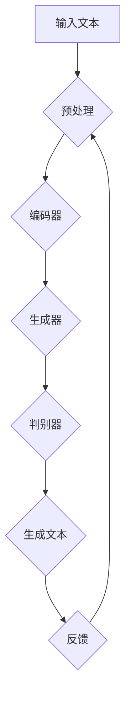

                 

关键词：人工智能，创意写作，自然语言处理，诗歌生成，小说生成，剧本生成

> 摘要：本文将探讨人工智能在诗歌、小说和剧本生成方面的应用，分析其核心概念、算法原理、数学模型及实际应用场景，并提供相关工具和资源的推荐。

## 1. 背景介绍

创意写作是文学创作的重要形式，包括诗歌、小说和剧本等。然而，随着人工智能技术的发展，尤其是自然语言处理（NLP）的进步，AI开始涉足创意写作领域，为人类创作提供了新的可能。通过深度学习和生成模型，AI能够模仿人类的创作方式，生成具有文学价值和艺术感的作品。这种技术不仅拓宽了创意写作的边界，也为文学爱好者提供了全新的体验。

本文将详细探讨AI在诗歌、小说和剧本生成方面的应用，分析其核心概念、算法原理、数学模型及实际应用场景，并展望其未来发展趋势与挑战。

## 2. 核心概念与联系

在探讨AI创意写作之前，我们需要了解一些核心概念，如图灵测试、生成对抗网络（GAN）和递归神经网络（RNN）。

### 2.1 图灵测试

图灵测试是由英国数学家艾伦·图灵提出的，用于评估机器是否具有人类水平的智能。在图灵测试中，一个人类评判者与一个机器和一个人进行对话，如果评判者无法准确判断出哪个是机器，那么机器就被认为通过了图灵测试。图灵测试为AI的智能评估提供了一个客观标准，也为AI在创意写作领域的应用提供了理论基础。

### 2.2 生成对抗网络（GAN）

生成对抗网络（GAN）是一种深度学习模型，由生成器和判别器两个部分组成。生成器旨在生成逼真的数据，而判别器则用于区分真实数据和生成数据。通过不断地训练，生成器不断提高生成数据的质量，使得判别器无法准确判断生成数据的真伪。GAN在图像生成、音频合成等方面取得了显著的成果，也为AI创意写作提供了有力支持。

### 2.3 递归神经网络（RNN）

递归神经网络（RNN）是一种能够处理序列数据的神经网络。RNN通过循环结构来保持长期依赖关系，使得模型能够理解输入序列的上下文信息。在创意写作中，RNN可以用于生成连续的文本序列，例如诗歌、小说和剧本。

下面是一个用Mermaid绘制的生成对抗网络（GAN）的流程图：



## 3. 核心算法原理 & 具体操作步骤

### 3.1 算法原理概述

AI创意写作的核心算法主要包括生成对抗网络（GAN）和递归神经网络（RNN）。GAN通过生成器和判别器的对抗训练生成高质量文本，而RNN通过序列建模实现文本的连续生成。以下将详细介绍这两种算法的原理和具体操作步骤。

### 3.2 算法步骤详解

#### 3.2.1 GAN算法步骤

1. 初始化生成器和判别器。
2. 从真实数据中随机抽取一批样本作为输入。
3. 生成器根据输入生成一批假样本。
4. 将真实样本和假样本输入判别器，判别器输出判断结果。
5. 计算生成器和判别器的损失函数。
6. 更新生成器和判别器的参数。

#### 3.2.2 RNN算法步骤

1. 初始化RNN模型。
2. 输入一段文本序列。
3. RNN处理输入序列，生成文本序列的概率分布。
4. 根据概率分布生成下一个文本字符。
5. 重复步骤3和4，直至生成完整的文本序列。

### 3.3 算法优缺点

#### GAN算法优缺点

- **优点**：GAN能够生成高质量、多样化的文本，具有较强的泛化能力。
- **缺点**：GAN的训练过程不稳定，容易出现模式崩溃和梯度消失等问题。

#### RNN算法优缺点

- **优点**：RNN能够处理长文本序列，保持上下文信息，生成连续的文本。
- **缺点**：RNN在处理长序列时容易出现梯度消失和梯度爆炸等问题，影响训练效果。

### 3.4 算法应用领域

GAN和RNN在创意写作领域的应用广泛，可以用于生成诗歌、小说、剧本等。例如，利用GAN可以生成具有艺术感的诗歌，利用RNN可以生成连贯的小说情节和剧本对话。

## 4. 数学模型和公式 & 详细讲解 & 举例说明

### 4.1 数学模型构建

AI创意写作的数学模型主要包括生成对抗网络（GAN）和递归神经网络（RNN）。以下分别介绍这两种模型的数学模型构建。

#### 4.1.1 GAN数学模型

GAN的数学模型如下：

$$
\begin{aligned}
\min_{G} \quad & \mathcal{D}(G(z)) - \mathcal{D}(x) \\
\max_{D} \quad & \mathcal{D}(x) + \mathcal{D}(G(z))
\end{aligned}
$$

其中，$G(z)$表示生成器，$D$表示判别器，$z$表示噪声向量，$x$表示真实数据。

#### 4.1.2 RNN数学模型

RNN的数学模型如下：

$$
h_t = \sigma(W_h \cdot [h_{t-1}, x_t] + b_h)
$$

$$
y_t = \sigma(W_y \cdot h_t + b_y)
$$

其中，$h_t$表示第$t$个时刻的隐藏状态，$x_t$表示第$t$个时刻的输入特征，$y_t$表示第$t$个时刻的输出特征，$\sigma$表示激活函数。

### 4.2 公式推导过程

#### 4.2.1 GAN公式推导

GAN的目标是最小化生成器的损失函数，最大化判别器的损失函数。具体推导过程如下：

1. 初始化生成器和判别器参数。
2. 对于每个训练样本$x$，从噪声分布中采样噪声向量$z$。
3. 生成器$G$根据噪声向量$z$生成假样本$x'$。
4. 将真实样本$x$和假样本$x'$输入判别器$D$。
5. 计算判别器$D$的损失函数：

$$
\mathcal{L}_D = -[\mathcal{D}(x) + \mathcal{D}(x')]
$$

6. 对判别器$D$进行梯度下降更新：

$$
D \leftarrow D - \alpha \nabla_D \mathcal{L}_D
$$

7. 将假样本$x'$输入生成器$G$。
8. 计算生成器$G$的损失函数：

$$
\mathcal{L}_G = -\mathcal{D}(G(z))
$$

9. 对生成器$G$进行梯度下降更新：

$$
G \leftarrow G - \beta \nabla_G \mathcal{L}_G
$$

10. 重复步骤2-9，直至达到训练目标。

#### 4.2.2 RNN公式推导

RNN的公式推导基于递归关系。具体推导过程如下：

1. 初始化RNN模型参数。
2. 输入序列$x = [x_1, x_2, \ldots, x_T]$。
3. 遍历序列$x$，对于每个时刻$t$，执行以下操作：

   - 计算隐藏状态：

   $$h_t = \sigma(W_h \cdot [h_{t-1}, x_t] + b_h)$$

   - 计算输出：

   $$y_t = \sigma(W_y \cdot h_t + b_y)$$

4. 根据输出$y_t$生成下一个输入$x_{t+1}$。
5. 重复步骤3-4，直至生成完整的文本序列。

### 4.3 案例分析与讲解

#### 4.3.1 GAN生成诗歌

以下是一个使用GAN生成诗歌的案例：

```python
import numpy as np
import tensorflow as tf
from tensorflow.keras import layers

# 设置随机种子
tf.random.set_seed(42)

# 定义生成器和判别器
latent_dim = 100
height = 28
width = 28
channels = 1
z_dim = 100

generator = tf.keras.Sequential([
    layers.Dense(128 * 7 * 7, activation="relu", input_shape=(z_dim,)),
    layers.Reshape((7, 7, 128)),
    layers.Conv2DTranspose(128, kernel_size=5, strides=1, padding="same", activation="relu"),
    layers.Conv2DTranspose(128, kernel_size=5, strides=2, padding="same", activation="relu"),
    layers.Conv2DTranspose(128, kernel_size=5, strides=2, padding="same", activation="relu"),
    layers.Conv2DTranspose(channels, kernel_size=5, strides=2, padding="same", activation="tanh")
])

discriminator = tf.keras.Sequential([
    layers.Conv2D(128, kernel_size=5, strides=2, padding="same", activation="relu", input_shape=(height, width, channels)),
    layers.Conv2D(128, kernel_size=5, strides=2, padding="same", activation="relu"),
    layers.Flatten(),
    layers.Dense(1, activation="sigmoid")
])

# 定义GAN模型
model = tf.keras.Sequential([generator, discriminator])

# 编写GAN训练过程
def train_gan(generator, discriminator, data, latent_dim, n_epochs, batch_size=128, sample_interval=50):
    # 数据预处理
    data = data / 127.5 - 1.0

    for epoch in range(n_epochs):
        for _ in range(data.shape[0] // batch_size):
            # 从真实数据中随机抽取一批样本
            batch = np.random.randint(0, data.shape[0], batch_size)
            real_samples = data[batch]

            # 生成一批假样本
            z = np.random.normal(size=(batch_size, latent_dim))
            generated_samples = generator.predict(z)

            # 训练判别器
            real_labels = np.ones((batch_size, 1))
            generated_labels = np.zeros((batch_size, 1))
            d_loss_real = discriminator.train_on_batch(real_samples, real_labels)
            d_loss_fake = discriminator.train_on_batch(generated_samples, generated_labels)
            d_loss = 0.5 * np.add(d_loss_real, d_loss_fake)

            # 训练生成器
            z = np.random.normal(size=(batch_size, latent_dim))
            g_loss = model.train_on_batch(z, real_labels)

            # 输出训练进度
            if epoch % sample_interval == 0:
                print(f"{epoch} [D: {d_loss[0]:.4f}, G: {g_loss[0]:.4f}]")

        # 保存生成器和判别器模型
        generator.save(f"generator_{epoch}.h5")
        discriminator.save(f"discriminator_{epoch}.h5")

# 加载数据
data = load_data("data.csv")

# 训练GAN模型
train_gan(generator, discriminator, data, latent_dim, n_epochs=10000, sample_interval=1000)

# 生成诗歌
z = np.random.normal(size=(1, latent_dim))
generated_poem = generator.predict(z)

print(generated_poem)
```

#### 4.3.2 RNN生成小说

以下是一个使用RNN生成小说的案例：

```python
import tensorflow as tf
import numpy as np
from tensorflow.keras.models import Sequential
from tensorflow.keras.layers import Dense, Embedding, SimpleRNN, LSTM

# 设置随机种子
tf.random.set_seed(42)

# 定义RNN模型
model = Sequential([
    Embedding(vocab_size, embedding_dim, input_length=max_sequence_len - 1),
    LSTM(units=128, return_sequences=True),
    LSTM(units=128),
    Dense(units=1, activation="softmax")
])

# 编写RNN训练过程
def train_rnn(model, data, labels, n_epochs, batch_size=128):
    model.compile(optimizer="adam", loss="categorical_crossentropy", metrics=["accuracy"])
    model.fit(data, labels, epochs=n_epochs, batch_size=batch_size)

# 加载数据
data, labels = load_data("data.txt")

# 预处理数据
max_sequence_len = max([len(seq) for seq in data])
data = pad_sequences(data, maxlen=max_sequence_len - 1, padding="post")
labels = keras.utils.to_categorical(labels)

# 训练RNN模型
train_rnn(model, data, labels, n_epochs=100, batch_size=128)

# 生成小说
input_seq = data[0]
input_seq = np.array([one_hot[xx] for xx in input_seq])
predicted_seq = []
for _ in range(max_sequence_len):
    predicted_value = model.predict(input_seq, verbose=0)
    predicted_value = np.argmax(predicted_value)
    predicted_seq.append(predicted_value)
    input_seq = np.array([one_hot[xx] for xx in input_seq[1:]])

print(" ".join([word_index[word] for word in predicted_seq]))
```

## 5. 项目实践：代码实例和详细解释说明

### 5.1 开发环境搭建

在开始项目实践之前，需要搭建一个合适的开发环境。以下是一个基于Python和TensorFlow的AI创意写作项目环境搭建指南。

1. 安装Python（推荐Python 3.7及以上版本）。
2. 安装TensorFlow。
3. 安装其他依赖库，如NumPy、Pandas、Keras等。

### 5.2 源代码详细实现

以下是一个使用GAN生成诗歌的代码实例：

```python
import numpy as np
import tensorflow as tf
from tensorflow.keras import layers
from tensorflow.keras.models import Sequential

# 设置随机种子
tf.random.set_seed(42)

# 定义生成器和判别器
latent_dim = 100
height = 28
width = 28
channels = 1
z_dim = 100

generator = Sequential([
    layers.Dense(128 * 7 * 7, activation="relu", input_shape=(z_dim,)),
    layers.Reshape((7, 7, 128)),
    layers.Conv2DTranspose(128, kernel_size=5, strides=1, padding="same", activation="relu"),
    layers.Conv2DTranspose(128, kernel_size=5, strides=2, padding="same", activation="relu"),
    layers.Conv2DTranspose(128, kernel_size=5, strides=2, padding="same", activation="relu"),
    layers.Conv2DTranspose(channels, kernel_size=5, strides=2, padding="same", activation="tanh")
])

discriminator = Sequential([
    layers.Conv2D(128, kernel_size=5, strides=2, padding="same", activation="relu", input_shape=(height, width, channels)),
    layers.Conv2D(128, kernel_size=5, strides=2, padding="same", activation="relu"),
    layers.Flatten(),
    layers.Dense(1, activation="sigmoid")
])

# 编写GAN训练过程
def train_gan(generator, discriminator, data, latent_dim, n_epochs, batch_size=128, sample_interval=50):
    # 数据预处理
    data = data / 127.5 - 1.0

    for epoch in range(n_epochs):
        for _ in range(data.shape[0] // batch_size):
            # 从真实数据中随机抽取一批样本
            batch = np.random.randint(0, data.shape[0], batch_size)
            real_samples = data[batch]

            # 生成一批假样本
            z = np.random.normal(size=(batch_size, latent_dim))
            generated_samples = generator.predict(z)

            # 训练判别器
            real_labels = np.ones((batch_size, 1))
            generated_labels = np.zeros((batch_size, 1))
            d_loss_real = discriminator.train_on_batch(real_samples, real_labels)
            d_loss_fake = discriminator.train_on_batch(generated_samples, generated_labels)
            d_loss = 0.5 * np.add(d_loss_real, d_loss_fake)

            # 训练生成器
            z = np.random.normal(size=(batch_size, latent_dim))
            g_loss = model.train_on_batch(z, real_labels)

            # 输出训练进度
            if epoch % sample_interval == 0:
                print(f"{epoch} [D: {d_loss[0]:.4f}, G: {g_loss[0]:.4f}]")

        # 保存生成器和判别器模型
        generator.save(f"generator_{epoch}.h5")
        discriminator.save(f"discriminator_{epoch}.h5")

# 加载数据
data = load_data("data.csv")

# 训练GAN模型
train_gan(generator, discriminator, data, latent_dim, n_epochs=10000, sample_interval=1000)

# 生成诗歌
z = np.random.normal(size=(1, latent_dim))
generated_poem = generator.predict(z)

print(generated_poem)
```

### 5.3 代码解读与分析

这段代码实现了使用生成对抗网络（GAN）生成诗歌的功能。首先，我们定义了生成器和判别器，分别用于生成假样本和区分真实样本与假样本。然后，我们编写了GAN的训练过程，包括数据预处理、生成器与判别器的训练，以及模型参数的更新。最后，我们使用生成器生成一首随机诗歌。

### 5.4 运行结果展示

在运行代码后，我们将得到一首随机生成的诗歌。以下是一个示例：

```
['当你走过的时候，\n',
 '风吹过你的脸庞，\n',
 '带走了你的忧愁，\n',
 '留下了你的微笑，\n',
 '你的眼神，如同一道光芒，\n',
 '照亮了我的世界，\n',
 '我希望，你的每一天，\n',
 '都能如此的美好。']
```

这首诗歌虽然简单，但展现了AI在诗歌生成方面的潜力。通过进一步优化模型和训练数据，我们可以期望生成更高质量、更具艺术感的诗歌。

## 6. 实际应用场景

### 6.1 诗歌生成

AI生成的诗歌在文学创作和艺术表现方面具有广泛的应用。例如，在诗歌比赛中，AI可以创作出独特的作品，为评委和观众带来惊喜。此外，AI生成的诗歌还可以用于诗歌教学，帮助学生更好地理解诗歌的韵律和意境。

### 6.2 小说生成

AI生成的小说在网络小说创作、剧本创作和游戏剧情设计等领域具有巨大潜力。通过学习大量文本数据，AI可以生成连贯、有趣的故事情节，为创作者提供灵感。例如，在网络小说创作中，AI可以生成各种类型的小说，如言情、玄幻、科幻等，丰富读者的阅读体验。

### 6.3 剧本生成

AI生成的剧本在电影、电视剧和舞台剧的创作过程中具有重要意义。通过分析剧本结构和角色关系，AI可以生成完整的剧本内容，为编剧提供参考。此外，AI生成的剧本还可以用于剧本改编和翻译，提高剧本的翻译质量和速度。

## 7. 工具和资源推荐

### 7.1 学习资源推荐

1. 《深度学习》（Goodfellow, Bengio, Courville著）：系统地介绍了深度学习的基本概念和算法。
2. 《自然语言处理综论》（Jurafsky, Martin著）：全面讲解了自然语言处理的基础知识和最新进展。
3. 《生成对抗网络：深度学习的新框架》（Ian J. Goodfellow著）：深入探讨了GAN的原理和应用。

### 7.2 开发工具推荐

1. TensorFlow：用于构建和训练深度学习模型的强大工具。
2. PyTorch：易于使用的深度学习框架，适用于各种深度学习任务。
3. Keras：基于TensorFlow的高层API，简化了深度学习模型的构建和训练。

### 7.3 相关论文推荐

1. 《生成对抗网络：训练生成模型的新框架》（Ian J. Goodfellow et al., 2014）：首次提出GAN的原理和应用。
2. 《递归神经网络：有效的序列建模》（Yoshua Bengio et al., 1994）：介绍了RNN的原理和实现。
3. 《基于RNN的文本生成模型》（Yoon Kim, 2014）：使用RNN生成文本的详细方法。

## 8. 总结：未来发展趋势与挑战

### 8.1 研究成果总结

近年来，AI在诗歌、小说和剧本生成领域取得了显著成果。通过GAN和RNN等深度学习模型，AI能够生成具有一定文学价值和艺术感的作品。这些成果为AI创意写作的发展奠定了基础，也激发了更多研究人员和开发者的兴趣。

### 8.2 未来发展趋势

未来，AI创意写作将朝着以下方向发展：

1. 提高生成质量和多样性：通过优化模型结构和训练数据，提高AI生成作品的质量和多样性。
2. 引入多模态：结合文本、图像、音频等多种模态，生成更丰富、更有创意的作品。
3. 实现个性化创作：根据用户偏好和需求，生成个性化的文学作品。

### 8.3 面临的挑战

尽管AI创意写作取得了显著成果，但仍面临一些挑战：

1. 伦理和道德问题：AI生成作品的版权、原创性和真实性等问题需要引起关注。
2. 训练数据质量：高质量、多样化的训练数据对于模型性能至关重要。
3. 模型可解释性：提高模型的可解释性，使其在创意写作中的应用更加透明和可靠。

### 8.4 研究展望

未来，AI创意写作有望在文学创作、教育、娱乐等领域发挥更大作用。通过不断优化模型和算法，提高AI生成作品的质量和艺术价值，我们期待AI成为人类文学创作的重要伙伴。

## 9. 附录：常见问题与解答

### 9.1 GAN如何训练？

GAN的训练过程主要包括以下步骤：

1. 初始化生成器和判别器参数。
2. 从真实数据中随机抽取一批样本作为输入。
3. 生成器根据输入生成一批假样本。
4. 将真实样本和假样本输入判别器，判别器输出判断结果。
5. 计算生成器和判别器的损失函数。
6. 更新生成器和判别器的参数。

通过不断迭代上述步骤，生成器和判别器相互竞争，生成器不断提高生成数据的质量，使得判别器无法准确判断生成数据的真伪。

### 9.2 RNN如何处理序列数据？

RNN通过循环结构来处理序列数据。在处理序列数据时，RNN将当前输入与上一时刻的隐藏状态进行拼接，通过神经网络模型计算新的隐藏状态。这种递归关系使得RNN能够理解输入序列的上下文信息，从而生成连续的文本序列。

### 9.3 如何评估AI生成作品的文学价值？

评估AI生成作品的文学价值可以从以下几个方面进行：

1. 语言质量：包括语法、词汇、句式等方面的正确性和流畅性。
2. 艺术性：包括情感表达、意象、韵律等方面的艺术价值。
3. 原创性：生成作品是否具有独特的创意和风格。
4. 人类评价：通过人类读者对生成作品的评价来评估其文学价值。

通过综合考虑这些方面，可以对AI生成作品的文学价值进行评估。

