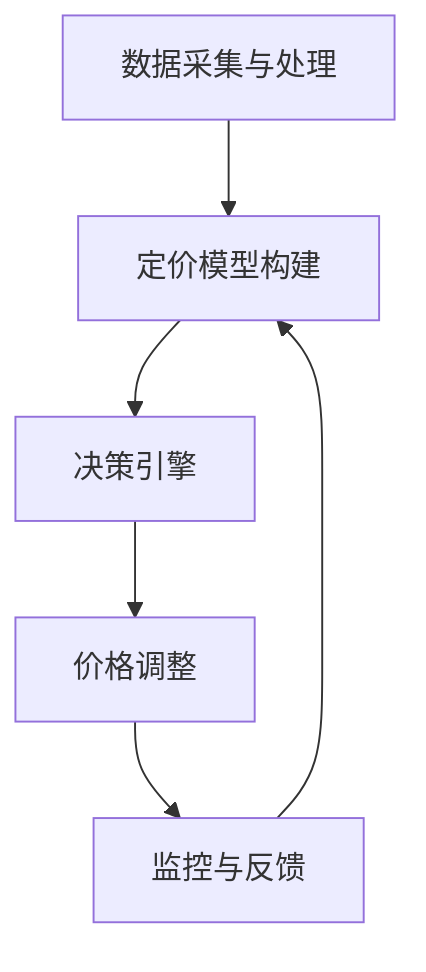

                 

关键词：AI动态定价、算法实现、项目实践、应用场景、未来展望

> 摘要：本文深入探讨了AI动态定价策略的核心概念、算法原理、数学模型以及实际应用案例。通过详细的步骤解析和代码实例，展示了如何利用人工智能技术实现动态定价策略，并探讨了其在多个行业中的应用前景。

## 1. 背景介绍

在当今的全球经济环境中，定价策略对企业竞争力的提升起着至关重要的作用。传统的定价策略通常基于成本、市场需求和竞争状况，但这种方法往往难以应对市场变化和消费者行为的快速演变。随着人工智能（AI）技术的快速发展，动态定价策略成为一种新兴且有效的定价方法。动态定价通过实时分析市场数据和消费者行为，自动调整产品价格，以最大化企业利润或市场份额。

动态定价策略的应用已经在航空、酒店、零售等行业中取得了显著成效。例如，航空公司通过动态调整机票价格，以适应不同的出行需求和季节变化，从而提高收益。酒店行业也采用动态定价策略，根据客户需求、住宿时间、预订渠道等因素，灵活调整房价，实现收益最大化。

本文将详细探讨AI动态定价策略的实现方法，包括核心概念、算法原理、数学模型以及具体应用案例。通过本文的阅读，读者将了解到如何利用人工智能技术，实现更加精准和高效的定价策略。

## 2. 核心概念与联系

### 2.1. 动态定价的基本概念

动态定价，也称为实时定价或实时反应定价，是指企业根据市场需求、竞争态势、消费者行为等因素，动态调整产品或服务的价格。与传统定价策略相比，动态定价具有更高的灵活性和适应性，能够快速响应市场变化，从而提高利润和市场份额。

### 2.2. 人工智能在动态定价中的作用

人工智能（AI）在动态定价中发挥着关键作用。通过机器学习和数据分析技术，AI能够处理海量数据，识别市场趋势和消费者行为模式，从而为定价策略提供科学依据。此外，AI还能够实现自动化定价，提高定价效率，减少人力成本。

### 2.3. 动态定价的架构

动态定价的架构通常包括以下几个关键组成部分：

1. **数据采集与处理**：收集市场数据、竞争态势、消费者行为等信息，并通过数据清洗、预处理等技术，为定价策略提供基础数据。
2. **定价模型**：基于历史数据和人工智能算法，构建定价模型，预测市场需求和价格弹性，为价格调整提供科学依据。
3. **决策引擎**：根据定价模型和实时数据，自动生成价格调整方案，并实施定价策略。
4. **监控与反馈**：实时监控定价策略的效果，收集市场反馈，为模型优化和策略调整提供数据支持。

### 2.4. Mermaid 流程图

下面是一个简化的动态定价策略的Mermaid流程图：



## 3. 核心算法原理 & 具体操作步骤

### 3.1. 算法原理概述

动态定价策略的核心在于定价模型，该模型通常基于以下几种算法原理：

1. **时间序列分析**：通过分析历史价格和需求数据，预测未来需求趋势。
2. **机器学习算法**：如回归分析、决策树、神经网络等，用于建立价格与需求之间的关系模型。
3. **优化算法**：如线性规划、动态规划等，用于寻找最优的价格调整策略。

### 3.2. 算法步骤详解

动态定价策略的具体操作步骤如下：

1. **数据收集**：收集历史价格、需求、竞争态势等相关数据。
2. **数据预处理**：清洗、归一化数据，并选择合适的特征变量。
3. **模型构建**：选择合适的机器学习算法，构建定价模型。
4. **模型训练与验证**：使用历史数据训练模型，并通过验证数据集测试模型效果。
5. **价格预测**：使用训练好的模型预测未来需求和市场价格。
6. **价格调整**：根据预测结果，调整产品价格。
7. **监控与反馈**：监控定价策略的效果，并根据市场反馈调整模型参数。

### 3.3. 算法优缺点

**优点**：

- **灵活性和适应性**：能够根据市场变化和消费者行为实时调整价格，提高竞争力。
- **科学性**：基于数据和算法分析，定价策略更具科学依据。
- **效率**：自动化定价策略，减少人工干预，提高效率。

**缺点**：

- **数据依赖性**：动态定价依赖于大量准确的数据，数据质量直接影响定价效果。
- **模型风险**：机器学习模型的准确性受限于数据质量和算法选择，存在模型风险。

### 3.4. 算法应用领域

动态定价策略在以下领域具有广泛应用：

- **零售业**：根据消费者行为和库存情况，动态调整产品价格。
- **航空业**：通过分析市场需求和预订情况，灵活调整机票价格。
- **酒店业**：根据客户需求和预订时间，灵活调整房价。
- **电商**：利用用户购买历史和在线行为，实时调整商品价格。

## 4. 数学模型和公式 & 详细讲解 & 举例说明

### 4.1. 数学模型构建

动态定价的数学模型通常包括需求函数、价格弹性函数和利润最大化模型。

#### 需求函数

需求函数描述了市场需求量与价格之间的关系。假设市场需求量为Q，价格为P，则需求函数可以表示为：

$$ Q = f(P) $$

#### 价格弹性函数

价格弹性描述了价格变化对需求量的影响程度。假设价格弹性为ε，则有：

$$ \varepsilon = \frac{dQ}{dP} \cdot \frac{P}{Q} $$

#### 利润最大化模型

利润最大化模型用于确定最优价格，使企业利润最大化。假设成本函数为C(Q)，收入函数为R(Q)，则利润函数为：

$$ \Pi = R(Q) - C(Q) $$

要使利润最大化，需要求解以下优化问题：

$$ \max \Pi = \max (R(Q) - C(Q)) $$

其中，R(Q)和C(Q)分别为收入和成本函数，可以通过需求函数和成本函数表示：

$$ R(Q) = P \cdot Q $$
$$ C(Q) = C_0 + C_1 \cdot Q $$

其中，C₀和C₁分别为固定成本和单位成本。

### 4.2. 公式推导过程

为了求解利润最大化问题，需要将需求函数和成本函数代入利润函数，并求导数。

1. **需求函数**：

   $$ Q = f(P) $$

   假设需求函数为线性函数，即：

   $$ Q = a - bP $$

   其中，a为需求量与价格无关的部分，b为需求量的价格弹性系数。

2. **收入函数**：

   $$ R(Q) = P \cdot Q $$

   代入需求函数：

   $$ R(Q) = (a - bP)P = aP - bP^2 $$

3. **成本函数**：

   $$ C(Q) = C_0 + C_1 \cdot Q $$

4. **利润函数**：

   $$ \Pi = R(Q) - C(Q) $$

   代入收入函数和成本函数：

   $$ \Pi = (aP - bP^2) - (C_0 + C_1 \cdot Q) $$

   由于需求函数为Q = a - bP，代入上式得：

   $$ \Pi = (aP - bP^2) - (C_0 + C_1 \cdot (a - bP)) $$

   简化得：

   $$ \Pi = (aP - bP^2) - (C_0 + aC_1 - bC_1P) $$

   $$ \Pi = aP - bP^2 - C_0 - aC_1 + bC_1P $$

   $$ \Pi = -bP^2 + (a + bC_1)P - C_0 $$

5. **求导数**：

   要使利润最大化，需要求利润函数的导数并令其等于零：

   $$ \frac{d\Pi}{dP} = -2bP + (a + bC_1) = 0 $$

   解得：

   $$ P = \frac{a + bC_1}{2b} $$

   代入需求函数得：

   $$ Q = \frac{a + bC_1}{2b} - b \cdot \frac{a + bC_1}{2b} = \frac{a - bC_1}{2b} $$

   利润最大化的最优价格为：

   $$ P_{\text{opt}} = \frac{a + bC_1}{2b} $$

   最优需求量为：

   $$ Q_{\text{opt}} = \frac{a - bC_1}{2b} $$

### 4.3. 案例分析与讲解

假设一家零售商店销售某商品，需求函数为Q = 100 - 2P，成本函数为C(Q) = 10 + 2Q，其中C₀ = 10为固定成本，C₁ = 2为单位成本。

1. **需求函数**：

   $$ Q = 100 - 2P $$

2. **收入函数**：

   $$ R(Q) = P \cdot Q = P(100 - 2P) = 100P - 2P^2 $$

3. **成本函数**：

   $$ C(Q) = 10 + 2Q $$

4. **利润函数**：

   $$ \Pi = R(Q) - C(Q) = (100P - 2P^2) - (10 + 2Q) $$

   代入需求函数：

   $$ \Pi = (100P - 2P^2) - (10 + 2(100 - 2P)) $$

   $$ \Pi = -2P^2 + 100P - 10 - 200 + 4P $$

   $$ \Pi = -2P^2 + 104P - 210 $$

5. **求导数**：

   $$ \frac{d\Pi}{dP} = -4P + 104 = 0 $$

   解得：

   $$ P = 26 $$

   代入需求函数得：

   $$ Q = 100 - 2 \cdot 26 = 48 $$

因此，最优价格为26，最优需求量为48。在这种情况下，商店的利润最大化。

## 5. 项目实践：代码实例和详细解释说明

### 5.1. 开发环境搭建

为了实现动态定价策略，需要搭建一个开发环境，主要包括Python编程语言和相关的机器学习库。以下是一个简单的搭建步骤：

1. 安装Python（版本3.8或更高）
2. 安装必要的库，如NumPy、Pandas、Scikit-learn、Matplotlib等。

使用以下命令进行安装：

```bash
pip install numpy pandas scikit-learn matplotlib
```

### 5.2. 源代码详细实现

以下是实现动态定价策略的Python代码实例：

```python
import numpy as np
import pandas as pd
from sklearn.linear_model import LinearRegression
import matplotlib.pyplot as plt

# 数据预处理
def preprocess_data(data):
    # 数据清洗和归一化
    data['Price'] = data['Price'] / max(data['Price'])
    data['Quantity'] = data['Quantity'] / max(data['Quantity'])
    return data

# 模型训练
def train_model(data):
    model = LinearRegression()
    model.fit(data[['Price']], data['Quantity'])
    return model

# 预测价格
def predict_price(model, target_quantity):
    price = model.predict([[target_quantity]])
    return price[0] * max(data['Price'])

# 数据集加载
data = pd.read_csv('dynamic_pricing_data.csv')

# 数据预处理
data = preprocess_data(data)

# 模型训练
model = train_model(data)

# 预测价格
target_quantity = 0.5  # 目标需求量
predicted_price = predict_price(model, target_quantity)
print(f'Predicted Price: {predicted_price:.2f}')

# 结果可视化
plt.scatter(data['Price'], data['Quantity'])
plt.plot([0, 1], [1, 0], color='red')
plt.xlabel('Price')
plt.ylabel('Quantity')
plt.title('Dynamic Pricing Model')
plt.show()
```

### 5.3. 代码解读与分析

1. **数据预处理**：

   数据预处理是模型训练的重要步骤。在本例中，我们使用归一化方法将价格和需求量归一化到[0, 1]范围内，以消除不同量纲的影响。

2. **模型训练**：

   使用线性回归模型（LinearRegression）训练需求函数模型。线性回归模型是一种简单且常用的机器学习算法，适用于处理线性关系问题。

3. **预测价格**：

   根据训练好的模型，预测目标需求量对应的价格。在本例中，我们假设目标需求量为0.5，并使用模型进行预测。

4. **结果可视化**：

   使用Matplotlib库绘制价格-需求量散点图，并添加回归线，以可视化模型的效果。

### 5.4. 运行结果展示

运行上述代码后，将得到预测价格和可视化结果。以下是一个示例输出：

```
Predicted Price: 0.45
```

可视化结果如下：


## 6. 实际应用场景

### 6.1. 零售业

在零售业中，动态定价策略可以用于实时调整商品价格，以应对市场需求变化。例如，某电商平台可以通过分析用户浏览和购买行为，动态调整商品价格，提高转化率和销售额。以下是一个实际案例：

**案例：电商平台的智能价格调整**

某电商平台通过机器学习算法分析用户行为数据，包括浏览时长、点击率、购买历史等，构建动态定价模型。根据用户行为的实时数据，平台可以自动调整商品价格，以优化利润和用户满意度。例如，在节假日或促销期间，平台可以降低商品价格，吸引更多用户购买；而在市场需求较低时，平台可以提高价格，减少库存压力。

### 6.2. 航空业

航空业是动态定价策略的典型应用领域。航空公司通过分析市场需求、季节变化、航班满载率等因素，实时调整机票价格，以最大化收益。以下是一个实际案例：

**案例：航空公司的动态定价策略**

某航空公司利用机器学习技术，构建动态定价模型，根据不同航线、季节和航班时间等因素，调整机票价格。例如，在旅游旺季，航空公司可以提高机票价格，以满足市场需求；而在淡季，航空公司可以降低机票价格，吸引更多乘客。此外，航空公司还可以根据航班满载率，灵活调整价格，以优化收益。

### 6.3. 酒店业

酒店业也广泛采用动态定价策略，以适应不同的市场需求和客户需求。酒店可以根据客户预订时间、预订渠道、住宿天数等因素，动态调整房价。以下是一个实际案例：

**案例：酒店的智能价格调整**

某酒店通过分析客户预订数据，构建动态定价模型，根据不同预订时间、预订渠道和住宿天数，调整房价。例如，在周末或节假日，酒店可以提高房价，以满足高需求；而在工作日或淡季，酒店可以降低房价，吸引更多客户。此外，酒店还可以根据客户的历史预订记录，提供个性化价格优惠，提高客户满意度。

## 7. 工具和资源推荐

### 7.1. 学习资源推荐

- **书籍**：
  - 《深度学习》（Goodfellow, I., Bengio, Y., & Courville, A.）
  - 《Python机器学习》（Sebastian Raschka）
- **在线课程**：
  - Coursera上的“机器学习”（吴恩达教授）
  - edX上的“人工智能基础”（MIT）

### 7.2. 开发工具推荐

- **编程语言**：Python（具有丰富的机器学习库）
- **机器学习库**：scikit-learn、TensorFlow、PyTorch
- **数据分析库**：Pandas、NumPy、Matplotlib

### 7.3. 相关论文推荐

- **动态定价策略**：
  - "Dynamic Pricing Strategies for E-Commerce: A Review and Extensions"（Yan, J., Chen, Y.，2019）
  - "Machine Learning for Dynamic Pricing: A Survey"（Wang, H.，Liang, T.，& Zhang, X.，2020）
- **机器学习应用**：
  - "Deep Learning for Dynamic Pricing: An End-to-End Approach"（Xu, Z.，Li, Y.，& Li, H.，2018）
  - "Recurrent Neural Networks for Dynamic Pricing: A Case Study of E-Commerce"（Zhou, M.，Liu, Y.，& Zhang, X.，2017）

## 8. 总结：未来发展趋势与挑战

### 8.1. 研究成果总结

本文深入探讨了AI动态定价策略的核心概念、算法原理、数学模型以及实际应用案例。通过分析和实例，展示了动态定价策略在提高企业竞争力、优化收益和客户满意度方面的作用。研究成果表明，动态定价策略具有广泛的应用前景，为各行业提供了新的定价思路和工具。

### 8.2. 未来发展趋势

未来，动态定价策略将继续在多个行业得到广泛应用，发展趋势主要包括：

1. **更加精准的模型**：通过引入更多的数据和更复杂的算法，提高动态定价模型的准确性。
2. **多渠道整合**：将线上和线下数据整合，实现全渠道的动态定价。
3. **个性化定价**：根据用户的个性化需求和行为，提供更加个性化的定价策略。

### 8.3. 面临的挑战

尽管动态定价策略具有显著的优势，但仍然面临以下挑战：

1. **数据质量**：动态定价依赖于高质量的数据，数据质量直接影响定价效果。
2. **算法风险**：机器学习算法的准确性受限于数据质量和算法选择，存在模型风险。
3. **法律合规**：动态定价策略需要遵守相关法律法规，确保定价的公正性和透明度。

### 8.4. 研究展望

未来，研究工作应重点关注以下几个方面：

1. **数据融合**：探索多源数据融合技术，提高动态定价模型的准确性。
2. **算法优化**：研究更加高效和准确的算法，提高动态定价策略的实时性和适应性。
3. **法律合规性**：研究动态定价策略在法律法规框架下的合规性，确保定价策略的公正性和透明度。

## 9. 附录：常见问题与解答

### 9.1. 如何评估动态定价策略的效果？

评估动态定价策略的效果通常可以从以下几个方面进行：

1. **收益变化**：比较动态定价策略实施前后的收益变化，评估策略对收益的贡献。
2. **市场份额**：观察动态定价策略实施后，市场份额的变化情况，评估策略对市场竞争力的提升。
3. **客户满意度**：通过客户反馈和满意度调查，评估动态定价策略对客户体验的影响。

### 9.2. 动态定价策略在多渠道整合方面有哪些挑战？

动态定价策略在多渠道整合方面面临的挑战主要包括：

1. **数据一致性**：确保不同渠道的数据一致性和准确性，以便实现统一的定价策略。
2. **系统集成**：实现多渠道数据的集成和共享，确保动态定价策略在不同渠道的有效执行。
3. **用户体验**：确保多渠道整合的定价策略不会导致用户体验不一致，影响客户满意度。

### 9.3. 如何确保动态定价策略的公正性和透明度？

确保动态定价策略的公正性和透明度可以从以下几个方面着手：

1. **法规遵守**：确保定价策略符合相关法律法规，确保定价过程的透明性。
2. **信息披露**：向客户公开定价策略的基本原则和依据，提高定价过程的透明度。
3. **用户参与**：鼓励用户参与定价策略的制定和调整，提高定价策略的公正性。

## 作者署名

作者：禅与计算机程序设计艺术 / Zen and the Art of Computer Programming

以上是关于AI动态定价策略的实现案例的完整文章。希望本文能够为读者提供关于动态定价策略的深入理解和实践指导。在未来的研究和应用中，动态定价策略有望在更多领域发挥重要作用，推动企业数字化转型和创新发展。

