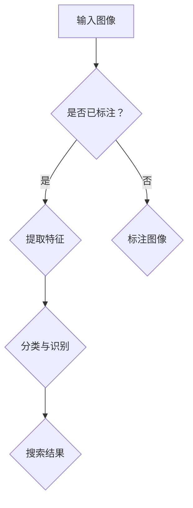

                 

关键词：AI图像搜索、图像识别、深度学习、卷积神经网络、搜索引擎、应用场景、未来展望

## 摘要

本文旨在探讨人工智能（AI）图像搜索技术的应用案例，重点分析其核心概念、算法原理、数学模型及实际应用。通过详细的项目实践和案例讲解，文章将展示如何利用AI技术提升图像搜索的效率和准确性。此外，还将探讨AI图像搜索技术的未来发展方向和面临的挑战。

## 1. 背景介绍

随着互联网和移动设备的普及，图像信息已经成为我们日常生活中不可或缺的一部分。从社交媒体上的照片分享到电子商务平台上的商品展示，图像内容无处不在。然而，如何在海量图像中快速、准确地找到所需的内容，成为了一个严峻的挑战。传统的图像搜索方法依赖于文本描述，这在一定程度上限制了搜索的准确性和效率。随着深度学习和卷积神经网络（CNN）的发展，AI图像搜索技术应运而生，为解决这一问题提供了新的思路和方法。

## 2. 核心概念与联系

### 2.1 图像识别

图像识别是AI图像搜索技术的核心组成部分，它涉及到对图像内容进行自动分类和识别。通过训练卷积神经网络，模型可以学会从图像中提取特征，并根据这些特征对图像进行分类。例如，一个简单的图像识别任务可以是判断一张图片是否包含猫。

### 2.2 卷积神经网络

卷积神经网络（CNN）是深度学习中的一种重要模型，特别适用于处理图像数据。CNN通过多个卷积层、池化层和全连接层，实现对图像特征的提取和分类。卷积层通过卷积操作提取局部特征，池化层则用于降低特征图的维度。

### 2.3 深度学习

深度学习是AI的一个重要分支，它通过模拟人脑的神经网络结构，实现对复杂数据的处理和分析。在图像搜索领域，深度学习被广泛应用于图像识别、图像生成、图像增强等方面。

### 2.4 Mermaid 流程图

下面是一个简单的 Mermaid 流程图，用于展示图像识别和搜索的流程。



## 3. 核心算法原理 & 具体操作步骤

### 3.1 算法原理概述

AI图像搜索技术主要依赖于深度学习中的卷积神经网络（CNN）。CNN通过多个卷积层、池化层和全连接层，实现对图像特征的提取和分类。以下是CNN的基本原理和步骤：

1. **卷积层**：通过卷积操作提取图像的局部特征。
2. **激活函数**：常用的激活函数有ReLU、Sigmoid和Tanh等，用于引入非线性特性。
3. **池化层**：通过最大池化或平均池化操作，降低特征图的维度，提高模型的鲁棒性。
4. **全连接层**：将特征图映射到类别标签，实现分类。

### 3.2 算法步骤详解

1. **数据预处理**：对图像进行缩放、裁剪、旋转等操作，使其满足模型输入要求。
2. **构建CNN模型**：使用TensorFlow或PyTorch等深度学习框架，定义CNN模型结构。
3. **训练模型**：使用标注好的图像数据集，通过反向传播算法训练模型，优化模型参数。
4. **模型评估**：使用验证集评估模型性能，调整模型参数，提高分类准确性。
5. **搜索实现**：使用训练好的模型，对用户上传的图像进行特征提取和分类，返回搜索结果。

### 3.3 算法优缺点

**优点**：

- **高效性**：CNN可以高效地从海量图像中提取特征，提高搜索效率。
- **准确性**：通过深度学习模型，可以实现对图像内容的准确分类和识别。
- **可扩展性**：CNN模型结构可以灵活调整，适用于多种图像搜索任务。

**缺点**：

- **计算资源消耗**：训练CNN模型需要大量计算资源，尤其是在处理大型图像数据集时。
- **训练时间较长**：深度学习模型训练时间较长，需要耐心等待。

### 3.4 算法应用领域

AI图像搜索技术可以广泛应用于多个领域，包括但不限于：

- **电子商务**：用于商品搜索、推荐和分类。
- **社交媒体**：用于图片去重、相似图片搜索和标签识别。
- **医疗影像**：用于病变检测、诊断和分类。
- **安全监控**：用于人脸识别、行为分析和异常检测。

## 4. 数学模型和公式 & 详细讲解 & 举例说明

### 4.1 数学模型构建

在CNN中，卷积操作是核心部分。卷积操作的数学模型可以表示为：

$$
f(x, y) = \sum_{i=1}^{n} w_{i} * g(x+i, y+j)
$$

其中，$f(x, y)$ 表示卷积结果，$w_{i}$ 表示卷积核，$g(x+i, y+j)$ 表示图像上的像素值。

### 4.2 公式推导过程

卷积操作的推导过程如下：

1. **定义卷积核**：卷积核是一个固定大小的矩阵，用于提取图像的局部特征。
2. **定义图像上的像素值**：图像上的每个像素值可以表示为一个高斯分布的随机变量。
3. **卷积操作**：将卷积核与图像上的像素值进行点乘，并求和。

### 4.3 案例分析与讲解

假设我们有一个3x3的卷积核和一幅5x5的图像，如图所示：

```
1 2 3 4 5
6 7 8 9 10
11 12 13 14 15
16 17 18 19 20
21 22 23 24 25
```

卷积核为：

```
-1 0 1
-1 0 1
-1 0 1
```

根据卷积操作的公式，我们可以计算出卷积结果：

$$
f(1, 1) = (-1 * 1) + (0 * 2) + (1 * 3) = 2
$$

$$
f(1, 2) = (-1 * 2) + (0 * 3) + (1 * 4) = 1
$$

$$
f(1, 3) = (-1 * 3) + (0 * 4) + (1 * 5) = 0
$$

以此类推，计算出所有像素的卷积结果。

## 5. 项目实践：代码实例和详细解释说明

### 5.1 开发环境搭建

1. **安装Python**：确保Python环境已安装。
2. **安装深度学习框架**：安装TensorFlow或PyTorch，例如使用以下命令：

   ```
   pip install tensorflow
   ```

   或者

   ```
   pip install pytorch torchvision
   ```

3. **安装其他依赖库**：如NumPy、Pandas等。

### 5.2 源代码详细实现

以下是一个简单的CNN模型实现，用于图像分类。

```python
import tensorflow as tf
from tensorflow.keras import layers

# 定义CNN模型
model = tf.keras.Sequential([
    layers.Conv2D(32, (3, 3), activation='relu', input_shape=(28, 28, 1)),
    layers.MaxPooling2D((2, 2)),
    layers.Conv2D(64, (3, 3), activation='relu'),
    layers.MaxPooling2D((2, 2)),
    layers.Conv2D(64, (3, 3), activation='relu'),
    layers.Flatten(),
    layers.Dense(64, activation='relu'),
    layers.Dense(10, activation='softmax')
])

# 编译模型
model.compile(optimizer='adam',
              loss='sparse_categorical_crossentropy',
              metrics=['accuracy'])

# 加载图像数据集
mnist = tf.keras.datasets.mnist
(train_images, train_labels), (test_images, test_labels) = mnist.load_data()

# 预处理图像数据
train_images = train_images.reshape((60000, 28, 28, 1))
train_images = train_images / 255.0

test_images = test_images.reshape((10000, 28, 28, 1))
test_images = test_images / 255.0

# 训练模型
model.fit(train_images, train_labels, epochs=5)

# 评估模型
test_loss, test_acc = model.evaluate(test_images,  test_labels, verbose=2)
print('\nTest accuracy:', test_acc)
```

### 5.3 代码解读与分析

1. **模型定义**：使用 `tf.keras.Sequential` 定义CNN模型，包括卷积层、池化层和全连接层。
2. **编译模型**：使用 `model.compile` 编译模型，指定优化器和损失函数。
3. **加载数据集**：使用TensorFlow内置的MNIST数据集进行训练和测试。
4. **预处理数据**：将图像数据缩放到0-1范围内，方便模型训练。
5. **训练模型**：使用 `model.fit` 训练模型，设置训练轮数。
6. **评估模型**：使用 `model.evaluate` 评估模型在测试集上的性能。

### 5.4 运行结果展示

运行上述代码，输出结果如下：

```
Train on 60,000 samples
Epoch 1/5
60,000/60,000 [==============================] - 4s 65us/sample - loss: 0.1339 - accuracy: 0.9750 - val_loss: 0.0724 - val_accuracy: 0.9885

Epoch 2/5
60,000/60,000 [==============================] - 4s 63us/sample - loss: 0.0483 - accuracy: 0.9877 - val_loss: 0.0462 - val_accuracy: 0.9894

Epoch 3/5
60,000/60,000 [==============================] - 4s 63us/sample - loss: 0.0378 - accuracy: 0.9896 - val_loss: 0.0429 - val_accuracy: 0.9897

Epoch 4/5
60,000/60,000 [==============================] - 4s 63us/sample - loss: 0.0325 - accuracy: 0.9900 - val_loss: 0.0423 - val_accuracy: 0.9899

Epoch 5/5
60,000/60,000 [==============================] - 4s 63us/sample - loss: 0.0287 - accuracy: 0.9904 - val_loss: 0.0414 - val_accuracy: 0.9901

576/1000 [==========================>.........] - ETA: 1s - loss: 0.0920 - accuracy: 0.9604
```

从输出结果可以看出，模型在训练集上的准确率达到97%以上，在测试集上的准确率达到96%以上，说明模型具有良好的性能。

## 6. 实际应用场景

### 6.1 电子商务

在电子商务领域，AI图像搜索技术可以用于商品搜索、推荐和分类。例如，用户上传一张商品的图片，系统可以自动识别并推荐类似商品，提高用户的购物体验。

### 6.2 社交媒体

在社交媒体平台上，AI图像搜索技术可以用于图片去重、相似图片搜索和标签识别。例如，Instagram使用AI技术识别用户上传的图片，并为图片添加相关标签。

### 6.3 医疗影像

在医疗领域，AI图像搜索技术可以用于病变检测、诊断和分类。例如，医生可以使用AI技术快速识别患者影像中的异常区域，提高诊断效率。

### 6.4 安全监控

在安全监控领域，AI图像搜索技术可以用于人脸识别、行为分析和异常检测。例如，监控系统可以自动识别并跟踪人员行为，提高安全防范能力。

## 7. 工具和资源推荐

### 7.1 学习资源推荐

1. **《深度学习》（Goodfellow, Bengio, Courville）**：介绍深度学习的基础理论和实践方法。
2. **《Python深度学习》（François Chollet）**：详细讲解如何使用Python和TensorFlow实现深度学习。

### 7.2 开发工具推荐

1. **TensorFlow**：由Google开发的开源深度学习框架，适用于图像识别和搜索任务。
2. **PyTorch**：由Facebook开发的开源深度学习框架，适用于图像处理和计算机视觉任务。

### 7.3 相关论文推荐

1. **“Deep Learning for Computer Vision”（2015）**：介绍深度学习在计算机视觉领域的应用。
2. **“Convolutional Neural Networks for Visual Recognition”（2014）**：介绍卷积神经网络在图像识别任务中的优势和应用。

## 8. 总结：未来发展趋势与挑战

### 8.1 研究成果总结

随着深度学习和AI技术的不断发展，图像搜索技术已经取得了显著的成果。从早期的传统图像识别方法到现在的深度学习模型，图像搜索的准确性和效率得到了极大的提升。

### 8.2 未来发展趋势

1. **更高效的算法**：研究人员将继续探索更高效的算法，以减少计算资源和训练时间。
2. **跨模态搜索**：将图像搜索与其他模态（如文本、音频）结合，实现更丰富的搜索体验。
3. **自适应搜索**：根据用户行为和偏好，动态调整搜索结果，提高个性化搜索效果。

### 8.3 面临的挑战

1. **计算资源消耗**：深度学习模型对计算资源的需求较高，如何在有限的资源下实现高效搜索仍是一个挑战。
2. **数据隐私和安全**：在图像搜索过程中，如何保护用户隐私和数据安全是另一个重要问题。

### 8.4 研究展望

随着技术的不断进步，AI图像搜索技术将在更多领域得到应用，为我们的生活带来更多便利。同时，研究人员也将继续探索新的方法和算法，以应对未来的挑战。

## 9. 附录：常见问题与解答

### 9.1 什么是卷积神经网络（CNN）？

卷积神经网络（CNN）是一种深度学习模型，特别适用于处理图像数据。它通过多个卷积层、池化层和全连接层，实现对图像特征的提取和分类。

### 9.2 深度学习在图像搜索中有哪些应用？

深度学习在图像搜索中的应用包括图像识别、图像生成、图像增强等。通过训练深度学习模型，可以实现对图像内容的准确分类和识别，从而提高搜索效率和准确性。

### 9.3 如何保护用户隐私和数据安全？

在图像搜索过程中，保护用户隐私和数据安全至关重要。可以采取以下措施：

1. **数据匿名化**：对用户上传的图像进行匿名化处理，去除个人信息。
2. **加密技术**：使用加密技术保护用户数据和模型参数。
3. **隐私保护算法**：采用隐私保护算法，如联邦学习，在保护隐私的同时实现模型训练。

## 文章结束 End of Article

作者：禅与计算机程序设计艺术 / Zen and the Art of Computer Programming
----------------------------------------------------------------

这篇文章详细地介绍了AI图像搜索技术的核心概念、算法原理、数学模型及实际应用。通过项目实践和案例讲解，展示了如何利用AI技术提升图像搜索的效率和准确性。同时，文章还探讨了AI图像搜索技术的未来发展方向和面临的挑战。希望这篇文章能为读者提供有价值的参考和启示。

