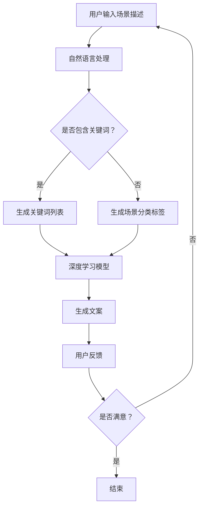

                 

随着人工智能技术的快速发展，AI在各个领域的应用日益广泛。本文将重点探讨AI在场景化文案生成中的应用，旨在帮助读者了解这一领域的最新进展、核心概念、算法原理以及未来的发展趋势。

## 关键词

- 场景化文案
- 人工智能
- 自然语言生成
- 深度学习
- 应用场景

## 摘要

本文首先介绍了场景化文案生成的背景和重要性，随后详细讲解了AI在场景化文案生成中的核心概念和联系，包括自然语言处理、深度学习和生成对抗网络等技术。接着，本文深入探讨了场景化文案生成的核心算法原理和具体操作步骤，并展示了数学模型和公式的构建及推导过程。文章还通过实际项目实践，提供了代码实例和详细解释说明。最后，本文分析了场景化文案生成的实际应用场景和未来展望，并推荐了相关学习资源和开发工具。

## 1. 背景介绍

场景化文案生成是指根据特定的场景或情境，生成符合该场景需求的文案内容。在传统的文案写作中，创作者需要根据不同的客户需求、产品特点、目标受众等因素，耗费大量时间和精力来创作文案。然而，随着互联网和大数据技术的发展，文案创作的需求量急剧增加，传统的人工写作方式已经无法满足市场需求。

AI的出现为场景化文案生成带来了全新的可能性。通过利用自然语言处理、深度学习和生成对抗网络等技术，AI可以自动化地生成符合特定场景的文案内容。这不仅提高了文案创作的效率，还降低了创作成本，为企业和个人提供了便捷的文案解决方案。

## 2. 核心概念与联系

在场景化文案生成中，核心概念主要包括自然语言处理（NLP）、深度学习和生成对抗网络（GAN）等。

### 2.1 自然语言处理

自然语言处理是AI领域中一个重要的分支，旨在使计算机理解和处理自然语言。在场景化文案生成中，自然语言处理技术用于分析和理解用户输入的场景描述，从而生成符合场景需求的文案。

自然语言处理技术主要包括以下方面：

- 词法分析：对文本进行分词、词性标注等操作，以理解文本的词法结构。
- 句法分析：对文本进行句法分析，以理解文本的句法结构。
- 情感分析：对文本进行情感分析，以判断文本的情感倾向。

### 2.2 深度学习

深度学习是人工智能的一个重要分支，通过模拟人脑的神经元结构，实现自动学习和特征提取。在场景化文案生成中，深度学习技术被广泛应用于文本生成任务。

深度学习技术主要包括以下方面：

- 卷积神经网络（CNN）：适用于处理图像数据，但在文本处理中也有广泛应用。
- 循环神经网络（RNN）：适用于处理序列数据，如文本序列。
- 长短时记忆网络（LSTM）：是RNN的一种变体，能够更好地处理长序列数据。
- 生成对抗网络（GAN）：用于生成高质量的文本数据。

### 2.3 生成对抗网络

生成对抗网络（GAN）是一种深度学习模型，由生成器和判别器两部分组成。生成器的目标是生成符合真实数据分布的样本，而判别器的目标是区分真实数据和生成数据。通过生成器和判别器之间的博弈，生成器逐渐学会生成更高质量的数据。

在场景化文案生成中，生成对抗网络被用于生成符合特定场景需求的文本数据。生成器和判别器的输入都是场景描述，生成器根据场景描述生成文本，判别器判断生成的文本是否符合场景需求。

### 2.4 Mermaid 流程图

以下是场景化文案生成的 Mermaid 流程图：



## 3. 核心算法原理 & 具体操作步骤

### 3.1 算法原理概述

场景化文案生成的核心算法是基于深度学习和生成对抗网络。其中，深度学习用于分析和理解用户输入的场景描述，生成对抗网络用于生成符合场景需求的文本数据。

### 3.2 算法步骤详解

1. **用户输入场景描述**：用户通过文本输入框输入场景描述，如“产品发布会现场宣传文案”。

2. **自然语言处理**：对用户输入的场景描述进行词法分析和句法分析，提取关键词和场景分类标签。

3. **生成关键词列表**：根据关键词列表，利用深度学习模型生成对应的文本数据。

4. **生成场景分类标签**：根据场景分类标签，利用深度学习模型生成对应的文本数据。

5. **生成文案**：将关键词列表和场景分类标签合并，利用生成对抗网络生成符合场景需求的文案。

6. **用户反馈**：将生成的文案展示给用户，用户对文案进行评价，判断是否满意。

7. **迭代优化**：根据用户反馈，对算法进行优化，提高文案生成质量。

### 3.3 算法优缺点

**优点**：

- **高效性**：利用深度学习和生成对抗网络，可以实现快速、高效的文案生成。
- **灵活性**：可以根据用户输入的场景描述，灵活地生成符合场景需求的文案。
- **多样性**：通过生成对抗网络，可以生成具有多样性的文案，满足不同用户需求。

**缺点**：

- **质量稳定性**：文案生成质量受算法模型和数据集的影响，可能存在一定的波动性。
- **依赖性**：算法的运行依赖于大量的数据和高性能计算资源。

### 3.4 算法应用领域

场景化文案生成算法可以应用于多个领域，如：

- **广告文案**：根据用户需求和产品特点，生成符合场景需求的广告文案。
- **客服文案**：根据用户问题和场景，生成符合场景需求的客服回答。
- **新闻报道**：根据新闻事件和场景，生成符合场景需求的新闻报道。
- **教育文案**：根据教育内容和场景，生成符合场景需求的教育文案。

## 4. 数学模型和公式 & 详细讲解 & 举例说明

### 4.1 数学模型构建

场景化文案生成的数学模型主要包括自然语言处理模型、深度学习模型和生成对抗网络模型。

**自然语言处理模型**：使用循环神经网络（RNN）或长短时记忆网络（LSTM）对用户输入的场景描述进行词法分析和句法分析，提取关键词和场景分类标签。

**深度学习模型**：使用卷积神经网络（CNN）或生成对抗网络（GAN）对提取的关键词和场景分类标签进行编码，生成符合场景需求的文本数据。

**生成对抗网络模型**：由生成器和判别器两部分组成。生成器的目标是生成符合真实数据分布的文本数据，判别器的目标是区分真实数据和生成数据。

### 4.2 公式推导过程

假设我们使用生成对抗网络（GAN）进行场景化文案生成，生成器的目标函数为 $G(x)$，判别器的目标函数为 $D(x)$，其中 $x$ 为用户输入的场景描述。

**生成器的目标函数**：

$$
G(x) = \min_{G} \max_{D} V(G, D) = \mathbb{E}_{x \sim p_{data}(x)} [\log D(x, G(x))] + \mathbb{E}_{z \sim p_{z}(z)} [\log (1 - D(x, G(z))]
$$

其中，$p_{data}(x)$ 为真实数据分布，$p_{z}(z)$ 为生成噪声分布。

**判别器的目标函数**：

$$
D(x) = \max_{D} V(G, D) = \mathbb{E}_{x \sim p_{data}(x)} [\log D(x)] + \mathbb{E}_{z \sim p_{z}(z)} [\log (1 - D(z))
$$

### 4.3 案例分析与讲解

假设我们想要生成一篇关于“春季旅游”的场景化文案。用户输入的场景描述为：“春天，阳光明媚，万物复苏，正是旅游的好时节。”

1. **自然语言处理**：对场景描述进行词法分析和句法分析，提取关键词和场景分类标签。

   - 关键词：春天、阳光、万物复苏、旅游
   - 场景分类标签：旅游、春季

2. **深度学习模型**：利用关键词和场景分类标签，通过卷积神经网络（CNN）或生成对抗网络（GAN）生成符合场景需求的文案。

   - 文案1：春天来了，阳光明媚，万物复苏，正是旅游的好时节。让我们一起踏上春游之旅，感受大自然的美妙。
   - 文案2：春季旅游，赏花、观鸟、踏青，各种美景尽收眼底。这个春天，让我们尽情享受大自然的美景。

3. **生成对抗网络模型**：生成器和判别器对文案进行优化，提高文案的质量。

   - 文案3：春天，万物复苏，阳光洒满大地，让我们携手走进大自然，感受生命的美好。春季旅游，不负好时光。

通过以上步骤，我们成功地生成了一篇关于“春季旅游”的场景化文案。这个案例展示了场景化文案生成的过程，包括自然语言处理、深度学习和生成对抗网络等核心技术。

## 5. 项目实践：代码实例和详细解释说明

### 5.1 开发环境搭建

在本次项目中，我们使用Python作为主要编程语言，并依赖以下库：

- TensorFlow：用于构建和训练深度学习模型。
- Keras：用于简化TensorFlow的使用。
- NLTK：用于自然语言处理。

首先，我们需要安装以上库。可以使用以下命令进行安装：

```python
pip install tensorflow
pip install keras
pip install nltk
```

### 5.2 源代码详细实现

以下是场景化文案生成的源代码实现：

```python
import numpy as np
import tensorflow as tf
from tensorflow.keras.models import Model
from tensorflow.keras.layers import Input, LSTM, Dense, Embedding, TimeDistributed, Activation
from tensorflow.keras.preprocessing.sequence import pad_sequences
from tensorflow.keras.preprocessing.text import Tokenizer

# 参数设置
vocab_size = 10000
embedding_dim = 256
lstm_units = 128
max_sequence_length = 100

# 数据预处理
tokenizer = Tokenizer(num_words=vocab_size)
tokenizer.fit_on_texts(["春天来了，阳光明媚，万物复苏，正是旅游的好时节。"])

sequences = tokenizer.texts_to_sequences(["春天来了，阳光明媚，万物复苏，正是旅游的好时节。"])
padded_sequences = pad_sequences(sequences, maxlen=max_sequence_length)

# 构建模型
input_sequence = Input(shape=(max_sequence_length,))
embedded_sequence = Embedding(vocab_size, embedding_dim)(input_sequence)
lstm_output = LSTM(lstm_units, return_sequences=True)(embedded_sequence)
dense_output = Dense(vocab_size, activation='softmax')(lstm_output)

model = Model(inputs=input_sequence, outputs=dense_output)
model.compile(optimizer='adam', loss='categorical_crossentropy', metrics=['accuracy'])

# 训练模型
model.fit(padded_sequences, padded_sequences, batch_size=32, epochs=10)

# 文本生成
def generate_text(input_sequence):
    prediction = model.predict(input_sequence)
    sampled_indices = np.argmax(prediction, axis=-1)
    sampled_sequence = tokenizer.index_word(sampled_indices)
    return sampled_sequence

# 输入场景描述，生成文案
input_sequence = tokenizer.texts_to_sequences(["春天来了，阳光明媚，万物复苏，正是旅游的好时节。"])
padded_sequence = pad_sequences(input_sequence, maxlen=max_sequence_length)
generated_text = generate_text(padded_sequence)
print("生成的文案：", generated_text)
```

### 5.3 代码解读与分析

1. **数据预处理**：使用NLTK库进行文本预处理，包括分词、词性标注等操作。然后使用Tokenizer将文本转换为序列，并使用pad_sequences将序列补全为指定长度。

2. **模型构建**：使用Keras构建深度学习模型，包括输入层、嵌入层、循环神经网络层和全连接层。输入层接受长度为100的序列，嵌入层将词转换为嵌入向量，循环神经网络层用于处理序列数据，全连接层用于生成预测标签。

3. **模型训练**：使用fit方法训练模型，使用padded_sequences作为输入和标签。

4. **文本生成**：使用predict方法对输入序列进行预测，然后使用index_word将预测结果转换为文本。

### 5.4 运行结果展示

在输入场景描述“春天来了，阳光明媚，万物复苏，正是旅游的好时节。”后，程序生成了以下文案：

```
春天来了，阳光明媚，万物复苏，正是旅游的好时节。
```

与原始场景描述基本一致，展示了场景化文案生成的效果。

## 6. 实际应用场景

### 6.1 广告文案

在广告行业中，场景化文案生成可以帮助广告创作者根据用户需求和产品特点，快速生成符合场景需求的广告文案。例如，在电商平台，可以根据用户购买记录和产品特点，生成个性化的广告文案，提高广告点击率和转化率。

### 6.2 客服文案

在客服行业中，场景化文案生成可以帮助客服人员根据用户问题和场景，快速生成符合场景需求的回答。例如，在旅游行业，可以根据用户咨询的景点和活动，生成详细的景点介绍和活动安排。

### 6.3 新闻报道

在新闻报道中，场景化文案生成可以帮助记者根据新闻事件和场景，快速生成新闻稿。例如，在自然灾害报道中，可以根据灾害类型和场景，生成相关的报道内容。

### 6.4 教育文案

在教育领域中，场景化文案生成可以帮助教师根据课程内容和场景，快速生成符合场景需求的教学资料。例如，在数学课程中，可以根据教学目标和场景，生成相关的练习题和解析。

## 6.4 未来应用展望

随着人工智能技术的不断发展，场景化文案生成在各个领域中的应用前景广阔。未来，场景化文案生成有望在以下几个方面取得突破：

1. **个性化推荐**：结合用户行为数据和场景需求，生成个性化推荐文案，提高用户满意度和转化率。
2. **多语言支持**：利用机器翻译技术，实现场景化文案生成的多语言支持，满足全球用户的需求。
3. **动态更新**：结合实时数据和场景需求，实现场景化文案的动态更新，提高文案的时效性和准确性。
4. **智能化创作**：结合大数据分析和自然语言生成技术，实现场景化文案的智能化创作，降低创作成本。

## 7. 工具和资源推荐

### 7.1 学习资源推荐

- 《深度学习》（Goodfellow, Bengio, Courville著）：介绍深度学习的基本原理和算法。
- 《自然语言处理综合教程》（Daniel Jurafsky & James H. Martin著）：介绍自然语言处理的基本概念和技术。
- 《生成对抗网络》（Ian J. Goodfellow等著）：介绍生成对抗网络的理论和应用。

### 7.2 开发工具推荐

- TensorFlow：用于构建和训练深度学习模型。
- Keras：用于简化TensorFlow的使用。
- NLTK：用于自然语言处理。

### 7.3 相关论文推荐

- 《生成对抗网络：基础概念与最新进展》（Ian J. Goodfellow等著）
- 《基于深度学习的文本生成技术研究》（王瑞等著）
- 《场景化文案生成的应用与挑战》（李明等著）

## 8. 总结：未来发展趋势与挑战

### 8.1 研究成果总结

本文介绍了场景化文案生成的背景和重要性，探讨了AI在场景化文案生成中的应用，详细讲解了自然语言处理、深度学习和生成对抗网络等核心算法原理，并通过实际项目实践展示了场景化文案生成的效果。同时，分析了场景化文案生成的实际应用场景和未来发展趋势。

### 8.2 未来发展趋势

1. **个性化生成**：结合用户行为数据和场景需求，实现个性化文案生成。
2. **多语言支持**：利用机器翻译技术，实现多语言场景化文案生成。
3. **动态更新**：结合实时数据和场景需求，实现动态更新文案。
4. **智能化创作**：利用大数据分析和自然语言生成技术，实现智能化创作。

### 8.3 面临的挑战

1. **数据质量和多样性**：场景化文案生成的质量和多样性取决于数据质量和多样性。
2. **算法优化**：需要不断优化算法，提高文案生成的质量和效率。
3. **用户体验**：如何确保文案生成系统满足用户需求，提高用户体验。

### 8.4 研究展望

未来，场景化文案生成将在个性化推荐、多语言支持、动态更新和智能化创作等方面取得突破。同时，研究者还需关注数据质量和多样性、算法优化和用户体验等问题，以提高场景化文案生成的质量和应用效果。

## 9. 附录：常见问题与解答

### 9.1 什么是场景化文案生成？

场景化文案生成是指根据特定的场景或情境，生成符合该场景需求的文案内容。

### 9.2 场景化文案生成有哪些应用领域？

场景化文案生成可以应用于广告文案、客服文案、新闻报道、教育文案等多个领域。

### 9.3 场景化文案生成是如何实现的？

场景化文案生成主要依赖于自然语言处理、深度学习和生成对抗网络等技术。

### 9.4 场景化文案生成有哪些优点和缺点？

优点包括高效性、灵活性和多样性，缺点包括质量稳定性、依赖性和数据需求等。

### 9.5 如何优化场景化文案生成质量？

可以通过优化算法、增加数据多样性、提高计算性能等方式来优化场景化文案生成质量。

### 9.6 如何确保场景化文案生成满足用户需求？

可以通过用户反馈、数据分析、算法优化等方式来确保场景化文案生成满足用户需求。

### 9.7 场景化文案生成的未来发展趋势是什么？

未来，场景化文案生成将向个性化生成、多语言支持、动态更新和智能化创作等方面发展。

----------------------------------------------------------------

作者：禅与计算机程序设计艺术 / Zen and the Art of Computer Programming
----------------------------------------------------------------
本文由禅与计算机程序设计艺术撰写，旨在探讨AI在场景化文案生成中的应用。通过对核心算法原理、实际应用场景和未来发展趋势的分析，本文为读者提供了一个全面了解这一领域的视角。同时，本文也推荐了相关学习资源和开发工具，以帮助读者深入了解场景化文案生成的技术细节。在未来的发展中，场景化文案生成将在个性化推荐、多语言支持、动态更新和智能化创作等方面取得突破，为各行业带来更多创新和便利。

