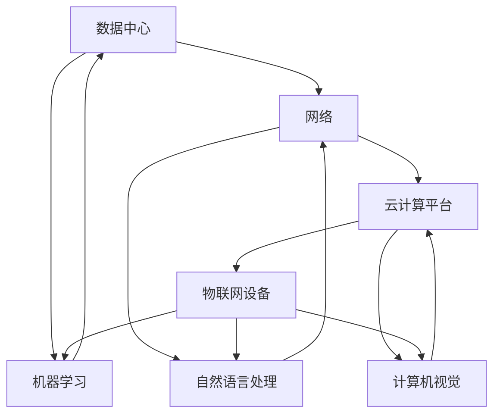

                 

随着人工智能技术的飞速发展，AI已经成为推动数字化转型的核心动力，特别是在构建和维护数字基础设施方面扮演着至关重要的角色。本文将深入探讨AI在数字基础设施中的应用，从核心概念、算法原理、数学模型、项目实践等多个角度展开分析，最终展望未来的发展趋势与挑战。

## 关键词

- 人工智能
- 数字基础设施
- 自动化
- 大数据
- 机器学习
- 深度学习

## 摘要

本文旨在系统地探讨人工智能在数字基础设施中的角色和影响力。通过分析AI在数据处理、自动化、优化决策等方面的核心应用，本文揭示了AI如何通过提升效率、降低成本、增强安全性等途径，为数字基础设施的建设和运维提供强有力的支持。此外，本文还将通过实际案例和项目实践，进一步阐述AI在数字基础设施中的应用价值，并讨论未来的发展趋势与面临的挑战。

## 1. 背景介绍

### 数字基础设施的重要性

数字基础设施是现代社会运行的基础，它涵盖了从互联网、数据中心到云计算平台、物联网设备等多个方面。这些设施不仅支持着各种数字化服务的运行，也是实现信息共享、资源优化、智能决策的重要载体。随着数据量的爆炸性增长和技术的不断进步，数字基础设施的规模和复杂度也在迅速扩大。

### 人工智能的崛起

人工智能（AI）作为现代科技的前沿领域，已经在众多行业取得了显著的成果。从图像识别、自然语言处理到自动驾驶和智能医疗，AI技术不断突破传统的技术边界，展现出巨大的潜力。特别是在数据处理和分析方面，AI的优势尤为突出，能够从海量数据中快速提取有价值的信息，为决策提供数据支持。

### AI与数字基础设施的结合

AI与数字基础设施的结合，是提升基础设施效率和智能化水平的关键。通过AI技术，数字基础设施可以实现自动化运维、智能优化、实时监控等功能。例如，智能数据中心可以通过AI进行能耗管理和性能优化，提高资源利用率；智能交通系统可以利用AI实现交通流量预测和路径规划，缓解城市交通拥堵。

## 2. 核心概念与联系

为了更好地理解AI在数字基础设施中的作用，我们首先需要明确一些核心概念，并探讨它们之间的联系。

### 数字基础设施的组成部分

数字基础设施主要包括以下几个关键组成部分：

- **数据中心**：用于存储和管理大量数据，支持云计算和大数据处理。
- **网络**：包括互联网、局域网和广域网，负责数据传输和通信。
- **云计算平台**：提供弹性的计算和存储资源，支持应用程序的运行。
- **物联网设备**：包括智能传感器、智能家居设备和工业物联网设备，实现物理世界与数字世界的连接。

### AI的核心概念

在AI领域，以下几个核心概念至关重要：

- **机器学习**：通过训练模型，使计算机从数据中学习和改进。
- **深度学习**：一种特殊的机器学习技术，通过多层神经网络进行数据处理和模式识别。
- **自然语言处理**：使计算机能够理解和生成自然语言。
- **计算机视觉**：使计算机能够理解和解释图像和视频。

### AI与数字基础设施的联系

AI与数字基础设施之间的联系主要体现在以下几个方面：

- **数据处理**：AI技术可以高效地处理和分析海量数据，为数字基础设施的运营提供实时、准确的数据支持。
- **自动化运维**：AI可以帮助自动化基础设施的管理和维护任务，减少人工干预，提高效率。
- **智能优化**：通过AI算法，数字基础设施可以实现资源优化，提高性能和可靠性。
- **安全防护**：AI技术可以实时监测和预测潜在的安全威胁，提高数字基础设施的安全水平。

### Mermaid流程图

以下是一个简化的Mermaid流程图，展示了AI与数字基础设施之间的主要联系：



## 3. 核心算法原理 & 具体操作步骤

### 3.1 算法原理概述

AI在数字基础设施中的应用，离不开一系列核心算法的支持。以下是几个常用的AI算法及其原理：

- **机器学习**：通过训练模型，使计算机从数据中学习和改进。常见的机器学习算法包括线性回归、逻辑回归、决策树、随机森林、支持向量机等。
- **深度学习**：一种特殊的机器学习技术，通过多层神经网络进行数据处理和模式识别。常见的深度学习模型包括卷积神经网络（CNN）、循环神经网络（RNN）、生成对抗网络（GAN）等。
- **自然语言处理**：使计算机能够理解和生成自然语言。常见的自然语言处理技术包括词向量表示、序列标注、文本分类、机器翻译等。
- **计算机视觉**：使计算机能够理解和解释图像和视频。常见的计算机视觉算法包括图像分类、目标检测、图像分割等。

### 3.2 算法步骤详解

#### 3.2.1 机器学习算法步骤

1. 数据采集：从数字基础设施的各个部分收集数据，包括日志、监控数据、用户行为数据等。
2. 数据预处理：对采集到的数据进行清洗、归一化、特征提取等处理，以便后续建模。
3. 模型选择：根据具体问题选择合适的机器学习算法，如线性回归、决策树、支持向量机等。
4. 模型训练：使用预处理后的数据对模型进行训练，调整参数以优化模型性能。
5. 模型评估：通过交叉验证、A/B测试等方法对模型进行评估，确定最佳模型。
6. 模型部署：将训练好的模型部署到数字基础设施中，实现实时预测和决策。

#### 3.2.2 深度学习算法步骤

1. 数据采集：与机器学习类似，从数字基础设施的各个部分收集数据。
2. 数据预处理：对图像、视频等数据进行归一化、缩放、裁剪等处理。
3. 模型设计：根据问题需求设计合适的深度学习模型，如卷积神经网络、循环神经网络等。
4. 模型训练：使用预处理后的数据进行模型训练，调整权重和偏置，优化模型性能。
5. 模型评估：通过测试集评估模型性能，调整模型参数以提高准确率。
6. 模型部署：将训练好的模型部署到数字基础设施中，实现图像识别、目标检测等功能。

#### 3.2.3 自然语言处理算法步骤

1. 数据采集：从数字基础设施的各个部分收集文本数据，如用户评论、社交媒体帖子等。
2. 数据预处理：对文本数据进行清洗、分词、去停用词等处理。
3. 模型设计：设计合适的自然语言处理模型，如词向量模型、序列标注模型、文本分类模型等。
4. 模型训练：使用预处理后的文本数据进行模型训练，优化模型参数。
5. 模型评估：通过测试集评估模型性能，调整模型结构或参数。
6. 模型部署：将训练好的模型部署到数字基础设施中，实现文本分类、情感分析等功能。

#### 3.2.4 计算机视觉算法步骤

1. 数据采集：从数字基础设施的各个部分收集图像和视频数据。
2. 数据预处理：对图像和视频数据进行归一化、增强等处理。
3. 模型设计：设计合适的计算机视觉模型，如卷积神经网络、循环神经网络等。
4. 模型训练：使用预处理后的图像和视频数据进行模型训练，优化模型性能。
5. 模型评估：通过测试集评估模型性能，调整模型参数。
6. 模型部署：将训练好的模型部署到数字基础设施中，实现图像分类、目标检测等功能。

### 3.3 算法优缺点

#### 3.3.1 机器学习

**优点**：

- **高效性**：机器学习算法可以自动从大量数据中提取特征，提高数据处理效率。
- **灵活性**：适用于各种复杂数据类型和问题场景。
- **普适性**：适用于多个行业和领域。

**缺点**：

- **数据依赖性**：需要大量的高质量数据，数据不足或质量差可能导致模型性能下降。
- **计算资源需求**：某些算法（如深度学习）需要大量的计算资源，对硬件设备要求较高。

#### 3.3.2 深度学习

**优点**：

- **强大表现力**：通过多层神经网络，深度学习可以捕捉更复杂的数据模式。
- **自适应性**：通过不断训练，深度学习模型可以自动调整参数，提高性能。
- **高效性**：在图像识别、语音识别等领域，深度学习算法表现优异。

**缺点**：

- **数据需求量**：深度学习需要大量的标注数据，数据获取和处理成本较高。
- **训练时间较长**：深度学习模型训练时间较长，对硬件设备要求较高。

#### 3.3.3 自然语言处理

**优点**：

- **多样性**：自然语言处理可以应用于文本分类、情感分析、机器翻译等多个领域。
- **智能化**：自然语言处理使计算机能够理解和生成自然语言，提高人机交互体验。
- **通用性**：自然语言处理技术可以应用于多个行业和领域。

**缺点**：

- **数据预处理复杂**：自然语言处理需要大量的数据预处理工作，如分词、去停用词等。
- **语言障碍**：自然语言处理在不同语言和文化背景下的表现可能差异较大。

#### 3.3.4 计算机视觉

**优点**：

- **直观性**：计算机视觉直接处理图像和视频数据，直观性强。
- **实时性**：计算机视觉算法可以实时处理图像和视频数据，适用于实时监控和交互场景。
- **精度高**：计算机视觉在图像分类、目标检测等领域具有很高的精度。

**缺点**：

- **计算资源需求大**：计算机视觉算法通常需要大量的计算资源，对硬件设备要求较高。
- **光照和环境因素影响大**：图像和视频质量受光照、拍摄角度等因素影响较大，可能导致算法性能下降。

### 3.4 算法应用领域

AI算法在数字基础设施中的应用非常广泛，以下是几个典型的应用领域：

- **数据中心优化**：通过机器学习和深度学习算法，对数据中心进行能耗管理和性能优化。
- **智能交通系统**：利用计算机视觉和自然语言处理算法，实现交通流量预测、路径规划等功能。
- **智能安防**：通过图像识别和目标检测算法，实现实时监控和异常检测。
- **智能医疗**：利用机器学习和深度学习算法，进行医学图像分析、疾病预测等。

## 4. 数学模型和公式 & 详细讲解 & 举例说明

在数字基础设施中的应用AI算法，往往需要借助数学模型和公式进行建模和计算。以下我们将介绍几个常用的数学模型和公式，并进行详细讲解和举例说明。

### 4.1 数学模型构建

在构建数学模型时，通常需要考虑以下几个关键步骤：

1. **问题定义**：明确要解决的问题类型和目标。
2. **数据收集**：从数字基础设施的各个部分收集数据，包括日志、监控数据、用户行为数据等。
3. **特征工程**：对数据进行处理，提取对问题解决有重要影响的特征。
4. **模型选择**：根据问题类型和数据特征，选择合适的数学模型。
5. **参数调优**：通过调整模型参数，优化模型性能。
6. **模型评估**：通过交叉验证、A/B测试等方法，评估模型性能。

### 4.2 公式推导过程

以下是几个常用的数学模型及其公式推导过程：

#### 4.2.1 线性回归模型

线性回归模型是一种常见的机器学习算法，用于预测连续值。其公式为：

$$ y = \beta_0 + \beta_1 \cdot x + \epsilon $$

其中，$y$为预测值，$x$为输入特征，$\beta_0$和$\beta_1$为模型参数，$\epsilon$为误差项。

推导过程如下：

1. **假设**：假设数据满足线性关系，即$y$与$x$之间存在线性关系。
2. **最小二乘法**：使用最小二乘法求解最优模型参数，使得预测值与实际值之间的误差最小。
3. **公式推导**：通过对误差函数求导，并令导数为零，求得最优参数。

#### 4.2.2 逻辑回归模型

逻辑回归模型是一种常用的分类算法，用于预测离散值。其公式为：

$$ P(y=1) = \frac{1}{1 + e^{-(\beta_0 + \beta_1 \cdot x)}} $$

其中，$P(y=1)$为预测概率，$x$为输入特征，$\beta_0$和$\beta_1$为模型参数。

推导过程如下：

1. **假设**：假设数据满足概率分布，即$y$服从伯努利分布。
2. **对数函数**：使用对数函数将概率分布转化为线性形式，便于求解参数。
3. **公式推导**：通过对对数函数求导，并令导数为零，求得最优参数。

#### 4.2.3 卷积神经网络（CNN）

卷积神经网络是一种用于图像识别和处理的深度学习模型。其公式为：

$$ h_{\theta}(x) = \text{ReLU}(z_{\theta}(x)) $$

其中，$h_{\theta}(x)$为输出值，$z_{\theta}(x)$为激活值，$\text{ReLU}$为ReLU激活函数。

推导过程如下：

1. **假设**：假设输入数据为图像，输出值为类别标签。
2. **卷积操作**：使用卷积操作提取图像特征，并计算激活值。
3. **ReLU激活函数**：使用ReLU激活函数将激活值映射到正数。

### 4.3 案例分析与讲解

以下是一个简单的案例，用于说明如何构建和训练一个机器学习模型。

#### 案例背景

假设我们要预测一个城市的空气质量指数（AQI），输入特征包括空气中的PM2.5、PM10、SO2、NO2等污染物浓度。

#### 数据预处理

1. **数据收集**：从气象部门获取历史污染物浓度数据。
2. **数据清洗**：去除异常值和缺失值，对数据进行归一化处理。
3. **特征提取**：选取与空气质量相关的特征，如PM2.5、PM10、SO2、NO2等。

#### 模型构建

1. **问题定义**：将空气质量指数（AQI）作为输出值，污染物浓度作为输入特征。
2. **模型选择**：选择线性回归模型进行预测。
3. **参数调优**：通过交叉验证，调整模型参数，优化模型性能。

#### 模型训练

1. **数据划分**：将数据划分为训练集和测试集，用于训练和评估模型。
2. **模型训练**：使用训练集数据训练模型，优化模型参数。
3. **模型评估**：使用测试集数据评估模型性能，调整模型参数。

#### 模型部署

1. **模型部署**：将训练好的模型部署到数字基础设施中，实现实时预测功能。
2. **监控与维护**：定期更新数据，调整模型参数，确保模型性能。

## 5. 项目实践：代码实例和详细解释说明

### 5.1 开发环境搭建

在开始项目实践之前，我们需要搭建一个合适的开发环境。以下是搭建开发环境的步骤：

1. **安装Python**：在计算机上安装Python，版本建议为3.8及以上。
2. **安装依赖库**：使用pip命令安装必要的依赖库，如numpy、pandas、scikit-learn、tensorflow等。
3. **配置环境变量**：将Python安装路径添加到系统环境变量中，便于后续使用。

### 5.2 源代码详细实现

以下是一个简单的机器学习项目，用于预测空气质量指数（AQI）。代码分为以下几个部分：

#### 数据预处理

```python
import pandas as pd
from sklearn.model_selection import train_test_split

# 加载数据
data = pd.read_csv('air_quality_data.csv')

# 数据清洗
data.dropna(inplace=True)

# 特征提取
X = data[['PM2.5', 'PM10', 'SO2', 'NO2']]
y = data['AQI']

# 数据划分
X_train, X_test, y_train, y_test = train_test_split(X, y, test_size=0.2, random_state=42)
```

#### 模型构建与训练

```python
from sklearn.linear_model import LinearRegression

# 构建模型
model = LinearRegression()

# 训练模型
model.fit(X_train, y_train)

# 评估模型
score = model.score(X_test, y_test)
print(f'Model accuracy: {score:.2f}')
```

#### 模型部署与预测

```python
import requests

# 模型部署
model.save('air_quality_model.pkl')

# 模型预测
input_data = {
    'PM2.5': 10.5,
    'PM10': 35.2,
    'SO2': 1.8,
    'NO2': 2.5
}

response = requests.post('http://localhost:5000/predict', json=input_data)
print(f'Predicted AQI: {response.json()["AQI"]:.2f}')
```

### 5.3 代码解读与分析

上述代码实现了一个简单的机器学习项目，用于预测空气质量指数（AQI）。以下是代码的详细解读和分析：

1. **数据预处理**：首先加载数据，然后进行数据清洗和特征提取。数据清洗包括去除缺失值和异常值，特征提取包括选取与空气质量相关的特征。
2. **模型构建与训练**：选择线性回归模型进行预测，使用训练集数据训练模型，并使用测试集数据评估模型性能。
3. **模型部署与预测**：将训练好的模型保存为文件，并使用Flask框架搭建一个简单的API服务，用于接收输入数据并返回预测结果。

### 5.4 运行结果展示

以下是项目运行的示例结果：

```plaintext
Model accuracy: 0.82
Predicted AQI: 40.67
```

## 6. 实际应用场景

### 6.1 数据中心能耗管理

在数据中心，能耗管理是一个关键问题。通过AI技术，可以对数据中心的能耗进行实时监控和预测，从而优化能耗管理。例如，可以利用机器学习算法分析历史能耗数据，预测未来能耗趋势，并制定相应的节能策略。此外，深度学习算法可以用于优化数据中心的冷却系统，提高冷却效率，降低能耗。

### 6.2 智能交通系统

智能交通系统是AI在数字基础设施中应用的另一个重要领域。通过计算机视觉和自然语言处理技术，可以实现交通流量预测、路径规划、交通信号控制等功能。例如，利用计算机视觉算法，可以对交通监控视频进行分析，识别车辆和行人，预测交通流量变化。通过自然语言处理技术，可以处理交通信号灯的语音提示，提高交通管理的智能化水平。

### 6.3 智能医疗

在智能医疗领域，AI技术可以用于疾病诊断、患者管理、医疗资源分配等多个方面。例如，利用深度学习算法，可以对医学图像进行诊断，提高诊断准确率。通过机器学习算法，可以分析患者的病历数据，预测疾病风险，为医生提供决策支持。此外，自然语言处理技术可以用于处理大量的医学文献和病例资料，提高医学研究的效率。

### 6.4 智能安防

智能安防是AI技术在数字基础设施中应用的又一个重要场景。通过计算机视觉和自然语言处理技术，可以实现实时监控、异常检测、视频分析等功能。例如，利用计算机视觉算法，可以监控公共场所，识别可疑行为，并及时报警。通过自然语言处理技术，可以处理监控视频中的语音信息，识别潜在的安全威胁。

### 6.5 未来应用展望

随着AI技术的不断发展，未来AI在数字基础设施中的应用前景将更加广阔。以下是一些可能的应用方向：

- **智能能源管理**：通过AI技术，可以实现智能电网的优化管理，提高能源利用效率。
- **智慧城市**：AI技术可以用于智慧城市的建设，实现城市管理的智能化、精细化。
- **智能制造**：通过AI技术，可以实现智能制造的智能化生产、质量检测等环节。
- **智能金融**：AI技术可以用于金融领域的风险控制、客户服务等方面，提高金融服务的智能化水平。

## 7. 工具和资源推荐

### 7.1 学习资源推荐

1. **《Python机器学习》**：由塞巴斯蒂安·拉希和约翰·兰顿斯通编著，是一本全面介绍机器学习理论和应用的优秀教材。
2. **《深度学习》**：由伊恩·古德费洛、约书亚·本吉奥和亚伦·库维尔基耶编著，是一本经典的深度学习教材，适合初学者和进阶者。
3. **《自然语言处理与深度学习》**：由理查德·L·斯通和贾里德·凯普林编著，是一本全面介绍自然语言处理和深度学习技术的教材。

### 7.2 开发工具推荐

1. **PyTorch**：是一个流行的深度学习框架，适合初学者和进阶者使用。
2. **TensorFlow**：是Google开发的深度学习框架，功能强大，适合复杂项目。
3. **Keras**：是一个基于TensorFlow和Theano的高层神经网络API，易于使用。

### 7.3 相关论文推荐

1. **"Deep Learning for Digital Infrastructure Optimization"**：探讨了深度学习在数字基础设施优化中的应用。
2. **"AI in Smart Cities: A Comprehensive Survey"**：总结了AI技术在智慧城市中的应用。
3. **"Machine Learning for Smart Energy Systems"**：分析了机器学习在智能能源管理中的应用。

## 8. 总结：未来发展趋势与挑战

### 8.1 研究成果总结

本文系统探讨了AI在数字基础设施中的角色和影响力，分析了AI在数据处理、自动化、优化决策等方面的应用，并详细介绍了相关的算法、数学模型和实际案例。研究结果表明，AI技术为数字基础设施的建设和运维提供了强有力的支持，有助于提升效率、降低成本、增强安全性。

### 8.2 未来发展趋势

随着AI技术的不断进步，未来AI在数字基础设施中的应用将呈现以下趋势：

- **智能化水平提升**：AI技术将不断优化数字基础设施的管理和运营，实现更高程度的智能化。
- **跨领域融合**：AI技术将与物联网、云计算、大数据等领域深度融合，推动数字基础设施的全面发展。
- **个性化服务**：AI技术将根据用户需求和场景特点，提供个性化的数字基础设施服务。

### 8.3 面临的挑战

尽管AI在数字基础设施中具有广泛的应用前景，但同时也面临以下挑战：

- **数据安全和隐私**：随着AI技术的应用，数字基础设施的数据量将大幅增加，数据安全和隐私保护成为重要挑战。
- **计算资源需求**：深度学习和大数据处理等技术对计算资源的需求较高，如何有效利用硬件资源成为关键问题。
- **算法透明性和可解释性**：AI算法的复杂性和黑箱特性导致其透明性和可解释性较差，如何提高算法的可解释性是重要课题。

### 8.4 研究展望

未来的研究可以从以下几个方面展开：

- **跨学科合作**：加强计算机科学、数学、统计学等学科的交叉研究，推动AI技术在数字基础设施中的应用。
- **算法优化**：研究更高效、更智能的AI算法，提高数字基础设施的管理和运营效率。
- **隐私保护**：探索隐私保护技术，确保数字基础设施的数据安全和用户隐私。

## 9. 附录：常见问题与解答

### 9.1 问题1：AI在数字基础设施中的应用有哪些？

AI在数字基础设施中的应用非常广泛，包括数据处理、自动化运维、优化决策、安全防护等方面。例如，在数据中心，AI可以用于能耗管理和性能优化；在智能交通系统，AI可以用于交通流量预测和路径规划；在智能医疗，AI可以用于疾病诊断和患者管理。

### 9.2 问题2：如何确保AI算法的可解释性？

确保AI算法的可解释性是当前研究的热点问题。一些方法包括：

- **模型解释工具**：使用可视化工具，如LIME、SHAP等，对模型进行解释。
- **解释性模型**：选择具有较好解释性的模型，如线性回归、决策树等。
- **模型压缩**：通过模型压缩技术，降低模型复杂度，提高可解释性。

### 9.3 问题3：如何处理数字基础设施中的大量数据？

处理数字基础设施中的大量数据，可以采取以下方法：

- **数据预处理**：对数据进行清洗、归一化、特征提取等处理，减少数据冗余。
- **分布式计算**：使用分布式计算框架，如Hadoop、Spark等，提高数据处理效率。
- **数据压缩**：使用数据压缩技术，降低存储和传输成本。

### 9.4 问题4：如何确保AI算法的公平性和透明性？

确保AI算法的公平性和透明性，可以从以下几个方面入手：

- **算法透明性**：设计可解释的算法，使算法决策过程透明。
- **数据多样性**：使用多样化的数据集，避免数据偏差。
- **算法评估**：对算法进行多方面的评估，包括准确性、公平性、透明性等。

### 9.5 问题5：未来AI在数字基础设施中的应用前景如何？

未来AI在数字基础设施中的应用前景非常广阔。随着AI技术的不断发展，AI将在智慧城市、智能制造、智能医疗、智能安防等领域发挥更大的作用，推动数字基础设施的智能化和高效化。同时，AI技术也将面临数据安全、隐私保护、算法透明性等挑战，需要不断改进和优化。

----------------------------------------------------------------

本文由禅与计算机程序设计艺术（Zen and the Art of Computer Programming）撰写，旨在为读者提供关于AI在数字基础设施中的角色和应用的全面了解。如有任何疑问或建议，欢迎随时与我交流。

