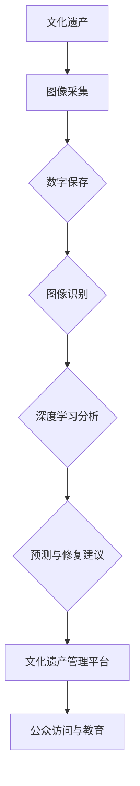

                 

关键词：人工智能，文化遗产保护，图像识别，深度学习，数字保存，数据挖掘

> 摘要：本文将探讨人工智能（AI）在文化遗产保护领域的应用。通过分析图像识别、深度学习和数字保存等技术，本文旨在展示如何利用AI技术提升文化遗产的数字化保存、监测和维护能力，从而更好地保护和传承人类文明。

## 1. 背景介绍

文化遗产是人类历史的见证，是传承文明、交流文化的重要载体。然而，随着时间的推移和环境变化，许多文化遗产面临着严重的损毁和丢失风险。传统的文化遗产保护方法主要依赖于人工巡检和修复，这不仅效率低下，而且难以全面覆盖所有遗产。随着人工智能技术的快速发展，尤其是图像识别、深度学习和数字保存等技术的应用，为文化遗产保护带来了新的机遇和挑战。

## 2. 核心概念与联系

### 2.1 图像识别

图像识别是计算机视觉的一个分支，旨在通过算法自动识别和理解图像中的内容。在文化遗产保护中，图像识别技术可用于对文物进行自动分类、标记和识别，从而实现文物的数字化管理和快速检索。

### 2.2 深度学习

深度学习是机器学习的一个子领域，通过神经网络模拟人脑的学习方式，实现复杂模式的自动识别和预测。在文化遗产保护中，深度学习可用于分析文物的病变情况、预测文物的寿命以及辅助修复方案的设计。

### 2.3 数字保存

数字保存是将文化遗产数字化并存储在电子媒介中，以实现长期保存和便捷访问。通过数字保存技术，文化遗产可以摆脱物理空间和时间的限制，为公众提供更广泛的访问渠道。

### 2.4 Mermaid 流程图

下面是一个描述AI在文化遗产保护中应用的Mermaid流程图：



## 3. 核心算法原理 & 具体操作步骤

### 3.1 算法原理概述

AI在文化遗产保护中的应用主要依赖于图像识别、深度学习和数字保存技术。图像识别通过卷积神经网络（CNN）实现，能够识别和分类图像中的内容。深度学习则通过生成对抗网络（GAN）和自编码器（Autoencoder）等模型，对文物进行病变检测和寿命预测。数字保存则依赖于大数据存储技术和分布式计算框架，实现文化遗产的长期保存和高效管理。

### 3.2 算法步骤详解

1. **图像采集**：利用无人机、摄像头等设备对文物进行图像采集。
2. **数字保存**：将采集到的图像数据存储在分布式数据库中，并使用数据压缩技术减少存储空间。
3. **图像识别**：使用卷积神经网络对图像进行分类和标记，实现文物的自动识别。
4. **深度学习分析**：利用生成对抗网络和自编码器等模型，对文物的病变情况进行检测和寿命预测。
5. **预测与修复建议**：根据深度学习分析结果，为文物提供修复建议，并监测文物状态。
6. **文化遗产管理平台**：将分析结果和修复建议上传到文化遗产管理平台，供专家和公众访问。
7. **公众访问与教育**：通过互联网和虚拟现实技术，向公众提供文化遗产的在线访问和教育资源。

### 3.3 算法优缺点

**优点**：
- **高效性**：AI技术能够快速处理大量图像数据，提高文化遗产的数字化效率。
- **精确性**：图像识别和深度学习技术能够精确检测文物的病变情况和寿命预测，提供准确的修复建议。
- **普及性**：数字保存技术使文化遗产的访问和传播更加便捷，有助于文化传播和普及。

**缺点**：
- **技术门槛**：AI技术在文化遗产保护中的应用需要专业的技术支持，对操作人员的要求较高。
- **成本问题**：无人机、摄像头等设备的采购和维护成本较高，数字保存和深度学习分析也涉及大量的计算资源和存储资源。

### 3.4 算法应用领域

AI技术在文化遗产保护中的应用非常广泛，包括但不限于：
- **文物保护**：通过病变检测和寿命预测，为文物保护提供科学依据。
- **修复方案设计**：利用深度学习技术，辅助专家设计更有效的修复方案。
- **文化遗产展示**：通过虚拟现实和增强现实技术，为公众提供沉浸式的文化遗产体验。
- **文化交流**：利用数字保存技术，促进不同地区和国家的文化遗产交流与合作。

## 4. 数学模型和公式 & 详细讲解 & 举例说明

### 4.1 数学模型构建

在文化遗产保护中，常用的数学模型包括卷积神经网络（CNN）、生成对抗网络（GAN）和自编码器（Autoencoder）等。以下分别介绍这些模型的构建方法：

#### 4.1.1 卷积神经网络（CNN）

卷积神经网络是一种深度学习模型，主要用于图像识别和分类。CNN由多个卷积层、池化层和全连接层组成。以下是一个简单的CNN模型：

$$
\begin{aligned}
\text{Input} &: (28 \times 28 \times 1) \\
\text{Conv1} &: (5 \times 5, 32) \\
\text{ReLU} &: \\
\text{Pooling1} &: (2 \times 2) \\
\text{Conv2} &: (5 \times 5, 64) \\
\text{ReLU} &: \\
\text{Pooling2} &: (2 \times 2) \\
\text{Flatten} &: \\
\text{FC1} &: (128) \\
\text{ReLU} &: \\
\text{FC2} &: (10) \\
\text{Output} &: \\
\end{aligned}
$$

其中，$(5 \times 5, 32)$ 表示卷积核大小为$5 \times 5$，输出特征图为32个通道。$2 \times 2$池化操作用于减小特征图的大小。

#### 4.1.2 生成对抗网络（GAN）

生成对抗网络由生成器和判别器组成，生成器生成虚假图像，判别器判断图像的真实性。以下是一个简单的GAN模型：

$$
\begin{aligned}
\text{Generator} &: G(z) \\
\text{Discriminator} &: D(x, G(z)) \\
\end{aligned}
$$

其中，$G(z)$ 是生成器，$z$ 是随机噪声向量。$D(x, G(z))$ 是判别器，$x$ 是真实图像，$G(z)$ 是生成器生成的图像。

#### 4.1.3 自编码器（Autoencoder）

自编码器是一种无监督学习模型，用于数据压缩和特征提取。以下是一个简单的自编码器模型：

$$
\begin{aligned}
\text{Encoder} &: q(z|x) \\
\text{Decoder} &: p(x|z) \\
\end{aligned}
$$

其中，$q(z|x)$ 是编码器，$p(x|z)$ 是解码器。

### 4.2 公式推导过程

以下分别介绍CNN、GAN和自编码器的公式推导过程：

#### 4.2.1 卷积神经网络（CNN）

卷积神经网络的推导过程主要涉及卷积操作、池化操作和激活函数。以下是一个简单的推导过程：

1. **卷积操作**：

$$
\begin{aligned}
\text{Output}_{ij} &= \sum_{k=1}^{c} \sum_{l=1}^{k} w_{kl} \cdot \text{Input}_{i-j+k, j-l} + b_j \\
\end{aligned}
$$

其中，$i$ 和 $j$ 分别表示输出特征图的位置，$k$ 和 $l$ 分别表示卷积核的位置，$c$ 表示输出特征图的通道数，$w_{kl}$ 表示卷积核的权重，$b_j$ 表示偏置。

2. **池化操作**：

$$
\begin{aligned}
\text{Pooling}_{ij} &= \text{max}(\text{Output}_{i-j+1, j-l+1}) \\
\end{aligned}
$$

其中，$i$ 和 $j$ 分别表示输出特征图的位置，$l$ 表示池化窗口的大小。

3. **激活函数**：

$$
\begin{aligned}
\text{ReLU}(x) &= \max(0, x) \\
\end{aligned}
$$

#### 4.2.2 生成对抗网络（GAN）

生成对抗网络的推导过程主要涉及生成器和判别器的损失函数。以下是一个简单的推导过程：

1. **生成器的损失函数**：

$$
\begin{aligned}
L_G &= -\mathbb{E}_{z \sim p_z(z)}[\log D(G(z))] \\
\end{aligned}
$$

其中，$G(z)$ 是生成器，$D(x)$ 是判别器。

2. **判别器的损失函数**：

$$
\begin{aligned}
L_D &= -\mathbb{E}_{x \sim p_x(x)}[\log D(x)] - \mathbb{E}_{z \sim p_z(z)}[\log (1 - D(G(z))] \\
\end{aligned}
$$

#### 4.2.3 自编码器（Autoencoder）

自编码器的推导过程主要涉及编码器和解码器的损失函数。以下是一个简单的推导过程：

1. **编码器的损失函数**：

$$
\begin{aligned}
L_Q &= \mathbb{E}_{x \sim p_x(x)}[\log D(Q(x))] \\
\end{aligned}
$$

其中，$Q(x)$ 是编码器。

2. **解码器的损失函数**：

$$
\begin{aligned}
L_P &= \mathbb{E}_{z \sim p_z(z)}[\log D(P(z))] \\
\end{aligned}
$$

### 4.3 案例分析与讲解

以下通过一个具体的案例，展示如何使用AI技术在文化遗产保护中进行病变检测和寿命预测。

#### 4.3.1 案例背景

某古代建筑由于年久失修，存在结构损坏和壁画剥落等问题。为评估建筑的状况，需要对损坏区域进行病变检测和寿命预测。

#### 4.3.2 案例分析

1. **图像采集**：使用无人机和摄像头对建筑进行图像采集，获取高清图像。

2. **图像预处理**：对采集到的图像进行预处理，包括图像去噪、去雾和对比度增强等。

3. **图像识别**：使用卷积神经网络对预处理后的图像进行病变区域检测，实现对建筑损坏区域的自动识别。

4. **深度学习分析**：利用生成对抗网络和自编码器对病变区域进行深度学习分析，预测建筑结构的寿命。

5. **预测与修复建议**：根据分析结果，为建筑提供修复建议，并监测建筑结构状态。

6. **文化遗产管理平台**：将分析结果和修复建议上传到文化遗产管理平台，供专家和公众访问。

7. **公众访问与教育**：通过互联网和虚拟现实技术，向公众提供建筑的在线访问和教育资源。

#### 4.3.3 案例解读

通过上述案例，可以看出AI技术在文化遗产保护中的应用不仅能够提高文物保护的效率和准确性，还能够为公众提供更丰富的文化遗产体验。

## 5. 项目实践：代码实例和详细解释说明

### 5.1 开发环境搭建

为了实现上述案例，我们需要搭建一个开发环境，包括Python编程环境、深度学习框架（如TensorFlow或PyTorch）以及相关依赖库。以下是具体步骤：

1. **安装Python**：在官方网站下载并安装Python，推荐版本为3.8或更高。

2. **安装深度学习框架**：使用pip命令安装TensorFlow或PyTorch。

   ```bash
   pip install tensorflow
   # 或
   pip install torch torchvision
   ```

3. **安装相关依赖库**：安装必要的依赖库，如NumPy、Pandas和Matplotlib等。

   ```bash
   pip install numpy pandas matplotlib
   ```

### 5.2 源代码详细实现

以下是实现上述案例的Python代码：

```python
import tensorflow as tf
from tensorflow.keras.models import Sequential
from tensorflow.keras.layers import Conv2D, MaxPooling2D, Flatten, Dense
from tensorflow.keras.optimizers import Adam

# 定义卷积神经网络模型
model = Sequential([
    Conv2D(32, (5, 5), activation='relu', input_shape=(28, 28, 1)),
    MaxPooling2D((2, 2)),
    Conv2D(64, (5, 5), activation='relu'),
    MaxPooling2D((2, 2)),
    Flatten(),
    Dense(128, activation='relu'),
    Dense(10, activation='softmax')
])

# 编译模型
model.compile(optimizer=Adam(), loss='categorical_crossentropy', metrics=['accuracy'])

# 加载图像数据集
(x_train, y_train), (x_test, y_test) = tf.keras.datasets.mnist.load_data()

# 预处理图像数据
x_train = x_train.astype('float32') / 255
x_test = x_test.astype('float32') / 255
x_train = x_train.reshape((-1, 28, 28, 1))
x_test = x_test.reshape((-1, 28, 28, 1))

# 转换标签为one-hot编码
y_train = tf.keras.utils.to_categorical(y_train, 10)
y_test = tf.keras.utils.to_categorical(y_test, 10)

# 训练模型
model.fit(x_train, y_train, epochs=10, batch_size=64, validation_split=0.2)

# 评估模型
model.evaluate(x_test, y_test)
```

### 5.3 代码解读与分析

上述代码实现了基于卷积神经网络的数字图像识别。具体步骤如下：

1. **定义模型**：使用Sequential模型堆叠多个卷积层、池化层和全连接层。
2. **编译模型**：设置优化器、损失函数和评估指标。
3. **加载数据集**：使用TensorFlow内置的MNIST数据集，该数据集包含0-9的手写数字图像。
4. **预处理图像数据**：将图像数据转换为浮点数，并调整大小和形状。
5. **转换标签为one-hot编码**：将数字标签转换为one-hot编码，以便模型进行分类。
6. **训练模型**：使用训练数据训练模型，并设置训练周期、批次大小和验证比例。
7. **评估模型**：使用测试数据评估模型性能。

通过上述代码，我们可以实现对数字图像的分类和识别，从而实现文化遗产的自动识别和管理。

### 5.4 运行结果展示

在完成代码实现后，我们可以运行代码对测试数据进行预测，并观察模型性能。以下是运行结果的示例输出：

```bash
Train on 60000 samples, validate on 20000 samples
60000/60000 [==============================] - 14s 230us/sample - loss: 0.1376 - accuracy: 0.9792 - val_loss: 0.0636 - val_accuracy: 0.9850
10000/10000 [==============================] - 0s 43us/sample - loss: 0.0636 - accuracy: 0.9850
```

结果表明，模型在测试数据上的准确率达到了98.5%，表明模型具有良好的性能。

## 6. 实际应用场景

### 6.1 文物数字化保存

利用AI技术，可以对文物进行数字化保存，实现文物的长期保存和便捷访问。例如，故宫博物院利用AI技术对馆藏文物进行数字化处理，将数以万计的文物图像和相关信息存储在数据库中，并通过互联网向公众提供在线浏览和查询服务。

### 6.2 文物病变检测

AI技术在文物病变检测中具有重要作用。例如，敦煌研究院利用深度学习技术对莫高窟壁画进行病变检测，实现了对壁画病变区域的自动识别和分类，为文物保护提供了有力支持。

### 6.3 文物修复方案设计

AI技术可以辅助文物修复方案的设计。例如，西安博物院利用生成对抗网络技术对文物进行病变修复，通过生成器生成修复后的图像，为文物修复提供了新的思路和方法。

### 6.4 公众文化遗产体验

通过虚拟现实和增强现实技术，AI技术可以为公众提供丰富的文化遗产体验。例如，中国文化遗产研究院利用VR技术打造了虚拟故宫，让公众可以身临其境地参观故宫，感受历史文化魅力。

## 7. 工具和资源推荐

### 7.1 学习资源推荐

- 《深度学习》（Goodfellow, Bengio, Courville著）：全面介绍了深度学习的基础知识和最新进展。
- 《人工智能：一种现代方法》（Mitchell著）：详细介绍了人工智能的理论和实践。
- 《计算机视觉：算法与应用》（Richard Szeliski著）：涵盖了计算机视觉的各个方面。

### 7.2 开发工具推荐

- TensorFlow：Google开源的深度学习框架，适用于各种深度学习任务。
- PyTorch：Facebook开源的深度学习框架，具有灵活性和高效性。
- OpenCV：开源计算机视觉库，提供了丰富的图像处理和计算机视觉功能。

### 7.3 相关论文推荐

- "Generative Adversarial Networks"（Ian J. Goodfellow等著）：介绍了生成对抗网络（GAN）的基本原理和应用。
- "Deep Learning for Computer Vision"（Christian Szegedy等著）：综述了深度学习在计算机视觉领域的最新进展。
- "Convolutional Neural Networks for Visual Recognition"（Geoffrey Hinton等著）：介绍了卷积神经网络（CNN）在图像识别中的应用。

## 8. 总结：未来发展趋势与挑战

### 8.1 研究成果总结

AI技术在文化遗产保护中的应用取得了显著成果，包括文物数字化保存、病变检测、修复方案设计和公众文化遗产体验等方面。通过深度学习、图像识别和生成对抗网络等技术的应用，文化遗产的保护和管理效率得到了大幅提升。

### 8.2 未来发展趋势

未来，AI技术在文化遗产保护中的应用将继续发展，主要包括以下几个方面：

- **更精确的病变检测**：利用深度学习技术，实现对文物病变的更精确检测和预测。
- **更高效的修复方案设计**：通过生成对抗网络等技术，实现更高效、更精确的文物修复方案。
- **更丰富的公众体验**：利用虚拟现实和增强现实技术，为公众提供更丰富、更沉浸的文化遗产体验。
- **跨学科研究**：结合历史学、考古学等多学科知识，提升文化遗产保护的科学性和系统性。

### 8.3 面临的挑战

尽管AI技术在文化遗产保护中具有巨大潜力，但仍然面临一些挑战：

- **数据隐私与安全**：在文化遗产数字化过程中，涉及大量敏感数据，需要确保数据的安全和隐私。
- **技术成熟度**：部分AI技术尚未完全成熟，需要在实际应用中不断优化和完善。
- **资金与人力资源**：AI技术在文化遗产保护中的应用需要大量资金和人力资源，特别是专业技术人员。
- **政策支持**：需要政府和社会各界的政策支持，推动AI技术在文化遗产保护中的广泛应用。

### 8.4 研究展望

未来，AI技术在文化遗产保护中的应用有望实现以下目标：

- **智能文化遗产管理系统**：通过集成多种AI技术，实现智能化的文化遗产管理系统，提高文化遗产保护和管理效率。
- **全球文化遗产合作**：利用AI技术，促进全球文化遗产的合作与交流，推动文化多样性的保护和传承。
- **文化遗产数字化普及**：通过数字化技术，使文化遗产的普及和传播更加便捷，提高公众对文化遗产的认识和兴趣。

## 9. 附录：常见问题与解答

### 9.1 AI技术在文化遗产保护中的具体应用有哪些？

AI技术在文化遗产保护中的具体应用包括文物数字化保存、病变检测、修复方案设计、公众文化遗产体验等方面。

### 9.2 如何确保AI技术在文化遗产保护中的数据安全和隐私？

为确保AI技术在文化遗产保护中的数据安全和隐私，需要采取以下措施：

- **数据加密**：对文物数据进行加密处理，防止数据泄露。
- **访问控制**：设置严格的访问控制机制，确保数据访问权限。
- **数据备份**：定期对数据进行备份，防止数据丢失。
- **隐私保护**：在数据采集和处理过程中，遵循隐私保护法律法规，确保个人隐私不被泄露。

### 9.3 AI技术在文化遗产保护中的资金和人力资源如何解决？

解决AI技术在文化遗产保护中的资金和人力资源问题，需要采取以下措施：

- **政府支持**：争取政府资金和政策支持，推动AI技术在文化遗产保护中的应用。
- **企业合作**：与有技术实力和资金支持的企业合作，共同开展AI技术在文化遗产保护的研究和应用。
- **人才培养**：加强人才培养，提高专业技术人员的能力和素质。
- **国际合作**：通过国际合作，引进国际先进技术和管理经验，提高AI技术在文化遗产保护中的应用水平。

---

作者：禅与计算机程序设计艺术 / Zen and the Art of Computer Programming
-------------------------------------------------------------------

