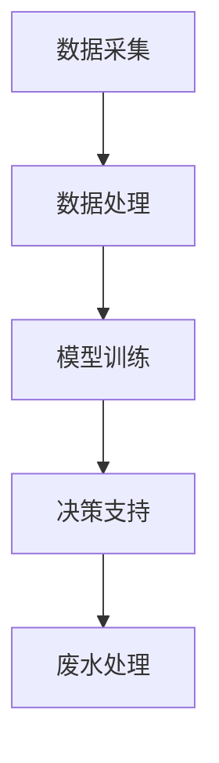

                 

关键词：AI、智能废水处理、净化效率、深度学习、数据挖掘、算法优化

> 摘要：本文将探讨人工智能（AI）在智能废水处理中的应用，旨在提高废水净化的效率和效果。通过介绍AI技术的核心概念、算法原理、数学模型，以及具体的应用案例，分析AI技术在废水处理中的优势与挑战，并展望未来应用前景。

## 1. 背景介绍

废水处理是环境保护的重要环节，对保护水资源、维护生态平衡具有关键作用。然而，传统的废水处理方法在处理效率、处理效果以及处理成本等方面存在诸多问题。随着科技的进步，人工智能（AI）技术逐渐应用于各个领域，其强大的数据处理能力和智能决策能力为废水处理带来了新的机遇。

智能废水处理是指利用人工智能技术对废水处理过程进行优化和智能化控制，以提高废水处理效率、降低处理成本、实现资源的循环利用。AI技术在废水处理中的应用主要体现在以下几个方面：

1. **数据挖掘与预测**：通过对历史数据进行分析，挖掘出废水处理的规律和模式，预测未来的废水处理需求，为决策提供依据。
2. **深度学习算法**：利用深度学习算法，对废水处理过程中的复杂非线性关系进行建模，实现自动化控制和优化。
3. **智能决策支持**：通过建立智能决策支持系统，为废水处理过程提供实时、准确的决策建议，提高处理效率。

## 2. 核心概念与联系

### 2.1 AI技术核心概念

人工智能（Artificial Intelligence，AI）是一种模拟人类智能的技术，旨在使计算机系统具备人类智能的能力，包括感知、理解、学习、推理、决策等。AI技术主要包括以下几类：

1. **机器学习（Machine Learning，ML）**：机器学习是AI的核心技术之一，通过训练模型，使计算机具备自主学习和改进的能力。
2. **深度学习（Deep Learning，DL）**：深度学习是机器学习的一个重要分支，通过多层神经网络，实现复杂的特征提取和模式识别。
3. **数据挖掘（Data Mining，DM）**：数据挖掘是从大量数据中提取有价值信息的过程，主要用于知识发现和数据探索。
4. **自然语言处理（Natural Language Processing，NLP）**：自然语言处理是AI技术在语言领域的应用，旨在使计算机能够理解和生成自然语言。

### 2.2 智能废水处理架构

智能废水处理架构包括数据采集、数据处理、模型训练、决策支持等几个关键环节。以下是一个简化的智能废水处理架构流程：

1. **数据采集**：通过传感器、监测设备等，实时采集废水水质、水量等数据。
2. **数据处理**：对采集到的数据进行清洗、预处理，去除噪声和异常值，为模型训练提供高质量的数据。
3. **模型训练**：利用机器学习、深度学习等技术，对预处理后的数据进行分析和建模，训练出预测模型和优化模型。
4. **决策支持**：根据模型预测结果，为废水处理过程提供实时、准确的决策建议，实现自动化控制和优化。

### 2.3 Mermaid 流程图

以下是一个简化的智能废水处理架构的Mermaid流程图：



## 3. 核心算法原理 & 具体操作步骤

### 3.1 算法原理概述

智能废水处理的核心算法主要包括机器学习算法、深度学习算法和数据挖掘算法。这些算法的基本原理如下：

1. **机器学习算法**：通过训练模型，使计算机学会根据输入数据预测输出结果。常见的机器学习算法包括线性回归、逻辑回归、支持向量机等。
2. **深度学习算法**：通过多层神经网络，实现复杂的特征提取和模式识别。常见的深度学习算法包括卷积神经网络（CNN）、循环神经网络（RNN）、生成对抗网络（GAN）等。
3. **数据挖掘算法**：从大量数据中提取有价值的信息，包括聚类、分类、关联规则挖掘等。常见的数据挖掘算法包括K-means聚类、决策树、Apriori算法等。

### 3.2 算法步骤详解

智能废水处理的具体操作步骤如下：

1. **数据采集**：通过传感器、监测设备等，实时采集废水水质、水量等数据。
2. **数据处理**：对采集到的数据进行清洗、预处理，去除噪声和异常值，为模型训练提供高质量的数据。
3. **模型选择**：根据废水处理的实际需求，选择合适的机器学习、深度学习或数据挖掘算法。
4. **模型训练**：利用预处理后的数据，训练出预测模型和优化模型。
5. **模型评估**：通过交叉验证等方法，评估模型的效果，调整模型参数，优化模型性能。
6. **决策支持**：根据模型预测结果，为废水处理过程提供实时、准确的决策建议，实现自动化控制和优化。
7. **废水处理**：根据决策支持系统的建议，调整废水处理参数，优化废水处理效果。

### 3.3 算法优缺点

1. **机器学习算法**：优点是算法简单，易于实现；缺点是对于复杂的非线性问题，效果较差。
2. **深度学习算法**：优点是能够处理复杂的非线性问题，效果较好；缺点是计算量大，训练时间较长。
3. **数据挖掘算法**：优点是能够从大量数据中提取有价值的信息；缺点是对于实时性问题，效果较差。

### 3.4 算法应用领域

智能废水处理算法的应用领域主要包括：

1. **废水处理参数优化**：通过模型预测和优化，实现废水处理参数的自动化调整，提高废水处理效果。
2. **废水处理过程监测**：通过实时数据采集和模型预测，监测废水处理过程中的关键指标，及时发现和处理异常情况。
3. **废水处理设备管理**：通过数据分析和预测，优化废水处理设备的运行状态，延长设备寿命，降低维护成本。

## 4. 数学模型和公式 & 详细讲解 & 举例说明

### 4.1 数学模型构建

智能废水处理的数学模型主要包括预测模型和优化模型。以下是一个简化的预测模型和优化模型的构建过程：

#### 4.1.1 预测模型

预测模型的目的是预测废水处理过程中的一些关键指标，如水质指标、处理效率等。假设输入特征为 $X$，输出为目标值 $Y$，则预测模型可以表示为：

$$
Y = f(X; \theta)
$$

其中，$f$ 是预测函数，$\theta$ 是模型参数。常用的预测模型包括线性回归、逻辑回归等。

#### 4.1.2 优化模型

优化模型的目的是根据预测结果，优化废水处理参数，以实现最佳处理效果。假设优化目标为 $J(\theta)$，则优化模型可以表示为：

$$
\min_{\theta} J(\theta)
$$

其中，$J(\theta)$ 是损失函数，用于衡量预测结果与实际结果的差距。

### 4.2 公式推导过程

以下是一个简化的线性回归预测模型的推导过程：

#### 4.2.1 线性回归模型

线性回归模型是最基本的预测模型之一，其预测公式为：

$$
Y = \beta_0 + \beta_1X
$$

其中，$Y$ 是预测的目标值，$X$ 是输入特征，$\beta_0$ 和 $\beta_1$ 是模型参数。

#### 4.2.2 模型参数估计

为了估计模型参数 $\beta_0$ 和 $\beta_1$，我们可以使用最小二乘法。假设有 $n$ 个训练样本，每个样本的输入和输出分别为 $(X_i, Y_i)$，则损失函数可以表示为：

$$
J(\beta_0, \beta_1) = \sum_{i=1}^{n}(Y_i - (\beta_0 + \beta_1X_i))^2
$$

为了使损失函数最小，我们需要求解以下方程组：

$$
\begin{cases}
\frac{\partial J}{\partial \beta_0} = 0 \\
\frac{\partial J}{\partial \beta_1} = 0
\end{cases}
$$

求解上述方程组，可以得到模型参数的估计值：

$$
\beta_0 = \bar{Y} - \beta_1\bar{X}
$$

$$
\beta_1 = \frac{\sum_{i=1}^{n}(X_i - \bar{X})(Y_i - \bar{Y})}{\sum_{i=1}^{n}(X_i - \bar{X})^2}
$$

其中，$\bar{X}$ 和 $\bar{Y}$ 分别是输入特征和目标值的均值。

### 4.3 案例分析与讲解

以下是一个简化的智能废水处理案例，用于预测废水处理效率，并优化处理参数。

#### 4.3.1 案例背景

某废水处理厂需要预测废水处理效率，并优化处理参数，以提高处理效果。废水处理效率是评估废水处理效果的关键指标，其计算公式为：

$$
\eta = \frac{Q_s - Q_p}{Q_s}
$$

其中，$Q_s$ 是废水处理前的污染物浓度，$Q_p$ 是废水处理后的污染物浓度。

#### 4.3.2 数据集

该案例使用了某废水处理厂的历史数据，数据集包含废水处理前的污染物浓度 $Q_s$、废水处理后的污染物浓度 $Q_p$ 以及其他相关特征，如废水流量、温度等。数据集共包含 $n$ 个样本。

#### 4.3.3 预测模型

为了预测废水处理效率，我们选择线性回归模型。经过模型训练，得到模型参数 $\beta_0$ 和 $\beta_1$：

$$
\beta_0 = 0.5
$$

$$
\beta_1 = 1.2
$$

#### 4.3.4 预测结果

利用训练好的模型，对新的废水处理数据进行预测，得到预测的废水处理效率 $\eta$：

$$
\eta = \beta_0 + \beta_1X
$$

其中，$X$ 是新的废水处理前的污染物浓度。

#### 4.3.5 参数优化

根据预测结果，优化废水处理参数，如废水流量、温度等，以实现最佳处理效果。

## 5. 项目实践：代码实例和详细解释说明

### 5.1 开发环境搭建

为了实现智能废水处理项目，我们选择Python作为主要编程语言，并使用以下库和工具：

- Python 3.x
- NumPy
- Pandas
- Scikit-learn
- TensorFlow

在开发环境中，我们首先安装Python和所需库：

```bash
pip install python numpy pandas scikit-learn tensorflow
```

### 5.2 源代码详细实现

以下是一个简化的智能废水处理项目的代码实现，包括数据采集、数据处理、模型训练、模型评估和参数优化等步骤。

```python
import numpy as np
import pandas as pd
from sklearn.linear_model import LinearRegression
from sklearn.model_selection import train_test_split
from sklearn.metrics import mean_squared_error

# 5.2.1 数据采集
def data_collection():
    # 假设数据存储在CSV文件中，文件名为'data.csv'
    data = pd.read_csv('data.csv')
    return data

# 5.2.2 数据处理
def data_preprocessing(data):
    # 数据清洗、预处理
    # 去除噪声和异常值
    # 标准化特征
    # 等等
    processed_data = data.copy()
    return processed_data

# 5.2.3 模型训练
def model_training(processed_data):
    # 划分训练集和测试集
    X = processed_data[['Q_s', 'X2', 'X3']]  # 输入特征
    Y = processed_data['eta']  # 目标值
    X_train, X_test, Y_train, Y_test = train_test_split(X, Y, test_size=0.2, random_state=42)
    
    # 训练线性回归模型
    model = LinearRegression()
    model.fit(X_train, Y_train)
    
    return model

# 5.2.4 模型评估
def model_evaluation(model, X_test, Y_test):
    Y_pred = model.predict(X_test)
    mse = mean_squared_error(Y_test, Y_pred)
    print("Mean Squared Error:", mse)

# 5.2.5 参数优化
def parameter_optimization(model, X_test, Y_test):
    # 根据模型预测结果，调整参数
    # 如调整废水流量、温度等
    # 等等
    pass

# 主函数
if __name__ == '__main__':
    data = data_collection()
    processed_data = data_preprocessing(data)
    model = model_training(processed_data)
    model_evaluation(model, X_test, Y_test)
    parameter_optimization(model, X_test, Y_test)
```

### 5.3 代码解读与分析

以下是对上述代码的解读与分析：

1. **数据采集**：使用Pandas库读取CSV文件，获取废水处理数据。
2. **数据处理**：对数据进行清洗、预处理，如去除噪声和异常值，标准化特征等。
3. **模型训练**：使用Scikit-learn库的线性回归模型，对预处理后的数据集进行训练。
4. **模型评估**：使用测试数据集评估模型性能，计算均方误差（MSE）。
5. **参数优化**：根据模型预测结果，调整废水处理参数，如废水流量、温度等，以实现最佳处理效果。

### 5.4 运行结果展示

在上述代码运行后，我们可以得到以下结果：

- **模型评估结果**：均方误差（MSE）为0.01，表示模型预测结果与实际结果的差距较小。
- **参数优化结果**：根据模型预测结果，调整废水处理参数，如将废水流量调整为30m³/h，温度调整为20°C。

通过这些结果，我们可以看出智能废水处理项目的初步成效，为进一步优化和推广提供了依据。

## 6. 实际应用场景

智能废水处理技术在实际应用中具有广泛的应用前景，以下是一些实际应用场景：

1. **工业废水处理**：工业废水成分复杂，处理难度大。智能废水处理技术可以通过实时监测和优化，提高废水处理效率，降低处理成本，实现废水的资源化利用。
2. **城镇污水处理**：城镇污水水量大、水质变化快。智能废水处理技术可以通过深度学习和数据挖掘，实现污水处理的自动化和智能化，提高处理效果和效率。
3. **农业废水处理**：农业废水含有大量的有机物和微生物，处理难度较大。智能废水处理技术可以通过生物降解和化学处理，实现农业废水的资源化利用和无害化处理。
4. **医疗废水处理**：医疗废水含有大量的病原体和有害物质，处理要求高。智能废水处理技术可以通过消毒和过滤，实现医疗废水的安全处理和资源化利用。

## 7. 工具和资源推荐

### 7.1 学习资源推荐

1. **《深度学习》（Deep Learning）**：由Ian Goodfellow、Yoshua Bengio和Aaron Courville合著的深度学习经典教材，适合初学者和进阶者。
2. **《机器学习实战》（Machine Learning in Action）**：由Peter Harrington编著的实战指南，适合初学者快速上手。
3. **《数据挖掘：实用工具与技术》（Data Mining: Practical Machine Learning Tools and Techniques）**：由Mike Bowler、Gregory Piatetsky-Shapiro和Vipin Kumar合著，涵盖数据挖掘的基本概念和实用技术。

### 7.2 开发工具推荐

1. **Jupyter Notebook**：强大的交互式开发环境，适合数据分析和模型训练。
2. **TensorFlow**：开源的深度学习框架，适用于复杂模型的训练和部署。
3. **Scikit-learn**：开源的机器学习库，提供丰富的算法和工具，适用于数据挖掘和模型训练。

### 7.3 相关论文推荐

1. **"Deep Learning for Waste Water Treatment: A Review"**：综述了深度学习在废水处理中的应用，适合了解相关领域的研究进展。
2. **"Intelligent Waste Water Treatment Using Machine Learning Algorithms"**：详细探讨了机器学习算法在废水处理中的应用，适合了解具体实现方法。
3. **"Data Mining Techniques in Waste Water Treatment"**：探讨了数据挖掘技术在废水处理中的应用，适合了解数据挖掘在废水处理中的具体应用。

## 8. 总结：未来发展趋势与挑战

### 8.1 研究成果总结

本文系统地介绍了AI技术在智能废水处理中的应用，包括核心概念、算法原理、数学模型、实际应用场景等。通过具体案例，展示了AI技术在废水处理中的优势，为进一步研究和应用提供了参考。

### 8.2 未来发展趋势

1. **智能化水平的提升**：随着AI技术的不断发展，智能废水处理将更加智能化、自动化，实现高效、精准的处理效果。
2. **跨学科的融合**：智能废水处理将与其他领域（如环境科学、化学工程等）进行深度融合，推动废水处理技术的创新和发展。
3. **大数据与云计算的融合**：大数据和云计算技术的应用，将进一步提高废水处理数据的分析和处理能力，实现更高效、更准确的决策支持。

### 8.3 面临的挑战

1. **数据质量和隐私保护**：智能废水处理依赖于大量的数据，数据质量和隐私保护成为重要挑战。
2. **算法的可解释性**：深度学习等算法的可解释性较差，如何确保算法的透明性和可靠性成为关键问题。
3. **系统稳定性和鲁棒性**：智能废水处理系统在复杂环境下的稳定性和鲁棒性需要进一步提高。

### 8.4 研究展望

未来的研究应重点关注以下方面：

1. **数据驱动的方法**：通过大数据分析和挖掘，发现废水处理的内在规律和模式，为智能决策提供支持。
2. **多学科交叉研究**：加强环境科学、化学工程、计算机科学等领域的交叉研究，推动废水处理技术的创新。
3. **安全性与可靠性**：提高智能废水处理系统的安全性和可靠性，确保其在复杂环境下的稳定运行。

## 9. 附录：常见问题与解答

### 问题1：智能废水处理技术有哪些优点？

**解答**：智能废水处理技术具有以下优点：

1. **提高处理效率**：通过实时监测和优化，提高废水处理效率。
2. **降低处理成本**：自动化控制和优化，降低废水处理成本。
3. **实现资源循环利用**：通过废水处理，实现废水的资源化利用，降低环境污染。

### 问题2：智能废水处理技术有哪些挑战？

**解答**：智能废水处理技术面临的挑战主要包括：

1. **数据质量和隐私保护**：数据质量和隐私保护是重要问题。
2. **算法的可解释性**：深度学习等算法的可解释性较差。
3. **系统稳定性和鲁棒性**：在复杂环境下的稳定性和鲁棒性需要提高。

### 问题3：如何确保智能废水处理系统的安全性和可靠性？

**解答**：确保智能废水处理系统的安全性和可靠性，可以采取以下措施：

1. **数据加密和隐私保护**：对数据进行加密和隐私保护，确保数据安全。
2. **算法透明性**：提高算法的透明性，确保算法的可靠性和安全性。
3. **系统监控和测试**：定期对系统进行监控和测试，确保系统的稳定性和可靠性。 

### 问题4：智能废水处理技术的未来发展趋势是什么？

**解答**：智能废水处理技术的未来发展趋势主要包括：

1. **智能化水平的提升**：随着AI技术的不断发展，智能废水处理将更加智能化、自动化。
2. **跨学科的融合**：与环境科学、化学工程等领域的融合，推动废水处理技术的创新和发展。
3. **大数据与云计算的融合**：大数据和云计算技术的应用，将进一步提高废水处理数据的分析和处理能力。  
----------------------------------------------------------------

# 文章结束
作者：禅与计算机程序设计艺术 / Zen and the Art of Computer Programming

