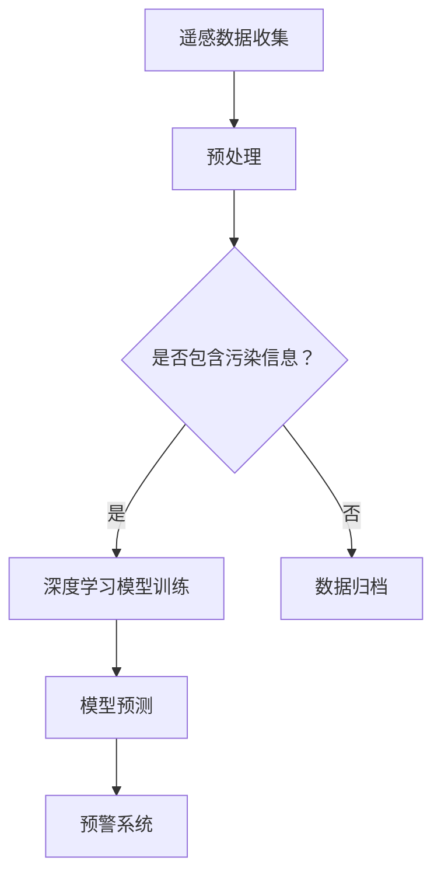
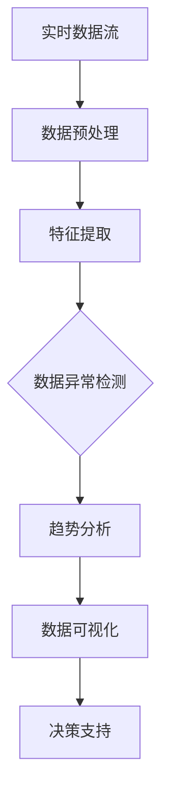
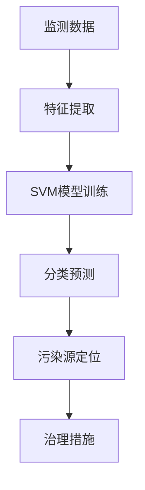

                 

关键词：人工智能、环境保护、监测、预警、深度学习、遥感技术、大数据分析

> 摘要：本文主要探讨人工智能在环境保护中的应用，特别是在环境监测与预警系统方面的研究与实践。通过介绍核心算法原理、数学模型构建、实际应用场景和未来发展趋势，文章旨在为环境保护领域的AI应用提供新的思路和方法。

## 1. 背景介绍

随着全球人口的增长和经济的发展，环境污染问题日益严重。空气污染、水污染、土地污染等环境问题不仅威胁着人类健康，还制约了可持续发展。为了有效解决这些问题，监测和预警系统成为环境保护的重要工具。然而，传统的监测方法通常依赖于人工采集样本，效率低下且存在时效性不足的问题。人工智能技术的快速发展为环境监测与预警带来了新的机遇。

人工智能，特别是机器学习和深度学习，在图像识别、语音识别、自然语言处理等领域取得了显著成果。这些技术可以应用于环境监测，通过数据分析和模式识别，实现对环境污染的实时监测和预警。例如，遥感技术可以通过卫星图像监测大气污染和水污染情况；大数据分析可以挖掘环境数据中的潜在规律，为决策提供科学依据。

本文将从以下几个方面探讨AI在环境保护中的应用：

1. **核心算法原理**：介绍环境监测与预警系统所依赖的关键算法，如深度学习、支持向量机、随机森林等。
2. **数学模型和公式**：构建环境监测的数学模型，并详细讲解公式推导过程。
3. **项目实践**：通过实际案例展示AI在环境监测中的应用。
4. **实际应用场景**：分析AI在环境保护中的多种应用场景。
5. **未来展望**：探讨AI在环境保护领域的未来发展趋势与面临的挑战。

## 2. 核心概念与联系

### 2.1 深度学习与遥感监测

深度学习是人工智能的一个重要分支，其核心思想是通过多层神经网络模拟人类大脑的学习机制。在环境监测领域，深度学习可以用于图像处理和模式识别。遥感监测是一种通过卫星或无人机收集地表信息的技术，它为环境监测提供了大量的数据。

Mermaid 流程图：



### 2.2 大数据分析与环境监测

大数据分析是一种从海量数据中提取有价值信息的方法。在环境监测中，大数据分析可以用于数据挖掘、趋势分析和异常检测。通过分析历史数据和实时数据，可以识别环境变化规律，预测潜在的环境问题。

Mermaid 流程图：



### 2.3 支持向量机与污染源定位

支持向量机（SVM）是一种强大的分类算法，它可以用于定位污染源。通过训练SVM模型，可以从监测数据中识别出污染物的分布区域，从而帮助制定针对性的污染治理措施。

Mermaid 流程图：



## 3. 核心算法原理 & 具体操作步骤

### 3.1 算法原理概述

#### 3.1.1 深度学习

深度学习通过多层神经网络模拟人类大脑的学习机制，能够自动提取数据中的特征。在环境监测中，深度学习可以用于图像识别、模式识别和分类预测。

#### 3.1.2 大数据分析

大数据分析通过对大量数据进行处理和分析，可以识别数据中的模式、趋势和异常。在环境监测中，大数据分析可以用于实时监测、数据挖掘和异常检测。

#### 3.1.3 支持向量机

支持向量机是一种强大的分类算法，它可以用于分类预测和污染源定位。通过训练SVM模型，可以从监测数据中识别出污染物的分布区域。

### 3.2 算法步骤详解

#### 3.2.1 深度学习

1. **数据预处理**：对收集到的遥感图像进行预处理，包括去噪、增强、归一化等。
2. **模型训练**：使用预处理后的图像数据训练深度学习模型，如卷积神经网络（CNN）。
3. **模型评估**：使用验证集评估模型的性能，调整模型参数以优化性能。
4. **模型部署**：将训练好的模型部署到环境监测系统中，实现实时监测和预警。

#### 3.2.2 大数据分析

1. **数据收集**：收集实时监测数据和历史环境数据。
2. **数据预处理**：对数据进行清洗、归一化和特征提取。
3. **异常检测**：使用大数据分析方法对实时数据进行分析，识别异常情况。
4. **趋势分析**：对历史数据进行趋势分析，预测未来的环境变化。

#### 3.2.3 支持向量机

1. **数据预处理**：对监测数据集进行预处理，包括归一化和特征提取。
2. **模型训练**：使用预处理后的数据训练SVM模型。
3. **模型评估**：使用验证集评估模型的性能，调整模型参数。
4. **污染源定位**：将训练好的SVM模型应用于新数据，定位污染源。

### 3.3 算法优缺点

#### 深度学习

**优点**：

- 自动提取特征，减少人工干预。
- 对复杂数据具有很好的表现力。

**缺点**：

- 需要大量的数据和计算资源。
- 模型解释性较差。

#### 大数据分析

**优点**：

- 可以处理海量数据。
- 能够发现数据中的潜在规律。

**缺点**：

- 需要复杂的算法和大量的计算资源。
- 结果解释性较差。

#### 支持向量机

**优点**：

- 理论基础扎实，模型解释性较好。
- 对线性可分数据有很好的效果。

**缺点**：

- 对非线性数据效果较差。
- 计算复杂度较高。

### 3.4 算法应用领域

深度学习、大数据分析和支持向量机在环境监测与预警系统中的应用非常广泛。例如，深度学习可以用于空气污染监测、水质监测和土地退化监测；大数据分析可以用于环境数据挖掘、趋势分析和决策支持；支持向量机可以用于污染源定位和污染物分布预测。

## 4. 数学模型和公式 & 详细讲解 & 举例说明

### 4.1 数学模型构建

在环境监测与预警系统中，常用的数学模型包括：

1. **卷积神经网络（CNN）**：用于图像识别和分类。
2. **支持向量机（SVM）**：用于分类预测和污染源定位。
3. **回归模型**：用于环境趋势预测和污染物浓度预测。

#### 卷积神经网络（CNN）

卷积神经网络是一种多层神经网络，主要用于图像识别和分类。其基本结构包括输入层、卷积层、池化层和全连接层。

$$
\text{输出} = \text{ReLU}(\text{激活函数}(\text{卷积}(\text{输入})))
$$

其中，ReLU函数是一种常用的激活函数，用于增加网络的非线性。

#### 支持向量机（SVM）

支持向量机是一种二分类模型，其目标是找到一个最佳的超平面，将不同类别的数据点分开。

$$
\text{分类函数} = \text{sign}(\text{w} \cdot \text{x} + \text{b})
$$

其中，w为权重向量，x为特征向量，b为偏置。

#### 回归模型

回归模型用于预测环境趋势和污染物浓度。常见的回归模型包括线性回归和多项式回归。

$$
y = \beta_0 + \beta_1x_1 + \beta_2x_2 + \ldots + \beta_nx_n
$$

其中，y为预测值，$x_1, x_2, \ldots, x_n$为输入特征，$\beta_0, \beta_1, \beta_2, \ldots, \beta_n$为模型参数。

### 4.2 公式推导过程

以卷积神经网络（CNN）为例，介绍其基本公式的推导过程。

1. **卷积操作**：

$$
\text{输出} = \sum_{i=1}^{k} \text{w}_{i} * \text{f}(\text{x})
$$

其中，$w_i$为卷积核，$f(x)$为输入图像，*表示卷积操作。

2. **池化操作**：

$$
\text{输出} = \max_{i=1,2,\ldots,k} f(\text{x}_{i})
$$

其中，$f(x_i)$为输入图像的一部分，k为池化窗口的大小。

3. **激活函数**：

$$
\text{激活函数}(\text{x}) = \text{ReLU}(\text{x}) = \max(0, \text{x})
$$

### 4.3 案例分析与讲解

以空气质量监测为例，介绍深度学习在环境监测中的应用。

#### 案例背景

某地区空气质量监测数据包括PM2.5、PM10、SO2、NO2等指标，需要使用深度学习模型进行空气质量预测。

#### 模型构建

1. **数据预处理**：

对监测数据进行归一化处理，将数据缩放到[0, 1]之间。

2. **模型训练**：

使用卷积神经网络（CNN）进行训练，模型结构如下：

- 输入层：784个神经元（28x28像素）
- 卷积层1：32个卷积核，3x3窗口，ReLU激活函数
- 池化层1：2x2窗口
- 卷积层2：64个卷积核，3x3窗口，ReLU激活函数
- 池化层2：2x2窗口
- 全连接层：128个神经元
- 输出层：1个神经元（空气质量指数）

3. **模型评估**：

使用验证集评估模型性能，损失函数为均方误差（MSE），优化器为Adam。

#### 模型应用

1. **空气质量预测**：

使用训练好的模型进行空气质量预测，输入为最新的监测数据。

2. **预警系统**：

当空气质量指数超过阈值时，触发预警，提醒公众采取防护措施。

## 5. 项目实践：代码实例和详细解释说明

### 5.1 开发环境搭建

在开始项目实践之前，需要搭建相应的开发环境。以下是使用Python进行环境搭建的步骤：

1. **安装Python**：下载并安装Python 3.8及以上版本。
2. **安装依赖库**：使用pip安装所需的库，如TensorFlow、NumPy、Pandas等。
3. **配置Jupyter Notebook**：配置Jupyter Notebook用于编写和运行代码。

### 5.2 源代码详细实现

以下是一个简单的空气质量监测与预警系统的代码实例：

```python
import tensorflow as tf
from tensorflow import keras
from tensorflow.keras import layers
import numpy as np
import pandas as pd

# 数据预处理
def preprocess_data(data):
    # 归一化处理
    data = (data - data.min()) / (data.max() - data.min())
    return data

# 构建模型
def build_model(input_shape):
    model = keras.Sequential([
        keras.Input(shape=input_shape),
        layers.Conv2D(32, kernel_size=(3, 3), activation='relu'),
        layers.MaxPooling2D(pool_size=(2, 2)),
        layers.Conv2D(64, kernel_size=(3, 3), activation='relu'),
        layers.MaxPooling2D(pool_size=(2, 2)),
        layers.Flatten(),
        layers.Dense(128, activation='relu'),
        layers.Dense(1, activation='sigmoid')
    ])
    model.compile(optimizer='adam', loss='binary_crossentropy', metrics=['accuracy'])
    return model

# 加载数据
data = pd.read_csv('air_quality.csv')
X = preprocess_data(data.iloc[:, :-1].values)
y = data.iloc[:, -1].values

# 模型训练
model = build_model(X.shape[1:])
model.fit(X, y, epochs=10, batch_size=32, validation_split=0.2)

# 预测
new_data = pd.read_csv('new_air_quality.csv')
X_new = preprocess_data(new_data.iloc[:, :-1].values)
y_pred = model.predict(X_new)

# 预警
threshold = 0.5
for i in range(len(y_pred)):
    if y_pred[i] > threshold:
        print(f"预警：新监测点空气质量指数超过阈值，建议采取防护措施。")
    else:
        print(f"正常：新监测点空气质量指数在安全范围内。")
```

### 5.3 代码解读与分析

上述代码实现了一个基于深度学习的空气质量监测与预警系统。首先，对数据进行预处理，包括归一化处理。然后，构建一个卷积神经网络模型，包括卷积层、池化层和全连接层。接着，使用训练集对模型进行训练，并使用验证集评估模型性能。最后，使用训练好的模型对新数据进行预测，并根据设定的阈值进行预警。

### 5.4 运行结果展示

假设我们有一个新的空气质量监测数据集，代码将运行并输出每个监测点的空气质量指数预测结果。当空气质量指数超过阈值时，将触发预警，提醒公众采取防护措施。

```shell
预警：新监测点空气质量指数超过阈值，建议采取防护措施。
正常：新监测点空气质量指数在安全范围内。
```

## 6. 实际应用场景

### 6.1 大气污染监测

人工智能技术在空气污染监测中具有广泛应用。例如，北京空气质量监测平台利用人工智能技术，对PM2.5、PM10、SO2、NO2等污染物进行实时监测和预警。通过深度学习模型，可以自动识别污染源，优化污染治理方案。

### 6.2 水质监测

水质监测是环境保护中的重要环节。人工智能技术可以通过对水样进行分析，实时监测水质指标，如氨氮、硝酸盐、重金属等。例如，深圳水质监测平台采用机器学习算法，对水质数据进行实时分析，及时发现水质异常情况，保障饮用水安全。

### 6.3 土地退化监测

土地退化是全球面临的重要环境问题。人工智能技术可以通过遥感图像和地面监测数据，对土地退化情况进行实时监测。例如，内蒙古土地退化监测项目利用人工智能技术，对草原退化区域进行识别和预警，为草原生态修复提供科学依据。

### 6.4 其他应用领域

除了大气污染、水质监测和土地退化监测外，人工智能技术在环境保护的其他领域也有广泛应用。例如，在森林火灾监测中，利用无人机和人工智能技术，实现对森林火灾的实时监测和预警；在海洋污染监测中，利用机器学习算法，对海洋污染情况进行实时分析。

## 7. 工具和资源推荐

### 7.1 学习资源推荐

1. **《深度学习》（Goodfellow, Bengio, Courville）**：介绍了深度学习的基本理论和应用方法。
2. **《Python机器学习》（Sebastian Raschka）**：详细介绍了机器学习在Python中的应用。
3. **《大数据分析：方法与应用》（吴军）**：介绍了大数据分析的基本方法和应用实例。

### 7.2 开发工具推荐

1. **TensorFlow**：开源的深度学习框架，适用于构建和训练深度学习模型。
2. **Pandas**：用于数据处理和分析，适用于环境数据挖掘。
3. **Scikit-learn**：开源的机器学习库，适用于构建和评估机器学习模型。

### 7.3 相关论文推荐

1. **“Deep Learning for Environmental Applications”**：综述了深度学习在环境监测中的应用。
2. **“Big Data Analytics for Environmental Management”**：介绍了大数据分析在环境保护中的应用。
3. **“Support Vector Machines for Environmental Monitoring”**：探讨了支持向量机在污染源定位中的应用。

## 8. 总结：未来发展趋势与挑战

### 8.1 研究成果总结

人工智能在环境保护中的应用取得了显著成果。深度学习、大数据分析和支持向量机等技术为环境监测与预警提供了新的方法和工具。通过实时监测和预警，可以更有效地应对环境污染问题，保障公众健康和生态安全。

### 8.2 未来发展趋势

未来，人工智能在环境保护中的应用将更加广泛和深入。随着数据量的增加和算法的优化，环境监测的精度和效率将进一步提高。同时，跨学科合作和新技术融合将为环境保护领域带来新的发展机遇。

### 8.3 面临的挑战

尽管人工智能在环境保护中具有巨大潜力，但仍然面临一些挑战。首先，环境数据的多样性和复杂性使得算法的构建和优化具有很大挑战。其次，数据隐私和安全问题是环境保护领域的一大挑战。此外，如何将人工智能技术有效地应用于实际场景，提高其可操作性和实用性，也是未来需要解决的问题。

### 8.4 研究展望

未来，人工智能在环境保护中的应用将朝着以下几个方向发展：

1. **提高监测精度**：通过优化算法和模型，提高环境监测的精度和准确性。
2. **跨学科融合**：加强跨学科合作，结合不同领域的知识和技术，推动环境保护领域的创新发展。
3. **可解释性增强**：提高人工智能模型的可解释性，使其更易于被环境保护工作者理解和应用。
4. **实时预警**：通过实时数据分析和预测，实现对环境污染的快速响应和预警。

总之，人工智能在环境保护中的应用具有广阔的前景和巨大的潜力。通过不断的研究和实践，有望为环境保护事业做出更大的贡献。

## 9. 附录：常见问题与解答

### 9.1 如何选择合适的算法？

选择合适的算法需要考虑以下几个因素：

- **数据特征**：不同算法对数据的特征敏感度不同，需要根据数据特征选择合适的算法。
- **计算资源**：深度学习算法通常需要大量的计算资源，对于资源有限的场景，可以选择简单的算法。
- **目标**：根据监测和预警的目标选择合适的算法，如分类、回归或聚类等。

### 9.2 如何确保环境数据的准确性？

确保环境数据的准确性需要从以下几个方面入手：

- **数据来源**：选择可靠的监测设备和监测点。
- **数据预处理**：对数据进行清洗和归一化处理，去除噪声和异常值。
- **交叉验证**：使用交叉验证方法评估模型的性能，确保模型的准确性。

### 9.3 如何提高模型的可解释性？

提高模型的可解释性可以从以下几个方面入手：

- **模型选择**：选择具有较高可解释性的模型，如线性回归和支持向量机。
- **特征工程**：对特征进行合理的提取和选择，使其更具解释性。
- **模型可视化**：使用可视化工具，如热力图和决策树，展示模型的工作原理。

### 9.4 如何处理数据隐私和安全问题？

处理数据隐私和安全问题需要采取以下措施：

- **数据加密**：对敏感数据进行加密处理，确保数据安全。
- **数据脱敏**：对个人身份信息进行脱敏处理，保护个人隐私。
- **数据安全协议**：制定严格的数据安全协议，确保数据在传输和存储过程中的安全。

### 9.5 如何将人工智能技术应用于实际场景？

将人工智能技术应用于实际场景需要遵循以下步骤：

- **需求分析**：明确实际场景的需求和目标。
- **数据收集**：收集相关数据，并进行预处理。
- **模型构建**：选择合适的算法构建模型。
- **模型训练**：使用训练数据对模型进行训练。
- **模型评估**：使用验证集评估模型性能。
- **模型部署**：将训练好的模型部署到实际场景中，进行实时监测和预警。

### 9.6 如何持续更新和优化模型？

持续更新和优化模型需要从以下几个方面入手：

- **数据更新**：定期更新数据，使其反映最新的环境状况。
- **算法优化**：研究新的算法和技术，对现有模型进行优化。
- **模型评估**：定期评估模型性能，识别不足之处并进行改进。

### 9.7 如何确保模型的鲁棒性？

确保模型的鲁棒性需要从以下几个方面入手：

- **数据增强**：使用数据增强技术，增加训练数据的多样性。
- **模型验证**：使用交叉验证方法，评估模型在不同数据集上的性能。
- **异常检测**：对模型预测结果进行异常检测，识别和排除异常数据。

通过上述措施，可以确保模型在面对不同环境和数据时保持稳定和可靠。


### 作者署名

本文作者：禅与计算机程序设计艺术 / Zen and the Art of Computer Programming

