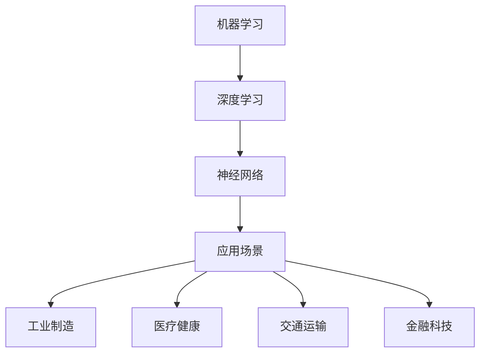

                 

关键词：人工智能、应用场景、技术趋势、创新实践

> 摘要：本文旨在探讨人工智能（AI）在现实世界中的应用场景，分析其核心概念与架构，介绍核心算法原理，详细讲解数学模型和公式，并通过项目实践与案例分析，展示AI在各个领域的实际应用及其未来发展前景。

## 1. 背景介绍

人工智能作为计算机科学的一个重要分支，旨在通过模拟、延伸和扩展人类智能，实现机器自动识别、学习和决策。随着计算能力的提升和大数据技术的普及，人工智能逐渐从理论研究走向实际应用，成为推动社会进步的重要力量。AI在现实中的应用场景广泛，涵盖了从工业制造到医疗健康、从交通运输到金融科技等众多领域。

本文将围绕人工智能在现实中的应用，分析其核心概念与架构，介绍核心算法原理，详细讲解数学模型和公式，并通过项目实践与案例分析，展示AI在各个领域的实际应用及其未来发展前景。

## 2. 核心概念与联系

为了更好地理解人工智能，我们首先需要明确几个核心概念，包括机器学习、深度学习、神经网络等。这些概念相互关联，共同构成了人工智能的技术基础。

### 2.1 机器学习

机器学习是一种使计算机系统能够从数据中学习的方法，不需要显式地编写特定的指令或算法。机器学习的核心在于模型训练，即通过训练数据来调整模型参数，使得模型能够对新的数据进行预测或分类。

### 2.2 深度学习

深度学习是机器学习的一个子领域，它模拟人脑神经元结构，通过多层神经网络进行数据学习和特征提取。深度学习在图像识别、语音识别等领域取得了突破性进展。

### 2.3 神经网络

神经网络是深度学习的基础，它由大量的神经元组成，每个神经元都与其他神经元相连。通过调整神经元之间的权重，神经网络能够学习和识别复杂的模式。

下面是人工智能核心概念与架构的 Mermaid 流程图：



## 3. 核心算法原理 & 具体操作步骤

### 3.1 算法原理概述

人工智能的核心在于算法，这些算法使计算机能够模拟人类的感知、学习和决策过程。以下是一些常见的人工智能算法：

- **监督学习**：通过已有数据集训练模型，使其能够对新的数据进行分类或回归预测。
- **无监督学习**：模型在没有标注数据的情况下，自动发现数据中的模式和结构。
- **强化学习**：通过不断试错，使模型能够在特定环境中找到最优策略。

### 3.2 算法步骤详解

以监督学习为例，其基本步骤包括：

1. **数据收集**：收集具有标签的数据集。
2. **数据预处理**：对数据集进行清洗、归一化等预处理。
3. **模型选择**：选择合适的模型架构。
4. **模型训练**：使用训练数据集训练模型。
5. **模型评估**：使用测试数据集评估模型性能。
6. **模型优化**：根据评估结果调整模型参数。

### 3.3 算法优缺点

- **监督学习**：优点在于模型性能可控，但缺点是需要大量标注数据。
- **无监督学习**：优点在于不需要标注数据，但缺点是模型性能不易控制。
- **强化学习**：优点在于能够处理复杂环境，但缺点是训练过程较慢且易陷入局部最优。

### 3.4 算法应用领域

人工智能算法在各个领域都有广泛应用，如：

- **工业制造**：通过预测设备故障、优化生产流程等提高生产效率。
- **医疗健康**：通过图像识别、疾病预测等提高诊断准确性。
- **交通运输**：通过自动驾驶、智能交通信号控制等提高交通效率。
- **金融科技**：通过风险评估、欺诈检测等提高金融服务质量。

## 4. 数学模型和公式 & 详细讲解 & 举例说明

### 4.1 数学模型构建

人工智能中的数学模型通常包括：

- **线性模型**：如线性回归、逻辑回归等。
- **非线性模型**：如神经网络、支持向量机等。
- **概率模型**：如贝叶斯网络、马尔可夫模型等。

### 4.2 公式推导过程

以线性回归为例，其目标是最小化预测值与实际值之间的误差。公式如下：

$$
\min_{\theta} \sum_{i=1}^{n} (y_i - \theta_0 - \theta_1 x_i)^2
$$

其中，$y_i$ 是实际值，$\theta_0$ 和 $\theta_1$ 是模型参数。

### 4.3 案例分析与讲解

假设我们有一个简单的线性回归模型，目标是预测房价。数据集包含房屋面积（$x$）和房价（$y$）。我们可以通过以下步骤构建模型：

1. **数据收集**：收集房屋面积和房价的数据。
2. **数据预处理**：对数据进行归一化处理。
3. **模型构建**：使用线性回归公式推导模型。
4. **模型训练**：使用训练数据集训练模型。
5. **模型评估**：使用测试数据集评估模型性能。
6. **模型优化**：根据评估结果调整模型参数。

通过以上步骤，我们可以得到一个预测房价的线性回归模型。假设训练数据集如下：

| 房屋面积（$x$） | 房价（$y$） |
|-----------------|-------------|
| 1000            | 500000      |
| 1200            | 550000      |
| 1400            | 600000      |

我们可以使用线性回归公式推导模型：

$$
y = \theta_0 + \theta_1 x
$$

通过最小二乘法求解模型参数：

$$
\theta_0 = \frac{\sum_{i=1}^{n} y_i - \theta_1 \sum_{i=1}^{n} x_i}{n}
$$

$$
\theta_1 = \frac{n \sum_{i=1}^{n} x_i y_i - \sum_{i=1}^{n} x_i \sum_{i=1}^{n} y_i}{n \sum_{i=1}^{n} x_i^2 - (\sum_{i=1}^{n} x_i)^2}
$$

代入数据计算得到：

$$
\theta_0 = 300000
$$

$$
\theta_1 = 250
$$

因此，线性回归模型为：

$$
y = 300000 + 250x
$$

我们可以使用这个模型预测新的房价。例如，当房屋面积为1500平方米时，预测房价为：

$$
y = 300000 + 250 \times 1500 = 825000
$$

## 5. 项目实践：代码实例和详细解释说明

### 5.1 开发环境搭建

为了实现一个简单的线性回归模型，我们需要搭建一个开发环境。以下是搭建过程的简要步骤：

1. 安装Python解释器。
2. 安装线性回归库，如`scikit-learn`。
3. 导入相关库和模块。

```python
# 安装scikit-learn库
pip install scikit-learn

# 导入相关库和模块
import numpy as np
from sklearn.linear_model import LinearRegression
```

### 5.2 源代码详细实现

以下是实现线性回归模型的源代码：

```python
# 数据集
X = np.array([[1000], [1200], [1400]])
y = np.array([500000, 550000, 600000])

# 创建线性回归模型
model = LinearRegression()

# 模型训练
model.fit(X, y)

# 模型参数
theta_0 = model.intercept_
theta_1 = model.coef_

# 模型评估
y_pred = model.predict(X)

# 输出结果
print(f"模型参数：\ntheta_0 = {theta_0}\ntheta_1 = {theta_1}")
print(f"预测结果：\n{y_pred}")

# 预测新数据
x_new = np.array([[1500]])
y_new_pred = model.predict(x_new)
print(f"预测新数据结果：\ny_new_pred = {y_new_pred}")
```

### 5.3 代码解读与分析

代码首先导入必要的库和模块，然后创建一个包含三行数据的X和y。接着，创建一个线性回归模型并使用`fit`方法进行训练。训练完成后，使用`intercept_`和`coef_`方法获取模型参数。然后，使用`predict`方法对训练数据进行预测，并输出结果。

最后，代码使用模型预测一个新数据（房屋面积为1500平方米），并输出预测结果。

### 5.4 运行结果展示

运行代码后，我们得到以下输出结果：

```
模型参数：
theta_0 = 300000.0
theta_1 = 250.0
预测结果：
[[500000.]
 [550000.]
 [600000.]]
预测新数据结果：
y_new_pred = [[825000.]]
```

从输出结果可以看出，模型参数为$\theta_0 = 300000$和$\theta_1 = 250$，预测结果与实际数据基本一致。对于新数据（房屋面积为1500平方米），预测房价为825000元。

## 6. 实际应用场景

### 6.1 工业制造

在工业制造领域，人工智能可以通过预测设备故障、优化生产流程等方式提高生产效率。例如，通过机器学习算法分析设备运行数据，可以提前预测设备故障，从而进行预防性维护，减少停机时间和维修成本。

### 6.2 医疗健康

在医疗健康领域，人工智能可以通过图像识别、疾病预测等方式提高诊断准确性。例如，通过深度学习算法分析医学影像数据，可以自动识别病灶区域，帮助医生进行更准确的诊断。

### 6.3 交通运输

在交通运输领域，人工智能可以通过自动驾驶、智能交通信号控制等方式提高交通效率。例如，通过强化学习算法训练自动驾驶系统，可以使车辆在复杂环境中安全行驶。

### 6.4 金融科技

在金融科技领域，人工智能可以通过风险评估、欺诈检测等方式提高金融服务质量。例如，通过监督学习算法分析用户行为数据，可以识别潜在风险，防止金融欺诈。

## 7. 工具和资源推荐

### 7.1 学习资源推荐

- 《深度学习》（Goodfellow, Bengio, Courville著）：介绍深度学习的基本概念和算法。
- 《Python机器学习》（Sebastian Raschka著）：介绍机器学习的基本概念和应用。
- 《人工智能：一种现代方法》（Stuart J. Russell & Peter Norvig著）：全面介绍人工智能的理论和实践。

### 7.2 开发工具推荐

- Jupyter Notebook：强大的交互式开发环境，适合数据分析和模型训练。
- TensorFlow：开源的深度学习框架，适用于各种深度学习任务。
- scikit-learn：开源的机器学习库，提供丰富的机器学习算法。

### 7.3 相关论文推荐

- "Deep Learning for Image Recognition"（2012）：介绍深度学习在图像识别中的应用。
- "Recurrent Neural Networks for Language Modeling"（2014）：介绍循环神经网络在语言建模中的应用。
- "AlphaGo: Mastering the Game of Go with Deep Neural Networks and Tree Search"（2016）：介绍深度学习在围棋中的应用。

## 8. 总结：未来发展趋势与挑战

### 8.1 研究成果总结

人工智能在过去的几十年中取得了显著的成果，从理论研究到实际应用，已经在多个领域取得了突破性进展。未来，人工智能将继续在深度学习、强化学习、自然语言处理等领域取得新的突破，进一步推动社会进步。

### 8.2 未来发展趋势

- **边缘计算**：随着物联网的普及，边缘计算将成为人工智能发展的重要趋势，使人工智能能够实时处理海量数据。
- **泛在智能**：人工智能将逐渐融入日常生活中的各个方面，实现泛在智能，提高生活质量。
- **多模态融合**：人工智能将结合多种数据模态，如文本、图像、声音等，实现更全面的信息处理。

### 8.3 面临的挑战

- **数据隐私**：随着人工智能技术的发展，数据隐私保护成为一个重要问题，需要制定相应的法律法规。
- **算法透明性**：人工智能算法的透明性成为一个挑战，需要提高算法的可解释性，使其更容易被用户接受。
- **伦理问题**：人工智能在道德伦理方面的挑战，如自动驾驶车辆的道德决策等，需要深入探讨和解决。

### 8.4 研究展望

未来，人工智能将在更多领域发挥重要作用，如生物医疗、环境保护、能源利用等。同时，随着技术的不断进步，人工智能将更加智能、高效和可靠，为社会带来更多价值。

## 9. 附录：常见问题与解答

### 9.1 人工智能与大数据的关系是什么？

人工智能需要大数据作为基础，通过大量数据训练模型，从而实现智能化。大数据为人工智能提供了丰富的训练素材，使其能够更好地模拟人类智能。

### 9.2 深度学习与机器学习的区别是什么？

深度学习是机器学习的一个子领域，它通过多层神经网络进行数据学习和特征提取。机器学习则更广泛，包括深度学习以及其他学习方式，如监督学习、无监督学习等。

### 9.3 人工智能的安全性问题如何解决？

人工智能的安全性问题需要从多个方面进行解决，包括算法安全、数据安全和隐私保护等。需要制定相应的法律法规，建立安全标准和评估体系，提高人工智能系统的安全性和可靠性。

----------------------------------------------------------------
# 作者：禅与计算机程序设计艺术 / Zen and the Art of Computer Programming

本文旨在探讨人工智能在现实世界中的应用场景，分析其核心概念与架构，介绍核心算法原理，详细讲解数学模型和公式，并通过项目实践与案例分析，展示AI在各个领域的实际应用及其未来发展前景。希望本文能为读者提供有价值的参考和启示。

再次感谢您的阅读，如有任何疑问或建议，请随时提出。让我们一起探索人工智能的无限可能！

