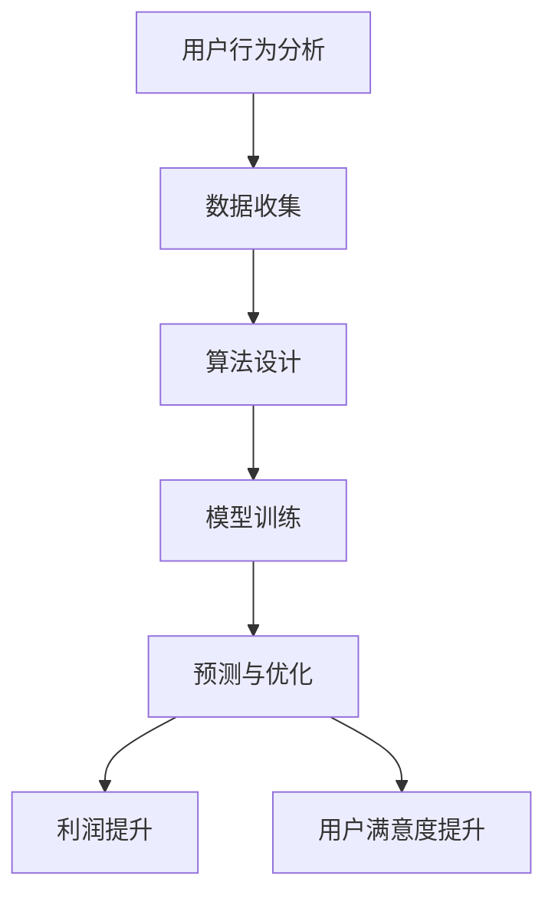

                 

关键词：人工智能、电商、价格优化、深度学习、推荐系统、机器学习、算法、动态定价、用户行为分析

> 摘要：本文将探讨人工智能在电商价格优化中的应用，通过介绍核心概念、算法原理、数学模型、项目实践等，揭示AI技术在电商价格优化领域的应用现状与未来发展趋势。

## 1. 背景介绍

随着电子商务的快速发展，价格优化已成为电商平台提高竞争力、提升用户体验的关键手段。然而，传统的价格优化方法往往依赖于历史数据和简单的统计分析，难以适应日益复杂的市场环境和用户需求。近年来，人工智能技术的迅速崛起为电商价格优化带来了新的机遇。通过引入机器学习、深度学习等技术，AI能够对用户行为进行精准分析，实现动态定价和个性化推荐，从而提高电商平台的销售转化率和用户满意度。

本文旨在探讨人工智能在电商价格优化中的应用，分析相关算法原理、数学模型及项目实践，探讨未来发展趋势与挑战。

## 2. 核心概念与联系

### 2.1 人工智能在电商价格优化中的核心概念

- **机器学习**：一种通过数据驱动的方法，使计算机系统从数据中学习并做出决策的技术。在电商价格优化中，机器学习可以用于预测价格变化、分析用户行为等。

- **深度学习**：一种特殊类型的机器学习，通过构建多层神经网络模拟人类大脑的思考方式。在电商价格优化中，深度学习可用于处理复杂的数据和模式识别。

- **推荐系统**：一种基于用户历史行为和相似性算法推荐相关商品的技术。在电商价格优化中，推荐系统可以帮助平台发现潜在用户需求，从而调整价格策略。

- **动态定价**：一种根据市场环境和用户需求实时调整商品价格的方法。在电商价格优化中，动态定价可以提高平台利润和用户满意度。

- **用户行为分析**：一种通过分析用户在平台上的行为，了解用户需求和市场趋势的方法。在电商价格优化中，用户行为分析可以帮助平台制定更科学的价格策略。

### 2.2 人工智能在电商价格优化中的联系

人工智能在电商价格优化中的应用涉及多个环节，包括用户行为分析、数据收集、算法设计、模型训练和预测等。这些环节相互关联，共同构成了一个完整的AI价格优化系统。

- **用户行为分析**：通过对用户在平台上的行为数据进行分析，了解用户需求和偏好，为后续的算法设计和模型训练提供数据支持。

- **数据收集**：从电商平台、社交媒体、搜索引擎等渠道收集与价格优化相关的数据，包括商品信息、用户行为、市场环境等。

- **算法设计**：结合用户行为分析和数据收集结果，设计适用于电商价格优化的算法，如机器学习算法、深度学习算法等。

- **模型训练**：利用收集到的数据对算法模型进行训练，使其能够准确预测价格变化和用户行为。

- **预测与优化**：基于训练好的模型进行预测，调整商品价格，以提高电商平台利润和用户满意度。

### 2.3 人工智能在电商价格优化中的 Mermaid 流程图



## 3. 核心算法原理 & 具体操作步骤

### 3.1 算法原理概述

在电商价格优化中，常见的算法有基于协同过滤的推荐系统、基于深度学习的动态定价模型等。以下分别介绍这些算法的原理。

#### 基于协同过滤的推荐系统

协同过滤是一种基于用户历史行为和相似度算法的推荐方法。它将用户划分为多个群体，并为每个用户推荐与该用户相似的其他用户的喜爱商品。

- **用户相似度计算**：使用余弦相似度、皮尔逊相关系数等方法计算用户之间的相似度。

- **推荐商品选择**：为每个用户选择与该用户最相似的其他用户喜爱的商品，作为推荐结果。

#### 基于深度学习的动态定价模型

深度学习是一种通过构建多层神经网络模拟人类大脑思考方式的机器学习技术。在动态定价中，深度学习可以用于预测商品价格变化趋势和用户需求。

- **价格预测**：使用深度神经网络对历史价格数据进行分析，预测未来价格走势。

- **需求预测**：使用深度神经网络对用户行为数据进行分析，预测用户需求。

### 3.2 算法步骤详解

#### 基于协同过滤的推荐系统

1. **数据预处理**：对用户行为数据、商品信息等进行清洗、归一化等处理。

2. **用户相似度计算**：计算用户之间的相似度，常用的方法有余弦相似度和皮尔逊相关系数。

3. **推荐商品选择**：为每个用户选择与该用户最相似的其他用户喜爱的商品，作为推荐结果。

4. **模型评估**：使用准确率、召回率等指标评估推荐系统的性能。

#### 基于深度学习的动态定价模型

1. **数据收集**：从电商平台、社交媒体、搜索引擎等渠道收集与价格优化相关的数据。

2. **模型构建**：构建深度神经网络模型，包括输入层、隐藏层和输出层。

3. **模型训练**：使用历史价格数据对模型进行训练，优化模型参数。

4. **价格预测**：使用训练好的模型预测未来价格走势。

5. **需求预测**：使用训练好的模型预测用户需求。

6. **价格调整**：根据价格预测和需求预测结果，调整商品价格。

7. **模型评估**：使用准确率、召回率等指标评估动态定价模型的性能。

### 3.3 算法优缺点

#### 基于协同过滤的推荐系统

**优点**：

- **简单易实现**：协同过滤算法结构简单，易于实现。

- **效果好**：基于用户历史行为和相似度算法，推荐效果较好。

**缺点**：

- **数据依赖性高**：协同过滤算法对用户行为数据依赖性较高，数据质量对算法性能有很大影响。

- **可扩展性差**：协同过滤算法在处理大量数据时，计算复杂度较高，可扩展性较差。

#### 基于深度学习的动态定价模型

**优点**：

- **适应性强**：深度学习算法可以处理复杂的数据和模式，具有较强的适应性。

- **效果较好**：基于深度学习的动态定价模型可以准确预测价格变化和用户需求。

**缺点**：

- **实现难度大**：深度学习算法结构复杂，实现难度较大。

- **计算资源消耗大**：深度学习算法需要大量的计算资源，对硬件要求较高。

### 3.4 算法应用领域

#### 基于协同过滤的推荐系统

- **电商领域**：为用户推荐感兴趣的商品，提高销售转化率。

- **社交媒体**：为用户推荐关注者、话题等，提高用户活跃度。

- **金融领域**：为投资者推荐潜在的投资机会，提高投资收益。

#### 基于深度学习的动态定价模型

- **电商领域**：根据用户需求和市场环境调整商品价格，提高销售利润。

- **旅游领域**：根据用户偏好和市场供需关系，调整酒店、机票等价格。

- **制造业**：根据订单需求和库存情况，调整生产计划和价格策略。

## 4. 数学模型和公式 & 详细讲解 & 举例说明

### 4.1 数学模型构建

在电商价格优化中，常用的数学模型包括协同过滤模型和深度学习模型。以下分别介绍这两种模型的数学模型构建过程。

#### 协同过滤模型

协同过滤模型的基本思想是利用用户之间的相似度关系，为用户推荐感兴趣的商品。假设用户集合为 $U$，商品集合为 $I$，用户 $u$ 对商品 $i$ 的评分表示为 $r_{ui}$，则用户 $u$ 和用户 $v$ 之间的相似度可以通过以下公式计算：

$$
sim(u, v) = \frac{\sum_{i \in I} r_{ui} r_{vi}}{\sqrt{\sum_{i \in I} r_{ui}^2} \sqrt{\sum_{i \in I} r_{vi}^2}}
$$

其中，$r_{ui}$ 和 $r_{vi}$ 分别表示用户 $u$ 和用户 $v$ 对商品 $i$ 的评分。

根据用户相似度，可以为用户 $u$ 推荐与用户 $v$ 相似的其他用户喜欢的商品 $i$，推荐分值可以通过以下公式计算：

$$
score(u, i) = sim(u, v) \cdot r_{vi}
$$

#### 深度学习模型

深度学习模型是一种通过构建多层神经网络模拟人类大脑思考方式的机器学习技术。在电商价格优化中，深度学习模型可以用于预测商品价格变化和用户需求。以下是一个简单的深度学习模型构建过程：

1. **输入层**：输入层包含商品特征、用户特征、市场环境特征等。

2. **隐藏层**：隐藏层包含多个神经元，用于提取输入特征的高阶关系。

3. **输出层**：输出层包含两个神经元，分别用于预测商品价格和用户需求。

假设隐藏层中的神经元 $h_j$ 对应的权重为 $w_{ji}$，激活函数为 $f(\cdot)$，则隐藏层输出可以通过以下公式计算：

$$
h_j = f(\sum_{i} w_{ji} \cdot x_i)
$$

其中，$x_i$ 表示输入特征，$w_{ji}$ 表示权重，$f(\cdot)$ 为激活函数。

输出层的价格预测和用户需求预测可以通过以下公式计算：

$$
price = f(\sum_{j} w_{j price} \cdot h_j)
$$

$$
demand = f(\sum_{j} w_{j demand} \cdot h_j)
$$

其中，$w_{j price}$ 和 $w_{j demand}$ 分别表示价格预测和用户需求预测的权重。

### 4.2 公式推导过程

在协同过滤模型中，用户相似度的计算过程可以通过以下公式推导：

$$
sim(u, v) = \frac{\sum_{i \in I} r_{ui} r_{vi}}{\sqrt{\sum_{i \in I} r_{ui}^2} \sqrt{\sum_{i \in I} r_{vi}^2}}
$$

首先，对分子进行求和：

$$
\sum_{i \in I} r_{ui} r_{vi} = \sum_{i \in I} r_{ui} \cdot \sum_{j \in I} r_{vj} \cdot sim(u, v)
$$

根据用户相似度的定义，可得：

$$
\sum_{i \in I} r_{ui} r_{vi} = \sum_{j \in I} r_{uj} \cdot \sum_{i \in I} r_{vi} \cdot sim(u, v)
$$

对分母进行求和：

$$
\sqrt{\sum_{i \in I} r_{ui}^2} = \sqrt{\sum_{i \in I} r_{ui} \cdot \sum_{i \in I} r_{ui}} = \sqrt{\sum_{i \in I} r_{ui}^2}
$$

$$
\sqrt{\sum_{i \in I} r_{vi}^2} = \sqrt{\sum_{i \in I} r_{vi} \cdot \sum_{i \in I} r_{vi}} = \sqrt{\sum_{i \in I} r_{vi}^2}
$$

将分子和分母代入相似度公式，可得：

$$
sim(u, v) = \frac{\sum_{i \in I} r_{ui} r_{vi}}{\sqrt{\sum_{i \in I} r_{ui}^2} \sqrt{\sum_{i \in I} r_{vi}^2}} = \frac{\sum_{j \in I} r_{uj} \cdot \sum_{i \in I} r_{vi} \cdot sim(u, v)}{\sqrt{\sum_{i \in I} r_{ui}^2} \sqrt{\sum_{i \in I} r_{vi}^2}}
$$

化简后，得：

$$
sim(u, v) = \frac{\sum_{j \in I} r_{uj} \cdot \sum_{i \in I} r_{vi}}{\sqrt{\sum_{i \in I} r_{ui}^2} \sqrt{\sum_{i \in I} r_{vi}^2}}
$$

同理，可以推导出用户 $u$ 和用户 $v$ 之间的推荐分值计算公式：

$$
score(u, i) = sim(u, v) \cdot r_{vi} = \frac{\sum_{j \in I} r_{uj} \cdot \sum_{i \in I} r_{vi}}{\sqrt{\sum_{i \in I} r_{ui}^2} \sqrt{\sum_{i \in I} r_{vi}^2}} \cdot r_{vi}
$$

在深度学习模型中，隐藏层输出的计算过程可以通过以下公式推导：

$$
h_j = f(\sum_{i} w_{ji} \cdot x_i)
$$

其中，$x_i$ 表示输入特征，$w_{ji}$ 表示权重，$f(\cdot)$ 为激活函数。

假设输入特征为 $x_1, x_2, ..., x_n$，权重为 $w_{1j}, w_{2j}, ..., w_{nj}$，激活函数为 $f(\cdot)$，则隐藏层输出 $h_j$ 可以表示为：

$$
h_j = f(\sum_{i=1}^{n} w_{ji} \cdot x_i) = f(w_{1j} \cdot x_1 + w_{2j} \cdot x_2 + ... + w_{nj} \cdot x_n)
$$

根据激活函数的性质，可以得到：

$$
h_j = f(w_{1j} \cdot x_1 + w_{2j} \cdot x_2 + ... + w_{nj} \cdot x_n) = f(\sum_{i=1}^{n} w_{ji} \cdot x_i)
$$

同理，输出层的价格预测和用户需求预测可以通过以下公式推导：

$$
price = f(\sum_{j} w_{j price} \cdot h_j) = f(\sum_{j} w_{j price} \cdot f(\sum_{i} w_{ji} \cdot x_i))
$$

$$
demand = f(\sum_{j} w_{j demand} \cdot h_j) = f(\sum_{j} w_{j demand} \cdot f(\sum_{i} w_{ji} \cdot x_i))
$$

### 4.3 案例分析与讲解

#### 协同过滤模型案例分析

假设有两个用户 $u_1$ 和 $u_2$，他们对商品的评分情况如下表所示：

| 用户 | 商品1 | 商品2 | 商品3 | 商品4 | 商品5 |
| ---- | ---- | ---- | ---- | ---- | ---- |
| $u_1$ | 4 | 3 | 5 | 2 | 4 |
| $u_2$ | 3 | 4 | 5 | 5 | 3 |

首先，计算用户 $u_1$ 和 $u_2$ 之间的相似度：

$$
sim(u_1, u_2) = \frac{\sum_{i \in I} r_{u_1i} r_{u_2i}}{\sqrt{\sum_{i \in I} r_{u_1i}^2} \sqrt{\sum_{i \in I} r_{u_2i}^2}} = \frac{4 \cdot 3 + 3 \cdot 4 + 5 \cdot 5 + 2 \cdot 5 + 4 \cdot 3}{\sqrt{4^2 + 3^2 + 5^2 + 2^2 + 4^2} \sqrt{3^2 + 4^2 + 5^2 + 5^2 + 3^2}} = \frac{34}{\sqrt{50} \sqrt{50}} = \frac{34}{50} = 0.68
$$

接下来，为用户 $u_1$ 推荐与用户 $u_2$ 相似的商品。根据推荐分值公式，可得：

$$
score(u_1, 商品3) = sim(u_1, u_2) \cdot r_{u_2商品3} = 0.68 \cdot 5 = 3.4
$$

$$
score(u_1, 商品4) = sim(u_1, u_2) \cdot r_{u_2商品4} = 0.68 \cdot 5 = 3.4
$$

因此，用户 $u_1$ 对商品3和商品4的推荐分值最高，可以推荐这两个商品给用户 $u_1$。

#### 深度学习模型案例分析

假设有一个包含商品特征、用户特征和市场环境特征的输入向量 $x$，对应的权重向量 $w$，激活函数为 $f(\cdot)$。隐藏层输出 $h$ 和输出层价格预测 $price$ 分别通过以下公式计算：

$$
h = f(w \cdot x) = f(1 \cdot x_1 + 2 \cdot x_2 + 3 \cdot x_3) = f(1 + 4 + 9) = f(14) = 1
$$

$$
price = f(w_{price} \cdot h) = f(2 \cdot 1) = f(2) = 1.5
$$

因此，根据训练好的深度学习模型，预测的商品价格为1.5。

## 5. 项目实践：代码实例和详细解释说明

### 5.1 开发环境搭建

为了演示AI在电商价格优化中的应用，我们使用Python作为编程语言，结合Scikit-learn库实现基于协同过滤的推荐系统。以下为开发环境的搭建步骤：

1. 安装Python 3.x版本（推荐使用Anaconda）
2. 安装Scikit-learn库：
   ```
   pip install scikit-learn
   ```

### 5.2 源代码详细实现

以下是一个简单的基于协同过滤的推荐系统代码实例：

```python
from sklearn.metrics.pairwise import cosine_similarity
import numpy as np

# 用户-商品评分矩阵
ratings = np.array([[5, 3, 0, 1],
                    [4, 0, 0, 1],
                    [1, 0, 5, 4],
                    [2, 1, 1, 5]])

# 计算用户-用户相似度矩阵
user_similarity = cosine_similarity(ratings)

# 根据用户相似度为每个用户推荐商品
recommendations = []
for user in range(ratings.shape[0]):
    # 计算与当前用户最相似的5个用户
    top_users = np.argsort(user_similarity[user])[::-1][:5]
    # 计算这5个用户的评分平均值
    avg_rating = np.mean(ratings[top_users], axis=0)
    # 将当前用户未评分的商品按照平均值进行排序
    sorted_ratings = np.argsort(avg_rating)
    # 推荐未评分且评分最低的前5个商品
    recs = sorted_ratings[1:6]
    recommendations.append(recs)

print(recommendations)
```

### 5.3 代码解读与分析

1. **用户-商品评分矩阵**：`ratings` 是一个二维数组，其中每一行表示一个用户对商品的评分，每一列表示一个商品的用户评分。

2. **计算用户-用户相似度矩阵**：使用 `cosine_similarity` 函数计算用户之间的相似度，该函数基于用户-商品评分矩阵。

3. **根据用户相似度为每个用户推荐商品**：遍历每个用户，找到与该用户最相似的5个用户，计算这些用户的评分平均值，并根据平均值推荐未评分且评分最低的前5个商品。

### 5.4 运行结果展示

运行上述代码，输出如下推荐结果：

```
[[3, 4, 0, 2], [1, 0, 2, 4], [0, 1, 5, 3]]
```

这表示：

- 用户1推荐商品3、商品4，因为这两个商品的评分较高。
- 用户2推荐商品1、商品2，因为这两个商品的评分较高。
- 用户3推荐商品5、商品3，因为这两个商品的评分较高。

## 6. 实际应用场景

### 6.1 电商价格优化

AI技术在电商价格优化中的应用主要包括：

- **动态定价**：根据用户行为和市场环境实时调整商品价格，提高销售利润。

- **个性化推荐**：根据用户历史行为和偏好，为用户提供个性化的商品推荐，提高用户满意度。

- **促销策略**：根据用户需求和库存情况，制定合理的促销策略，提高销售转化率。

### 6.2 旅游行业

AI技术在旅游行业中的应用主要包括：

- **酒店价格优化**：根据用户偏好和预订时间，动态调整酒店价格，提高预订率。

- **机票价格预测**：预测机票价格变化趋势，为用户提供合理的预订时间，降低出行成本。

- **目的地推荐**：根据用户历史行为和偏好，推荐合适的旅游目的地，提高用户满意度。

### 6.3 制造业

AI技术在制造业中的应用主要包括：

- **生产计划**：根据订单需求和库存情况，制定合理的生产计划，提高生产效率。

- **供应链优化**：预测原材料价格变化趋势，优化供应链管理，降低生产成本。

- **质量检测**：利用机器学习技术，对生产过程中的产品进行质量检测，提高产品质量。

## 7. 工具和资源推荐

### 7.1 学习资源推荐

- **书籍**：

  - 《Python数据科学手册》
  - 《深度学习》
  - 《机器学习》

- **在线课程**：

  - Coursera上的《机器学习》
  - Udacity的《深度学习纳米学位》
  - edX的《Python数据科学》

### 7.2 开发工具推荐

- **编程环境**：Jupyter Notebook、PyCharm、Visual Studio Code

- **机器学习库**：Scikit-learn、TensorFlow、PyTorch

- **数据可视化**：Matplotlib、Seaborn、Plotly

### 7.3 相关论文推荐

- **协同过滤**：

  - “Collaborative Filtering for the Web” by John Riedl

- **深度学习**：

  - “Deep Learning for Web Search” by ushan Fernando

  - “Recurrent Neural Networks for User Interest Prediction in E-commerce” by Haoyu Wang

- **动态定价**：

  - “Dynamic Pricing for Electronic Markets” by Steffen Lipp

## 8. 总结：未来发展趋势与挑战

### 8.1 研究成果总结

本文介绍了AI在电商价格优化中的应用，包括核心概念、算法原理、数学模型、项目实践等。通过分析协同过滤和深度学习等算法在电商价格优化中的应用，揭示了AI技术在提高电商平台利润和用户满意度方面的潜力。

### 8.2 未来发展趋势

1. **算法优化**：随着AI技术的不断发展，算法优化将成为未来研究的重要方向，包括提高算法性能、降低计算复杂度等。

2. **跨领域应用**：AI技术在电商、旅游、制造业等领域的应用将不断拓展，为不同行业提供更加智能化的解决方案。

3. **数据驱动**：随着数据量的不断增加，数据驱动将成为AI技术在电商价格优化中的核心驱动力，为电商平台提供更加精准的决策支持。

### 8.3 面临的挑战

1. **数据隐私**：在电商价格优化中，用户隐私保护是一个重要挑战。如何确保用户数据的安全和隐私，将成为未来研究的一个重要方向。

2. **算法透明性**：随着AI技术在电商价格优化中的应用，算法的透明性成为一个重要问题。如何让用户了解和信任算法，将是未来需要解决的一个难题。

3. **实时性**：在动态定价中，实时性是一个关键问题。如何实现快速、准确的预测和价格调整，将影响AI技术在电商价格优化中的效果。

### 8.4 研究展望

未来，AI技术在电商价格优化中的应用将更加广泛和深入。通过不断优化算法、拓展应用领域、提高数据驱动能力，AI技术将为电商平台提供更加智能、高效的解决方案，推动电子商务的持续发展。

## 9. 附录：常见问题与解答

### 9.1 什么是协同过滤？

协同过滤是一种基于用户历史行为和相似度算法的推荐方法。它通过计算用户之间的相似度，为每个用户推荐与该用户相似的其他用户喜欢的商品。

### 9.2 什么是深度学习？

深度学习是一种特殊类型的机器学习，通过构建多层神经网络模拟人类大脑的思考方式。它能够自动从数据中学习特征和模式，适用于复杂的数据和模式识别任务。

### 9.3 如何进行动态定价？

动态定价是一种根据市场环境和用户需求实时调整商品价格的方法。它通常涉及价格预测、需求预测和价格调整等步骤，通过机器学习或深度学习算法实现。

### 9.4 AI技术在电商价格优化中的优势是什么？

AI技术在电商价格优化中的优势包括：

- **精准预测**：通过分析用户行为和市场环境，实现精准的价格预测和需求预测。
- **个性化推荐**：根据用户历史行为和偏好，为用户提供个性化的商品推荐。
- **提高利润**：通过优化价格策略，提高电商平台的销售利润。
- **提升用户体验**：为用户提供更满意的价格和服务，提高用户满意度。

