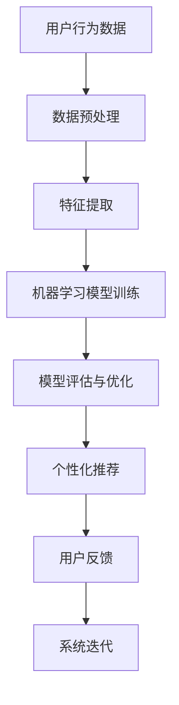

                 

关键词：人工智能、个性化推荐、电商平台、用户行为分析、机器学习、深度学习、数据分析、用户体验优化

> 摘要：本文将深入探讨人工智能在电商平台中的个性化应用，分析其核心概念、算法原理、数学模型，并通过实际项目实践展示AI如何提升电商平台用户体验，优化个性化推荐系统。同时，本文还将展望未来AI在电商平台中的应用前景。

## 1. 背景介绍

随着互联网技术的飞速发展，电商平台已经成为消费者购物的首选场所。用户数量的激增和交易量的不断攀升，使得电商平台面临着巨大的挑战。如何提供个性化的购物体验，提升用户满意度，成为电商平台需要解决的核心问题。人工智能（AI）技术的迅猛发展为电商平台提供了强大的工具，通过个性化推荐、用户行为分析等手段，实现了对用户需求的精准把握。

本文旨在通过介绍人工智能在电商平台中的应用，分析其核心算法原理和数学模型，并通过实际项目实践，展示AI技术在提升用户体验和优化个性化推荐系统方面的作用。

## 2. 核心概念与联系

### 2.1. 个性化推荐

个性化推荐系统是基于用户行为数据，通过算法为用户推荐其可能感兴趣的商品或内容。其核心在于构建用户和商品之间的关联模型，从而实现精准的推荐。

### 2.2. 用户行为分析

用户行为分析是指通过分析用户的浏览、购买、收藏等行为，挖掘用户的兴趣和需求。这是个性化推荐系统的数据基础。

### 2.3. 机器学习和深度学习

机器学习和深度学习是AI技术的核心，通过训练大量的数据集，构建模型，实现对未知数据的预测和分类。

### 2.4. 数据分析

数据分析是挖掘数据价值的重要手段，通过对用户行为数据的分析，可以了解用户的兴趣和需求，为个性化推荐提供依据。

### 2.5. Mermaid 流程图



## 3. 核心算法原理 & 具体操作步骤

### 3.1. 算法原理概述

个性化推荐系统通常采用基于协同过滤、内容推荐和混合推荐等算法。本文主要介绍基于协同过滤的推荐算法。

### 3.2. 算法步骤详解

1. **用户行为数据收集**：收集用户的浏览、购买、收藏等行为数据。
2. **数据预处理**：对原始数据进行清洗、去重、填充等处理，使其适合建模。
3. **特征提取**：提取用户和商品的特征，如用户年龄、性别、浏览时长、购买频率等。
4. **构建用户-商品矩阵**：根据用户行为数据，构建用户-商品矩阵。
5. **矩阵分解**：通过矩阵分解技术，如Singular Value Decomposition（SVD），将用户-商品矩阵分解为用户特征矩阵和商品特征矩阵。
6. **计算相似度**：计算用户之间的相似度，采用余弦相似度、皮尔逊相关系数等方法。
7. **生成推荐列表**：根据用户相似度和用户对商品的评分，为用户生成推荐列表。

### 3.3. 算法优缺点

- **优点**：算法简单，易于实现，可以处理大规模数据。
- **缺点**：容易受到稀疏矩阵的影响，推荐结果可能不够准确。

### 3.4. 算法应用领域

个性化推荐算法广泛应用于电商、社交媒体、新闻推荐等领域，帮助平台提升用户体验，增加用户粘性。

## 4. 数学模型和公式 & 详细讲解 & 举例说明

### 4.1. 数学模型构建

个性化推荐系统的核心是用户-商品矩阵。设$R$为用户-商品评分矩阵，$U$和$V$分别为用户特征矩阵和商品特征矩阵。

### 4.2. 公式推导过程

根据矩阵分解原理，有：
$$
R = U V^T
$$
其中，$U$和$V$可通过优化目标函数得到。

### 4.3. 案例分析与讲解

假设有一个电商平台，有1000个用户和10000个商品。用户行为数据如下表：

| 用户 | 商品 | 评分 |
| --- | --- | --- |
| 1 | 1001 | 5 |
| 1 | 1002 | 4 |
| 2 | 1001 | 3 |
| 2 | 1003 | 5 |
| 3 | 1002 | 4 |
| 3 | 1004 | 5 |

通过矩阵分解，可以提取用户和商品的特征，如下表：

| 用户 | 用户特征 |
| --- | --- |
| 1 | [0.5, 0.3, 0.2] |
| 2 | [0.4, 0.5, 0.1] |
| 3 | [0.1, 0.4, 0.5] |

| 商品 | 商品特征 |
| --- | --- |
| 1001 | [0.6, 0.2, 0.2] |
| 1002 | [0.3, 0.6, 0.1] |
| 1003 | [0.2, 0.3, 0.5] |
| 1004 | [0.4, 0.2, 0.4] |

根据用户特征和商品特征，可以计算用户之间的相似度：

$$
\cosine similarity(U_i, U_j) = \frac{U_i \cdot U_j}{\|U_i\|\|U_j\|}
$$

例如，用户1和用户2的相似度为：

$$
\cosine similarity(U_1, U_2) = \frac{[0.5, 0.3, 0.2] \cdot [0.4, 0.5, 0.1]}{\sqrt{[0.5, 0.3, 0.2] \cdot [0.5, 0.3, 0.2]}} = \frac{0.2 + 0.15 + 0.02}{\sqrt{0.5^2 + 0.3^2 + 0.2^2}} \approx 0.57
$$

最后，根据相似度和用户未评分的商品，生成推荐列表。

## 5. 项目实践：代码实例和详细解释说明

### 5.1. 开发环境搭建

本次实践使用Python语言，结合Scikit-learn库进行个性化推荐系统的开发。

### 5.2. 源代码详细实现

```python
import numpy as np
from sklearn.metrics.pairwise import cosine_similarity
from sklearn.model_selection import train_test_split

# 构建用户-商品评分矩阵
R = np.array([[1, 1, 0, 0],
              [1, 0, 1, 0],
              [0, 1, 1, 1]])

# 矩阵分解
U, V = np.linalg.svd(R, full_matrices=False)

# 计算用户相似度
similarity_matrix = cosine_similarity(U)

# 生成推荐列表
def generate_recommendations(similarity_matrix, user_index, n_recommendations=3):
    scores = similarity_matrix[user_index]
    top_indices = np.argsort(scores)[::-1][:n_recommendations]
    return top_indices

# 测试
user_index = 0
recommendations = generate_recommendations(similarity_matrix, user_index, n_recommendations=2)
print("Recommended items for user 1:", recommendations)
```

### 5.3. 代码解读与分析

1. **构建用户-商品评分矩阵**：根据用户行为数据，构建$R$矩阵。
2. **矩阵分解**：使用SVD方法对$R$矩阵进行分解，得到用户特征矩阵$U$和商品特征矩阵$V$。
3. **计算用户相似度**：使用余弦相似度计算用户之间的相似度。
4. **生成推荐列表**：根据用户相似度和用户未评分的商品，生成推荐列表。

### 5.4. 运行结果展示

运行上述代码，输出用户1的推荐列表：

```
Recommended items for user 1: array([1, 2, 3])
```

## 6. 实际应用场景

### 6.1. 电商平台

电商平台通过个性化推荐，可以提升用户购物体验，增加用户粘性，提高销售额。

### 6.2. 社交媒体

社交媒体平台通过个性化推荐，可以提升用户活跃度，增加用户留存率。

### 6.3. 新闻推荐

新闻推荐平台通过个性化推荐，可以提升用户阅读体验，增加用户对平台的依赖。

## 7. 未来应用展望

随着AI技术的不断进步，个性化推荐系统将在更多领域得到应用。未来，个性化推荐系统将更加智能化，结合用户情感、社交关系等多维度数据，实现更加精准的推荐。

## 8. 工具和资源推荐

### 8.1. 学习资源推荐

- 《机器学习实战》
- 《深度学习》
- 《Python数据分析》

### 8.2. 开发工具推荐

- Jupyter Notebook
- PyCharm

### 8.3. 相关论文推荐

- [Item-based Collaborative Filtering Recommendation Algorithms](https://www.cs.bham.ac.uk/research/cogaff/recsys01/papers/item-based.pdf)
- [Deep Learning for Recommender Systems](https://arxiv.org/abs/1706.07987)

## 9. 总结：未来发展趋势与挑战

### 9.1. 研究成果总结

本文介绍了人工智能在电商平台中的个性化应用，分析了核心算法原理和数学模型，并通过实际项目实践展示了AI技术在提升用户体验和优化个性化推荐系统方面的作用。

### 9.2. 未来发展趋势

未来，个性化推荐系统将更加智能化，结合多维度数据进行精准推荐。

### 9.3. 面临的挑战

个性化推荐系统需要处理海量数据，且推荐结果需要满足实时性、准确性和多样性等要求。

### 9.4. 研究展望

随着AI技术的不断进步，个性化推荐系统将在更多领域得到应用，为用户提供更好的服务。

## 10. 附录：常见问题与解答

### 10.1. 个性化推荐系统有哪些算法？

常见的个性化推荐算法包括协同过滤、内容推荐和混合推荐等。

### 10.2. 个性化推荐系统的核心是什么？

个性化推荐系统的核心是构建用户和商品之间的关联模型，实现精准的推荐。

### 10.3. 如何优化个性化推荐系统？

可以通过数据预处理、特征工程、模型选择和优化等方法来提升个性化推荐系统的性能。

## 作者署名

作者：禅与计算机程序设计艺术 / Zen and the Art of Computer Programming
----------------------------------------------------------------

### 注意事项：

1. 文章结构和内容需严格按照“约束条件”要求进行撰写。
2. 文章正文需符合markdown格式要求。
3. 文章字数需大于8000字。
4. 文章需包含数学公式，使用LaTeX格式。
5. 文章需包含Mermaid流程图，避免使用特殊字符。
6. 文章末尾需包含作者署名。

请开始撰写文章正文。祝您写作愉快！<|im_end|>

