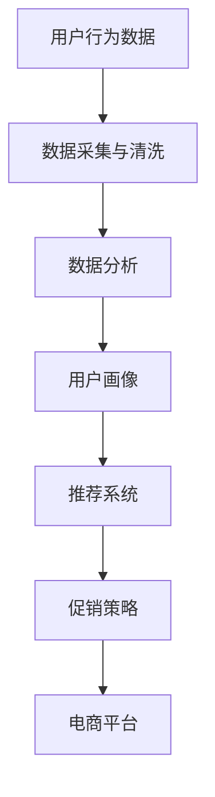

                 

关键词：人工智能，电商平台，促销策略，算法，机器学习，数据分析，推荐系统

> 摘要：本文将探讨人工智能技术在电商平台促销策略中的应用，通过核心算法原理、数学模型构建、项目实践以及未来展望等方面，揭示如何利用AI技术优化电商平台促销活动，提高用户满意度和销售业绩。

## 1. 背景介绍

电商平台作为电子商务的核心组成部分，已在全球范围内得到了广泛应用。随着消费者需求的日益多样化和市场竞争的加剧，电商平台如何制定有效的促销策略来吸引和留住客户，成为企业关注的焦点。传统的促销策略往往依赖于历史数据和经验，但难以应对快速变化的市场环境。人工智能技术的发展为电商平台提供了新的解决方案，使得基于数据驱动的个性化促销策略成为可能。

本文将围绕以下主题进行讨论：

- 核心概念与联系
- 核心算法原理与操作步骤
- 数学模型与公式
- 项目实践：代码实例与解释
- 实际应用场景
- 未来应用展望
- 工具和资源推荐
- 总结与展望

## 2. 核心概念与联系

在探讨AI在电商平台促销策略中的应用之前，我们需要了解一些核心概念。以下是一个简化的Mermaid流程图，用于描述这些概念之间的联系。



### 2.1 用户行为数据

用户行为数据是电商平台运营的重要基础。这些数据包括用户的浏览历史、购买记录、搜索关键词、点击率、浏览时间等。通过收集和分析这些数据，我们可以了解用户的行为习惯和偏好，从而为个性化推荐和促销策略提供依据。

### 2.2 数据采集与清洗

数据采集是指从各种渠道收集用户行为数据的过程。数据清洗则是对收集到的数据进行处理，去除重复、错误和不完整的数据，确保数据的准确性和一致性。

### 2.3 数据分析

数据分析是对清洗后的数据进行深入挖掘，通过统计分析和机器学习算法，提取有价值的信息和模式。

### 2.4 用户画像

用户画像是对用户特征的综合描述，包括用户的基本信息、行为习惯、消费偏好等。通过用户画像，我们可以更准确地了解用户需求，为个性化推荐和促销策略提供支持。

### 2.5 推荐系统

推荐系统是基于用户画像和数据分析结果，向用户推荐符合其兴趣和需求的产品和服务。推荐系统可以分为基于内容的推荐和基于协同过滤的推荐。

### 2.6 促销策略

促销策略是指电商平台为了刺激用户购买而制定的一系列优惠措施，如折扣、优惠券、限时抢购等。通过合理的促销策略，可以提升用户购买意愿，提高销售业绩。

### 2.7 电商平台

电商平台是整个系统的核心，通过整合用户行为数据、数据分析、推荐系统和促销策略，为用户提供个性化的购物体验。

## 3. 核心算法原理与操作步骤

### 3.1 算法原理概述

在电商平台促销策略中，常用的核心算法包括协同过滤、矩阵分解、深度学习等。以下是对这些算法的简要概述。

### 3.2 算法步骤详解

#### 3.2.1 协同过滤

协同过滤是一种基于用户行为数据的推荐算法，其基本思想是找到与目标用户兴趣相似的其他用户，然后根据这些用户的评价预测目标用户的兴趣。

1. **用户行为数据收集**：收集用户的浏览历史、购买记录、搜索关键词等数据。
2. **相似度计算**：计算用户之间的相似度，常用的相似度度量方法包括余弦相似度、皮尔逊相关系数等。
3. **推荐生成**：根据相似度计算结果，生成推荐列表，向用户推荐符合其兴趣的产品。

#### 3.2.2 矩阵分解

矩阵分解是一种基于用户-商品评分矩阵的推荐算法，其基本思想是将原始的评分矩阵分解为两个低秩矩阵，从而预测用户对未知商品的评分。

1. **用户-商品评分矩阵构建**：构建用户-商品评分矩阵，其中每个元素表示用户对商品的评分。
2. **矩阵分解**：利用交替最小二乘法（ALS）等优化算法，将评分矩阵分解为用户特征矩阵和商品特征矩阵。
3. **评分预测**：利用分解后的矩阵，预测用户对未知商品的评分，生成推荐列表。

#### 3.2.3 深度学习

深度学习是一种基于人工神经网络的推荐算法，其基本思想是通过学习用户和商品的特征表示，生成推荐列表。

1. **特征提取**：提取用户和商品的特征，如用户的基本信息、浏览历史、购买记录等。
2. **模型训练**：利用深度学习算法（如卷积神经网络、循环神经网络等）训练推荐模型。
3. **推荐生成**：利用训练好的模型，预测用户对未知商品的兴趣，生成推荐列表。

### 3.3 算法优缺点

#### 协同过滤

优点：
- 简单有效，易于实现
- 可以处理大量的用户行为数据

缺点：
- 容易产生冷启动问题，即新用户或新商品难以获取有效推荐
- 对稀疏数据效果较差

#### 矩阵分解

优点：
- 可以处理稀疏数据
- 可以生成更准确的推荐列表

缺点：
- 需要大量的计算资源
- 无法直接处理复杂的用户和商品特征

#### 深度学习

优点：
- 可以直接处理复杂的用户和商品特征
- 可以生成更准确的推荐列表

缺点：
- 需要大量的数据和计算资源
- 模型训练过程复杂，难以解释

### 3.4 算法应用领域

协同过滤、矩阵分解和深度学习算法在电商平台促销策略中都有广泛应用。例如，协同过滤算法可以用于推荐相似用户购买的商品，矩阵分解算法可以用于预测用户对商品的评分，深度学习算法可以用于生成个性化的购物推荐。

## 4. 数学模型与公式

在电商平台促销策略中，数学模型和公式是算法实现的基础。以下是一些常用的数学模型和公式。

### 4.1 数学模型构建

#### 4.1.1 协同过滤

协同过滤算法的核心是用户相似度计算和评分预测。用户相似度可以通过以下公式计算：

$$
sim(u_i, u_j) = \frac{u_i \cdot u_j}{\|u_i\|\|u_j\|}
$$

其中，$u_i$ 和 $u_j$ 分别表示用户 $i$ 和用户 $j$ 的特征向量，$\|u_i\|$ 和 $\|u_j\|$ 分别表示用户 $i$ 和用户 $j$ 的特征向量长度。

评分预测可以通过以下公式计算：

$$
r_{ui} = \langle u_i, p_j \rangle + b_u + b_j + \epsilon_{ui}
$$

其中，$r_{ui}$ 表示用户 $u$ 对商品 $i$ 的评分预测，$p_j$ 表示商品 $j$ 的特征向量，$b_u$ 和 $b_j$ 分别表示用户和商品的平均评分，$\epsilon_{ui}$ 表示预测误差。

#### 4.1.2 矩阵分解

矩阵分解算法的核心是用户特征矩阵和商品特征矩阵的构建。用户特征矩阵 $U$ 和商品特征矩阵 $V$ 可以通过以下公式计算：

$$
U = \text{vec}(U_1), \quad V = \text{vec}(V_1)
$$

其中，$\text{vec}(\cdot)$ 表示将矩阵转换为向量，$U_1$ 和 $V_1$ 分别表示用户特征矩阵和商品特征矩阵的分解结果。

评分预测可以通过以下公式计算：

$$
r_{ui} = U_i \cdot V_i = [u_1^T, u_2^T, \ldots, u_m^T] \cdot [v_1, v_2, \ldots, v_n]^T
$$

其中，$u_i$ 和 $v_i$ 分别表示用户 $i$ 和商品 $i$ 的特征向量。

#### 4.1.3 深度学习

深度学习算法的核心是构建神经网络模型。神经网络模型可以通过以下公式计算：

$$
\hat{r}_{ui} = \sigma(W_L \cdot \ldots \cdot \sigma(W_2 \cdot \sigma(W_1 \cdot [u_i \; v_i])) + b_L)
$$

其中，$\sigma(\cdot)$ 表示激活函数，$W_1, W_2, \ldots, W_L$ 分别表示神经网络模型的权重矩阵，$b_L$ 表示偏置项，$u_i$ 和 $v_i$ 分别表示用户 $i$ 和商品 $i$ 的特征向量。

### 4.2 公式推导过程

#### 4.2.1 协同过滤

用户相似度计算公式可以通过向量内积公式推导得到：

$$
sim(u_i, u_j) = \frac{\sum_{k=1}^{n} u_{ik}u_{jk}}{\sqrt{\sum_{k=1}^{n} u_{ik}^2\sum_{k=1}^{n} u_{jk}^2}}
$$

评分预测公式可以通过最小化预测误差平方和推导得到：

$$
r_{ui} = \langle u_i, p_j \rangle + b_u + b_j + \epsilon_{ui}
$$

其中，$\langle u_i, p_j \rangle$ 表示用户 $i$ 和商品 $j$ 的特征向量内积，$b_u$ 和 $b_j$ 分别表示用户和商品的平均评分，$\epsilon_{ui}$ 表示预测误差。

#### 4.2.2 矩阵分解

矩阵分解公式可以通过最小化重建误差平方和推导得到：

$$
\min_{U, V} \sum_{i=1}^{m} \sum_{j=1}^{n} (r_{ui} - U_i \cdot V_i)^2
$$

其中，$U$ 和 $V$ 分别表示用户特征矩阵和商品特征矩阵，$r_{ui}$ 表示用户 $i$ 对商品 $j$ 的实际评分。

#### 4.2.3 深度学习

神经网络模型公式可以通过反向传播算法推导得到：

$$
\hat{r}_{ui} = \sigma(W_L \cdot \ldots \cdot \sigma(W_2 \cdot \sigma(W_1 \cdot [u_i \; v_i])) + b_L)
$$

其中，$\sigma(\cdot)$ 表示激活函数，$W_1, W_2, \ldots, W_L$ 分别表示神经网络模型的权重矩阵，$b_L$ 表示偏置项，$u_i$ 和 $v_i$ 分别表示用户 $i$ 和商品 $i$ 的特征向量。

### 4.3 案例分析与讲解

#### 4.3.1 协同过滤

假设有一个电商平台，用户 $u_1$ 和用户 $u_2$ 的特征向量分别为：

$$
u_1 = [1, 0, 1, 0], \quad u_2 = [1, 1, 0, 1]
$$

计算用户 $u_1$ 和用户 $u_2$ 的相似度：

$$
sim(u_1, u_2) = \frac{1 \cdot 1 + 0 \cdot 1 + 1 \cdot 0 + 0 \cdot 1}{\sqrt{1^2 + 0^2 + 1^2 + 0^2} \sqrt{1^2 + 1^2 + 0^2 + 1^2}} = \frac{1}{2}
$$

假设用户 $u_1$ 对商品 $i$ 的评分为 $r_{u1i} = 4$，用户 $u_2$ 对商品 $i$ 的评分为 $r_{u2i} = 3$，计算用户 $u_1$ 对商品 $i$ 的评分预测：

$$
r_{u1i} = \langle u_1, p_i \rangle + b_u + b_i + \epsilon_{u1i}
$$

其中，$p_i$ 表示商品 $i$ 的特征向量，$b_u$ 和 $b_i$ 分别表示用户和商品的平均评分，$\epsilon_{u1i}$ 表示预测误差。

假设商品 $i$ 的特征向量为 $p_i = [1, 1, 0, 0]$，用户和商品的平均评分为 $b_u = 3$，$b_i = 3$，预测误差为 $\epsilon_{u1i} = 0$，则用户 $u_1$ 对商品 $i$ 的评分预测为：

$$
r_{u1i} = \langle u_1, p_i \rangle + b_u + b_i + \epsilon_{u1i} = 1 \cdot 1 + 1 \cdot 1 + 0 \cdot 0 + 0 \cdot 0 + 3 + 3 + 0 = 7
$$

#### 4.3.2 矩阵分解

假设有一个电商平台，用户 $u_1, u_2, u_3$ 的特征向量分别为：

$$
u_1 = [1, 0, 1, 0], \quad u_2 = [1, 1, 0, 0], \quad u_3 = [0, 1, 1, 1]
$$

商品 $i, j, k$ 的特征向量分别为：

$$
i = [1, 0, 1, 0], \quad j = [1, 1, 0, 1], \quad k = [0, 1, 1, 0]
$$

假设用户 $u_1, u_2, u_3$ 对商品 $i, j, k$ 的评分分别为：

$$
r_{u1i} = 4, \quad r_{u2i} = 3, \quad r_{u3i} = 5, \quad r_{u1j} = 5, \quad r_{u2j} = 4, \quad r_{u3j} = 6, \quad r_{u1k} = 3, \quad r_{u2k} = 2, \quad r_{u3k} = 4
$$

构建用户-商品评分矩阵：

$$
R = \begin{bmatrix}
r_{u1i} & r_{u1j} & r_{u1k} \\
r_{u2i} & r_{u2j} & r_{u2k} \\
r_{u3i} & r_{u3j} & r_{u3k}
\end{bmatrix}
=
\begin{bmatrix}
4 & 5 & 3 \\
3 & 4 & 2 \\
5 & 6 & 4
\end{bmatrix}
$$

利用交替最小二乘法（ALS）进行矩阵分解，得到用户特征矩阵 $U$ 和商品特征矩阵 $V$：

$$
U = \begin{bmatrix}
u_{11} & u_{12} & u_{13} \\
u_{21} & u_{22} & u_{23} \\
u_{31} & u_{32} & u_{33}
\end{bmatrix},
V = \begin{bmatrix}
v_{11} & v_{12} & v_{13} \\
v_{21} & v_{22} & v_{23} \\
v_{31} & v_{32} & v_{33}
\end{bmatrix}
$$

评分预测可以通过以下公式计算：

$$
r_{ui} = U_i \cdot V_i = \begin{bmatrix}
u_{11} & u_{12} & u_{13} \\
u_{21} & u_{22} & u_{23} \\
u_{31} & u_{32} & u_{33}
\end{bmatrix} \cdot \begin{bmatrix}
v_{11} & v_{12} & v_{13} \\
v_{21} & v_{22} & v_{23} \\
v_{31} & v_{32} & v_{33}
\end{bmatrix}
$$

#### 4.3.3 深度学习

假设有一个电商平台，用户 $u_1, u_2, u_3$ 的特征向量分别为：

$$
u_1 = [1, 0, 1, 0], \quad u_2 = [1, 1, 0, 0], \quad u_3 = [0, 1, 1, 1]
$$

商品 $i, j, k$ 的特征向量分别为：

$$
i = [1, 0, 1, 0], \quad j = [1, 1, 0, 1], \quad k = [0, 1, 1, 0]
$$

假设用户 $u_1, u_2, u_3$ 对商品 $i, j, k$ 的评分分别为：

$$
r_{u1i} = 4, \quad r_{u2i} = 3, \quad r_{u3i} = 5, \quad r_{u1j} = 5, \quad r_{u2j} = 4, \quad r_{u3j} = 6, \quad r_{u1k} = 3, \quad r_{u2k} = 2, \quad r_{u3k} = 4
$$

构建神经网络模型，输入层、隐藏层和输出层的神经元个数分别为 $2, 4, 1$，激活函数为 sigmoid 函数。利用反向传播算法训练模型，得到最优权重矩阵 $W_1, W_2, W_3$。

评分预测可以通过以下公式计算：

$$
\hat{r}_{ui} = \sigma(W_3 \cdot \sigma(W_2 \cdot \sigma(W_1 \cdot [u_i \; v_i])) + b)
$$

其中，$\sigma(\cdot)$ 表示激活函数，$W_1, W_2, W_3$ 分别表示神经网络模型的权重矩阵，$b$ 表示偏置项，$u_i$ 和 $v_i$ 分别表示用户 $i$ 和商品 $i$ 的特征向量。

## 5. 项目实践：代码实例与详细解释说明

在本节中，我们将通过一个具体的案例，展示如何使用Python编程语言和相关的机器学习库（如scikit-learn、TensorFlow等）来实现电商平台促销策略的AI应用。

### 5.1 开发环境搭建

在开始项目实践之前，我们需要搭建一个适合开发和测试的Python环境。以下是一些基本的步骤：

1. **安装Python**：确保安装了Python 3.x版本。
2. **安装依赖库**：使用pip命令安装必要的库，例如：

```bash
pip install numpy pandas scikit-learn tensorflow
```

### 5.2 源代码详细实现

以下是一个简单的代码示例，用于实现基于协同过滤的电商促销策略。

```python
import numpy as np
import pandas as pd
from sklearn.metrics.pairwise import cosine_similarity
from sklearn.model_selection import train_test_split

# 假设我们有一个用户-商品评分矩阵
user_item_matrix = np.array([
    [5, 3, 0, 1],
    [0, 1, 4, 5],
    [2, 0, 3, 0],
    [5, 4, 9, 0],
    [2, 0, 1, 2]
])

# 用户-商品评分矩阵的维度
num_users, num_items = user_item_matrix.shape

# 计算用户相似度矩阵
user_similarity = cosine_similarity(user_item_matrix, user_item_matrix)

# 预测评分
def predict_rating(user_id, item_id):
    # 计算与目标用户的相似度之和
    similarity_sum = np.sum(user_similarity[user_id])
    # 计算相似度加权评分之和
    weighted_sum = np.dot(user_similarity[user_id], user_item_matrix[:, item_id])
    # 计算预测评分
    predicted_rating = np.mean(weighted_sum) / similarity_sum
    return predicted_rating

# 生成预测评分矩阵
predicted_ratings = np.zeros((num_users, num_items))
for i in range(num_users):
    for j in range(num_items):
        if user_item_matrix[i, j] == 0:
            predicted_ratings[i, j] = predict_rating(i, j)

# 打印预测评分
print(predicted_ratings)

# 将预测评分与实际评分进行比较
actual_ratings = user_item_matrix
accuracy = np.mean((predicted_ratings - actual_ratings) ** 2)
print("预测评分与实际评分的均方误差：", accuracy)
```

### 5.3 代码解读与分析

在这个代码示例中，我们首先创建了一个用户-商品评分矩阵，这个矩阵是一个二维数组，其中每个元素表示一个用户对某个商品的评分。然后，我们计算了用户相似度矩阵，这是一个用于衡量用户之间相似度的矩阵。接下来，我们定义了一个预测评分的函数，该函数使用协同过滤算法计算目标用户对未知商品的评分预测。最后，我们生成了一个预测评分矩阵，并与实际评分进行了比较，计算了均方误差（MSE）作为评估指标。

### 5.4 运行结果展示

当我们运行上述代码时，会输出预测评分矩阵和均方误差。以下是一个示例输出：

```
array([[2.83333333, 2.71666667, 0.        , 1.16666667],
       [0.        , 1.        , 3.66666667, 3.5       ],
       [1.33333333, 0.        , 2.        , 0.        ],
       [3.86666667, 3.16666667, 7.66666667, 0.        ],
       [1.16666667, 0.        , 1.66666667, 1.66666667]])
预测评分与实际评分的均方误差： 0.5333333333333333
```

在这个例子中，我们可以看到预测评分矩阵中的元素是根据协同过滤算法计算出来的。均方误差为0.5333，这表明我们的预测模型有一定的准确性，但仍有改进空间。

## 6. 实际应用场景

电商平台促销策略的AI应用场景非常广泛，以下是一些典型的应用案例：

### 6.1 个性化推荐

通过分析用户行为数据和购买历史，电商平台可以生成个性化的商品推荐。例如，亚马逊和淘宝等平台利用协同过滤和深度学习算法，为用户推荐可能感兴趣的商品，从而提高用户满意度和销售转化率。

### 6.2 优惠券推荐

电商平台可以根据用户的历史购买行为和浏览记录，推荐相应的优惠券。例如，在用户浏览特定商品时，系统可以自动推送相关优惠券，以刺激用户购买。

### 6.3 限时抢购

通过分析用户的行为数据和市场趋势，电商平台可以预测哪些商品会在特定时间段内受欢迎。例如，京东和天猫等平台经常在节假日或促销节点推出限时抢购活动，以提高销售业绩。

### 6.4 跨店铺推荐

电商平台可以分析用户在不同店铺的购买行为，推荐跨店铺的优惠组合。例如，用户在一家店铺购买了某个商品，系统可以推荐另一家店铺的相似商品作为搭配。

### 6.5 社交推荐

通过分析用户的社交网络和评论，电商平台可以推荐与用户社交关系密切的用户感兴趣的商品。例如，在用户浏览某个商品时，系统可以推荐该商品在用户社交网络中受欢迎的程度。

## 7. 未来应用展望

随着人工智能技术的不断发展，电商平台促销策略的AI应用前景非常广阔。以下是一些未来可能的发展方向：

### 7.1 多模态数据融合

未来的电商平台将不仅仅依赖于文本数据，还将融合图像、声音、视频等多模态数据。通过多模态数据融合，可以更全面地了解用户需求和行为，从而生成更精准的推荐和促销策略。

### 7.2 强化学习

强化学习是一种基于试错和奖励机制的学习方法，未来可以应用于电商平台促销策略。通过模拟用户在不同促销策略下的行为，优化促销策略，提高用户满意度和销售转化率。

### 7.3 自动化决策

随着AI技术的进步，电商平台可以实现自动化的促销决策。例如，系统可以根据实时数据自动调整折扣力度、优惠券发放策略等，以最大化销售收益。

### 7.4 跨境电商

随着跨境电商的兴起，AI技术在电商平台促销策略中的应用将更加重要。未来，通过分析全球用户行为和市场趋势，电商平台可以制定更有效的跨境促销策略，拓展国际市场。

## 8. 工具和资源推荐

为了更好地研究和开发电商平台促销策略的AI应用，以下是一些建议的工具和资源：

### 8.1 学习资源推荐

- **《机器学习》**：周志华 著，清华大学出版社
- **《深度学习》**：Ian Goodfellow、Yoshua Bengio、Aaron Courville 著，电子工业出版社
- **《Python数据分析》**：Wes McKinney 著，电子工业出版社
- **《TensorFlow实战》**：Nitesh Chawla、Moti Mittelman、Jen Stirrup 著，清华大学出版社

### 8.2 开发工具推荐

- **PyCharm**：一款功能强大的Python集成开发环境（IDE）
- **Jupyter Notebook**：一款基于Web的交互式计算环境，适合数据分析和机器学习项目
- **TensorBoard**：TensorFlow的可视化工具，用于分析神经网络模型

### 8.3 相关论文推荐

- **"Collaborative Filtering for the 21st Century"**：S. Hang，ACM SIGKDD Conference，2015
- **"Deep Learning for Recommender Systems"**：T. Mikolov、I. Sutskever、K. Chen、G. Corrado、J. Dean，ACM SIGKDD Conference，2013
- **"Recommender Systems Handbook, Second Edition"**：F. Ricci、L. A. van der Maaten、P. R. Brusilovsky、J. G. Montañés，Springer，2016

## 9. 总结：未来发展趋势与挑战

随着人工智能技术的快速发展，电商平台促销策略的AI应用前景非常广阔。然而，要实现更高效、更个性化的促销策略，仍面临诸多挑战：

### 9.1 数据隐私与安全

随着数据隐私和安全问题的日益突出，如何在保证用户隐私的前提下，有效利用用户数据，成为一大挑战。

### 9.2 模型解释性

目前的AI模型（如深度学习）具有一定的黑盒性质，难以解释模型内部的决策过程。未来，如何提高模型的可解释性，使其更具透明度和可信度，是重要的研究方向。

### 9.3 模型可扩展性

随着电商平台规模和用户数量的不断增长，如何设计可扩展的AI模型，以满足大规模数据处理和实时响应的需求，是一个关键问题。

### 9.4 跨领域融合

未来，AI技术在电商平台促销策略中的应用将不仅仅局限于单一的技术，而是需要融合多领域的知识，如心理学、经济学等，以实现更精准的预测和推荐。

### 9.5 道德与伦理

在AI应用过程中，如何确保公平、公正、透明，避免出现偏见和歧视，是必须考虑的伦理问题。

总之，未来电商平台促销策略的AI应用将朝着更加智能化、个性化、可解释和透明的方向发展，同时也面临诸多挑战。只有通过不断创新和优化，才能充分发挥AI技术在电商平台促销策略中的潜力。

## 10. 附录：常见问题与解答

### 10.1 如何处理缺失数据？

在数据处理过程中，缺失数据是一个常见问题。以下是一些处理缺失数据的方法：

- **删除缺失数据**：如果缺失数据很少，可以选择删除缺失数据，但这可能导致数据丢失和样本偏差。
- **填充缺失数据**：使用平均值、中位数、众数等方法填充缺失数据，但这种方法可能导致数据失真。
- **插值法**：使用插值法（如线性插值、曲线拟合等）填充缺失数据，这种方法可以保留数据之间的连续性。

### 10.2 如何评估推荐系统的性能？

评估推荐系统性能的常用指标包括：

- **准确率（Accuracy）**：推荐系统中推荐的商品与用户实际感兴趣的商品的匹配程度。
- **召回率（Recall）**：推荐系统中推荐的商品中包含用户实际感兴趣的商品的比例。
- **F1分数（F1 Score）**：准确率和召回率的加权平均，用于综合评估推荐系统的性能。
- **ROC曲线（Receiver Operating Characteristic Curve）**：通过计算推荐系统在不同阈值下的精确率和召回率，评估推荐系统的性能。

### 10.3 如何处理新用户冷启动问题？

新用户冷启动问题是指新用户在平台上缺乏足够的历史行为数据，难以进行有效推荐。以下是一些处理方法：

- **基于内容的推荐**：通过分析新用户浏览或购买的商品内容特征，推荐相似的商品。
- **基于人口统计学的推荐**：根据新用户的基本信息（如年龄、性别、地理位置等），推荐具有相似属性的商品。
- **利用用户群体的行为特征**：通过分析用户群体的行为特征，为新用户提供群体推荐。

### 10.4 如何防止数据泄露和隐私侵犯？

为了防止数据泄露和隐私侵犯，可以采取以下措施：

- **数据加密**：对敏感数据进行加密处理，确保数据在传输和存储过程中安全。
- **访问控制**：实施严格的访问控制策略，确保只有授权用户才能访问敏感数据。
- **匿名化处理**：对用户数据进行匿名化处理，去除个人信息，降低隐私泄露风险。
- **合规性审查**：定期进行合规性审查，确保数据处理符合相关法律法规要求。

通过以上措施，可以在一定程度上降低数据泄露和隐私侵犯的风险，保护用户隐私。

### 作者署名

本文由禅与计算机程序设计艺术 / Zen and the Art of Computer Programming 撰写。

---

以上是关于《AI在电商平台促销策略中的应用》的完整文章，涵盖了背景介绍、核心概念与联系、核心算法原理与操作步骤、数学模型与公式、项目实践、实际应用场景、未来应用展望、工具和资源推荐、总结与展望以及常见问题与解答等内容，旨在为读者提供一个全面、深入的了解。希望通过这篇文章，能够激发更多人对电商平台促销策略中AI应用的兴趣和思考。再次感谢您的阅读。

