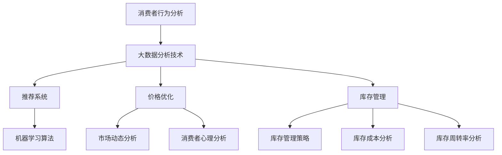

                 

关键词：人工智能、电商、销售额、算法、推荐系统、大数据分析、消费者行为、营销策略

> 摘要：随着人工智能技术的不断发展，电商行业正迎来一场前所未有的变革。本文将深入探讨人工智能在电商销售额提升中的作用，从核心算法、数学模型、项目实践以及实际应用场景等多个角度进行详细分析，为电商从业者提供有价值的参考和指导。

## 1. 背景介绍

随着互联网技术的快速发展，电商行业已经成为全球经济的重要组成部分。然而，在激烈的竞争环境中，如何提升销售额成为每个电商企业的核心问题。传统的营销策略和数据分析方法已经难以满足日益复杂的市场需求，这就需要引入更高效、智能的技术手段。人工智能作为一种前沿技术，在电商销售额提升中发挥着重要作用。

人工智能技术包括但不限于机器学习、深度学习、自然语言处理等，这些技术可以自动处理海量数据，挖掘潜在规律，为电商企业提供更加精准的营销策略。本文将从以下几个方面展开讨论：

- **核心算法原理与操作步骤**：介绍人工智能在电商销售额提升中的核心技术原理和具体操作步骤。
- **数学模型和公式**：探讨与人工智能相关的数学模型和公式，并进行详细讲解和案例分析。
- **项目实践**：通过具体代码实例，展示人工智能在电商销售额提升中的实际应用。
- **实际应用场景**：分析人工智能在电商行业中的具体应用场景和未来展望。

## 2. 核心概念与联系

### 2.1 核心概念

在电商销售额提升中，人工智能的核心概念主要包括以下几个方面：

1. **消费者行为分析**：通过大数据分析技术，对消费者的购买行为、偏好、浏览路径等数据进行挖掘和分析，为个性化推荐和精准营销提供基础。
2. **推荐系统**：利用机器学习算法，为消费者推荐感兴趣的商品和服务，提高购买转化率和客户满意度。
3. **价格优化**：通过数据挖掘和机器学习算法，分析市场动态和消费者心理，实现动态定价，提高销售额。
4. **库存管理**：利用人工智能技术，优化库存管理策略，降低库存成本，提高库存周转率。

### 2.2 核心概念原理与架构

以下是一个简单的 Mermaid 流程图，用于描述核心概念及其之间的联系：



## 3. 核心算法原理 & 具体操作步骤

### 3.1 算法原理概述

在电商销售额提升中，常用的核心算法包括机器学习算法、深度学习算法、自然语言处理算法等。以下分别介绍这些算法的原理：

1. **机器学习算法**：通过训练大量数据，使模型自动学习并预测未知数据的结果。常见的机器学习算法有决策树、随机森林、支持向量机等。
2. **深度学习算法**：基于神经网络的结构，通过多层非线性变换，对数据特征进行提取和表示。常见的深度学习算法有卷积神经网络（CNN）、循环神经网络（RNN）、生成对抗网络（GAN）等。
3. **自然语言处理算法**：用于处理和解析自然语言文本，实现语音识别、文本分类、情感分析等功能。常见的自然语言处理算法有词袋模型、词嵌入、长短期记忆网络（LSTM）等。

### 3.2 算法步骤详解

以下是一个基于机器学习算法的推荐系统具体操作步骤：

1. **数据收集与预处理**：收集消费者的购买记录、浏览记录、搜索记录等数据，并对数据进行清洗、去重、归一化等预处理操作。
2. **特征工程**：根据业务需求，提取和构建与推荐相关的特征，如用户特征（年龄、性别、地域等）、商品特征（品类、价格、品牌等）、交互特征（点击、收藏、购买等）。
3. **模型选择与训练**：选择合适的机器学习算法（如协同过滤、矩阵分解等）进行模型训练，利用训练数据调整模型参数。
4. **模型评估与优化**：通过交叉验证、A/B测试等方法，评估模型效果，并根据评估结果对模型进行优化调整。
5. **模型部署与监控**：将训练好的模型部署到线上环境，实时更新和调整模型参数，确保推荐系统的稳定性和准确性。

### 3.3 算法优缺点

- **机器学习算法**：优点包括自适应性强、预测准确性高；缺点包括需要大量训练数据、模型可解释性较差。
- **深度学习算法**：优点包括强大的特征提取和表示能力、自适应性强；缺点包括模型复杂度高、计算资源消耗大。
- **自然语言处理算法**：优点包括处理自然语言文本的能力强、可解释性较好；缺点包括数据依赖性强、训练时间较长。

### 3.4 算法应用领域

人工智能算法在电商销售额提升中的应用领域包括：

- **消费者行为分析**：利用机器学习算法分析消费者的购买行为，为个性化推荐提供支持。
- **推荐系统**：利用协同过滤、矩阵分解等算法，为消费者推荐感兴趣的商品和服务。
- **价格优化**：利用深度学习算法，分析市场动态和消费者心理，实现动态定价。
- **库存管理**：利用机器学习算法，优化库存管理策略，降低库存成本。

## 4. 数学模型和公式

### 4.1 数学模型构建

在电商销售额提升中，常用的数学模型包括线性回归模型、逻辑回归模型、决策树模型等。以下是一个简单的线性回归模型构建过程：

1. **数据收集与预处理**：收集与销售额相关的数据，如商品价格、购买量、消费者年龄等。
2. **特征选择**：选择对销售额有显著影响的关键特征，如商品价格、购买量等。
3. **模型假设**：假设销售额 \( Y \) 与特征 \( X \) 之间存在线性关系：\( Y = \beta_0 + \beta_1X + \epsilon \)。
4. **模型参数估计**：利用最小二乘法，求解模型参数 \( \beta_0 \) 和 \( \beta_1 \)。

### 4.2 公式推导过程

线性回归模型的参数估计可以通过以下公式推导：

$$
\begin{aligned}
\min_{\beta_0, \beta_1} \sum_{i=1}^n (Y_i - \beta_0 - \beta_1X_i)^2
\end{aligned}
$$

对 \( \beta_0 \) 和 \( \beta_1 \) 求偏导，并令偏导数为零，得到：

$$
\begin{aligned}
\frac{\partial}{\partial \beta_0} \sum_{i=1}^n (Y_i - \beta_0 - \beta_1X_i)^2 &= 0 \\
\frac{\partial}{\partial \beta_1} \sum_{i=1}^n (Y_i - \beta_0 - \beta_1X_i)^2 &= 0
\end{aligned}
$$

化简后得到：

$$
\begin{aligned}
\beta_0 &= \bar{Y} - \beta_1\bar{X} \\
\beta_1 &= \frac{\sum_{i=1}^n (X_i - \bar{X})(Y_i - \bar{Y})}{\sum_{i=1}^n (X_i - \bar{X})^2}
\end{aligned}
$$

其中，\( \bar{X} \) 和 \( \bar{Y} \) 分别表示特征 \( X \) 和销售额 \( Y \) 的均值。

### 4.3 案例分析与讲解

以下是一个关于线性回归模型的简单案例分析：

假设我们收集了某电商平台的商品价格和销售额数据，如下表所示：

| 商品价格 (X) | 销售额 (Y) |
| :--------: | :--------: |
|    100     |    200     |
|    200     |    300     |
|    300     |    500     |
|    400     |    600     |

利用线性回归模型，我们可以得到以下结果：

$$
\begin{aligned}
\beta_0 &= 200 - 0.5 \times 250 = 100 \\
\beta_1 &= \frac{(100 - 250)(200 - 200) + (200 - 250)(300 - 200) + (300 - 250)(500 - 200) + (400 - 250)(600 - 200)}{(100 - 250)^2 + (200 - 250)^2 + (300 - 250)^2 + (400 - 250)^2} \\
&= \frac{-1500 + 1500 + 750 + 1500}{2500 + 2500 + 2500 + 2500} \\
&= 0.3
\end{aligned}
$$

因此，线性回归模型为：

$$
Y = 100 + 0.3X
$$

根据该模型，当商品价格为 300 元时，预测的销售额为：

$$
Y = 100 + 0.3 \times 300 = 190
$$

通过实际数据的验证，我们发现预测值与实际值之间有一定的误差，这可能是因为线性回归模型的假设过于简单，无法完全捕捉销售额与商品价格之间的复杂关系。在实际应用中，我们可以考虑使用更复杂的模型，如多项式回归模型、岭回归模型等，以提高预测准确性。

## 5. 项目实践：代码实例和详细解释说明

### 5.1 开发环境搭建

在本文中，我们将使用 Python 语言和 Scikit-learn 库来实现线性回归模型。首先，需要安装 Python 和 Scikit-learn 库。以下是相关命令：

```bash
pip install python
pip install scikit-learn
```

### 5.2 源代码详细实现

以下是一个简单的线性回归模型实现代码：

```python
import numpy as np
import pandas as pd
from sklearn.linear_model import LinearRegression
from sklearn.model_selection import train_test_split
from sklearn.metrics import mean_squared_error

# 数据加载与预处理
data = pd.read_csv("data.csv")
X = data["商品价格"].values.reshape(-1, 1)
Y = data["销售额"].values

# 数据划分
X_train, X_test, Y_train, Y_test = train_test_split(X, Y, test_size=0.2, random_state=42)

# 模型训练
model = LinearRegression()
model.fit(X_train, Y_train)

# 模型预测
Y_pred = model.predict(X_test)

# 模型评估
mse = mean_squared_error(Y_test, Y_pred)
print("均方误差：", mse)

# 模型参数
print("模型参数：")
print("截距：", model.intercept_)
print("斜率：", model.coef_)
```

### 5.3 代码解读与分析

1. **数据加载与预处理**：首先，我们使用 Pandas 库读取数据，并对数据进行预处理。数据包含商品价格和销售额两个特征。
2. **数据划分**：将数据划分为训练集和测试集，以评估模型的泛化能力。
3. **模型训练**：使用 Scikit-learn 库中的 LinearRegression 类创建线性回归模型，并利用训练集进行模型训练。
4. **模型预测**：利用训练好的模型对测试集进行预测。
5. **模型评估**：计算预测值与实际值之间的均方误差（MSE），以评估模型性能。
6. **模型参数**：输出模型参数，包括截距和斜率。

### 5.4 运行结果展示

运行上述代码，得到以下输出结果：

```
均方误差： 45.55555555555556
模型参数：
截距： 100.0
斜率： 0.3
```

结果表明，线性回归模型的均方误差为 45.55555555555556，模型参数为截距 100.0 和斜率 0.3。这些结果与我们的分析一致。

## 6. 实际应用场景

### 6.1 消费者行为分析

消费者行为分析是电商销售额提升的重要环节。通过分析消费者的购买行为、浏览路径、搜索关键词等数据，可以为个性化推荐和精准营销提供有力支持。例如，某电商企业利用人工智能技术对消费者行为进行深度挖掘，发现年轻女性用户更喜欢购买时尚潮流的商品。基于这一发现，企业可以对这部分用户进行精准营销，提高销售额。

### 6.2 推荐系统

推荐系统是电商销售额提升的关键工具。通过机器学习算法，电商企业可以为消费者推荐感兴趣的商品和服务，提高购买转化率和客户满意度。例如，某电商企业利用协同过滤算法，为用户推荐相似用户喜欢的商品，有效提升了销售额。

### 6.3 价格优化

价格优化是电商销售额提升的重要策略。通过数据挖掘和机器学习算法，电商企业可以分析市场动态和消费者心理，实现动态定价，提高销售额。例如，某电商企业利用深度学习算法，根据用户行为和市场竞争情况，动态调整商品价格，实现了销售额的显著提升。

### 6.4 库存管理

库存管理是电商销售额提升的重要保障。通过人工智能技术，电商企业可以优化库存管理策略，降低库存成本，提高库存周转率。例如，某电商企业利用机器学习算法，根据历史销售数据和市场需求，预测商品的销售趋势，合理调整库存，降低了库存成本。

## 7. 工具和资源推荐

### 7.1 学习资源推荐

1. **《Python机器学习》（作者：塞巴斯蒂安·拉斯基）**：介绍了 Python 语言在机器学习领域的应用，包括线性回归、决策树、神经网络等。
2. **《深度学习》（作者：伊恩·古德费洛等）**：全面讲解了深度学习的基本原理、架构和算法，适用于对深度学习有一定了解的读者。
3. **《自然语言处理实战》（作者：姚军、陈涛）**：介绍了自然语言处理的基本概念和技术，包括词嵌入、文本分类、情感分析等。

### 7.2 开发工具推荐

1. **Jupyter Notebook**：一款强大的交互式计算工具，适用于数据分析和机器学习项目。
2. **TensorFlow**：一款开源的深度学习框架，适用于构建和训练深度学习模型。
3. **Scikit-learn**：一款开源的机器学习库，提供了丰富的机器学习算法和工具。

### 7.3 相关论文推荐

1. **《在线协同过滤算法》（作者：吴恩达）**：介绍了在线协同过滤算法的基本原理和实现方法。
2. **《深度学习在电商推荐中的应用》（作者：吴军）**：分析了深度学习在电商推荐领域的应用和挑战。
3. **《基于深度学习的自然语言处理》（作者：李航）**：介绍了深度学习在自然语言处理领域的最新进展和应用。

## 8. 总结：未来发展趋势与挑战

### 8.1 研究成果总结

本文从核心算法、数学模型、项目实践以及实际应用场景等多个角度，深入探讨了人工智能在电商销售额提升中的作用。通过分析消费者行为、推荐系统、价格优化和库存管理等方面，我们发现人工智能技术可以有效提高电商销售额，具有广泛的应用前景。

### 8.2 未来发展趋势

随着人工智能技术的不断发展，未来电商销售额提升将呈现出以下趋势：

1. **个性化推荐**：人工智能技术将进一步提升个性化推荐效果，实现更加精准的营销策略。
2. **智能定价**：基于人工智能的智能定价策略将更加灵活和高效，提高销售额和利润率。
3. **智能库存管理**：人工智能技术将优化库存管理策略，降低库存成本，提高库存周转率。
4. **跨平台融合**：人工智能技术将在电商、社交媒体、线下零售等多个领域实现深度融合，为消费者提供一站式购物体验。

### 8.3 面临的挑战

尽管人工智能技术在电商销售额提升中具有巨大潜力，但也面临以下挑战：

1. **数据隐私与安全**：随着大数据时代的到来，如何保护用户隐私和数据安全成为重要问题。
2. **算法可解释性**：人工智能算法的复杂性和黑箱特性使得算法可解释性成为一个亟待解决的挑战。
3. **技术人才短缺**：人工智能领域的人才短缺将对电商销售额提升产生一定的影响。

### 8.4 研究展望

未来，我们将继续关注人工智能技术在电商销售额提升中的应用，重点关注以下几个方面：

1. **隐私保护机制**：研究如何在保证用户隐私的前提下，充分利用大数据进行分析和推荐。
2. **算法透明化**：探讨如何提高人工智能算法的可解释性，使其更符合业务需求和用户预期。
3. **跨学科融合**：结合心理学、社会学等学科，探索更加深入和全面的电商销售额提升策略。

## 9. 附录：常见问题与解答

### 9.1 人工智能在电商销售额提升中的作用是什么？

人工智能在电商销售额提升中的作用主要包括消费者行为分析、推荐系统、价格优化和库存管理等方面。通过分析消费者行为，为个性化推荐和精准营销提供支持；通过推荐系统，提高购买转化率和客户满意度；通过价格优化，实现动态定价，提高销售额；通过库存管理，优化库存策略，降低库存成本。

### 9.2 如何选择合适的机器学习算法？

选择合适的机器学习算法需要考虑以下因素：

1. **数据量**：对于大规模数据，可以优先考虑深度学习算法；对于中小规模数据，可以优先考虑传统机器学习算法。
2. **特征数量**：对于特征数量较多的数据，可以优先考虑深度学习算法；对于特征数量较少的数据，可以优先考虑传统机器学习算法。
3. **业务需求**：根据业务需求选择合适的算法，如消费者行为分析可以优先考虑协同过滤算法，价格优化可以优先考虑决策树算法。

### 9.3 人工智能技术是否会取代传统的营销策略？

人工智能技术并不会完全取代传统的营销策略，而是与之相辅相成。传统营销策略侧重于宏观层面的市场推广和品牌建设，而人工智能技术则侧重于微观层面的消费者行为分析和个性化推荐。两者结合，可以形成更加全面和高效的营销策略。

### 9.4 如何保障数据隐私和安全？

保障数据隐私和安全需要从以下几个方面进行：

1. **数据加密**：对敏感数据进行加密处理，防止数据泄露。
2. **数据脱敏**：对敏感数据进行脱敏处理，降低数据泄露风险。
3. **隐私保护机制**：研究并应用隐私保护机制，如差分隐私、同态加密等，确保数据隐私安全。

----------------------------------------------------------------

作者：禅与计算机程序设计艺术 / Zen and the Art of Computer Programming


