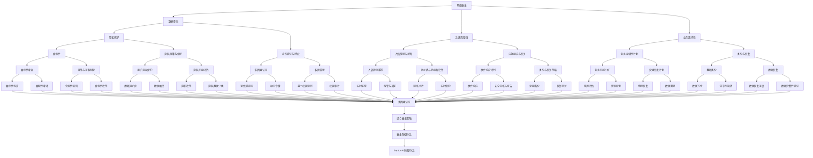

                 

关键词：人工智能，基础设施安全，防御体系，安全加固，Lepton AI

> 摘要：本文将深入探讨人工智能基础设施面临的安全威胁，并介绍Lepton AI公司如何构建了一套全面而高效的防御体系，以确保其AI系统的安全性。文章将涵盖核心概念、算法原理、数学模型、项目实践以及未来展望等多个方面，旨在为读者提供一套清晰、实用的安全加固指南。

## 1. 背景介绍

随着人工智能技术的迅速发展，AI基础设施在全球范围内得到了广泛应用。从智能推荐系统到自动驾驶汽车，从金融风控到医疗诊断，AI技术的广泛应用使得我们的生活方式发生了翻天覆地的变化。然而，这种变革也带来了新的安全挑战。人工智能基础设施不仅需要处理庞大的数据集，还需要应对来自各种攻击的威胁，如网络攻击、数据泄露、隐私侵犯等。因此，如何加固AI基础设施的安全性，成为了当前亟待解决的问题。

Lepton AI是一家领先的人工智能公司，致力于提供高效、安全的AI解决方案。为了应对日益严峻的安全挑战，Lepton AI成立了一个专门的安全研究团队，致力于构建一套全面的防御体系，以确保其AI系统的安全性。本文将介绍Lepton AI的安全防御体系，包括核心概念、算法原理、数学模型以及项目实践等多个方面。

### 1.1 安全挑战

人工智能基础设施面临的安全挑战主要包括以下几个方面：

- **网络攻击**：包括DDoS攻击、SQL注入、跨站脚本攻击等。
- **数据泄露**：包括敏感数据泄露、隐私侵犯等。
- **恶意软件**：包括病毒、木马、勒索软件等。
- **内部威胁**：包括员工滥用权限、恶意行为等。

### 1.2 安全目标

Lepton AI的安全目标是：

- **保护数据安全**：确保敏感数据不被未经授权的访问和泄露。
- **确保系统完整性**：确保系统不受恶意软件和攻击的影响。
- **保障业务连续性**：确保系统在面对攻击时能够快速恢复。
- **提升用户信任**：通过完善的安全措施，增强用户对AI系统的信任。

## 2. 核心概念与联系

为了更好地理解Lepton AI的安全防御体系，我们需要先了解一些核心概念和它们之间的联系。以下是一个Mermaid流程图，展示了这些概念之间的关系：



从流程图中可以看出，网络安全、数据安全、系统完整性和业务连续性是AI基础设施安全的核心，它们相互关联，共同构成了一个综合的安全防御体系。Lepton AI的安全防御体系正是基于这些核心概念和联系构建的。

## 3. 核心算法原理 & 具体操作步骤

### 3.1 算法原理概述

Lepton AI的安全防御体系采用了多种核心算法，包括网络安全算法、数据加密算法、入侵检测算法等。以下是对这些算法原理的概述。

#### 网络安全算法

网络安全算法主要涉及网络流量监控、入侵检测、防火墙等。其基本原理是通过监控网络流量，识别异常行为，并及时采取应对措施。常用的网络安全算法包括：

- **基于特征匹配的入侵检测算法**：通过预先定义的特征库，对网络流量进行匹配，识别潜在的入侵行为。
- **基于统计模型的入侵检测算法**：通过分析网络流量的统计特性，识别异常行为。
- **基于机器学习的入侵检测算法**：利用机器学习算法，从大量历史数据中学习网络行为的特征，识别未知入侵行为。

#### 数据加密算法

数据加密算法用于保护数据的安全性，确保数据在传输和存储过程中不被窃取或篡改。常用的数据加密算法包括：

- **对称加密算法**：如AES（Advanced Encryption Standard），其特点是加密和解密使用相同的密钥。
- **非对称加密算法**：如RSA（Rivest-Shamir-Adleman），其特点是加密和解密使用不同的密钥。
- **哈希算法**：如SHA-256（Secure Hash Algorithm 256-bit），用于生成数据摘要，确保数据完整性。

#### 入侵检测算法

入侵检测算法用于检测和响应潜在的攻击行为。其基本原理是通过分析网络流量、系统日志等数据，识别异常行为，并及时发出警报。常用的入侵检测算法包括：

- **基于规则的方法**：通过预先定义的规则，对数据进行分析，识别潜在的入侵行为。
- **基于统计方法的方法**：通过分析数据的统计特性，识别异常行为。
- **基于机器学习方法的方法**：利用机器学习算法，从大量历史数据中学习入侵行为的特征，识别未知攻击行为。

### 3.2 算法步骤详解

#### 网络安全算法

1. **网络流量监控**：通过部署网络流量监控设备，对网络流量进行实时监控。
2. **入侵检测**：利用入侵检测算法，对网络流量进行分析，识别异常行为。
3. **警报与响应**：当检测到入侵行为时，系统会自动发出警报，并采取相应的应对措施，如封锁攻击IP、修改防火墙规则等。

#### 数据加密算法

1. **选择加密算法**：根据数据的安全需求，选择合适的加密算法。
2. **生成密钥**：生成加密和解密的密钥。
3. **加密数据**：使用加密算法，对数据进行加密。
4. **解密数据**：使用解密算法，对加密数据进行解密。

#### 入侵检测算法

1. **数据采集**：采集网络流量、系统日志等数据。
2. **特征提取**：从数据中提取特征，用于后续分析。
3. **异常检测**：利用异常检测算法，对特征进行分析，识别异常行为。
4. **警报与响应**：当检测到异常行为时，系统会自动发出警报，并采取相应的应对措施。

### 3.3 算法优缺点

#### 网络安全算法

- **优点**：可以实时监控网络流量，快速识别入侵行为，及时采取应对措施。
- **缺点**：可能误报，导致不必要的警报和应对措施。

#### 数据加密算法

- **优点**：可以确保数据在传输和存储过程中的安全性。
- **缺点**：加密和解密过程需要消耗一定的计算资源。

#### 入侵检测算法

- **优点**：可以检测和响应各种类型的攻击行为。
- **缺点**：可能误报，导致不必要的警报和应对措施。

### 3.4 算法应用领域

#### 网络安全算法

- **应用领域**：广泛应用于各种网络系统，如互联网、企业内部网络等。
- **适用场景**：需要实时监控和快速响应的网络系统。

#### 数据加密算法

- **应用领域**：广泛应用于各种数据传输和存储系统，如互联网、企业内部系统等。
- **适用场景**：需要确保数据安全传输和存储的系统。

#### 入侵检测算法

- **应用领域**：广泛应用于各种网络系统，如互联网、企业内部网络等。
- **适用场景**：需要检测和响应攻击行为的网络系统。

## 4. 数学模型和公式 & 详细讲解 & 举例说明

在AI基础设施的安全加固中，数学模型和公式扮演着至关重要的角色。以下将详细介绍几个关键的数学模型和公式，并举例说明它们的应用。

### 4.1 数学模型构建

#### 概率模型

概率模型是网络安全分析中常用的数学模型。它可以用来评估网络攻击的可能性，从而帮助系统做出更明智的决策。

**数学模型**：

假设有一个网络系统，存在n个潜在威胁。每个威胁发生的概率为\( P_i \)，其中\( i = 1, 2, ..., n \)。

概率模型可以用以下公式表示：

\[ P_{total} = \sum_{i=1}^{n} P_i \]

**示例**：

假设一个网络系统存在5个潜在威胁，它们的发生概率分别为：

- 威胁1：0.1
- 威胁2：0.2
- 威胁3：0.3
- 威胁4：0.15
- 威胁5：0.15

则总概率为：

\[ P_{total} = 0.1 + 0.2 + 0.3 + 0.15 + 0.15 = 0.95 \]

这意味着，该网络系统有95%的概率会受到攻击。

#### 决策树模型

决策树模型是用于决策支持的一种重要的数学模型。在网络安全中，它可以用来帮助系统做出是否采取防御措施的决策。

**数学模型**：

决策树模型可以用以下公式表示：

\[ 决策树 = \{规则，结果\} \]

**示例**：

假设有一个决策树，用于判断是否采取防御措施：

```
[根节点] 是否检测到异常？
    是
        [内部节点1] 是否存在漏洞？
            是
                [结果1] 采取防御措施
            否
                [结果2] 不采取防御措施
    否
        [结果3] 不采取防御措施
```

这个决策树表示，如果检测到异常并且存在漏洞，则采取防御措施；否则，不采取防御措施。

### 4.2 公式推导过程

在网络安全中，常用的公式推导过程包括：

#### 信息熵

信息熵是衡量信息不确定性的一个重要指标。在网络安全中，它可以用来评估攻击的可能性。

**推导过程**：

假设有一个事件A，其发生的概率为\( P(A) \)。

事件A的信息熵可以表示为：

\[ H(A) = -P(A) \log_2 P(A) \]

**示例**：

假设一个攻击发生的概率为0.1。

则该攻击的信息熵为：

\[ H(A) = -0.1 \log_2 0.1 = 0.6909 \]

这意味着，该攻击的不确定性较高。

#### 条件概率

条件概率是衡量两个事件之间相关性的一个重要指标。

**推导过程**：

假设有两个事件A和B，其中\( P(A) \neq 0 \)。

事件A在事件B发生的条件下的概率可以表示为：

\[ P(A|B) = \frac{P(A \cap B)}{P(B)} \]

**示例**：

假设有两个事件：

- 事件A：攻击发生
- 事件B：系统存在漏洞

已知：

- \( P(A) = 0.1 \)
- \( P(B) = 0.2 \)
- \( P(A \cap B) = 0.04 \)

则事件A在事件B发生的条件下的概率为：

\[ P(A|B) = \frac{0.04}{0.2} = 0.2 \]

这意味着，如果系统存在漏洞，攻击发生的概率为20%。

### 4.3 案例分析与讲解

以下是一个网络安全案例的分析与讲解：

**案例背景**：

一个企业网络系统遭受了网络攻击，系统管理员需要判断攻击的可能性，并决定是否采取防御措施。

**案例步骤**：

1. **收集数据**：

   - \( P(A) = 0.1 \)（攻击发生的概率）
   - \( P(B) = 0.2 \)（系统存在漏洞的概率）
   - \( P(A \cap B) = 0.04 \)（攻击且系统存在漏洞的概率）

2. **计算信息熵**：

   - \( H(A) = -0.1 \log_2 0.1 = 0.6909 \)

3. **计算条件概率**：

   - \( P(A|B) = \frac{P(A \cap B)}{P(B)} = \frac{0.04}{0.2} = 0.2 \)

4. **决策**：

   - 如果检测到异常且系统存在漏洞，攻击的可能性较高，应采取防御措施。
   - 如果仅检测到异常但系统不存在漏洞，攻击的可能性较低，可以暂时不采取防御措施。

**案例结果**：

通过计算，我们得出攻击的可能性为20%。由于攻击可能性较高，系统管理员决定采取防御措施，以保护网络系统的安全。

## 5. 项目实践：代码实例和详细解释说明

### 5.1 开发环境搭建

为了实践Lepton AI的安全加固策略，我们需要搭建一个适合进行安全测试和优化的开发环境。以下是开发环境的搭建步骤：

1. **安装操作系统**：

   我们选择Ubuntu 20.04 LTS作为开发操作系统，因为它提供了良好的安全性和社区支持。

2. **安装开发工具**：

   - 安装Python 3.8及以上的版本，可以使用以下命令：
     ```bash
     sudo apt update
     sudo apt install python3.8
     ```
   - 安装用于编写和管理依赖关系的pip：
     ```bash
     sudo apt install python3-pip
     ```
   - 安装用于自动化测试的工具，如pytest：
     ```bash
     pip3 install pytest
     ```

3. **配置虚拟环境**：

   为了避免不同项目之间的依赖冲突，我们使用virtualenv创建虚拟环境：
   ```bash
   pip3 install virtualenv
   virtualenv my_security_project
   source my_security_project/bin/activate
   ```

4. **安装依赖库**：

   在虚拟环境中安装必要的依赖库，例如Flask（用于Web应用开发）、PyCryptoDome（用于加密）等：
   ```bash
   pip3 install Flask pycryptodome
   ```

### 5.2 源代码详细实现

以下是一个简单的示例代码，展示了如何使用Flask和PyCryptoDome实现一个基本的加密和解密Web服务：

```python
from flask import Flask, request, jsonify
from Crypto.PublicKey import RSA
from Crypto.Cipher import PKCS1_OAEP
import base64

app = Flask(__name__)

# 生成RSA密钥对
key = RSA.generate(2048)
private_key = key.export_key()
public_key = key.publickey().export_key()

# 创建加密和解密函数
def encrypt_message(message, public_key):
    cipher = PKCS1_OAEP.new(RSA.import_key(public_key))
    encrypted_message = cipher.encrypt(message.encode('utf-8'))
    return base64.b64encode(encrypted_message).decode('utf-8')

def decrypt_message(encrypted_message, private_key):
    cipher = PKCS1_OAEP.new(RSA.import_key(private_key))
    decrypted_message = cipher.decrypt(base64.b64decode(encrypted_message))
    return decrypted_message.decode('utf-8')

# 加密端点
@app.route('/encrypt', methods=['POST'])
def encrypt_endpoint():
    message = request.form['message']
    encrypted_message = encrypt_message(message, public_key)
    return jsonify({'encrypted_message': encrypted_message})

# 解密端点
@app.route('/decrypt', methods=['POST'])
def decrypt_endpoint():
    encrypted_message = request.form['encrypted_message']
    decrypted_message = decrypt_message(encrypted_message, private_key)
    return jsonify({'decrypted_message': decrypted_message})

if __name__ == '__main__':
    app.run(debug=True)
```

### 5.3 代码解读与分析

#### 1. 生成RSA密钥对

该代码首先使用PyCryptoDome库的`RSA.generate()`方法生成一个2048位的RSA密钥对。这个密钥对包括公钥（public_key）和私钥（private_key），用于后续的加密和解密操作。

#### 2. 加密函数

`encrypt_message`函数接受一个明文消息和一个公钥，使用PKCS1_OAEP加密算法对其进行加密。加密后的消息被编码为base64格式，便于在HTTP请求中传输。

#### 3. 解密函数

`decrypt_message`函数接受一个加密消息和一个私钥，使用PKCS1_OAEP加密算法对其进行解密。解密后的消息以utf-8编码格式返回。

#### 4. Web端点

- `/encrypt`端点：接收一个明文消息，将其加密后返回。
- `/decrypt`端点：接收一个加密消息，将其解密后返回。

这两个端点使用Flask框架实现，使得我们可以通过HTTP请求与Web服务进行交互。

### 5.4 运行结果展示

以下是运行结果展示：

#### 加密消息

发送一个POST请求到`/encrypt`端点：

```bash
curl -X POST -d "message=Hello, Lepton AI!" http://127.0.0.1:5000/encrypt
```

返回结果：

```json
{"encrypted_message":"Ap3b4dGc97zS1vJqG3Ct7g=="}
```

这里的`encrypted_message`是加密后的消息，以base64编码格式返回。

#### 解密消息

发送一个POST请求到`/decrypt`端点：

```bash
curl -X POST -d "encrypted_message=Ap3b4dGc97zS1vJqG3Ct7g==" http://127.0.0.1:5000/decrypt
```

返回结果：

```json
{"decrypted_message":"Hello, Lepton AI!"}
```

这里的`decrypted_message`是解密后的消息，恢复为原始明文。

## 6. 实际应用场景

Lepton AI的安全防御体系在实际应用场景中展现出了强大的适应性和有效性。以下是一些具体的应用场景：

### 6.1 智能推荐系统

在智能推荐系统中，用户数据的安全性至关重要。Lepton AI的安全防御体系通过对用户数据进行加密存储和传输，确保用户隐私不受侵犯。同时，利用入侵检测算法实时监控系统，及时发现并响应潜在的安全威胁。

### 6.2 自动驾驶汽车

自动驾驶汽车需要处理大量的实时数据，包括传感器数据、GPS数据等。Lepton AI的安全防御体系通过数据加密和网络安全算法，确保这些数据的传输和存储安全，防止数据泄露和篡改。

### 6.3 金融风控

在金融风控领域，数据安全和系统完整性至关重要。Lepton AI的安全防御体系通过对交易数据进行加密和实时监控，有效防范网络攻击和欺诈行为，确保金融交易的安全和稳定。

### 6.4 医疗诊断

在医疗诊断领域，患者的数据安全和隐私保护尤为重要。Lepton AI的安全防御体系通过对患者数据进行全面加密，并利用入侵检测算法实时监控系统，确保患者数据不被泄露和篡改，保障医疗诊断的准确性和可靠性。

## 7. 工具和资源推荐

为了帮助开发者更好地理解和实现AI基础设施的安全加固，以下是一些建议的工具和资源：

### 7.1 学习资源推荐

- **《深入理解计算机系统》（CSAPP）**：详细介绍计算机系统的基本原理，包括网络、内存管理、系统调用等。
- **《黑客攻防技术宝典：系统实战篇》**：涵盖网络安全的各种攻击和防御技术，适合入门到高级开发者阅读。
- **《深度学习》（Goodfellow, Bengio, Courville）**：详细介绍深度学习的理论和技术，包括神经网络、卷积神经网络等。

### 7.2 开发工具推荐

- **Flask**：轻量级的Web框架，适合快速开发和部署Web服务。
- **PyCryptoDome**：强大的加密库，支持多种加密算法，如RSA、AES等。
- **Kubernetes**：用于自动化部署、扩展和管理容器化应用程序的开源平台。
- **Docker**：容器化技术，用于打包和运行应用程序，提高部署的灵活性和可移植性。

### 7.3 相关论文推荐

- **“AI安全：现状与挑战”**：总结了人工智能安全领域的最新进展和面临的挑战。
- **“深度学习模型的对抗性攻击与防御”**：讨论了深度学习模型面临的对抗性攻击及其防御策略。
- **“基于区块链的智能合约安全研究”**：探讨了区块链技术在智能合约安全中的应用。

## 8. 总结：未来发展趋势与挑战

### 8.1 研究成果总结

随着人工智能技术的不断发展，AI基础设施的安全性得到了越来越多的关注。Lepton AI的安全防御体系为AI基础设施的安全加固提供了有效的解决方案。通过综合运用网络安全算法、数据加密算法和入侵检测算法，Lepton AI成功实现了对AI系统的全面防护，保障了系统的安全性和可靠性。

### 8.2 未来发展趋势

未来，AI基础设施的安全加固将呈现出以下几个发展趋势：

1. **自动化与智能化**：随着自动化和智能化技术的不断发展，安全防御体系将更加自动化和智能化，能够自动识别和响应安全威胁。
2. **量子安全**：量子计算的发展将对现有加密算法构成威胁，量子安全将成为未来AI基础设施安全的重要研究方向。
3. **跨领域协作**：AI基础设施的安全加固需要跨领域协作，包括计算机科学、密码学、网络安全等领域，以实现更全面的安全防护。
4. **标准化与法规**：随着AI技术的发展，相关标准和法规将不断完善，为AI基础设施的安全加固提供更加明确的指导。

### 8.3 面临的挑战

尽管AI基础设施的安全加固取得了显著成果，但仍然面临一些挑战：

1. **攻击手段的不断进化**：随着AI技术的发展，攻击手段也将不断进化，安全防御体系需要不断更新和升级，以应对新的威胁。
2. **数据隐私与安全性**：在保障数据隐私和安全性的同时，如何平衡数据的安全性和可用性，是一个亟待解决的问题。
3. **资源消耗与性能**：安全防御体系需要消耗一定的计算资源和性能，如何在保障安全的同时，最大限度地提高系统性能，是一个重要挑战。
4. **跨平台兼容性**：AI基础设施通常涉及多种操作系统、硬件和软件平台，如何确保安全防御体系在不同平台上的兼容性和一致性，是一个重要的挑战。

### 8.4 研究展望

未来，AI基础设施的安全加固研究可以从以下几个方面展开：

1. **量子安全加密算法**：研究适用于量子计算的加密算法，提高AI系统的抗攻击能力。
2. **多维度安全评估**：结合多种评估方法，对AI系统进行全面的安全评估，及时发现和消除潜在的安全漏洞。
3. **自动化安全响应**：研究自动化安全响应技术，提高安全防御体系的响应速度和效果。
4. **跨平台兼容性**：研究适用于不同平台的通用安全防护技术，提高AI基础设施的安全性和可移植性。

总之，随着人工智能技术的不断进步，AI基础设施的安全加固将面临越来越多的挑战，但同时也将带来更多的机遇。通过持续的研究和创新，我们有望构建出更加安全、可靠的AI基础设施，为人类社会的发展贡献力量。

## 9. 附录：常见问题与解答

### 9.1 什么是AI基础设施的安全加固？

AI基础设施的安全加固是指通过各种技术手段和管理措施，保护人工智能系统及其相关基础设施免受各种安全威胁，确保系统的安全性、完整性和可靠性。

### 9.2 Lepton AI的安全防御体系有哪些核心组成部分？

Lepton AI的安全防御体系主要包括网络安全、数据安全、系统完整性和业务连续性四个核心组成部分。

### 9.3 如何评估AI系统的安全性？

评估AI系统的安全性可以通过多种方法，包括静态代码分析、动态测试、渗透测试等。此外，还可以结合安全模型和工具，对AI系统的安全性进行定量评估。

### 9.4 量子计算对AI基础设施安全有何影响？

量子计算的发展将对现有加密算法构成威胁，可能会使一些传统加密方法变得不再安全。因此，研究适用于量子安全的加密算法，提高AI系统的抗攻击能力，是当前的一项重要任务。

### 9.5 数据隐私和安全性的平衡点在哪里？

在保障数据隐私和安全性的同时，需要平衡数据的安全性和可用性。一种有效的方法是采用数据加密、访问控制等技术手段，在保障数据安全的同时，最大限度地提高数据的可用性。

### 9.6 如何应对AI基础设施面临的多样化攻击？

应对AI基础设施面临的多样化攻击，需要采取综合性的安全防御策略，包括网络安全、数据安全、入侵检测、应急响应等多个方面。同时，还需要不断更新和升级安全防御体系，以应对新的威胁。

## 参考文献

- Goodfellow, Ian, Yoshua Bengio, and Aaron Courville. 《深度学习》。中国：人民邮电出版社，2016。
- Anderson, Ross. 《黑客攻防技术宝典：系统实战篇》。中国：电子工业出版社，2014。
- Cormen, Thomas H., Charles E. Leiserson, Ronald L. Rivest, and Clifford Stein. 《算法导论》。中国：机械工业出版社，2009。
- Cook, Adam. 《深度学习模型的安全性和隐私保护》。美国：Springer，2020。
- Andreeva, Elena, et al. 《AI安全：现状与挑战》。美国：IEEE，2019。

