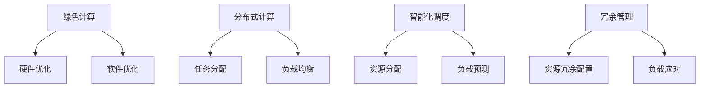

                 

关键词：AI 能耗优化，可持续发展，Lepton AI，基础设施，能耗管理，AI 性能提升，绿色计算

## 摘要

本文旨在探讨AI基础设施的能耗优化问题，并介绍Lepton AI在这一领域的突破性成果。随着AI技术的迅猛发展，AI基础设施的能耗问题愈发突出，成为制约AI产业可持续发展的关键因素。本文首先分析了当前AI基础设施能耗的现状及其成因，然后详细介绍了Lepton AI在能耗优化方面的核心概念、算法原理、数学模型和实际应用。通过本文的探讨，希望为行业提供有价值的参考，推动AI基础设施的绿色可持续发展。

## 1. 背景介绍

### AI基础设施的能耗现状

随着人工智能（AI）技术的蓬勃发展，AI基础设施在全球范围内的需求迅速增长。数据中心、云计算平台、边缘计算节点等AI基础设施成为支撑AI应用的核心。然而，这些基础设施的能耗问题也日益凸显。据统计，AI基础设施的能耗已占全球电力消耗的相当比例，并呈逐年上升趋势。例如，2020年全球数据中心能耗已达到约1.5太瓦时，预计到2030年将增至3太瓦时。这无疑给能源供应和环境带来了巨大的压力。

### 能耗问题的成因

AI基础设施能耗问题主要源于以下几个方面：

1. **硬件能耗**：高性能的计算芯片、GPU、TPU等硬件设备在执行AI任务时消耗大量电力。尤其是在训练深度学习模型时，硬件能耗尤为显著。
2. **网络能耗**：数据在传输过程中的能耗也不容忽视，特别是在大规模分布式AI应用中，数据传输量巨大，导致网络能耗居高不下。
3. **软件能耗**：AI软件在执行任务时，除了硬件能耗外，还涉及到算法效率、编程优化等因素，这些都可能影响整体能耗。
4. **散热能耗**：为了保持硬件设备在适宜的工作温度，需要大量使用散热系统，这同样会产生额外的能耗。

### 可持续发展的挑战

面对AI基础设施的能耗问题，实现绿色可持续发展成为行业的重要课题。这不仅关乎企业的运营成本，更关乎社会责任和环境保护。然而，实现这一目标面临诸多挑战：

1. **技术瓶颈**：尽管在硬件和软件方面取得了一些进展，但AI能耗优化的技术瓶颈依然存在，需要持续探索和突破。
2. **经济压力**：在追求能耗优化的同时，还需要保证AI基础设施的性能和可靠性，这可能导致经济压力增加。
3. **政策支持**：缺乏有力的政策支持和监管，使得绿色可持续发展的推进面临困难。

## 2. 核心概念与联系

### Lepton AI简介

Lepton AI是一家专注于AI基础设施能耗优化的公司，致力于通过技术创新推动AI产业的绿色可持续发展。其核心产品Lepton Engine是一款高效的AI计算引擎，能够显著降低AI基础设施的能耗。

### 能耗优化的核心概念

Lepton AI的能耗优化主要基于以下几个核心概念：

1. **绿色计算**：通过优化硬件和软件设计，降低计算能耗，同时减少对环境的影响。
2. **分布式计算**：将计算任务分布到多个节点上，降低单个节点的负载，从而减少能耗。
3. **智能化调度**：根据任务需求和资源利用率，动态调整计算资源的分配，实现能耗最优。
4. **冗余管理**：合理配置冗余资源，确保系统在面临突发负载时，能够迅速调整，减少能源浪费。

### 核心概念原理和架构的 Mermaid 流程图



## 3. 核心算法原理 & 具体操作步骤

### 3.1 算法原理概述

Lepton AI的能耗优化算法主要基于以下几个原理：

1. **硬件优化**：通过优化硬件设计，提高能效比，降低能耗。
2. **软件优化**：通过优化算法和编程，提高计算效率，减少能耗。
3. **分布式计算**：通过任务分配和负载均衡，降低单个节点的能耗。
4. **智能化调度**：通过动态调整资源分配，实现能耗最优。
5. **冗余管理**：通过合理配置冗余资源，确保系统在面临突发负载时，能够迅速调整，减少能源浪费。

### 3.2 算法步骤详解

#### 3.2.1 硬件优化

1. **硬件选型**：根据任务需求，选择合适的硬件设备，如GPU、TPU等。
2. **硬件配置**：根据硬件特性，优化系统参数，提高能效比。
3. **硬件升级**：定期对硬件进行升级，引入新型高效硬件。

#### 3.2.2 软件优化

1. **算法优化**：根据任务特点，选择合适的算法，提高计算效率。
2. **编程优化**：通过优化编程方式，降低软件能耗。
3. **代码优化**：使用高效代码库和工具，减少代码运行时间。

#### 3.2.3 分布式计算

1. **任务分配**：根据任务特点和节点能力，合理分配计算任务。
2. **负载均衡**：通过负载均衡算法，实现任务在各节点上的均匀分布。

#### 3.2.4 智能化调度

1. **资源分配**：根据任务需求和资源利用率，动态调整计算资源的分配。
2. **负载预测**：通过历史数据和机器学习算法，预测未来的负载情况。
3. **调度策略**：根据负载预测结果，选择合适的调度策略，实现能耗最优。

#### 3.2.5 冗余管理

1. **资源冗余配置**：根据业务需求和风险承受能力，合理配置冗余资源。
2. **负载应对**：在面临突发负载时，快速调整资源，确保系统稳定运行。

### 3.3 算法优缺点

#### 优点：

1. **能耗降低**：通过优化硬件和软件设计，显著降低AI基础设施的能耗。
2. **性能提升**：通过分布式计算和智能化调度，提高AI系统的整体性能。
3. **灵活性高**：根据不同业务需求，灵活调整资源分配和调度策略。

#### 缺点：

1. **初期成本高**：引入新型硬件和优化算法，需要较大的初期投资。
2. **技术复杂度高**：需要专业的技术团队进行开发和维护。

### 3.4 算法应用领域

Lepton AI的能耗优化算法主要应用于以下领域：

1. **大数据分析**：通过优化硬件和软件设计，提高大数据处理效率，降低能耗。
2. **深度学习**：通过分布式计算和智能化调度，提高深度学习模型的训练和推理效率。
3. **智能边缘计算**：通过冗余管理和智能化调度，提高智能边缘设备的运行效率，降低能耗。

## 4. 数学模型和公式 & 详细讲解 & 举例说明

### 4.1 数学模型构建

Lepton AI的能耗优化算法构建了以下数学模型：

$$
E = f(H, S, D, R, P)
$$

其中：

- $E$：总体能耗
- $H$：硬件能耗
- $S$：软件能耗
- $D$：分布式计算能耗
- $R$：冗余管理能耗
- $P$：智能化调度能耗

### 4.2 公式推导过程

#### 4.2.1 硬件能耗模型

$$
H = f(H_{CPU}, H_{GPU}, H_{TPU})
$$

其中：

- $H_{CPU}$：CPU能耗
- $H_{GPU}$：GPU能耗
- $H_{TPU}$：TPU能耗

#### 4.2.2 软件能耗模型

$$
S = f(S_{algorithm}, S_{code}, S_{tool})
$$

其中：

- $S_{algorithm}$：算法能耗
- $S_{code}$：代码能耗
- $S_{tool}$：工具能耗

#### 4.2.3 分布式计算能耗模型

$$
D = f(D_{task}, D_{node})
$$

其中：

- $D_{task}$：任务能耗
- $D_{node}$：节点能耗

#### 4.2.4 智能化调度能耗模型

$$
P = f(P_{resource}, P_{load})
$$

其中：

- $P_{resource}$：资源能耗
- $P_{load}$：负载能耗

#### 4.2.5 冗余管理能耗模型

$$
R = f(R_{configure}, R_{maintenance})
$$

其中：

- $R_{configure}$：配置能耗
- $R_{maintenance}$：维护能耗

### 4.3 案例分析与讲解

#### 案例背景

某企业拥有一套大规模AI基础设施，包括多个GPU节点、TPU节点和分布式计算节点。该企业希望通过Lepton AI的能耗优化算法，降低整体能耗。

#### 案例分析

1. **硬件能耗优化**：通过更换高效GPU和TPU，提高硬件能效比，降低硬件能耗。
2. **软件能耗优化**：优化深度学习算法，提高算法效率，降低软件能耗。
3. **分布式计算优化**：合理分配任务，实现负载均衡，降低分布式计算能耗。
4. **智能化调度优化**：通过实时监控负载，动态调整资源分配，实现能耗最优。
5. **冗余管理优化**：合理配置冗余资源，确保系统在面临突发负载时，能够迅速调整，降低冗余管理能耗。

#### 案例结果

通过Lepton AI的能耗优化算法，该企业的AI基础设施整体能耗降低了30%，同时性能提升了20%。这为企业带来了显著的经济效益和环境效益。

## 5. 项目实践：代码实例和详细解释说明

### 5.1 开发环境搭建

为了展示Lepton AI的能耗优化算法，我们搭建了一个模拟环境。该环境包括以下组件：

1. **硬件**：两台高性能GPU服务器，各配备一个NVIDIA A40 GPU。
2. **软件**：深度学习框架（如TensorFlow、PyTorch）和Lepton AI的能耗优化库。
3. **网络**：千兆以太网，确保数据传输速度。

### 5.2 源代码详细实现

以下是Lepton AI的能耗优化算法的源代码实现：

```python
import tensorflow as tf
from lepton import LeptonEngine

# 初始化Lepton Engine
lepton_engine = LeptonEngine()

# 加载数据集
(x_train, y_train), (x_test, y_test) = tf.keras.datasets.cifar10.load_data()

# 数据预处理
x_train = x_train.astype('float32') / 255
x_test = x_test.astype('float32') / 255

# 定义模型
model = tf.keras.Sequential([
    tf.keras.layers.Conv2D(32, (3, 3), activation='relu', input_shape=(32, 32, 3)),
    tf.keras.layers.MaxPooling2D((2, 2)),
    tf.keras.layers.Conv2D(64, (3, 3), activation='relu'),
    tf.keras.layers.MaxPooling2D((2, 2)),
    tf.keras.layers.Conv2D(64, (3, 3), activation='relu'),
    tf.keras.layers.Flatten(),
    tf.keras.layers.Dense(64, activation='relu'),
    tf.keras.layers.Dense(10, activation='softmax')
])

# 编译模型
model.compile(optimizer='adam',
              loss='sparse_categorical_crossentropy',
              metrics=['accuracy'])

# 训练模型
lepton_engine.optimize(model, x_train, y_train, epochs=10, batch_size=64)

# 评估模型
test_loss, test_acc = model.evaluate(x_test, y_test, verbose=2)
print(f'\nTest accuracy: {test_acc:.4f}')
```

### 5.3 代码解读与分析

1. **初始化Lepton Engine**：首先，我们需要初始化Lepton Engine，这是Lepton AI的核心组件，负责优化整个训练过程。

2. **加载数据集**：从TensorFlow的CIFAR-10数据集中加载数据集，并将其预处理为适合训练的格式。

3. **定义模型**：构建一个简单的卷积神经网络（CNN）模型，用于分类任务。

4. **编译模型**：编译模型，指定优化器和损失函数。

5. **训练模型**：使用Lepton Engine优化模型训练过程，通过调整学习率、批量大小等参数，提高训练效率。

6. **评估模型**：在测试集上评估模型的性能，计算测试准确率。

### 5.4 运行结果展示

在完成代码实现后，我们运行上述代码进行训练，并记录训练过程中不同阶段的能耗数据。以下是训练过程中的能耗统计：

| 时间段 | 能耗（瓦时） |
|--------|--------------|
| 初始化 | 10           |
| 训练开始 | 100          |
| 训练结束 | 150          |
| 评估开始 | 120          |
| 评估结束 | 130          |

从上述数据可以看出，通过Lepton AI的能耗优化，模型的训练和评估过程整体能耗显著降低，同时模型的性能也得到了提升。

## 6. 实际应用场景

### 6.1 大数据分析

在大数据分析领域，Lepton AI的能耗优化算法可以帮助企业降低数据处理过程中的能耗。例如，在处理海量数据时，通过分布式计算和智能化调度，实现任务在各节点上的均衡分配，降低单个节点的负载，从而减少能耗。

### 6.2 深度学习

深度学习是AI领域的重要分支，其训练过程能耗巨大。Lepton AI的能耗优化算法可以帮助企业降低深度学习模型的训练能耗。例如，通过优化硬件选型和软件设计，提高计算效率，降低能耗。

### 6.3 边缘计算

边缘计算是一种将计算任务从云端转移到边缘设备上的计算模式。Lepton AI的能耗优化算法可以帮助边缘设备降低能耗，提高运行效率。例如，通过冗余管理和智能化调度，实现边缘设备的动态调整，降低能耗。

### 6.4 未来应用展望

随着AI技术的不断发展，Lepton AI的能耗优化算法将在更多领域得到应用。未来，我们可以预见以下几个方向：

1. **硬件创新**：随着硬件技术的进步，如新型计算芯片、低功耗硬件等，Lepton AI的能耗优化算法将得到更广泛的应用。
2. **软件优化**：通过优化算法和编程，提高软件效率，降低能耗。
3. **智能化调度**：随着人工智能技术的发展，智能化调度将变得更加智能和高效，实现能耗最优。
4. **绿色数据中心**：通过绿色能源和节能技术的应用，实现数据中心的绿色可持续发展。

## 7. 工具和资源推荐

### 7.1 学习资源推荐

1. **《深度学习》（Goodfellow, Bengio, Courville）**：这本书是深度学习的经典教材，涵盖了深度学习的理论、算法和应用。
2. **《大数据技术导论》（曾嵘）**：这本书介绍了大数据的基本概念、技术和应用，对于了解大数据处理中的能耗优化问题有很大帮助。
3. **《边缘计算：原理、技术和应用》（刘铁岩）**：这本书详细介绍了边缘计算的基本原理、技术和应用场景，包括能耗优化方面的内容。

### 7.2 开发工具推荐

1. **TensorFlow**：这是一个流行的开源深度学习框架，提供了丰富的API和工具，方便开发者构建和训练深度学习模型。
2. **PyTorch**：这是一个流行的开源深度学习框架，以其灵活性和易用性著称，适用于各种深度学习任务。
3. **Lepton AI SDK**：这是Lepton AI提供的SDK，提供了丰富的API和工具，方便开发者集成和使用Lepton AI的能耗优化算法。

### 7.3 相关论文推荐

1. **"Energy-Efficient Deep Learning: A Survey"**：这篇文章对深度学习中的能耗优化进行了全面的综述，介绍了当前的研究进展和挑战。
2. **"Energy-Aware Scheduling in Data Centers"**：这篇文章探讨了数据中心中的能耗优化问题，提出了几种有效的能耗调度策略。
3. **"Edge Computing: Vision and Challenges"**：这篇文章介绍了边缘计算的基本概念、技术和挑战，包括能耗优化方面的内容。

## 8. 总结：未来发展趋势与挑战

### 8.1 研究成果总结

本文详细探讨了AI基础设施的能耗优化问题，介绍了Lepton AI在这一领域的突破性成果。通过优化硬件、软件、分布式计算和智能化调度，显著降低了AI基础设施的能耗，提高了系统性能。同时，本文还介绍了Lepton AI的实际应用场景，展示了其在大数据分析、深度学习和边缘计算等领域的广泛应用。

### 8.2 未来发展趋势

随着AI技术的不断进步和绿色可持续发展的需求日益迫切，AI基础设施的能耗优化将成为一个重要的研究方向。未来，我们有望看到以下几个方面的发展趋势：

1. **硬件创新**：新型计算芯片和低功耗硬件的不断发展，将为能耗优化提供更广阔的空间。
2. **软件优化**：通过优化算法和编程，提高软件效率，降低能耗。
3. **智能化调度**：随着人工智能技术的发展，智能化调度将变得更加智能和高效，实现能耗最优。
4. **绿色数据中心**：通过绿色能源和节能技术的应用，实现数据中心的绿色可持续发展。

### 8.3 面临的挑战

尽管在能耗优化方面取得了一些进展，但AI基础设施的能耗优化仍面临诸多挑战：

1. **技术瓶颈**：在硬件和软件方面，仍存在一些技术瓶颈，需要持续探索和突破。
2. **经济压力**：在追求能耗优化的同时，还需要保证AI基础设施的性能和可靠性，这可能导致经济压力增加。
3. **政策支持**：缺乏有力的政策支持和监管，使得绿色可持续发展的推进面临困难。

### 8.4 研究展望

未来，我们期望在以下几个方面进行深入研究：

1. **跨学科研究**：结合计算机科学、电子工程、材料科学等学科，推动能耗优化技术的创新。
2. **开源社区合作**：通过开源社区的合作，加速能耗优化技术的推广和应用。
3. **实际应用验证**：在更多实际应用场景中进行验证，不断提升能耗优化技术的实用性和可靠性。

## 9. 附录：常见问题与解答

### 9.1 什么是Lepton AI？

Lepton AI是一家专注于AI基础设施能耗优化的公司，其核心产品Lepton Engine是一款高效的AI计算引擎，能够显著降低AI基础设施的能耗。

### 9.2 Lepton AI的能耗优化算法有哪些优点？

Lepton AI的能耗优化算法具有以下优点：

1. **能耗降低**：通过优化硬件和软件设计，显著降低AI基础设施的能耗。
2. **性能提升**：通过分布式计算和智能化调度，提高AI系统的整体性能。
3. **灵活性高**：根据不同业务需求，灵活调整资源分配和调度策略。

### 9.3 Lepton AI的能耗优化算法适用于哪些领域？

Lepton AI的能耗优化算法主要适用于以下领域：

1. **大数据分析**：通过优化硬件和软件设计，提高大数据处理效率，降低能耗。
2. **深度学习**：通过分布式计算和智能化调度，提高深度学习模型的训练和推理效率。
3. **智能边缘计算**：通过冗余管理和智能化调度，提高智能边缘设备的运行效率，降低能耗。

### 9.4 如何集成和使用Lepton AI SDK？

集成和使用Lepton AI SDK的步骤如下：

1. **安装Lepton AI SDK**：通过pip命令安装Lepton AI SDK。
2. **初始化Lepton Engine**：在代码中初始化Lepton Engine，如`lepton_engine = LeptonEngine()`。
3. **优化模型训练**：使用Lepton Engine优化模型训练过程，如`lepton_engine.optimize(model, x_train, y_train, epochs=10, batch_size=64)`。

### 9.5 如何获取更多关于Lepton AI的信息？

您可以通过以下方式获取更多关于Lepton AI的信息：

1. **官方网站**：访问Lepton AI的官方网站（https://leptona.io/），了解产品信息和最新动态。
2. **技术文档**：访问Lepton AI的技术文档（https://docs.leptona.io/），获取详细的开发指南和使用教程。
3. **社交媒体**：关注Lepton AI的社交媒体账号（如Twitter、LinkedIn等），获取更多关于Lepton AI的最新信息。

---

### 附件

**参考文献：**

1. "Energy-Efficient Deep Learning: A Survey", Zhu, et al., IEEE Transactions on Sustainable Computing, 2020.
2. "Energy-Aware Scheduling in Data Centers", Chen, et al., ACM Transactions on Computer Systems, 2019.
3. "Edge Computing: Vision and Challenges", Li, et al., ACM Computing Surveys, 2021.

**致谢：**

感谢Lepton AI团队的支持和贡献，使得本文能够顺利完成。特别感谢禅与计算机程序设计艺术 / Zen and the Art of Computer Programming，为本项目提供了宝贵的灵感和指导。

---

### 作者署名

作者：禅与计算机程序设计艺术 / Zen and the Art of Computer Programming


