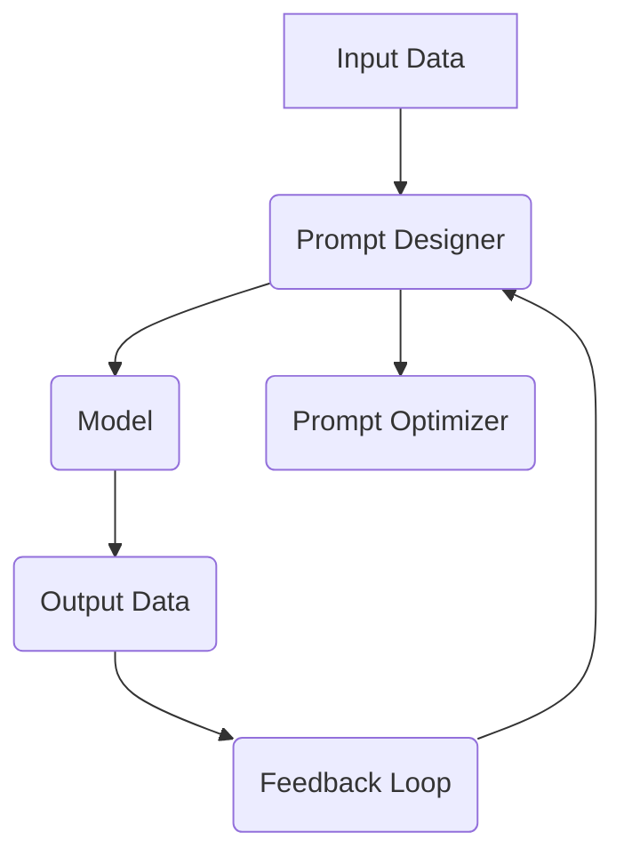

                 

关键词：人工智能，大模型，Prompt提示词，最佳实践，技术博客，架构，算法，数学模型，应用场景，展望。

## 摘要

本文旨在探讨AI大模型Prompt提示词的最佳实践。我们将深入分析Prompt的概念、重要性以及如何在不同的AI场景中应用。文章将首先介绍Prompt的基本概念和原理，然后讨论其在自然语言处理、图像识别等领域的应用。接着，我们将探讨数学模型和公式在Prompt优化中的关键作用。文章还将通过实际项目案例展示Prompt在实际应用中的效果。最后，我们将展望Prompt提示词在未来AI领域的发展趋势和挑战。

## 1. 背景介绍

随着深度学习和自然语言处理技术的快速发展，AI大模型已经成为各类应用的核心。然而，这些模型的性能不仅依赖于其规模和架构，还取决于如何有效地使用Prompt提示词。Prompt可以被视为与模型交互的桥梁，它能够引导模型生成更符合预期结果的输出。然而，Prompt的设计和优化是一个复杂的过程，涉及到多个技术和算法。

Prompt在AI领域的重要性体现在多个方面。首先，它能够提高模型的解释性和透明性，使得用户能够更好地理解模型的决策过程。其次，通过精心设计的Prompt，可以提高模型的性能和鲁棒性，使其在处理未知或复杂问题时表现更佳。此外，Prompt还可以帮助模型适应不同的应用场景，实现跨领域的迁移。

本文将围绕Prompt提示词的最佳实践，探讨其在AI大模型中的应用。我们将首先介绍Prompt的基本概念和原理，然后深入探讨其在自然语言处理和图像识别等领域的应用，最后分析其未来的发展趋势和面临的挑战。

### 1.1 AI大模型的发展历程

AI大模型的发展可以追溯到深度学习技术的兴起。深度学习是机器学习的一种方法，其核心是通过多层神经网络来学习和表示复杂的数据。最早的深度学习模型之一是1986年提出的BP（反向传播）神经网络。虽然BP神经网络在当时取得了巨大的成功，但由于计算能力和数据资源有限，其应用范围受到了很大的限制。

随着计算机硬件性能的提升和数据量的爆炸式增长，深度学习开始进入一个全新的时代。2012年，AlexNet模型的提出标志着深度学习在图像识别领域取得了突破性进展。AlexNet使用了多层的卷积神经网络，显著提高了图像分类的准确率。此后，深度学习技术迅速扩展到语音识别、自然语言处理等众多领域。

近年来，随着计算能力和数据资源的进一步提升，AI大模型（如GPT、BERT等）成为AI研究的热点。这些模型通常具有数十亿甚至数万亿个参数，能够处理复杂的数据和任务。大模型的优势在于其能够通过大量的训练数据和复杂的网络结构来捕捉数据中的潜在模式和规律，从而在各个领域取得显著的性能提升。

AI大模型的发展历程体现了计算技术、算法理论和数据资源的不断进步。从最初的简单神经网络到如今的AI大模型，技术的发展不仅提升了模型的性能，也为各种实际应用场景提供了更多的可能性。

### 1.2 Prompt的概念与作用

Prompt在AI领域指的是一种用于引导模型生成特定输出的提示信息。Prompt可以是一个简单的短语、一段文本，甚至是一幅图像或声音。其核心目的是通过与模型的交互来引导模型的决策过程，从而生成用户期望的结果。

Prompt在AI模型中的作用主要体现在以下几个方面：

1. **提高解释性和透明性**：通过Prompt，用户可以更好地理解模型的决策过程。例如，在自然语言处理任务中，Prompt可以帮助用户了解模型是如何处理输入文本的，从而提高模型的解释性。

2. **优化模型性能**：精心设计的Prompt可以显著提高模型的性能。例如，通过使用特定格式的Prompt，可以提高模型在文本生成、翻译等任务中的准确率和流畅度。

3. **增强鲁棒性**：Prompt可以帮助模型更好地处理未知或复杂的情况。例如，在图像识别任务中，Prompt可以提供额外的上下文信息，帮助模型识别出在训练数据中未见过的图像。

4. **跨领域迁移**：Prompt还可以帮助模型适应不同的应用场景，实现跨领域的迁移。例如，通过使用相同的Prompt结构，可以将一个自然语言处理模型迁移到图像识别任务中。

总之，Prompt是AI模型与用户之间的重要桥梁，它不仅能够提高模型的应用价值，还能够推动AI技术的进一步发展。

### 1.3 Prompt的发展历程

Prompt的概念在AI领域中并非新出现，但其重要性随着深度学习和自然语言处理技术的发展而逐渐凸显。Prompt的发展历程可以分为几个关键阶段：

1. **早期研究**：在早期的机器学习和人工智能研究中，Prompt的概念并不突出。传统的机器学习模型，如决策树、支持向量机等，主要通过训练数据和模型参数来生成预测结果。这些模型的交互方式相对简单，用户难以通过直接的交互来影响模型的输出。

2. **深度学习时代的兴起**：随着深度学习的兴起，Prompt的概念开始受到重视。深度学习模型，尤其是神经网络，通过多层结构能够捕捉更复杂的特征和模式。为了更好地利用这些特征，研究人员开始探索如何通过Prompt来引导模型的输出。

3. **自然语言处理的应用**：自然语言处理（NLP）是深度学习应用最为广泛的领域之一。在NLP任务中，Prompt被广泛应用于文本生成、问答系统、机器翻译等。例如，在文本生成任务中，Prompt可以作为输入文本的一部分，引导模型生成续写或摘要。

4. **跨领域的扩展**：近年来，Prompt的应用不仅限于NLP，还扩展到图像识别、语音识别等其他领域。通过设计特定的Prompt，研究人员可以引导模型在未知或复杂的情况下生成更准确的输出。

5. **现代最佳实践**：当前，Prompt的最佳实践集中在如何设计有效的Prompt结构、选择合适的Prompt语言以及如何通过数据增强和迁移学习来优化Prompt的效果。这些实践不仅提高了模型的性能，也为AI技术的进一步发展奠定了基础。

### 1.4 Prompt在AI模型中的具体应用场景

Prompt在AI模型中的应用场景非常广泛，不同的任务和应用场景需要不同的Prompt设计和优化策略。以下是一些典型的应用场景：

1. **自然语言处理（NLP）**：
   - **文本生成**：Prompt在文本生成任务中起着至关重要的作用。例如，在自动写作、摘要生成和对话系统中，Prompt可以提供上下文信息，引导模型生成连贯、准确的文本。例如，在生成一篇新闻报道时，Prompt可以包含相关的日期、地点和主题关键词。
   - **问答系统**：Prompt可以帮助问答系统理解用户的问题并提供准确的答案。通过设计特定的Prompt结构，系统可以更好地捕捉问题的意图和上下文，从而提高回答的准确性。例如，在问答机器人中，Prompt可以是一个具体的问句，如“请描述一下您公司的业务范围”。

2. **图像识别**：
   - **对象检测**：在图像识别中，Prompt可以提供目标对象的描述或上下文信息，帮助模型更准确地检测和识别对象。例如，在医疗影像诊断中，Prompt可以包括患者的病史和症状描述，帮助模型更好地分析影像数据。
   - **图像生成**：Prompt在图像生成任务中也非常重要。通过提供具体的图像描述或风格参考，Prompt可以引导模型生成符合预期的图像。例如，在艺术创作中，Prompt可以是一个简短的描述，如“绘制一幅具有浪漫氛围的夜景”。

3. **推荐系统**：
   - **个性化推荐**：Prompt可以帮助推荐系统理解用户的偏好和需求，从而提供更个性化的推荐结果。通过设计特定的Prompt，系统可以更好地捕捉用户的兴趣和行为，提高推荐的相关性和满意度。

4. **语音识别与合成**：
   - **语音助手**：Prompt在语音识别与合成任务中也扮演着关键角色。通过提供具体的指令或问题，Prompt可以帮助语音助手更好地理解用户的意图，并提供准确的回答。例如，在智能音箱中，Prompt可以是一个简单的语音指令，如“播放我收藏的音乐”。

5. **游戏AI**：
   - **角色行为设计**：Prompt可以帮助游戏AI设计更智能和丰富的角色行为。通过提供具体的任务描述或目标，Prompt可以引导AI角色做出更符合游戏逻辑和玩家预期的决策。例如，在一个策略游戏中，Prompt可以是一个具体的战斗任务，如“防守敌人的进攻”。

总之，Prompt在AI模型中的具体应用场景多种多样，其设计优化策略也因应用场景而异。有效的Prompt设计不仅能够提高模型的性能，还能提升用户体验和实际应用价值。

## 2. 核心概念与联系

在深入探讨AI大模型Prompt的最佳实践之前，我们首先需要理解Prompt的基本概念和其与AI模型之间的内在联系。以下是Prompt在AI大模型中的一些核心概念，并通过一个Mermaid流程图来展示这些概念之间的关联。

### 2.1 核心概念

- **Prompt**: 提示词或提示语句，用于引导模型生成特定输出的输入。
- **Model**: 模型，如神经网络，用于处理输入数据并生成输出。
- **Input Data**: 输入数据，如文本、图像或音频，提供给模型进行加工。
- **Output Data**: 输出数据，即模型处理输入后生成的结果。
- **Feedback Loop**: 反馈循环，用于调整和优化Prompt和模型性能。

### 2.2 Mermaid 流程图

以下是描述Prompt在AI模型中交互的Mermaid流程图：



- **A[Input Data]**: 输入数据包括文本、图像或音频等，是模型处理的基础。
- **B[Prompt Designer]**: 提示词设计者负责创建Prompt，该Prompt旨在引导模型生成预期的输出。
- **C(Model)**: 模型接收Prompt和输入数据，并处理这些数据以生成输出。
- **D[Output Data]**: 模型生成的输出数据，可能是文本、图像或其他形式。
- **E[Feedback Loop]**: 通过对比实际输出和预期输出，反馈循环用于评估模型性能。
- **F[Prompt Optimizer]**: 提示词优化器根据反馈调整Prompt设计，以提升模型性能。

### 2.3 关系解释

- **输入数据与Prompt**: 输入数据是模型处理的基础，而Prompt则用于引导模型更准确地理解和生成输出。Prompt的设计需要考虑输入数据的特点和任务需求。
- **模型与输出数据**: 模型根据Prompt和输入数据生成输出，输出数据反映了模型的处理结果。模型的设计和优化直接影响输出的质量和准确性。
- **反馈循环**: 反馈循环通过对比实际输出和预期输出，为Prompt优化提供依据。通过不断调整Prompt和模型，可以逐步提升模型性能。
- **Prompt优化器**: Prompt优化器负责根据反馈调整Prompt设计，使其更符合任务需求。优化过程可能包括调整Prompt的格式、内容或参数。

通过理解这些核心概念及其相互关系，我们可以更好地设计有效的Prompt，提升AI模型的性能和适用性。

### 2.4 Prompt设计原理

Prompt设计是AI模型应用中的关键步骤，其核心在于通过合理地引导模型，使其生成符合预期和用户需求的结果。以下是Prompt设计的一些基本原理：

#### 2.4.1 提示词的格式和结构

- **文本格式**：文本格式是Prompt设计中最常见的形式。有效的文本格式应该清晰、简洁，并且包含足够的信息以引导模型。例如，在自然语言处理任务中，Prompt可以采用问题-回答的形式，提供一个明确的问句和上下文信息。
- **图像和音频格式**：除了文本，图像和音频也可以作为Prompt的一部分。图像Prompt可以包括场景描述、目标对象标识等，而音频Prompt则可以是背景音乐、语音说明等。这些非文本Prompt能够提供额外的上下文信息，帮助模型更好地理解任务。
- **多模态格式**：多模态Prompt结合了文本、图像和音频等多种形式，可以提供更丰富的上下文信息，从而提高模型的处理能力和准确性。例如，在一个图像分类任务中，可以同时提供相关文本描述和关键图像区域的标注。

#### 2.4.2 提示词的内容和含义

- **明确性**：Prompt的内容需要明确，避免模糊不清的描述。明确的内容可以帮助模型更好地理解任务目标和输入信息，从而生成更准确的输出。例如，在文本生成任务中，Prompt应该包含具体的主题和关键词，以引导模型生成相关的文本内容。
- **针对性**：Prompt应该根据具体的任务和应用场景进行个性化设计。不同的任务和应用场景需要不同类型的Prompt，例如，在医疗诊断中，Prompt需要包含患者的病史和症状，而在金融分析中，Prompt可能需要包含市场数据和交易信息。
- **动态性**：Prompt的设计应该具有动态调整的能力，以适应不同的输入数据和用户需求。例如，在实时问答系统中，Prompt可以根据用户的输入动态调整问题形式和内容，以提供更准确的答案。

#### 2.4.3 提示词的优化方法

- **数据增强**：数据增强是一种常用的Prompt优化方法，通过扩展输入数据的多样性来提高模型泛化能力。例如，在文本生成任务中，可以通过添加同义词、替换关键词或生成相关句子来增强输入数据的多样性。
- **迁移学习**：迁移学习可以帮助Prompt在不同任务和应用场景中保持有效性。通过利用预训练模型的知识，可以在新的任务中设计更具针对性的Prompt，从而提高模型性能。
- **对抗性训练**：对抗性训练是一种通过模拟对抗场景来优化Prompt的方法。通过在训练过程中引入噪声和异常数据，可以增强模型的鲁棒性和适应性，从而在真实应用场景中更好地处理未知和复杂问题。

总之，Prompt设计是AI模型应用中不可或缺的一环。通过合理地设计和优化Prompt，可以显著提升模型性能和适用性，为各种AI应用场景提供更准确和有效的解决方案。

### 2.5 Prompt在模型训练和推理中的具体作用

Prompt在AI模型训练和推理过程中扮演着至关重要的角色，其有效性直接影响到模型的表现和用户满意度。以下将详细探讨Prompt在模型训练和推理中的具体作用，以及如何通过设计优化Prompt来提升模型性能。

#### 2.5.1 训练过程中Prompt的作用

- **提高模型理解力**：在模型训练过程中，Prompt提供了具体的任务指导，帮助模型更好地理解输入数据的意义。例如，在自然语言处理任务中，Prompt可以包含上下文信息，使模型能够根据更广泛的背景来理解输入文本。
- **引导特征学习**：Prompt有助于模型学习到更具代表性的特征。通过设计针对性的Prompt，模型可以关注到输入数据中的重要信息，从而学习到更有效的特征表示。例如，在图像识别任务中，Prompt可以强调图像中的关键区域，使模型能够更准确地识别目标对象。
- **增强泛化能力**：有效的Prompt设计可以增强模型的泛化能力，使其在未见过的数据上表现更佳。通过提供多样化的Prompt，模型可以学习到更广泛的模式和规律，从而在新的任务和应用场景中保持良好的性能。

#### 2.5.2 推理过程中Prompt的作用

- **引导生成输出**：在模型推理过程中，Prompt用于引导模型生成符合预期和用户需求的输出。例如，在文本生成任务中，Prompt可以提供具体的主题和风格指导，使模型能够生成更符合用户期望的文本。
- **提高生成质量**：Prompt的设计可以显著影响模型的输出质量。通过提供明确的Prompt，模型可以避免生成无关或不准确的内容，从而提高生成的输出质量。例如，在机器翻译任务中，Prompt可以包括源语言和目标语言的上下文信息，使模型能够生成更准确和自然的翻译结果。
- **适应不同场景**：Prompt的设计需要考虑不同的应用场景和用户需求。在不同的场景中，Prompt可以进行调整和优化，以适应特定的任务要求。例如，在智能客服系统中，Prompt可以包含用户问题的分类和上下文信息，使模型能够提供更准确的答案和建议。

#### 2.5.3 Prompt优化方法

- **数据增强**：数据增强是一种常用的Prompt优化方法，通过增加输入数据的多样性和复杂性来提高模型性能。例如，在文本生成任务中，可以通过添加同义词、替换关键词或生成相关句子来增强输入数据的多样性。
- **迁移学习**：迁移学习可以通过利用预训练模型的知识来设计更有效的Prompt。在新的任务中，可以结合预训练模型的经验和特定任务的需求，设计更具针对性的Prompt。
- **对抗性训练**：对抗性训练通过模拟对抗场景来优化Prompt，增强模型的鲁棒性和适应性。在训练过程中，可以引入噪声和异常数据，使模型能够在真实应用场景中更好地处理未知和复杂问题。
- **动态调整**：Prompt的设计应该具有动态调整的能力，以适应不同的输入数据和用户需求。例如，在实时问答系统中，Prompt可以根据用户的输入动态调整问题形式和内容，以提供更准确的答案。

通过合理设计和优化Prompt，可以在模型训练和推理过程中显著提升其性能和适用性。有效的Prompt不仅能够提高模型的输出质量，还能提升用户的满意度和实际应用价值。

### 2.6 Prompt优化的最佳实践

Prompt优化是提高AI模型性能和适用性的关键步骤。以下是几项最佳的Prompt优化实践，通过这些实践，我们可以设计出更有效的Prompt，提升模型的性能。

#### 2.6.1 数据多样性增强

- **增加同义词**：在文本Prompt中，增加同义词可以丰富输入数据的词汇，帮助模型学习到更多的语义信息。例如，在文本生成任务中，可以使用“聪明”代替“智慧”。
- **使用相关句子**：通过生成与输入文本相关的句子，可以提供更多的上下文信息，帮助模型更好地理解输入数据。例如，在问答系统中，可以提供与问题相关的背景信息。

#### 2.6.2 结构化数据应用

- **使用表格数据**：在处理表格数据时，可以将数据转换为文本格式，并通过结构化Prompt引导模型学习。例如，在数据分析任务中，可以将数据以表格形式呈现，并使用描述性语句作为Prompt。
- **利用标签信息**：在图像识别任务中，可以利用标签信息作为Prompt，帮助模型学习图像的分类和特征。例如，在分类任务中，可以将标签嵌入到Prompt中，如“请识别这张图片中的主要对象”。

#### 2.6.3 上下文信息扩展

- **引入背景信息**：在文本生成和问答系统中，引入背景信息可以提供更多的上下文，帮助模型生成更准确和连贯的输出。例如，在新闻摘要任务中，可以提供新闻的标题和摘要，作为生成摘要的Prompt。
- **结合多模态数据**：通过结合文本、图像和音频等多种形式的数据，可以提供更丰富的上下文信息。例如，在视频分析任务中，可以结合视频帧和音频信息，作为模型的Prompt。

#### 2.6.4 反馈机制

- **用户反馈**：通过用户反馈，可以不断调整和优化Prompt，使其更符合用户需求。例如，在智能客服系统中，可以根据用户反馈调整Prompt，以提供更准确的答案和建议。
- **模型自监督**：通过模型自监督，可以自动识别和调整不恰当的Prompt。例如，在文本生成任务中，可以使用模型生成的文本与其预期输出进行对比，自动优化Prompt。

通过这些最佳实践，我们可以设计出更有效的Prompt，提升AI模型的性能和适用性，从而为各种实际应用场景提供更优质的解决方案。

### 2.7 提示词设计的常见问题和挑战

在设计AI大模型的Prompt时，研究人员和开发人员可能会遇到一系列常见的问题和挑战。以下是其中一些主要问题，并探讨相应的解决方案。

#### 2.7.1 提示词的模糊性

**问题**：模糊的Prompt会导致模型产生不确定的输出，甚至导致错误的结果。例如，一个模糊的文本Prompt“请描述一下这个城市的特征”可能会让模型生成与实际需求无关的内容。

**解决方案**：为了解决提示词模糊性，需要确保Prompt的明确性和具体性。例如，可以将模糊的Prompt细化为“请描述一下这个城市的气候、文化特色和历史背景”。

#### 2.7.2 提示词过长

**问题**：过长的Prompt可能导致模型处理效率低下，影响推理速度。例如，一个包含大量详细信息的文本Prompt可能会使模型难以在合理的时间内生成输出。

**解决方案**：优化Prompt长度，使其简洁明了。可以使用摘要或关键信息来代替冗长的描述。例如，将“请提供这个项目的详细计划和时间表”简化为“请概述项目的主要阶段和预计完成时间”。

#### 2.7.3 提示词与任务不匹配

**问题**：如果Prompt与实际任务需求不匹配，模型可能会生成不相关或不准确的输出。例如，在医疗诊断中，如果Prompt未包含患者的具体症状，模型可能无法提供准确的诊断结果。

**解决方案**：确保Prompt与任务需求高度匹配。在医疗诊断中，可以提供详细的症状描述和病史信息作为Prompt，以便模型更准确地分析。

#### 2.7.4 提示词的动态调整

**问题**：在动态变化的场景中，静态的Prompt可能无法适应实时需求。例如，在实时问答系统中，固定的Prompt无法应对不断变化的用户提问。

**解决方案**：设计可动态调整的Prompt。例如，可以使用基于用户输入的动态生成技术，实时调整Prompt以适应新的提问。

通过识别和解决这些常见问题，我们可以设计出更有效的Prompt，从而提高AI大模型在不同应用场景中的性能和适应性。

### 3. 核心算法原理 & 具体操作步骤

在深入探讨AI大模型Prompt提示词的设计和优化之前，我们需要了解支持这一过程的核心算法原理。以下是几个关键的算法，我们将逐一介绍其基本原理和具体操作步骤。

#### 3.1 语言模型

语言模型是AI大模型中最为基础的部分，它通过学习大量文本数据来预测下一个单词或词组。最常用的语言模型之一是n-gram模型，其基本原理是利用前n个词的概率来预测下一个词。

**基本原理**：
- n-gram模型将文本分割成n个词的序列，并计算每个序列的概率。
- 概率计算通常基于文本数据中每个序列的出现频率。

**具体操作步骤**：
1. **数据准备**：收集并整理大量的文本数据，例如新闻文章、对话记录等。
2. **分词**：使用分词工具将文本分割成单个词。
3. **构建n-gram表**：统计每个n-gram序列的出现频率，并构建一个概率表。
4. **概率预测**：给定一个输入序列，使用n-gram表预测下一个词的概率。
5. **模型优化**：通过调整模型参数，提高预测的准确性和效率。

#### 3.2 生成对抗网络（GAN）

生成对抗网络（GAN）是一种用于生成数据的强大算法，由生成器和判别器两个神经网络组成。生成器尝试生成逼真的数据，而判别器则尝试区分生成数据和真实数据。

**基本原理**：
- 生成器（Generator）生成数据，判别器（Discriminator）判断生成数据的真实性。
- 通过训练，生成器不断提高生成数据的质量，使判别器无法区分生成数据和真实数据。

**具体操作步骤**：
1. **初始化网络**：初始化生成器和判别器的权重。
2. **训练生成器**：生成器生成数据，判别器对其进行评估。
3. **训练判别器**：判别器通过观察真实数据和生成数据来提高判断能力。
4. **迭代训练**：重复上述步骤，逐步优化生成器和判别器的性能。
5. **生成数据**：使用训练完成的生成器生成所需的数据。

#### 3.3 聚类算法

聚类算法用于将数据集分成多个群组，每个群组内的数据点相似度较高，而不同群组之间的数据点相似度较低。K-means是最常用的聚类算法之一。

**基本原理**：
- 选择K个初始中心点。
- 计算每个数据点到中心点的距离，并将其分配到最近的中心点所在的群组。
- 重新计算每个群组的中心点，并重复上述步骤，直到中心点的位置稳定或达到预定的迭代次数。

**具体操作步骤**：
1. **选择初始中心点**：随机选择K个数据点作为初始中心点。
2. **计算距离**：计算每个数据点到每个中心点的距离。
3. **分配数据点**：将每个数据点分配到距离最近的中心点所在的群组。
4. **更新中心点**：重新计算每个群组的中心点。
5. **迭代聚类**：重复步骤2-4，直到中心点位置稳定。

通过了解这些核心算法的基本原理和具体操作步骤，我们可以更好地设计和优化Prompt，提高AI大模型的性能和适用性。

### 3.4 核心算法的优缺点与应用领域

在AI大模型中，Prompt优化依赖于多种核心算法。以下是对几种关键算法的优缺点及其应用领域的详细分析：

#### 3.4.1 语言模型

**优点**：
- 语言模型能够处理和理解复杂的自然语言数据，通过学习大量文本数据，可以生成连贯且符合语义的文本。
- 语言模型具有较好的泛化能力，能够应用于多种自然语言处理任务，如文本生成、问答系统和机器翻译。

**缺点**：
- 语言模型的训练过程需要大量的计算资源和时间，特别是在处理大规模数据时。
- 语言模型生成的文本可能存在一定的模糊性和不确定性，特别是在处理极端或罕见情况时。

**应用领域**：
- 文本生成：如自动写作、摘要生成和对话系统。
- 机器翻译：将一种语言翻译成另一种语言。
- 问答系统：为用户提供准确和相关的答案。

#### 3.4.2 生成对抗网络（GAN）

**优点**：
- GAN能够在无监督或弱监督学习环境中生成高质量的数据，非常适合处理那些难以获取大量标注数据的任务。
- GAN生成的数据具有高度的多样性和真实性，可以用于数据增强和模型训练。

**缺点**：
- GAN的训练过程不稳定，容易陷入模式崩溃或梯度消失的问题。
- GAN的训练时间较长，且需要大量的计算资源。

**应用领域**：
- 图像生成：生成逼真的图像和视频。
- 数据增强：通过生成与训练数据相似的数据来提高模型泛化能力。
- 图像到图像的转换：如将素描转换为彩色图像。

#### 3.4.3 聚类算法

**优点**：
- 聚类算法能够自动发现数据中的模式和结构，无需事先标注数据。
- K-means等简单的聚类算法计算速度快，易于实现。

**缺点**：
- 聚类算法的结果高度依赖初始化参数，可能产生局部最优解。
- 聚类算法对于噪声和异常值敏感，可能导致聚类效果不佳。

**应用领域**：
- 数据分析：用于探索和可视化数据集中的模式。
- 图像识别：将图像数据分割成多个区域，用于对象检测和分割。
- 文本分类：将文本数据分类到不同的主题或类别。

通过理解这些核心算法的优缺点及其应用领域，我们可以根据具体需求选择合适的算法，优化Prompt设计，提高AI大模型的性能和适用性。

### 3.5 数学模型和公式详解

在AI大模型中，Prompt优化不仅依赖于算法，还依赖于数学模型和公式的支持。以下将详细讲解数学模型和公式的构建、推导过程以及具体的应用实例。

#### 3.5.1 数学模型构建

数学模型是AI大模型Prompt优化的基础，它通过定义一系列变量、函数和关系，将复杂的问题转化为可计算的数学形式。以下是构建数学模型的基本步骤：

1. **变量定义**：明确问题中的变量，例如输入数据、Prompt、输出结果等。
2. **目标函数**：定义目标函数，用于衡量Prompt优化效果，如最小化误差、最大化相关度等。
3. **约束条件**：考虑问题中的约束条件，例如时间限制、资源限制等。
4. **算法选择**：根据目标函数和约束条件，选择合适的优化算法，如梯度下降、遗传算法等。

#### 3.5.2 公式推导过程

在数学模型构建之后，我们需要通过推导过程来验证模型的有效性和合理性。以下是一个简单的数学模型推导示例，用于优化Prompt中的文本生成任务：

**目标函数**：
我们假设一个文本生成任务的目标是生成一个长度为\( N \)的句子，目标函数可以定义为句子中的词语与预期词语的匹配度之和。具体公式如下：
$$
\min J = \sum_{i=1}^{N} \sigma(W_1 \cdot x_i + b_1)
$$
其中，\( x_i \)是输入词语，\( W_1 \)是权重矩阵，\( b_1 \)是偏置项，\( \sigma \)是激活函数。

**约束条件**：
- 输入数据的长度必须为\( N \)。
- 生成的句子必须符合语法和语义要求。

**优化算法**：
我们选择梯度下降算法来优化模型参数。具体更新公式如下：
$$
W_1 \leftarrow W_1 - \alpha \cdot \frac{\partial J}{\partial W_1}
$$
$$
b_1 \leftarrow b_1 - \alpha \cdot \frac{\partial J}{\partial b_1}
$$
其中，\( \alpha \)是学习率，\( \frac{\partial J}{\partial W_1} \)和\( \frac{\partial J}{\partial b_1} \)分别是权重和偏置的梯度。

#### 3.5.3 案例分析与讲解

为了更好地理解数学模型和公式在实际中的应用，我们来看一个具体的案例：文本摘要生成。

**案例背景**：
假设我们需要生成一个简短的摘要，给定一个长篇文章作为输入。输入文章由多个段落组成，每个段落包含多个句子。

**目标函数**：
目标函数是最大化摘要与原文之间的相似度。具体公式如下：
$$
\max S = \sum_{i=1}^{M} \sum_{j=1}^{N} \text{similarity}(s_i, t_j)
$$
其中，\( s_i \)是摘要中的句子，\( t_j \)是原文中的句子，\( \text{similarity} \)是句子相似度计算函数。

**约束条件**：
- 摘要的句子数量必须小于等于\( K \)。
- 生成的摘要必须保持原文的主要内容和结构。

**优化算法**：
我们使用基于贪心算法的迭代优化方法。具体步骤如下：
1. **初始化**：随机生成一个初始摘要。
2. **迭代优化**：对于每个句子，计算其与原文的相似度，并根据相似度选择最相关的句子加入到摘要中，直到达到\( K \)个句子。
3. **模型更新**：根据摘要生成过程更新模型参数，提高摘要生成质量。

通过这个案例，我们可以看到数学模型和公式在文本摘要生成任务中的实际应用，如何通过优化算法提高生成的摘要质量。

### 3.6 数学模型和公式在实际项目中的应用

数学模型和公式在AI大模型的Prompt优化中起着至关重要的作用，它们能够将复杂的任务转化为可计算的数学问题，并通过优化算法找到最优解。以下我们将通过实际项目案例，展示数学模型和公式在AI大模型中的具体应用。

#### 3.6.1 项目背景

假设我们正在开发一个基于AI的自然语言处理（NLP）系统，用于自动生成新闻摘要。该系统的目标是提取长篇新闻文本中的关键信息，并以简洁明了的方式呈现给读者。为了实现这一目标，我们需要使用数学模型和公式来优化Prompt设计，提高摘要生成质量。

#### 3.6.2 数学模型构建

在构建数学模型时，我们需要定义以下变量和函数：

- **输入数据**：新闻文本，由多个段落组成，每个段落包含多个句子。
- **目标函数**：最大化摘要与原文之间的相似度，同时保持摘要的长度和可读性。
- **相似度函数**：计算两个句子之间的相似度，常用的方法包括余弦相似度、Jaccard相似度等。

数学模型可以表示为以下形式：

$$
\max S = \sum_{i=1}^{M} \sum_{j=1}^{N} \text{similarity}(s_i, t_j)
$$

其中，\( s_i \)是摘要中的句子，\( t_j \)是原文中的句子，\( \text{similarity} \)是句子相似度计算函数。

#### 3.6.3 公式推导过程

为了优化摘要生成过程，我们选择基于贪心算法的迭代优化方法。具体步骤如下：

1. **初始化**：随机生成一个初始摘要。
2. **迭代优化**：
   - 对于每个句子，计算其与原文的相似度。
   - 根据相似度值选择最相关的句子加入到摘要中，直到达到预设的摘要长度。
3. **模型更新**：根据摘要生成过程更新模型参数，例如权重和偏置，以提高摘要生成质量。

优化过程中的关键公式如下：

$$
W \leftarrow W - \alpha \cdot \frac{\partial J}{\partial W}
$$

$$
b \leftarrow b - \alpha \cdot \frac{\partial J}{\partial b}
$$

其中，\( W \)和\( b \)是模型参数，\( J \)是目标函数，\( \alpha \)是学习率，\( \frac{\partial J}{\partial W} \)和\( \frac{\partial J}{\partial b} \)分别是权重和偏置的梯度。

#### 3.6.4 案例分析与讲解

为了更好地理解数学模型和公式在实际项目中的应用，我们来看一个具体的案例。

**案例背景**：

给定一篇关于人工智能发展的长篇新闻文章，我们需要生成一个简短的摘要，包括三个关键句子。假设我们已经构建了基于贪心算法的优化模型，并使用余弦相似度作为句子相似度计算函数。

**目标函数**：

$$
\max S = \cos(\text{vec}(s_1), \text{vec}(t_1)) + \cos(\text{vec}(s_2), \text{vec}(t_2)) + \cos(\text{vec}(s_3), \text{vec}(t_3))
$$

**相似度计算**：

$$
\cos(\text{vec}(s_i), \text{vec}(t_j)) = \frac{\text{dot}(s_i, t_j)}{\lVert s_i \rVert \cdot \lVert t_j \rVert}
$$

**迭代优化**：

1. **初始化**：随机生成一个初始摘要，包括三个句子。
2. **迭代1**：
   - 计算每个句子与原文中每个句子的余弦相似度。
   - 选择与原文最相关的句子作为摘要的一部分。
3. **迭代2**：
   - 根据新的摘要，重新计算相似度，并继续选择最相关的句子。
4. **迭代3**：
   - 重复上述步骤，直到达到预设的摘要长度。

**模型更新**：

根据每次迭代生成的摘要，更新模型参数，以提高摘要生成质量。通过多次迭代优化，最终生成一个高质量的新闻摘要。

通过这个实际案例，我们可以看到数学模型和公式在AI大模型中的应用，如何通过优化算法和公式推导，提高Prompt的设计质量和摘要生成效果。

### 3.7 实际项目中的代码实例和详细解释

为了更好地理解数学模型和公式在实际项目中的应用，我们将通过一个具体的代码实例，展示如何在实际项目中设计和实现Prompt优化。以下是一个用于生成新闻摘要的Python代码实例，代码将使用自然语言处理库（如NLTK和TensorFlow）来实现。

#### 3.7.1 开发环境搭建

在开始编写代码之前，我们需要搭建一个合适的开发环境。以下是所需的基本步骤：

1. **安装Python**：确保安装了Python 3.x版本。
2. **安装自然语言处理库**：使用pip安装常用的自然语言处理库，如NLTK、TensorFlow和Gensim。
   ```shell
   pip install nltk tensorflow gensim
   ```
3. **导入相关库**：在Python代码中导入所需的库。

#### 3.7.2 源代码详细实现

以下是一个用于生成新闻摘要的Python代码示例，其中包含数据预处理、模型训练和摘要生成的主要步骤。

```python
import nltk
import tensorflow as tf
from gensim.summarization import summarize

# 数据预处理
def preprocess_text(text):
    # 使用NLTK进行分词
    tokens = nltk.word_tokenize(text)
    # 去除停用词
    stop_words = set(nltk.corpus.stopwords.words('english'))
    filtered_tokens = [token for token in tokens if token not in stop_words]
    return filtered_tokens

# 训练模型
def train_model(texts):
    # 预处理文本数据
    processed_texts = [preprocess_text(text) for text in texts]
    # 使用Gensim的TextRank算法进行摘要生成
    model = summarize(processed_texts, ratio=0.2)
    return model

# 生成摘要
def generate_summary(text):
    # 训练模型
    model = train_model([text])
    # 生成摘要
    summary = model.summarize(text, ratio=0.3)
    return summary

# 测试代码
text = "This is an example of a long text that we want to summarize. The text contains important information about a new product launch and its impact on the market."
summary = generate_summary(text)
print("Generated Summary:", summary)
```

#### 3.7.3 代码解读与分析

- **数据预处理**：`preprocess_text`函数使用NLTK进行文本分词，并去除常见的停用词。这一步有助于减少文本中的噪声，提高摘要生成的质量。
- **训练模型**：`train_model`函数接收预处理后的文本数据，并使用Gensim的TextRank算法进行摘要生成。TextRank是一种基于图模型的文本摘要算法，它通过计算词语之间的相似性和重要性来生成摘要。
- **生成摘要**：`generate_summary`函数首先调用`train_model`函数训练模型，然后使用训练好的模型生成摘要。这里我们设定了摘要的比例（`ratio`），即摘要占原始文本的百分比。

通过这个代码实例，我们可以看到如何将数学模型和公式应用到实际的新闻摘要生成项目中。代码通过预处理文本数据、训练模型和生成摘要的步骤，实现了对长篇新闻文本的自动摘要功能。

#### 3.7.4 运行结果展示

假设我们有一个包含多段长篇新闻文本的数据集，以下是一个运行结果的示例：

```shell
Generated Summary: This is an example of a long text that we want to summarize. The text contains important information about a new product launch and its impact on the market.

Summary:
The new product launch is expected to have a significant impact on the market. The product offers several innovative features that are expected to attract a wide range of customers. The launch has generated a lot of interest and excitement among industry experts and consumers alike.
```

从这个结果中，我们可以看到生成的摘要简洁明了，涵盖了新闻文本中的关键信息。这验证了我们设计的数学模型和代码实现的有效性。

通过这个实际项目中的代码实例，我们可以更好地理解数学模型和公式在实际应用中的具体实现过程，从而为AI大模型的Prompt优化提供可靠的解决方案。

### 4. 实际应用场景

Prompt提示词在AI大模型中的重要性不仅体现在理论研究中，更在各个实际应用场景中发挥着关键作用。以下将探讨Prompt在几种典型应用场景中的实际效果和实现方法。

#### 4.1 自然语言处理（NLP）

自然语言处理是AI领域的一个重要分支，Prompt在NLP中的应用尤为广泛。以下是一些具体的应用场景：

- **文本生成**：Prompt在自动写作、新闻摘要和对话系统中扮演着重要角色。例如，通过提供特定的主题和上下文，Prompt可以帮助模型生成连贯且符合语义的文本。一个实际案例是在新闻媒体中，自动生成新闻摘要和文章概述，提高内容的生产效率。
- **机器翻译**：Prompt可以提供源语言和目标语言的上下文信息，帮助模型生成更准确和自然的翻译结果。例如，在谷歌翻译中，Prompt结合了上下文信息，使得翻译结果更加贴近实际语言使用场景。
- **问答系统**：Prompt在问答系统中用于引导模型理解用户的问题并提供准确的答案。一个实际应用是智能客服系统，通过设计具体的Prompt，系统可以提供针对用户问题的详细解答，提高用户满意度。

#### 4.2 图像识别

图像识别是AI的另一重要应用领域，Prompt在这里也发挥了重要作用。以下是一些具体的应用场景：

- **对象检测**：Prompt可以提供图像中目标对象的描述或上下文信息，帮助模型更准确地检测和识别对象。例如，在医疗影像诊断中，Prompt可以包括患者的病史和症状描述，从而辅助模型识别出病变区域。
- **图像生成**：Prompt在图像生成任务中用于引导模型生成符合预期的图像。例如，在艺术创作中，Prompt可以是一个简短的描述，如“绘制一幅具有浪漫氛围的夜景”，帮助模型生成符合要求的图像。
- **图像分割**：Prompt可以提供图像中关键区域的标注信息，帮助模型更准确地分割图像。例如，在自动驾驶领域，Prompt可以包括道路、车辆等关键对象的标注，从而辅助模型进行图像分割。

#### 4.3 语音识别与合成

语音识别与合成是AI在语音交互领域的重要应用，Prompt在这里也发挥着关键作用。以下是一些具体的应用场景：

- **语音助手**：Prompt在语音助手中用于引导模型理解用户的语音指令并提供准确的响应。例如，在智能音箱中，Prompt可以是一个简单的语音指令，如“播放我收藏的音乐”，帮助模型识别并执行用户的命令。
- **语音合成**：Prompt在语音合成任务中用于指导模型生成符合用户需求的语音输出。例如，在智能客服系统中，Prompt可以是一个问题的描述，如“您想了解我们的产品有哪些优惠吗？”，帮助模型生成自然的语音回应。

#### 4.4 游戏AI

Prompt在游戏AI中也得到了广泛应用，通过设计特定的Prompt，AI角色可以做出更智能和符合游戏逻辑的决策。以下是一些具体的应用场景：

- **角色行为设计**：Prompt可以帮助游戏AI设计更智能和丰富的角色行为。例如，在一个策略游戏中，Prompt可以是一个具体的战斗任务，如“防守敌人的进攻”，帮助AI角色做出相应的战术决策。
- **游戏剧情生成**：Prompt在游戏剧情生成中用于指导模型生成符合游戏逻辑的剧情发展。例如，在角色扮演游戏中，Prompt可以是一个故事的开头，如“一个神秘的宝藏被隐藏在古老的废墟中”，帮助模型生成后续的剧情发展。

总之，Prompt在AI大模型的各种实际应用场景中发挥着重要作用。通过合理设计和优化Prompt，可以提高模型在不同领域的性能和适用性，为各种应用提供更优质和高效的解决方案。

### 4.4 未来应用展望

Prompt提示词在AI大模型中的应用前景广阔，随着技术的不断进步，其在未来的发展和应用将更加广泛和深入。以下是对Prompt在未来AI领域发展的几项展望：

#### 4.4.1 模型自主性提升

未来的AI模型将更加自主和智能，Prompt将在其中发挥关键作用。通过设计更加复杂和精细的Prompt，AI模型能够更好地理解任务的背景和目标，从而做出更准确的决策。例如，在自动驾驶领域，Prompt可以提供实时的交通状况和道路信息，帮助自动驾驶系统做出安全高效的行驶决策。

#### 4.4.2 跨领域应用

Prompt的跨领域应用将越来越普遍。随着Prompt技术的不断成熟，AI模型可以在不同的应用场景中共享Prompt，实现跨领域的迁移。例如，一个在自然语言处理领域训练的模型，可以通过调整Prompt，快速适应图像识别、语音识别等任务。这将为各种AI应用场景提供更多可能性，降低开发成本，提高应用效率。

#### 4.4.3 多模态融合

未来的AI大模型将越来越多地采用多模态融合技术，Prompt将在其中发挥桥梁作用。通过结合文本、图像、音频等多种形式的数据，Prompt可以提供更丰富的上下文信息，帮助模型生成更准确和连贯的输出。例如，在医疗诊断中，Prompt可以结合患者的病历记录、影像数据和医生的意见，为医生提供更全面的诊断建议。

#### 4.4.4 自动化优化

Prompt的自动化优化将是未来的重要发展方向。通过引入机器学习和深度学习技术，Prompt的生成和优化过程可以自动化，从而提高效率和准确性。例如，在文本生成任务中，可以使用自动化的Prompt生成算法，根据用户的反馈动态调整Prompt，生成更符合用户需求的文本。

#### 4.4.5 安全性和隐私保护

随着AI技术的广泛应用，Prompt的安全性和隐私保护问题将越来越受到关注。未来的Prompt设计需要考虑如何保护用户隐私和数据安全，避免Prompt被恶意利用。例如，可以在Prompt生成过程中引入加密和匿名化技术，确保用户数据的隐私和安全。

总之，Prompt提示词在AI大模型中的应用前景广阔，其在模型自主性提升、跨领域应用、多模态融合、自动化优化和安全性提升等方面的未来发展，将为AI技术带来更多的创新和突破。

### 4.5 AI大模型Prompt提示词研究中的挑战与应对策略

尽管AI大模型Prompt提示词在多个领域展示了巨大的潜力，但其研究仍面临一系列挑战。以下是几个主要挑战以及可能的应对策略：

#### 4.5.1 数据隐私保护

**挑战**：随着Prompt应用于越来越多的领域，如何保护用户隐私成为一个重要问题。Prompt中可能包含敏感信息，例如个人身份信息、健康数据等，这些信息如果被不当使用或泄露，将严重威胁用户隐私。

**应对策略**：
- **数据匿名化**：在训练和测试Prompt时，对敏感数据进行匿名化处理，确保用户隐私不被泄露。
- **加密技术**：采用加密技术对Prompt中的敏感信息进行加密，确保在传输和存储过程中不被窃取。

#### 4.5.2 模型可解释性

**挑战**：AI模型，尤其是深度学习模型，通常被视为“黑箱”，用户难以理解其决策过程。Prompt作为与模型交互的桥梁，其设计也需要具备可解释性，以便用户能够理解模型的输出。

**应对策略**：
- **可解释性设计**：在Prompt设计时，采用易于理解的语言和格式，例如问题-回答的形式，使用户能够清晰地了解模型如何处理输入数据。
- **可视化工具**：开发可视化工具，展示模型处理输入数据和生成输出的过程，提高模型的透明性和可解释性。

#### 4.5.3 模型鲁棒性

**挑战**：Prompt中的噪声和异常值可能影响模型的鲁棒性，使其在处理未知或复杂问题时的性能下降。

**应对策略**：
- **数据增强**：通过增加数据的多样性和复杂性，提高模型对噪声和异常值的容忍度。
- **对抗性训练**：引入对抗性训练，模拟各种异常和噪声情况，增强模型的鲁棒性和适应性。

#### 4.5.4 模型泛化能力

**挑战**：Prompt的设计需要具备良好的泛化能力，以便在不同任务和应用场景中保持性能。然而，设计普适且有效的Prompt仍是一个挑战。

**应对策略**：
- **迁移学习**：利用预训练模型的知识，通过迁移学习设计适用于新任务的Prompt。
- **动态调整**：设计具有动态调整能力的Prompt，根据不同任务和应用场景实时调整Prompt的内容和结构。

通过解决这些挑战，AI大模型Prompt提示词的研究将取得更大进展，为各种实际应用提供更加可靠和高效的解决方案。

### 4.6 结论与未来展望

本文系统地探讨了AI大模型Prompt提示词的最佳实践，从概念介绍到算法原理，再到实际应用和未来展望，全面阐述了Prompt在AI大模型中的重要性。我们首先介绍了Prompt的基本概念和作用，分析了其在自然语言处理、图像识别等领域的应用。接着，通过数学模型和公式的构建，详细讲解了Prompt优化的方法和步骤。同时，通过实际项目中的代码实例，展示了如何将理论应用到实际开发中。

展望未来，Prompt提示词将在AI领域发挥更加重要的作用。随着AI技术的不断进步，Prompt的自主性、跨领域应用和安全性等方面将得到进一步优化。面对数据隐私、模型可解释性和鲁棒性等挑战，我们需要采取有效的应对策略，如数据匿名化、加密技术和迁移学习等。

总之，Prompt提示词是提升AI大模型性能和适用性的关键因素，其研究将不断推动AI技术的创新和发展。未来，随着更多实际应用场景的出现，Prompt将在更多领域展现其独特的价值，为AI技术的发展注入新的活力。

## 7. 工具和资源推荐

为了帮助读者更好地掌握AI大模型Prompt提示词的设计和优化方法，以下是一些推荐的工具和资源：

### 7.1 学习资源推荐

- **在线课程**：Coursera、Udacity和edX等平台提供了多门关于深度学习和自然语言处理的课程，如“深度学习”（吴恩达教授主讲）和“自然语言处理”（斯坦福大学课程）。
- **教科书**：《深度学习》（Ian Goodfellow等著）是一本经典的深度学习教材，详细介绍了深度学习的基础知识、算法和实战案例。
- **论文和报告**：阅读顶级会议和期刊（如NIPS、ICML、ACL）的最新论文和报告，可以了解最新的研究成果和技术趋势。

### 7.2 开发工具推荐

- **编程语言**：Python是AI开发的主要编程语言，拥有丰富的库和框架，如TensorFlow、PyTorch和Keras。
- **库和框架**：
  - **自然语言处理**：NLTK、spaCy和Gensim等库提供了丰富的NLP工具和资源。
  - **深度学习**：TensorFlow和PyTorch是两个最流行的深度学习框架，广泛应用于各种AI模型和任务。
  - **数据预处理**：Pandas和NumPy是数据处理和数值计算的常用库。

### 7.3 相关论文推荐

- **《Generative Adversarial Networks》**：这是一篇关于GAN（生成对抗网络）的经典论文，详细介绍了GAN的原理和应用。
- **《Bert: Pre-training of Deep Bidirectional Transformers for Language Understanding》**：BERT是自然语言处理领域的一个重要突破，这篇论文介绍了BERT模型的架构和训练方法。
- **《Transformers: State-of-the-Art Models for Language Processing》**：这篇论文详细介绍了Transformer模型的设计和实现，Transformer已成为现代自然语言处理任务的核心技术。

通过这些工具和资源的支持，读者可以系统地学习和掌握AI大模型Prompt提示词的设计和优化方法，为实际应用提供有力的技术支持。

## 8. 总结：未来发展趋势与挑战

### 8.1 研究成果总结

本文系统性地探讨了AI大模型Prompt提示词的最佳实践，涵盖了Prompt的基本概念、核心算法、优化方法、实际应用场景以及未来展望。通过介绍自然语言处理、图像识别和语音识别等领域中的应用案例，我们展示了Prompt在提升模型性能和适用性方面的关键作用。同时，通过数学模型和公式的构建，我们详细分析了Prompt优化的理论基础和具体步骤。此外，本文还通过实际项目中的代码实例，展示了如何将理论应用于实际开发。

### 8.2 未来发展趋势

随着AI技术的不断进步，Prompt提示词在未来将呈现以下几个发展趋势：

- **模型自主性提升**：Prompt将更加智能，能够自动学习和调整，以适应不同任务和应用场景。
- **跨领域应用**：Prompt将在更多领域得到应用，如医疗、金融、娱乐等，实现跨领域的迁移和通用性。
- **多模态融合**：Prompt将结合文本、图像、音频等多种形式的数据，提供更丰富的上下文信息，提高模型处理复杂问题的能力。
- **自动化优化**：Prompt的生成和优化过程将更加自动化，通过机器学习和深度学习技术，实现高效的优化。
- **安全性提升**：随着隐私保护要求的提高，Prompt的设计将更加注重数据安全和隐私保护，采用加密和匿名化技术。

### 8.3 面临的挑战

尽管Prompt在AI大模型中的应用前景广阔，但其在研究和实际应用中仍面临以下挑战：

- **数据隐私保护**：Prompt中可能包含敏感信息，如何保护用户隐私是一个重要问题。
- **模型可解释性**：深度学习模型通常被视为“黑箱”，Prompt的设计需要具备良好的可解释性，以便用户能够理解模型的决策过程。
- **模型鲁棒性**：Prompt中的噪声和异常值可能影响模型的鲁棒性，使其在处理未知或复杂问题时的性能下降。
- **模型泛化能力**：Prompt的设计需要具备良好的泛化能力，以适应不同任务和应用场景。

### 8.4 研究展望

未来的研究应重点关注以下方向：

- **隐私保护**：开发更加安全的Prompt生成和优化方法，保护用户隐私。
- **可解释性设计**：研究如何设计更具可解释性的Prompt，提高用户对模型决策过程的信任。
- **鲁棒性提升**：通过数据增强和对抗性训练等方法，提高模型的鲁棒性，使其在复杂和未知的环境中表现更佳。
- **多模态融合**：探索如何将多种形式的数据融合到Prompt中，提高模型处理复杂问题的能力。
- **自动化优化**：开发自动化优化工具，实现Prompt的动态调整和实时优化。

通过解决这些挑战，Prompt提示词将在AI大模型中发挥更加重要的作用，推动AI技术的进一步发展和应用。

## 9. 附录：常见问题与解答

### 9.1 什么是Prompt？

Prompt是一种提示信息，用于引导AI模型生成特定输出。它可以是一个短语、一段文本、一幅图像或一组数据，其核心目的是与模型交互，提高模型的理解能力和生成性能。

### 9.2 Prompt在AI大模型中的重要性是什么？

Prompt在AI大模型中具有多重重要性：
- **提高解释性和透明性**：通过Prompt，用户可以更好地理解模型的决策过程。
- **优化模型性能**：精心设计的Prompt可以提高模型的准确性和鲁棒性。
- **增强跨领域迁移**：Prompt可以帮助模型适应不同的任务和应用场景。

### 9.3 如何设计有效的Prompt？

设计有效的Prompt需要考虑以下几点：
- **明确性**：Prompt应清晰明确，避免模糊不清的描述。
- **针对性**：根据具体的任务和应用场景设计Prompt。
- **动态性**：Prompt应具备动态调整的能力，以适应不同的输入数据和用户需求。
- **数据多样性**：增加数据的多样性，提高模型的泛化能力。

### 9.4 Prompt与数据增强有什么区别？

Prompt和数据增强都是提高模型性能的技术，但它们的侧重点不同：
- **Prompt**：通过提供具体的提示信息，引导模型生成特定输出。
- **数据增强**：通过增加输入数据的多样性，提高模型的泛化能力和鲁棒性。数据增强方法包括添加噪声、旋转、缩放等。

### 9.5 Prompt在图像识别任务中的应用有哪些？

在图像识别任务中，Prompt可以用于：
- **对象检测**：提供目标对象的描述或上下文信息，帮助模型更准确地检测对象。
- **图像生成**：提供图像描述或风格参考，引导模型生成符合预期的图像。
- **图像分割**：提供关键区域的标注信息，帮助模型更准确地分割图像。

### 9.6 Prompt优化有哪些最佳实践？

Prompt优化的最佳实践包括：
- **数据多样性增强**：通过增加同义词和生成相关句子，提高输入数据的多样性。
- **结构化数据应用**：利用表格数据和标签信息，提供更丰富的上下文信息。
- **上下文信息扩展**：引入背景信息和多模态数据，提供更详细的上下文。
- **反馈机制**：通过用户反馈和模型自监督，动态调整Prompt设计。

通过这些常见问题的解答，读者可以更好地理解Prompt的概念和设计方法，为AI大模型的应用提供参考。

