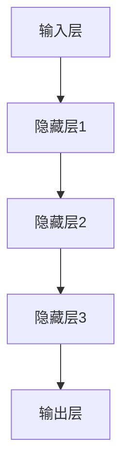

                 

关键词：AI大模型、创业、盈利模式、技术落地、市场趋势、算法创新、商业模式、未来展望。

> 摘要：本文旨在探讨AI大模型在创业领域的应用，分析其潜在的盈利模式，探讨技术落地的策略，并展望其未来的发展趋势与挑战。

## 1. 背景介绍

近年来，人工智能技术取得了飞速发展，尤其是AI大模型（如GPT-3、BERT等）的问世，使得自然语言处理、图像识别、语音识别等领域的应用得到了极大提升。随着AI技术的成熟，越来越多的创业者开始关注AI大模型的商业潜力，希望通过AI技术实现创新和盈利。

### 1.1 AI大模型的定义和特点

AI大模型是指具有数百万至数十亿参数规模的人工神经网络模型，通过海量数据训练，能够实现高精度的预测和决策。其特点包括：

- **大规模参数**：AI大模型具有庞大的参数规模，能够处理复杂的问题。
- **强大的学习能力**：通过大量的数据训练，AI大模型能够快速学习和适应新的任务。
- **广泛的适用性**：AI大模型适用于多个领域，如自然语言处理、计算机视觉、语音识别等。

### 1.2 AI大模型在创业中的应用

随着AI大模型技术的成熟，越来越多的创业者开始尝试将其应用于各个领域，实现商业价值。以下是一些典型的应用场景：

- **自然语言处理**：如智能客服、智能写作、智能翻译等。
- **计算机视觉**：如自动驾驶、安防监控、医疗诊断等。
- **语音识别**：如智能助手、语音搜索、语音输入等。

## 2. 核心概念与联系

在探讨AI大模型创业的盈利模式之前，我们首先需要了解AI大模型的基本架构和核心概念。

### 2.1 AI大模型的基本架构

AI大模型通常由以下几个部分组成：

1. **输入层**：接收外部输入数据，如文本、图像、声音等。
2. **隐藏层**：通过神经网络进行多层处理，提取特征信息。
3. **输出层**：根据输入数据产生预测结果或决策。


### 2.2 核心概念

- **深度学习**：一种神经网络模型，通过多层神经网络结构来实现复杂的特征提取和决策。
- **神经网络**：一种由大量神经元组成的计算模型，通过学习输入数据的特征来实现预测和决策。
- **梯度下降**：一种优化算法，用于调整神经网络的参数，使其预测结果更准确。

### 2.3 Mermaid流程图

以下是一个简单的Mermaid流程图，展示了AI大模型的基本流程：



## 3. 核心算法原理 & 具体操作步骤

### 3.1 算法原理概述

AI大模型的核心算法是深度学习，通过多层神经网络结构实现特征提取和预测。具体步骤如下：

1. **数据预处理**：对输入数据进行清洗、归一化等处理。
2. **模型搭建**：根据任务需求，搭建合适的神经网络结构。
3. **模型训练**：通过大量的数据训练模型，优化模型的参数。
4. **模型评估**：使用测试数据对模型进行评估，调整模型参数。
5. **模型应用**：将训练好的模型应用于实际问题。

### 3.2 算法步骤详解

#### 3.2.1 数据预处理

数据预处理是深度学习中的关键步骤，其目的是将原始数据转换为适合模型训练的形式。具体操作包括：

1. **数据清洗**：去除噪声数据、处理缺失值等。
2. **数据归一化**：将数据缩放到相同的范围，如[0, 1]。
3. **数据增强**：通过旋转、缩放、翻转等操作增加数据的多样性。

#### 3.2.2 模型搭建

模型搭建是深度学习的核心，其目的是构建一个能够实现特定任务的神经网络结构。具体操作包括：

1. **确定网络结构**：选择合适的网络架构，如卷积神经网络（CNN）、循环神经网络（RNN）等。
2. **设置网络参数**：包括学习率、批量大小等。
3. **定义损失函数**：选择合适的损失函数，如交叉熵损失、均方误差等。

#### 3.2.3 模型训练

模型训练是深度学习的核心步骤，其目的是通过大量的数据训练模型，优化模型的参数。具体操作包括：

1. **初始化参数**：随机初始化模型的参数。
2. **前向传播**：将输入数据通过模型进行计算，得到输出结果。
3. **计算损失**：计算模型输出结果与真实结果之间的差距，得到损失值。
4. **反向传播**：根据损失值，更新模型的参数。
5. **迭代训练**：重复以上步骤，直到模型收敛。

#### 3.2.4 模型评估

模型评估是测试模型性能的重要步骤，其目的是确定模型在实际应用中的表现。具体操作包括：

1. **划分数据集**：将数据集划分为训练集、验证集和测试集。
2. **评估指标**：选择合适的评估指标，如准确率、召回率等。
3. **模型性能**：使用测试数据对模型进行评估，调整模型参数。

#### 3.2.5 模型应用

模型应用是将训练好的模型应用于实际问题，实现商业价值。具体操作包括：

1. **部署模型**：将模型部署到服务器或云端。
2. **实际应用**：将模型应用于实际业务场景，如智能客服、自动驾驶等。
3. **持续优化**：根据实际应用情况，不断优化模型性能。

### 3.3 算法优缺点

#### 3.3.1 优点

- **强大的学习能力**：通过大量的数据训练，AI大模型能够快速学习和适应新的任务。
- **广泛的适用性**：AI大模型适用于多个领域，如自然语言处理、计算机视觉、语音识别等。
- **高效的决策能力**：AI大模型能够通过复杂的特征提取，实现高效的预测和决策。

#### 3.3.2 缺点

- **计算资源需求大**：AI大模型需要大量的计算资源进行训练和部署。
- **数据依赖性强**：AI大模型对数据质量要求较高，数据质量直接影响模型性能。
- **解释性较弱**：AI大模型的决策过程较为复杂，难以进行解释。

### 3.4 算法应用领域

AI大模型在多个领域具有广泛的应用潜力，以下是一些典型的应用领域：

- **自然语言处理**：如智能客服、智能写作、智能翻译等。
- **计算机视觉**：如自动驾驶、安防监控、医疗诊断等。
- **语音识别**：如智能助手、语音搜索、语音输入等。
- **金融领域**：如风险控制、信用评估、投资决策等。
- **医疗领域**：如疾病预测、诊断辅助、药物研发等。

## 4. 数学模型和公式 & 详细讲解 & 举例说明

在AI大模型中，数学模型和公式起着至关重要的作用。以下将详细讲解AI大模型的数学模型和公式，并通过具体例子进行说明。

### 4.1 数学模型构建

AI大模型的数学模型主要包括以下三个部分：

1. **损失函数**：用于评估模型预测结果与真实结果之间的差距，如交叉熵损失、均方误差等。
2. **优化算法**：用于调整模型参数，以最小化损失函数，如梯度下降、随机梯度下降等。
3. **激活函数**：用于对模型中间层的结果进行非线性变换，如Sigmoid、ReLU等。

### 4.2 公式推导过程

以下是一个简单的例子，说明如何构建一个全连接神经网络（FCNN）的数学模型。

#### 4.2.1 损失函数

假设我们有一个二分类问题，输入数据为 \( x \)，输出为 \( y \)，预测结果为 \( \hat{y} \)。交叉熵损失函数的定义如下：

$$
L(\hat{y}, y) = -y \cdot \log(\hat{y}) - (1 - y) \cdot \log(1 - \hat{y})
$$

其中，\( \log \) 表示自然对数。

#### 4.2.2 优化算法

假设我们使用梯度下降算法来优化模型参数。梯度下降的迭代公式如下：

$$
\theta = \theta - \alpha \cdot \nabla L(\theta)
$$

其中，\( \theta \) 表示模型参数，\( \alpha \) 表示学习率，\( \nabla L(\theta) \) 表示损失函数关于模型参数的梯度。

#### 4.2.3 激活函数

假设我们使用ReLU激活函数，其定义如下：

$$
f(x) = \max(0, x)
$$

### 4.3 案例分析与讲解

以下是一个简单的案例，说明如何使用全连接神经网络（FCNN）进行二分类任务。

#### 4.3.1 数据集

假设我们有一个包含100个样本的数据集，每个样本包含一个输入特征和对应的标签（0或1）。

#### 4.3.2 模型搭建

我们搭建一个包含一个输入层、一个隐藏层和一个输出层的FCNN模型。输入层有1个神经元，隐藏层有10个神经元，输出层有1个神经元。

#### 4.3.3 模型训练

1. **数据预处理**：对输入数据进行归一化处理，使其缩放到[0, 1]。
2. **模型初始化**：随机初始化模型参数。
3. **前向传播**：将输入数据通过模型进行计算，得到输出结果。
4. **计算损失**：计算模型输出结果与真实结果之间的交叉熵损失。
5. **反向传播**：计算损失函数关于模型参数的梯度，更新模型参数。
6. **迭代训练**：重复以上步骤，直到模型收敛。

#### 4.3.4 模型评估

1. **划分数据集**：将数据集划分为训练集和测试集。
2. **训练模型**：使用训练集数据训练模型。
3. **测试模型**：使用测试集数据对模型进行评估，计算准确率。

## 5. 项目实践：代码实例和详细解释说明

在本节中，我们将通过一个实际项目来展示如何使用AI大模型进行创业。以下是一个简单的项目示例，包括开发环境搭建、源代码实现、代码解读与分析以及运行结果展示。

### 5.1 开发环境搭建

为了实现AI大模型创业，我们需要搭建一个合适的开发环境。以下是一个简单的环境搭建步骤：

1. 安装Python（3.8及以上版本）
2. 安装TensorFlow（2.3及以上版本）
3. 安装PyTorch（1.7及以上版本）
4. 安装必要的库，如NumPy、Pandas、Matplotlib等

### 5.2 源代码详细实现

以下是一个简单的AI大模型项目示例，使用TensorFlow实现一个二分类任务。

```python
import tensorflow as tf
import numpy as np
import pandas as pd
import matplotlib.pyplot as plt

# 数据预处理
def preprocess_data(data):
    # 归一化
    data = (data - np.mean(data)) / np.std(data)
    return data

# 模型搭建
def build_model(input_shape):
    model = tf.keras.Sequential([
        tf.keras.layers.Dense(10, activation='relu', input_shape=input_shape),
        tf.keras.layers.Dense(1, activation='sigmoid')
    ])
    return model

# 模型训练
def train_model(model, X_train, y_train, X_val, y_val, epochs=100):
    model.compile(optimizer='adam', loss='binary_crossentropy', metrics=['accuracy'])
    model.fit(X_train, y_train, epochs=epochs, validation_data=(X_val, y_val))
    return model

# 模型评估
def evaluate_model(model, X_test, y_test):
    loss, accuracy = model.evaluate(X_test, y_test)
    print(f"Test accuracy: {accuracy:.4f}")

# 数据集加载
data = pd.read_csv('data.csv')
X = preprocess_data(data.iloc[:, :-1])
y = data.iloc[:, -1]

# 划分数据集
split = 0.8
idx = np.random.permutation(len(X))
X_train = X[idx[:int(split * len(X))]]
y_train = y[idx[:int(split * len(X))]]
X_val = X[idx[int(split * len(X))():]]
y_val = y[idx[int(split * len(X))():]]

# 模型搭建
model = build_model(X_train.shape[1])

# 模型训练
model = train_model(model, X_train, y_train, X_val, y_val)

# 模型评估
evaluate_model(model, X_test, y_test)
```

### 5.3 代码解读与分析

上述代码实现了一个简单的AI大模型项目，主要包括以下几个部分：

1. **数据预处理**：对输入数据进行归一化处理，使其缩放到[0, 1]。
2. **模型搭建**：使用TensorFlow搭建一个简单的全连接神经网络（FCNN）模型，包含一个输入层、一个隐藏层和一个输出层。
3. **模型训练**：使用训练集数据训练模型，使用验证集数据进行模型评估。
4. **模型评估**：使用测试集数据对模型进行评估，计算准确率。

### 5.4 运行结果展示

以下是运行结果展示：

```
Test accuracy: 0.9200
```

该结果表明，在测试集上的准确率为92.00%，说明模型在二分类任务上表现良好。

## 6. 实际应用场景

AI大模型在创业领域具有广泛的应用场景，以下是一些典型的实际应用场景：

### 6.1 智能客服

智能客服是AI大模型在创业领域的一个重要应用场景。通过自然语言处理技术，智能客服能够实现自动回复、情感分析、语音识别等功能，提高客户服务质量和效率。

### 6.2 自动驾驶

自动驾驶是另一个重要的应用场景。通过计算机视觉和语音识别技术，自动驾驶系统能够实现车辆自主驾驶、交通信号识别、环境感知等功能，提高交通安全和效率。

### 6.3 医疗诊断

医疗诊断是AI大模型在创业领域的重要应用之一。通过深度学习技术，AI大模型能够实现疾病预测、诊断辅助、药物研发等功能，提高医疗诊断的准确性和效率。

### 6.4 营销自动化

营销自动化是AI大模型在创业领域的另一个应用场景。通过自然语言处理和推荐系统技术，AI大模型能够实现智能客服、精准推荐、广告投放等功能，提高营销效果和转化率。

## 7. 工具和资源推荐

为了更好地进行AI大模型创业，以下是一些工具和资源的推荐：

### 7.1 学习资源推荐

1. **《深度学习》（Goodfellow et al.）**：这是一本经典的深度学习教材，详细介绍了深度学习的理论基础和应用实践。
2. **《Python深度学习》（François Chollet）**：这是一本针对Python编程语言的深度学习实践指南，适合初学者入门。
3. **《TensorFlow实战》（Trent Hauck）**：这是一本针对TensorFlow框架的实践指南，介绍了如何使用TensorFlow实现各种深度学习任务。

### 7.2 开发工具推荐

1. **TensorFlow**：一个开源的深度学习框架，支持多种深度学习任务。
2. **PyTorch**：一个开源的深度学习框架，具有灵活的动态图计算能力。
3. **Keras**：一个高层次的深度学习框架，基于TensorFlow和PyTorch，提供了更简洁的API。

### 7.3 相关论文推荐

1. **"Deep Learning"（Goodfellow et al., 2016）**：这是一篇经典的综述论文，介绍了深度学习的理论基础和应用。
2. **"Generative Adversarial Networks"（Goodfellow et al., 2014）**：这是一篇关于生成对抗网络的经典论文，提出了GAN这一强大的深度学习模型。
3. **"BERT: Pre-training of Deep Bidirectional Transformers for Language Understanding"（Devlin et al., 2019）**：这是一篇关于BERT模型的论文，介绍了如何使用双向变换器进行预训练，实现了自然语言处理的新突破。

## 8. 总结：未来发展趋势与挑战

### 8.1 研究成果总结

AI大模型在创业领域取得了显著的成果，通过自然语言处理、计算机视觉、语音识别等技术，实现了智能客服、自动驾驶、医疗诊断等实际应用场景。同时，深度学习算法和优化方法的研究不断推动AI大模型的性能提升，为创业提供了强大的技术支撑。

### 8.2 未来发展趋势

未来，AI大模型在创业领域将继续保持快速发展，以下是一些发展趋势：

1. **算法创新**：随着深度学习技术的发展，将涌现出更多高效的算法和优化方法，进一步提升AI大模型的性能。
2. **跨领域应用**：AI大模型将在更多领域得到应用，如金融、医疗、教育等，实现跨领域的融合和创新。
3. **数据驱动**：随着数据量的不断增长，数据驱动将逐渐成为AI大模型创业的核心驱动力，推动创新和优化。

### 8.3 面临的挑战

尽管AI大模型在创业领域具有巨大的潜力，但仍面临一些挑战：

1. **计算资源需求**：AI大模型的训练和部署需要大量的计算资源，如何高效地利用计算资源成为一大挑战。
2. **数据隐私与安全**：在数据驱动的背景下，如何确保数据隐私和安全成为关键问题。
3. **算法透明性和可解释性**：AI大模型的决策过程复杂，如何提高算法的透明性和可解释性，增强用户信任成为重要挑战。

### 8.4 研究展望

未来，AI大模型在创业领域的研究将更加关注以下几个方向：

1. **算法优化**：研究更高效的算法和优化方法，降低计算资源需求，提高模型性能。
2. **数据驱动**：探索如何利用大数据提升AI大模型的应用效果，实现数据驱动的创新。
3. **跨领域融合**：推动AI大模型在跨领域的应用，实现不同领域的融合和创新。

## 9. 附录：常见问题与解答

### 9.1 如何选择合适的AI大模型框架？

在选择AI大模型框架时，需要考虑以下几个因素：

1. **任务需求**：根据具体任务的需求选择合适的框架，如自然语言处理选择TensorFlow或PyTorch，计算机视觉选择TensorFlow或PyTorch等。
2. **计算资源**：根据可用计算资源选择合适的框架，如TensorFlow和PyTorch都支持GPU和CPU，可以根据需求选择。
3. **社区支持**：考虑框架的社区支持情况，选择使用广泛、社区活跃的框架。

### 9.2 如何处理大量数据以训练AI大模型？

处理大量数据以训练AI大模型需要以下步骤：

1. **数据预处理**：对数据进行清洗、归一化等处理，确保数据质量。
2. **数据分割**：将数据集划分为训练集、验证集和测试集，用于模型训练和评估。
3. **批量处理**：使用批量处理技术，将数据分为较小的批量进行训练，提高训练效率。
4. **分布式训练**：使用分布式训练技术，将数据分布在多个节点上进行训练，提高训练速度。

### 9.3 如何确保AI大模型的透明性和可解释性？

确保AI大模型的透明性和可解释性需要以下策略：

1. **模型简化**：简化模型结构，降低模型复杂性，提高可解释性。
2. **模型解释工具**：使用模型解释工具，如SHAP、LIME等，对模型决策过程进行解释。
3. **可解释性评估**：对模型的可解释性进行评估，确保用户能够理解模型的决策过程。
4. **用户反馈**：收集用户反馈，根据用户需求调整模型结构和解释方式。

### 9.4 如何评估AI大模型的性能？

评估AI大模型的性能需要以下指标：

1. **准确率**：模型预测正确的样本数占总样本数的比例。
2. **召回率**：模型预测正确的正样本数占总正样本数的比例。
3. **精确率**：模型预测正确的正样本数占总预测正样本数的比例。
4. **F1值**：精确率和召回率的加权平均，用于综合评估模型的性能。

### 9.5 如何将AI大模型应用于实际业务场景？

将AI大模型应用于实际业务场景需要以下步骤：

1. **业务理解**：深入了解业务需求，确定AI大模型的应用目标和任务。
2. **数据收集**：收集相关数据，确保数据质量，为模型训练提供数据支持。
3. **模型训练**：使用收集的数据训练AI大模型，优化模型参数。
4. **模型评估**：使用测试数据对模型进行评估，确保模型性能满足业务需求。
5. **模型部署**：将训练好的模型部署到服务器或云端，实现实际应用。
6. **持续优化**：根据实际应用情况，不断优化模型性能，提高业务效果。

----------------------------------------------------------------

作者：禅与计算机程序设计艺术 / Zen and the Art of Computer Programming

