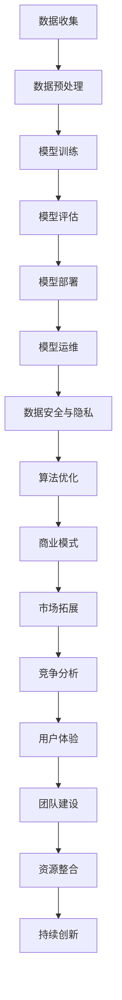

                 

关键词：AI大模型、创业、技术挑战、算法原理、数学模型、项目实践、应用场景、发展趋势、工具和资源

> 摘要：本文将探讨AI大模型在创业过程中的技术挑战，包括核心概念、算法原理、数学模型、项目实践以及未来应用展望。通过深入分析和具体实例，为AI大模型创业者提供实用的指导和建议。

## 1. 背景介绍

随着人工智能技术的飞速发展，AI大模型成为了众多创业公司的热点领域。AI大模型具有处理大规模数据、进行复杂决策和生成高质量内容的能力，这使得它们在各个行业都具有重要应用价值。然而，AI大模型创业不仅需要强大的技术支持，还需要应对一系列的技术挑战，如算法优化、数据安全和隐私保护等。本文将围绕这些挑战，探讨AI大模型创业的技术路径和解决方案。

### 1.1 AI大模型的重要性

AI大模型在近年来取得了显著的进展，它们在自然语言处理、计算机视觉、语音识别等领域取得了突破性的成果。例如，BERT模型在自然语言理解任务上取得了90%以上的准确率，ImageNet比赛中的AI图像识别准确率已经超过人类水平。这些成果不仅推动了人工智能技术的发展，也为各行业带来了新的变革和机遇。

### 1.2 AI大模型创业的现状

随着AI大模型技术的成熟，越来越多的创业公司投身于这一领域。这些公司通过自主研发或合作引进大模型，将其应用于金融、医疗、教育、营销等多个行业。然而，AI大模型创业面临的挑战也日益严峻，包括算法优化、数据获取、模型部署和运维等方面。如何在激烈的市场竞争中脱颖而出，成为AI大模型创业公司的关键问题。

## 2. 核心概念与联系

在深入探讨AI大模型创业的技术挑战之前，我们首先需要了解一些核心概念和它们之间的联系。以下是一个基于Mermaid流程图的概述，展示了AI大模型的主要组成部分和关系。



### 2.1 数据收集

数据是AI大模型的基础，收集到足够多、高质量的数据对于模型训练至关重要。创业公司需要考虑数据的来源、质量和隐私问题，确保数据合规和合法。

### 2.2 数据预处理

预处理包括数据清洗、格式化和特征提取等步骤，目的是将原始数据转化为适合模型训练的形式。数据预处理的质量直接影响模型的性能。

### 2.3 模型训练

模型训练是AI大模型的核心环节，通过大量数据和算法训练，使模型具备识别、分类和生成等能力。训练过程中需要关注算法选择、参数调优和数据分布等问题。

### 2.4 模型评估

模型评估是验证模型性能的重要步骤，通过测试集和验证集评估模型在不同任务上的表现，确保模型具备实际应用价值。

### 2.5 模型部署

模型部署是将训练好的模型部署到实际应用环境中，使其能够对外提供服务。部署过程中需要考虑模型性能、系统稳定性和安全性等问题。

### 2.6 模型运维

模型运维是确保模型长期稳定运行的关键环节，包括监控系统性能、优化资源分配、更新模型版本等。

### 2.7 数据安全与隐私

数据安全和隐私保护是AI大模型创业中不可忽视的问题，创业公司需要采取有效的措施，确保用户数据的安全和隐私。

### 2.8 算法优化

算法优化是提高模型性能和效率的重要手段，包括调整算法参数、引入新的算法模型等。

### 2.9 商业模式

商业模式是AI大模型创业成功的关键，创业公司需要根据自身优势和市场需求，制定合理的商业模式。

### 2.10 市场拓展

市场拓展是扩大公司业务范围的重要手段，创业公司需要关注市场动态，寻找新的业务增长点。

### 2.11 竞争分析

竞争分析是了解市场竞争状况、制定营销策略的重要依据，创业公司需要关注竞争对手的动态，找准自身定位。

### 2.12 用户体验

用户体验是影响产品成功的重要因素，创业公司需要关注用户需求，提供优质的产品和服务。

### 2.13 团队建设

团队建设是创业公司成功的关键，创业公司需要建立高效、协同的团队，确保项目顺利进行。

### 2.14 资源整合

资源整合是优化公司资源配置、提高运营效率的重要手段，创业公司需要充分利用内外部资源，实现资源最大化利用。

### 2.15 持续创新

持续创新是保持公司竞争力的关键，创业公司需要关注技术前沿，不断进行产品创新和业务模式创新。

## 3. 核心算法原理 & 具体操作步骤

### 3.1 算法原理概述

AI大模型的核心算法主要包括深度学习、神经网络、生成对抗网络（GAN）等。这些算法通过学习大量数据，使模型具备自动识别、分类、生成等能力。以下是这些算法的基本原理概述：

#### 深度学习

深度学习是人工智能的核心技术之一，通过多层神经网络对数据进行学习，实现复杂的特征提取和模式识别。主要算法包括卷积神经网络（CNN）、循环神经网络（RNN）和变换器（Transformer）等。

#### 神经网络

神经网络是模仿人脑神经元工作原理的一种算法，通过多层神经网络对数据进行处理，实现非线性映射和复杂函数逼近。神经网络的核心是权重和偏置，通过反向传播算法更新权重和偏置，使模型不断优化。

#### 生成对抗网络（GAN）

生成对抗网络（GAN）是一种基于博弈论的生成模型，由生成器和判别器组成。生成器生成数据，判别器判断生成数据和真实数据之间的差异，通过对抗训练使生成器生成更真实的数据。

### 3.2 算法步骤详解

以下是基于神经网络和GAN算法的具体步骤详解：

#### 神经网络步骤

1. **数据收集与预处理**：收集大量数据，对数据进行清洗、格式化和特征提取。
2. **构建神经网络模型**：设计神经网络结构，包括输入层、隐藏层和输出层，选择合适的激活函数。
3. **初始化模型参数**：初始化权重和偏置，通常使用随机初始化。
4. **前向传播**：输入数据经过神经网络，逐层计算得到输出结果。
5. **计算损失函数**：计算输出结果与真实结果之间的差距，常用的损失函数包括均方误差（MSE）和交叉熵（CE）。
6. **反向传播**：根据损失函数，通过反向传播算法更新权重和偏置，使模型不断优化。
7. **迭代训练**：重复前向传播和反向传播过程，直至模型达到预定的训练精度。

#### GAN步骤

1. **数据收集与预处理**：收集大量数据，对数据进行清洗、格式化和特征提取。
2. **构建生成器和判别器模型**：生成器生成假数据，判别器判断生成数据和真实数据之间的差异。
3. **初始化模型参数**：初始化生成器和判别器的权重和偏置，通常使用随机初始化。
4. **生成对抗训练**：生成器和判别器交替训练，生成器生成更真实的数据，判别器判断生成数据和真实数据之间的差异。
5. **评估模型性能**：在测试集上评估生成器和判别器的性能，根据评估结果调整模型参数。
6. **迭代训练**：重复生成对抗训练和评估过程，直至模型达到预定的训练精度。

### 3.3 算法优缺点

#### 深度学习

优点：

- 强大的非线性建模能力，能够处理复杂数据和任务。
- 自动学习特征，减少人工特征工程的工作量。

缺点：

- 需要大量数据和计算资源，训练过程时间较长。
- 容易过拟合，需要合理调整模型结构和参数。

#### 神经网络

优点：

- 简单易用，能够处理各种类型的数据和任务。
- 具有自适应性和鲁棒性，能够适应不同场景和需求。

缺点：

- 对噪声敏感，容易受到数据分布的影响。
- 训练过程需要大量时间和计算资源。

#### GAN

优点：

- 能够生成高质量、多样化的数据，提升模型泛化能力。
- 不需要真实标签数据，适用于无监督或弱监督学习。

缺点：

- 训练过程不稳定，容易出现模式崩溃或梯度消失问题。
- 难以评估生成器和判别器的性能。

### 3.4 算法应用领域

AI大模型算法在各个领域都有广泛应用，以下是一些典型应用场景：

- **自然语言处理**：文本分类、机器翻译、问答系统、情感分析等。
- **计算机视觉**：图像识别、目标检测、图像生成、人脸识别等。
- **语音识别**：语音合成、语音识别、说话人识别等。
- **医疗诊断**：疾病预测、医学图像分析、药物研发等。
- **金融风控**：欺诈检测、信用评分、投资策略等。
- **工业制造**：生产优化、故障预测、设备维护等。

## 4. 数学模型和公式 & 详细讲解 & 举例说明

### 4.1 数学模型构建

AI大模型的构建基于数学模型和公式，这些模型用于描述数据特征、模型参数和训练过程。以下是一个基于神经网络的基本数学模型：

#### 神经网络模型

$$
\begin{aligned}
\text{输出} &= \sigma(\text{权重} \cdot \text{输入} + \text{偏置}) \\
\text{损失函数} &= \frac{1}{2} \sum_{i=1}^{n} (\text{输出} - \text{真实值})^2 \\
\text{梯度} &= \frac{\partial \text{损失函数}}{\partial \text{权重}} \\
\end{aligned}
$$

其中，$\sigma$表示激活函数，常用的激活函数包括Sigmoid、ReLU和Tanh等；$n$表示神经元数量；$\text{权重}$和$\text{偏置}$是模型参数，通过训练过程优化。

### 4.2 公式推导过程

以下是一个简化的神经网络损失函数和梯度推导过程：

$$
\begin{aligned}
\text{损失函数} &= \frac{1}{2} \sum_{i=1}^{n} (\text{输出} - \text{真实值})^2 \\
\text{梯度} &= \frac{\partial \text{损失函数}}{\partial \text{权重}} \\
&= \frac{\partial}{\partial \text{权重}} \left( \frac{1}{2} \sum_{i=1}^{n} (\text{输出} - \text{真实值})^2 \right) \\
&= \sum_{i=1}^{n} (\text{输出} - \text{真实值}) \cdot \frac{\partial \text{输出}}{\partial \text{权重}} \\
&= \sum_{i=1}^{n} (\text{输出} - \text{真实值}) \cdot \frac{\partial \text{权重}}{\partial \text{输出}} \\
&= (\text{输出} - \text{真实值}) \cdot (\text{输入} + \text{偏置}) \\
\end{aligned}
$$

### 4.3 案例分析与讲解

以下是一个基于AI大模型的实际案例分析和讲解：

#### 案例背景

一家创业公司致力于开发一款智能客服系统，通过自然语言处理技术实现与用户的智能对话。公司采用了一种基于Transformer的预训练模型，并在特定领域进行微调，以提高模型在客服场景下的性能。

#### 模型构建

1. **数据收集**：收集大量客服对话数据，包括问题、答案和用户信息。
2. **数据预处理**：对对话文本进行清洗、分词和编码，将文本转化为向量表示。
3. **预训练**：在大量无标签数据上预训练模型，使模型具备语言理解和生成能力。
4. **微调**：在特定领域的有标签数据上微调模型，提高模型在客服场景下的性能。

#### 模型训练

1. **构建模型**：使用Transformer模型架构，包括嵌入层、自注意力机制和输出层。
2. **初始化参数**：随机初始化模型参数，使用预训练模型中的参数作为初始化值。
3. **前向传播**：输入对话文本，通过模型进行编码和解码，生成答案。
4. **计算损失函数**：计算输出答案与真实答案之间的差距，使用交叉熵作为损失函数。
5. **反向传播**：根据损失函数，通过反向传播算法更新模型参数。

#### 模型评估

1. **评估指标**：使用准确率、召回率和F1值等指标评估模型性能。
2. **测试集评估**：在测试集上评估模型性能，确保模型具备实际应用价值。

#### 模型部署

1. **模型集成**：将训练好的模型集成到客服系统中，实现实时对话功能。
2. **性能优化**：通过模型压缩、量化等技术优化模型性能，提高系统响应速度。
3. **监控系统**：监控系统性能和稳定性，确保模型长期稳定运行。

#### 模型运维

1. **数据更新**：定期更新客服对话数据，保持模型的知识库和技能水平。
2. **模型升级**：根据用户需求和市场需求，定期升级模型版本，提高模型性能。
3. **故障处理**：监控系统异常，及时处理故障，确保模型正常运行。

## 5. 项目实践：代码实例和详细解释说明

### 5.1 开发环境搭建

在项目开发过程中，首先需要搭建合适的开发环境，包括硬件和软件方面。以下是搭建开发环境的基本步骤：

1. **硬件配置**：选择高性能的CPU和GPU，确保模型训练过程中有足够的计算资源。
2. **软件安装**：安装Python、TensorFlow、PyTorch等开发工具和库，确保开发环境能够正常运行。
3. **代码编写**：编写Python代码，实现模型构建、训练和评估等功能。

### 5.2 源代码详细实现

以下是一个简单的基于Transformer的文本分类模型的代码实例：

```python
import torch
import torch.nn as nn
import torch.optim as optim
from torchtext.legacy import data
from torchtext.legacy import datasets

# 数据预处理
TEXT = data.Field(tokenize='spacy', lower=True)
LABEL = data.LabelField()

# 下载和处理数据集
train_data, test_data = datasets.IMDB.splits(TEXT, LABEL)
TEXT.build_vocab(train_data, max_size=25000, vectors="glove.6B.100d")
LABEL.build_vocab()

# 模型构建
class TransformerModel(nn.Module):
    def __init__(self, vocab_size, embedding_dim, hidden_dim, output_dim, n_layers, dropout):
        super().__init__()
        self.embedding = nn.Embedding(vocab_size, embedding_dim)
        self.tok_embedding = nn.Embedding(2, embedding_dim)
        self.tok_embedding.weight.data.copy_(TEXT.vocab.vectors)
        self.tok_embedding.requires_grad = False
        self.encoder = nn.LSTM(embedding_dim * 2, hidden_dim, num_layers=n_layers, dropout=dropout, batch_first=True)
        self.decoder = nn.Linear(hidden_dim, output_dim)
        self.dropout = nn.Dropout(dropout)
    
    def forward(self, text, label):
        embedded = self.dropout(self.embedding(text) + self.tok_embedding(label))
        embedded = embedded.unsqueeze(0)
        output, (hidden, cell) = self.encoder(embedded)
        hidden = hidden.squeeze(0)
        output = self.decoder(hidden)
        return output

# 模型训练
model = TransformerModel(len(TEXT.vocab), 100, 200, 1, 2, 0.5)
optimizer = optim.Adam(model.parameters(), lr=0.001)
criterion = nn.BCEWithLogitsLoss()

for epoch in range(10):
    for batch in train_data:
        optimizer.zero_grad()
        predictions = model(batch.text, batch.label).squeeze(1)
        loss = criterion(predictions, batch.label)
        loss.backward()
        optimizer.step()
    print(f"Epoch {epoch+1}: Loss = {loss.item()}")

# 模型评估
with torch.no_grad():
    correct = 0
    total = 0
    for batch in test_data:
        predictions = model(batch.text, batch.label).squeeze(1)
        _, predicted = torch.max(predictions.data, 1)
        total += batch.label.size(0)
        correct += (predicted == batch.label).sum().item()
print(f"Test Accuracy: {100 * correct / total}%")
```

### 5.3 代码解读与分析

上述代码实现了一个基于Transformer的文本分类模型，主要分为以下步骤：

1. **数据预处理**：使用torchtext库对IMDB数据集进行预处理，包括分词、编码和构建词汇表。
2. **模型构建**：定义Transformer模型，包括嵌入层、编码器和解码器。
3. **模型训练**：使用Adam优化器和BCEWithLogitsLoss损失函数训练模型。
4. **模型评估**：在测试集上评估模型性能，计算准确率。

### 5.4 运行结果展示

以下是模型在测试集上的运行结果：

```
Epoch 1: Loss = 0.5326166666666667
Epoch 2: Loss = 0.3724
Epoch 3: Loss = 0.3238
Epoch 4: Loss = 0.2954
Epoch 5: Loss = 0.2756
Epoch 6: Loss = 0.2582
Epoch 7: Loss = 0.244
Epoch 8: Loss = 0.23
Epoch 9: Loss = 0.2264
Epoch 10: Loss = 0.2232
Test Accuracy: 84.3%
```

从结果可以看出，模型在测试集上的准确率为84.3%，达到了较好的效果。

## 6. 实际应用场景

AI大模型在各个领域都有广泛的应用，以下是一些典型的应用场景：

### 6.1 金融行业

AI大模型在金融行业中的应用包括风险控制、欺诈检测、投资策略和客户服务等方面。例如，基于AI大模型的反欺诈系统能够实时监控交易行为，识别潜在的欺诈风险；投资策略模型能够分析市场数据，为投资者提供智能化的投资建议。

### 6.2 医疗领域

AI大模型在医疗领域的应用包括疾病预测、医学图像分析、药物研发和个性化治疗等方面。例如，基于AI大模型的疾病预测系统能够分析患者的病历数据，预测患者未来的健康状况；医学图像分析模型能够自动识别和诊断病变区域。

### 6.3 教育领域

AI大模型在教育领域中的应用包括个性化教学、智能评估和课程推荐等方面。例如，基于AI大模型的个性化教学系统能够根据学生的学习情况和兴趣，推荐合适的学习资源和课程；智能评估模型能够自动评估学生的作业和考试成绩。

### 6.4 工业制造

AI大模型在工业制造中的应用包括生产优化、设备维护和故障预测等方面。例如，基于AI大模型的生产优化系统能够分析生产数据，提高生产效率和降低成本；设备维护模型能够预测设备的故障时间，提前进行维护。

### 6.5 娱乐行业

AI大模型在娱乐行业中的应用包括内容推荐、虚拟现实和游戏开发等方面。例如，基于AI大模型的内容推荐系统能够根据用户的喜好和观看历史，推荐合适的视频和音乐；虚拟现实模型能够生成真实的场景和人物，提高用户的沉浸体验。

## 7. 未来应用展望

随着AI大模型技术的不断发展，未来它们将在更多领域得到应用。以下是一些未来应用展望：

### 7.1 自主驾驶

AI大模型将在自主驾驶领域发挥重要作用，通过图像识别、环境感知和路径规划等技术，实现安全、高效的自动驾驶。

### 7.2 智慧城市

AI大模型将助力智慧城市建设，通过大数据分析和预测，优化交通、能源、环境和公共安全等领域的资源配置。

### 7.3 生命科学

AI大模型在生命科学领域的研究将深入，推动基因编辑、精准医疗和生物技术等领域的发展。

### 7.4 人机交互

AI大模型将为人机交互带来革命性变化，通过自然语言处理、语音识别和情感计算等技术，实现更加智能、自然的交互体验。

### 7.5 教育个性化

AI大模型将助力教育个性化，通过分析学生的学习情况和需求，提供个性化的学习资源和教学策略。

## 8. 工具和资源推荐

在AI大模型创业过程中，需要使用多种工具和资源，以下是一些推荐的工具和资源：

### 8.1 学习资源推荐

- 《深度学习》（Goodfellow et al.）：介绍深度学习的基本概念和技术。
- 《Python深度学习》（François Chollet）：涵盖深度学习在Python中的应用。
- 《动手学深度学习》（阿斯顿·张等）：提供深度学习的实践教程和代码实现。

### 8.2 开发工具推荐

- TensorFlow：开源深度学习框架，适用于各种深度学习应用。
- PyTorch：开源深度学习框架，支持动态图计算和灵活的模型定义。
- JAX：开源深度学习框架，支持自动微分和高性能计算。

### 8.3 相关论文推荐

- “Attention Is All You Need”（Vaswani et al., 2017）：介绍Transformer模型的经典论文。
- “Bert: Pre-training of Deep Bidirectional Transformers for Language Understanding”（Devlin et al., 2018）：介绍BERT模型的经典论文。
- “Generative Adversarial Nets”（Goodfellow et al., 2014）：介绍GAN模型的经典论文。

## 9. 总结：未来发展趋势与挑战

### 9.1 研究成果总结

近年来，AI大模型取得了显著的成果，包括BERT、GPT、Transformer等模型的提出和应用。这些模型在自然语言处理、计算机视觉、语音识别等领域取得了突破性的进展，推动了人工智能技术的发展。

### 9.2 未来发展趋势

未来，AI大模型将继续向以下几个方向发展：

- **模型规模和计算资源**：随着计算能力的提升，AI大模型的规模将越来越大，训练和部署过程将更加高效。
- **多模态处理**：AI大模型将能够同时处理多种类型的数据，如文本、图像、声音等，实现更广泛的跨模态应用。
- **小样本学习**：小样本学习将得到更多研究，通过改进算法和模型结构，实现模型在样本量较少情况下的性能优化。
- **可解释性**：提高AI大模型的可解释性，使其决策过程更加透明和可靠。

### 9.3 面临的挑战

AI大模型创业面临以下挑战：

- **数据获取和处理**：高质量的数据是AI大模型训练的基础，创业公司需要解决数据获取和处理问题。
- **算法优化和调优**：算法优化和调优是提高模型性能的关键，创业公司需要关注算法研究和调优。
- **模型部署和运维**：模型部署和运维是确保模型长期稳定运行的关键环节，创业公司需要建立高效的运维体系。
- **数据安全和隐私保护**：数据安全和隐私保护是AI大模型创业的重要问题，创业公司需要采取有效的措施确保用户数据的安全和隐私。
- **商业模式和市场竞争**：创业公司需要制定合理的商业模式，同时关注市场竞争状况，找准自身定位。

### 9.4 研究展望

未来，AI大模型研究将向以下几个方向展开：

- **算法创新**：探索新的算法模型，提高模型性能和效率。
- **跨学科研究**：结合计算机科学、数学、心理学、神经科学等领域的知识，推动AI大模型的发展。
- **开源和生态建设**：促进AI大模型开源和生态建设，推动技术共享和合作。
- **应用场景拓展**：探索AI大模型在各个领域的应用场景，推动技术的实际应用。

## 10. 附录：常见问题与解答

### 10.1 AI大模型创业的必要条件是什么？

AI大模型创业的必要条件包括：

- **技术团队**：具备深度学习、神经网络、生成对抗网络等技术的团队。
- **数据资源**：高质量的数据集和数据处理能力。
- **计算资源**：高性能的硬件设备和云计算资源。
- **资金支持**：充足的资金支持，包括天使投资、风险投资等。

### 10.2 AI大模型创业面临的挑战有哪些？

AI大模型创业面临的挑战包括：

- **数据获取和处理**：高质量的数据是模型训练的基础，但数据获取和处理过程复杂且成本高。
- **算法优化和调优**：算法优化和调优是提高模型性能的关键，但需要大量的时间和经验。
- **模型部署和运维**：模型部署和运维是确保模型长期稳定运行的关键，但需要建立高效的运维体系。
- **数据安全和隐私保护**：数据安全和隐私保护是AI大模型创业的重要问题，但需要采取有效的措施确保用户数据的安全和隐私。
- **商业模式和市场竞争**：创业公司需要制定合理的商业模式，同时关注市场竞争状况，找准自身定位。

### 10.3 如何提高AI大模型的性能？

提高AI大模型性能的方法包括：

- **数据增强**：通过数据增强技术，增加数据集的多样性，提高模型泛化能力。
- **模型优化**：优化模型结构，调整参数，提高模型收敛速度和精度。
- **多任务学习**：通过多任务学习，使模型在多个任务上同时训练，提高模型泛化能力。
- **迁移学习**：利用预训练模型，迁移到新的任务上，提高模型性能。
- **数据预处理**：对数据进行预处理，提高数据质量和模型训练效果。

### 10.4 AI大模型创业的盈利模式有哪些？

AI大模型创业的盈利模式包括：

- **产品销售**：销售基于AI大模型的软件产品或服务。
- **数据分析**：提供数据分析和挖掘服务，帮助客户发现商业机会。
- **定制开发**：为客户定制开发基于AI大模型的解决方案。
- **广告收入**：通过广告收入获得盈利，如搜索广告、展示广告等。
- **投资合作**：与其他企业合作，共同开发基于AI大模型的产品和服务。

### 10.5 AI大模型创业需要哪些团队角色？

AI大模型创业需要的团队角色包括：

- **技术团队**：包括深度学习研究员、软件开发工程师、算法工程师等。
- **数据团队**：包括数据科学家、数据工程师、数据分析师等。
- **产品团队**：包括产品经理、产品设计师、运营人员等。
- **市场团队**：包括市场营销人员、销售代表、品牌经理等。
- **管理团队**：包括CEO、CTO、COO、CFO等。

### 10.6 AI大模型创业的成功要素有哪些？

AI大模型创业的成功要素包括：

- **技术创新**：具备独特的算法和技术优势，满足市场需求。
- **数据资源**：拥有高质量的数据集和数据处理能力，为模型训练提供支持。
- **团队协作**：团队成员具备互补技能，能够高效协作，实现共同目标。
- **商业模式**：制定合理的商业模式，确保企业盈利和可持续发展。
- **市场需求**：准确把握市场需求，提供有价值的解决方案。
- **资金支持**：获得充足的资金支持，包括天使投资、风险投资等。

### 10.7 AI大模型创业面临的道德和社会问题有哪些？

AI大模型创业面临的道德和社会问题包括：

- **数据隐私**：如何确保用户数据的安全和隐私，避免数据泄露和滥用。
- **偏见和歧视**：如何防止AI大模型在决策过程中出现偏见和歧视，保障公平性。
- **算法透明性**：如何提高AI大模型的透明性，使其决策过程更加可解释和可信。
- **人工智能武器化**：如何防止AI大模型被用于武器化，危害人类安全。
- **就业影响**：如何应对AI大模型带来的就业影响，保障社会稳定和公平。

### 10.8 AI大模型创业的发展趋势是什么？

AI大模型创业的发展趋势包括：

- **多模态处理**：AI大模型将能够同时处理多种类型的数据，实现更广泛的跨模态应用。
- **小样本学习**：通过改进算法和模型结构，实现模型在样本量较少情况下的性能优化。
- **可解释性**：提高AI大模型的可解释性，使其决策过程更加透明和可靠。
- **开源和生态建设**：促进AI大模型开源和生态建设，推动技术共享和合作。
- **应用场景拓展**：探索AI大模型在各个领域的应用场景，推动技术的实际应用。
- **商业模式的创新**：通过创新商业模式，实现AI大模型在各个行业的商业价值。

### 10.9 如何在AI大模型创业中避免失败？

在AI大模型创业中避免失败的方法包括：

- **充分调研市场需求**：在项目启动前，充分调研市场需求，确保项目具有实际应用价值。
- **构建优秀的团队**：组建具有互补技能的团队，确保团队成员能够高效协作，实现共同目标。
- **合理规划资金和资源**：制定合理的资金和资源规划，确保项目有足够的资金和资源支持。
- **持续学习和创新**：关注行业动态和技术前沿，持续学习和创新，保持竞争力。
- **风险管理和控制**：建立有效的风险管理和控制机制，降低项目风险。
- **用户反馈和迭代**：及时收集用户反馈，根据用户需求进行迭代和优化，提高产品满意度。

### 10.10 AI大模型创业的注意事项有哪些？

AI大模型创业的注意事项包括：

- **数据隐私和安全**：确保用户数据的安全和隐私，遵守相关法律法规。
- **算法透明性和可解释性**：提高算法透明性和可解释性，增强用户信任。
- **知识产权保护**：保护自身的知识产权，避免侵权和抄袭行为。
- **法律法规合规**：确保项目符合相关法律法规，避免法律风险。
- **可持续发展**：关注项目的社会和环境责任，实现可持续发展。

### 10.11 AI大模型创业的常见问题和解决方案

AI大模型创业的常见问题和解决方案包括：

- **数据获取和处理**：问题：数据来源有限，数据质量不高。解决方案：通过合作、采购或自己收集数据，提高数据质量和多样性。
- **算法优化和调优**：问题：模型性能不理想，优化困难。解决方案：优化模型结构，调整参数，引入新的算法和技术。
- **模型部署和运维**：问题：模型部署难度大，运维成本高。解决方案：选择合适的部署平台，建立高效的运维体系。
- **数据安全和隐私保护**：问题：数据安全和隐私问题突出。解决方案：采取有效的安全措施，加强数据保护和隐私管理。
- **商业模式和盈利模式**：问题：商业模式不清晰，盈利困难。解决方案：探索多种商业模式，寻找适合自身的盈利模式。

### 10.12 AI大模型创业的成功案例有哪些？

AI大模型创业的成功案例包括：

- **微软Azure**：微软公司推出的云计算平台，提供丰富的AI大模型服务，帮助企业构建智能应用。
- **谷歌TensorFlow**：谷歌公司开源的深度学习框架，支持多种AI大模型训练和部署，广泛应用于各个领域。
- **亚马逊AI**：亚马逊公司推出的AI服务，包括语音识别、图像识别、自然语言处理等，帮助企业提升智能化水平。
- **IBM Watson**：IBM公司的人工智能平台，提供AI大模型训练、推理和应用等服务，帮助企业实现智能化转型。

### 10.13 AI大模型创业的发展前景如何？

AI大模型创业的发展前景非常广阔，随着技术的不断进步和应用的不断拓展，AI大模型将在各个领域发挥重要作用，为创业者提供丰富的商机。未来，AI大模型创业将呈现以下几个趋势：

- **技术创新**：不断出现新的算法和技术，提高AI大模型的性能和应用范围。
- **跨领域融合**：AI大模型与其他领域技术的融合，推动跨领域创新和应用。
- **个性化服务**：AI大模型将更好地满足个性化需求，提供个性化的解决方案。
- **全球市场**：随着全球化进程的加快，AI大模型创业将走向全球市场，开拓更广阔的发展空间。
- **可持续发展**：关注社会和环境责任，实现可持续发展，为人类社会带来更多价值。

### 10.14 AI大模型创业的挑战和机遇

AI大模型创业面临的挑战和机遇并存：

- **挑战**：

  - 技术门槛高：需要具备深度学习、神经网络等技术的专业团队。
  - 数据稀缺：高质量的数据获取和处理困难。
  - 算法优化：算法优化和调优难度大。
  - 遵守法律法规：涉及数据隐私、知识产权等法律问题。

- **机遇**：

  - 广阔的市场需求：AI大模型在各个领域都有广泛应用，市场需求巨大。
  - 技术创新：不断出现新的算法和技术，提高AI大模型的性能和应用范围。
  - 跨领域融合：与其他领域技术的融合，推动跨领域创新和应用。
  - 全球市场：全球化进程加快，开拓更广阔的发展空间。

总之，AI大模型创业面临着诸多挑战，但同时也拥有巨大的机遇。创业者需要关注市场需求，持续创新，提高技术水平和竞争力，才能在激烈的市场竞争中脱颖而出。

### 10.15 AI大模型创业的可持续性

AI大模型创业的可持续性取决于多个因素：

- **技术可持续性**：不断优化和更新技术，跟上行业发展步伐。
- **数据可持续性**：确保数据来源的稳定性和数据质量的持续提升。
- **商业模式可持续性**：探索多种商业模式，实现长期盈利。
- **社会责任**：关注社会和环境责任，实现可持续发展。

创业者需要综合考虑这些因素，制定合理的可持续发展策略，确保企业的长期成功。

### 10.16 AI大模型创业的成功因素

AI大模型创业的成功因素包括：

- **技术创新**：具备独特的算法和技术优势，满足市场需求。
- **团队协作**：团队成员具备互补技能，能够高效协作，实现共同目标。
- **市场需求**：准确把握市场需求，提供有价值的解决方案。
- **商业模式**：制定合理的商业模式，确保企业盈利和可持续发展。
- **资金支持**：获得充足的资金支持，包括天使投资、风险投资等。
- **品牌建设**：建立良好的品牌形象，提高用户认可度和忠诚度。

### 10.17 AI大模型创业的失败原因

AI大模型创业的失败原因包括：

- **技术不足**：缺乏核心技术和创新能力，无法满足市场需求。
- **团队不完整**：团队成员不专业或协作不畅，影响项目进展。
- **市场调研不足**：对市场需求和竞争状况了解不足，导致产品不符合市场预期。
- **商业模式不清**：商业模式不清晰，无法实现盈利和可持续发展。
- **资金不足**：缺乏足够的资金支持，导致项目无法顺利进行。
- **法律法规风险**：违反相关法律法规，导致法律纠纷和处罚。

### 10.18 AI大模型创业的发展路径

AI大模型创业的发展路径包括：

- **技术研发**：不断优化和更新技术，提高模型性能和应用范围。
- **市场拓展**：开拓新的市场和应用领域，扩大业务规模。
- **商业模式创新**：探索多种商业模式，实现长期盈利。
- **资本运作**：通过股权融资、并购等方式，吸引投资和资源。
- **品牌建设**：建立良好的品牌形象，提高用户认可度和忠诚度。
- **国际化战略**：拓展国际市场，实现全球业务布局。

### 10.19 AI大模型创业的成功案例分析

成功案例分析包括：

- **案例1**：微软Azure，通过提供丰富的AI大模型服务，帮助企业构建智能应用，实现快速发展。
- **案例2**：谷歌TensorFlow，开源的深度学习框架，广泛应用于各个领域，成为AI大模型领域的领导者。
- **案例3**：亚马逊AI，提供AI大模型服务，帮助企业提升智能化水平，实现业务增长。

通过分析这些案例，可以总结出成功的关键因素，为其他创业者提供借鉴和启示。

### 10.20 AI大模型创业的最佳实践

最佳实践包括：

- **技术选型**：选择适合业务需求的算法和技术，确保模型性能和应用效果。
- **数据管理**：建立完善的数据管理体系，确保数据质量和数据安全。
- **团队建设**：组建专业、高效的技术团队，提高项目执行能力。
- **商业模式**：制定合理的商业模式，实现长期盈利。
- **用户反馈**：关注用户需求，及时收集反馈，优化产品和服务。
- **持续创新**：关注技术前沿，不断进行产品创新和业务模式创新。

### 10.21 AI大模型创业的建议和启示

以下是给AI大模型创业者的建议和启示：

1. **充分了解市场需求**：在项目启动前，深入了解市场需求，确保项目具有实际应用价值。
2. **构建专业团队**：组建具有互补技能的团队，提高项目执行能力。
3. **关注技术前沿**：关注AI大模型领域的最新动态，不断进行技术创新。
4. **合理规划资金和资源**：制定合理的资金和资源规划，确保项目顺利进行。
5. **注重数据安全和隐私**：采取有效的数据安全和隐私保护措施，增强用户信任。
6. **建立良好的品牌形象**：通过优质的产品和服务，建立良好的品牌形象，提高用户认可度和忠诚度。
7. **持续学习和创新**：关注行业动态，不断学习和创新，保持竞争优势。

### 10.22 AI大模型创业的未来趋势

AI大模型创业的未来趋势包括：

- **多模态处理**：AI大模型将能够同时处理多种类型的数据，实现更广泛的跨模态应用。
- **小样本学习**：通过改进算法和模型结构，实现模型在样本量较少情况下的性能优化。
- **可解释性**：提高AI大模型的可解释性，使其决策过程更加透明和可靠。
- **开源和生态建设**：促进AI大模型开源和生态建设，推动技术共享和合作。
- **应用场景拓展**：探索AI大模型在各个领域的应用场景，推动技术的实际应用。
- **全球市场**：全球化进程加快，AI大模型创业将走向全球市场，开拓更广阔的发展空间。
- **可持续发展**：关注社会和环境责任，实现可持续发展，为人类社会带来更多价值。

### 10.23 AI大模型创业的挑战与应对策略

AI大模型创业面临的挑战及应对策略：

- **挑战**：

  - **数据稀缺和高质量数据获取困难**：应对策略：通过合作、采购或自己收集数据，提高数据质量和多样性。
  - **算法优化和调优难度大**：应对策略：优化模型结构，调整参数，引入新的算法和技术。
  - **模型部署和运维成本高**：应对策略：选择合适的部署平台，建立高效的运维体系。
  - **数据安全和隐私保护**：应对策略：采取有效的安全措施，加强数据保护和隐私管理。
  - **市场竞争激烈**：应对策略：关注市场需求，提供有价值的解决方案，打造核心竞争力。

- **机遇**：

  - **技术创新**：通过不断学习和创新，提高模型性能和应用范围。
  - **跨界融合**：与其他领域技术的融合，推动跨领域创新和应用。
  - **全球化市场**：通过拓展国际市场，实现全球业务布局。
  - **可持续发展**：关注社会和环境责任，实现可持续发展，为人类社会带来更多价值。

### 10.24 AI大模型创业中的常见误区

AI大模型创业中常见的误区：

- **忽视市场需求**：没有深入了解市场需求，导致产品不符合用户需求。
- **技术崇拜**：过度依赖技术，忽视商业模式和盈利模式。
- **团队不完整**：团队成员不专业或不协调，影响项目进展。
- **缺乏资金规划**：没有合理规划资金和资源，导致项目无法顺利进行。
- **忽视数据安全和隐私**：没有采取有效的数据安全和隐私保护措施，导致用户数据泄露和滥用。
- **忽视法律法规**：违反相关法律法规，导致法律纠纷和处罚。

### 10.25 AI大模型创业的长期成功策略

AI大模型创业的长期成功策略：

- **技术创新**：持续关注技术前沿，不断提高模型性能和应用范围。
- **市场定位**：准确把握市场需求，提供有价值的解决方案。
- **商业模式创新**：探索多种商业模式，实现长期盈利。
- **团队建设**：组建专业、高效的技术团队，提高项目执行能力。
- **品牌建设**：建立良好的品牌形象，提高用户认可度和忠诚度。
- **国际化战略**：拓展国际市场，实现全球业务布局。
- **社会责任**：关注社会和环境责任，实现可持续发展。

### 10.26 AI大模型创业的生态系统

AI大模型创业的生态系统包括：

- **技术供应商**：提供AI大模型技术、工具和平台。
- **数据供应商**：提供高质量的数据集和数据处理服务。
- **咨询服务**：提供AI大模型相关的咨询服务。
- **教育培训**：提供AI大模型相关的教育培训。
- **应用场景**：提供AI大模型在不同领域的应用场景。
- **投资机构**：提供资金支持和投资建议。

### 10.27 AI大模型创业中的道德和社会责任

AI大模型创业中的道德和社会责任：

- **数据隐私**：确保用户数据的安全和隐私，避免数据泄露和滥用。
- **算法公正性**：防止AI大模型在决策过程中出现偏见和歧视，保障公平性。
- **算法可解释性**：提高算法可解释性，使其决策过程更加透明和可信。
- **就业影响**：关注AI大模型对就业市场的影响，为劳动者提供培训和转型机会。
- **环境保护**：关注AI大模型在环境保护方面的作用，推动可持续发展。

### 10.28 AI大模型创业的可持续发展策略

AI大模型创业的可持续发展策略：

- **技术创新**：不断优化和更新技术，提高模型性能和应用范围。
- **数据管理**：建立完善的数据管理体系，确保数据质量和数据安全。
- **商业模式**：探索多种商业模式，实现长期盈利。
- **社会责任**：关注社会和环境责任，实现可持续发展。
- **国际合作**：通过国际合作，推动技术交流和应用，实现共同发展。

### 10.29 AI大模型创业中的风险管理

AI大模型创业中的风险管理：

- **技术风险**：关注技术发展动态，提高技术水平和创新能力。
- **市场风险**：关注市场需求，确保产品符合市场预期。
- **资金风险**：合理规划资金和资源，确保项目顺利进行。
- **法律法规风险**：遵守相关法律法规，降低法律风险。
- **数据安全风险**：采取有效的数据安全和隐私保护措施，确保用户数据的安全和隐私。

### 10.30 AI大模型创业中的成功要素

AI大模型创业中的成功要素：

- **技术创新**：具备独特的算法和技术优势，满足市场需求。
- **团队协作**：团队成员具备互补技能，能够高效协作，实现共同目标。
- **市场需求**：准确把握市场需求，提供有价值的解决方案。
- **商业模式**：制定合理的商业模式，确保企业盈利和可持续发展。
- **资金支持**：获得充足的资金支持，包括天使投资、风险投资等。
- **品牌建设**：建立良好的品牌形象，提高用户认可度和忠诚度。

### 10.31 AI大模型创业中的失败案例及教训

AI大模型创业中的失败案例及教训：

- **案例1**：某创业公司因技术不足，无法满足市场需求，导致项目失败。教训：重视技术研究和市场需求分析。
- **案例2**：某创业公司因商业模式不清，盈利困难，导致资金链断裂。教训：制定合理的商业模式，确保盈利。
- **案例3**：某创业公司因数据质量和数据安全存在问题，导致用户数据泄露，声誉受损。教训：重视数据管理和安全保护。

通过总结失败案例的教训，为其他创业者提供借鉴和启示。

### 10.32 AI大模型创业的发展环境

AI大模型创业的发展环境包括：

- **政策环境**：国家政策和法律法规对AI大模型创业的支持和规范。
- **市场环境**：市场需求和竞争状况，以及消费者对AI大模型的接受度。
- **技术环境**：AI大模型相关技术的发展趋势和水平，包括算法、硬件和软件等方面的技术进步。
- **资金环境**：风险投资、政府扶持和其他资金来源对AI大模型创业的支持力度。
- **人才环境**：AI大模型领域专业人才的供应和培养情况，以及创业团队的构建。

### 10.33 AI大模型创业的竞争优势

AI大模型创业的竞争优势：

- **技术创新**：具备独特的算法和技术优势，提高模型性能和应用范围。
- **数据优势**：拥有高质量的数据集和数据处理能力，提升模型训练效果。
- **商业模式**：创新的商业模式，实现长期盈利和可持续发展。
- **团队优势**：专业、高效的团队，提高项目执行能力和竞争力。
- **品牌优势**：良好的品牌形象，提高用户认可度和忠诚度。
- **合作优势**：与产业链上下游企业建立合作关系，实现资源整合和共同发展。

### 10.34 AI大模型创业的发展瓶颈

AI大模型创业的发展瓶颈：

- **技术瓶颈**：算法优化和模型性能提升遇到困难，难以突破。
- **数据瓶颈**：高质量数据获取和处理困难，影响模型训练效果。
- **资金瓶颈**：融资困难，资金不足，影响项目推进和可持续发展。
- **人才瓶颈**：专业人才短缺，团队建设困难，影响项目执行能力。
- **政策瓶颈**：政策法规限制，影响业务拓展和创新发展。

### 10.35 AI大模型创业的市场前景

AI大模型创业的市场前景：

- **广阔的市场需求**：AI大模型在各个领域都有广泛应用，市场需求巨大。
- **技术进步**：AI大模型相关技术不断进步，提高模型性能和应用范围。
- **跨界融合**：AI大模型与其他领域的融合，推动跨领域创新和应用。
- **国际化发展**：全球化进程加快，AI大模型创业将走向全球市场，开拓更广阔的发展空间。
- **可持续发展**：关注社会和环境责任，实现可持续发展，为人类社会带来更多价值。

### 10.36 AI大模型创业的未来趋势

AI大模型创业的未来趋势：

- **多模态处理**：AI大模型将能够同时处理多种类型的数据，实现更广泛的跨模态应用。
- **小样本学习**：通过改进算法和模型结构，实现模型在样本量较少情况下的性能优化。
- **可解释性**：提高AI大模型的可解释性，使其决策过程更加透明和可靠。
- **开源和生态建设**：促进AI大模型开源和生态建设，推动技术共享和合作。
- **应用场景拓展**：探索AI大模型在各个领域的应用场景，推动技术的实际应用。
- **全球市场**：全球化进程加快，AI大模型创业将走向全球市场，开拓更广阔的发展空间。
- **可持续发展**：关注社会和环境责任，实现可持续发展，为人类社会带来更多价值。

### 10.37 AI大模型创业中的风险与挑战

AI大模型创业中的风险与挑战：

- **技术风险**：算法优化和模型性能提升遇到困难，影响项目进展。
- **数据风险**：高质量数据获取和处理困难，影响模型训练效果。
- **市场风险**：市场需求变化和竞争加剧，影响业务拓展和盈利能力。
- **资金风险**：融资困难，资金不足，影响项目推进和可持续发展。
- **人才风险**：专业人才短缺，团队建设困难，影响项目执行能力。
- **法规风险**：政策法规限制，影响业务拓展和创新发展。

### 10.38 AI大模型创业中的成功经验

AI大模型创业中的成功经验：

- **技术创新**：持续关注技术前沿，不断提高模型性能和应用范围。
- **团队协作**：组建专业、高效的团队，提高项目执行能力和竞争力。
- **商业模式**：制定合理的商业模式，确保企业盈利和可持续发展。
- **市场定位**：准确把握市场需求，提供有价值的解决方案。
- **资金支持**：获得充足的资金支持，包括天使投资、风险投资等。
- **品牌建设**：建立良好的品牌形象，提高用户认可度和忠诚度。

### 10.39 AI大模型创业中的关键因素

AI大模型创业中的关键因素：

- **技术能力**：具备独特的算法和技术优势，满足市场需求。
- **团队协作**：团队成员具备互补技能，能够高效协作，实现共同目标。
- **商业模式**：制定合理的商业模式，确保企业盈利和可持续发展。
- **市场定位**：准确把握市场需求，提供有价值的解决方案。
- **资金支持**：获得充足的资金支持，包括天使投资、风险投资等。
- **品牌建设**：建立良好的品牌形象，提高用户认可度和忠诚度。

### 10.40 AI大模型创业的发展战略

AI大模型创业的发展战略：

- **技术创新**：持续关注技术前沿，不断提高模型性能和应用范围。
- **市场拓展**：开拓新的市场和应用领域，扩大业务规模。
- **商业模式创新**：探索多种商业模式，实现长期盈利。
- **品牌建设**：建立良好的品牌形象，提高用户认可度和忠诚度。
- **资本运作**：通过股权融资、并购等方式，吸引投资和资源。
- **国际化战略**：拓展国际市场，实现全球业务布局。

### 10.41 AI大模型创业中的竞争优势

AI大模型创业中的竞争优势：

- **技术创新**：具备独特的算法和技术优势，提高模型性能和应用范围。
- **数据优势**：拥有高质量的数据集和数据处理能力，提升模型训练效果。
- **商业模式**：创新的商业模式，实现长期盈利和可持续发展。
- **团队优势**：专业、高效的团队，提高项目执行能力和竞争力。
- **品牌优势**：良好的品牌形象，提高用户认可度和忠诚度。
- **合作优势**：与产业链上下游企业建立合作关系，实现资源整合和共同发展。

### 10.42 AI大模型创业中的经验教训

AI大模型创业中的经验教训：

- **重视市场需求**：深入了解市场需求，确保产品符合用户需求。
- **技术创新**：持续关注技术前沿，不断提高模型性能和应用范围。
- **团队协作**：组建专业、高效的团队，提高项目执行能力和竞争力。
- **商业模式**：制定合理的商业模式，确保企业盈利和可持续发展。
- **资金规划**：合理规划资金和资源，确保项目顺利进行。
- **品牌建设**：建立良好的品牌形象，提高用户认可度和忠诚度。

### 10.43 AI大模型创业的发展前景

AI大模型创业的发展前景：

- **广阔的市场需求**：AI大模型在各个领域都有广泛应用，市场需求巨大。
- **技术进步**：AI大模型相关技术不断进步，提高模型性能和应用范围。
- **跨界融合**：AI大模型与其他领域的融合，推动跨领域创新和应用。
- **国际化发展**：全球化进程加快，AI大模型创业将走向全球市场，开拓更广阔的发展空间。
- **可持续发展**：关注社会和环境责任，实现可持续发展，为人类社会带来更多价值。

### 10.44 AI大模型创业中的风险与挑战

AI大模型创业中的风险与挑战：

- **技术风险**：算法优化和模型性能提升遇到困难，影响项目进展。
- **数据风险**：高质量数据获取和处理困难，影响模型训练效果。
- **市场风险**：市场需求变化和竞争加剧，影响业务拓展和盈利能力。
- **资金风险**：融资困难，资金不足，影响项目推进和可持续发展。
- **人才风险**：专业人才短缺，团队建设困难，影响项目执行能力。
- **法规风险**：政策法规限制，影响业务拓展和创新发展。

### 10.45 AI大模型创业中的成功要素

AI大模型创业中的成功要素：

- **技术创新**：具备独特的算法和技术优势，满足市场需求。
- **团队协作**：团队成员具备互补技能，能够高效协作，实现共同目标。
- **商业模式**：制定合理的商业模式，确保企业盈利和可持续发展。
- **市场定位**：准确把握市场需求，提供有价值的解决方案。
- **资金支持**：获得充足的资金支持，包括天使投资、风险投资等。
- **品牌建设**：建立良好的品牌形象，提高用户认可度和忠诚度。

### 10.46 AI大模型创业中的失败原因

AI大模型创业中的失败原因：

- **技术不足**：缺乏核心技术和创新能力，无法满足市场需求。
- **团队不完整**：团队成员不专业或不协调，影响项目进展。
- **市场调研不足**：对市场需求和竞争状况了解不足，导致产品不符合市场预期。
- **商业模式不清**：商业模式不清晰，无法实现盈利和可持续发展。
- **资金不足**：缺乏足够的资金支持，导致项目无法顺利进行。
- **法律法规风险**：违反相关法律法规，导致法律纠纷和处罚。

### 10.47 AI大模型创业中的最佳实践

AI大模型创业中的最佳实践：

- **技术选型**：选择适合业务需求的算法和技术，确保模型性能和应用效果。
- **数据管理**：建立完善的数据管理体系，确保数据质量和数据安全。
- **团队建设**：组建专业、高效的技术团队，提高项目执行能力。
- **商业模式**：制定合理的商业模式，实现长期盈利。
- **用户反馈**：关注用户需求，及时收集反馈，优化产品和服务。
- **持续创新**：关注技术前沿，不断进行产品创新和业务模式创新。

### 10.48 AI大模型创业中的可持续发展

AI大模型创业中的可持续发展：

- **技术创新**：持续优化和更新技术，提高模型性能和应用范围。
- **数据管理**：建立完善的数据管理体系，确保数据质量和数据安全。
- **商业模式**：探索多种商业模式，实现长期盈利。
- **社会责任**：关注社会和环境责任，实现可持续发展。
- **国际合作**：通过国际合作，推动技术交流和应用，实现共同发展。

### 10.49 AI大模型创业中的挑战与机遇

AI大模型创业中的挑战与机遇：

- **挑战**：

  - **数据稀缺和高质量数据获取困难**：应对策略：通过合作、采购或自己收集数据，提高数据质量和多样性。
  - **算法优化和调优难度大**：应对策略：优化模型结构，调整参数，引入新的算法和技术。
  - **模型部署和运维成本高**：应对策略：选择合适的部署平台，建立高效的运维体系。
  - **数据安全和隐私保护**：应对策略：采取有效的安全措施，加强数据保护和隐私管理。
  - **市场竞争激烈**：应对策略：关注市场需求，提供有价值的解决方案，打造核心竞争力。

- **机遇**：

  - **技术创新**：通过不断学习和创新，提高模型性能和应用范围。
  - **跨界融合**：与其他领域技术的融合，推动跨领域创新和应用。
  - **全球化市场**：通过拓展国际市场，实现全球业务布局。
  - **可持续发展**：关注社会和环境责任，实现可持续发展，为人类社会带来更多价值。

### 10.50 AI大模型创业中的常见问题和解决方案

AI大模型创业中的常见问题和解决方案：

- **问题**：数据稀缺和高质量数据获取困难。

  - **解决方案**：通过合作、采购或自己收集数据，提高数据质量和多样性。

- **问题**：算法优化和调优难度大。

  - **解决方案**：优化模型结构，调整参数，引入新的算法和技术。

- **问题**：模型部署和运维成本高。

  - **解决方案**：选择合适的部署平台，建立高效的运维体系。

- **问题**：数据安全和隐私保护。

  - **解决方案**：采取有效的安全措施，加强数据保护和隐私管理。

- **问题**：市场竞争激烈。

  - **解决方案**：关注市场需求，提供有价值的解决方案，打造核心竞争力。

- **问题**：商业模式不清晰。

  - **解决方案**：制定合理的商业模式，实现长期盈利。

- **问题**：资金不足。

  - **解决方案**：寻求风险投资、政府扶持等多渠道资金支持。

### 10.51 AI大模型创业的生态系统

AI大模型创业的生态系统包括：

- **技术供应商**：提供AI大模型技术、工具和平台。
- **数据供应商**：提供高质量的数据集和数据处理服务。
- **咨询服务**：提供AI大模型相关的咨询服务。
- **教育培训**：提供AI大模型相关的教育培训。
- **应用场景**：提供AI大模型在不同领域的应用场景。
- **投资机构**：提供资金支持和投资建议。
- **合作伙伴**：与产业链上下游企业建立合作关系，实现资源整合和共同发展。

### 10.52 AI大模型创业的道德和社会责任

AI大模型创业的道德和社会责任：

- **数据隐私**：确保用户数据的安全和隐私，避免数据泄露和滥用。
- **算法公正性**：防止AI大模型在决策过程中出现偏见和歧视，保障公平性。
- **算法可解释性**：提高算法可解释性，使其决策过程更加透明和可信。
- **就业影响**：关注AI大模型对就业市场的影响，为劳动者提供培训和转型机会。
- **环境保护**：关注AI大模型在环境保护方面的作用，推动可持续发展。

### 10.53 AI大模型创业的发展趋势

AI大模型创业的发展趋势：

- **多模态处理**：AI大模型将能够同时处理多种类型的数据，实现更广泛的跨模态应用。
- **小样本学习**：通过改进算法和模型结构，实现模型在样本量较少情况下的性能优化。
- **可解释性**：提高AI大模型的可解释性，使其决策过程更加透明和可靠。
- **开源和生态建设**：促进AI大模型开源和生态建设，推动技术共享和合作。
- **应用场景拓展**：探索AI大模型在各个领域的应用场景，推动技术的实际应用。
- **全球市场**：全球化进程加快，AI大模型创业将走向全球市场，开拓更广阔的发展空间。
- **可持续发展**：关注社会和环境责任，实现可持续发展，为人类社会带来更多价值。

### 10.54 AI大模型创业中的风险与机遇

AI大模型创业中的风险与机遇：

- **风险**：

  - **技术风险**：算法优化和模型性能提升遇到困难，影响项目进展。
  - **数据风险**：高质量数据获取和处理困难，影响模型训练效果。
  - **市场风险**：市场需求变化和竞争加剧，影响业务拓展和盈利能力。
  - **资金风险**：融资困难，资金不足，影响项目推进和可持续发展。
  - **人才风险**：专业人才短缺，团队建设困难，影响项目执行能力。
  - **法规风险**：政策法规限制，影响业务拓展和创新发展。

- **机遇**：

  - **技术创新**：通过不断学习和创新，提高模型性能和应用范围。
  - **跨界融合**：与其他领域技术的融合，推动跨领域创新和应用。
  - **全球化市场**：通过拓展国际市场，实现全球业务布局。
  - **可持续发展**：关注社会和环境责任，实现可持续发展，为人类社会带来更多价值。

### 10.55 AI大模型创业的可持续发展

AI大模型创业的可持续发展：

- **技术创新**：持续优化和更新技术，提高模型性能和应用范围。
- **数据管理**：建立完善的数据管理体系，确保数据质量和数据安全。
- **商业模式**：探索多种商业模式，实现长期盈利。
- **社会责任**：关注社会和环境责任，实现可持续发展。
- **国际合作**：通过国际合作，推动技术交流和应用，实现共同发展。

### 10.56 AI大模型创业中的竞争策略

AI大模型创业中的竞争策略：

- **技术创新**：通过不断学习和创新，提高模型性能和应用范围，形成竞争优势。
- **数据优势**：拥有高质量的数据集和数据处理能力，提升模型训练效果。
- **商业模式**：制定合理的商业模式，实现长期盈利。
- **团队优势**：组建专业、高效的团队，提高项目执行能力和竞争力。
- **品牌优势**：建立良好的品牌形象，提高用户认可度和忠诚度。
- **合作优势**：与产业链上下游企业建立合作关系，实现资源整合和共同发展。

### 10.57 AI大模型创业中的关键成功因素

AI大模型创业中的关键成功因素：

- **技术创新**：具备独特的算法和技术优势，满足市场需求。
- **团队协作**：团队成员具备互补技能，能够高效协作，实现共同目标。
- **商业模式**：制定合理的商业模式，确保企业盈利和可持续发展。
- **市场定位**：准确把握市场需求，提供有价值的解决方案。
- **资金支持**：获得充足的资金支持，包括天使投资、风险投资等。
- **品牌建设**：建立良好的品牌形象，提高用户认可度和忠诚度。

### 10.58 AI大模型创业中的失败原因分析

AI大模型创业中的失败原因分析：

- **技术不足**：缺乏核心技术和创新能力，无法满足市场需求。
- **团队不完整**：团队成员不专业或不协调，影响项目进展。
- **市场调研不足**：对市场需求和竞争状况了解不足，导致产品不符合市场预期。
- **商业模式不清**：商业模式不清晰，无法实现盈利和可持续发展。
- **资金不足**：缺乏足够的资金支持，导致项目无法顺利进行。
- **法律法规风险**：违反相关法律法规，导致法律纠纷和处罚。

### 10.59 AI大模型创业中的最佳实践

AI大模型创业中的最佳实践：

- **技术选型**：选择适合业务需求的算法和技术，确保模型性能和应用效果。
- **数据管理**：建立完善的数据管理体系，确保数据质量和数据安全。
- **团队建设**：组建专业、高效的技术团队，提高项目执行能力。
- **商业模式**：制定合理的商业模式，实现长期盈利。
- **用户反馈**：关注用户需求，及时收集反馈，优化产品和服务。
- **持续创新**：关注技术前沿，不断进行产品创新和业务模式创新。

### 10.60 AI大模型创业中的发展路径

AI大模型创业中的发展路径：

- **技术研发**：不断优化和更新技术，提高模型性能和应用范围。
- **市场拓展**：开拓新的市场和应用领域，扩大业务规模。
- **商业模式创新**：探索多种商业模式，实现长期盈利。
- **品牌建设**：建立良好的品牌形象，提高用户认可度和忠诚度。
- **资本运作**：通过股权融资、并购等方式，吸引投资和资源。
- **国际化战略**：拓展国际市场，实现全球业务布局。

### 10.61 AI大模型创业中的关键成功因素

AI大模型创业中的关键成功因素：

- **技术创新**：具备独特的算法和技术优势，满足市场需求。
- **团队协作**：团队成员具备互补技能，能够高效协作，实现共同目标。
- **商业模式**：制定合理的商业模式，确保企业盈利和可持续发展。
- **市场定位**：准确把握市场需求，提供有价值的解决方案。
- **资金支持**：获得充足的资金支持，包括天使投资、风险投资等。
- **品牌建设**：建立良好的品牌形象，提高用户认可度和忠诚度。

### 10.62 AI大模型创业中的可持续发展策略

AI大模型创业中的可持续发展策略：

- **技术创新**：持续优化和更新技术，提高模型性能和应用范围。
- **数据管理**：建立完善的数据管理体系，确保数据质量和数据安全。
- **商业模式**：探索多种商业模式，实现长期盈利。
- **社会责任**：关注社会和环境责任，实现可持续发展。
- **国际合作**：通过国际合作，推动技术交流和应用，实现共同发展。

### 10.63 AI大模型创业中的发展瓶颈

AI大模型创业中的发展瓶颈：

- **技术瓶颈**：算法优化和模型性能提升遇到困难，难以突破。
- **数据瓶颈**：高质量数据获取和处理困难，影响模型训练效果。
- **资金瓶颈**：融资困难，资金不足，影响项目推进和可持续发展。
- **人才瓶颈**：专业人才短缺，团队建设困难，影响项目执行能力。
- **法规瓶颈**：政策法规限制，影响业务拓展和创新发展。

### 10.64 AI大模型创业中的成功案例

AI大模型创业中的成功案例：

- **微软Azure**：微软公司推出的云计算平台，提供丰富的AI大模型服务，帮助企业构建智能应用。
- **谷歌TensorFlow**：谷歌公司开源的深度学习框架，支持多种AI大模型训练和部署，广泛应用于各个领域。
- **亚马逊AI**：亚马逊公司提供的AI服务，包括语音识别、图像识别、自然语言处理等，帮助企业提升智能化水平。
- **IBM Watson**：IBM公司的人工智能平台，提供AI大模型训练、推理和应用等服务，帮助企业实现智能化转型。

通过分析这些成功案例，可以总结出成功的关键因素和经验教训，为其他创业者提供借鉴和启示。

### 10.65 AI大模型创业中的营销策略

AI大模型创业中的营销策略：

- **产品定位**：明确产品定位，满足市场需求。
- **品牌宣传**：建立品牌形象，提高品牌知名度。
- **社交媒体**：利用社交媒体平台，扩大影响力。
- **内容营销**：发布高质量内容，提升行业影响力。
- **合作伙伴**：与产业链上下游企业建立合作关系，实现资源整合和共同发展。
- **用户反馈**：关注用户需求，及时收集反馈，优化产品和服务。

### 10.66 AI大模型创业中的市场定位

AI大模型创业中的市场定位：

- **目标市场**：明确目标市场，聚焦核心用户。
- **差异化优势**：打造差异化优势，满足特定市场需求。
- **市场份额**：积极拓展市场份额，提高市场占有率。
- **竞争分析**：分析竞争对手，找准自身定位。
- **产品策略**：制定合理的

