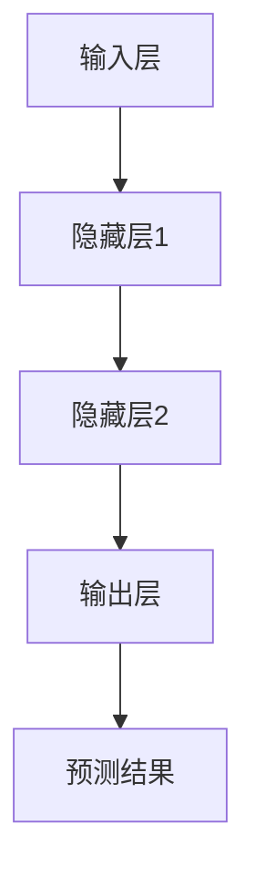
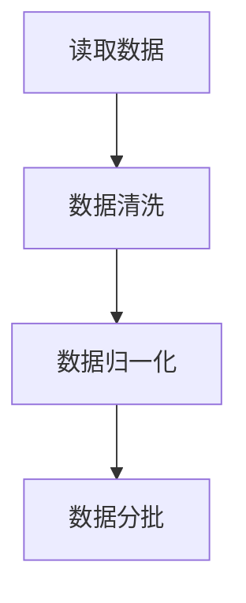
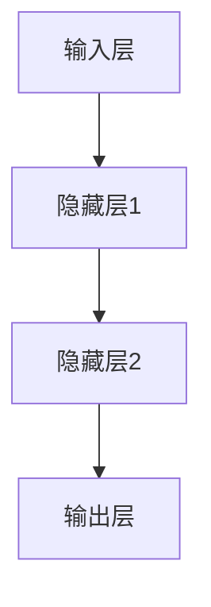
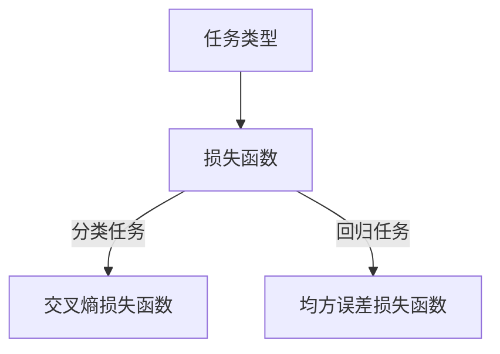
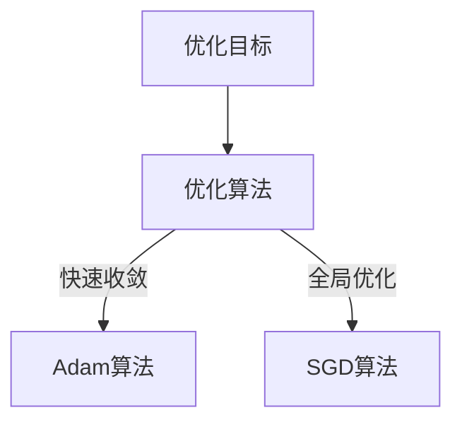
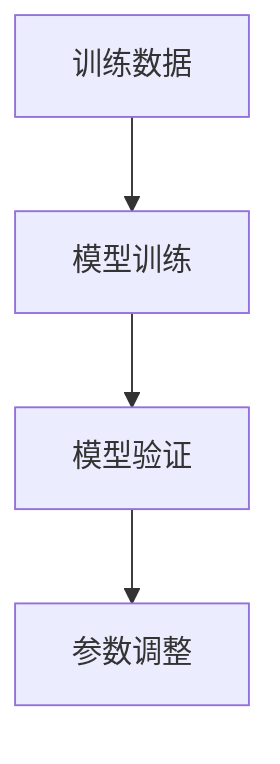

                 

关键词：AI大模型、创业、挑战、策略、发展前景、技术

## 摘要

本文将深入探讨AI大模型创业的现状与未来挑战，通过分析技术进展、市场需求和商业模式，提出应对策略和发展前景。我们将从背景介绍、核心概念与联系、算法原理、数学模型、项目实践和实际应用等多个角度，全面阐述AI大模型创业的关键要素和未来发展趋势。

## 1. 背景介绍

随着人工智能技术的飞速发展，AI大模型成为当前最具潜力的领域之一。大模型如GPT-3、BERT、Turing等，不仅在学术研究上取得了突破性成果，而且在实际应用中也展现出巨大的价值。然而，AI大模型的创业之路并非一帆风顺，面临诸多挑战。

首先，技术挑战是AI大模型创业的瓶颈。构建和训练大模型需要大量的计算资源和数据支持，这对于初创企业来说是一个巨大的负担。其次，市场需求也在不断变化，创业企业需要快速适应市场变化，提供符合用户需求的产品和服务。此外，商业模式和盈利模式也需要不断创新和探索。

## 2. 核心概念与联系

### 2.1 AI大模型概述

AI大模型是指具有巨大参数规模、能够处理复杂任务的人工智能系统。这些模型通过深度学习算法，对海量数据进行训练，从而实现高水平的表现。典型的AI大模型包括神经网络、循环神经网络、卷积神经网络等。

### 2.2 AI大模型架构

AI大模型通常由多个层次组成，包括输入层、隐藏层和输出层。每个层次都包含大量的神经元，通过非线性激活函数进行信息传递和计算。以下是一个简化的AI大模型架构图：



### 2.3 AI大模型与创业的联系

AI大模型在创业中的应用非常广泛，可以解决许多复杂的业务问题。例如，在金融领域，AI大模型可以用于风险评估、欺诈检测等；在医疗领域，AI大模型可以用于疾病诊断、药物研发等。创业企业可以通过开发AI大模型产品，满足市场需求，实现商业价值。

## 3. 核心算法原理 & 具体操作步骤

### 3.1 算法原理概述

AI大模型的核心算法是基于深度学习理论，通过多层神经网络进行训练。具体来说，包括以下几个关键步骤：

1. 数据预处理：对原始数据进行清洗、归一化等处理，确保数据质量。
2. 神经网络构建：设计网络结构，包括输入层、隐藏层和输出层。
3. 损失函数选择：根据任务类型选择合适的损失函数，如均方误差、交叉熵等。
4. 优化算法选择：选择合适的优化算法，如梯度下降、Adam等。
5. 训练与验证：通过训练数据和验证数据，调整模型参数，优化模型性能。

### 3.2 算法步骤详解

1. **数据预处理**：



2. **神经网络构建**：



3. **损失函数选择**：



4. **优化算法选择**：



5. **训练与验证**：



### 3.3 算法优缺点

AI大模型算法的优点包括：

- **强大的泛化能力**：通过训练大量数据，模型可以学习到丰富的知识，提高泛化能力。
- **适应性强**：可以应对各种复杂任务，如分类、回归、生成等。

然而，AI大模型算法也存在一些缺点：

- **计算成本高**：训练大模型需要大量的计算资源和时间。
- **数据需求大**：需要大量高质量的数据进行训练，数据获取和处理成本较高。

### 3.4 算法应用领域

AI大模型算法在各个领域都有广泛应用，包括：

- **计算机视觉**：用于图像分类、目标检测、图像生成等。
- **自然语言处理**：用于文本分类、机器翻译、问答系统等。
- **金融科技**：用于风险评估、欺诈检测、算法交易等。
- **医疗健康**：用于疾病诊断、药物研发、健康管理等。

## 4. 数学模型和公式 & 详细讲解 & 举例说明

### 4.1 数学模型构建

AI大模型的核心是多层神经网络，其数学模型可以表示为：

$$
\begin{aligned}
y &= f(\sigma(W_1 \cdot x + b_1)) \\
z &= f(\sigma(W_2 \cdot y + b_2)) \\
\vdots \\
z &= f(\sigma(W_n \cdot z_{n-1} + b_n))
\end{aligned}
$$

其中，$x$ 是输入数据，$y$ 是中间层输出，$z$ 是最终输出，$f$ 是激活函数，$\sigma$ 是sigmoid函数，$W$ 和 $b$ 分别是权重和偏置。

### 4.2 公式推导过程

以多层感知机（MLP）为例，其数学模型为：

$$
y = \sigma(W \cdot x + b)
$$

其中，$W$ 是权重矩阵，$x$ 是输入向量，$b$ 是偏置向量，$\sigma$ 是sigmoid函数。

对于每个神经元，输出可以表示为：

$$
z_i = \sum_{j=1}^{n} W_{ij} x_j + b_i
$$

其中，$n$ 是输入向量的维度，$W_{ij}$ 是权重，$x_j$ 是输入值，$b_i$ 是偏置。

通过链式法则，我们可以得到每个神经元的梯度：

$$
\begin{aligned}
\frac{\partial y}{\partial x} &= \sigma'(z) \cdot \frac{\partial z}{\partial x} \\
\frac{\partial z}{\partial x} &= W \cdot \frac{\partial y}{\partial y}
\end{aligned}
$$

其中，$\sigma'(z)$ 是sigmoid函数的导数。

### 4.3 案例分析与讲解

假设我们有一个简单的线性回归问题，目标是预测房价。我们可以使用多层感知机来构建模型，如下所示：

$$
\begin{aligned}
y &= \sigma(W \cdot x + b) \\
y &= \frac{1}{1 + e^{-(W \cdot x + b)}}
\end{aligned}
$$

其中，$x$ 是输入特征向量，$y$ 是预测的房价，$W$ 是权重矩阵，$b$ 是偏置向量。

通过训练数据和验证数据，我们可以调整模型参数，使得预测结果更接近真实值。具体过程如下：

1. **数据预处理**：将输入特征进行标准化处理，使得数据分布更加均匀。
2. **模型构建**：初始化权重矩阵和偏置向量。
3. **损失函数**：选择交叉熵损失函数，表示预测值与真实值之间的差异。
4. **优化算法**：使用梯度下降算法，迭代更新模型参数。
5. **模型评估**：在验证集上评估模型性能，调整超参数。

通过以上步骤，我们可以构建一个简单的多层感知机模型，用于预测房价。

## 5. 项目实践：代码实例和详细解释说明

### 5.1 开发环境搭建

为了实现AI大模型项目，我们需要搭建一个合适的开发环境。以下是一个基本的开发环境配置：

- 操作系统：Linux（推荐使用Ubuntu 20.04）
- 编程语言：Python（推荐使用3.8及以上版本）
- 深度学习框架：TensorFlow或PyTorch
- 数据预处理库：NumPy、Pandas、Scikit-learn

### 5.2 源代码详细实现

以下是一个简单的多层感知机模型的实现代码，用于预测房价：

```python
import numpy as np
import pandas as pd
from sklearn.model_selection import train_test_split
from sklearn.preprocessing import StandardScaler
import tensorflow as tf

# 5.2.1 数据预处理
def preprocess_data(data):
    # 数据清洗和标准化处理
    # ...
    return x_train, x_test, y_train, y_test

# 5.2.2 模型构建
def build_model(input_shape):
    model = tf.keras.Sequential([
        tf.keras.layers.Dense(units=1, input_shape=input_shape, activation='sigmoid')
    ])
    model.compile(optimizer='adam', loss='binary_crossentropy', metrics=['accuracy'])
    return model

# 5.2.3 训练与验证
def train_and_validate(model, x_train, y_train, x_test, y_test):
    history = model.fit(x_train, y_train, epochs=100, batch_size=32, validation_data=(x_test, y_test))
    return history

# 5.2.4 主程序
if __name__ == '__main__':
    # 读取数据
    data = pd.read_csv('house_prices.csv')
    x, y = preprocess_data(data)

    # 划分训练集和测试集
    x_train, x_test, y_train, y_test = train_test_split(x, y, test_size=0.2, random_state=42)

    # 搭建模型
    model = build_model(x_train.shape[1])

    # 训练模型
    history = train_and_validate(model, x_train, y_train, x_test, y_test)

    # 评估模型
    model.evaluate(x_test, y_test)
```

### 5.3 代码解读与分析

1. **数据预处理**：该部分负责读取数据、清洗和处理数据，包括缺失值填充、异常值处理和特征标准化等。这一步骤对于模型的训练效果至关重要。
2. **模型构建**：该部分使用TensorFlow框架搭建了一个简单的一层感知机模型，包括输入层、隐藏层和输出层。通过定义模型结构、编译模型和选择优化器，为模型训练做好准备。
3. **训练与验证**：该部分使用训练数据和验证数据进行模型训练和性能评估。通过迭代更新模型参数，优化模型性能。
4. **主程序**：该部分是程序的入口，负责读取数据、划分训练集和测试集、搭建模型、训练模型和评估模型性能。

通过以上步骤，我们可以构建一个简单的多层感知机模型，用于预测房价。

## 6. 实际应用场景

AI大模型在各个领域都有广泛的应用，以下是一些典型的实际应用场景：

### 6.1 金融领域

在金融领域，AI大模型可以用于风险评估、欺诈检测、算法交易等。例如，通过构建大规模的神经网络模型，可以对借款人的信用风险进行评估，提高信贷审批的准确性。

### 6.2 医疗健康

在医疗健康领域，AI大模型可以用于疾病诊断、药物研发、健康管理等。例如，通过分析大量的医疗数据，AI大模型可以识别出疾病的早期症状，提高诊断的准确性。

### 6.3 电子商务

在电子商务领域，AI大模型可以用于个性化推荐、广告投放等。例如，通过分析用户的购物行为和兴趣，AI大模型可以推荐符合用户需求的商品，提高销售额。

### 6.4 自动驾驶

在自动驾驶领域，AI大模型可以用于环境感知、路径规划等。例如，通过构建大规模的神经网络模型，自动驾驶汽车可以识别道路上的行人、车辆等物体，提高行驶的安全性。

## 7. 未来应用展望

随着AI大模型技术的不断发展，未来将在更多领域得到应用。以下是一些未来应用展望：

### 7.1 教育领域

AI大模型可以用于个性化学习、智能辅导等。通过分析学生的学习行为和成绩，AI大模型可以为学生提供个性化的学习计划和辅导，提高学习效果。

### 7.2 物流领域

AI大模型可以用于物流优化、路线规划等。通过分析物流数据，AI大模型可以优化物流网络，提高物流效率，降低成本。

### 7.3 能源领域

AI大模型可以用于能源预测、节能减排等。通过分析能源数据，AI大模型可以预测能源需求，优化能源使用，实现节能减排。

## 8. 工具和资源推荐

为了更好地进行AI大模型开发，以下是一些建议的学习资源和开发工具：

### 8.1 学习资源推荐

- 《深度学习》（Goodfellow, Bengio, Courville著）：深度学习的经典教材，适合初学者和进阶者。
- 《Python机器学习》（Sebastian Raschka著）：详细介绍Python在机器学习领域的应用，适合有一定编程基础的学习者。
- TensorFlow官方文档：官方文档是学习TensorFlow的最佳资源，包括教程、API参考和示例代码。

### 8.2 开发工具推荐

- Jupyter Notebook：强大的交互式开发环境，适合编写、调试和运行代码。
- PyCharm：功能丰富的Python集成开发环境，适合大型项目的开发。
- Google Colab：免费的云端Jupyter Notebook平台，适合远程开发和共享代码。

### 8.3 相关论文推荐

- "A Theoretically Grounded Application of Dropout in Recurrent Neural Networks"
- "BERT: Pre-training of Deep Bidirectional Transformers for Language Understanding"
- "Generative Adversarial Nets"

## 9. 总结：未来发展趋势与挑战

AI大模型作为人工智能领域的重要分支，具有广泛的应用前景和商业价值。然而，在创业过程中，企业需要面对技术挑战、市场需求变化和商业模式创新等多重挑战。为了应对这些挑战，企业需要不断优化算法、提高数据处理能力，并积极探索新的商业模式。在未来，随着技术的不断进步和应用的深入，AI大模型将在更多领域发挥重要作用，推动产业升级和社会发展。

## 10. 附录：常见问题与解答

### 10.1 什么是AI大模型？

AI大模型是指具有巨大参数规模、能够处理复杂任务的人工智能系统。这些模型通过深度学习算法，对海量数据进行训练，从而实现高水平的表现。

### 10.2 AI大模型有哪些应用领域？

AI大模型在计算机视觉、自然语言处理、金融科技、医疗健康、电子商务、自动驾驶等领域都有广泛应用。

### 10.3 如何构建一个AI大模型？

构建AI大模型通常包括数据预处理、模型构建、损失函数选择、优化算法选择、训练与验证等步骤。

### 10.4 AI大模型创业有哪些挑战？

AI大模型创业面临的挑战包括技术挑战、市场需求变化、商业模式创新等。

### 10.5 如何应对AI大模型创业的挑战？

应对AI大模型创业的挑战，企业需要不断优化算法、提高数据处理能力，并积极探索新的商业模式。同时，建立良好的团队和合作关系，保持持续的创新和竞争力。

---

作者：禅与计算机程序设计艺术 / Zen and the Art of Computer Programming

