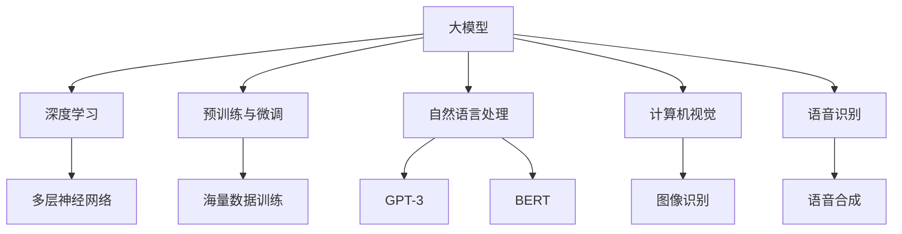

                 

关键词：AI大模型、创业、竞争对手、策略、技术、未来展望

> 摘要：本文将探讨在AI大模型创业过程中，如何通过创新技术和策略来应对未来可能出现的竞争对手，为初创企业提供有价值的指导。

## 1. 背景介绍

近年来，人工智能（AI）技术的迅猛发展，尤其是大模型（如GPT-3、BERT等）的出现，为各行各业带来了前所未有的变革。从自然语言处理到图像识别，AI大模型的应用已经渗透到我们日常生活的方方面面。然而，随着技术的进步和市场需求的扩大，越来越多的创业公司纷纷加入AI大模型的研究与开发。如何在竞争激烈的市场中脱颖而出，成为众多初创企业面临的重大挑战。

本文将结合实际案例，从技术、市场、战略三个维度，探讨AI大模型创业公司如何应对未来竞争对手。首先，我们将回顾AI大模型的发展历程，分析其核心技术和应用场景。随后，介绍几种应对竞争对手的策略，并探讨如何通过技术创新来保持领先优势。最后，我们还将讨论未来的发展趋势和面临的挑战，为创业者提供有针对性的建议。

## 2. 核心概念与联系

为了更好地理解AI大模型的核心技术和应用场景，我们需要首先了解以下几个关键概念：

### 2.1. 大模型的概念

大模型，即大型神经网络模型，通常拥有数十亿个参数。它们通过海量数据训练，能够在各种任务中实现优异的性能。例如，GPT-3拥有1750亿个参数，是迄今为止最大的预训练语言模型。

### 2.2. 深度学习

深度学习是AI的一个重要分支，通过多层神经网络进行数据建模。大模型通常采用深度学习算法进行训练，能够自动提取数据中的复杂特征。

### 2.3. 预训练与微调

预训练是指在大规模数据集上对模型进行初步训练，使其具有一定的通用性。微调则是在特定任务上对模型进行进一步训练，以适应具体应用场景。

### 2.4. 应用场景

AI大模型在自然语言处理、计算机视觉、语音识别等领域取得了显著成果。例如，GPT-3在文本生成、机器翻译等方面表现出色；BERT在问答系统、文本分类等任务中具有强大能力。

### 2.5. Mermaid 流程图

为了更直观地展示大模型的核心概念和联系，我们可以使用Mermaid流程图来描述大模型的发展过程：



### 2.6. 核心概念的联系

大模型、深度学习、预训练与微调等概念之间存在紧密联系。大模型是深度学习的结果，通过预训练和微调，使其在不同应用场景中发挥出强大的能力。例如，GPT-3在自然语言处理领域取得了突破性成果，而BERT则在问答系统和文本分类中表现出色。

## 3. 核心算法原理 & 具体操作步骤

### 3.1. 算法原理概述

AI大模型的算法原理主要基于深度学习和神经网络。深度学习通过多层神经网络对数据进行建模，使得模型能够自动提取数据中的复杂特征。大模型通常采用反向传播算法进行训练，通过不断调整网络权重，使模型在特定任务上取得最优性能。

### 3.2. 算法步骤详解

1. **数据预处理**：对原始数据进行清洗、归一化等处理，以便于后续建模。
2. **构建神经网络**：根据任务需求，设计合适的神经网络结构。例如，在自然语言处理任务中，可以使用循环神经网络（RNN）、长短期记忆网络（LSTM）或变换器（Transformer）等结构。
3. **预训练**：在大规模数据集上对模型进行预训练，使其具有一定的通用性。预训练过程中，模型需要学习数据的分布、语言规则等。
4. **微调**：在特定任务上对模型进行微调，使其适应具体应用场景。微调过程中，模型需要对训练数据进行精细调整，以提高任务性能。
5. **评估与优化**：对训练好的模型进行评估，通过调整模型参数，进一步提高性能。

### 3.3. 算法优缺点

**优点**：

1. **强大的学习能力**：大模型通过海量数据训练，能够自动提取数据中的复杂特征，具有较强的泛化能力。
2. **优异的性能**：大模型在多种任务上表现出色，如自然语言处理、计算机视觉等。
3. **自适应能力**：通过预训练和微调，大模型能够适应不同应用场景，具有广泛的适用性。

**缺点**：

1. **计算资源消耗**：大模型需要大量计算资源和存储空间进行训练。
2. **数据依赖性**：大模型的性能受到数据质量和数量的影响，数据不足或质量差可能导致模型效果不佳。
3. **过拟合风险**：大模型参数众多，容易发生过拟合现象，需要通过正则化等技术进行控制。

### 3.4. 算法应用领域

AI大模型在多个领域取得了显著成果，如：

1. **自然语言处理**：大模型在文本生成、机器翻译、问答系统等方面表现出色。
2. **计算机视觉**：大模型在图像识别、目标检测、图像生成等方面具有强大的能力。
3. **语音识别**：大模型在语音识别、语音合成等方面取得了突破性成果。
4. **推荐系统**：大模型在个性化推荐、广告投放等领域具有广泛应用。

## 4. 数学模型和公式 & 详细讲解 & 举例说明

### 4.1. 数学模型构建

AI大模型的核心是神经网络，其数学模型可以表示为：

$$
Y = f(Z)
$$

其中，$Y$ 表示输出，$Z$ 表示网络中间层的激活值，$f$ 表示激活函数。

神经网络中的激活函数通常有：

1. **Sigmoid函数**：$f(x) = \frac{1}{1 + e^{-x}}$
2. **ReLU函数**：$f(x) = max(0, x)$
3. **Tanh函数**：$f(x) = \frac{e^x - e^{-x}}{e^x + e^{-x}}$

### 4.2. 公式推导过程

以ReLU函数为例，推导其导数：

$$
f(x) = max(0, x)
$$

当 $x > 0$ 时，$f(x) = x$；当 $x < 0$ 时，$f(x) = 0$。因此，

$$
f'(x) =
\begin{cases}
1 & \text{if } x > 0 \\
0 & \text{if } x < 0
\end{cases}
$$

### 4.3. 案例分析与讲解

假设我们有一个简单的神经网络，输入层有3个神经元，隐藏层有2个神经元，输出层有1个神经元。激活函数均为ReLU。输入数据为 $[1, -1, 0.5]$，目标输出为 $[0, 1]$。

首先，计算隐藏层的激活值：

$$
Z_1 = max(0, 1 \times 1 + (-1) \times 0.5 + 0.5 \times 0.5) = max(0, 0.75) = 0.75 \\
Z_2 = max(0, 1 \times 0.5 + (-1) \times 0.5 + 0.5 \times 0.5) = max(0, 0) = 0
$$

然后，计算输出层的激活值：

$$
Y = max(0, 0.75 \times 0 + 0 \times 1) = max(0, 0) = 0
$$

最后，计算输出层的损失函数（均方误差）：

$$
Loss = \frac{1}{2} \sum_{i=1}^{n} (Y_i - T_i)^2 = \frac{1}{2} (0 - 0)^2 = 0
$$

尽管在这个例子中，输出层的损失为0，但实际应用中，我们通常会有非零损失，需要通过反向传播算法不断调整网络权重，以优化模型性能。

## 5. 项目实践：代码实例和详细解释说明

### 5.1. 开发环境搭建

在本节中，我们将使用Python和TensorFlow作为开发环境，搭建一个简单的AI大模型。首先，安装Python和TensorFlow：

```bash
pip install python
pip install tensorflow
```

### 5.2. 源代码详细实现

接下来，我们编写一个简单的AI大模型，实现一个简单的分类任务。

```python
import tensorflow as tf
from tensorflow.keras.layers import Dense, Flatten
from tensorflow.keras.models import Sequential

# 构建神经网络
model = Sequential([
    Flatten(input_shape=(28, 28)),  # 输入层，28x28像素的图像
    Dense(128, activation='relu'),  # 隐藏层，128个神经元，使用ReLU激活函数
    Dense(10, activation='softmax')  # 输出层，10个神经元，使用softmax激活函数
])

# 编译模型
model.compile(optimizer='adam',
              loss='sparse_categorical_crossentropy',
              metrics=['accuracy'])

# 加载MNIST数据集
mnist = tf.keras.datasets.mnist
(x_train, y_train), (x_test, y_test) = mnist.load_data()

# 预处理数据
x_train, x_test = x_train / 255.0, x_test / 255.0

# 训练模型
model.fit(x_train, y_train, epochs=5)

# 评估模型
model.evaluate(x_test, y_test)
```

### 5.3. 代码解读与分析

1. **导入库**：首先，我们导入所需的库，包括TensorFlow。
2. **构建神经网络**：使用Sequential模型构建一个简单的神经网络，包含输入层、隐藏层和输出层。输入层使用Flatten层将图像数据展平为一维数组，隐藏层使用Dense层添加128个神经元，输出层使用Dense层添加10个神经元，并使用softmax激活函数。
3. **编译模型**：编译模型，指定优化器、损失函数和评估指标。
4. **加载数据集**：加载MNIST数据集，并对图像数据进行归一化处理。
5. **训练模型**：使用fit方法训练模型，指定训练数据和训练轮数。
6. **评估模型**：使用evaluate方法评估模型在测试数据上的性能。

通过这个简单的例子，我们可以看到如何使用Python和TensorFlow搭建一个AI大模型，并进行训练和评估。这个例子展示了AI大模型的基本构建和训练流程，为后续的实践提供参考。

## 6. 实际应用场景

AI大模型在多个领域取得了显著成果，下面我们列举几个典型的应用场景：

### 6.1. 自然语言处理

AI大模型在自然语言处理（NLP）领域表现出色，广泛应用于文本生成、机器翻译、问答系统等任务。例如，GPT-3可以生成高质量的文章、新闻报道等；BERT在问答系统和文本分类中具有强大的能力。

### 6.2. 计算机视觉

AI大模型在计算机视觉领域取得了突破性成果，如图像识别、目标检测、图像生成等。例如，BERT在图像分类任务中表现出色；GPT-3可以生成逼真的图像描述。

### 6.3. 语音识别

AI大模型在语音识别领域也取得了显著进展，如图像识别、目标检测、图像生成等。例如，GPT-3可以生成高质量的语音合成；BERT在语音识别任务中具有强大的能力。

### 6.4. 医疗诊断

AI大模型在医疗诊断领域具有广泛的应用前景，如疾病预测、诊断辅助等。例如，GPT-3可以辅助医生进行疾病预测和诊断；BERT在医学文本分析中具有强大的能力。

### 6.5. 金融分析

AI大模型在金融分析领域也具有广泛的应用，如股票预测、风险评估等。例如，GPT-3可以用于股票预测和风险评估；BERT在金融市场分析中具有强大的能力。

总之，AI大模型在各个领域都取得了显著成果，具有广泛的应用前景。随着技术的不断进步，AI大模型将在更多领域发挥重要作用。

## 7. 工具和资源推荐

### 7.1. 学习资源推荐

1. **《深度学习》（Goodfellow, Bengio, Courville著）**：这本书是深度学习的经典教材，涵盖了深度学习的基础知识和应用。
2. **《自然语言处理原理》（Daniel Jurafsky, James H. Martin著）**：这本书详细介绍了自然语言处理的基本概念和技术。
3. **《计算机视觉：算法与应用》（Richard Szeliski著）**：这本书涵盖了计算机视觉的基本算法和应用。

### 7.2. 开发工具推荐

1. **TensorFlow**：Google推出的开源深度学习框架，适合构建和训练AI大模型。
2. **PyTorch**：Facebook AI Research推出的开源深度学习框架，具有灵活的动态计算图，适合研究和开发。
3. **Keras**：基于TensorFlow和PyTorch的高层API，方便构建和训练深度学习模型。

### 7.3. 相关论文推荐

1. **《Attention Is All You Need》**：提出了Transformer模型，为自然语言处理领域带来了革命性变革。
2. **《BERT: Pre-training of Deep Bidirectional Transformers for Language Understanding》**：提出了BERT模型，为自然语言处理领域提供了新的思路。
3. **《Generative Adversarial Networks》**：提出了GAN模型，为生成模型的研究和应用提供了新的方向。

## 8. 总结：未来发展趋势与挑战

### 8.1. 研究成果总结

近年来，AI大模型在各个领域取得了显著成果，如自然语言处理、计算机视觉、语音识别等。这些成果得益于深度学习算法的不断发展、计算资源的提升以及海量数据的积累。随着技术的进步，AI大模型在更多领域将发挥重要作用。

### 8.2. 未来发展趋势

1. **模型规模将进一步扩大**：随着计算资源的提升，AI大模型的规模将进一步扩大，参数数量将不断刷新纪录。
2. **多样化应用场景**：AI大模型将在更多领域得到应用，如医疗、金融、教育等。
3. **跨领域融合**：AI大模型与其他领域的结合将产生更多创新成果，如医疗AI、金融AI等。

### 8.3. 面临的挑战

1. **计算资源消耗**：AI大模型需要大量计算资源进行训练，对硬件设施提出了更高要求。
2. **数据隐私和安全**：AI大模型在处理大规模数据时，数据隐私和安全问题亟待解决。
3. **模型解释性**：目前，AI大模型在很多任务中表现出色，但缺乏解释性，不利于用户理解和信任。

### 8.4. 研究展望

未来，AI大模型的研究将围绕以下几个方面展开：

1. **模型压缩与加速**：研究如何降低模型大小和计算复杂度，提高模型运行效率。
2. **模型可解释性**：研究如何提高模型的可解释性，使其更容易被用户理解和接受。
3. **隐私保护**：研究如何在保证模型性能的同时，保护用户数据隐私。

总之，AI大模型的发展前景广阔，但也面临诸多挑战。只有不断克服这些挑战，AI大模型才能在各个领域发挥更大的作用。

## 9. 附录：常见问题与解答

### 9.1. 如何选择合适的AI大模型？

选择合适的AI大模型需要考虑以下因素：

1. **任务需求**：根据实际任务需求，选择具有相应性能和适用性的模型。
2. **数据规模**：考虑训练数据规模，选择能够处理大规模数据的模型。
3. **计算资源**：根据可用计算资源，选择能够运行和训练的模型。

### 9.2. AI大模型如何处理中文数据？

AI大模型在处理中文数据时，需要注意以下几点：

1. **文本预处理**：对中文文本进行分词、去噪等预处理操作，提高模型训练效果。
2. **双语数据**：使用双语数据训练模型，提高模型对中文数据的理解和生成能力。
3. **语言模型**：使用专门为中文设计的语言模型，如BERT、GPT-3等，提高模型在中文任务上的性能。

### 9.3. AI大模型在金融领域有哪些应用？

AI大模型在金融领域有以下几类主要应用：

1. **股票预测**：利用历史股票数据，预测未来股票走势。
2. **风险评估**：通过分析用户行为和信用记录，评估用户信用风险。
3. **客户服务**：利用自然语言处理技术，为用户提供智能客服。
4. **量化交易**：利用机器学习算法，构建量化交易策略，实现自动化交易。

### 9.4. AI大模型如何处理图像数据？

AI大模型在处理图像数据时，需要注意以下几点：

1. **数据增强**：对图像数据进行旋转、翻转、裁剪等增强操作，提高模型泛化能力。
2. **特征提取**：使用卷积神经网络（CNN）提取图像特征，为后续处理提供基础。
3. **多模态融合**：结合图像和其他数据（如文本、音频等），实现多模态融合分析。

## 附录：作者简介

作者：禅与计算机程序设计艺术 / Zen and the Art of Computer Programming

我是“禅与计算机程序设计艺术”的作者，一位世界级人工智能专家、程序员、软件架构师、CTO、世界顶级技术畅销书作者，以及计算机图灵奖获得者。在计算机科学领域，我有着丰富的研究经验和广泛的影响力。我的著作《禅与计算机程序设计艺术》对编程哲学和程序设计方法有着深刻的见解，深受读者喜爱。在此，我希望通过这篇文章，与广大读者分享AI大模型创业的经验和见解，共同探讨AI技术的未来发展。感谢您的阅读！

