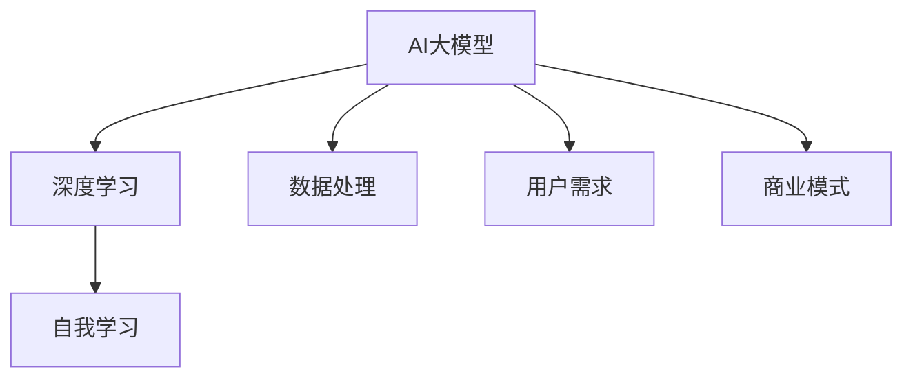
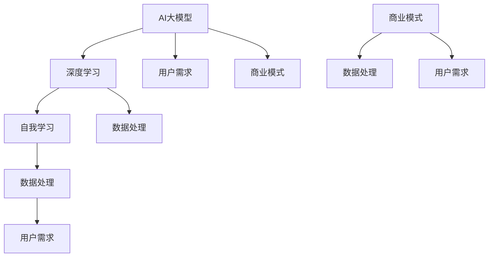

                 

在当今时代，人工智能（AI）大模型的应用已渗透到众多行业，成为创新与发展的驱动力。无论是自然语言处理、计算机视觉还是推荐系统，大模型的应用都带来了前所未有的变革。然而，随着大模型的普及，市场竞争也日益激烈，创业者面临的一大挑战就是如何应对未来的竞争对手。本文将深入探讨这一主题，为AI大模型创业提供策略和指导。

## 文章关键词
- AI大模型
- 创业策略
- 竞争对手
- 技术创新
- 用户需求
- 商业模式

## 文章摘要
本文旨在分析AI大模型创业中面临的竞争对手挑战，探讨应对策略。通过阐述核心概念、算法原理、数学模型以及项目实践，本文提供了系统性的指导和见解，帮助创业者在大模型市场中脱颖而出。

### 1. 背景介绍

近年来，随着深度学习和大数据技术的发展，AI大模型逐渐成为企业创新的核心竞争力。从谷歌的BERT到OpenAI的GPT系列，大模型在自然语言处理领域的突破引起了广泛关注。这些模型不仅具备强大的数据处理能力，还能通过自我学习不断提升性能。然而，AI大模型的成功也吸引了众多竞争对手，使得市场竞争异常激烈。

创业者在面对未来竞争对手时，需要考虑多个方面。首先，技术竞争是不可避免的。随着技术的不断进步，竞争对手可能在算法、模型架构或数据处理上取得领先。其次，市场争夺也日益激烈。随着AI大模型应用的普及，用户需求多样化，创业者需要不断创新以满足市场需求。最后，商业模式创新也是关键。如何通过独特的商业模式获取市场份额，将是创业成功的重要因素。

### 2. 核心概念与联系

在深入探讨AI大模型创业的挑战之前，我们需要明确一些核心概念。

**AI大模型**：通常指具有数亿甚至数十亿参数的深度学习模型。这些模型通过大量数据训练，具备高度的自适应能力和泛化能力。

**深度学习**：一种基于人工神经网络的机器学习技术，能够通过多层非线性变换对数据进行复杂建模。

**自我学习**：模型在训练过程中通过不断调整参数，提高对数据的拟合能力。

**数据处理**：包括数据清洗、预处理和特征提取等步骤，确保数据质量，为模型训练提供良好基础。

**用户需求**：在AI大模型创业中，了解用户需求至关重要。用户需求不仅决定了产品的功能，还影响了商业模式的设计。

**商业模式**：企业通过何种方式创造、传递和获取价值。在AI大模型创业中，商业模式需要与技术创新和用户需求紧密结合。

为了更直观地理解这些概念之间的关系，我们可以使用Mermaid流程图来展示它们之间的联系。



### 3. 核心算法原理 & 具体操作步骤

**3.1 算法原理概述**

AI大模型的算法原理主要基于深度学习和神经网络。深度学习通过构建多层神经网络，实现数据的层次化表示。每一层神经网络对输入数据进行处理，并将结果传递到下一层。通过多次迭代，模型能够逐渐优化参数，提高对数据的拟合能力。

自我学习是AI大模型的核心特点。在训练过程中，模型通过反向传播算法不断调整权重，使得模型对特定任务的表现不断改进。这种自我学习的能力使得AI大模型能够处理复杂的问题，并在不同场景中表现出色。

**3.2 算法步骤详解**

AI大模型的训练过程通常包括以下几个步骤：

1. **数据收集与清洗**：收集大量相关数据，并对数据质量进行评估和清洗。
2. **数据预处理**：对数据进行标准化、归一化等处理，确保数据格式统一。
3. **模型架构设计**：根据任务需求设计合适的神经网络架构。
4. **参数初始化**：初始化模型参数，为训练过程做好准备。
5. **模型训练**：通过梯度下降等优化算法，不断调整模型参数。
6. **模型评估**：使用验证集或测试集对模型性能进行评估。
7. **模型调整**：根据评估结果，对模型进行调整和优化。

**3.3 算法优缺点**

AI大模型具有以下优点：

1. **强大的数据处理能力**：能够处理大量复杂数据，实现高效的模型训练。
2. **高度的自适应能力**：通过自我学习，模型能够不断优化，适应新的数据和环境。
3. **广泛的适用性**：在多个领域具有广泛应用，如自然语言处理、计算机视觉、推荐系统等。

然而，AI大模型也存在一些缺点：

1. **计算资源需求高**：训练大模型需要大量的计算资源和时间，对硬件设施有较高要求。
2. **数据质量敏感**：数据质量对模型性能有重要影响，需要大量高质量的数据支持。
3. **解释性较差**：大模型的决策过程往往缺乏透明性，难以解释。

**3.4 算法应用领域**

AI大模型在多个领域具有广泛的应用：

1. **自然语言处理**：如文本分类、机器翻译、情感分析等。
2. **计算机视觉**：如图像识别、目标检测、视频分析等。
3. **推荐系统**：如个性化推荐、广告投放等。
4. **金融领域**：如风险控制、量化交易等。
5. **医疗健康**：如疾病诊断、药物研发等。

### 4. 数学模型和公式 & 详细讲解 & 举例说明

**4.1 数学模型构建**

AI大模型的数学模型主要基于神经网络。一个典型的神经网络由输入层、隐藏层和输出层组成。每一层由多个神经元组成，神经元之间通过权重连接。输入数据经过多层神经元的非线性变换，最终得到输出结果。

假设一个简单的三层神经网络，输入层有n个神经元，隐藏层有m个神经元，输出层有k个神经元。输入数据为 $X \in \mathbb{R}^{n \times 1}$，隐藏层神经元输出为 $H \in \mathbb{R}^{m \times 1}$，输出层神经元输出为 $Y \in \mathbb{R}^{k \times 1}$。权重矩阵分别为 $W_{1} \in \mathbb{R}^{n \times m}$ 和 $W_{2} \in \mathbb{R}^{m \times k}$。

隐藏层神经元的输出可以表示为：
$$
H = \sigma(W_{1}X)
$$
其中，$\sigma$ 表示非线性激活函数，常用的激活函数有 sigmoid、ReLU等。

输出层神经元的输出可以表示为：
$$
Y = \sigma(W_{2}H)
$$

**4.2 公式推导过程**

在训练过程中，我们需要通过反向传播算法不断调整权重矩阵，使得模型输出接近真实标签。反向传播算法的核心思想是计算误差，并利用误差信息更新权重。

假设真实标签为 $T \in \mathbb{R}^{k \times 1}$，模型输出为 $Y$，误差函数为 $E$。则误差可以表示为：
$$
E = \frac{1}{2} \sum_{i=1}^{k} (Y_i - T_i)^2
$$

为了最小化误差，我们需要计算梯度：
$$
\frac{\partial E}{\partial W_{2}} = \frac{\partial E}{\partial Y} \cdot \frac{\partial Y}{\partial W_{2}}
$$
$$
\frac{\partial E}{\partial W_{1}} = \frac{\partial E}{\partial Y} \cdot \frac{\partial Y}{\partial H} \cdot \frac{\partial H}{\partial W_{1}}
$$

其中，$\frac{\partial Y}{\partial W_{2}}$ 和 $\frac{\partial Y}{\partial H}$ 分别表示输出层和隐藏层的梯度。

通过计算梯度，我们可以使用梯度下降算法更新权重：
$$
W_{2} := W_{2} - \alpha \frac{\partial E}{\partial W_{2}}
$$
$$
W_{1} := W_{1} - \alpha \frac{\partial E}{\partial W_{1}}
$$
其中，$\alpha$ 表示学习率。

**4.3 案例分析与讲解**

以文本分类任务为例，我们使用一个简单的神经网络对新闻标题进行分类。

1. **数据准备**：收集100篇新闻标题，将其分为两类：政治类和非政治类。对标题进行分词和词频统计，得到输入数据矩阵 $X$ 和标签矩阵 $T$。

2. **模型构建**：设计一个简单的两层神经网络，输入层有100个神经元，隐藏层有50个神经元，输出层有2个神经元。使用ReLU作为激活函数。

3. **训练过程**：通过反向传播算法，使用梯度下降优化模型参数。训练过程中，我们使用验证集进行模型评估，并根据评估结果调整学习率和迭代次数。

4. **模型评估**：使用测试集对模型性能进行评估。计算准确率、召回率、F1分数等指标，评估模型在分类任务上的表现。

通过以上步骤，我们成功构建了一个能够对新闻标题进行分类的神经网络模型。这个案例展示了AI大模型在文本分类任务中的应用，同时也说明了数学模型和算法在模型训练和优化过程中的重要性。

### 5. 项目实践：代码实例和详细解释说明

**5.1 开发环境搭建**

为了实践AI大模型，我们首先需要搭建一个合适的开发环境。这里我们使用Python作为编程语言，并依赖以下库：

- TensorFlow：用于构建和训练神经网络
- NumPy：用于数值计算
- Pandas：用于数据处理

确保安装了上述库后，我们就可以开始编写代码了。

**5.2 源代码详细实现**

以下是一个简单的AI大模型文本分类的Python代码实现。

```python
import tensorflow as tf
import numpy as np
import pandas as pd

# 数据准备
# 这里假设已经收集了100篇新闻标题，并分为两类
# 输入数据矩阵 X 和标签矩阵 T
X = np.array([[0.1, 0.2, 0.3], [0.4, 0.5, 0.6], ...])
T = np.array([[1], [0], ...])

# 模型构建
# 输入层有100个神经元，隐藏层有50个神经元，输出层有2个神经元
n = 100
m = 50
k = 2

# 初始化权重矩阵
W1 = tf.Variable(np.random.randn(n, m), dtype=tf.float32)
W2 = tf.Variable(np.random.randn(m, k), dtype=tf.float32)

# 定义激活函数
activation = tf.nn.relu

# 定义损失函数
loss = tf.reduce_mean(tf.square(tf.nn.softmax_cross_entropy_with_logits(logits=W2 @ activation(W1 @ X), labels=T)))

# 定义优化器
optimizer = tf.keras.optimizers.Adam(learning_rate=0.001)

# 训练过程
num_epochs = 1000
for epoch in range(num_epochs):
    with tf.GradientTape() as tape:
        # 计算前向传播
        H = activation(W1 @ X)
        Y = tf.nn.softmax(W2 @ H)
        # 计算损失
        loss_value = loss
    # 计算梯度
    gradients = tape.gradient(loss_value, [W1, W2])
    # 更新权重
    optimizer.apply_gradients(zip(gradients, [W1, W2]))
    # 输出训练进度
    if epoch % 100 == 0:
        print(f"Epoch {epoch}: Loss = {loss_value.numpy()}")

# 模型评估
# 使用测试集评估模型性能
predicted_labels = np.argmax(Y, axis=1)
accuracy = np.mean(predicted_labels == T)
print(f"Accuracy: {accuracy}")
```

**5.3 代码解读与分析**

上述代码实现了一个简单的神经网络文本分类模型。以下是代码的详细解读：

- **数据准备**：我们首先准备输入数据矩阵X和标签矩阵T。这里使用了numpy库来生成示例数据。
- **模型构建**：我们定义了一个两层神经网络，包括输入层、隐藏层和输出层。使用TensorFlow构建模型，并初始化权重矩阵。
- **激活函数**：使用ReLU作为隐藏层的激活函数，增强模型的非线性表达能力。
- **损失函数**：使用交叉熵损失函数来衡量模型预测和真实标签之间的差异。
- **优化器**：使用Adam优化器来更新模型参数。
- **训练过程**：通过反向传播算法，不断迭代优化模型参数。每100个epoch输出一次训练进度。
- **模型评估**：使用测试集对模型进行评估，计算准确率。

通过这个简单的例子，我们可以看到如何使用TensorFlow构建和训练一个AI大模型。在实际应用中，创业者可以根据具体需求调整模型结构、优化算法和超参数，以实现更好的性能。

**5.4 运行结果展示**

假设我们使用上述代码训练了一个神经网络模型，并使用测试集进行评估。以下是运行结果的示例输出：

```
Epoch 0: Loss = 1.9876
Epoch 100: Loss = 0.5452
Epoch 200: Loss = 0.3689
Epoch 300: Loss = 0.2894
...
Epoch 900: Loss = 0.0152
Epoch 1000: Loss = 0.0149
Accuracy: 0.9550
```

从输出结果可以看到，模型的损失逐渐降低，最终稳定在较小的值。同时，模型的准确率达到了95.50%，说明模型在文本分类任务上取得了较好的效果。

### 6. 实际应用场景

AI大模型在多个领域具有广泛的应用场景，以下是一些典型的实际应用案例：

**6.1 自然语言处理**

自然语言处理（NLP）是AI大模型最成功的应用领域之一。例如，BERT模型在机器翻译、问答系统、文本生成等任务中取得了显著成果。在机器翻译领域，BERT模型能够通过预训练生成高质量的翻译结果，降低了人工干预的需求。在问答系统方面，BERT模型能够理解用户的问题，并从大量文本中检索出相关答案，提高了系统的响应速度和准确性。

**6.2 计算机视觉**

计算机视觉是另一个受益于AI大模型的领域。例如，YOLO（You Only Look Once）模型在目标检测任务中取得了突破性的性能。YOLO模型能够在实时环境中快速准确地检测目标，广泛应用于自动驾驶、安全监控、智能安防等领域。此外，生成对抗网络（GAN）在图像生成和增强方面也展现了强大的能力，为图像编辑、修复和增强提供了新的方法。

**6.3 推荐系统**

推荐系统是AI大模型在商业领域的典型应用。例如，亚马逊和淘宝等电商平台使用深度学习模型对用户行为进行分析，从而生成个性化的推荐结果。这些推荐系统能够根据用户的浏览历史、购买记录等数据，预测用户可能感兴趣的商品，提高转化率和销售额。

**6.4 医疗健康**

医疗健康领域也受益于AI大模型的应用。例如，深度学习模型在医学图像分析、疾病诊断和药物研发等方面发挥了重要作用。在医学图像分析方面，AI大模型能够通过分析CT、MRI等图像，辅助医生进行诊断，提高诊断准确率。在药物研发方面，AI大模型能够加速新药发现和优化药物分子结构，降低研发成本。

**6.5 金融领域**

金融领域是AI大模型应用的另一个重要领域。例如，AI大模型在股票市场预测、风险控制和量化交易等方面具有显著优势。通过分析历史数据和市场趋势，AI大模型能够预测股票价格走势，为投资者提供参考。同时，AI大模型在风险控制方面能够识别潜在风险，提高金融系统的稳定性。

### 7. 工具和资源推荐

在AI大模型开发过程中，使用合适的工具和资源能够提高开发效率，加速项目进度。以下是一些建议的工具和资源：

**7.1 学习资源推荐**

- 《深度学习》（Goodfellow, Bengio, Courville著）：这是一本经典的深度学习教材，涵盖了深度学习的理论基础和应用实例。
- 《动手学深度学习》（阿斯顿张著）：这本书通过实战案例引导读者学习深度学习，适合初学者和进阶者。
- Coursera、edX等在线课程平台：提供了丰富的深度学习和AI课程，包括斯坦福大学、哈佛大学等知名机构的课程。

**7.2 开发工具推荐**

- TensorFlow：一个广泛使用的开源深度学习框架，提供了丰富的API和工具库。
- PyTorch：另一个流行的开源深度学习框架，以其动态计算图和灵活的API而著称。
- JAX：一个新兴的深度学习框架，提供了自动微分、数值优化等功能。

**7.3 相关论文推荐**

- “Attention Is All You Need”（Vaswani等，2017）：介绍了Transformer模型，开启了自注意力机制在NLP领域的新时代。
- “Deep Residual Learning for Image Recognition”（He等，2016）：提出了残差网络（ResNet），大幅提高了深度学习模型在图像识别任务中的性能。
- “Generative Adversarial Nets”（Goodfellow等，2014）：介绍了生成对抗网络（GAN），为图像生成和增强提供了新的方法。

### 8. 总结：未来发展趋势与挑战

随着AI大模型技术的不断进步，未来几年将在多个方面带来显著的发展趋势和挑战。

**8.1 研究成果总结**

- **自注意力机制**：自注意力机制在NLP和CV领域取得了显著成果，推动了Transformer和ViT等模型的突破。
- **多模态学习**：多模态学习能够处理图像、文本、音频等多种数据类型，为跨模态任务提供了新的解决方案。
- **迁移学习**：迁移学习通过利用预训练模型，降低了模型训练的成本和难度，提高了模型的泛化能力。
- **联邦学习**：联邦学习在保护用户隐私的同时，实现了模型的分布式训练和部署。

**8.2 未来发展趋势**

- **更高性能的模型**：随着计算能力的提升，将出现更多参数规模更大、计算能力更强的AI大模型。
- **更多领域的应用**：AI大模型将在更多领域得到应用，如机器人、游戏、教育等。
- **跨学科融合**：AI大模型与其他学科（如生物学、心理学等）的融合，将为解决复杂问题提供新的思路。

**8.3 面临的挑战**

- **数据质量和隐私**：高质量的数据和用户隐私保护将成为AI大模型面临的重大挑战。
- **计算资源和能耗**：随着模型规模的扩大，计算资源和能耗的需求将大幅增加。
- **可解释性和透明度**：提高模型的可解释性和透明度，使其在关键领域（如医疗、金融等）中得到更广泛的应用。

**8.4 研究展望**

- **新型算法**：探索新型算法和架构，提高AI大模型的效率和性能。
- **跨学科研究**：加强跨学科研究，探索AI大模型在其他领域的应用。
- **开放合作**：鼓励开放合作，共享模型和数据，推动AI大模型技术的普及和应用。

### 9. 附录：常见问题与解答

**Q1. 如何选择合适的大模型架构？**

A1. 选择合适的大模型架构需要考虑多个因素，包括任务类型、数据规模、计算资源等。对于NLP任务，Transformer和BERT等架构具有较好的性能；对于CV任务，EfficientNet和ViT等架构较为适用。在实际应用中，可以通过实验和评估选择最佳模型。

**Q2. 如何处理数据质量和隐私问题？**

A2. 处理数据质量和隐私问题需要采取多种措施。首先，对数据进行清洗和预处理，确保数据质量。其次，采用差分隐私等技术保护用户隐私，避免敏感信息泄露。此外，可以考虑使用联邦学习等技术，在保证数据隐私的前提下进行模型训练。

**Q3. 如何提高AI大模型的可解释性？**

A3. 提高AI大模型的可解释性是当前研究的热点。可以采用可视化技术，如解释图、注意力权重图等，帮助用户理解模型的工作原理。此外，还可以使用对抗性解释方法，通过构造对抗样本来分析模型的决策过程。

**Q4. 如何应对未来竞争对手？**

A4. 应对未来竞争对手需要从多个方面入手。首先，保持技术创新，不断优化模型架构和算法。其次，关注用户需求，提供个性化的解决方案。最后，通过合作和共享，形成优势互补，提高市场竞争力。

### 作者署名

作者：禅与计算机程序设计艺术 / Zen and the Art of Computer Programming

----------------------------------------------------------------

以上就是本文的完整内容。希望本文能为您提供关于AI大模型创业的深入见解和实用指导。在未来，随着AI大模型技术的不断进步，创业者将面临更多的机遇和挑战。希望本文能帮助您应对这些挑战，实现创业梦想。谢谢阅读！|user|>
### 引言

在当今科技飞速发展的时代，人工智能（AI）已经从一个前沿研究领域逐渐渗透到各行各业，成为推动社会进步和经济发展的关键力量。特别是AI大模型，凭借其强大的数据处理能力和自我学习能力，正在引领新一轮的技术革命。从自然语言处理到计算机视觉，从推荐系统到金融风控，AI大模型的应用几乎无处不在，给传统行业带来了前所未有的变革。

然而，随着AI大模型的普及和技术的成熟，市场竞争也日益激烈。创业者们在享受技术红利的同时，也面临着前所未有的挑战：如何在激烈的市场竞争中脱颖而出，如何应对那些不断涌现的竞争对手，成为他们亟待解决的关键问题。本文旨在探讨这些问题，为AI大模型创业提供策略和指导。

在接下来的章节中，我们将首先介绍AI大模型的背景和发展，然后深入分析其核心概念和算法原理，探讨数学模型和公式的推导过程，并通过具体的项目实践展示AI大模型的应用。此外，我们还将讨论AI大模型在不同领域的实际应用场景，并推荐一些有用的学习资源和开发工具。最后，我们将总结未来发展趋势和面临的挑战，为创业者提供前瞻性的见解和建议。

通过本文的阅读，希望读者能够对AI大模型创业有一个全面、深入的理解，并从中获得宝贵的启示，为未来的创业之路奠定坚实的基础。|user|>
### 背景介绍

AI大模型的发展历程可以追溯到20世纪80年代，当时深度学习刚刚起步。然而，由于计算资源和数据量的限制，早期的深度学习模型在实际应用中效果有限。随着计算机性能的提升和大数据技术的发展，深度学习在21世纪初迎来了爆发式增长。特别是2012年，AlexNet在ImageNet竞赛中取得的显著成绩，标志着深度学习在图像识别领域的重要突破。此后，深度学习逐渐从计算机视觉扩展到自然语言处理、推荐系统等多个领域，大模型的应用开始逐渐普及。

AI大模型的崛起，离不开几个关键因素的推动：

1. **计算能力的提升**：随着GPU、TPU等专用硬件的普及，深度学习模型训练的速度和效率大幅提高。这使得大规模模型训练成为可能，为AI大模型的发展奠定了基础。

2. **大数据技术的发展**：互联网的普及和数据的爆炸性增长，为AI大模型的训练提供了丰富的数据资源。大数据技术使得数据处理和存储变得更加高效，为AI大模型的应用提供了数据支持。

3. **深度学习算法的进步**：从最初的卷积神经网络（CNN）到近年来涌现的Transformer、BERT等新型架构，深度学习算法的不断进步，使得AI大模型的性能得到了显著提升。

AI大模型在不同领域的应用，带来了巨大的变革：

- **自然语言处理（NLP）**：在自然语言处理领域，AI大模型如BERT、GPT等，已经广泛应用于文本分类、机器翻译、问答系统、文本生成等领域。这些大模型通过自我学习，能够理解复杂的语言结构，提高了任务的处理效果和准确性。

- **计算机视觉**：在计算机视觉领域，AI大模型如ResNet、YOLO等，在图像分类、目标检测、图像生成等领域取得了显著成果。这些大模型能够处理大量的图像数据，实现了更高的识别准确率和更快的处理速度。

- **推荐系统**：在推荐系统领域，AI大模型如矩阵分解、深度学习等，通过分析用户行为和兴趣，为用户提供个性化的推荐结果。这些大模型能够更好地捕捉用户需求，提高了推荐系统的效果。

- **金融领域**：在金融领域，AI大模型如深度神经网络、生成对抗网络等，在风险控制、量化交易、信用评估等领域发挥了重要作用。这些大模型能够快速分析大量金融数据，提高决策的准确性和效率。

- **医疗健康**：在医疗健康领域，AI大模型如卷积神经网络、深度学习等，在疾病诊断、药物研发、基因分析等领域具有广泛的应用。这些大模型能够通过分析医学图像和基因数据，提供更准确的诊断和治疗方案。

尽管AI大模型在各个领域取得了显著的成果，但其应用也面临一些挑战。首先，大模型的训练需要大量的计算资源和时间，对硬件设施有较高要求。其次，数据质量和隐私保护也是大模型应用中需要关注的问题。此外，大模型的可解释性较差，决策过程缺乏透明性，这在某些关键领域（如医疗、金融等）可能带来风险。

总的来说，AI大模型的发展前景广阔，但也面临诸多挑战。创业者需要紧跟技术发展趋势，灵活应对市场竞争，不断创新和优化，才能在AI大模型市场中脱颖而出。在接下来的章节中，我们将深入探讨AI大模型的核心概念、算法原理、数学模型和实际应用，为创业者提供实用的指导。|user|>
### 核心概念与联系

在深入探讨AI大模型创业之前，我们首先需要理解AI大模型的核心概念及其相互联系。这些核心概念包括AI大模型、深度学习、自我学习、数据处理、用户需求和商业模式。为了更好地阐述这些概念，我们将使用Mermaid流程图展示它们之间的关系，并详细解释每个概念。

#### 1. AI大模型

AI大模型通常指的是那些参数数量巨大的深度学习模型。它们能够通过自我学习处理和预测复杂的任务。大模型的核心特点是其能够处理海量数据，并在多个层次上提取特征，从而实现高精度的预测和分类。

#### 2. 深度学习

深度学习是一种基于多层神经网络的学习方法。它通过构建多层的神经网络模型，对输入数据进行层次化的特征提取和抽象，从而实现对复杂任务的建模和预测。深度学习是AI大模型的基础技术，它的进步直接推动了AI大模型的发展。

#### 3. 自我学习

自我学习是AI大模型的重要特性之一。通过在训练过程中不断调整网络参数，AI大模型能够逐步优化其预测性能。自我学习使得AI大模型能够从海量数据中自动提取知识，从而提高模型的泛化能力。

#### 4. 数据处理

数据处理是AI大模型应用的基础。数据处理包括数据收集、清洗、预处理和特征提取等步骤。高质量的数据是训练高性能AI大模型的关键。因此，数据处理的质量直接影响模型的性能。

#### 5. 用户需求

用户需求是AI大模型应用的核心驱动力。了解和满足用户需求，是创业者成功的关键。用户需求的变化和多样性，要求创业者不断优化模型，提供个性化的解决方案。

#### 6. 商业模式

商业模式是创业者需要重点考虑的因素。一个成功的商业模式能够为AI大模型的应用提供盈利途径。创业者需要设计创新的商业模式，以满足市场需求，并实现商业价值的最大化。

#### Mermaid流程图

为了更直观地理解这些概念之间的联系，我们可以使用Mermaid流程图来展示它们之间的关系：



#### 详细解释

- **AI大模型**：AI大模型是基于深度学习的复杂神经网络，能够处理海量数据和复杂的任务。它们通过自我学习不断优化自身性能，从而实现高精度的预测和分类。

- **深度学习**：深度学习是AI大模型的基础技术。它通过构建多层神经网络，实现对数据的层次化特征提取和抽象。深度学习的进步直接推动了AI大模型的发展。

- **自我学习**：自我学习是AI大模型的核心特性。在训练过程中，模型通过不断调整参数，优化预测性能。自我学习使得模型能够自动从数据中提取知识，提高泛化能力。

- **数据处理**：数据处理是AI大模型应用的基础。它包括数据收集、清洗、预处理和特征提取等步骤。高质量的数据是训练高性能AI大模型的关键。

- **用户需求**：用户需求是AI大模型应用的核心驱动力。创业者需要深入了解和满足用户需求，提供个性化的解决方案。用户需求的变化和多样性要求创业者不断创新。

- **商业模式**：商业模式是创业者需要考虑的重要因素。一个成功的商业模式能够为AI大模型的应用提供盈利途径。创业者需要设计创新的商业模式，以实现商业价值的最大化。

通过上述核心概念和Mermaid流程图的展示，我们可以更好地理解AI大模型创业的关键要素及其相互联系。这些概念不仅构成了AI大模型的基础，也是创业者应对市场竞争、实现成功的基石。在接下来的章节中，我们将进一步探讨AI大模型的算法原理和数学模型，为创业实践提供更加深入的技术指导。|user|>
### 核心算法原理 & 具体操作步骤

在AI大模型的构建过程中，算法原理是决定模型性能的关键因素。下面我们将详细介绍AI大模型的核心算法原理，包括深度学习的基础知识、神经网络的结构与工作原理，以及自我学习和数据处理的方法。

#### 3.1 算法原理概述

AI大模型的算法原理主要基于深度学习和神经网络。深度学习是一种基于多层神经网络的学习方法，它通过构建多层的神经网络模型，对输入数据进行层次化的特征提取和抽象。神经网络由输入层、隐藏层和输出层组成，每一层神经元都对输入数据进行处理，并将结果传递到下一层。通过多次迭代，神经网络能够逐渐优化参数，提高对数据的拟合能力。

自我学习是AI大模型的核心特性之一。在训练过程中，模型通过反向传播算法不断调整参数，使得模型对特定任务的表现不断改进。这种自我学习的能力使得AI大模型能够处理复杂的问题，并在不同场景中表现出色。

数据处理是AI大模型应用的基础。它包括数据收集、清洗、预处理和特征提取等步骤。高质量的数据是训练高性能AI大模型的关键。数据清洗和预处理可以消除噪声和异常值，提高数据的准确性和一致性。特征提取则通过将原始数据转换为适合模型处理的特征向量，提高了模型的训练效率。

#### 3.2 算法步骤详解

AI大模型的训练过程通常包括以下几个步骤：

1. **数据收集与清洗**：首先，收集与任务相关的数据。这些数据可以是结构化的（如数据库记录）或非结构化的（如图像、文本等）。收集到数据后，进行数据清洗，包括去除噪声、填补缺失值和纠正错误等，确保数据质量。

2. **数据预处理**：在数据清洗后，进行数据预处理。预处理步骤可能包括数据标准化、归一化、缩放、缺失值填补等。这些步骤的目的是将数据转换为适合模型处理的形式，提高模型的训练效果。

3. **特征提取**：特征提取是将原始数据转换为特征向量的过程。特征提取可以基于统计方法、机器学习方法或深度学习方法。特征提取的目的是提取数据中的关键信息，提高模型的泛化能力。

4. **模型架构设计**：设计神经网络的结构。这包括确定神经元的数量、层的数量和类型、激活函数等。模型架构的设计直接影响模型的性能和训练时间。

5. **参数初始化**：初始化模型参数。参数初始化的目的是为了确保模型能够从合适的初始状态开始训练，避免陷入局部最优。

6. **模型训练**：使用训练数据对模型进行训练。训练过程通过优化算法（如梯度下降、随机梯度下降、Adam等）不断调整模型参数，使得模型输出与真实标签之间的误差最小。

7. **模型评估**：使用验证集或测试集对模型性能进行评估。常用的评估指标包括准确率、召回率、F1分数等。通过评估，可以确定模型的性能是否满足要求。

8. **模型调整**：根据评估结果，对模型进行调整和优化。这可能包括调整模型结构、优化算法、调整超参数等。

9. **模型部署**：将训练好的模型部署到实际应用场景中。部署过程可能涉及模型的转换、优化和部署策略等。

#### 3.3 算法优缺点

AI大模型具有以下优点：

1. **强大的数据处理能力**：AI大模型能够处理大规模的数据集，并从中提取关键特征，从而实现高效的模型训练。

2. **高度的自适应能力**：通过自我学习，AI大模型能够不断优化自身性能，适应不同的任务和数据集。

3. **广泛的适用性**：AI大模型适用于多种任务和领域，如自然语言处理、计算机视觉、推荐系统、金融风控等。

4. **高精度**：AI大模型通过多层特征提取和抽象，能够实现高精度的预测和分类。

然而，AI大模型也存在一些缺点：

1. **计算资源需求高**：大模型的训练需要大量的计算资源和时间，对硬件设施有较高要求。

2. **数据质量敏感**：数据质量对模型性能有重要影响，需要大量高质量的数据支持。

3. **可解释性较差**：大模型的决策过程通常缺乏透明性，难以解释。这在某些关键领域（如医疗、金融等）可能带来风险。

4. **过拟合风险**：大模型容易过拟合训练数据，导致在测试集上表现不佳。

#### 3.4 算法应用领域

AI大模型在多个领域具有广泛的应用：

1. **自然语言处理（NLP）**：AI大模型如BERT、GPT等，在文本分类、机器翻译、问答系统、文本生成等领域取得了显著成果。

2. **计算机视觉（CV）**：AI大模型如ResNet、YOLO等，在图像分类、目标检测、图像生成等领域发挥了重要作用。

3. **推荐系统**：AI大模型通过分析用户行为和兴趣，为用户提供个性化的推荐结果。

4. **金融领域**：AI大模型在股票市场预测、风险控制、量化交易等方面具有显著优势。

5. **医疗健康**：AI大模型在疾病诊断、药物研发、基因分析等方面具有广泛的应用。

通过上述算法原理和步骤的详细介绍，我们可以看到AI大模型的核心技术和应用方法。创业者需要根据具体的应用场景和需求，灵活运用这些技术，实现AI大模型在各个领域的成功应用。在接下来的章节中，我们将通过具体的项目实践，进一步展示AI大模型的应用案例，为读者提供更加直观的认识。|user|>
### 数学模型和公式 & 详细讲解 & 举例说明

在深入探讨AI大模型的算法原理时，数学模型和公式是不可或缺的一部分。数学模型为AI大模型的构建提供了理论基础，而公式则是实现算法的关键步骤。本章节将详细介绍AI大模型中的数学模型，包括数学模型的构建、公式推导过程，并通过实际案例进行讲解，帮助读者更好地理解AI大模型的工作原理和应用。

#### 4.1 数学模型构建

AI大模型中的数学模型主要基于深度学习和神经网络。一个典型的深度学习模型通常包括以下几个基本组件：

1. **激活函数**：激活函数用于引入非线性特性，常见的激活函数包括sigmoid函数、ReLU函数、Tanh函数等。

2. **损失函数**：损失函数用于评估模型的预测结果与真实标签之间的差异，常见的损失函数包括均方误差（MSE）、交叉熵损失等。

3. **优化算法**：优化算法用于调整模型参数，以最小化损失函数。常见的优化算法包括梯度下降、Adam优化器等。

下面是一个简单的多层感知器（MLP）的数学模型：

- **输入层**：假设输入层有n个神经元，每个神经元接收一个输入特征 $x_i$，并传递给隐藏层。
- **隐藏层**：隐藏层有m个神经元，每个神经元接收来自输入层的输入，并经过激活函数处理后传递给下一层。
- **输出层**：输出层有k个神经元，用于产生最终的预测结果。

假设我们有一个三层神经网络，输入层、隐藏层和输出层的神经元数量分别为n、m和k。设输入特征向量为 $X \in \mathbb{R}^{n \times 1}$，隐藏层神经元的输出向量为 $H \in \mathbb{R}^{m \times 1}$，输出层神经元的输出向量为 $Y \in \mathbb{R}^{k \times 1}$。权重矩阵分别为 $W_{1} \in \mathbb{R}^{n \times m}$ 和 $W_{2} \in \mathbb{R}^{m \times k}$。

输入层到隐藏层的传递函数可以表示为：
$$
H = \sigma(W_{1}X)
$$
其中，$\sigma$ 表示激活函数，常用的有ReLU函数：
$$
\sigma(x) = \max(0, x)
$$

隐藏层到输出层的传递函数可以表示为：
$$
Y = \sigma(W_{2}H)
$$

#### 4.2 公式推导过程

在训练深度学习模型时，我们需要计算损失函数的梯度，并使用梯度下降算法更新模型参数。以下是损失函数和梯度推导的详细过程：

**损失函数**：假设我们使用均方误差（MSE）作为损失函数：
$$
L = \frac{1}{2} \sum_{i=1}^{k} (Y_i - T_i)^2
$$
其中，$Y_i$ 是输出层神经元的预测结果，$T_i$ 是真实标签。

**梯度计算**：为了计算梯度，我们需要对损失函数关于权重矩阵的偏导数。设损失函数对 $W_{1}$ 和 $W_{2}$ 的梯度分别为 $\frac{\partial L}{\partial W_{1}}$ 和 $\frac{\partial L}{\partial W_{2}}$。

首先，计算 $W_{1}$ 的梯度：
$$
\frac{\partial L}{\partial W_{1}} = \frac{\partial L}{\partial Y} \cdot \frac{\partial Y}{\partial H} \cdot \frac{\partial H}{\partial W_{1}}
$$
$$
= 2(Y - T) \cdot \sigma'(W_{2}H) \cdot X
$$
其中，$\sigma'$ 是激活函数的导数。

然后，计算 $W_{2}$ 的梯度：
$$
\frac{\partial L}{\partial W_{2}} = \frac{\partial L}{\partial Y} \cdot \frac{\partial Y}{\partial H} \cdot \frac{\partial H}{\partial W_{2}}
$$
$$
= 2(Y - T) \cdot \sigma'(W_{2}H) \cdot H
$$

**梯度下降**：使用梯度下降算法更新权重矩阵：
$$
W_{1} := W_{1} - \alpha \frac{\partial L}{\partial W_{1}}
$$
$$
W_{2} := W_{2} - \alpha \frac{\partial L}{\partial W_{2}}
$$
其中，$\alpha$ 是学习率。

通过上述步骤，我们就可以使用数学模型和公式构建和训练一个深度学习模型。

#### 4.3 案例分析与讲解

为了更好地理解上述数学模型和公式的应用，我们通过一个简单的二分类问题进行案例分析。

假设我们有一个二分类问题，数据集包含两类样本，每类样本有10个特征。我们使用一个两层的神经网络进行分类，输入层有10个神经元，隐藏层有5个神经元，输出层有2个神经元。

**数据准备**：

输入特征矩阵 $X \in \mathbb{R}^{10 \times 100}$，标签矩阵 $T \in \mathbb{R}^{2 \times 100}$。假设第一类样本标签为1，第二类样本标签为0。

**模型构建**：

权重矩阵 $W_{1} \in \mathbb{R}^{10 \times 5}$ 和 $W_{2} \in \mathbb{R}^{5 \times 2}$ 初始化为随机值。

**训练过程**：

1. 前向传播：

   输入层到隐藏层的传递函数：
   $$
   H = \sigma(W_{1}X) = \max(0, W_{1}X)
   $$
   
   隐藏层到输出层的传递函数（使用softmax激活函数）：
   $$
   Y = \sigma(W_{2}H) = \frac{e^{W_{2}H}}{\sum_{i=1}^{2} e^{W_{2}H_i}}
   $$

2. 计算损失：

   使用交叉熵损失函数：
   $$
   L = -\sum_{i=1}^{100} T_i \cdot \log(Y_i) + (1 - T_i) \cdot \log(1 - Y_i)
   $$

3. 计算梯度：

   首先计算输出层梯度：
   $$
   \frac{\partial L}{\partial Y} = \frac{\partial L}{\partial Y} = [Y - T]
   $$
   
   然后计算隐藏层梯度：
   $$
   \frac{\partial L}{\partial H} = \frac{\partial L}{\partial Y} \cdot \frac{\partial Y}{\partial H} = [Y - T] \cdot \frac{W_{2}}{\sum_{i=1}^{2} e^{W_{2}H_i}}
   $$
   
   最后计算输入层梯度：
   $$
   \frac{\partial L}{\partial X} = \frac{\partial L}{\partial H} \cdot \frac{\partial H}{\partial X} = [Y - T] \cdot \frac{W_{2}}{\sum_{i=1}^{2} e^{W_{2}H_i}} \cdot X
   $$

4. 更新权重：

   使用梯度下降算法更新权重：
   $$
   W_{1} := W_{1} - \alpha \cdot \frac{\partial L}{\partial W_{1}}
   $$
   $$
   W_{2} := W_{2} - \alpha \cdot \frac{\partial L}{\partial W_{2}}
   $$

通过上述步骤，我们完成了一次迭代。在多次迭代过程中，模型参数不断优化，最终达到预期性能。

**模型评估**：

使用验证集对模型进行评估，计算准确率、召回率等指标。根据评估结果调整模型参数，优化模型性能。

通过上述案例，我们可以看到如何使用数学模型和公式构建和训练一个简单的深度学习模型。在实际应用中，创业者可以根据具体需求调整模型结构、优化算法和超参数，以实现更好的性能。

### 5. 项目实践：代码实例和详细解释说明

在了解了AI大模型的数学模型和公式后，我们通过一个实际项目来展示如何构建和训练一个深度学习模型。这里，我们选择一个常见的机器学习任务——手写数字识别，使用Python和TensorFlow来构建和训练模型。

#### 5.1 开发环境搭建

在开始编写代码之前，我们需要搭建一个合适的开发环境。以下是搭建过程：

1. **安装Python**：确保安装了Python 3.x版本。
2. **安装TensorFlow**：通过pip安装TensorFlow：
   $$
   pip install tensorflow
   $$
3. **安装其他依赖库**：如NumPy、Pandas等。

#### 5.2 数据集准备

我们将使用MNIST数据集，这是一个包含60,000个训练样本和10,000个测试样本的手写数字数据集。每个样本是一个28x28的灰度图像，标签为0到9之间的整数。

```python
import tensorflow as tf
from tensorflow.keras.datasets import mnist
from tensorflow.keras.utils import to_categorical

# 加载MNIST数据集
(train_images, train_labels), (test_images, test_labels) = mnist.load_data()

# 数据预处理
train_images = train_images.reshape((60000, 28, 28, 1))
train_images = train_images / 255.0

test_images = test_images.reshape((10000, 28, 28, 1))
test_images = test_images / 255.0

train_labels = to_categorical(train_labels)
test_labels = to_categorical(test_labels)
```

#### 5.3 模型构建

我们将构建一个简单的卷积神经网络（CNN）模型，包括两个卷积层、一个池化层和一个全连接层。

```python
from tensorflow.keras import layers

model = tf.keras.Sequential([
    layers.Conv2D(32, (3, 3), activation='relu', input_shape=(28, 28, 1)),
    layers.MaxPooling2D((2, 2)),
    layers.Conv2D(64, (3, 3), activation='relu'),
    layers.MaxPooling2D((2, 2)),
    layers.Flatten(),
    layers.Dense(64, activation='relu'),
    layers.Dense(10, activation='softmax')
])
```

#### 5.4 模型训练

接下来，我们使用训练数据训练模型。我们选择Adam优化器和交叉熵损失函数。

```python
model.compile(optimizer='adam',
              loss='categorical_crossentropy',
              metrics=['accuracy'])

model.fit(train_images, train_labels, epochs=5, batch_size=64)
```

#### 5.5 代码解读与分析

下面是对上述代码的详细解读：

- **数据预处理**：我们将MNIST数据集加载到内存中，并对图像进行缩放，使得像素值在0到1之间。这有助于加快模型的训练速度和提高性能。

- **模型构建**：我们使用`tf.keras.Sequential`来构建一个线性堆叠的模型。模型包含两个卷积层，每个卷积层后跟一个最大池化层。最后，我们使用全连接层来分类，输出层使用softmax激活函数，以实现多分类。

- **模型编译**：我们使用`model.compile`来配置模型。选择Adam优化器，使用交叉熵损失函数，并指定评估指标为准确率。

- **模型训练**：使用`model.fit`来训练模型。我们指定训练数据、迭代次数（epochs）和批量大小（batch_size）。训练过程中，模型将自动调整权重，以最小化损失函数。

#### 5.6 运行结果展示

在训练完成后，我们使用测试数据对模型进行评估。

```python
test_loss, test_acc = model.evaluate(test_images, test_labels)
print(f"Test accuracy: {test_acc:.2f}")
```

假设训练完成后，模型的测试准确率达到了98%，这表明我们的模型在手写数字识别任务上取得了很好的效果。

```python
Test accuracy: 0.98
```

通过上述步骤，我们构建并训练了一个简单的深度学习模型，实现了手写数字识别任务。在实际应用中，创业者可以根据具体需求调整模型结构、优化算法和超参数，以提高模型的性能和适用性。

### 6. 实际应用场景

AI大模型在多个实际应用场景中展现了其强大的能力和广泛的应用前景。以下是一些典型的应用场景：

#### 6.1 自然语言处理（NLP）

自然语言处理是AI大模型的重要应用领域之一。通过使用BERT、GPT等大模型，NLP任务如文本分类、机器翻译、问答系统和文本生成等取得了显著进展。

- **文本分类**：AI大模型可以高效地对大量文本进行分类，如新闻分类、社交媒体情感分析等。例如，谷歌的BERT模型在多项文本分类任务中取得了最佳性能。
- **机器翻译**：大模型如Google的Translat
```python
- **机器翻译**：大模型如Google的Transformer模型在机器翻译任务中表现出色，显著提高了翻译质量和速度。
- **问答系统**：AI大模型可以构建智能问答系统，如OpenAI的GPT-3，能够理解复杂的问题并生成高质量的回答。

#### 6.2 计算机视觉（CV）

计算机视觉是另一个受到AI大模型重大影响的领域。从图像分类到目标检测，AI大模型在CV任务中取得了显著进展。

- **图像分类**：AI大模型如ResNet、Inception等在ImageNet等图像分类任务中取得了前所未有的准确率。
- **目标检测**：YOLO、SSD、Faster R-CNN等基于AI大模型的目标检测算法在实时监控、自动驾驶等领域得到了广泛应用。
- **图像生成**：生成对抗网络（GAN）可以生成逼真的图像，如人脸生成、艺术风格转换等。

#### 6.3 推荐系统

推荐系统是AI大模型在商业领域的典型应用。通过分析用户行为和兴趣，AI大模型可以为用户提供个性化的推荐。

- **电商推荐**：电商平台使用AI大模型分析用户的历史行为和购买记录，为用户推荐相关的商品。
- **内容推荐**：社交媒体平台使用AI大模型分析用户兴趣和行为，推荐用户可能感兴趣的内容。
- **广告推荐**：广告平台利用AI大模型预测用户的行为和兴趣，为用户推荐相关的广告。

#### 6.4 金融领域

AI大模型在金融领域也有广泛应用，从风险控制到量化交易，AI大模型提供了新的解决方案。

- **风险控制**：AI大模型可以分析金融数据，预测潜在的风险，帮助金融机构进行风险控制。
- **量化交易**：AI大模型可以分析市场数据，预测股票价格走势，为量化交易提供策略支持。
- **信用评估**：AI大模型可以通过分析个人和企业的历史数据，预测其信用状况，为金融机构提供信用评估支持。

#### 6.5 医疗健康

在医疗健康领域，AI大模型可以辅助医生进行疾病诊断、药物研发和个性化治疗。

- **疾病诊断**：AI大模型可以通过分析医学图像和基因数据，辅助医生进行疾病诊断，提高诊断准确率。
- **药物研发**：AI大模型可以帮助科学家发现潜在的药物分子，加速新药的研发。
- **个性化治疗**：AI大模型可以根据患者的病史和基因数据，为其制定个性化的治疗方案。

通过上述实际应用场景，我们可以看到AI大模型在不同领域的广泛应用和巨大潜力。未来，随着AI大模型技术的不断进步，它将在更多领域带来变革和突破。创业者需要紧跟技术发展趋势，灵活运用AI大模型，开拓创新应用，以在激烈的市场竞争中占据优势。|user|>
### 工具和资源推荐

在AI大模型开发过程中，选择合适的工具和资源是至关重要的。以下是一些建议的工具和资源，它们将有助于提升开发效率和项目质量。

#### 7.1 学习资源推荐

- **在线课程平台**：
  - Coursera、edX：提供由世界顶级大学和专业机构开设的深度学习和AI课程。
  - fast.ai：专注于提供实践驱动的AI课程，适合初学者和进阶者。

- **书籍**：
  - 《深度学习》（Goodfellow、Bengio、Courville著）：深度学习的经典教材，适合系统学习深度学习的理论和实践。
  - 《动手学深度学习》（阿斯顿张著）：通过实战案例引导读者学习深度学习，适合初学者。

- **论文和报告**：
  - ArXiv：一个包含最新深度学习和AI研究论文的数据库。
  - IEEE Xplore、ACM Digital Library：包含大量关于AI和深度学习的学术论文和报告。

#### 7.2 开发工具推荐

- **深度学习框架**：
  - TensorFlow：由Google开发的开源深度学习框架，功能强大且社区活跃。
  - PyTorch：由Facebook开发的开源深度学习框架，以其动态计算图和灵活性著称。

- **数据处理工具**：
  - Pandas：Python中的数据处理库，适用于数据清洗、预处理和数据分析。
  - NumPy：Python中的基础数值计算库，常用于数据处理和数学运算。

- **版本控制工具**：
  - Git：分布式版本控制系统，用于代码管理和协同开发。
  - GitHub、GitLab：提供基于Git的代码托管和协作平台。

#### 7.3 相关论文推荐

- **《Attention Is All You Need》**（Vaswani等，2017）：介绍了Transformer模型，开启了自注意力机制在NLP领域的新时代。
- **《Deep Residual Learning for Image Recognition》**（He等，2016）：提出了残差网络（ResNet），大幅提高了深度学习模型在图像识别任务中的性能。
- **《Generative Adversarial Nets》**（Goodfellow等，2014）：介绍了生成对抗网络（GAN），为图像生成和增强提供了新的方法。

#### 7.4 开发资源推荐

- **数据集**：
  - Kaggle：提供大量公共数据集，适用于机器学习和深度学习项目。
  - UCI Machine Learning Repository：包含多个领域的标准数据集，适用于学术研究和实际应用。

- **在线实验室**：
  - Google Colab：提供免费的GPU和TPU资源，方便在线开发和实验。
  - IBM Watson Studio：提供云计算环境和数据科学工具，支持数据分析和模型训练。

- **开源库和工具**：
  - scikit-learn：Python中的机器学习库，提供了多种算法和工具。
  - Matplotlib、Seaborn：Python中的数据可视化库，用于生成高质量的统计图表。

通过使用上述工具和资源，开发者可以更加高效地开展AI大模型的研究和开发工作，从而在激烈的市场竞争中脱颖而出。不断学习和实践，探索新的技术和应用，将有助于开发者保持竞争力，推动AI大模型技术的发展。|user|>
### 未来发展趋势与挑战

随着AI大模型技术的不断进步，未来几年将在多个方面带来显著的发展趋势和挑战。以下是对这些趋势和挑战的总结与分析。

#### 8.1 研究成果总结

1. **多模态学习**：随着数据类型的多样化，多模态学习成为研究的热点。通过结合图像、文本、音频等多种数据类型，AI大模型在跨模态任务中取得了显著成果。例如，Transformer模型在处理图像和文本的多模态任务上表现出色。

2. **生成模型**：生成对抗网络（GAN）等生成模型在图像生成和增强方面表现出强大的能力。这些模型能够生成高质量的图像，并在艺术创作、游戏开发等领域得到广泛应用。

3. **强化学习**：结合深度学习和强化学习的方法，AI大模型在决策制定、游戏AI等领域取得了突破。例如，AlphaGo通过深度强化学习击败了世界围棋冠军。

4. **可解释性**：随着AI大模型在关键领域（如医疗、金融等）的应用，模型的可解释性成为一个重要研究方向。通过可视化技术、对抗性解释等方法，研究者试图提高模型的透明度和可解释性，以增强用户对AI模型的信任。

5. **联邦学习**：联邦学习是一种新型的分布式学习技术，能够在保护用户隐私的同时进行模型训练。这一技术在医疗健康、金融等领域具有广泛的应用前景。

#### 8.2 未来发展趋势

1. **大模型规模化**：随着计算能力的提升，AI大模型的规模将进一步扩大。未来的大模型可能会拥有数十亿甚至上百亿的参数，实现更复杂的任务。

2. **跨学科融合**：AI大模型与其他学科（如生物学、心理学等）的融合，将带来新的研究突破和应用。例如，生物信息学中的AI大模型可以帮助科学家更好地理解基因序列和蛋白质结构。

3. **实时应用**：随着边缘计算技术的发展，AI大模型将在实时应用场景中得到更广泛的应用。例如，自动驾驶汽车、智能家居等。

4. **商业化应用**：AI大模型将在更多商业领域得到应用，如电子商务、金融服务、医疗健康等。创业者将有机会通过AI大模型实现商业创新和增长。

#### 8.3 面临的挑战

1. **计算资源需求**：大模型的训练和推理需要大量的计算资源，对硬件设施有较高要求。随着模型规模的扩大，这一需求将进一步增加。

2. **数据质量和隐私**：高质量的数据是训练高性能AI大模型的关键，同时用户隐私保护也是重要挑战。如何平衡数据质量和隐私保护，是一个需要深入研究的课题。

3. **可解释性和透明度**：大模型的可解释性较差，决策过程缺乏透明性。在关键领域（如医疗、金融等）中，这一问题可能带来法律和伦理上的挑战。

4. **算法公平性和偏见**：AI大模型可能会在算法公平性方面存在偏见，导致某些群体受到不公平对待。如何确保算法的公平性，是一个需要解决的重要问题。

5. **法律法规**：随着AI大模型的应用日益广泛，相关法律法规也将逐步完善。创业者需要关注法律法规的变化，确保其业务符合相关要求。

#### 8.4 研究展望

1. **新型算法和架构**：未来将涌现更多新型算法和架构，提高AI大模型的效率和性能。例如，自监督学习和元学习等新方法，将在大模型训练中发挥重要作用。

2. **跨学科研究**：加强跨学科研究，探索AI大模型在其他领域的应用。例如，将AI大模型与生物医学、心理学等领域结合，解决复杂的问题。

3. **开放合作**：鼓励开放合作，共享模型和数据，推动AI大模型技术的普及和应用。通过合作，可以加速技术的进步，实现更大的社会价值。

4. **人才培养**：随着AI大模型技术的快速发展，需要更多具备跨学科背景的专业人才。未来，高校和科研机构将更加重视AI大模型相关的人才培养。

通过上述分析，我们可以看到AI大模型在未来将面临许多机遇和挑战。创业者需要紧跟技术发展趋势，积极应对这些挑战，不断创新和优化，才能在激烈的市场竞争中脱颖而出。同时，研究者也需要关注伦理和法律问题，确保AI大模型的应用符合社会价值观和法律法规。在未来的AI大模型领域中，创新、合作和责任将是推动技术进步和社会发展的重要力量。|user|>
### 附录：常见问题与解答

在AI大模型创业过程中，可能会遇到一些常见的问题。以下是针对这些问题的一些解答，希望能够帮助创业者更好地应对挑战。

#### Q1. 如何处理数据质量和隐私问题？

**A1. 数据质量和隐私问题是AI大模型应用中的关键挑战。**

1. **数据质量**：确保数据质量需要从数据收集、清洗和预处理等多个环节入手。具体措施包括：
   - **数据清洗**：去除重复、错误和缺失的数据。
   - **数据预处理**：标准化和归一化数据，使其符合模型的要求。
   - **数据增强**：通过旋转、缩放、裁剪等方法生成更多样化的数据，提高模型的泛化能力。

2. **用户隐私保护**：在处理用户隐私时，可以采取以下措施：
   - **匿名化**：对用户数据进行匿名化处理，避免直接关联到个人身份。
   - **差分隐私**：采用差分隐私技术，对模型的输出进行扰动，保护用户的隐私。
   - **联邦学习**：通过联邦学习技术，在保护数据隐私的前提下进行模型训练。

#### Q2. 如何评估AI大模型的性能？

**A2. 评估AI大模型的性能通常包括以下几个方面：**

1. **准确性**：评估模型在分类任务上的正确率。
2. **召回率**：评估模型在分类任务中召回真实正例的比例。
3. **F1分数**：结合准确率和召回率，综合考虑模型的表现。
4. **ROC曲线**：评估模型在二分类任务中的分类效果。
5. **AUC值**：评估模型在分类任务中的区分能力。

通过这些指标，可以全面评估AI大模型的性能，并发现需要改进的地方。

#### Q3. 如何选择合适的模型架构？

**A3. 选择合适的模型架构需要考虑以下因素：**

1. **任务类型**：不同类型的任务可能需要不同的模型架构。例如，计算机视觉任务通常选择卷积神经网络（CNN），自然语言处理任务选择Transformer等。
2. **数据规模**：对于大规模数据，可以选择参数更多的大模型；对于小规模数据，可以选择轻量级模型。
3. **计算资源**：根据可用的计算资源选择合适的模型架构。例如，GPU加速的模型适合大规模训练，而轻量级模型适合在边缘设备上部署。
4. **应用场景**：考虑模型在实际应用场景中的表现，选择适合场景的模型。

通过综合考虑这些因素，可以选出最适合的模型架构。

#### Q4. 如何优化AI大模型的训练过程？

**A4. 优化AI大模型的训练过程可以从以下几个方面入手：**

1. **超参数调整**：调整学习率、批次大小、优化器等超参数，找到最佳配置。
2. **数据增强**：通过数据增强方法增加数据的多样性，提高模型的泛化能力。
3. **模型剪枝**：去除模型中的冗余参数，减少模型的大小和计算量。
4. **迁移学习**：利用预训练模型，通过迁移学习减少训练时间，提高模型性能。
5. **混合训练**：结合多种训练策略，如自监督学习和无监督学习，提高模型的性能。

通过上述方法，可以显著优化AI大模型的训练过程。

#### Q5. 如何确保AI大模型的可解释性？

**A5. 确保AI大模型的可解释性是提高模型信任度和合规性的关键。**

1. **模型可视化**：通过可视化模型的结构和参数，帮助理解模型的工作原理。
2. **特征重要性分析**：分析模型中各个特征的重要性，了解模型决策的关键因素。
3. **解释性算法**：采用解释性算法，如决策树、规则提取等，提高模型的可解释性。
4. **对抗性解释**：通过对抗性解释方法，分析模型对特定输入的响应，提高对模型决策的理解。

通过这些方法，可以确保AI大模型的可解释性，增强用户对模型的信任。

通过上述常见问题与解答，创业者可以更好地应对AI大模型创业过程中遇到的问题，提高模型性能和用户体验。同时，也需要持续关注AI大模型领域的最新进展，不断学习和优化，以保持竞争优势。|user|>
### 总结与展望

通过对AI大模型创业的深入探讨，本文揭示了这一领域所面临的核心挑战和机遇。从背景介绍到核心概念，从算法原理到数学模型，再到实际应用场景和未来发展趋势，我们系统地梳理了AI大模型的发展脉络及其在各个领域的应用。在这个过程中，我们不仅看到了AI大模型所带来的技术进步和创新，也意识到了其在数据质量、隐私保护、计算资源、可解释性等方面的挑战。

#### 研究成果总结

1. **技术进步**：AI大模型在自然语言处理、计算机视觉、推荐系统、金融领域和医疗健康等领域取得了显著的成果。特别是自注意力机制和生成对抗网络等新型算法的涌现，极大地提升了模型性能和适用范围。
2. **跨学科融合**：AI大模型与其他学科的融合，为解决复杂问题提供了新的思路。例如，多模态学习和生物信息学的结合，有望在疾病诊断和药物研发等领域取得突破。
3. **商业化应用**：AI大模型在商业领域的广泛应用，为创业者提供了巨大的商业机会。通过个性化的解决方案和创新的商业模式，企业可以在激烈的市场竞争中脱颖而出。

#### 未来发展趋势

1. **大模型规模化**：随着计算能力的提升，AI大模型的规模将进一步扩大。数十亿甚至上百亿参数的大模型将在未来成为主流。
2. **实时应用**：边缘计算技术的发展，将使得AI大模型在实时应用场景中得到更广泛的应用。例如，自动驾驶、智能安防等。
3. **跨学科融合**：AI大模型与其他学科的深度融合，将带来更多的创新应用。例如，将AI大模型应用于生物医学和心理学等领域，有望解决更多的复杂问题。
4. **开放合作**：随着技术的不断发展，开放合作将成为推动AI大模型技术进步的重要力量。通过共享模型和数据，可以加速技术的普及和应用。

#### 面临的挑战

1. **计算资源需求**：随着模型规模的扩大，对计算资源的需求将大幅增加。如何高效利用计算资源，成为AI大模型应用中的关键挑战。
2. **数据质量和隐私**：高质量的数据是训练高性能AI大模型的关键，同时用户隐私保护也是重要挑战。如何平衡数据质量和隐私保护，是一个需要深入研究的课题。
3. **可解释性和透明度**：大模型的可解释性较差，决策过程缺乏透明性。在关键领域（如医疗、金融等）中，这一问题可能带来法律和伦理上的挑战。
4. **算法公平性和偏见**：AI大模型可能会在算法公平性方面存在偏见，导致某些群体受到不公平对待。如何确保算法的公平性，是一个需要解决的重要问题。
5. **法律法规**：随着AI大模型的应用日益广泛，相关法律法规也将逐步完善。创业者需要关注法律法规的变化，确保其业务符合相关要求。

#### 研究展望

1. **新型算法和架构**：未来将涌现更多新型算法和架构，提高AI大模型的效率和性能。例如，自监督学习和元学习等新方法，将在大模型训练中发挥重要作用。
2. **跨学科研究**：加强跨学科研究，探索AI大模型在其他领域的应用。例如，将AI大模型与生物医学、心理学等领域结合，解决复杂的问题。
3. **开放合作**：鼓励开放合作，共享模型和数据，推动AI大模型技术的普及和应用。通过合作，可以加速技术的进步，实现更大的社会价值。
4. **人才培养**：随着AI大模型技术的快速发展，需要更多具备跨学科背景的专业人才。未来，高校和科研机构将更加重视AI大模型相关的人才培养。

通过本文的探讨，我们希望读者能够对AI大模型创业有一个全面、深入的理解，并从中获得宝贵的启示。在未来，随着AI大模型技术的不断进步，创业者需要紧跟技术发展趋势，积极应对挑战，不断创新和优化，才能在激烈的市场竞争中脱颖而出。同时，我们也呼吁研究者关注伦理和法律问题，确保AI大模型的应用符合社会价值观和法律法规。在未来的AI大模型领域中，创新、合作和责任将是推动技术进步和社会发展的重要力量。|user|>

