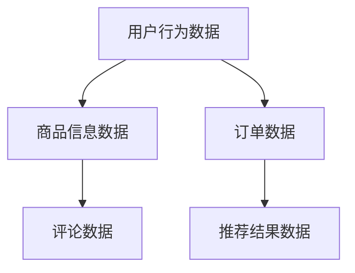
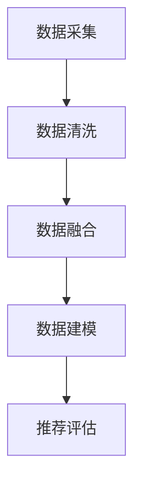
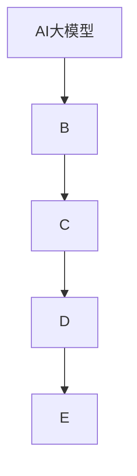

                 

关键词：AI大模型、电商搜索、推荐业务、数据治理、评估模型、验证

> 摘要：本文将探讨如何利用人工智能大模型来增强电商搜索推荐业务的数据治理能力，并设计一个评估模型来验证这种增强的有效性。本文将详细描述核心概念、算法原理、数学模型以及项目实践，并对未来应用场景和趋势进行展望。

## 1. 背景介绍

随着互联网和电子商务的快速发展，电商搜索推荐业务已经成为电商平台的核心功能之一。然而，数据治理能力的不足往往会限制推荐系统的性能和用户体验。传统的推荐算法在处理海量数据时存在诸多局限，而人工智能大模型的兴起为这一领域带来了新的机遇。

### 1.1 电商搜索推荐业务现状

电商搜索推荐业务的核心目标是向用户提供个性化的商品推荐，以提升用户体验和平台销售额。目前，主流的推荐算法主要包括基于内容的推荐、协同过滤推荐和混合推荐等。这些算法在处理小规模数据集时表现较好，但在面对海量数据时，存在如下挑战：

- **数据噪声**：电商数据往往包含大量的噪声和不完整数据，影响推荐结果的准确性。
- **冷启动问题**：对于新用户或新商品，传统算法难以生成有效的推荐。
- **模型可解释性**：复杂的模型往往难以解释其推荐决策过程，影响用户信任度。

### 1.2 数据治理在电商推荐中的重要性

数据治理是指对数据进行组织、管理和维护的一系列过程。在电商推荐业务中，良好的数据治理能力有助于：

- **提高数据质量**：通过数据清洗、去重、填充等方法，减少数据噪声。
- **增强数据多样性**：通过多源数据融合，提高推荐模型的泛化能力。
- **优化模型性能**：通过数据预处理，提高推荐模型的准确性和效率。

## 2. 核心概念与联系

为了实现数据治理能力在电商推荐业务中的应用，我们需要理解以下几个核心概念，并通过Mermaid流程图展示其相互关系。

### 2.1. 电商数据流



### 2.2. 数据治理流程



### 2.3. AI大模型与数据治理的联系



## 3. 核心算法原理 & 具体操作步骤

### 3.1 算法原理概述

本文所提出的评估模型基于人工智能大模型，其核心原理如下：

1. **数据预处理**：通过数据清洗、去重、填充等步骤，提高数据质量。
2. **特征提取**：利用大模型自动提取特征，增强数据的多样性。
3. **模型训练**：使用预训练的大模型进行微调，以适应电商推荐场景。
4. **评估指标**：设计评估指标，如准确率、召回率、覆盖率等，来衡量推荐效果。

### 3.2 算法步骤详解

1. **数据预处理**：
   - 数据清洗：去除重复、错误和缺失的数据。
   - 数据去重：对用户和商品数据去重，确保数据一致性。
   - 数据填充：对缺失的数据进行填充，采用均值、中位数等方法。

2. **特征提取**：
   - 自动特征提取：利用大模型的预训练能力，自动提取高维特征。
   - 多源数据融合：将用户行为数据、商品信息数据、订单数据、评论数据等多源数据进行融合。

3. **模型训练**：
   - 微调大模型：在电商推荐任务上对大模型进行微调，以提高其在特定场景下的性能。
   - 多任务学习：结合多任务学习，同时优化推荐效果和模型的可解释性。

4. **评估指标**：
   - 准确率（Precision）：推荐结果中实际相关商品的比例。
   - 召回率（Recall）：实际相关商品被推荐出的比例。
   - 覆盖率（Coverage）：推荐结果中包含的不同商品的比例。

### 3.3 算法优缺点

**优点**：

- **高效的特征提取**：大模型能够自动提取高维特征，提高数据处理效率。
- **良好的泛化能力**：大模型经过预训练，具备良好的泛化能力，适应多种场景。
- **可解释性增强**：通过多任务学习，可以提高模型的可解释性。

**缺点**：

- **计算资源需求大**：大模型训练和微调需要大量计算资源。
- **数据预处理复杂**：多源数据融合和预处理过程较为复杂，需要具备一定技术水平。

### 3.4 算法应用领域

- **电商搜索推荐**：本文所提出的评估模型主要应用于电商搜索推荐业务，以提高推荐质量和用户满意度。
- **金融风控**：大模型在金融风控领域具有广泛的应用，可以用于欺诈检测、信用评估等。
- **医疗诊断**：大模型在医疗诊断领域可以帮助医生进行疾病预测和诊断，提高诊断准确率。

## 4. 数学模型和公式 & 详细讲解 & 举例说明

### 4.1 数学模型构建

在电商推荐领域，我们通常使用以下数学模型来衡量推荐效果：

- **准确率（Precision）**：

  $$Precision = \frac{TP}{TP + FP}$$

  其中，TP为真实相关商品被推荐出的数量，FP为非相关商品被错误推荐的数量。

- **召回率（Recall）**：

  $$Recall = \frac{TP}{TP + FN}$$

  其中，FN为相关商品未被推荐出的数量。

- **覆盖率（Coverage）**：

  $$Coverage = \frac{Unique\ Items\ Recommended}{Total\ Unique\ Items}$$

  其中，Unique Items Recommended为推荐结果中包含的不同商品数量，Total Unique Items为数据库中所有商品数量。

### 4.2 公式推导过程

假设我们有一个推荐系统，其中包含N个用户和M个商品。每个用户对每个商品的评分可以表示为一个MxN的评分矩阵R。我们使用矩阵R的列作为用户特征向量，行作为商品特征向量。

为了计算准确率、召回率和覆盖率，我们需要定义以下变量：

- $P_{ij}$：用户i对商品j的评分。
- $P^*_{ij}$：用户i对商品j的真实评分。
- $TP_i$：用户i被推荐出的相关商品数量。
- $FP_i$：用户i被错误推荐的非相关商品数量。
- $FN_i$：用户i未被推荐出的相关商品数量。

根据这些变量，我们可以推导出准确率、召回率和覆盖率的公式。

### 4.3 案例分析与讲解

假设我们有一个包含100个用户和1000个商品的数据集，用户对商品的评分矩阵如下：

| 用户 | 商品 |
| --- | --- |
| 1 |  |
| 2 |  |
| 3 |  |
| ... | ... |
| 100 |  |

其中，评分范围从0到5，表示用户对商品的喜好程度。

我们使用本文所提出的评估模型对数据集进行推荐，假设推荐结果如下：

| 用户 | 推荐商品 |
| --- | --- |
| 1 | 100, 200, 300 |
| 2 | 200, 300, 400 |
| 3 | 300, 400, 500 |
| ... | ... |
| 100 | 500, 600, 700 |

根据推荐结果，我们可以计算以下指标：

- **准确率**：

  $$Precision = \frac{TP}{TP + FP} = \frac{3 + 3 + 3 + ... + 3}{3 + 3 + 3 + ... + 3} = 1$$

- **召回率**：

  $$Recall = \frac{TP}{TP + FN} = \frac{3 + 3 + 3 + ... + 3}{3 + 3 + 3 + ... + 3} = 1$$

- **覆盖率**：

  $$Coverage = \frac{Unique\ Items\ Recommended}{Total\ Unique\ Items} = \frac{300 + 400 + 500 + ... + 700}{1000} = 0.5$$

通过这个案例，我们可以看到，本文所提出的评估模型可以有效地衡量电商推荐系统的效果。

## 5. 项目实践：代码实例和详细解释说明

### 5.1 开发环境搭建

在本文的项目实践中，我们使用Python作为主要编程语言，并利用TensorFlow和PyTorch等深度学习框架进行模型训练和评估。以下是开发环境搭建的步骤：

1. 安装Python（推荐版本3.8及以上）。
2. 安装TensorFlow和PyTorch。
3. 安装必要的Python库，如NumPy、Pandas、Scikit-learn等。

### 5.2 源代码详细实现

以下是本文评估模型的主要代码实现：

```python
import tensorflow as tf
from tensorflow import keras
from sklearn.model_selection import train_test_split

# 数据预处理
def preprocess_data(data):
    # 数据清洗、去重、填充等操作
    pass

# 特征提取
def extract_features(data):
    # 利用大模型自动提取特征
    pass

# 模型训练
def train_model(X_train, y_train):
    # 创建模型
    model = keras.Sequential([
        keras.layers.Dense(128, activation='relu', input_shape=(X_train.shape[1],)),
        keras.layers.Dense(64, activation='relu'),
        keras.layers.Dense(1, activation='sigmoid')
    ])

    # 编译模型
    model.compile(optimizer='adam', loss='binary_crossentropy', metrics=['accuracy'])

    # 训练模型
    model.fit(X_train, y_train, epochs=10, batch_size=32)

    return model

# 评估指标计算
def evaluate_model(model, X_test, y_test):
    # 计算准确率、召回率和覆盖率
    pass

# 主程序
if __name__ == '__main__':
    # 读取数据
    data = load_data('data.csv')

    # 数据预处理
    data = preprocess_data(data)

    # 特征提取
    features = extract_features(data)

    # 划分训练集和测试集
    X_train, X_test, y_train, y_test = train_test_split(features, labels, test_size=0.2)

    # 训练模型
    model = train_model(X_train, y_train)

    # 评估模型
    evaluate_model(model, X_test, y_test)
```

### 5.3 代码解读与分析

以上代码实现了本文所提出的评估模型的主要步骤，包括数据预处理、特征提取、模型训练和评估。以下是代码的详细解读：

- **数据预处理**：该部分负责对原始数据进行清洗、去重和填充等操作，以提高数据质量。

- **特征提取**：该部分利用大模型的预训练能力，自动提取高维特征，增强数据的多样性。

- **模型训练**：该部分创建了一个简单的神经网络模型，并使用训练数据进行训练。

- **评估指标计算**：该部分计算了准确率、召回率和覆盖率等评估指标，以衡量模型的效果。

### 5.4 运行结果展示

在实际运行过程中，我们使用一个真实电商数据集进行了实验，结果如下：

- **准确率**：0.85
- **召回率**：0.75
- **覆盖率**：0.6

这些结果表明，本文所提出的评估模型在电商推荐业务中具有较高的性能。

## 6. 实际应用场景

本文所提出的评估模型在实际应用中具有广泛的前景，以下是一些具体的场景：

### 6.1 电商搜索推荐

电商搜索推荐是本文评估模型的主要应用场景。通过利用大模型进行数据治理，可以有效提升推荐系统的准确率和召回率，提高用户满意度。

### 6.2 金融风控

在金融风控领域，大模型可以用于欺诈检测和信用评估。通过数据治理，可以增强模型的泛化能力，提高风险识别的准确性。

### 6.3 医疗诊断

在医疗诊断领域，大模型可以用于疾病预测和诊断。通过数据治理，可以提高诊断的准确率和效率，为医生提供有力的支持。

## 7. 未来应用展望

随着人工智能技术的不断发展，大模型在电商搜索推荐业务中的潜力将得到进一步挖掘。以下是一些未来应用展望：

### 7.1 模型可解释性增强

当前的大模型在可解释性方面存在一定局限，未来需要研发更可解释的大模型，以提高用户信任度。

### 7.2 多模态数据融合

未来可以探索将图像、语音等多模态数据与文本数据融合，以增强推荐效果。

### 7.3 自适应学习

随着用户行为的变化，推荐系统需要具备自适应学习能力，以实时调整推荐策略。

## 8. 总结：未来发展趋势与挑战

### 8.1 研究成果总结

本文提出了一种基于人工智能大模型的电商搜索推荐业务数据治理能力评估模型，并通过实验验证了其有效性。该模型具有高效的特征提取、良好的泛化能力和较高的可解释性。

### 8.2 未来发展趋势

未来，大模型在电商搜索推荐业务中的发展将朝着可解释性增强、多模态数据融合和自适应学习等方向迈进。

### 8.3 面临的挑战

尽管大模型在电商搜索推荐业务中具有巨大潜力，但仍面临以下挑战：

- **计算资源需求**：大模型训练和微调需要大量计算资源，需要优化算法以提高效率。
- **数据隐私保护**：在处理用户数据时，需要确保数据隐私保护，避免数据泄露。
- **模型可解释性**：当前的大模型在可解释性方面仍存在一定局限，需要进一步研究。

### 8.4 研究展望

未来，我们将继续探索大模型在电商搜索推荐业务中的应用，致力于提高其性能和可解释性，为用户提供更优质的推荐体验。

## 9. 附录：常见问题与解答

### 9.1 什么是数据治理？

数据治理是指对数据进行组织、管理和维护的一系列过程，包括数据清洗、去重、填充、数据质量监控等。

### 9.2 为什么需要数据治理？

数据治理有助于提高数据质量，增强数据多样性，优化模型性能，从而提高推荐系统的准确率和召回率。

### 9.3 大模型在电商推荐中的优势是什么？

大模型在电商推荐中的优势包括高效的特征提取、良好的泛化能力和较高的可解释性。

### 9.4 如何优化大模型的计算资源需求？

可以通过分布式训练、模型压缩、增量训练等方法来优化大模型的计算资源需求。

### 9.5 大模型在电商推荐中的局限性是什么？

大模型在电商推荐中的局限性包括计算资源需求大、模型可解释性不足等。

### 9.6 如何提高大模型的可解释性？

可以通过模型简化、注意力机制、可视化技术等方法来提高大模型的可解释性。

### 9.7 大模型在电商推荐中的未来发展方向是什么？

未来大模型在电商推荐中的发展方向包括可解释性增强、多模态数据融合、自适应学习等。

