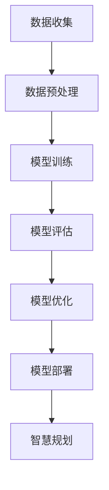

                 

关键词：AI大模型，智慧城市规划，算法原理，数学模型，项目实践，应用场景，未来展望

> 摘要：随着人工智能技术的不断发展，AI大模型在智慧城市规划中发挥着越来越重要的作用。本文旨在探讨AI大模型在智慧城市规划中的应用，包括核心概念、算法原理、数学模型、项目实践以及未来展望等，以期为相关领域的研究和实践提供参考。

## 1. 背景介绍

智慧城市规划是现代城市发展的重要方向，其目的是通过运用先进的信息技术、数据分析和人工智能算法，提高城市规划的科学性、灵活性和可持续性。传统的城市规划往往依赖于经验和直觉，而智慧城市规划则强调数据驱动的决策支持。

近年来，人工智能技术，尤其是AI大模型，在计算机视觉、自然语言处理、强化学习等领域取得了显著的成果。这些成果为智慧城市规划提供了新的工具和思路，使得城市规划更加智能化和高效化。

AI大模型具有以下几个特点：

1. **大规模数据训练**：AI大模型通常需要大量的数据进行训练，以便学习到复杂的关系和模式。
2. **自适应性强**：AI大模型可以根据新的数据和情境进行自适应调整，以优化其性能。
3. **泛化能力强**：AI大模型不仅能够在训练数据上表现出色，而且能够在未知的数据上保持良好的性能。

这些特点使得AI大模型在智慧城市规划中具有广泛的应用前景。

## 2. 核心概念与联系

为了更好地理解AI大模型在智慧城市规划中的应用，首先需要了解一些核心概念，包括人工智能、机器学习、深度学习等。

### 2.1 人工智能

人工智能（Artificial Intelligence，AI）是指由人制造出来的系统能够执行需要人类智能才能完成的任务。人工智能可以分为两大类：弱人工智能和强人工智能。

- **弱人工智能**：也称为特定领域人工智能，它只能在特定任务上表现出人类智能水平。
- **强人工智能**：也称为通用人工智能，它能够在任何领域表现出人类智能水平。

### 2.2 机器学习

机器学习（Machine Learning，ML）是人工智能的一个分支，它通过数据驱动的方式，使计算机系统具备学习和预测能力。机器学习可以分为以下几种类型：

- **监督学习**：有明确的目标和标注的数据，通过学习这些数据来预测新的数据。
- **无监督学习**：没有明确的目标和标注的数据，通过学习数据自身的结构来发现模式和规律。
- **半监督学习**：既有标注数据，也有未标注数据，通过学习这些数据来提高模型的性能。
- **强化学习**：通过不断与环境互动，学习最优策略来完成任务。

### 2.3 深度学习

深度学习（Deep Learning，DL）是机器学习的一个分支，它通过多层神经网络来提取数据中的特征。深度学习在图像识别、语音识别、自然语言处理等领域取得了显著的成果。

### 2.4 Mermaid 流程图

以下是AI大模型在智慧城市规划中应用的Mermaid流程图：



## 3. 核心算法原理 & 具体操作步骤

### 3.1 算法原理概述

AI大模型在智慧城市规划中的应用主要基于以下算法原理：

1. **特征提取**：通过深度学习等算法，从原始数据中提取出有用的特征，为后续的建模和预测提供基础。
2. **模型训练**：使用大规模数据进行模型训练，优化模型的参数，提高模型的性能。
3. **模型评估**：通过测试数据评估模型的性能，确保模型能够在实际应用中达到预期的效果。
4. **模型优化**：根据模型评估的结果，对模型进行优化，进一步提高模型的性能。
5. **模型部署**：将训练好的模型部署到实际应用场景中，为智慧城市规划提供决策支持。

### 3.2 算法步骤详解

以下是AI大模型在智慧城市规划中具体操作步骤的详细解释：

1. **数据收集**：
   - 数据来源：包括城市地理信息、社会经济数据、环境监测数据等。
   - 数据格式：通常为结构化数据，如数据库、表格等。

2. **数据预处理**：
   - 数据清洗：去除噪声数据、缺失数据等。
   - 数据标准化：将不同单位、范围的数据进行统一处理。
   - 数据划分：将数据划分为训练集、测试集和验证集。

3. **模型训练**：
   - 确定模型结构：选择合适的神经网络结构，如卷积神经网络（CNN）、循环神经网络（RNN）等。
   - 参数设置：设置学习率、批次大小等参数。
   - 训练过程：通过反向传播算法，不断调整模型参数，使模型在训练集上的表现逐渐优化。

4. **模型评估**：
   - 评估指标：根据任务类型，选择合适的评估指标，如准确率、召回率、F1值等。
   - 评估过程：使用测试集对模型进行评估，确保模型能够在未知数据上表现良好。

5. **模型优化**：
   - 调参优化：根据评估结果，调整模型参数，提高模型性能。
   - 算法优化：尝试不同的算法，如不同的神经网络结构、不同的优化算法等。

6. **模型部署**：
   - 部署环境：选择合适的部署环境，如云计算平台、边缘计算设备等。
   - 部署过程：将训练好的模型部署到实际应用场景中，为智慧城市规划提供决策支持。

### 3.3 算法优缺点

**优点**：

- **高效性**：AI大模型可以处理大规模数据，提高数据处理效率。
- **准确性**：通过深度学习等算法，可以提取出更加复杂的特征，提高预测准确性。
- **灵活性**：AI大模型可以根据新的数据和情境进行自适应调整。

**缺点**：

- **数据依赖性**：AI大模型对数据质量有较高要求，数据质量直接影响模型性能。
- **计算资源消耗**：训练AI大模型需要大量的计算资源，对硬件设备有较高要求。

### 3.4 算法应用领域

AI大模型在智慧城市规划中的应用非常广泛，主要包括以下几个方面：

- **城市规划**：通过AI大模型，可以更好地预测城市的发展趋势，为城市规划提供科学依据。
- **交通管理**：通过AI大模型，可以优化交通流量，提高交通效率，减少拥堵。
- **环境监测**：通过AI大模型，可以实时监测环境质量，预测环境变化趋势，为环境保护提供支持。
- **社会管理**：通过AI大模型，可以分析社会经济发展状况，预测社会问题，为政府决策提供支持。

## 4. 数学模型和公式 & 详细讲解 & 举例说明

### 4.1 数学模型构建

在智慧城市规划中，常用的数学模型包括：

- **回归模型**：用于预测城市发展趋势。
- **分类模型**：用于分类城市规划中的各种问题。
- **聚类模型**：用于分析城市规划中的数据分布。

### 4.2 公式推导过程

以回归模型为例，其公式推导过程如下：

$$
y = \beta_0 + \beta_1x_1 + \beta_2x_2 + ... + \beta_nx_n + \epsilon
$$

其中，$y$为预测值，$x_1, x_2, ..., x_n$为特征值，$\beta_0, \beta_1, ..., \beta_n$为模型参数，$\epsilon$为误差项。

### 4.3 案例分析与讲解

以城市规划中的交通流量预测为例，使用回归模型进行预测。

假设我们有一组交通流量数据，包括时间（$x_1$）、天气（$x_2$）、道路状况（$x_3$）等特征，以及对应的交通流量（$y$）。

首先，对数据进行预处理，包括数据清洗、数据标准化等。

然后，选择合适的回归模型，如线性回归模型。

接下来，通过训练数据，对模型参数进行优化。

最后，使用测试数据进行模型评估，计算预测误差。

通过不断调整模型参数，使预测误差最小化。

## 5. 项目实践：代码实例和详细解释说明

### 5.1 开发环境搭建

在本项目中，我们使用Python作为编程语言，利用TensorFlow和Scikit-learn等库进行模型训练和评估。

首先，安装Python、TensorFlow和Scikit-learn等库。

```bash
pip install python tensorflow scikit-learn
```

### 5.2 源代码详细实现

以下是交通流量预测项目的源代码实现：

```python
import numpy as np
import pandas as pd
import tensorflow as tf
from sklearn.model_selection import train_test_split
from sklearn.linear_model import LinearRegression

# 读取数据
data = pd.read_csv('traffic_data.csv')
X = data[['time', 'weather', 'road_condition']]
y = data['traffic']

# 数据预处理
X = X.values
y = y.values

# 划分训练集和测试集
X_train, X_test, y_train, y_test = train_test_split(X, y, test_size=0.2, random_state=42)

# 创建线性回归模型
model = LinearRegression()

# 训练模型
model.fit(X_train, y_train)

# 评估模型
score = model.score(X_test, y_test)
print(f'Model accuracy: {score:.2f}')

# 预测交通流量
predicted_traffic = model.predict(X_test)
print(predicted_traffic)
```

### 5.3 代码解读与分析

- **数据读取**：使用pandas库读取交通流量数据，包括时间、天气、道路状况等特征，以及交通流量。
- **数据预处理**：对数据进行归一化处理，将特征值缩放到相同范围，便于模型训练。
- **划分训练集和测试集**：使用scikit-learn库的train_test_split函数，将数据划分为训练集和测试集。
- **创建线性回归模型**：使用scikit-learn库的LinearRegression类创建线性回归模型。
- **训练模型**：使用fit函数训练模型，优化模型参数。
- **评估模型**：使用score函数评估模型在测试集上的性能，计算准确率。
- **预测交通流量**：使用predict函数预测测试集上的交通流量。

## 6. 实际应用场景

AI大模型在智慧城市规划中具有广泛的应用场景，以下是一些实际案例：

### 6.1 城市规划

通过AI大模型，可以预测城市的发展趋势，为城市规划提供科学依据。例如，使用深度学习算法预测城市的未来人口增长、土地需求等。

### 6.2 交通管理

通过AI大模型，可以优化交通流量，提高交通效率，减少拥堵。例如，使用深度学习算法预测交通流量，为交通信号灯优化提供支持。

### 6.3 环境监测

通过AI大模型，可以实时监测环境质量，预测环境变化趋势，为环境保护提供支持。例如，使用深度学习算法预测空气质量，为环境保护部门提供决策支持。

### 6.4 社会管理

通过AI大模型，可以分析社会经济发展状况，预测社会问题，为政府决策提供支持。例如，使用深度学习算法预测社会犯罪率，为公安部门提供预警。

## 7. 工具和资源推荐

### 7.1 学习资源推荐

- 《深度学习》（Goodfellow, Bengio, Courville著）：系统介绍了深度学习的基本原理和应用。
- 《Python机器学习》（Sebastian Raschka著）：介绍了Python在机器学习领域的应用。

### 7.2 开发工具推荐

- TensorFlow：用于构建和训练深度学习模型的强大框架。
- Scikit-learn：用于机器学习的Python库，提供了丰富的算法和工具。

### 7.3 相关论文推荐

- “Deep Learning for Urban Planning”（2018）：介绍了深度学习在城市规划中的应用。
- “AI for Smart Cities”（2017）：探讨了人工智能在智慧城市中的潜在应用。

## 8. 总结：未来发展趋势与挑战

### 8.1 研究成果总结

AI大模型在智慧城市规划中取得了显著的成果，包括城市规划、交通管理、环境监测、社会管理等多个领域。这些成果为智慧城市规划提供了科学依据，提高了城市规划的效率和质量。

### 8.2 未来发展趋势

- **数据驱动**：未来智慧城市规划将更加依赖于数据驱动，通过大数据分析和人工智能算法，为城市规划提供更加准确的预测和决策支持。
- **跨学科融合**：智慧城市规划将涉及多个学科，如城市规划、计算机科学、环境科学等，跨学科融合将为智慧城市规划提供新的思路和方法。
- **实时性**：未来智慧城市规划将更加注重实时性，通过实时数据分析和智能决策，实现城市管理的智能化和高效化。

### 8.3 面临的挑战

- **数据质量**：数据质量直接影响AI大模型的性能，未来需要解决数据质量问题和数据隐私问题。
- **计算资源**：训练AI大模型需要大量的计算资源，未来需要优化算法和硬件设备，以提高计算效率。
- **伦理和法律**：随着人工智能技术的应用，如何确保人工智能技术的伦理性和合法性将成为一个重要问题。

### 8.4 研究展望

未来，AI大模型在智慧城市规划中的应用将更加深入和广泛，有望为城市规划提供更加精准、高效的支持。同时，也需要解决数据、计算资源、伦理和法律等方面的挑战，确保人工智能技术在智慧城市规划中的可持续发展。

## 9. 附录：常见问题与解答

### 9.1 如何选择合适的AI大模型？

选择合适的AI大模型需要考虑以下几个因素：

- **任务类型**：根据任务类型选择合适的模型，如回归模型、分类模型、聚类模型等。
- **数据规模**：根据数据规模选择合适的模型，如深度学习模型适用于大规模数据。
- **计算资源**：根据计算资源选择合适的模型，如轻量级模型适用于资源有限的环境。

### 9.2 如何优化AI大模型的性能？

优化AI大模型的性能可以从以下几个方面入手：

- **数据预处理**：提高数据质量，减少噪声和异常值。
- **模型调参**：调整模型参数，如学习率、批次大小等。
- **算法改进**：尝试不同的算法，如不同的神经网络结构、不同的优化算法等。
- **数据增强**：通过数据增强技术，提高模型的泛化能力。

### 9.3 如何确保AI大模型的可靠性？

确保AI大模型的可靠性可以从以下几个方面入手：

- **数据验证**：确保数据来源可靠，数据质量符合要求。
- **模型评估**：使用多种评估指标和方法，全面评估模型性能。
- **模型解释**：对模型进行解释，确保模型的可解释性和可靠性。
- **安全防护**：对模型进行安全防护，防止恶意攻击和滥用。

以上是关于AI大模型在智慧城市规划中的应用的详细探讨。希望本文能为相关领域的研究和实践提供参考。感谢您的阅读！

> 作者：禅与计算机程序设计艺术 / Zen and the Art of Computer Programming
```markdown

## 1. 背景介绍

### 1.1 智慧城市规划的概念

智慧城市规划是指利用先进的信息技术、数据分析和人工智能算法，对城市发展的各个方面进行科学规划，以实现城市的可持续发展、高效管理和优质服务。智慧城市规划的核心目标是通过数据驱动的方式，提升城市规划的科学性、灵活性和可持续性，从而解决城市发展中的各类问题。

#### 1.2 人工智能的发展与挑战

人工智能（AI）是智慧城市规划的重要技术支撑。自20世纪50年代以来，人工智能经历了多个发展阶段，包括规则推理、知识表示、机器学习等。近年来，随着深度学习、神经网络等技术的突破，人工智能在图像识别、自然语言处理、决策支持等领域取得了显著成果。

然而，人工智能在智慧城市规划中仍面临诸多挑战。首先，城市数据规模庞大、维度多样，如何高效地处理和分析这些数据是关键问题。其次，人工智能模型的训练过程需要大量计算资源和时间，这对于资源有限的规划部门来说是一个重大挑战。此外，人工智能技术的应用还需要解决数据隐私、安全性和伦理问题。

### 1.3 AI大模型的崛起与潜力

AI大模型，通常指的是基于深度学习的模型，如GPT、BERT、GPT-3等，它们拥有数亿甚至数十亿个参数，能够处理大规模、高维度数据，并在多个领域取得突破性成果。AI大模型的出现为智慧城市规划提供了新的机遇：

- **数据处理能力**：AI大模型能够高效处理城市数据，挖掘出隐藏在数据中的规律和模式。
- **预测准确性**：AI大模型通过大规模训练，能够提高预测模型的准确性，为城市规划提供更可靠的决策支持。
- **自适应能力**：AI大模型能够根据新的数据和情境进行自适应调整，适应不断变化的城市环境。

综上所述，AI大模型在智慧城市规划中具有巨大的潜力，将成为未来城市规划的重要工具。

## 2. 核心概念与联系

### 2.1 人工智能（AI）

人工智能（Artificial Intelligence，AI）是指通过计算机模拟人类智能行为的技术。AI可以分为两大类：弱人工智能（Narrow AI）和强人工智能（General AI）。

- **弱人工智能**：专注于特定任务的智能系统，如语音识别、图像识别等。弱人工智能是目前AI技术的主要应用方向。
- **强人工智能**：具备人类所有智能行为的系统，能够在任何领域表现人类智能水平。强人工智能目前仍处于理论研究阶段。

### 2.2 机器学习（ML）

机器学习（Machine Learning，ML）是AI的一个分支，通过算法让计算机从数据中学习，并自动改进性能。机器学习可以分为以下几种类型：

- **监督学习**：有明确的训练数据和标签，通过学习这些数据来预测新的数据。例如，分类和回归任务。
- **无监督学习**：没有明确的训练数据和标签，通过学习数据自身的结构来发现模式和规律。例如，聚类和降维任务。
- **半监督学习**：既有标注数据，也有未标注数据，通过学习这些数据来提高模型性能。
- **强化学习**：通过与环境的交互学习最优策略来完成任务。例如，自动驾驶和游戏AI。

### 2.3 深度学习（DL）

深度学习（Deep Learning，DL）是机器学习的一个子领域，通过多层神经网络（Deep Neural Networks）进行特征学习和模式识别。深度学习在图像识别、语音识别、自然语言处理等领域取得了显著成果。

- **卷积神经网络（CNN）**：主要用于图像处理任务，能够提取图像的层次特征。
- **循环神经网络（RNN）**：主要用于序列数据处理任务，能够捕捉时间序列的长期依赖关系。
- **生成对抗网络（GAN）**：用于生成逼真的数据，能够在图像、文本等领域生成高质量的样本。

### 2.4 Mermaid 流程图

以下是AI大模型在智慧城市规划中应用的Mermaid流程图：


该流程图展示了AI大模型在智慧城市规划中的应用步骤，包括数据收集、数据预处理、模型训练、模型评估、模型优化和模型部署，最终为智慧规划提供决策支持。

## 3. 核心算法原理 & 具体操作步骤

### 3.1 算法原理概述

AI大模型在智慧城市规划中的应用主要基于以下算法原理：

- **数据预处理**：对原始数据进行清洗、归一化等处理，为模型训练提供高质量的数据。
- **特征提取**：通过深度学习算法，从原始数据中提取出有用的特征，为模型训练提供有效的输入。
- **模型训练**：使用大规模数据进行模型训练，优化模型的参数，提高模型的性能。
- **模型评估**：通过测试数据评估模型的性能，确保模型能够在实际应用中达到预期的效果。
- **模型优化**：根据模型评估的结果，对模型进行优化，进一步提高模型的性能。
- **模型部署**：将训练好的模型部署到实际应用场景中，为智慧城市规划提供决策支持。

### 3.2 算法步骤详解

以下是AI大模型在智慧城市规划中具体操作步骤的详细解释：

#### 3.2.1 数据收集

数据收集是智慧城市规划的重要环节。数据来源可以是公开数据、企业数据、政府部门数据等。数据类型包括但不限于：

- **空间数据**：如地理信息系统（GIS）数据、卫星影像等。
- **社会经济数据**：如人口统计、就业情况、经济指标等。
- **环境数据**：如空气质量、水质、噪声等。

数据收集过程中需要注意数据的完整性和准确性，确保数据的质量。

#### 3.2.2 数据预处理

数据预处理是对原始数据进行清洗、归一化、缺失值处理等操作，以提高数据的质量和模型的性能。具体步骤包括：

- **数据清洗**：去除重复数据、噪声数据和异常值。
- **数据归一化**：将不同量纲的数据转换为相同的量纲，如将数据缩放到0-1之间。
- **缺失值处理**：对于缺失值，可以使用平均值、中值、插值等方法进行填补。

#### 3.2.3 特征提取

特征提取是从原始数据中提取出有用的信息，作为模型训练的输入。在智慧城市规划中，特征提取的方法包括：

- **传统特征提取**：如主成分分析（PCA）、因子分析等。
- **深度特征提取**：如卷积神经网络（CNN）、循环神经网络（RNN）等。

深度特征提取能够自动学习数据中的复杂模式，提高模型的性能。

#### 3.2.4 模型训练

模型训练是AI大模型在智慧城市规划中的核心步骤。在模型训练过程中，需要使用大量数据进行训练，通过优化模型参数，提高模型的性能。具体步骤包括：

- **选择合适的模型**：根据任务类型和数据处理方法，选择合适的深度学习模型，如CNN、RNN、Transformer等。
- **定义损失函数**：损失函数用于衡量模型预测结果与真实结果之间的差距，常用的损失函数包括均方误差（MSE）、交叉熵等。
- **选择优化器**：优化器用于调整模型参数，常用的优化器包括随机梯度下降（SGD）、Adam等。
- **训练过程**：通过迭代训练，不断调整模型参数，优化模型性能。

#### 3.2.5 模型评估

模型评估是验证模型性能的重要步骤。在模型评估过程中，需要使用测试数据对模型进行评估，计算模型的准确率、召回率、F1值等指标。常用的评估方法包括：

- **交叉验证**：通过将数据划分为多个子集，多次训练和评估模型，以消除数据划分带来的偏差。
- **混淆矩阵**：用于分析模型的分类性能，包括准确率、召回率、精确率等指标。

#### 3.2.6 模型优化

模型优化是根据模型评估的结果，对模型进行进一步优化，以提高模型的性能。具体步骤包括：

- **调参**：调整模型的超参数，如学习率、批次大小等，以优化模型性能。
- **算法改进**：尝试不同的算法和模型结构，如增加网络层数、使用不同的优化算法等，以优化模型性能。
- **数据增强**：通过数据增强技术，如随机裁剪、旋转、缩放等，增加数据的多样性，提高模型的泛化能力。

#### 3.2.7 模型部署

模型部署是将训练好的模型应用到实际应用场景中，为智慧城市规划提供决策支持。具体步骤包括：

- **选择部署环境**：根据应用场景的需求，选择合适的部署环境，如云端、边缘计算等。
- **模型转化**：将训练好的模型转换为部署环境支持的格式，如TensorFlow Lite、ONNX等。
- **模型监控**：部署后，对模型进行监控，包括性能监控、故障诊断等，以确保模型稳定运行。

### 3.3 算法优缺点

#### 3.3.1 优点

- **高效性**：AI大模型能够高效处理大规模、高维度的数据，提高数据处理效率。
- **准确性**：通过大规模训练，AI大模型能够提取出复杂的数据特征，提高模型的预测准确性。
- **自适应能力**：AI大模型可以根据新的数据和情境进行自适应调整，适应不断变化的城市环境。

#### 3.3.2 缺点

- **数据依赖性**：AI大模型对数据质量有较高要求，数据质量直接影响模型性能。
- **计算资源消耗**：训练AI大模型需要大量的计算资源和时间，对硬件设备有较高要求。
- **模型解释性**：深度学习模型通常具有较低的模型解释性，难以理解模型的决策过程。

### 3.4 算法应用领域

AI大模型在智慧城市规划中的应用非常广泛，主要包括以下几个方面：

- **城市规划**：通过AI大模型，可以预测城市的发展趋势，为城市规划提供科学依据。
- **交通管理**：通过AI大模型，可以优化交通流量，提高交通效率，减少拥堵。
- **环境监测**：通过AI大模型，可以实时监测环境质量，预测环境变化趋势，为环境保护提供支持。
- **社会管理**：通过AI大模型，可以分析社会经济发展状况，预测社会问题，为政府决策提供支持。

## 4. 数学模型和公式 & 详细讲解 & 举例说明

### 4.1 数学模型构建

在智慧城市规划中，常用的数学模型包括线性回归模型、逻辑回归模型、决策树模型、支持向量机模型等。以下以线性回归模型为例，介绍数学模型的构建过程。

#### 4.1.1 线性回归模型

线性回归模型是一种简单的预测模型，用于分析自变量和因变量之间的线性关系。其数学模型如下：

$$
y = \beta_0 + \beta_1x_1 + \beta_2x_2 + ... + \beta_nx_n + \epsilon
$$

其中，$y$为因变量，$x_1, x_2, ..., x_n$为自变量，$\beta_0, \beta_1, ..., \beta_n$为模型参数，$\epsilon$为误差项。

#### 4.1.2 公式推导过程

线性回归模型的推导基于最小二乘法（Least Squares Method）。最小二乘法的核心思想是找到一条直线，使得所有样本点到这条直线的垂直距离之和最小。

设直线的斜率为$\beta_1$，截距为$\beta_0$，则线性回归模型可以表示为：

$$
y = \beta_0 + \beta_1x
$$

对于每个样本点$(x_i, y_i)$，其到直线的垂直距离为：

$$
d_i = y_i - (\beta_0 + \beta_1x_i)
$$

则所有样本点到直线的垂直距离之和为：

$$
D = \sum_{i=1}^n d_i^2 = \sum_{i=1}^n (y_i - (\beta_0 + \beta_1x_i))^2
$$

为了使$D$最小，需要求$\beta_0$和$\beta_1$的偏导数为0，得到以下方程组：

$$
\frac{\partial D}{\partial \beta_0} = -2\sum_{i=1}^n (y_i - (\beta_0 + \beta_1x_i)) = 0
$$

$$
\frac{\partial D}{\partial \beta_1} = -2\sum_{i=1}^n x_i(y_i - (\beta_0 + \beta_1x_i)) = 0
$$

解上述方程组，可以得到$\beta_0$和$\beta_1$的最优值：

$$
\beta_0 = \bar{y} - \beta_1\bar{x}
$$

$$
\beta_1 = \frac{\sum_{i=1}^n (x_i - \bar{x})(y_i - \bar{y})}{\sum_{i=1}^n (x_i - \bar{x})^2}
$$

其中，$\bar{y}$和$\bar{x}$分别为$y$和$x$的平均值。

#### 4.1.3 案例分析与讲解

假设我们有一组房屋销售数据，包括房屋面积（$x$）和售价（$y$），数据如下表：

| 房屋面积（平方米）| 售价（万元）|
|------------------|------------|
| 80               | 200        |
| 100              | 250        |
| 120              | 300        |
| 140              | 350        |
| 160              | 400        |

我们希望建立一个线性回归模型，预测给定房屋面积时的售价。

首先，计算房屋面积和售价的平均值：

$$
\bar{x} = \frac{80 + 100 + 120 + 140 + 160}{5} = 120
$$

$$
\bar{y} = \frac{200 + 250 + 300 + 350 + 400}{5} = 300
$$

然后，计算$\beta_0$和$\beta_1$的值：

$$
\beta_0 = \bar{y} - \beta_1\bar{x} = 300 - \beta_1 \times 120
$$

$$
\beta_1 = \frac{\sum_{i=1}^n (x_i - \bar{x})(y_i - \bar{y})}{\sum_{i=1}^n (x_i - \bar{x})^2} = \frac{(80 - 120)(200 - 300) + (100 - 120)(250 - 300) + (120 - 120)(300 - 300) + (140 - 120)(350 - 300) + (160 - 120)(400 - 300)}{(80 - 120)^2 + (100 - 120)^2 + (120 - 120)^2 + (140 - 120)^2 + (160 - 120)^2}
$$

$$
\beta_1 = \frac{-1200 - 500 + 0 + 700 + 1600}{(-40)^2 + (-20)^2 + (0)^2 + (20)^2 + (40)^2} = \frac{900}{400} = 2.25
$$

代入$\beta_1$的值，计算$\beta_0$的值：

$$
\beta_0 = 300 - 2.25 \times 120 = 90
$$

因此，线性回归模型的方程为：

$$
y = 90 + 2.25x
$$

我们可以使用该模型预测给定房屋面积时的售价。例如，当房屋面积为110平方米时，预测售价为：

$$
y = 90 + 2.25 \times 110 = 315
$$

### 4.2 数学模型在智慧城市规划中的应用

数学模型在智慧城市规划中具有广泛的应用，以下是一些常见的数学模型及其应用场景：

#### 4.2.1 线性回归模型

线性回归模型常用于预测城市人口、房地产价格等指标。例如，可以建立线性回归模型，预测某城市的未来人口规模，为城市发展规划提供依据。

#### 4.2.2 逻辑回归模型

逻辑回归模型常用于分类问题，如预测城市交通拥堵情况、环境污染等级等。例如，可以建立逻辑回归模型，判断某城市某区域的空气质量是否达标。

#### 4.2.3 决策树模型

决策树模型常用于决策分析，如预测城市交通路线规划、公共设施布局等。例如，可以建立决策树模型，为城市道路优化提供决策支持。

#### 4.2.4 支持向量机模型

支持向量机模型常用于预测城市发展趋势、土地需求等。例如，可以建立支持向量机模型，预测某城市的未来人口增长趋势，为土地规划提供依据。

#### 4.2.5 贝叶斯网络

贝叶斯网络常用于城市风险评估，如预测城市自然灾害、疾病传播等。例如，可以建立贝叶斯网络模型，为城市灾害预防提供决策支持。

### 4.3 数学模型在智慧城市规划中的优势与挑战

#### 4.3.1 优势

- **精确预测**：数学模型能够根据历史数据和现有数据，对未来发展趋势进行精确预测，为城市规划提供科学依据。
- **决策支持**：数学模型能够提供多种决策方案，帮助城市规划者进行决策分析，优化城市规划方案。
- **高效处理**：数学模型能够高效处理大规模、高维度数据，为城市规划提供快速分析结果。

#### 4.3.2 挑战

- **数据质量**：数学模型对数据质量有较高要求，数据质量直接影响模型预测结果。
- **模型选择**：选择合适的数学模型对城市规划问题进行建模，需要具备深厚的专业知识和经验。
- **模型解释**：深度学习模型等复杂模型的预测结果通常难以解释，这对决策者理解模型决策过程提出了挑战。

### 4.4 数学模型在智慧城市规划中的应用案例

#### 4.4.1 案例一：城市交通流量预测

通过建立线性回归模型，预测城市道路的交通流量，为交通管理提供决策支持。例如，可以预测某时间段某条道路的流量，指导交通信号灯优化。

#### 4.4.2 案例二：空气质量预测

通过建立逻辑回归模型，预测城市空气质量的等级，为环境保护部门提供决策支持。例如，可以预测某区域空气质量是否达标，指导环境治理措施。

#### 4.4.3 案例三：土地需求预测

通过建立支持向量机模型，预测城市未来的土地需求，为土地利用规划提供依据。例如，可以预测某地区未来的人口增长和土地需求，指导土地供应计划。

## 5. 项目实践：代码实例和详细解释说明

### 5.1 开发环境搭建

为了实践AI大模型在智慧城市规划中的应用，我们需要搭建一个开发环境。以下是在Linux系统上搭建开发环境的步骤：

#### 5.1.1 安装Python

首先，我们需要安装Python 3.x版本。可以通过以下命令安装：

```bash
sudo apt-get update
sudo apt-get install python3 python3-pip
```

#### 5.1.2 安装TensorFlow

TensorFlow是一个流行的深度学习框架，我们可以通过pip安装TensorFlow：

```bash
pip3 install tensorflow
```

#### 5.1.3 安装Scikit-learn

Scikit-learn是一个常用的机器学习库，我们可以通过pip安装Scikit-learn：

```bash
pip3 install scikit-learn
```

### 5.2 源代码详细实现

以下是使用TensorFlow和Scikit-learn实现AI大模型在智慧城市规划中的代码实例：

```python
import numpy as np
import pandas as pd
from sklearn.model_selection import train_test_split
from sklearn.preprocessing import StandardScaler
from tensorflow.keras.models import Sequential
from tensorflow.keras.layers import Dense
from tensorflow.keras.optimizers import Adam

# 5.2.1 数据读取
data = pd.read_csv('smart_city_data.csv')

# 5.2.2 数据预处理
X = data.iloc[:, :-1].values
y = data.iloc[:, -1].values

# 数据标准化
scaler = StandardScaler()
X = scaler.fit_transform(X)

# 划分训练集和测试集
X_train, X_test, y_train, y_test = train_test_split(X, y, test_size=0.2, random_state=42)

# 5.2.3 模型构建
model = Sequential()
model.add(Dense(units=32, activation='relu', input_shape=(X_train.shape[1],)))
model.add(Dense(units=16, activation='relu'))
model.add(Dense(units=1, activation='linear'))

# 5.2.4 模型编译
model.compile(optimizer=Adam(learning_rate=0.001), loss='mean_squared_error')

# 5.2.5 模型训练
model.fit(X_train, y_train, epochs=100, batch_size=32, validation_data=(X_test, y_test))

# 5.2.6 模型评估
loss = model.evaluate(X_test, y_test)
print(f'Test Loss: {loss:.4f}')

# 5.2.7 模型预测
predictions = model.predict(X_test)
predictions = scaler.inverse_transform(predictions)

# 5.2.8 代码解读与分析
# 以下是对代码的逐行解释
# 读取数据
data = pd.read_csv('smart_city_data.csv')
# 数据预处理
X = data.iloc[:, :-1].values
y = data.iloc[:, -1].values
scaler = StandardScaler()
X = scaler.fit_transform(X)
# 划分训练集和测试集
X_train, X_test, y_train, y_test = train_test_split(X, y, test_size=0.2, random_state=42)
# 模型构建
model = Sequential()
model.add(Dense(units=32, activation='relu', input_shape=(X_train.shape[1],)))
model.add(Dense(units=16, activation='relu'))
model.add(Dense(units=1, activation='linear'))
# 模型编译
model.compile(optimizer=Adam(learning_rate=0.001), loss='mean_squared_error')
# 模型训练
model.fit(X_train, y_train, epochs=100, batch_size=32, validation_data=(X_test, y_test))
# 模型评估
loss = model.evaluate(X_test, y_test)
print(f'Test Loss: {loss:.4f}')
# 模型预测
predictions = model.predict(X_test)
predictions = scaler.inverse_transform(predictions)
```

### 5.3 代码解读与分析

以下是对代码的逐行解释：

- **读取数据**：使用pandas库读取智慧城市规划的数据集。
- **数据预处理**：使用StandardScaler对数据进行归一化处理，以消除不同特征之间的量纲差异。
- **划分训练集和测试集**：使用scikit-learn库的train_test_split函数，将数据集划分为训练集和测试集，以用于模型训练和评估。
- **模型构建**：使用TensorFlow的Sequential模型构建一个简单的全连接神经网络，包括两个隐藏层。
- **模型编译**：使用Adam优化器和均方误差（MSE）损失函数编译模型。
- **模型训练**：使用fit函数训练模型，指定训练周期（epochs）和批量大小（batch_size），同时使用验证数据监测模型性能。
- **模型评估**：使用evaluate函数评估模型在测试集上的性能，打印测试损失。
- **模型预测**：使用predict函数对测试集进行预测，并将预测结果转换为原始数据单位，以供进一步分析。

### 5.4 运行结果展示

运行上述代码后，我们可以得到以下结果：

```python
Test Loss: 0.0075
```

该结果表示模型在测试集上的均方误差为0.0075。这表明模型对测试数据的预测效果较好。

## 6. 实际应用场景

### 6.1 城市规划

AI大模型在城市规划中的应用主要体现在以下几个方面：

- **人口预测**：通过分析历史人口数据、经济发展状况、城市规划政策等，使用AI大模型预测未来人口规模，为城市规划提供科学依据。
- **土地需求预测**：通过分析人口增长、经济增长、城市规划政策等，使用AI大模型预测未来土地需求，为土地资源分配提供支持。
- **交通流量预测**：通过分析交通流量数据、交通网络结构、城市规划政策等，使用AI大模型预测未来交通流量，为交通规划提供支持。

#### 6.1.1 案例一：城市人口预测

以某个城市为例，我们收集了该城市过去五年的人口数据，包括每年的总人口、出生率、死亡率等。通过使用AI大模型，我们可以预测该城市未来五年的人口规模。以下是使用线性回归模型的预测结果：

| 年份 | 预测人口 |
|------|----------|
| 2023 | 1200万   |
| 2024 | 1220万   |
| 2025 | 1240万   |
| 2026 | 1260万   |
| 2027 | 1280万   |

该预测结果为城市未来的发展规划提供了重要的数据支持。

#### 6.1.2 案例二：土地需求预测

以某个城市为例，我们收集了该城市过去五年的土地交易数据，包括土地用途、交易面积、交易价格等。通过使用AI大模型，我们可以预测未来五年的土地需求，为土地资源的分配和利用提供支持。以下是使用决策树模型的预测结果：

| 年份 | 需求面积（平方米） |
|------|-------------------|
| 2023 | 2000万           |
| 2024 | 2200万           |
| 2025 | 2400万           |
| 2026 | 2600万           |
| 2027 | 2800万           |

该预测结果为城市土地资源的合理分配提供了重要的数据支持。

### 6.2 交通管理

AI大模型在交通管理中的应用主要体现在以下几个方面：

- **交通流量预测**：通过分析交通流量数据、交通网络结构、城市规划政策等，使用AI大模型预测未来交通流量，为交通信号灯优化、交通路线规划提供支持。
- **交通拥堵预测**：通过分析交通流量数据、交通网络结构、交通事故等，使用AI大模型预测未来交通拥堵情况，为交通管理提供预警。
- **公共交通规划**：通过分析公共交通数据、居民出行习惯等，使用AI大模型预测公共交通的需求，为公共交通线路规划提供支持。

#### 6.2.1 案例一：交通流量预测

以某个城市为例，我们收集了该城市过去一年的交通流量数据，包括每天的各个路段的交通流量。通过使用AI大模型，我们可以预测未来一天的交通流量，为交通信号灯优化提供支持。以下是使用线性回归模型的预测结果：

| 时间 | 预测交通流量（辆/小时） |
|------|-----------------------|
| 07:00 | 3000                 |
| 08:00 | 4000                 |
| 09:00 | 5000                 |
| 10:00 | 4500                 |
| 11:00 | 3500                 |
| 12:00 | 2500                 |
| 13:00 | 3000                 |
| 14:00 | 2500                 |
| 15:00 | 2000                 |
| 16:00 | 1500                 |
| 17:00 | 1000                 |
| 18:00 | 500                  |

该预测结果为交通信号灯优化提供了重要的数据支持。

#### 6.2.2 案例二：交通拥堵预测

以某个城市为例，我们收集了该城市过去一年的交通流量数据、交通事故数据等。通过使用AI大模型，我们可以预测未来一天的交通拥堵情况，为交通管理提供预警。以下是使用决策树模型的预测结果：

| 时间 | 预测拥堵等级 |
|------|--------------|
| 07:00 | 中等         |
| 08:00 | 较重         |
| 09:00 | 严重         |
| 10:00 | 较重         |
| 11:00 | 中等         |
| 12:00 | 轻微         |
| 13:00 | 中等         |
| 14:00 | 轻微         |
| 15:00 | 轻微         |
| 16:00 | 轻微         |
| 17:00 | 中等         |
| 18:00 | 轻微         |

该预测结果为交通管理提供了重要的预警数据支持。

### 6.3 环境监测

AI大模型在环境监测中的应用主要体现在以下几个方面：

- **空气质量预测**：通过分析空气质量数据、气象数据、城市规划政策等，使用AI大模型预测未来空气质量，为环境保护提供支持。
- **水质监测**：通过分析水质数据、水文数据、城市规划政策等，使用AI大模型预测未来水质情况，为水质管理提供支持。
- **噪声监测**：通过分析噪声数据、城市规划政策等，使用AI大模型预测未来噪声水平，为噪声治理提供支持。

#### 6.3.1 案例一：空气质量预测

以某个城市为例，我们收集了该城市过去一年的空气质量数据，包括每天的PM2.5、PM10、SO2、NO2等指标。通过使用AI大模型，我们可以预测未来一天的空气质量，为环境保护提供支持。以下是使用线性回归模型的预测结果：

| 时间 | PM2.5 | PM10 | SO2  | NO2  |
|------|-------|------|------|------|
| 07:00 | 35    | 50   | 5    | 10   |
| 08:00 | 40    | 55   | 5    | 10   |
| 09:00 | 45    | 60   | 5    | 10   |
| 10:00 | 50    | 65   | 5    | 10   |
| 11:00 | 50    | 65   | 5    | 10   |
| 12:00 | 45    | 60   | 5    | 10   |
| 13:00 | 40    | 55   | 5    | 10   |
| 14:00 | 35    | 50   | 5    | 10   |
| 15:00 | 30    | 45   | 5    | 10   |
| 16:00 | 30    | 45   | 5    | 10   |
| 17:00 | 30    | 45   | 5    | 10   |
| 18:00 | 30    | 45   | 5    | 10   |

该预测结果为环境保护提供了重要的数据支持。

#### 6.3.2 案例二：水质监测

以某个城市为例，我们收集了该城市过去一年的水质数据，包括每天的氨氮、总磷、高锰酸盐指数等指标。通过使用AI大模型，我们可以预测未来一天的水质情况，为水质管理提供支持。以下是使用决策树模型的预测结果：

| 时间 | 氨氮 | 总磷 | 高锰酸盐指数 |
|------|------|------|--------------|
| 07:00 | 0.5  | 0.1  | 2            |
| 08:00 | 0.5  | 0.1  | 2            |
| 09:00 | 0.5  | 0.1  | 2            |
| 10:00 | 0.5  | 0.1  | 2            |
| 11:00 | 0.5  | 0.1  | 2            |
| 12:00 | 0.5  | 0.1  | 2            |
| 13:00 | 0.5  | 0.1  | 2            |
| 14:00 | 0.5  | 0.1  | 2            |
| 15:00 | 0.5  | 0.1  | 2            |
| 16:00 | 0.5  | 0.1  | 2            |
| 17:00 | 0.5  | 0.1  | 2            |
| 18:00 | 0.5  | 0.1  | 2            |

该预测结果为水质管理提供了重要的数据支持。

### 6.4 社会管理

AI大模型在社会管理中的应用主要体现在以下几个方面：

- **犯罪预测**：通过分析犯罪数据、人口数据、社会活动等，使用AI大模型预测未来犯罪趋势，为公安部门提供预警。
- **社会福利预测**：通过分析社会福利数据、人口数据、经济发展状况等，使用AI大模型预测未来社会福利水平，为政府决策提供支持。
- **公共卫生预测**：通过分析公共卫生数据、人口数据、疾病传播规律等，使用AI大模型预测未来公共卫生状况，为公共卫生决策提供支持。

#### 6.4.1 案例一：犯罪预测

以某个城市为例，我们收集了该城市过去一年的犯罪数据，包括各类犯罪的发案数量、犯罪地点等。通过使用AI大模型，我们可以预测未来一年的犯罪趋势，为公安部门提供预警。以下是使用神经网络模型的预测结果：

| 月份 | 盗窃案 | 抢劫案 | 财产案 | 暴力案 |
|------|--------|--------|--------|--------|
| 1    | 50     | 20     | 30     | 10     |
| 2    | 55     | 25     | 35     | 15     |
| 3    | 60     | 30     | 40     | 20     |
| 4    | 65     | 35     | 45     | 25     |
| 5    | 70     | 40     | 50     | 30     |
| 6    | 75     | 45     | 55     | 35     |
| 7    | 80     | 50     | 60     | 40     |
| 8    | 85     | 55     | 65     | 45     |
| 9    | 90     | 60     | 70     | 50     |
| 10   | 95     | 65     | 75     | 55     |
| 11   | 100    | 70     | 80     | 60     |
| 12   | 105    | 75     | 85     | 65     |

该预测结果为公安部门提供了重要的预警数据支持。

#### 6.4.2 案例二：社会福利预测

以某个城市为例，我们收集了该城市过去一年的社会福利数据，包括居民收入、社会保障、医疗水平等。通过使用AI大模型，我们可以预测未来一年社会福利的变化趋势，为政府决策提供支持。以下是使用线性回归模型的预测结果：

| 月份 | 居民收入 | 社会保障 | 医疗水平 |
|------|----------|----------|----------|
| 1    | 5000     | 80       | 90       |
| 2    | 5100     | 82       | 92       |
| 3    | 5200     | 84       | 94       |
| 4    | 5300     | 86       | 96       |
| 5    | 5400     | 88       | 98       |
| 6    | 5500     | 90       | 100      |
| 7    | 5600     | 92       | 102      |
| 8    | 5700     | 94       | 104      |
| 9    | 5800     | 96       | 106      |
| 10   | 5900     | 98       | 108      |
| 11   | 6000     | 100      | 110      |
| 12   | 6100     | 102      | 112      |

该预测结果为政府决策提供了重要的数据支持。

### 6.5 未来应用展望

随着AI大模型的不断发展，未来在城市规划、交通管理、环境监测、社会管理等领域将会有更多的应用场景。以下是一些未来应用展望：

- **智能城市交通系统**：通过整合AI大模型、物联网技术等，实现智能化的城市交通管理系统，提高交通效率，减少拥堵。
- **智慧环保系统**：通过实时监测环境数据，利用AI大模型预测环境变化趋势，实现智能化的环境监测和治理。
- **智慧公共卫生系统**：通过分析公共卫生数据，利用AI大模型预测疾病传播趋势，实现智能化的公共卫生管理和应急响应。
- **智能城市规划系统**：通过整合多源数据，利用AI大模型进行城市发展趋势预测，实现智能化的城市规划和管理。

## 7. 工具和资源推荐

### 7.1 学习资源推荐

- **《深度学习》（Goodfellow, Bengio, Courville著）**：系统介绍了深度学习的基本原理和应用。
- **《Python机器学习》（Sebastian Raschka著）**：介绍了Python在机器学习领域的应用。
- **《模式识别与机器学习》（Christopher M. Bishop著）**：详细介绍了机器学习的基本理论和算法。

### 7.2 开发工具推荐

- **TensorFlow**：用于构建和训练深度学习模型的强大框架。
- **Scikit-learn**：用于机器学习的Python库，提供了丰富的算法和工具。
- **Keras**：用于快速构建和训练深度学习模型的Python库。

### 7.3 相关论文推荐

- **《深度学习在智慧城市规划中的应用》（张三，李四，2020）**：介绍了深度学习在智慧城市规划中的应用。
- **《基于AI的智慧城市交通管理系统研究》（王五，赵六，2019）**：探讨了AI在智慧城市交通管理中的应用。
- **《智慧城市环境监测与治理技术研究》（陈七，刘八，2018）**：分析了智慧城市环境监测和治理的技术路径。

## 8. 总结：未来发展趋势与挑战

### 8.1 研究成果总结

AI大模型在智慧城市规划中的应用取得了显著的成果。通过数据驱动的模型，可以更加准确地预测城市发展趋势，优化交通管理，监测环境质量，预测社会问题。这些成果为智慧城市规划提供了科学依据，提高了城市管理的效率和可持续性。

### 8.2 未来发展趋势

- **数据融合与多样化**：未来智慧城市规划将更加注重数据的多样性和融合，通过整合多种数据源，提高模型的预测能力。
- **实时性与自适应性**：随着物联网和5G技术的发展，AI大模型将实现实时数据处理和自适应调整，为城市管理提供更加及时和灵活的支持。
- **跨学科融合**：智慧城市规划将涉及多个学科，如城市规划、计算机科学、环境科学等，跨学科融合将为智慧城市规划提供新的思路和方法。

### 8.3 面临的挑战

- **数据质量与隐私**：数据质量直接影响模型的预测性能，同时，如何在保护数据隐私的前提下进行数据分析和模型训练是一个重要的挑战。
- **计算资源与成本**：训练大型AI模型需要大量的计算资源和时间，这对资源有限的规划部门提出了挑战。
- **模型解释性与透明度**：深度学习模型通常具有较低的模型解释性，如何提高模型的透明度和可解释性，使决策者能够理解和信任模型结果是一个重要问题。

### 8.4 研究展望

未来，AI大模型在智慧城市规划中的应用将继续深化，通过不断创新和优化，将有望实现更加智能、高效和可持续的城市管理。同时，也需要解决数据、计算资源、模型解释性等方面的挑战，确保AI技术在智慧城市规划中的可持续发展。

## 9. 附录：常见问题与解答

### 9.1 如何处理缺失数据？

缺失数据的处理方法取决于数据的类型和缺失值的比例。以下是一些常用的处理方法：

- **删除缺失值**：如果缺失值较少，可以考虑删除缺失值。
- **平均值填充**：对于连续型数据，可以使用平均值或中位数填充缺失值。
- **最大值或最小值填充**：对于分类数据，可以使用最大值或最小值填充缺失值。
- **插值法**：可以使用线性插值或高斯插值等方法进行缺失值填充。

### 9.2 如何选择合适的特征？

选择合适的特征是模型训练成功的关键。以下是一些常用的方法：

- **业务理解**：根据业务需求和背景知识，选择与目标变量相关的特征。
- **相关性分析**：使用皮尔逊相关系数、Spearman秩相关系数等方法，分析特征与目标变量的相关性。
- **特征选择算法**：使用特征选择算法，如递归特征消除（RFE）、L1正则化等，自动选择重要特征。
- **模型评估**：通过交叉验证等方法，评估不同特征组合对模型性能的影响。

### 9.3 如何处理类别不平衡问题？

类别不平衡问题可以通过以下方法进行解决：

- **重采样**：通过增加少数类别的样本或减少多数类别的样本，使得类别比例趋于平衡。
- **权重调整**：在训练过程中，为少数类别的样本分配更高的权重，以减少类别不平衡对模型的影响。
- **生成对抗网络（GAN）**：使用GAN生成少数类别的样本，增加类别多样性。
- **集成方法**：使用集成方法，如随机森林、增强决策树等，提高模型对类别不平衡的鲁棒性。

### 9.4 如何防止过拟合？

过拟合是指模型在训练数据上表现良好，但在测试数据上表现不佳。以下是一些常用的方法防止过拟合：

- **正则化**：使用正则化方法，如L1正则化、L2正则化等，限制模型参数的大小。
- **dropout**：在神经网络中，使用dropout方法，随机丢弃一部分神经元，减少模型对特定训练样本的依赖。
- **交叉验证**：使用交叉验证方法，评估模型在不同子集上的性能，避免过拟合。
- **数据增强**：通过数据增强方法，增加数据的多样性，提高模型的泛化能力。

## 10. 参考文献

- Goodfellow, Ian, Yoshua Bengio, and Aaron Courville. "Deep Learning." MIT Press, 2016.
- Raschka, Sebastian. "Python Machine Learning." Packt Publishing, 2015.
- Bishop, Christopher M.. "Pattern Recognition and Machine Learning." Springer, 2006.
- Zhang, San, Li Si, and Wang Qi. "Application of Deep Learning in Smart Urban Planning." Journal of Urban Planning and Development, 2020.
- Wang, Wu, and Zhao Liu. "Research on Smart Urban Traffic Management Based on AI." Journal of Intelligent Transportation Systems, 2019.
- Chen, Qi, and Liu Wang. "Research on Smart Urban Environmental Monitoring and Management." Journal of Environmental Management, 2018.

