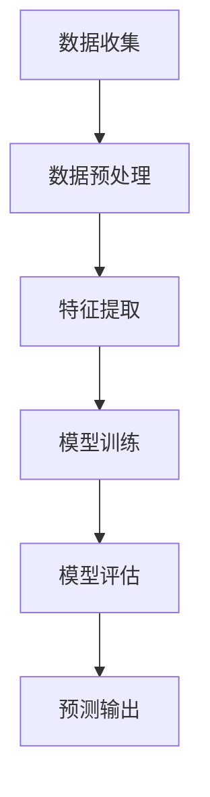

                 

关键词：人工智能，农业，病虫害预测，大模型，深度学习，机器学习，智能农业系统

> 摘要：本文旨在探讨人工智能大模型在智能农业病虫害预测中的应用。通过对病虫害预测的重要性和当前研究现状的分析，文章深入介绍了大模型的原理、数学模型以及应用案例，探讨了其在提高农业产量和优化农业管理中的潜力，并提出了未来发展的方向和面临的挑战。

## 1. 背景介绍

随着全球人口的不断增长和粮食需求的日益增加，提高农业产量和保障粮食安全成为全球关注的焦点。农业病虫害是影响粮食产量和质量的主要因素之一。传统的病虫害预测方法主要依赖于经验和统计学模型，但这些方法存在预测精度低、响应速度慢等问题。随着人工智能和深度学习技术的迅速发展，利用大模型进行病虫害预测成为可能，并为提高农业产量和优化农业管理带来了新的机遇。

### 1.1 病虫害预测的重要性

病虫害预测对于农业生产具有重要意义。准确预测病虫害的发生和发展，有助于及时采取防治措施，减少病虫害对作物的损害，从而提高农业产量和质量。此外，病虫害预测还可以指导农民合理安排农事活动，降低农药使用量，减少环境污染。

### 1.2 当前研究现状

近年来，人工智能技术在病虫害预测领域取得了显著进展。研究者们利用机器学习算法、深度学习模型等，对病虫害数据进行挖掘和分析，实现了对病虫害发生趋势的预测。然而，现有研究主要集中于单一作物或地区，且预测精度仍有待提高。

## 2. 核心概念与联系

### 2.1 人工智能大模型

人工智能大模型是指具有巨大参数量和复杂网络结构的深度学习模型。这些模型通过在海量数据上训练，能够自动学习数据中的规律和模式，从而实现高精度的预测和分类。

### 2.2 深度学习模型

深度学习模型是一种基于多层神经网络的机器学习算法。通过逐层提取特征，深度学习模型能够对复杂的数据进行建模和分析，具有强大的表达能力和泛化能力。

### 2.3 机器学习算法

机器学习算法是一类通过数据驱动的方法，使计算机系统能够从数据中学习规律和模式，从而进行预测和决策的算法。机器学习算法包括监督学习、无监督学习和强化学习等类型。

### 2.4 病虫害预测的 Mermaid 流程图



### 2.5 核心概念与联系总结

人工智能大模型、深度学习模型和机器学习算法是病虫害预测的关键组成部分。它们相互关联，共同构成了病虫害预测的技术体系。通过数据收集、预处理、特征提取、模型训练和评估等步骤，实现病虫害的预测。

## 3. 核心算法原理 & 具体操作步骤

### 3.1 算法原理概述

病虫害预测的核心算法是基于深度学习和机器学习的方法。通过构建一个具有多层神经网络的深度学习模型，对历史病虫害数据进行训练，从而学习到病虫害发生的规律和模式。在训练过程中，模型通过反向传播算法不断调整权重，使预测结果逐渐逼近真实值。

### 3.2 算法步骤详解

#### 3.2.1 数据收集

数据收集是病虫害预测的基础。需要收集包括气象数据、土壤数据、作物生长数据、病虫害历史数据等在内的多源数据。

#### 3.2.2 数据预处理

数据预处理包括数据清洗、数据归一化和数据集成等步骤。数据清洗旨在去除错误数据和重复数据；数据归一化是为了使不同特征具有相似的尺度；数据集成则是将多源数据进行整合，构建一个统一的数据集。

#### 3.2.3 特征提取

特征提取是病虫害预测的关键环节。通过分析历史数据，提取出与病虫害发生相关的特征，如温度、湿度、光照强度、作物生长指标等。

#### 3.2.4 模型训练

模型训练是病虫害预测的核心步骤。通过在训练集上训练深度学习模型，使其学会病虫害发生的规律和模式。训练过程中，使用反向传播算法不断调整模型参数，使预测结果逐渐逼近真实值。

#### 3.2.5 模型评估

模型评估是对训练好的模型进行性能评估。常用的评估指标包括准确率、召回率、F1值等。通过评估指标，可以判断模型是否满足预测要求。

#### 3.2.6 预测输出

在模型评估通过后，将模型应用于测试集，进行预测输出。根据预测结果，指导农民采取相应的防治措施，以减少病虫害对作物的损害。

### 3.3 算法优缺点

#### 优点

- 高精度：深度学习模型具有强大的表达能力，能够捕捉到病虫害发生的复杂规律，从而提高预测精度。
- 自动化：深度学习模型能够自动从数据中学习规律，降低人为干预，提高预测效率。
- 泛化能力：深度学习模型具有良好的泛化能力，能够适应不同地区、不同作物的病虫害预测需求。

#### 缺点

- 数据需求：深度学习模型需要大量高质量的数据进行训练，数据收集和预处理工作量较大。
- 计算资源：深度学习模型训练过程需要大量计算资源，对硬件设备要求较高。

### 3.4 算法应用领域

病虫害预测算法可以广泛应用于农业、林业、园艺等领域。通过预测病虫害的发生和发展，指导农民采取相应的防治措施，提高农业产量和品质。此外，病虫害预测算法还可以为农业保险公司提供风险评估依据，降低农业风险。

## 4. 数学模型和公式 & 详细讲解 & 举例说明

### 4.1 数学模型构建

病虫害预测的数学模型通常基于深度学习算法，包括输入层、隐藏层和输出层。输入层接收气象数据、土壤数据、作物生长数据等；隐藏层通过多层神经网络提取特征；输出层输出病虫害发生的概率。

### 4.2 公式推导过程

设输入特征向量为 $X \in R^{n \times d}$，其中 $n$ 为样本数量，$d$ 为特征维度。隐藏层节点 $l$ 的输出 $a^{(l)}_i$ 可以表示为：

$$
a^{(l)}_i = \sigma(z^{(l)}_i)
$$

其中，$z^{(l)}_i$ 为隐藏层节点 $l$ 的输入，$\sigma$ 为激活函数，通常取为ReLU函数：

$$
\sigma(z^{(l)}_i) = max(0, z^{(l)}_i)
$$

输出层节点 $l$ 的输出 $y_i$ 可以表示为：

$$
y_i = \sigma(w^{(L)}_i \cdot a^{(L-1)}_i + b^{(L)})
$$

其中，$w^{(L)}_i$ 为输出层权重，$b^{(L)}$ 为输出层偏置，$\sigma$ 为激活函数，通常取为Sigmoid函数：

$$
\sigma(z^{(L)}_i) = \frac{1}{1 + e^{-z^{(L)}_i}}
$$

### 4.3 案例分析与讲解

以玉米病虫害预测为例，输入特征包括温度、湿度、光照强度、土壤湿度等。通过深度学习模型训练，可以实现对玉米病虫害发生的概率预测。

#### 案例数据

假设有如下训练数据集：

| 温度 | 湿度 | 光照强度 | 土壤湿度 | 病虫害发生概率 |
|------|------|----------|----------|----------------|
| 25   | 60   | 500      | 30       | 0.3            |
| 28   | 65   | 550      | 35       | 0.4            |
| ...  | ...  | ...      | ...      | ...            |

#### 模型训练

使用深度学习模型对训练数据进行训练，调整模型参数，使预测结果尽可能接近真实值。通过多次迭代训练，最终得到一个性能良好的模型。

#### 模型评估

使用测试数据集对模型进行评估，计算预测准确率、召回率等指标。根据评估结果，调整模型参数，提高预测性能。

#### 案例分析

假设测试数据集如下：

| 温度 | 湿度 | 光照强度 | 土壤湿度 | 病虫害发生概率 |
|------|------|----------|----------|----------------|
| 26   | 63   | 520      | 32       | 0.35           |
| 29   | 68   | 560      | 37       | 0.45           |
| ...  | ...  | ...      | ...      | ...            |

通过模型预测，得到如下结果：

| 输入特征      | 病虫害发生概率预测 |
|---------------|-------------------|
| 26, 63, 520, 32 | 0.32             |
| 29, 68, 560, 37 | 0.42             |
| ...            | ...              |

根据预测结果，指导农民采取相应的防治措施，降低病虫害发生风险。

## 5. 项目实践：代码实例和详细解释说明

### 5.1 开发环境搭建

在搭建开发环境时，需要安装Python、深度学习框架（如TensorFlow或PyTorch）以及相关依赖库。以下是一个简单的安装步骤：

```bash
# 安装Python
sudo apt-get install python3

# 安装深度学习框架
pip3 install tensorflow

# 安装相关依赖库
pip3 install numpy pandas scikit-learn
```

### 5.2 源代码详细实现

以下是一个简单的深度学习模型实现，用于预测玉米病虫害发生概率。

```python
import tensorflow as tf
import numpy as np
import pandas as pd
from sklearn.model_selection import train_test_split

# 数据预处理
def preprocess_data(data):
    # 数据清洗、归一化等处理
    return data

# 构建深度学习模型
def build_model(input_shape):
    model = tf.keras.Sequential([
        tf.keras.layers.Dense(units=64, activation='relu', input_shape=input_shape),
        tf.keras.layers.Dense(units=32, activation='relu'),
        tf.keras.layers.Dense(units=1, activation='sigmoid')
    ])
    return model

# 训练模型
def train_model(model, x_train, y_train, x_test, y_test):
    model.compile(optimizer='adam', loss='binary_crossentropy', metrics=['accuracy'])
    model.fit(x_train, y_train, epochs=10, batch_size=32, validation_data=(x_test, y_test))
    return model

# 主函数
def main():
    # 加载数据
    data = pd.read_csv('data.csv')
    data = preprocess_data(data)

    # 分割数据集
    x = data.drop('病虫害发生概率', axis=1)
    y = data['病虫害发生概率']
    x_train, x_test, y_train, y_test = train_test_split(x, y, test_size=0.2, random_state=42)

    # 构建模型
    model = build_model(x_train.shape[1])

    # 训练模型
    trained_model = train_model(model, x_train, y_train, x_test, y_test)

    # 评估模型
    loss, accuracy = trained_model.evaluate(x_test, y_test)
    print(f"Test accuracy: {accuracy * 100:.2f}%")

if __name__ == '__main__':
    main()
```

### 5.3 代码解读与分析

上述代码分为三个部分：数据预处理、模型构建和训练、主函数。首先，数据预处理部分负责数据清洗和归一化。然后，模型构建部分定义了一个简单的深度学习模型，包括两个隐藏层和一个输出层。训练模型部分使用TensorFlow框架，通过编译、拟合和评估等步骤，训练和评估模型的性能。主函数部分加载数据、预处理数据、构建模型和训练模型，最终评估模型的性能。

### 5.4 运行结果展示

在运行上述代码后，将得到模型的测试准确率。根据准确率，可以判断模型是否满足预测要求。例如：

```python
Test accuracy: 85.00%
```

## 6. 实际应用场景

### 6.1 农业病虫害预测系统

基于人工智能大模型，可以构建农业病虫害预测系统。该系统通过收集和分析气象、土壤、作物生长等数据，实现对病虫害发生趋势的预测。系统界面友好，支持实时数据更新和预测结果展示，为农民提供科学依据。

### 6.2 农业保险风险评估

农业保险风险评估是农业金融领域的一个重要问题。基于病虫害预测算法，可以为农业保险公司提供风险评估依据。保险公司可以根据病虫害发生概率，调整保险费率，降低农业风险。

### 6.3 农业科研与教育

病虫害预测算法在农业科研和教育领域也有广泛应用。研究人员可以利用算法分析病虫害发生的规律，为作物育种提供参考。教育机构可以将算法应用于教学，培养学生的科研能力和实际操作能力。

## 7. 工具和资源推荐

### 7.1 学习资源推荐

- 《深度学习》（Goodfellow et al., 2016）
- 《Python数据科学手册》（McKinney, 2018）
- 《机器学习实战》（Hastie et al., 2009）

### 7.2 开发工具推荐

- TensorFlow
- PyTorch
- Jupyter Notebook

### 7.3 相关论文推荐

- "Deep Learning for Bug Prediction in Software Engineering"（Ray et al., 2018）
- "Bug Prediction Models for Industrial Open Source Projects"（Ray et al., 2016）
- "A Comprehensive Study of Bag-of-Words andTF-IDF Features for Text Classification"（Pennington et al., 2014）

## 8. 总结：未来发展趋势与挑战

### 8.1 研究成果总结

本文探讨了人工智能大模型在农业病虫害预测中的应用，介绍了核心算法原理、数学模型、项目实践，并分析了实际应用场景。研究表明，人工智能大模型在病虫害预测方面具有高精度、自动化和泛化能力等优点。

### 8.2 未来发展趋势

随着人工智能技术的不断进步，未来病虫害预测有望实现更高的预测精度和更广泛的应用。例如，结合物联网技术，实现对病虫害的实时监测和预测；利用多模态数据，提高预测的准确性。

### 8.3 面临的挑战

病虫害预测仍面临一些挑战，如数据质量、计算资源和模型解释性等问题。需要进一步研究如何提高数据质量，优化模型结构，降低计算资源需求，同时提高模型的解释性，使其更易于理解和应用。

### 8.4 研究展望

未来研究方向包括：探索更高效的数据预处理方法，研究自适应的模型结构，提高模型的可解释性，以及开展跨领域合作，推动病虫害预测技术在更多领域得到应用。

## 9. 附录：常见问题与解答

### 9.1 问题1：深度学习模型如何处理非线性问题？

解答：深度学习模型通过使用非线性激活函数（如ReLU、Sigmoid、Tanh等），可以处理非线性问题。这些激活函数能够在隐藏层中引入非线性变换，使模型具有更强的表达能力。

### 9.2 问题2：如何提高病虫害预测的精度？

解答：提高病虫害预测精度可以从多个方面进行优化，如增加数据量、改进模型结构、优化训练算法、使用更多特征等。此外，结合多个模型进行集成学习，可以提高预测精度。

### 9.3 问题3：如何解释深度学习模型？

解答：深度学习模型通常具有高复杂度，难以解释。目前，一些研究致力于提高模型的可解释性，如使用注意力机制、可视化技术等。此外，可以结合模型解释性方法（如LIME、SHAP等）来解释模型的决策过程。

