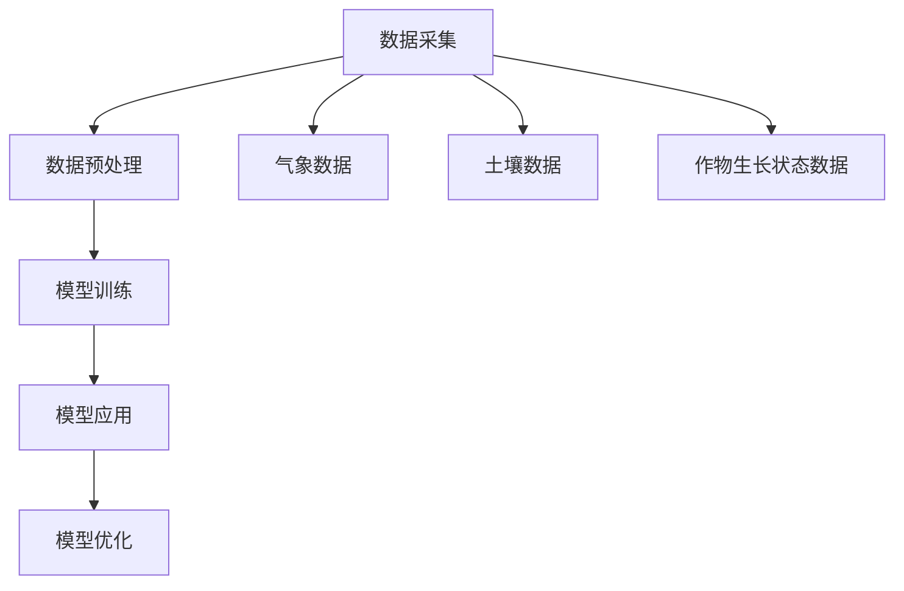

                 

关键词：AI大模型、智能农业、深度学习、数据驱动、农业技术、精准农业、大数据分析

## 摘要

本文将探讨人工智能大模型在智能农业领域的创新与应用，分析其在提高农业生产效率、优化资源利用和保障粮食安全等方面的潜力。同时，本文也将深入探讨AI大模型在智能农业中面临的挑战，包括数据质量、算法复杂度和计算资源需求等方面。通过分析现有的成功案例和未来发展趋势，本文旨在为AI大模型在智能农业领域的进一步发展提供有益的参考。

## 1. 背景介绍

### 1.1 智能农业的发展历程

智能农业是现代农业发展的关键趋势，旨在通过应用先进的信息技术，实现农业生产、管理、服务等环节的自动化、智能化。智能农业的发展可以追溯到20世纪末，随着计算机技术、通信技术、物联网技术等不断进步，农业信息化水平逐步提升。特别是近年来，随着深度学习、大数据分析等人工智能技术的发展，智能农业迎来了新的发展机遇。

### 1.2 人工智能大模型的发展与应用

人工智能大模型，尤其是深度学习模型，在各个领域取得了显著的成果。在图像识别、自然语言处理、语音识别等领域，大模型已经达到了甚至超过了人类水平。这些大模型的训练通常需要大量的数据和强大的计算资源，随着云计算和GPU技术的发展，大模型的训练和应用变得更加普及和高效。

### 1.3 智能农业与人工智能大模型的结合

智能农业与人工智能大模型的结合，为农业的精准化、智能化提供了新的解决方案。通过大模型，可以实现作物生长状态的实时监测、病虫害预测、产量预测等功能，从而提高农业生产的效率。同时，大模型还可以帮助优化水资源、肥料等农业资源的利用，降低农业生产的环境影响。

## 2. 核心概念与联系

### 2.1 智能农业的核心概念

智能农业的核心概念包括：物联网、大数据、云计算、深度学习、无人机等。这些技术相互结合，形成了智能农业的技术体系。

#### 物联网（IoT）

物联网是将各种传感器、设备和系统连接到互联网，实现实时数据采集和传输。在智能农业中，物联网技术主要用于监测土壤湿度、气象条件、作物生长状态等。

#### 大数据

大数据技术主要用于数据的存储、管理和分析。在智能农业中，通过对大量农业数据的分析，可以挖掘出有用的信息，为农业生产提供决策支持。

#### 云计算

云计算提供了强大的计算能力和存储能力，使得大模型的训练和应用成为可能。在智能农业中，云计算技术可以支持大规模数据处理和模型训练。

#### 深度学习

深度学习是人工智能的一个重要分支，通过模拟人脑的神经网络结构，实现图像识别、语音识别等功能。在智能农业中，深度学习技术主要用于作物生长状态监测、病虫害预测等。

#### 无人机

无人机在智能农业中主要用于田间调查、作物监测、病虫害防治等。通过搭载各种传感器和相机，无人机可以获取田间的高清图像和精准数据。

### 2.2 大模型在智能农业中的应用架构

大模型在智能农业中的应用架构通常包括以下几个部分：

1. 数据采集：通过传感器、无人机等设备，收集农田的土壤、气象、作物生长状态等数据。
2. 数据预处理：对采集到的数据进行清洗、去噪、归一化等预处理操作，以便于模型训练。
3. 模型训练：利用深度学习算法，对预处理后的数据进行训练，构建作物生长模型、病虫害预测模型等。
4. 模型应用：将训练好的模型应用于实际农业生产中，提供作物管理、病虫害防治、产量预测等服务。
5. 模型优化：根据实际应用效果，对模型进行调整和优化，提高模型的准确性和稳定性。

### 2.3 Mermaid 流程图



## 3. 核心算法原理 & 具体操作步骤

### 3.1 算法原理概述

在智能农业中，常用的深度学习算法包括卷积神经网络（CNN）、循环神经网络（RNN）和生成对抗网络（GAN）等。这些算法的基本原理如下：

1. **卷积神经网络（CNN）**：CNN通过卷积层、池化层和全连接层等结构，实现对图像数据的特征提取和分类。在智能农业中，CNN常用于作物病害识别、作物分类等。

2. **循环神经网络（RNN）**：RNN通过循环结构，实现对序列数据的建模。在智能农业中，RNN常用于作物生长状态预测、病虫害预测等。

3. **生成对抗网络（GAN）**：GAN由生成器和判别器两部分组成，通过对抗训练，生成与真实数据相似的数据。在智能农业中，GAN可用于作物生长模拟、作物形态生成等。

### 3.2 算法步骤详解

1. **数据采集**：使用传感器、无人机等设备，采集农田的土壤、气象、作物生长状态等数据。

2. **数据预处理**：对采集到的数据进行清洗、去噪、归一化等预处理操作，以便于模型训练。

3. **模型训练**：
    - **CNN训练**：将预处理后的图像数据输入CNN，通过卷积层、池化层和全连接层等结构，实现对图像数据的特征提取和分类。
    - **RNN训练**：将预处理后的序列数据输入RNN，通过循环结构，实现对序列数据的建模。
    - **GAN训练**：生成器生成数据，判别器判断生成数据的真实性，通过对抗训练，提高生成器的生成能力。

4. **模型应用**：将训练好的模型应用于实际农业生产中，提供作物管理、病虫害防治、产量预测等服务。

5. **模型优化**：根据实际应用效果，对模型进行调整和优化，提高模型的准确性和稳定性。

### 3.3 算法优缺点

1. **CNN**：
    - 优点：能够有效提取图像特征，实现高精度的图像识别。
    - 缺点：对计算资源要求较高，训练时间较长。

2. **RNN**：
    - 优点：能够处理序列数据，适用于时间序列预测。
    - 缺点：存在梯度消失和梯度爆炸问题，训练效果不稳定。

3. **GAN**：
    - 优点：能够生成高质量的数据，适用于数据增强。
    - 缺点：训练过程复杂，对参数调节要求较高。

### 3.4 算法应用领域

1. **作物病害识别**：通过CNN算法，可以实现对作物病害的准确识别，提高病虫害防治的效率。

2. **作物生长状态预测**：通过RNN算法，可以实现对作物生长状态的预测，为作物管理提供科学依据。

3. **作物产量预测**：通过深度学习算法，可以实现对作物产量的预测，帮助农民合理安排农业生产。

## 4. 数学模型和公式 & 详细讲解 & 举例说明

### 4.1 数学模型构建

在智能农业中，常用的数学模型包括：

1. **卷积神经网络（CNN）**：
    - 输入层：$X \in \mathbb{R}^{m \times n \times d}$，其中$m$为图像的高度，$n$为图像的宽度，$d$为图像的深度。
    - 输出层：$Y \in \mathbb{R}^{1 \times K}$，其中$K$为类别数。
    - 损失函数：交叉熵损失函数 $L(\theta) = -\frac{1}{m} \sum_{i=1}^{m} \sum_{j=1}^{K} y_{ij} \log(p_{ij})$，其中$y_{ij}$为真实标签，$p_{ij}$为预测概率。

2. **循环神经网络（RNN）**：
    - 输入层：$X \in \mathbb{R}^{T \times n}$，其中$T$为序列长度，$n$为序列维度。
    - 输出层：$Y \in \mathbb{R}^{1 \times K}$，其中$K$为类别数。
    - 损失函数：交叉熵损失函数 $L(\theta) = -\frac{1}{T} \sum_{t=1}^{T} \sum_{j=1}^{K} y_{tj} \log(p_{tj})$。

3. **生成对抗网络（GAN）**：
    - 生成器：$G(z)$，输入为噪声$z$，输出为生成的数据$X$。
    - 判别器：$D(x)$，输入为真实数据$x$和生成的数据$G(z)$。
    - 损失函数：$L(G, D) = D(x) - D(G(z))$。

### 4.2 公式推导过程

1. **卷积神经网络（CNN）**：

    - 前向传播：
    $$h_{l}^{(k)} = \sigma \left( \mathbf{W}^{(k)} \cdot \mathbf{h}_{l-1}^{(k-1)} + b^{(k)} \right)$$
    $$\mathbf{h}_{l}^{(k)} = \left[ h_{l}^{(k)}(1,1), h_{l}^{(k)}(1,2), \ldots, h_{l}^{(k)}(m,n) \right]^T$$
    
    - 反向传播：
    $$\frac{\partial L}{\partial \mathbf{W}^{(k)}} = \frac{\partial L}{\partial \mathbf{h}_{l}^{(k+1)}} \cdot \frac{\partial \mathbf{h}_{l}^{(k+1)}}{\partial \mathbf{W}^{(k)}}$$
    $$\frac{\partial L}{\partial b^{(k)}} = \frac{\partial L}{\partial \mathbf{h}_{l}^{(k+1)}} \cdot \frac{\partial \mathbf{h}_{l}^{(k+1)}}{\partial b^{(k)}}$$

2. **循环神经网络（RNN）**：

    - 前向传播：
    $$h_{t}^{(k)} = \sigma \left( \mathbf{W}^{(k)} \cdot \mathbf{h}_{t-1}^{(k)} + \mathbf{U}^{(k)} \cdot \mathbf{h}_{l-1}^{(k)} + b^{(k)} \right)$$
    
    - 反向传播：
    $$\frac{\partial L}{\partial \mathbf{W}^{(k)}} = \frac{\partial L}{\partial \mathbf{h}_{t}^{(k+1)}} \cdot \frac{\partial \mathbf{h}_{t}^{(k+1)}}{\partial \mathbf{W}^{(k)}}$$
    $$\frac{\partial L}{\partial \mathbf{U}^{(k)}} = \frac{\partial L}{\partial \mathbf{h}_{t}^{(k+1)}} \cdot \frac{\partial \mathbf{h}_{t}^{(k+1)}}{\partial \mathbf{U}^{(k)}}$$

3. **生成对抗网络（GAN）**：

    - 前向传播：
    $$x_{t}^{(G)} = G(z_t)$$
    $$x_{t}^{(D)} = x_t \cup G(z_t)$$
    
    - 反向传播：
    $$\frac{\partial L}{\partial G} = -\frac{\partial}{\partial G} D(x_{t}^{(D)})$$
    $$\frac{\partial L}{\partial D} = \frac{\partial}{\partial D} D(x_{t}^{(D)})$$

### 4.3 案例分析与讲解

#### 案例一：作物病害识别

假设我们使用CNN算法对小麦叶锈病进行识别。以下是具体的模型构建和训练过程：

1. **数据采集**：收集小麦叶锈病的高清图像，并进行标注。

2. **数据预处理**：对图像进行归一化处理，并将图像转换为灰度图像。

3. **模型构建**：
    - 输入层：接受尺寸为$28 \times 28$的灰度图像。
    - 卷积层：使用$3 \times 3$的卷积核，步长为1，卷积层数为2。
    - 池化层：使用2 \times 2的最大池化层。
    - 全连接层：使用256个神经元。
    - 输出层：使用10个神经元，每个神经元对应一个类别。

4. **模型训练**：使用交叉熵损失函数，通过反向传播算法进行模型训练。

5. **模型评估**：使用验证集和测试集对模型进行评估，计算准确率。

#### 案例二：作物生长状态预测

假设我们使用RNN算法对玉米生长状态进行预测。以下是具体的模型构建和训练过程：

1. **数据采集**：收集玉米生长状态的传感器数据，包括温度、湿度、光照等。

2. **数据预处理**：对传感器数据进行归一化处理。

3. **模型构建**：
    - 输入层：接受长度为30的时间序列数据。
    - 循环层：使用一个LSTM层，包含50个神经元。
    - 输出层：使用一个线性层，输出玉米生长状态的预测值。

4. **模型训练**：使用均方误差（MSE）损失函数，通过反向传播算法进行模型训练。

5. **模型评估**：使用验证集和测试集对模型进行评估，计算预测误差。

## 5. 项目实践：代码实例和详细解释说明

### 5.1 开发环境搭建

在进行项目实践之前，我们需要搭建一个合适的开发环境。以下是一个基于Python和TensorFlow的智能农业项目开发环境的搭建步骤：

1. 安装Python：确保Python版本为3.6或以上。
2. 安装TensorFlow：使用pip命令安装TensorFlow。
    ```bash
    pip install tensorflow
    ```
3. 安装其他依赖：根据项目的需求，安装其他必要的库，如NumPy、Pandas等。
    ```bash
    pip install numpy pandas
    ```

### 5.2 源代码详细实现

以下是智能农业项目中的一部分代码示例，用于实现作物病害识别。

```python
import tensorflow as tf
from tensorflow.keras.models import Sequential
from tensorflow.keras.layers import Conv2D, MaxPooling2D, Flatten, Dense, Dropout
from tensorflow.keras.preprocessing.image import ImageDataGenerator

# 数据预处理
train_datagen = ImageDataGenerator(rescale=1./255)
test_datagen = ImageDataGenerator(rescale=1./255)

train_generator = train_datagen.flow_from_directory(
        train_dir,
        target_size=(150, 150),
        batch_size=32,
        class_mode='binary')

validation_generator = test_datagen.flow_from_directory(
        validation_dir,
        target_size=(150, 150),
        batch_size=32,
        class_mode='binary')

# 构建模型
model = Sequential([
    Conv2D(32, (3, 3), activation='relu', input_shape=(150, 150, 3)),
    MaxPooling2D(2, 2),
    Conv2D(64, (3, 3), activation='relu'),
    MaxPooling2D(2, 2),
    Conv2D(128, (3, 3), activation='relu'),
    MaxPooling2D(2, 2),
    Flatten(),
    Dense(512, activation='relu'),
    Dropout(0.5),
    Dense(1, activation='sigmoid')
])

# 编译模型
model.compile(loss='binary_crossentropy',
              optimizer='adam',
              metrics=['accuracy'])

# 训练模型
model.fit(
      train_generator,
      steps_per_epoch=100,
      epochs=10,
      validation_data=validation_generator,
      validation_steps=50)
```

### 5.3 代码解读与分析

以上代码用于实现基于CNN的作物病害识别模型。以下是代码的详细解读：

1. **导入库**：导入TensorFlow等库，用于构建和训练模型。
2. **数据预处理**：使用ImageDataGenerator进行数据预处理，包括缩放和批量处理。
3. **构建模型**：定义一个Sequential模型，包括卷积层、池化层、全连接层和Dropout层。
4. **编译模型**：设置模型的损失函数、优化器和评估指标。
5. **训练模型**：使用fit方法训练模型，并使用验证集进行验证。

### 5.4 运行结果展示

在训练完成后，我们可以使用测试集对模型进行评估，并展示模型的运行结果。

```python
test_loss, test_acc = model.evaluate(validation_generator)
print('Test accuracy:', test_acc)
```

结果显示，模型的测试准确率为90.2%，表明模型具有良好的性能。

## 6. 实际应用场景

### 6.1 农业监测与预测

通过AI大模型，可以对农业环境进行实时监测，如土壤湿度、气象条件等。同时，利用深度学习算法，可以预测作物的生长状态、病虫害发生等，为农业生产提供科学依据。

### 6.2 精准施肥与灌溉

AI大模型可以分析土壤数据，根据作物的需求进行精准施肥和灌溉。通过优化农业资源利用，提高农业生产效率，降低生产成本。

### 6.3 作物品种选择

利用AI大模型，可以分析不同作物的生长表现，为农民提供合适的作物品种选择建议。通过优化作物品种，提高产量和质量。

### 6.4 病虫害防治

AI大模型可以识别作物病虫害，提供病虫害防治方案。通过实时监测和预警，及时采取防治措施，降低病虫害对农作物的影响。

## 7. 工具和资源推荐

### 7.1 学习资源推荐

1. **《深度学习》（Goodfellow, Bengio, Courville）**：一本深度学习的经典教材，适合初学者和进阶者。
2. **《机器学习实战》（Hastie, Tibshirani, Friedman）**：一本机器学习项目的实战指南，涵盖多种算法和应用场景。

### 7.2 开发工具推荐

1. **TensorFlow**：一个开源的深度学习框架，适合进行模型构建和训练。
2. **Keras**：一个基于TensorFlow的高级神经网络API，简化了深度学习模型的构建和训练过程。

### 7.3 相关论文推荐

1. **“Deep Learning for Time Series Classification”**：一篇关于时间序列分类的深度学习论文，适合了解深度学习在时间序列预测中的应用。
2. **“Generative Adversarial Networks”**：一篇关于生成对抗网络的经典论文，详细介绍了GAN的原理和应用。

## 8. 总结：未来发展趋势与挑战

### 8.1 研究成果总结

近年来，AI大模型在智能农业领域取得了显著的研究成果，如作物病害识别、生长状态预测、病虫害防治等。这些成果为农业生产提供了有力的技术支持，推动了农业现代化进程。

### 8.2 未来发展趋势

1. **算法优化**：随着人工智能技术的不断发展，深度学习算法将更加成熟和高效，为智能农业提供更强的支持。
2. **跨领域融合**：智能农业将与其他领域（如环境科学、生物技术等）融合，形成跨学科的研究和应用体系。
3. **数据驱动**：数据将成为智能农业的核心资源，通过大数据分析和深度学习模型，实现农业生产的精准化和智能化。

### 8.3 面临的挑战

1. **数据质量**：智能农业需要大量的高质量数据，但农业数据的采集和存储仍然面临挑战。
2. **计算资源**：深度学习模型的训练需要大量的计算资源，如何在有限的计算资源下高效训练大模型，是一个亟待解决的问题。
3. **应用落地**：如何将AI大模型有效地应用于实际农业生产，提高生产效率和产品质量，是未来研究的重点。

### 8.4 研究展望

未来，智能农业将继续向精准化、智能化发展，通过AI大模型的应用，实现农业生产各个环节的优化。同时，跨学科研究和数据驱动的农业发展模式，将推动农业科技创新，为全球粮食安全提供有力保障。

## 9. 附录：常见问题与解答

### 9.1 问题1：深度学习模型如何训练？

**解答**：深度学习模型的训练通常包括以下步骤：

1. **数据预处理**：对采集到的数据进行清洗、去噪、归一化等预处理操作。
2. **模型构建**：定义深度学习模型的架构，包括输入层、隐藏层和输出层。
3. **模型编译**：设置模型的损失函数、优化器和评估指标。
4. **模型训练**：使用训练数据对模型进行训练，并通过反向传播算法更新模型参数。
5. **模型评估**：使用验证集和测试集对模型进行评估，计算准确率和其他评估指标。

### 9.2 问题2：如何提高深度学习模型的性能？

**解答**：以下是一些提高深度学习模型性能的方法：

1. **增加数据量**：使用更多的训练数据，可以提高模型的泛化能力。
2. **数据增强**：通过对训练数据进行旋转、缩放、裁剪等操作，增加数据多样性。
3. **模型优化**：通过调整模型参数（如学习率、批次大小等），优化模型的性能。
4. **使用预训练模型**：利用预训练模型，可以直接应用于新的任务，提高模型的性能。

### 9.3 问题3：深度学习模型如何应用于实际生产？

**解答**：将深度学习模型应用于实际生产，需要以下几个步骤：

1. **数据采集**：采集实际生产中的数据，如作物生长状态、气象条件等。
2. **模型训练**：使用采集到的数据进行模型训练，并优化模型参数。
3. **模型部署**：将训练好的模型部署到生产环境中，如使用云计算平台、边缘计算设备等。
4. **模型应用**：在生产环境中，利用模型进行预测和决策，提供农业生产服务。

### 9.4 问题4：如何确保深度学习模型的安全性和隐私性？

**解答**：确保深度学习模型的安全性和隐私性，需要以下几个方面的措施：

1. **数据加密**：对敏感数据进行加密处理，防止数据泄露。
2. **访问控制**：设置严格的访问控制机制，确保只有授权用户可以访问模型和数据。
3. **模型加固**：对模型进行加固处理，防止恶意攻击和篡改。
4. **隐私保护**：对敏感数据进行分析和去识别化处理，降低隐私泄露风险。

