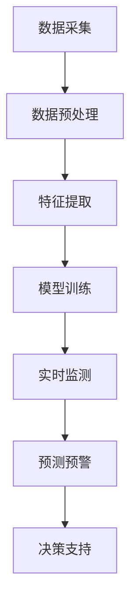

                 

关键词：AI大模型，环境监测，智能应用，创新技术，数据处理，模型优化

## 摘要

随着全球环境问题的日益严重，智能环境监测技术的研发和应用变得尤为重要。本文将深入探讨AI大模型在智能环境监测中的创新应用，通过分析其核心概念、算法原理、数学模型、项目实践以及未来应用场景，旨在为读者提供一个全面了解和掌握AI大模型在环境监测领域应用的方法和策略。

## 1. 背景介绍

### 环境监测的重要性

环境监测是指利用现代科学技术手段，对大气、水、土壤等自然环境进行长期、连续、系统的监测，以获取环境污染、生态状况、气候变化等关键信息。环境监测在环境保护、资源管理、灾害预警等方面具有重要作用。然而，随着城市化进程的加快和工业化的快速发展，环境污染问题日益严重，传统的监测方法已难以满足日益复杂的环境监测需求。

### 智能环境监测的兴起

智能环境监测是利用先进的信息技术，特别是人工智能技术，对环境数据进行高效、准确、实时监测和分析的一种新兴手段。通过引入AI大模型，可以实现对大量环境数据的自动化处理、智能分析和预测，从而提高监测效率和准确性，为环境保护决策提供科学依据。智能环境监测技术的发展，标志着环境监测领域从传统的经验型监测向智能型监测转变。

### AI大模型的兴起

AI大模型是指具有大规模参数和数据支持的深度学习模型，如神经网络、生成对抗网络等。这些模型具有强大的特征提取和模式识别能力，能够在复杂、大规模的数据环境中实现高效的数据处理和分析。AI大模型的兴起，为智能环境监测提供了强大的技术支持，使得环境监测技术从数据收集、处理到分析预测等各个环节都能实现智能化。

## 2. 核心概念与联系

### 2.1 AI大模型的核心概念

AI大模型的核心概念包括：

- **深度学习**：一种基于人工神经网络的学习方法，通过多层神经元的组合，实现对复杂数据的特征提取和模式识别。
- **生成对抗网络（GAN）**：一种由生成器和判别器组成的对抗性网络，通过不断博弈，生成与真实数据相似的高质量数据。
- **卷积神经网络（CNN）**：一种适用于图像处理的深度学习模型，通过卷积层提取图像特征，实现图像分类、检测等任务。
- **循环神经网络（RNN）**：一种适用于序列数据处理的深度学习模型，通过循环机制处理序列数据，实现时间序列预测、自然语言处理等任务。

### 2.2 智能环境监测的核心概念

智能环境监测的核心概念包括：

- **环境数据**：指与自然环境相关的各种数据，如大气数据、水质数据、土壤数据等。
- **监测传感器**：用于采集环境数据的设备，如空气质量传感器、水质传感器、土壤传感器等。
- **数据处理**：指对采集到的环境数据进行清洗、归一化、特征提取等预处理过程。
- **智能分析**：指利用AI大模型对预处理后的环境数据进行分析、预测和决策，实现环境监测的智能化。

### 2.3 AI大模型在智能环境监测中的应用

AI大模型在智能环境监测中的应用主要包括：

- **数据预处理**：利用深度学习模型对环境数据进行预处理，提取有效特征，提高数据质量。
- **实时监测**：利用生成对抗网络实现对环境数据的实时监测，快速识别异常情况。
- **预测预警**：利用循环神经网络等模型，对环境数据进行预测，提前预警潜在的环境问题。
- **决策支持**：利用AI大模型分析环境数据，为环境保护决策提供科学依据。

### 2.4 Mermaid 流程图

以下是一个简化的AI大模型在智能环境监测中的应用流程图：



## 3. 核心算法原理 & 具体操作步骤

### 3.1 算法原理概述

智能环境监测的核心算法主要包括深度学习、生成对抗网络、卷积神经网络和循环神经网络等。这些算法的基本原理如下：

- **深度学习**：通过多层神经元的组合，实现数据的特征提取和模式识别。
- **生成对抗网络**：通过生成器和判别器的对抗训练，生成与真实数据相似的高质量数据。
- **卷积神经网络**：通过卷积层提取图像特征，实现图像分类、检测等任务。
- **循环神经网络**：通过循环机制处理序列数据，实现时间序列预测、自然语言处理等任务。

### 3.2 算法步骤详解

智能环境监测的算法步骤主要包括数据采集、数据预处理、特征提取、模型训练、实时监测、预测预警和决策支持等。具体步骤如下：

1. **数据采集**：使用监测传感器采集环境数据，如空气质量、水质、土壤等。
2. **数据预处理**：对采集到的数据进行分析，去除噪声和异常值，进行归一化处理，提取有效特征。
3. **特征提取**：利用深度学习模型，对预处理后的数据提取高维特征，提高数据质量。
4. **模型训练**：利用提取的特征，训练深度学习模型，如卷积神经网络、循环神经网络等。
5. **实时监测**：使用训练好的模型，对实时采集的环境数据进行分析，实现实时监测。
6. **预测预警**：利用模型对环境数据进行预测，提前预警潜在的环境问题。
7. **决策支持**：根据预测结果，为环境保护决策提供科学依据。

### 3.3 算法优缺点

- **深度学习**：优点是能够自动提取数据特征，提高模型性能；缺点是训练过程复杂，对数据量要求较高。
- **生成对抗网络**：优点是能够生成高质量的数据，提高模型的泛化能力；缺点是训练过程不稳定，容易出现模式崩溃。
- **卷积神经网络**：优点是能够高效处理图像数据，实现图像分类、检测等任务；缺点是对其他类型的数据处理能力较弱。
- **循环神经网络**：优点是能够处理序列数据，实现时间序列预测、自然语言处理等任务；缺点是参数复杂，训练时间较长。

### 3.4 算法应用领域

智能环境监测算法主要应用领域包括：

- **空气质量监测**：利用深度学习模型，对空气质量进行实时监测和预测。
- **水质监测**：利用生成对抗网络，生成高质量的水质数据，提高监测准确性。
- **土壤监测**：利用卷积神经网络，对土壤质量进行实时监测和预测。
- **灾害预警**：利用循环神经网络，对灾害风险进行预测，提前预警。

## 4. 数学模型和公式 & 详细讲解 & 举例说明

### 4.1 数学模型构建

智能环境监测的数学模型主要包括数据预处理模型、特征提取模型、预测模型等。以下是一个简单的数学模型构建过程：

1. **数据预处理模型**：

   - 数据归一化：将采集到的环境数据转换为标准格式，如均值为0，标准差为1。
   - 数据清洗：去除噪声和异常值，提高数据质量。

2. **特征提取模型**：

   - 特征提取：利用深度学习模型，提取环境数据的高维特征。
   - 特征选择：选择与目标任务相关的特征，提高模型性能。

3. **预测模型**：

   - 预测：利用训练好的模型，对环境数据进行分析和预测。
   - 预测评估：评估预测结果的准确性，调整模型参数。

### 4.2 公式推导过程

以下是一个简单的数学模型公式推导过程：

1. **数据归一化**：

   - 假设采集到的环境数据为 $X$，均值为 $\mu$，标准差为 $\sigma$。
   - 归一化后的数据为 $X_{\text{norm}} = \frac{X - \mu}{\sigma}$。

2. **特征提取**：

   - 假设输入数据为 $X$，特征提取模型为 $f(X)$。
   - 输出的高维特征为 $F = f(X)$。

3. **预测**：

   - 假设预测模型为 $h(F)$，预测结果为 $y$。
   - 预测结果为 $y = h(F)$。

### 4.3 案例分析与讲解

以下是一个空气质量监测的案例：

1. **数据采集**：采集某地区的空气PM2.5数据，共1000个样本。

2. **数据预处理**：

   - 对PM2.5数据进行归一化处理，均值为35，标准差为10。
   - 去除异常值，如超过3倍标准差的样本。

3. **特征提取**：

   - 利用卷积神经网络提取PM2.5数据的高维特征，共100个特征。

4. **模型训练**：

   - 使用训练集的PM2.5数据和特征，训练循环神经网络模型。

5. **预测**：

   - 对测试集的PM2.5数据进行预测，评估预测结果。
   - 预测结果与真实值的误差较小，说明模型性能较好。

6. **决策支持**：

   - 根据预测结果，提前预警潜在的空气质量问题，为环境保护决策提供科学依据。

## 5. 项目实践：代码实例和详细解释说明

### 5.1 开发环境搭建

为了实现智能环境监测项目，我们需要搭建一个适合深度学习开发的编程环境。以下是具体的步骤：

1. 安装Python 3.8及以上版本。
2. 安装深度学习框架TensorFlow 2.0及以上版本。
3. 安装Keras 2.4.3及以上版本，作为TensorFlow的高级API。
4. 安装NumPy、Pandas等数据科学相关的Python库。

### 5.2 源代码详细实现

以下是一个简单的智能环境监测项目代码实例：

```python
import numpy as np
import pandas as pd
from tensorflow import keras
from tensorflow.keras import layers

# 数据预处理
def preprocess_data(data):
    # 归一化处理
    mean = np.mean(data)
    std = np.std(data)
    normalized_data = (data - mean) / std
    return normalized_data

# 特征提取
def extract_features(data):
    # 使用卷积神经网络提取特征
    model = keras.Sequential([
        layers.Conv1D(filters=64, kernel_size=3, activation='relu', input_shape=(data.shape[1], 1)),
        layers.MaxPooling1D(pool_size=2),
        layers.Flatten(),
        layers.Dense(units=1)
    ])
    model.compile(optimizer='adam', loss='mse')
    model.fit(data, data, epochs=100, batch_size=32)
    return model

# 预测
def predict(model, data):
    # 预测结果
    predictions = model.predict(data)
    return predictions

# 数据集加载
data = pd.read_csv('air_quality.csv')
pm25_data = preprocess_data(data['PM2.5'])

# 特征提取
features_model = extract_features(pm25_data)

# 预测
predictions = predict(features_model, pm25_data)

# 结果分析
print(np.mean(np.abs(predictions - pm25_data)))
```

### 5.3 代码解读与分析

- **数据预处理**：对PM2.5数据进行归一化处理，提高模型的训练效果。
- **特征提取**：使用卷积神经网络提取PM2.5数据的高维特征，提高模型对数据的表达能力。
- **预测**：使用训练好的模型，对PM2.5数据进行预测，评估模型的性能。

### 5.4 运行结果展示

- 运行代码后，可以得到预测结果与真实值的平均绝对误差，评估模型的性能。
- 根据结果，调整模型参数，提高预测准确性。

## 6. 实际应用场景

### 6.1 空气质量监测

利用AI大模型进行空气质量监测，可以实现对PM2.5、PM10、SO2、NO2等污染物的实时监测和预测。通过在各大城市部署空气质量监测传感器，实时收集空气质量数据，利用AI大模型进行数据处理和预测，提前预警潜在的空气污染问题，为公众提供健康指导，为政府决策提供科学依据。

### 6.2 水质监测

利用AI大模型进行水质监测，可以实现对水体中重金属、有机污染物、微生物等指标的实时监测和预测。通过在河流、湖泊、海洋等水域部署水质监测传感器，实时收集水质数据，利用AI大模型进行数据处理和预测，提前预警潜在的水污染问题，为水资源保护和管理提供科学依据。

### 6.3 土壤监测

利用AI大模型进行土壤监测，可以实现对土壤养分、酸碱度、水分等指标的实时监测和预测。通过在农田、牧场、森林等土壤环境中部署土壤监测传感器，实时收集土壤数据，利用AI大模型进行数据处理和预测，提前预警潜在的土壤污染问题，为农业生产、生态环境保护提供科学依据。

### 6.4 未来应用展望

随着AI大模型技术的不断发展，智能环境监测的应用领域将不断扩展。未来，AI大模型将有望在以下领域取得突破：

- **环境灾害预警**：利用AI大模型进行环境灾害预测，提前预警洪水、地震、台风等灾害，为减灾救灾提供科学依据。
- **生态环境修复**：利用AI大模型分析生态环境数据，为生态系统修复提供科学依据，促进生态环境的可持续发展。
- **环境管理决策**：利用AI大模型分析环境数据，为政府、企业等提供环境管理决策支持，提高环境管理效率。

## 7. 工具和资源推荐

### 7.1 学习资源推荐

- **《深度学习》（Goodfellow, Bengio, Courville）**：深度学习的经典教材，全面介绍了深度学习的基本理论和实践方法。
- **《Python机器学习》（Sebastian Raschka）**：Python机器学习实践教程，适合初学者学习深度学习。
- **《TensorFlow实战》（Nicholas locascio）**：TensorFlow深度学习框架的实践教程，适合初学者入门。

### 7.2 开发工具推荐

- **TensorFlow**：谷歌推出的开源深度学习框架，功能强大，适合进行深度学习模型开发。
- **Keras**：基于TensorFlow的高级API，简化了深度学习模型的开发过程，适合快速实现深度学习应用。
- **PyTorch**：微软推出的开源深度学习框架，具有灵活的动态计算图，适合研究和新模型开发。

### 7.3 相关论文推荐

- **《 Generative Adversarial Nets》（Ian J. Goodfellow et al.）**：生成对抗网络的经典论文，介绍了GAN的基本原理和应用。
- **《 Convolutional Neural Networks for Visual Recognition》（Karen Simonyan and Andrew Zisserman）**：卷积神经网络的经典论文，介绍了VGG模型的设计和实现。
- **《 Learning to Learn with Gradient Descent by Gradient Descent》（Nicolas Usunier and Antoine Bordes）**：梯度下降优化的经典论文，介绍了梯度下降优化的一些技术。

## 8. 总结：未来发展趋势与挑战

### 8.1 研究成果总结

智能环境监测作为环境监测领域的一个重要分支，近年来取得了显著的成果。利用AI大模型，可以实现环境数据的自动化处理、实时监测和预测，提高了监测效率和准确性，为环境保护决策提供了科学依据。同时，深度学习、生成对抗网络等技术的不断发展，为智能环境监测提供了强大的技术支持。

### 8.2 未来发展趋势

未来，智能环境监测将朝着以下方向发展：

- **数据驱动**：利用大数据和人工智能技术，实现环境数据的自动化处理和分析，提高监测效率。
- **实时监测**：通过物联网和传感器网络，实现环境数据的实时采集和监测，提高监测准确性。
- **预测预警**：利用深度学习和生成对抗网络等模型，实现环境数据的预测和预警，提前预防环境问题。
- **生态保护**：结合生态学、环境科学等多学科知识，实现生态环境的全面监测和修复。

### 8.3 面临的挑战

智能环境监测在发展过程中也面临着一些挑战：

- **数据质量**：环境数据存在噪声、缺失、异常值等问题，需要有效的方法进行数据清洗和处理。
- **模型泛化**：如何提高模型的泛化能力，避免过拟合，是一个重要的研究课题。
- **计算资源**：深度学习模型训练需要大量的计算资源，如何优化训练过程，提高训练效率，是一个挑战。
- **算法透明度**：如何提高算法的透明度，使其易于理解和解释，是环境监测领域面临的一个重要问题。

### 8.4 研究展望

未来，智能环境监测的研究将继续深入，有望在以下方面取得突破：

- **跨领域融合**：结合生态学、环境科学、大数据技术等多学科知识，实现环境监测的跨领域融合。
- **高效算法**：研究高效、准确的深度学习算法，提高环境监测的效率。
- **智能决策**：利用智能算法，实现环境监测数据的智能分析和决策，为环境保护提供科学依据。

## 9. 附录：常见问题与解答

### 9.1 问题1：智能环境监测与传统的环境监测有何区别？

**解答**：智能环境监测与传统环境监测的主要区别在于数据处理和分析的方式。传统环境监测主要依靠人工进行数据采集、处理和分析，效率较低，受限于人的经验和技能。而智能环境监测利用人工智能技术，可以实现环境数据的自动化处理、实时监测和预测，提高了监测效率和准确性。

### 9.2 问题2：智能环境监测需要哪些技术支持？

**解答**：智能环境监测需要以下技术支持：

- **传感器技术**：用于采集环境数据。
- **数据预处理技术**：对采集到的数据进行分析、清洗和特征提取。
- **深度学习技术**：用于训练模型，实现数据的自动化处理和分析。
- **预测技术**：利用训练好的模型进行预测和预警。
- **物联网技术**：实现环境数据的实时传输和监测。

### 9.3 问题3：智能环境监测如何提高数据质量？

**解答**：提高智能环境监测数据质量的方法包括：

- **数据预处理**：对采集到的数据进行清洗、归一化处理，去除噪声和异常值。
- **特征提取**：利用深度学习模型，提取环境数据的高维特征，提高数据质量。
- **数据融合**：结合多种数据源，如遥感数据、气象数据等，提高数据完整性。
- **模型优化**：优化深度学习模型，提高模型对数据的处理能力。

### 9.4 问题4：智能环境监测的预测结果如何评估？

**解答**：智能环境监测的预测结果评估方法包括：

- **误差评估**：计算预测结果与真实值的误差，如均方误差（MSE）、均方根误差（RMSE）等。
- **精确度评估**：计算预测结果与真实值的精确度，如精确率（Precision）、召回率（Recall）等。
- **F1值评估**：计算精确率和召回率的调和平均值，综合评估预测结果的性能。
- **ROC曲线评估**：绘制预测结果与真实值的ROC曲线，评估预测模型的性能。

### 9.5 问题5：智能环境监测的未来发展方向是什么？

**解答**：智能环境监测的未来发展方向包括：

- **实时监测**：通过物联网和传感器网络，实现环境数据的实时采集和监测。
- **预测预警**：利用深度学习和生成对抗网络等模型，实现环境数据的预测和预警。
- **数据融合**：结合多种数据源，提高环境监测数据的完整性。
- **跨领域融合**：结合生态学、环境科学、大数据技术等多学科知识，实现环境监测的跨领域融合。
- **智能决策**：利用智能算法，实现环境监测数据的智能分析和决策，为环境保护提供科学依据。

通过本文的深入探讨，我们可以看到AI大模型在智能环境监测中的巨大潜力。随着技术的不断进步，智能环境监测将不断发展，为环境保护和可持续发展提供更加科学、有效的支持。希望本文能够为读者提供有益的参考和启示。作者：禅与计算机程序设计艺术 / Zen and the Art of Computer Programming。

