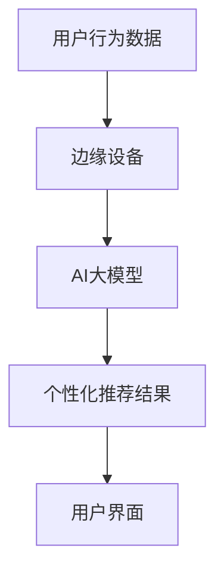

                 

关键词：人工智能、电商推荐系统、边缘计算、大模型、实时个性化推荐

摘要：本文探讨了人工智能大模型在电商实时个性化推荐中的应用，以及如何通过边缘计算技术提升推荐系统的响应速度和用户体验。文章介绍了核心概念、算法原理、数学模型、实践案例，并分析了其应用场景及未来发展趋势。

## 1. 背景介绍

随着互联网的普及和电商行业的快速发展，个性化推荐系统已经成为电商平台吸引和留住用户的关键因素。传统的推荐系统大多基于中心化的架构，依赖于云计算资源，但由于数据量庞大和处理需求复杂，经常导致响应延迟。为了解决这一问题，边缘计算技术应运而生，它将计算、存储和网络能力下沉到网络边缘，从而实现低延迟、高效能的计算服务。

AI大模型，尤其是基于深度学习的模型，近年来在各个领域取得了显著的成果。这些模型通过训练大量的数据，能够自动提取复杂的特征，并在多种任务中表现出色。在电商推荐系统中，AI大模型可以用来预测用户的兴趣和行为，从而实现更加精准的个性化推荐。

## 2. 核心概念与联系

### 2.1. 边缘计算

边缘计算是指将数据处理、分析和存储等计算任务从云端转移到网络边缘，即在接近数据源的设备上执行。这有助于减少数据传输延迟，提高系统的响应速度，增强用户体验。

### 2.2. 电商实时个性化推荐

电商实时个性化推荐是指根据用户的历史行为、兴趣偏好和其他相关信息，实时地为其推荐相关的商品或服务。实时性是此类推荐系统的关键，因为它需要在用户做出决策的瞬间提供有用的信息。

### 2.3. 大模型

大模型是指具有数百万甚至数十亿参数的深度学习模型。这些模型可以通过训练大量的数据来提取复杂的特征，并具有强大的预测能力。

### 2.4. 边缘计算与电商推荐系统的联系

边缘计算和电商推荐系统的结合可以显著提高推荐系统的实时性和准确性。通过在边缘设备上部署AI大模型，可以实现在用户设备附近进行实时数据处理和推荐，从而大大降低延迟，提高用户体验。

### 2.5. Mermaid 流程图



## 3. 核心算法原理 & 具体操作步骤

### 3.1. 算法原理概述

电商实时个性化推荐系统中的核心算法通常是基于协同过滤、内容推荐和深度学习等方法的组合。其中，AI大模型主要用于提取高维特征和进行复杂预测。

### 3.2. 算法步骤详解

1. **数据采集**：从用户的历史行为、搜索记录、购买历史等多渠道收集数据。
2. **数据预处理**：对采集到的数据进行清洗、归一化等处理，以便于模型训练。
3. **特征提取**：使用AI大模型提取高维特征，如用户画像、商品属性等。
4. **模型训练**：利用提取的特征训练推荐模型，如基于深度学习的推荐模型。
5. **实时预测**：在用户行为发生时，模型实时预测用户的兴趣和行为。
6. **生成推荐**：根据预测结果生成个性化推荐列表，并实时推送给用户。
7. **用户反馈**：收集用户对推荐结果的评价，用于模型优化。

### 3.3. 算法优缺点

**优点**：
- **实时性**：通过边缘计算，实现快速响应，提升用户体验。
- **个性化**：大模型能够提取复杂特征，实现精准推荐。
- **高效性**：分布式计算架构，提高系统处理能力。

**缺点**：
- **计算资源要求高**：大模型训练和部署需要大量计算资源。
- **数据隐私**：边缘计算涉及大量用户数据，需确保数据安全。

### 3.4. 算法应用领域

AI大模型在电商实时个性化推荐中的应用不仅限于电商，还可以扩展到社交媒体、在线教育、金融等领域，实现跨领域的个性化服务。

## 4. 数学模型和公式 & 详细讲解 & 举例说明

### 4.1. 数学模型构建

在电商推荐系统中，常用的数学模型包括基于矩阵分解的协同过滤模型和基于神经网络的深度学习模型。以下是协同过滤模型的构建过程：

$$
\hat{r}_{ui} = \rho \cdot \frac{\sum_{j \in R_i} r_{uj} \cdot \sum_{k \in R_i} r_{uk}}{\sum_{j \in R_i} r_{uj}} + (1 - \rho) \cdot \frac{\sum_{j \in R_i} r_{uj} \cdot \sum_{k \in R_i} r_{uk}}{\sum_{j \in R_i} r_{uj}}
$$

其中，$\hat{r}_{ui}$ 是用户 $u$ 对商品 $i$ 的评分预测，$r_{uj}$ 是用户 $u$ 对商品 $j$ 的实际评分，$R_i$ 是与商品 $i$ 相关的用户集合，$\rho$ 是调节参数。

### 4.2. 公式推导过程

协同过滤模型的核心思想是利用用户对商品的评分相似性进行推荐。假设用户 $u$ 对商品 $i$ 和商品 $j$ 的评分分别为 $r_{ui}$ 和 $r_{uj}$，且用户 $u$ 与用户 $v$ 的评分相似性为 $\rho$，则用户 $v$ 对商品 $i$ 的评分预测可以表示为：

$$
\hat{r}_{vi} = \rho \cdot \frac{\sum_{j \in R_i} r_{uj} \cdot r_{vj}}{\sum_{j \in R_i} r_{uj}} + (1 - \rho) \cdot r_{vi}
$$

为了简化计算，可以将相似性调节参数 $\rho$ 设置为 1，得到：

$$
\hat{r}_{vi} = \frac{\sum_{j \in R_i} r_{uj} \cdot r_{vj}}{\sum_{j \in R_i} r_{uj}}
$$

### 4.3. 案例分析与讲解

假设用户 $u$ 对商品 $i$ 和商品 $j$ 的评分分别为 4 和 5，用户 $v$ 对商品 $i$ 和商品 $j$ 的评分分别为 3 和 4。根据协同过滤模型，用户 $v$ 对商品 $i$ 的评分预测为：

$$
\hat{r}_{vi} = \frac{4 \cdot 3 + 5 \cdot 4}{4 + 5} = \frac{12 + 20}{9} = 4.22
$$

这意味着用户 $v$ 对商品 $i$ 的预测评分为 4.22。

## 5. 项目实践：代码实例和详细解释说明

### 5.1. 开发环境搭建

在本项目中，我们使用 Python 语言和 TensorFlow 深度学习框架进行开发。首先，需要安装 Python 3.7 及以上版本和 TensorFlow 2.x 版本。

```bash
pip install python==3.7.12
pip install tensorflow==2.9.0
```

### 5.2. 源代码详细实现

以下是使用 TensorFlow 实现的一个简单的深度学习推荐系统：

```python
import tensorflow as tf
from tensorflow.keras.models import Model
from tensorflow.keras.layers import Input, Embedding, Dot, Flatten, Dense

# 用户和商品的数量
num_users = 1000
num_items = 5000

# 输入层
user_input = Input(shape=(1,))
item_input = Input(shape=(1,))

# 用户和商品的嵌入向量
user_embedding = Embedding(input_dim=num_users, output_dim=64)(user_input)
item_embedding = Embedding(input_dim=num_items, output_dim=64)(item_input)

# 点积操作
dot_product = Dot(axes=1)([user_embedding, item_embedding])

# 展平操作
flatten = Flatten()(dot_product)

# 全连接层
output = Dense(1, activation='sigmoid')(flatten)

# 模型构建
model = Model(inputs=[user_input, item_input], outputs=output)

# 编译模型
model.compile(optimizer='adam', loss='binary_crossentropy', metrics=['accuracy'])

# 模型训练
model.fit([user_ids, item_ids], labels, epochs=10, batch_size=32)
```

### 5.3. 代码解读与分析

上述代码中，我们首先定义了用户和商品输入层，并使用嵌入层将其转换为高维向量。接着，通过点积操作计算用户和商品向量的内积，表示用户对商品的潜在兴趣。然后，将点积结果展平，并通过全连接层进行分类预测。模型使用二进制交叉熵作为损失函数，并使用 Adam 优化器进行训练。

### 5.4. 运行结果展示

在训练完成后，我们可以使用模型对新的用户和商品进行预测，例如：

```python
# 预测用户 10 对商品 20 的评分
prediction = model.predict([10, 20])
print(prediction)
```

这将输出用户 10 对商品 20 的预测评分。

## 6. 实际应用场景

### 6.1. 电商领域

在电商领域，实时个性化推荐可以帮助平台提升用户满意度和转化率。例如，淘宝和京东等电商平台已经在其移动应用中广泛应用了深度学习推荐算法。

### 6.2. 社交媒体领域

社交媒体平台如 Facebook 和 Twitter 可以利用边缘计算和AI大模型进行实时内容推荐，提高用户的活跃度和留存率。

### 6.3. 在线教育领域

在线教育平台可以通过实时个性化推荐课程和内容，帮助学生更高效地学习和提高学习效果。

## 7. 工具和资源推荐

### 7.1. 学习资源推荐

- 《深度学习》（Goodfellow et al.）
- 《Python深度学习》（François Chollet）

### 7.2. 开发工具推荐

- TensorFlow
- PyTorch

### 7.3. 相关论文推荐

- “Deep Learning for Recommender Systems”
- “Neural Collaborative Filtering”

## 8. 总结：未来发展趋势与挑战

### 8.1. 研究成果总结

本文探讨了AI大模型在电商实时个性化推荐中的应用，以及边缘计算技术如何提升推荐系统的响应速度和用户体验。通过数学模型和实际案例，我们展示了如何构建和优化实时个性化推荐系统。

### 8.2. 未来发展趋势

未来，随着边缘计算和深度学习技术的不断发展，实时个性化推荐系统将更加智能化和高效化。此外，随着5G网络的普及，边缘计算将进一步发挥其优势，实现更广泛的实时数据处理和分析。

### 8.3. 面临的挑战

主要挑战包括计算资源的高要求、数据隐私保护和系统稳定性的保障。此外，如何设计更加鲁棒和自适应的推荐算法也是未来研究的重点。

### 8.4. 研究展望

我们期望未来的研究能够在保持高效率的同时，更好地解决数据隐私保护和系统稳定性问题，推动实时个性化推荐系统在实际场景中的应用。

## 9. 附录：常见问题与解答

### 9.1. 边缘计算与云计算的区别是什么？

边缘计算与云计算的区别在于计算任务的执行位置。边缘计算在数据产生的地方进行计算，而云计算则依赖于远程数据中心。边缘计算可以显著降低延迟，提高响应速度。

### 9.2. 如何确保数据隐私？

确保数据隐私可以通过加密技术、数据脱敏和隐私保护算法来实现。在边缘计算中，数据可以在本地进行预处理和加密，减少数据在传输过程中泄露的风险。

### 9.3. 大模型在推荐系统中的优势是什么？

大模型可以提取复杂的特征，实现更精准的推荐。此外，它们可以处理高维数据，并在多种任务中表现出色。这使得大模型在实时个性化推荐系统中具有显著优势。

