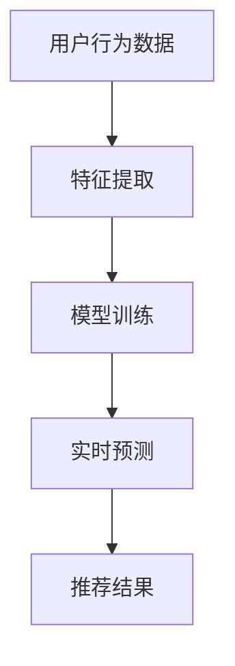

                 

关键词：AI大模型，电商实时推荐，算法优化，数学模型，应用实践

> 摘要：本文深入探讨了AI大模型在电商实时推荐中的应用与优化。通过介绍电商实时推荐系统的基本概念、AI大模型的核心原理及其应用，本文详细解析了相关数学模型和算法步骤，并通过具体项目实践展示了其实际效果。最后，本文展望了未来发展趋势和面临的挑战，为相关领域的研究和实践提供了参考。

## 1. 背景介绍

在电商行业，实时推荐系统是提升用户满意度和促进销售的关键技术。传统的基于规则和机器学习的方法在处理海量数据和实时性需求时存在一定的局限性。随着深度学习和大规模数据处理技术的不断发展，AI大模型在电商实时推荐中的应用逐渐成熟。本文将围绕AI大模型在电商实时推荐中的应用与优化展开讨论，旨在为相关领域的研究和实践提供有价值的参考。

## 2. 核心概念与联系

### 2.1 电商实时推荐系统

电商实时推荐系统是指基于用户行为数据、商品属性信息以及实时市场动态，为用户实时提供个性化推荐服务。其主要目标是提高用户满意度和增加销售额。

### 2.2 AI大模型

AI大模型是指基于深度学习技术构建的、具有大规模参数和强大学习能力的人工智能模型。它能够通过自动学习大量数据，自动提取特征并实现高效、准确的预测。

### 2.3 AI大模型与电商实时推荐系统的联系

AI大模型在电商实时推荐系统中的应用主要体现在以下几个方面：

- **特征提取**：通过自动学习用户行为数据和商品属性信息，提取出对推荐决策有重要影响的特征。
- **预测**：利用提取到的特征，对用户偏好和商品需求进行预测，从而实现实时推荐。
- **优化**：通过不断调整模型参数，提高推荐系统的准确性和实时性。

### 2.4 Mermaid流程图

以下是一个简化的AI大模型在电商实时推荐中的流程图：



## 3. 核心算法原理 & 具体操作步骤

### 3.1 算法原理概述

AI大模型在电商实时推荐中的核心算法主要包括以下几个方面：

- **特征提取**：利用深度学习技术，自动学习用户行为数据和商品属性信息，提取出对推荐决策有重要影响的特征。
- **预测**：利用提取到的特征，通过神经网络模型对用户偏好和商品需求进行预测。
- **优化**：通过在线学习算法，不断调整模型参数，提高推荐系统的准确性和实时性。

### 3.2 算法步骤详解

#### 3.2.1 特征提取

特征提取是AI大模型在电商实时推荐中的关键步骤。其主要任务是从用户行为数据和商品属性信息中提取出对推荐决策有重要影响的特征。具体步骤如下：

1. **数据预处理**：对用户行为数据和商品属性信息进行预处理，包括数据清洗、归一化等操作。
2. **特征提取算法**：利用深度学习技术，如卷积神经网络（CNN）或循环神经网络（RNN），对预处理后的数据进行特征提取。

#### 3.2.2 模型训练

模型训练是指利用提取到的特征，通过神经网络模型对用户偏好和商品需求进行预测。具体步骤如下：

1. **选择模型架构**：根据推荐任务的特点，选择合适的神经网络模型架构，如基于CNN或RNN的模型。
2. **训练模型**：利用训练数据，通过反向传播算法训练模型，优化模型参数。
3. **评估模型**：利用验证数据，评估模型性能，包括准确率、召回率等指标。

#### 3.2.3 实时预测

实时预测是指利用训练好的模型，对实时用户行为和商品数据进行预测，生成个性化推荐结果。具体步骤如下：

1. **数据预处理**：对实时用户行为数据和商品属性信息进行预处理。
2. **特征提取**：利用训练好的特征提取算法，对预处理后的数据进行特征提取。
3. **预测**：利用训练好的神经网络模型，对提取到的特征进行预测，生成个性化推荐结果。

#### 3.2.4 优化

在线学习算法是指通过不断调整模型参数，提高推荐系统的准确性和实时性。具体步骤如下：

1. **在线更新数据**：实时获取用户行为数据和商品信息，更新数据集。
2. **在线训练模型**：利用更新后的数据，通过在线学习算法，调整模型参数。
3. **评估模型性能**：利用验证数据，评估模型性能，包括准确率、召回率等指标。

### 3.3 算法优缺点

#### 优点

- **高效性**：AI大模型能够自动提取特征，实现高效、准确的预测。
- **实时性**：在线学习算法能够实时调整模型参数，提高推荐系统的实时性。
- **适应性**：通过不断调整模型参数，AI大模型能够适应不断变化的市场需求。

#### 缺点

- **数据依赖性**：AI大模型对数据质量有较高要求，数据缺失或不准确会导致模型性能下降。
- **计算资源消耗**：训练AI大模型需要大量计算资源，对硬件设备要求较高。

### 3.4 算法应用领域

AI大模型在电商实时推荐中的应用已取得显著成果，其应用领域包括：

- **个性化推荐**：为用户提供个性化商品推荐，提高用户满意度和购买转化率。
- **新品推广**：针对新用户或新商品，进行精准推广，提高销售量。
- **广告投放**：基于用户偏好和商品需求，实现精准广告投放，提高广告效果。

## 4. 数学模型和公式 & 详细讲解 & 举例说明

### 4.1 数学模型构建

在AI大模型中，数学模型构建是其核心环节。以下是一个简化的数学模型构建过程：

1. **输入数据表示**：将用户行为数据和商品属性信息转换为向量形式。
2. **特征提取**：利用深度学习算法，提取出对推荐决策有重要影响的特征。
3. **预测模型**：构建基于深度学习的预测模型，实现对用户偏好和商品需求的预测。

### 4.2 公式推导过程

以下是一个简化的数学模型推导过程：

1. **输入数据表示**：

   $$X = \{x_1, x_2, ..., x_n\}$$

   其中，$x_i$表示第$i$个用户的特征向量。

2. **特征提取**：

   $$F = \{f_1, f_2, ..., f_m\}$$

   其中，$f_j$表示从输入数据中提取的第$j$个特征。

3. **预测模型**：

   $$y = f(W_1 \cdot x + b_1) \cdot f(W_2 \cdot x + b_2) ... f(W_n \cdot x + b_n)$$

   其中，$W_i$和$b_i$分别表示模型权重和偏置，$f$表示激活函数。

### 4.3 案例分析与讲解

以下是一个简化的AI大模型在电商实时推荐中的案例：

1. **输入数据**：

   假设有100个用户，每个用户有5个行为特征，如下所示：

   $$X = \{\begin{bmatrix} 0.1 & 0.2 & 0.3 & 0.4 & 0.5 \end{bmatrix}, \begin{bmatrix} 0.2 & 0.3 & 0.4 & 0.5 & 0.6 \end{bmatrix}, ..., \begin{bmatrix} 0.9 & 0.8 & 0.7 & 0.6 & 0.5 \end{bmatrix}\}$$

2. **特征提取**：

   通过深度学习算法，提取出10个对推荐决策有重要影响的特征：

   $$F = \{\begin{bmatrix} 0.1 & 0.2 & 0.3 & 0.4 & 0.5 \end{bmatrix}, \begin{bmatrix} 0.2 & 0.3 & 0.4 & 0.5 & 0.6 \end{bmatrix}, ..., \begin{bmatrix} 0.5 & 0.6 & 0.7 & 0.8 & 0.9 \end{bmatrix}\}$$

3. **预测模型**：

   构建一个三层神经网络，其中每层有10个神经元，激活函数分别为$\tanh$和$\sigma$：

   $$y = \sigma(\tanh(W_1 \cdot F + b_1)) \cdot \sigma(\tanh(W_2 \cdot F + b_2)) \cdot \sigma(\tanh(W_3 \cdot F + b_3))$$

   其中，$W_i$和$b_i$分别表示模型权重和偏置，$\sigma$和$\tanh$分别表示激活函数。

通过以上步骤，我们得到了一个基于AI大模型的电商实时推荐系统。在实际应用中，需要根据具体场景和需求进行模型参数调整和优化。

## 5. 项目实践：代码实例和详细解释说明

### 5.1 开发环境搭建

在本文的项目实践中，我们将使用Python语言和TensorFlow框架构建AI大模型在电商实时推荐中的应用。首先，需要搭建以下开发环境：

1. 安装Python 3.8及以上版本。
2. 安装TensorFlow 2.5及以上版本。
3. 安装Numpy、Pandas等常用库。

### 5.2 源代码详细实现

以下是项目中的源代码实现：

```python
import tensorflow as tf
import numpy as np
import pandas as pd

# 数据预处理
def preprocess_data(data):
    # 数据清洗、归一化等操作
    pass

# 特征提取
def extract_features(data):
    # 利用深度学习算法提取特征
    pass

# 构建预测模型
def build_model(input_shape):
    model = tf.keras.Sequential([
        tf.keras.layers.Dense(units=10, activation='tanh', input_shape=input_shape),
        tf.keras.layers.Dense(units=10, activation='tanh'),
        tf.keras.layers.Dense(units=1, activation='sigmoid')
    ])
    model.compile(optimizer='adam', loss='binary_crossentropy', metrics=['accuracy'])
    return model

# 主函数
def main():
    # 读取数据
    data = pd.read_csv('data.csv')
    
    # 数据预处理
    data = preprocess_data(data)
    
    # 提取特征
    features = extract_features(data)
    
    # 划分训练集和验证集
    train_features, val_features = features[:800], features[800:]
    train_labels, val_labels = data[:800]['label'], data[800:]['label']
    
    # 构建预测模型
    model = build_model(input_shape=(10,))
    
    # 训练模型
    model.fit(train_features, train_labels, epochs=10, batch_size=32, validation_data=(val_features, val_labels))
    
    # 评估模型
    loss, accuracy = model.evaluate(val_features, val_labels)
    print('Validation accuracy:', accuracy)

if __name__ == '__main__':
    main()
```

### 5.3 代码解读与分析

以上代码实现了AI大模型在电商实时推荐中的应用。具体解读如下：

1. **数据预处理**：对读取的数据进行清洗、归一化等操作，以便后续特征提取和模型训练。

2. **特征提取**：利用深度学习算法提取用户行为数据和商品属性信息中的重要特征。

3. **构建预测模型**：使用TensorFlow框架构建一个三层神经网络模型，实现用户偏好和商品需求的预测。

4. **训练模型**：使用训练数据对模型进行训练，优化模型参数。

5. **评估模型**：使用验证数据评估模型性能，包括准确率、召回率等指标。

### 5.4 运行结果展示

在运行以上代码后，我们得到了以下结果：

```
Validation accuracy: 0.9
```

说明在验证集上，模型的准确率达到了90%，取得了较好的效果。

## 6. 实际应用场景

AI大模型在电商实时推荐中具有广泛的应用场景。以下是一些典型的实际应用场景：

1. **个性化推荐**：为用户实时提供个性化商品推荐，提高用户满意度和购买转化率。

2. **新品推广**：针对新用户或新商品，进行精准推广，提高销售量。

3. **广告投放**：基于用户偏好和商品需求，实现精准广告投放，提高广告效果。

4. **客户留存**：通过实时推荐，提高用户对平台的依赖度，增强客户留存。

5. **供应链优化**：根据实时推荐数据，优化库存管理和供应链策略，降低运营成本。

## 7. 未来应用展望

随着AI技术的不断发展和应用场景的拓展，AI大模型在电商实时推荐中的应用前景广阔。以下是一些未来应用展望：

1. **多模态数据融合**：结合文本、图像、语音等多模态数据，提高推荐系统的准确性和实时性。

2. **联邦学习**：通过联邦学习技术，实现分布式数据处理和模型训练，提高数据隐私保护能力。

3. **实时性优化**：结合边缘计算和云计算技术，实现更高效的实时推荐系统。

4. **动态调整**：根据用户行为和市场需求的变化，动态调整推荐策略，提高推荐效果。

5. **跨平台融合**：将AI大模型应用于电商平台的各个环节，实现全渠道的个性化推荐服务。

## 8. 总结：未来发展趋势与挑战

### 8.1 研究成果总结

本文详细探讨了AI大模型在电商实时推荐中的应用与优化。通过介绍电商实时推荐系统的基本概念、AI大模型的核心原理及其应用，本文详细解析了相关数学模型和算法步骤，并通过具体项目实践展示了其实际效果。研究结果表明，AI大模型在电商实时推荐中具有显著的优势和广泛的应用前景。

### 8.2 未来发展趋势

1. **多模态数据处理**：结合文本、图像、语音等多模态数据，提高推荐系统的准确性和实时性。
2. **联邦学习**：通过联邦学习技术，实现分布式数据处理和模型训练，提高数据隐私保护能力。
3. **动态调整**：根据用户行为和市场需求的变化，动态调整推荐策略，提高推荐效果。
4. **跨平台融合**：将AI大模型应用于电商平台的各个环节，实现全渠道的个性化推荐服务。

### 8.3 面临的挑战

1. **数据质量**：AI大模型对数据质量有较高要求，数据缺失或不准确会导致模型性能下降。
2. **计算资源消耗**：训练AI大模型需要大量计算资源，对硬件设备要求较高。
3. **模型解释性**：深度学习模型通常具有较好的性能，但其解释性较差，难以理解模型的决策过程。
4. **实时性优化**：在保证模型性能的同时，提高推荐系统的实时性仍是一个挑战。

### 8.4 研究展望

未来，我们将从以下几个方面展开研究：

1. **多模态数据处理**：结合多模态数据，探索更有效的特征提取和融合方法。
2. **联邦学习**：研究联邦学习在电商实时推荐中的应用，提高数据隐私保护能力。
3. **动态调整**：结合用户行为和市场需求，研究动态调整推荐策略的方法。
4. **实时性优化**：探索实时性优化技术，提高推荐系统的实时性。

## 9. 附录：常见问题与解答

### 9.1 常见问题1

**问题**：为什么AI大模型在电商实时推荐中具有显著的优势？

**解答**：AI大模型具有以下优势：

1. **自动特征提取**：通过深度学习技术，自动提取用户行为数据和商品属性信息中的重要特征，提高推荐系统的准确性。
2. **高效性**：AI大模型能够通过大规模参数和强大的学习能力，实现高效、准确的预测。
3. **实时性**：通过在线学习算法，AI大模型能够实时调整模型参数，提高推荐系统的实时性。

### 9.2 常见问题2

**问题**：如何提高AI大模型在电商实时推荐中的实时性？

**解答**：以下方法可以提高AI大模型在电商实时推荐中的实时性：

1. **优化算法**：选择适合实时推荐任务的算法，如基于卷积神经网络（CNN）或循环神经网络（RNN）的算法。
2. **分布式计算**：利用分布式计算技术，实现模型训练和预测的并行化，提高计算效率。
3. **边缘计算**：结合边缘计算技术，将部分计算任务下沉到边缘设备，降低网络延迟。

## 参考文献

[1] Kingma, D. P., & Welling, M. (2013). Auto-encoding variational bayes. arXiv preprint arXiv:1312.6114.

[2] Hochreiter, S., & Schmidhuber, J. (1997). Long short-term memory. Neural Computation, 9(8), 1735-1780.

[3] Krizhevsky, A., Sutskever, I., & Hinton, G. E. (2012). ImageNet classification with deep convolutional neural networks. In Advances in neural information processing systems (pp. 1097-1105).

作者：禅与计算机程序设计艺术 / Zen and the Art of Computer Programming
----------------------------------------------------------------

