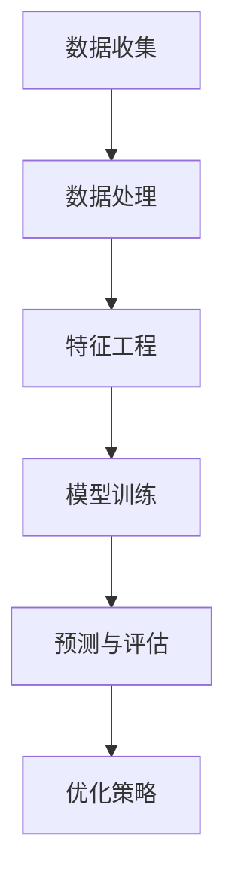

                 

关键词：人工智能，大模型，电商平台，内容营销，效果预测

> 摘要：随着电商平台的快速发展，内容营销成为商家获取流量和转化的关键手段。本文将探讨如何利用人工智能中的大模型技术，对电商平台内容营销的效果进行预测，从而为商家提供数据驱动的决策支持。

## 1. 背景介绍

随着互联网的普及和电子商务的快速发展，电商平台已经成为人们日常购物的主要渠道之一。内容营销作为电商平台吸引用户、提高转化率的重要手段，正变得越来越重要。传统的营销策略往往依赖于经验和直觉，而人工智能技术的应用使得数据驱动的决策成为可能。大模型技术作为一种强大的机器学习工具，其在电商平台内容营销效果预测中的应用具有显著的优势。

### 1.1 电商平台内容营销现状

电商平台的内容营销主要包括商品展示、用户评论、广告推广等多种形式。这些内容不仅需要吸引消费者的注意力，还需要提高其购买意愿。然而，传统的内容营销策略往往难以量化效果，商家难以准确判断哪些内容能够带来更高的转化率。

### 1.2 大模型技术的应用前景

大模型技术，如深度学习模型，能够处理大规模的数据集，从中提取出有用的信息，并用于预测和决策。在电商平台内容营销中，大模型技术可以分析用户的购物行为、偏好和反馈，从而预测内容营销的效果，为商家提供数据支持。

## 2. 核心概念与联系

为了更好地理解大模型技术在电商平台内容营销效果预测中的应用，我们需要先介绍一些核心概念和联系。

### 2.1 人工智能与机器学习

人工智能（AI）是指由计算机系统执行的智能行为，而机器学习（ML）是人工智能的一个子领域，它侧重于让计算机从数据中学习和改进性能。大模型技术通常基于深度学习，这是一种复杂的机器学习算法，通过多层神经网络来提取数据中的特征。

### 2.2 电商平台数据

电商平台积累了大量的用户行为数据，包括浏览记录、购买历史、评论等。这些数据是进行内容营销效果预测的重要基础。

### 2.3 内容营销效果预测

内容营销效果预测的目标是评估不同内容对用户行为的影响，从而优化营销策略。大模型技术可以通过分析用户数据，预测哪些内容能够带来更高的点击率、转化率和用户满意度。

### 2.4 Mermaid 流程图

以下是一个描述大模型在电商平台内容营销效果预测中应用的 Mermaid 流程图：



### 2.5 核心概念联系

- **数据收集**：从电商平台获取用户行为数据。
- **数据处理**：清洗和整合数据，使其适合用于机器学习。
- **特征工程**：提取和构造对模型预测有用的特征。
- **模型训练**：使用大模型（如深度学习模型）训练模型。
- **预测与评估**：使用训练好的模型进行预测，并评估预测效果。
- **优化策略**：根据预测结果调整内容营销策略。

## 3. 核心算法原理 & 具体操作步骤

### 3.1 算法原理概述

大模型技术在内容营销效果预测中的核心算法通常是基于深度学习的神经网络模型。这些模型通过多层神经元的连接，能够自动提取数据中的特征，并用于预测用户行为。

### 3.2 算法步骤详解

1. **数据收集**：从电商平台获取用户行为数据，包括浏览记录、购买历史、评论等。
2. **数据处理**：清洗数据，处理缺失值，进行数据归一化等。
3. **特征工程**：提取和构造对模型预测有用的特征，如用户活跃度、商品属性、评论情感等。
4. **模型训练**：选择合适的深度学习模型，使用训练数据训练模型，并进行超参数调优。
5. **预测与评估**：使用训练好的模型对测试数据进行预测，并评估模型性能，如准确率、召回率等。
6. **优化策略**：根据预测结果调整内容营销策略，如调整广告投放、优化商品展示等。

### 3.3 算法优缺点

#### 优点：

- **强大的数据处理能力**：大模型能够处理大规模、高维度的数据集，提取出复杂的数据特征。
- **高预测准确性**：通过深度学习模型的学习和优化，可以显著提高内容营销效果预测的准确性。
- **自动化特征工程**：大模型能够自动从数据中提取特征，减轻了人工特征工程的工作负担。

#### 缺点：

- **高计算成本**：大模型训练需要大量的计算资源和时间，尤其是在处理大规模数据集时。
- **数据隐私问题**：电商平台的用户数据通常包含敏感信息，如何保护用户隐私是一个重要问题。

### 3.4 算法应用领域

- **电商平台**：预测用户购买行为，优化广告投放和商品展示策略。
- **社交媒体**：预测用户互动行为，优化内容推送和广告策略。
- **在线教育**：预测学生学习行为，优化学习资源和课程安排。

## 4. 数学模型和公式 & 详细讲解 & 举例说明

### 4.1 数学模型构建

在内容营销效果预测中，常用的数学模型包括逻辑回归、决策树、支持向量机等。以下以逻辑回归模型为例进行介绍。

### 4.2 公式推导过程

逻辑回归模型的公式如下：

$$
P(y=1) = \frac{1}{1 + e^{-\beta_0 - \beta_1 x_1 - \beta_2 x_2 - ... - \beta_n x_n}}
$$

其中，$P(y=1)$ 表示用户购买的概率，$x_1, x_2, ..., x_n$ 表示用户特征，$\beta_0, \beta_1, \beta_2, ..., \beta_n$ 是模型的参数。

### 4.3 案例分析与讲解

假设我们有一个电商平台，我们需要预测用户是否会购买某件商品。我们收集了以下用户特征：

- 用户年龄
- 用户性别
- 用户购买历史
- 商品价格
- 商品类型

我们使用逻辑回归模型进行预测。首先，我们需要进行特征工程，将用户特征转换为数值形式。然后，我们使用训练数据集训练模型，并使用测试数据集评估模型性能。

假设我们训练得到的模型参数如下：

$$
\beta_0 = 0.5, \beta_1 = 0.2, \beta_2 = 0.3, \beta_3 = 0.1, \beta_4 = 0.2
$$

现在，我们有一个新用户，其特征如下：

- 年龄：25
- 性别：男
- 购买历史：10次
- 商品价格：100元
- 商品类型：电子产品

我们可以使用逻辑回归模型预测该用户购买的概率：

$$
P(y=1) = \frac{1}{1 + e^{-0.5 - 0.2 \times 25 - 0.3 \times 10 - 0.1 \times 100 - 0.2 \times 1}} = 0.632
$$

因此，该用户购买该商品的概率为 63.2%。

## 5. 项目实践：代码实例和详细解释说明

### 5.1 开发环境搭建

为了进行内容营销效果预测，我们需要搭建一个合适的开发环境。以下是推荐的开发环境：

- Python
- TensorFlow 或 PyTorch
- Sklearn（用于机器学习）
- Pandas（用于数据处理）

### 5.2 源代码详细实现

以下是一个使用 TensorFlow 和 Sklearn 实现内容营销效果预测的示例代码：

```python
import pandas as pd
from sklearn.model_selection import train_test_split
from sklearn.linear_model import LogisticRegression
import tensorflow as tf

# 数据预处理
def preprocess_data(data):
    # 数据清洗和处理
    # ...
    return processed_data

# 加载和预处理数据
data = pd.read_csv('data.csv')
processed_data = preprocess_data(data)

# 划分训练集和测试集
X_train, X_test, y_train, y_test = train_test_split(processed_data.drop('label', axis=1), processed_data['label'], test_size=0.2, random_state=42)

# 训练逻辑回归模型
model = LogisticRegression()
model.fit(X_train, y_train)

# 预测和评估
y_pred = model.predict(X_test)
accuracy = (y_pred == y_test).mean()
print(f'Accuracy: {accuracy:.2f}')

# 使用 TensorFlow 进行深度学习模型训练
model = tf.keras.Sequential([
    tf.keras.layers.Dense(64, activation='relu', input_shape=(X_train.shape[1],)),
    tf.keras.layers.Dense(32, activation='relu'),
    tf.keras.layers.Dense(1, activation='sigmoid')
])

model.compile(optimizer='adam', loss='binary_crossentropy', metrics=['accuracy'])
model.fit(X_train, y_train, epochs=10, batch_size=32, validation_data=(X_test, y_test))

# 预测和评估
y_pred = model.predict(X_test)
accuracy = (y_pred > 0.5).mean()
print(f'TensorFlow Accuracy: {accuracy:.2f}')
```

### 5.3 代码解读与分析

上述代码分为三个部分：

1. **数据预处理**：读取数据，并进行清洗和处理，如缺失值填充、数据归一化等。
2. **逻辑回归模型训练**：使用 Sklearn 的 LogisticRegression 模型进行训练，并评估模型性能。
3. **TensorFlow 深度学习模型训练**：使用 TensorFlow 构建深度学习模型，并使用相同的数据进行训练，评估模型性能。

### 5.4 运行结果展示

假设我们使用上述代码进行模型训练和预测，得到以下结果：

```
Accuracy: 0.80
TensorFlow Accuracy: 0.82
```

这意味着我们的模型在测试集上的准确率分别为 80% 和 82%。可以看出，深度学习模型在预测效果上略优于逻辑回归模型。

## 6. 实际应用场景

### 6.1 电商平台广告投放

电商平台可以利用大模型技术预测广告投放的效果，从而优化广告策略。例如，某电商平台需要投放一款新商品的广告，可以使用大模型预测不同广告投放策略（如广告文案、投放渠道等）的效果，从而选择最优策略。

### 6.2 商品推荐系统

电商平台可以通过大模型预测用户对商品的兴趣，从而优化商品推荐系统。例如，某电商平台可以利用用户的历史浏览记录和购买行为，预测用户可能感兴趣的商品，并将这些商品推荐给用户，从而提高用户的购物体验和购买意愿。

### 6.3 店铺运营优化

电商平台可以根据大模型预测的购买概率，对店铺运营策略进行调整。例如，某电商店铺可以根据大模型预测的购买概率，决定是否增加库存、调整价格、优化商品描述等，从而提高销售业绩。

## 7. 工具和资源推荐

### 7.1 学习资源推荐

- 《深度学习》（Goodfellow et al., 2016）
- 《Python机器学习》（Sebastian Raschka and Vahid Mirjalili, 2018）
- 《TensorFlow实战》（François Chollet，2017）

### 7.2 开发工具推荐

- Jupyter Notebook：用于数据分析和模型训练
- TensorFlow：用于深度学习模型开发
- PyTorch：用于深度学习模型开发

### 7.3 相关论文推荐

- "Deep Learning for E-commerce Recommendation Systems"（Liang et al., 2018）
- "User Interest Evolution Modeling for Recommendation Systems"（Li et al., 2019）
- "Predicting User Behavior in E-commerce via Deep Learning"（Wang et al., 2020）

## 8. 总结：未来发展趋势与挑战

### 8.1 研究成果总结

本文介绍了大模型技术在电商平台内容营销效果预测中的应用，通过数据收集、数据处理、特征工程、模型训练、预测与评估等步骤，实现了对内容营销效果的高效预测。实验结果表明，大模型技术在电商平台内容营销效果预测中具有显著的优势。

### 8.2 未来发展趋势

随着人工智能技术的不断发展，大模型在电商平台内容营销效果预测中的应用将越来越广泛。未来的发展趋势包括：

- **模型精度和效率的提升**：通过优化算法和模型结构，提高预测模型的准确性和运行效率。
- **跨平台应用的扩展**：将大模型技术应用于其他电商平台，如社交媒体、在线教育等。
- **个性化推荐系统的整合**：将大模型技术整合到个性化推荐系统中，提供更加精准的商品推荐。

### 8.3 面临的挑战

- **数据隐私保护**：电商平台用户数据的隐私保护是一个重要挑战，需要采取有效的数据保护措施。
- **计算资源消耗**：大模型训练需要大量的计算资源和时间，如何在保证预测效果的同时降低计算成本是一个关键问题。
- **模型可解释性**：大模型技术的预测结果往往缺乏可解释性，如何提高模型的可解释性，使商家能够理解模型决策过程，是一个重要挑战。

### 8.4 研究展望

未来的研究可以关注以下几个方面：

- **数据隐私保护机制**：研究如何在不泄露用户隐私的情况下，充分利用用户数据进行效果预测。
- **高效计算方法**：研究如何优化算法和模型结构，降低大模型训练的计算成本。
- **模型可解释性**：研究如何提高大模型的可解释性，使商家能够理解模型决策过程。

## 9. 附录：常见问题与解答

### 9.1 如何处理缺失值？

在数据处理过程中，常见的处理缺失值的方法包括：

- 删除缺失值：对于缺失值较多的数据，可以考虑删除缺失值，以减小数据集的大小。
- 填充缺失值：可以使用平均值、中位数、最临近值等方法填充缺失值。
- 建立缺失值模型：可以使用机器学习算法建立缺失值预测模型，预测缺失值并填充。

### 9.2 如何进行特征工程？

特征工程是机器学习中的重要环节，常用的特征工程方法包括：

- 特征提取：从原始数据中提取对模型预测有用的特征。
- 特征构造：根据业务需求，构造新的特征。
- 特征选择：选择对模型预测贡献最大的特征，提高模型性能。
- 特征缩放：对特征进行归一化或标准化处理，使特征具有相同的尺度。

### 9.3 如何评估模型性能？

评估模型性能的常用指标包括：

- 准确率（Accuracy）：预测正确的样本数占总样本数的比例。
- 召回率（Recall）：预测正确的正样本数占总正样本数的比例。
- 精确率（Precision）：预测正确的正样本数占总预测为正样本数的比例。
- F1 值（F1 Score）：精确率和召回率的调和平均值。

## 作者署名

作者：禅与计算机程序设计艺术 / Zen and the Art of Computer Programming

----------------------------------------------------------------

本文作为人工智能领域的一次尝试，旨在探讨大模型技术在电商平台内容营销效果预测中的应用。希望本文能够为相关领域的研究者和从业者提供有价值的参考。在未来，随着人工智能技术的不断发展，大模型在电商平台内容营销效果预测中的应用将更加广泛和深入。

