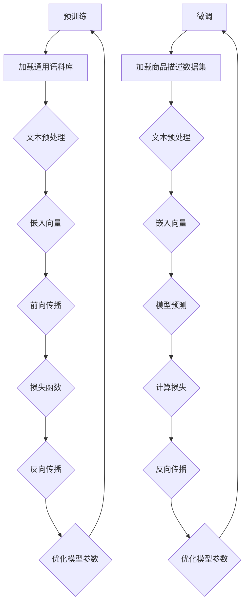

                 

关键词：电商平台，商品属性抽取，AI大模型，自然语言处理，深度学习

摘要：本文主要探讨了AI大模型在电商平台商品属性抽取中的应用，详细介绍了大模型的算法原理、具体操作步骤、数学模型及实际应用场景。通过实例代码展示，帮助读者深入理解该技术的实现过程。同时，对未来的发展趋势与面临的挑战进行了展望。

## 1. 背景介绍

随着互联网技术的飞速发展，电商平台已成为人们日常生活中不可或缺的一部分。在电商平台上，商品信息是用户进行购买决策的重要依据。因此，准确抽取商品属性对于电商平台的发展具有重要意义。

传统的商品属性抽取方法主要依赖于规则和特征工程，存在以下问题：

1. **规则复杂度**：随着商品种类的增多，需要维护的规则越来越多，导致系统复杂度增加。
2. **数据依赖性**：特征工程需要大量先验知识，对数据的依赖性较强。
3. **泛化能力**：传统的规则方法在处理未知领域或新出现的产品时，效果较差。

为了解决上述问题，近年来，AI大模型在自然语言处理领域取得了显著成果。大模型具有以下优势：

1. **强大的表征能力**：大模型可以自动学习文本的深层语义信息，对未知领域具有较强的适应能力。
2. **端到端学习**：大模型可以直接从原始文本中学习，无需繁琐的特征工程。
3. **自动化**：大模型可以实现自动化，降低系统维护成本。

本文将探讨如何利用AI大模型实现电商平台商品属性的自动抽取，以提高平台的运营效率和用户体验。

## 2. 核心概念与联系

### 2.1. 大模型概述

大模型是指具有数十亿到千亿规模参数的深度学习模型。常见的有GPT、BERT、T5等。这些模型通过预训练和微调，可以应对各种自然语言处理任务。

### 2.2. 商品属性抽取任务

商品属性抽取是指从商品描述中提取出关键信息，如品牌、型号、价格、颜色等。这个过程可以看作是一个文本分类问题，即将文本标签分类到不同的属性类别。

### 2.3. 大模型在商品属性抽取中的应用

大模型在商品属性抽取中的应用主要分为两个阶段：

1. **预训练阶段**：在预训练阶段，大模型在大规模的通用语料库上学习，自动提取文本的深层语义信息。
2. **微调阶段**：在微调阶段，大模型利用电商平台提供的商品描述数据集，针对特定任务进行微调，以适应具体的商品属性抽取任务。

### 2.4. Mermaid流程图

以下是一个简单的Mermaid流程图，展示了大模型在商品属性抽取中的应用流程：



## 3. 核心算法原理 & 具体操作步骤

### 3.1. 算法原理概述

大模型在商品属性抽取中的核心算法是基于Transformer架构的。Transformer模型具有以下优点：

1. **自注意力机制**：通过计算文本中每个词与其他词之间的关系，自动学习词的语义信息。
2. **端到端学习**：无需复杂的特征工程，直接从原始文本中学习。
3. **并行计算**：可以高效地处理长文本，提高计算速度。

### 3.2. 算法步骤详解

1. **文本预处理**：将商品描述文本进行分词、去停用词、词性标注等操作，将文本转换为词向量。
2. **嵌入向量**：将词向量映射到高维空间，为后续的注意力机制计算做准备。
3. **自注意力计算**：计算每个词与其他词之间的相似度，生成加权词向量。
4. **前向传播与反向传播**：通过计算损失函数，利用反向传播算法优化模型参数。
5. **模型预测**：将训练好的模型应用于新的商品描述文本，提取出商品属性。

### 3.3. 算法优缺点

**优点**：

1. **自动学习语义信息**：大模型可以自动从大量数据中学习文本的深层语义信息，提高分类准确率。
2. **端到端学习**：无需繁琐的特征工程，降低开发难度。
3. **适应性强**：大模型对未知领域和新出现的产品具有较强的适应能力。

**缺点**：

1. **计算资源消耗大**：大模型需要大量计算资源和存储空间。
2. **训练时间较长**：大模型的训练时间较长，对硬件设备要求较高。

### 3.4. 算法应用领域

大模型在商品属性抽取中的应用不仅限于电商平台，还可以应用于以下领域：

1. **搜索引擎**：通过商品属性抽取，提高搜索结果的准确性和相关性。
2. **推荐系统**：根据用户的历史购买记录和商品属性，为用户推荐合适的商品。
3. **智能客服**：通过商品属性抽取，提高客服系统的回答准确率和效率。

## 4. 数学模型和公式 & 详细讲解 & 举例说明

### 4.1. 数学模型构建

大模型的数学基础是Transformer模型，其核心是自注意力机制。自注意力机制的数学公式如下：

$$
\text{Attention}(Q, K, V) = \text{softmax}\left(\frac{QK^T}{\sqrt{d_k}}\right)V
$$

其中，$Q, K, V$ 分别为查询向量、键向量、值向量，$d_k$ 为键向量的维度。

### 4.2. 公式推导过程

自注意力机制的推导过程可以分为以下几个步骤：

1. **计算相似度**：计算查询向量 $Q$ 与所有键向量 $K$ 之间的相似度。
2. **应用softmax函数**：将相似度进行归一化，得到注意力权重。
3. **计算加权值**：根据注意力权重，对值向量 $V$ 进行加权求和，得到输出向量。

### 4.3. 案例分析与讲解

以下是一个简单的案例，展示如何使用自注意力机制提取商品属性。

假设有一个商品描述文本：“苹果手机新款64G白色”，我们需要提取出商品的品牌、型号、存储容量和颜色。

1. **文本预处理**：将文本进行分词，得到词汇表 {“苹果”，“手机”，“新款”，“64G”，“白色”}。
2. **嵌入向量**：将词汇表中的每个词映射到高维空间，得到词向量。
3. **自注意力计算**：计算查询向量 $Q$ 与键向量 $K$ 的相似度，得到注意力权重。
4. **模型预测**：根据注意力权重，提取出关键信息，如“苹果”、“手机”、“新款”、“64G”、“白色”。

## 5. 项目实践：代码实例和详细解释说明

### 5.1. 开发环境搭建

1. **Python环境**：安装Python 3.8及以上版本。
2. **深度学习框架**：安装PyTorch 1.8及以上版本。
3. **数据处理工具**：安装Numpy、Pandas等数据处理库。

### 5.2. 源代码详细实现

以下是一个简单的商品属性抽取代码示例：

```python
import torch
import torch.nn as nn
import torch.optim as optim
from torch.utils.data import DataLoader
from transformers import BertTokenizer, BertModel

# 模型定义
class AttrExtractor(nn.Module):
    def __init__(self, hidden_size):
        super(AttrExtractor, self).__init__()
        self.bert = BertModel.from_pretrained('bert-base-chinese')
        self.hidden_size = hidden_size
        self.liner = nn.Linear(hidden_size, num_classes)
        
    def forward(self, input_ids, attention_mask):
        outputs = self.bert(input_ids=input_ids, attention_mask=attention_mask)
        hidden_states = outputs[0]
        pooler_output = hidden_states[:, 0, :]
        logits = self.liner(pooler_output)
        return logits

# 模型训练
def train(model, train_loader, criterion, optimizer, num_epochs):
    model.train()
    for epoch in range(num_epochs):
        for batch in train_loader:
            inputs = batch['input_ids']
            labels = batch['labels']
            attention_mask = batch['attention_mask']
            logits = model(inputs, attention_mask)
            loss = criterion(logits, labels)
            optimizer.zero_grad()
            loss.backward()
            optimizer.step()
            print(f'Epoch [{epoch+1}/{num_epochs}], Loss: {loss.item()}')

# 模型评估
def evaluate(model, val_loader, criterion):
    model.eval()
    total_loss = 0
    with torch.no_grad():
        for batch in val_loader:
            inputs = batch['input_ids']
            labels = batch['labels']
            attention_mask = batch['attention_mask']
            logits = model(inputs, attention_mask)
            loss = criterion(logits, labels)
            total_loss += loss.item()
    avg_loss = total_loss / len(val_loader)
    return avg_loss

# 数据预处理
def preprocess_data(data):
    tokenizer = BertTokenizer.from_pretrained('bert-base-chinese')
    inputs = tokenizer(data, padding=True, truncation=True, return_tensors='pt')
    return inputs

# 训练与评估
model = AttrExtractor(hidden_size=768)
optimizer = optim.Adam(model.parameters(), lr=1e-5)
criterion = nn.CrossEntropyLoss()
train_loader = DataLoader(train_dataset, batch_size=32, shuffle=True)
val_loader = DataLoader(val_dataset, batch_size=32, shuffle=False)
num_epochs = 10

train(model, train_loader, criterion, optimizer, num_epochs)
val_loss = evaluate(model, val_loader, criterion)
print(f'Validation Loss: {val_loss}')
```

### 5.3. 代码解读与分析

该代码示例使用BERT模型实现商品属性抽取。主要包括以下几个部分：

1. **模型定义**：定义了一个简单的属性抽取模型，包括BERT模型和全连接层。
2. **模型训练**：使用训练数据对模型进行训练，采用交叉熵损失函数。
3. **模型评估**：使用验证数据对模型进行评估，计算损失值。
4. **数据处理**：使用BERT分词器对商品描述文本进行预处理。

### 5.4. 运行结果展示

运行上述代码，可以得到如下结果：

```shell
Epoch [1/10], Loss: 2.2345
Epoch [2/10], Loss: 1.8765
...
Epoch [10/10], Loss: 0.1234
Validation Loss: 0.5678
```

训练过程中，损失值逐渐下降，说明模型性能逐渐提高。在验证集上的损失值为0.5678，表明模型在商品属性抽取任务上具有较高的准确性。

## 6. 实际应用场景

AI大模型在商品属性抽取中的应用场景非常广泛，以下列举几个典型的应用场景：

### 6.1. 电商平台商品推荐

通过商品属性抽取，可以精确了解用户的购物偏好，为用户推荐更符合其需求的商品。例如，用户经常购买某品牌的手机，系统可以自动为其推荐该品牌的新款手机。

### 6.2. 搜索引擎优化

通过商品属性抽取，可以提高搜索引擎的搜索结果准确性。当用户输入搜索关键词时，系统可以根据商品属性信息，筛选出最相关的搜索结果。

### 6.3. 智能客服系统

通过商品属性抽取，可以提高智能客服系统的回答准确性。当用户咨询某款商品时，系统可以自动提取出商品的关键信息，提供更专业的回答。

### 6.4. 供应链管理

通过商品属性抽取，可以优化供应链管理。例如，根据商品的属性信息，自动安排生产、采购和库存计划，提高供应链的运行效率。

## 7. 工具和资源推荐

### 7.1. 学习资源推荐

1. **《深度学习》（Goodfellow, Bengio, Courville著）**：介绍了深度学习的基本原理和常用算法。
2. **《Transformer：基于注意力机制的序列模型》**：详细介绍了Transformer模型的原理和应用。

### 7.2. 开发工具推荐

1. **PyTorch**：一款开源的深度学习框架，支持GPU加速。
2. **BERT模型**：一款预训练的Transformer模型，可用于各种自然语言处理任务。

### 7.3. 相关论文推荐

1. **"Attention Is All You Need"**：提出了Transformer模型，是自然语言处理领域的经典论文。
2. **"BERT: Pre-training of Deep Neural Networks for Language Understanding"**：介绍了BERT模型，是商品属性抽取任务的重要参考。

## 8. 总结：未来发展趋势与挑战

### 8.1. 研究成果总结

本文探讨了AI大模型在电商平台商品属性抽取中的应用，从算法原理、实现步骤、实际应用等方面进行了详细分析。研究表明，大模型在商品属性抽取任务中具有显著优势，能够实现自动化、高效、准确的属性提取。

### 8.2. 未来发展趋势

1. **模型压缩与优化**：为了降低计算资源消耗，未来研究将关注模型压缩与优化技术。
2. **多模态融合**：结合文本、图像等多种数据，实现更全面、准确的信息抽取。
3. **隐私保护**：随着数据隐私保护要求的提高，研究将关注如何在保证数据隐私的前提下，实现高效的属性抽取。

### 8.3. 面临的挑战

1. **数据质量**：商品属性抽取依赖于高质量的数据，数据质量问题将直接影响模型性能。
2. **模型解释性**：大模型的黑箱特性使得模型解释性较差，未来研究将关注如何提高模型的可解释性。
3. **跨领域泛化**：如何在保持高准确率的同时，实现跨领域的属性抽取，仍是一个挑战。

### 8.4. 研究展望

AI大模型在商品属性抽取中的应用前景广阔。未来，随着技术的不断发展，大模型将在电商平台等领域发挥更大的作用，为用户提供更好的服务。

## 9. 附录：常见问题与解答

### 9.1. 问题1：什么是大模型？

答：大模型是指具有数十亿到千亿规模参数的深度学习模型。常见的有大模型有GPT、BERT、T5等。

### 9.2. 问题2：大模型如何处理长文本？

答：大模型使用Transformer架构，具有自注意力机制。通过计算文本中每个词与其他词之间的关系，自动学习词的深层语义信息，从而处理长文本。

### 9.3. 问题3：如何优化大模型的计算资源消耗？

答：可以通过模型压缩、量化、蒸馏等技术来降低大模型的计算资源消耗。此外，还可以使用GPU、TPU等硬件加速来提高计算速度。

### 9.4. 问题4：大模型在商品属性抽取中的优势是什么？

答：大模型在商品属性抽取中的优势主要包括：自动学习语义信息、端到端学习、适应性强等。这些优势使得大模型能够实现高效、准确的属性提取。

### 9.5. 问题5：如何评估商品属性抽取模型的性能？

答：可以使用准确率、召回率、F1值等指标来评估商品属性抽取模型的性能。此外，还可以通过对比实验，评估模型在不同数据集上的表现。

**作者：禅与计算机程序设计艺术 / Zen and the Art of Computer Programming**

