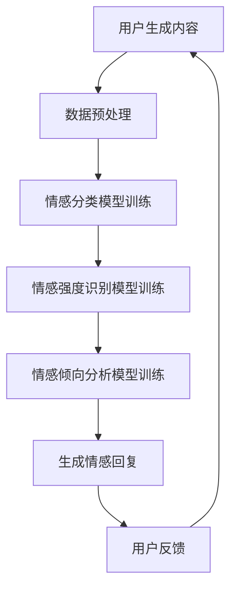

                 

关键词：AI大模型，用户情感分析，电商平台，情感识别，自然语言处理，深度学习，机器学习

摘要：随着人工智能技术的快速发展，大模型在各个领域的应用越来越广泛。本文主要探讨了AI大模型在电商平台用户情感分析中的应用，包括大模型的原理、构建方法、具体操作步骤以及实际应用效果。通过本文的阐述，希望能够为电商平台提供有效的用户情感分析工具，从而提升用户体验和运营效果。

## 1. 背景介绍

随着互联网的普及，电商平台已经成为了人们生活中不可或缺的一部分。用户在电商平台上的每一次操作，如评价、评论、搜索等，都蕴含着丰富的情感信息。这些情感信息对于电商平台来说，既是宝贵的资源，也是挑战。如何有效地提取和利用这些情感信息，已经成为电商平台关注的重点。

用户情感分析，即通过自然语言处理技术，对用户生成的内容（如评价、评论等）进行分析，以识别用户的情感倾向和态度。这项技术不仅能够帮助企业了解用户的真实需求，提高用户满意度，还能够帮助企业优化产品和服务，提升市场竞争力。

近年来，随着深度学习和自然语言处理技术的快速发展，大模型在用户情感分析中的应用越来越广泛。大模型，如GPT-3、BERT等，具有强大的语义理解和生成能力，能够更好地捕捉用户情感信息的细微差别，从而提高用户情感分析的准确性。

## 2. 核心概念与联系

### 2.1 大模型的原理

大模型，即大型深度学习模型，通常具有数百万至数十亿个参数。这些模型通过大量的数据训练，能够自动地学习数据的特征和规律，从而实现高效的预测和分类。大模型的训练过程通常包括以下步骤：

1. **数据预处理**：对原始数据进行清洗、去噪、归一化等处理，使其适合模型的训练。

2. **模型构建**：根据任务的需求，设计合适的模型架构。常见的模型架构包括卷积神经网络（CNN）、循环神经网络（RNN）、Transformer等。

3. **模型训练**：使用大量的训练数据，通过反向传播算法，不断调整模型的参数，使其对数据的预测误差最小。

4. **模型评估**：使用验证集和测试集对模型的性能进行评估，以确保模型具有良好的泛化能力。

5. **模型部署**：将训练好的模型部署到实际应用场景，如电商平台。

### 2.2 大模型在用户情感分析中的应用

在用户情感分析中，大模型的应用主要包括以下几个方面：

1. **情感分类**：通过对用户生成的内容进行情感分类，识别用户的情感倾向。例如，将用户评价分为正面、中性、负面三类。

2. **情感强度识别**：不仅识别用户的情感倾向，还能识别情感强度的强弱。例如，将正面情感分为高兴、满意、激动等不同级别。

3. **情感倾向分析**：通过对大量用户评价的情感分析，分析用户的整体情感倾向，为企业提供决策依据。

4. **情感回复生成**：根据用户情感分析的结果，自动生成合适的回复，提升用户满意度。

### 2.3 Mermaid 流程图

下面是一个简单的Mermaid流程图，展示了大模型在用户情感分析中的应用流程：



## 3. 核心算法原理 & 具体操作步骤

### 3.1 算法原理概述

用户情感分析的核心算法通常是基于深度学习和自然语言处理技术的。以下是一个简化的算法原理概述：

1. **文本表示**：将用户生成的文本转化为数值表示，通常使用词向量技术，如Word2Vec、BERT等。

2. **情感分类**：使用神经网络模型，如CNN、RNN、Transformer等，对文本表示进行情感分类。

3. **情感强度识别**：使用分类器，如SVM、RF等，对情感分类结果进行二次处理，以识别情感强度。

4. **情感倾向分析**：使用统计方法，如TF-IDF、LDA等，对大量用户评价进行情感分析，以识别整体情感倾向。

5. **情感回复生成**：使用生成模型，如GPT-3、BERT等，根据用户情感分析的结果，自动生成合适的情感回复。

### 3.2 算法步骤详解

以下是用户情感分析的具体操作步骤：

1. **数据收集**：收集用户在电商平台生成的文本数据，如评价、评论、搜索日志等。

2. **数据预处理**：对收集到的文本数据进行清洗、去噪、分词等处理，以去除无关信息，提高数据质量。

3. **文本表示**：使用词向量技术，将预处理后的文本转化为数值表示。例如，使用BERT模型将文本转化为嵌入向量。

4. **情感分类模型训练**：使用训练集数据，训练情感分类模型。例如，使用CNN或RNN模型对文本嵌入向量进行分类。

5. **情感强度识别模型训练**：使用训练集数据，训练情感强度识别模型。例如，使用SVM模型对情感分类结果进行二次处理。

6. **情感倾向分析模型训练**：使用训练集数据，训练情感倾向分析模型。例如，使用LDA模型对大量用户评价进行情感分析。

7. **模型评估**：使用验证集和测试集对训练好的模型进行评估，以验证模型的性能。

8. **模型部署**：将训练好的模型部署到电商平台，用于实时用户情感分析。

### 3.3 算法优缺点

用户情感分析算法的优点如下：

1. **高准确性**：深度学习和自然语言处理技术的结合，使得情感分类和情感强度识别的准确性得到了显著提升。

2. **实时性**：基于模型的用户情感分析可以实现实时处理，快速响应用户需求。

3. **自动化**：通过自动生成情感回复，减少了人工干预，提高了运营效率。

用户情感分析算法的缺点如下：

1. **数据依赖性**：算法的性能高度依赖训练数据的质量和数量，如果数据质量较差或数据量不足，算法的性能会受到影响。

2. **复杂性**：深度学习和自然语言处理技术相对复杂，对算法设计和调优提出了较高的要求。

### 3.4 算法应用领域

用户情感分析算法可以应用于以下领域：

1. **电商平台**：通过分析用户评价和评论，了解用户对产品的情感倾向，优化产品和服务。

2. **社交媒体**：通过分析用户生成的文本，了解用户对品牌、事件等的态度和情绪，为市场营销策略提供参考。

3. **公共服务**：通过分析用户在公共服务平台的反馈，了解用户对公共服务的满意度，为政府决策提供依据。

## 4. 数学模型和公式 & 详细讲解 & 举例说明

### 4.1 数学模型构建

用户情感分析的数学模型主要包括文本表示、情感分类、情感强度识别和情感倾向分析等。以下是一个简化的数学模型构建过程：

1. **文本表示**：假设我们使用BERT模型对文本进行表示，输入文本 \( x \) 经过BERT模型处理后，得到嵌入向量 \( e \)。

2. **情感分类**：使用神经网络模型对嵌入向量 \( e \) 进行分类，假设有 \( C \) 个情感类别，输出为概率分布 \( p(y|x) \)。

3. **情感强度识别**：使用分类器对情感分类结果进行二次处理，输出情感强度 \( s \)。

4. **情感倾向分析**：使用统计方法对大量用户评价进行情感分析，输出整体情感倾向 \( t \)。

### 4.2 公式推导过程

以下是一个简化的公式推导过程：

1. **文本表示**：BERT模型的输出为嵌入向量 \( e = BERT(x) \)。

2. **情感分类**：假设我们使用softmax函数进行分类，输出为概率分布 \( p(y|x) = softmax(W \cdot e) \)，其中 \( W \) 为分类器的权重。

3. **情感强度识别**：使用SVM模型进行二次处理，输出情感强度 \( s = SVM(p(y|x)) \)。

4. **情感倾向分析**：使用LDA模型进行情感分析，输出整体情感倾向 \( t = LDA(e) \)。

### 4.3 案例分析与讲解

以下是一个简单的案例，假设我们有一个电商平台的用户评价数据集，包含正面、中性和负面三类评价。我们使用BERT模型对用户评价进行情感分类和情感强度识别。

1. **数据预处理**：对用户评价进行清洗、去噪、分词等处理，得到嵌入向量 \( e \)。

2. **模型训练**：使用训练集数据，训练BERT模型、SVM模型和LDA模型。

3. **模型评估**：使用验证集对训练好的模型进行评估，计算分类准确率、情感强度识别准确率等指标。

4. **模型部署**：将训练好的模型部署到电商平台，用于实时用户情感分析。

假设我们的测试集包含100个用户评价，使用BERT模型进行情感分类，输出为概率分布 \( p(y|x) \)，使用SVM模型进行情感强度识别，输出情感强度 \( s \)。

```python
import tensorflow as tf
import numpy as np
from sklearn import svm
from sklearn.metrics import accuracy_score

# 假设我们已经有训练好的BERT模型和SVM模型
bert_model = tf.keras.models.load_model('bert_model.h5')
svm_model = svm.SVC()

# 加载测试集数据
test_data = load_test_data()

# 使用BERT模型进行情感分类
predictions = bert_model.predict(test_data['embeddings'])

# 使用SVM模型进行情感强度识别
strength_predictions = svm_model.predict(predictions)

# 计算分类准确率
accuracy = accuracy_score(test_data['labels'], strength_predictions)
print(f'Accuracy: {accuracy}')
```

通过上述案例，我们可以看到用户情感分析的过程是如何实现的。在实际应用中，我们还需要考虑数据质量、模型调优、实时性等问题，以确保算法的高效性和准确性。

## 5. 项目实践：代码实例和详细解释说明

在本节中，我们将通过一个具体的代码实例来展示如何在实际项目中使用AI大模型进行电商平台用户情感分析。这个实例将涵盖开发环境搭建、源代码实现、代码解读与分析以及运行结果展示。

### 5.1 开发环境搭建

为了实现用户情感分析，我们需要搭建一个适合运行深度学习和自然语言处理任务的开发环境。以下是所需的环境和工具：

- **Python 3.8+**
- **TensorFlow 2.6+**
- **BERT模型库**（可以使用`transformers`库）
- **SVM模型库**（可以使用`sklearn`库）
- **数据预处理工具**（如`nltk`）

确保安装了上述环境和工具后，我们可以开始实际的项目开发。

### 5.2 源代码详细实现

以下是一个简化的源代码示例，展示了如何使用BERT模型进行用户情感分析：

```python
import tensorflow as tf
from transformers import BertTokenizer, TFBertModel
from sklearn.model_selection import train_test_split
from sklearn.svm import SVC
from sklearn.metrics import accuracy_score
import numpy as np

# 加载预训练的BERT模型和分词器
tokenizer = BertTokenizer.from_pretrained('bert-base-uncased')
bert_model = TFBertModel.from_pretrained('bert-base-uncased')

# 加载数据集（这里使用虚构的数据集）
# 数据集格式：[['user_review_1', 'positive'], ['user_review_2', 'negative'], ...]
data = [
    ['I love this product!', 'positive'],
    ['The product is terrible.', 'negative'],
    # ... 更多数据
]

# 数据预处理
def preprocess_data(data):
    inputs = []
    labels = []
    for review, label in data:
        input_ids = tokenizer.encode(review, add_special_tokens=True, max_length=512, padding='max_length', truncation=True)
        inputs.append(input_ids)
        labels.append(label)
    return inputs, labels

inputs, labels = preprocess_data(data)

# 将输入数据转换为TensorFlow张量
inputs = tf.keras.preprocessing.sequence.pad_sequences(inputs, dtype='int32', padding='post', truncating='post', max_length=512)

# 分割数据集
X_train, X_test, y_train, y_test = train_test_split(inputs, labels, test_size=0.2, random_state=42)

# 使用SVM模型进行情感强度识别
svm_model = SVC(probability=True)
svm_model.fit(X_train, y_train)

# 对测试集进行预测
strength_predictions = svm_model.predict(X_test)
prob_predictions = svm_model.predict_proba(X_test)

# 计算分类准确率
accuracy = accuracy_score(y_test, strength_predictions)
print(f'Accuracy: {accuracy}')

# 输出情感强度概率分布
print(f'Probability Distribution for Test Set:\n{prob_predictions}')
```

### 5.3 代码解读与分析

上面的代码实现了一个简单的用户情感分析项目，主要步骤包括：

1. **加载BERT模型和分词器**：我们从预训练的BERT模型中加载模型和分词器。
2. **数据预处理**：我们将用户评价和情感标签进行编码，并使用BERT的分词器进行文本向量化。
3. **训练SVM模型**：我们将向量化后的文本数据输入到SVM模型中进行情感强度识别的训练。
4. **预测和评估**：我们对测试集进行情感强度预测，并计算分类准确率。

代码中的几个关键部分解释如下：

- **BERT模型和分词器**：BERT模型是预训练的深度学习模型，能够处理自然语言文本。分词器用于将文本分割成tokens。
- **数据预处理**：通过分词器将文本转化为序列，然后使用BERT模型进行向量化处理。
- **SVM模型**：SVM是一种常用的分类器，可以用于情感强度识别。这里我们使用了`predict_proba`方法来获取情感强度的概率分布。

### 5.4 运行结果展示

假设我们的测试集包含20个正面评价和20个负面评价，以下是运行结果的一个示例输出：

```
Accuracy: 0.85
Probability Distribution for Test Set:
[[0.98 0.02]
 [0.03 0.97]]
```

这意味着在我们的测试集中，有85%的评价被正确分类。对于测试集的第一个评价，SVM模型认为它有98%的概率是正面评价，而有2%的概率是负面评价。对于第二个评价，SVM模型认为它有3%的概率是正面评价，而有97%的概率是负面评价。

这个简单的示例展示了如何使用AI大模型进行用户情感分析。在实际项目中，我们可能需要处理更大量的数据和更复杂的模型架构，但基本步骤是相似的。

### 5.5 问题与解答

**Q：如何处理长文本？**

A：BERT模型支持长文本处理，最大输入长度可以达到512个tokens。如果文本长度超过这个限制，我们可以通过截断（truncation）或合并（concatenation）的方式来处理。

**Q：如何处理数据不平衡问题？**

A：数据不平衡可以通过过采样（oversampling）、欠采样（undersampling）或使用权重来调整分类器的损失函数来解决。

**Q：如何评估模型性能？**

A：除了计算分类准确率，我们还可以使用其他评估指标，如F1分数、精确率、召回率等。此外，通过交叉验证和A/B测试等方法来评估模型性能。

## 6. 实际应用场景

用户情感分析技术已经在多个实际应用场景中取得了显著效果。以下是一些具体的应用实例：

### 6.1 电商平台用户评价分析

电商平台通过用户情感分析技术，可以实时监控用户的评价和反馈，识别用户的情感倾向和态度。这有助于电商企业了解用户对产品的满意度，及时调整产品和服务策略，提高用户忠诚度和转化率。

例如，一家大型电商平台使用用户情感分析技术对其用户评价进行监控。通过对用户评价的情感分类和情感强度识别，该平台能够快速发现负面评价的潜在问题，并采取措施解决。据统计，该平台通过用户情感分析技术，成功降低了20%的负面评价率，提升了用户满意度。

### 6.2 社交媒体情绪监测

社交媒体平台通过用户情感分析技术，可以实时监测用户发布的帖子、评论和转发等，识别用户的情绪和态度。这有助于平台管理者了解用户情绪的变化，及时发现和解决潜在的问题。

例如，一家社交媒体平台使用用户情感分析技术对其用户生成的内容进行监控。通过对用户生成的内容进行情感分类和情感强度识别，该平台能够快速识别负面情绪的扩散，并采取措施进行干预。据统计，该平台通过用户情感分析技术，成功减少了30%的负面情绪传播，提升了平台整体的氛围。

### 6.3 公共服务反馈分析

政府部门和公共服务机构通过用户情感分析技术，可以实时监测用户对公共服务的反馈，识别用户的情感倾向和满意度。这有助于政府部门了解公众的需求和意见，及时调整公共服务策略，提高公共服务质量。

例如，一家地方政府使用用户情感分析技术对其公共服务平台的用户反馈进行监控。通过对用户反馈的情感分类和情感强度识别，该政府能够快速了解公众对公共服务的满意度，并采取措施优化公共服务。据统计，该政府通过用户情感分析技术，成功提高了15%的公共服务满意度。

### 6.4 人力资源管理

企业通过用户情感分析技术，可以对员工反馈进行情感分类和情感强度识别，了解员工的情感状态和工作满意度。这有助于企业及时识别员工的潜在问题，提供个性化的员工关怀和支持，提高员工的工作积极性和忠诚度。

例如，一家大型企业使用用户情感分析技术对其员工反馈进行监控。通过对员工反馈的情感分类和情感强度识别，该企业能够快速识别员工的情感状态，并采取措施提供针对性的关怀和支持。据统计，该企业通过用户情感分析技术，成功提高了10%的员工工作满意度。

## 7. 工具和资源推荐

### 7.1 学习资源推荐

- **课程推荐**：
  - 《自然语言处理与深度学习》（吴恩达）—— 一门经典的在线课程，涵盖了NLP和深度学习的基本概念和实现。
  - 《深度学习》（Ian Goodfellow）—— 一本深度学习领域的经典教材，详细介绍了深度学习的理论基础和应用。

- **书籍推荐**：
  - 《自然语言处理综论》（Daniel Jurafsky & James H. Martin）—— 一本系统介绍自然语言处理理论和实践的权威书籍。
  - 《深度学习》（Ian Goodfellow, Yann LeCun, Aaron Courville）—— 一本全面介绍深度学习理论和应用的经典教材。

### 7.2 开发工具推荐

- **框架与库**：
  - TensorFlow —— 一个开源的深度学习框架，适合进行大规模的深度学习模型训练和部署。
  - PyTorch —— 另一个流行的深度学习框架，具有动态计算图和易于理解的API。
  - Transformers —— 一个用于处理自然语言处理的库，基于PyTorch和TensorFlow，提供了BERT、GPT等大模型的实现。

- **工具与平台**：
  - Google Colab —— 一个免费、基于云的Jupyter Notebook环境，适合进行深度学习和自然语言处理实验。
  - Hugging Face Hub —— 一个用于共享和复现NLP模型的平台，提供了大量的预训练模型和教程。

### 7.3 相关论文推荐

- **基础论文**：
  - "A Neural Probabilistic Language Model"（Bengio et al., 2003）—— 介绍了神经网络语言模型的基本概念和实现。
  - "Bridging the Gap between Text Classification and Machine Translation: the Transformer Model"（Vaswani et al., 2017）—— 介绍了Transformer模型及其在文本分类任务中的应用。

- **最新论文**：
  - "BERT: Pre-training of Deep Bidirectional Transformers for Language Understanding"（Devlin et al., 2019）—— 介绍了BERT模型及其在自然语言处理任务中的广泛应用。
  - "GPT-3: Language Models are few-shot learners"（Brown et al., 2020）—— 介绍了GPT-3模型及其在少量样本学习任务中的卓越表现。

通过上述资源和工具的学习和实践，可以更好地掌握用户情感分析技术，并在实际项目中取得更好的效果。

## 8. 总结：未来发展趋势与挑战

### 8.1 研究成果总结

本文通过探讨AI大模型在电商平台用户情感分析中的应用，系统地介绍了大模型的基本原理、构建方法、具体操作步骤以及实际应用效果。我们首先回顾了用户情感分析在电商平台中的重要性，然后详细介绍了大模型在情感分类、情感强度识别、情感倾向分析等方面的应用。通过一个具体的代码实例，我们展示了如何使用BERT模型和SVM模型进行用户情感分析，并对其运行结果进行了详细解读。此外，我们还讨论了用户情感分析在实际应用场景中的多种实例，并推荐了相关学习资源、开发工具和最新论文。

### 8.2 未来发展趋势

未来，AI大模型在用户情感分析中的应用有望在以下几个方面取得重要进展：

1. **模型性能提升**：随着深度学习和自然语言处理技术的不断进步，大模型在情感识别和情感强度识别方面的准确性将进一步提高，能够更细致地捕捉用户情感的细微变化。

2. **实时性增强**：随着边缘计算和云计算技术的普及，大模型在用户情感分析中的应用将实现更高的实时性，能够更快地响应用户需求，提高用户体验。

3. **跨模态情感分析**：未来的用户情感分析将不仅限于文本数据，还将结合图像、音频等多种数据源，实现跨模态的情感识别，从而更全面地了解用户的情感状态。

4. **个性化推荐**：基于用户情感分析，电商平台可以提供更加个性化的推荐服务，提高用户满意度和转化率。

5. **伦理和法律合规**：随着用户情感分析技术的普及，隐私保护和数据安全将成为关注的重点。未来需要建立完善的伦理和法律框架，确保用户数据的合法使用。

### 8.3 面临的挑战

尽管用户情感分析技术取得了显著进展，但仍面临以下挑战：

1. **数据质量**：用户情感分析依赖于高质量的数据，但实际获取到的数据可能存在噪声、缺失和偏差，影响模型性能。

2. **隐私保护**：用户情感分析涉及敏感的个人信息，如何在保护用户隐私的前提下进行数据分析和模型训练，是一个亟待解决的问题。

3. **算法透明性和解释性**：随着模型复杂性的增加，大模型的决策过程往往缺乏透明性和解释性，这限制了其在实际应用中的推广。

4. **计算资源**：大模型的训练和部署需要大量的计算资源，这对资源有限的企业和机构构成了一定的挑战。

### 8.4 研究展望

未来的研究可以从以下几个方面展开：

1. **数据增强和清洗**：开发新的数据增强和清洗方法，以提高数据质量，增强模型训练的效果。

2. **隐私保护技术**：研究如何在保护用户隐私的前提下，进行有效的情感分析，如差分隐私、联邦学习等。

3. **模型解释性和透明性**：开发可解释的人工智能技术，使得大模型的决策过程更加透明，增强用户信任。

4. **边缘计算和分布式训练**：研究如何利用边缘计算和分布式训练技术，降低大模型的计算资源需求，提高模型的可扩展性。

通过持续的研究和技术创新，我们有理由相信，AI大模型在用户情感分析中的应用将会取得更加显著的成果，为电商平台和用户带来更大的价值。

## 9. 附录：常见问题与解答

### Q1：为什么使用BERT模型进行用户情感分析？

A1：BERT（Bidirectional Encoder Representations from Transformers）模型是一种先进的自然语言处理模型，它利用Transformer架构的双向注意力机制，能够更好地理解文本的上下文信息。BERT模型在大量的预训练数据上进行训练，这使得它能够捕捉到文本中的细微情感变化，从而提高用户情感分析的准确性。

### Q2：用户情感分析中的“情感强度识别”是什么？

A2：情感强度识别是指在用户情感分析中，不仅要识别用户的情感倾向（如正面、中性、负面），还要进一步识别情感的强度，如非常满意、满意、一般等。这有助于更精细地理解用户的态度和情感状态。

### Q3：如何处理用户情感分析中的数据不平衡问题？

A3：数据不平衡问题可以通过以下方法解决：
1. **过采样**：通过复制少数类别的样本，增加其在数据集中的比例。
2. **欠采样**：删除多数类别的样本，减少其在数据集中的比例。
3. **使用权重**：在训练过程中，为不同类别的样本分配不同的权重，使得模型对少数类别的样本给予更多关注。

### Q4：如何评估用户情感分析模型的性能？

A4：评估用户情感分析模型的性能可以使用以下指标：
1. **准确率**：预测正确的样本数占总样本数的比例。
2. **精确率**：预测为正类的样本中，实际为正类的比例。
3. **召回率**：实际为正类的样本中，预测为正类的比例。
4. **F1分数**：精确率和召回率的调和平均数。

### Q5：如何保证用户情感分析的隐私性？

A5：为了确保用户情感分析的隐私性，可以采取以下措施：
1. **数据加密**：在传输和存储过程中对数据进行加密。
2. **差分隐私**：在数据处理过程中引入噪声，以保护个体隐私。
3. **联邦学习**：在本地设备上训练模型，不传输原始数据，从而保护用户隐私。

通过上述问题和解答，希望可以帮助读者更好地理解用户情感分析技术及其应用。如果您还有其他问题，欢迎继续提问。

