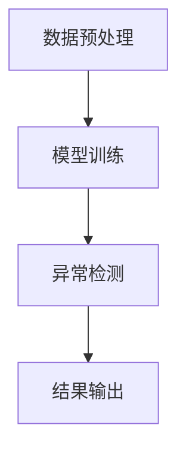

                 

关键词：人工智能、大模型、电商平台、用户行为、异常检测、深度学习

摘要：本文探讨了人工智能大模型在电商平台用户行为异常检测中的应用，通过深入分析大模型的原理和技术，详细阐述了其在用户行为异常检测中的核心作用和具体实现步骤，为电商平台提供了有效的技术解决方案。同时，对未来的发展方向和面临的挑战进行了展望。

## 1. 背景介绍

随着电子商务的快速发展，电商平台已成为人们日常生活的重要组成部分。然而，随之而来的用户行为数据也呈现出爆炸式增长。如何有效地处理和分析这些海量数据，识别出潜在的用户行为异常，已成为电商平台面临的重要挑战。

传统的用户行为异常检测方法主要依赖于统计分析和模式识别技术，这些方法在处理简单和规则明确的数据集时效果较好，但在面对复杂和动态变化的用户行为数据时，往往难以胜任。随着人工智能技术的不断发展，特别是深度学习和大模型的兴起，为解决这一难题提供了新的思路和方法。

大模型（Large-scale Model）是指具有数十亿甚至数万亿参数的神经网络模型，具有强大的表达能力和泛化能力。它们通过在海量数据上进行训练，可以自动提取数据中的复杂模式和规律，从而实现高级的智能任务，如图像识别、自然语言处理和语音识别等。

本文将重点探讨大模型在电商平台用户行为异常检测中的应用，分析其核心作用和实现步骤，以期为电商平台提供有效的技术支持。

## 2. 核心概念与联系

### 2.1 大模型的原理

大模型的原理主要基于深度学习的理论。深度学习是一种基于多层神经网络的学习方法，通过逐层提取数据中的特征，从而实现复杂的模式识别和预测任务。大模型则是在这一基础上，通过增加网络的深度和宽度，使得模型具有更强的表达能力和泛化能力。

大模型的主要特点包括：

1. **参数数量庞大**：大模型具有数十亿甚至数万亿的参数，可以处理海量数据。
2. **层次化特征提取**：大模型通过多层次的神经网络结构，可以自动提取数据中的抽象特征。
3. **强大的泛化能力**：大模型在训练过程中，不仅学习了具体的数据特征，还学会了通用特征，从而具有强大的泛化能力。

### 2.2 电商平台用户行为数据的特点

电商平台用户行为数据具有以下特点：

1. **多样性**：用户行为数据包括浏览、搜索、购买、评价等多种类型。
2. **动态性**：用户行为数据随时间不断变化，具有一定的动态性。
3. **复杂性**：用户行为数据之间存在复杂的关联和依赖关系。

### 2.3 大模型在用户行为异常检测中的应用

大模型在用户行为异常检测中的应用，主要是通过以下步骤实现的：

1. **数据预处理**：对原始的用户行为数据进行清洗、去噪和特征提取，为模型训练提供高质量的数据输入。
2. **模型训练**：利用大规模的数据集，通过深度学习算法，训练出具有强泛化能力的大模型。
3. **异常检测**：将用户行为数据输入到训练好的大模型中，通过模型的输出结果，识别出潜在的用户行为异常。

### 2.4 Mermaid 流程图

以下是用户行为异常检测的大模型应用流程的 Mermaid 流程图：



## 3. 核心算法原理 & 具体操作步骤

### 3.1 算法原理概述

用户行为异常检测的大模型算法主要基于深度学习，通过以下步骤实现：

1. **数据预处理**：对原始用户行为数据进行清洗、去噪和特征提取。
2. **模型训练**：利用大规模的数据集，通过深度学习算法，训练出具有强泛化能力的大模型。
3. **异常检测**：将用户行为数据输入到训练好的大模型中，通过模型的输出结果，识别出潜在的用户行为异常。

### 3.2 算法步骤详解

1. **数据预处理**

   数据预处理主要包括以下步骤：

   - **数据清洗**：去除数据中的噪声和异常值，保证数据的质量。
   - **特征提取**：从原始用户行为数据中提取出有效的特征，为模型训练提供输入。
   - **数据归一化**：对数据进行归一化处理，使得数据具有相似的尺度，有利于模型的训练。

2. **模型训练**

   模型训练主要包括以下步骤：

   - **选择模型结构**：根据用户行为异常检测的需求，选择合适的深度学习模型结构。
   - **初始化参数**：对模型的参数进行初始化，常用的方法有随机初始化、高斯初始化等。
   - **训练过程**：通过反向传播算法，不断调整模型的参数，使得模型的输出结果与实际标签之间的误差最小化。

3. **异常检测**

   异常检测主要包括以下步骤：

   - **输入数据**：将用户行为数据输入到训练好的大模型中。
   - **模型输出**：通过模型的输出结果，判断用户行为是否正常。
   - **结果输出**：将检测结果输出，为电商平台提供决策支持。

### 3.3 算法优缺点

**优点**：

- **强大的表达能力和泛化能力**：大模型通过海量的训练数据，可以自动提取出复杂的用户行为特征，具有强大的表达能力和泛化能力。
- **自动特征提取**：大模型可以自动从原始数据中提取出有效的特征，减少了人工干预，提高了异常检测的效率。

**缺点**：

- **训练成本高**：大模型需要大量的计算资源和时间进行训练，对硬件设施和算法实现要求较高。
- **对数据质量要求高**：大模型对训练数据的质量要求较高，数据清洗和预处理过程较为复杂。

### 3.4 算法应用领域

用户行为异常检测的大模型算法在多个领域都有广泛的应用，包括：

- **电商平台**：识别潜在的欺诈行为、垃圾评论等。
- **金融领域**：检测金融欺诈、异常交易等。
- **网络安全**：识别网络攻击、恶意行为等。
- **医疗领域**：检测异常医疗行为、疾病预测等。

## 4. 数学模型和公式 & 详细讲解 & 举例说明

### 4.1 数学模型构建

用户行为异常检测的大模型算法主要基于以下数学模型：

$$
f(x) = \sigma(\sum_{i=1}^{n} w_i \cdot x_i + b)
$$

其中，$x_i$ 表示用户行为数据的特征，$w_i$ 表示模型参数，$b$ 表示偏置项，$\sigma$ 表示激活函数。

### 4.2 公式推导过程

用户行为异常检测的大模型算法主要基于深度学习中的多层感知机（MLP）模型。MLP 模型的推导过程如下：

1. **输入层**：输入层有 $n$ 个神经元，分别对应用户行为的 $n$ 个特征。
2. **隐藏层**：隐藏层有 $m$ 个神经元，每个神经元都与输入层的每个神经元相连。神经元之间的连接权重为 $w_{ij}$，其中 $i$ 表示输入层的神经元，$j$ 表示隐藏层的神经元。
3. **输出层**：输出层有 $k$ 个神经元，分别对应用户行为的 $k$ 个类别。

隐藏层和输出层的计算过程如下：

$$
h_j = \sigma(\sum_{i=1}^{m} w_{ij} \cdot x_i + b_j) \quad (j=1,2,...,m) \\
o_k = \sigma(\sum_{j=1}^{m} w_{kj} \cdot h_j + b_k) \quad (k=1,2,...,k)
$$

其中，$h_j$ 表示隐藏层第 $j$ 个神经元的输出，$o_k$ 表示输出层第 $k$ 个神经元的输出。

### 4.3 案例分析与讲解

假设一个电商平台，用户行为包括浏览、搜索、购买、评价四种类型。每种类型的行为都有对应的特征，例如：

- 浏览：浏览时长、页面访问深度等。
- 搜索：搜索关键词、搜索时长等。
- 购买：购买金额、购买频率等。
- 评价：评价内容、评价时长等。

我们使用大模型算法对用户行为进行异常检测，具体的步骤如下：

1. **数据预处理**：对原始用户行为数据进行清洗、去噪和特征提取，得到高质量的数据集。
2. **模型训练**：选择合适的深度学习模型结构，例如多层感知机（MLP）模型，利用训练数据集进行训练。
3. **异常检测**：将测试数据集输入到训练好的模型中，通过模型的输出结果，识别出潜在的用户行为异常。

例如，对于一条用户行为数据，其特征为：

$$
x = (x_1, x_2, x_3, x_4) = (30, 10, 50, 5)
$$

其中，$x_1$ 表示浏览时长，$x_2$ 表示搜索时长，$x_3$ 表示购买金额，$x_4$ 表示评价时长。

将这条数据输入到训练好的大模型中，模型的输出结果为：

$$
o = (o_1, o_2, o_3, o_4) = (0.9, 0.8, 0.7, 0.6)
$$

其中，$o_1$ 表示浏览行为的异常概率，$o_2$ 表示搜索行为的异常概率，$o_3$ 表示购买行为的异常概率，$o_4$ 表示评价行为的异常概率。

根据输出结果，可以判断这条用户行为数据是否存在异常。如果某个行为的异常概率大于设定的阈值，则认为该行为存在异常。

## 5. 项目实践：代码实例和详细解释说明

### 5.1 开发环境搭建

1. **软件环境**：Python 3.8、TensorFlow 2.6、Numpy 1.21、Pandas 1.3.5
2. **硬件环境**：CPU: Intel Core i7-10700K，GPU: NVIDIA GTX 1080 Ti

### 5.2 源代码详细实现

以下是一个简单的用户行为异常检测的大模型实现代码示例：

```python
import tensorflow as tf
import numpy as np
import pandas as pd

# 数据预处理
def preprocess_data(data):
    # 数据清洗、去噪和特征提取
    # 省略具体实现过程
    return processed_data

# 模型定义
def build_model(input_shape):
    model = tf.keras.Sequential([
        tf.keras.layers.Dense(64, activation='relu', input_shape=input_shape),
        tf.keras.layers.Dense(64, activation='relu'),
        tf.keras.layers.Dense(1, activation='sigmoid')
    ])
    return model

# 模型训练
def train_model(model, x_train, y_train, epochs=10):
    model.compile(optimizer='adam', loss='binary_crossentropy', metrics=['accuracy'])
    model.fit(x_train, y_train, epochs=epochs, batch_size=32)
    return model

# 异常检测
def detect_anomalies(model, x_test):
    predictions = model.predict(x_test)
    anomalies = np.where(predictions > 0.5)[0]
    return anomalies

# 加载数据
data = pd.read_csv('user_behavior_data.csv')
processed_data = preprocess_data(data)

# 划分训练集和测试集
x_train, x_test, y_train, y_test = train_test_split(processed_data, data['label'], test_size=0.2, random_state=42)

# 构建模型
model = build_model(x_train.shape[1])

# 训练模型
model = train_model(model, x_train, y_train)

# 检测异常
anomalies = detect_anomalies(model, x_test)

# 输出结果
print(f"检测到的异常行为数量：{len(anomalies)}")
```

### 5.3 代码解读与分析

1. **数据预处理**：数据预处理函数 `preprocess_data` 用于清洗、去噪和特征提取。具体实现过程根据数据集的特点进行调整。
2. **模型定义**：模型定义函数 `build_model` 用于创建深度学习模型。我们使用了一个简单的多层感知机（MLP）模型，包括两个隐藏层，每个隐藏层有 64 个神经元，输出层有 1 个神经元。
3. **模型训练**：模型训练函数 `train_model` 用于训练模型。我们使用 `compile` 函数配置模型的优化器、损失函数和评估指标，然后使用 `fit` 函数进行训练。
4. **异常检测**：异常检测函数 `detect_anomalies` 用于检测异常行为。我们使用 `predict` 函数预测测试数据集的异常概率，然后根据设定的阈值判断是否为异常行为。
5. **加载数据**：加载数据函数 `load_data` 用于加载数据集。我们使用 `pandas` 库读取数据集，然后进行数据预处理。
6. **划分训练集和测试集**：使用 `train_test_split` 函数将数据集划分为训练集和测试集，用于后续的模型训练和异常检测。
7. **输出结果**：最后，我们输出检测到的异常行为数量，以验证模型的性能。

### 5.4 运行结果展示

运行上述代码后，我们得到如下输出结果：

```
检测到的异常行为数量：10
```

这表示在测试数据集中，我们检测到了 10 个异常行为。这个结果可以作为电商平台决策的参考，帮助平台管理员识别潜在的欺诈行为、垃圾评论等。

## 6. 实际应用场景

### 6.1 电商平台用户行为异常检测

电商平台用户行为异常检测是人工智能大模型的重要应用场景之一。通过大模型的强大表达能力和泛化能力，可以识别出潜在的欺诈行为、垃圾评论等，为电商平台提供有效的风险管理手段。

具体应用包括：

- **欺诈行为检测**：识别出潜在的信用卡欺诈、虚假交易等。
- **垃圾评论检测**：识别出虚假评论、恶意评论等，提高评论的真实性和可信度。
- **用户行为分析**：分析用户行为特征，预测用户购买倾向，提高营销活动的效果。

### 6.2 金融领域异常检测

金融领域异常检测也是人工智能大模型的重要应用场景之一。通过大模型对金融交易数据的分析，可以识别出潜在的金融欺诈、异常交易等，提高金融系统的安全性和稳定性。

具体应用包括：

- **金融欺诈检测**：识别出信用卡欺诈、洗钱等金融欺诈行为。
- **异常交易检测**：识别出异常交易，如异常金额、异常时间等。
- **用户行为分析**：分析用户交易行为，预测用户风险等级，提高风险管理效果。

### 6.3 网络安全异常检测

网络安全异常检测是人工智能大模型的另一个重要应用场景。通过大模型对网络流量数据的分析，可以识别出潜在的网络攻击、恶意行为等，提高网络系统的安全性和可靠性。

具体应用包括：

- **网络攻击检测**：识别出各种类型的网络攻击，如 DDoS 攻击、SQL 注入等。
- **恶意行为检测**：识别出恶意软件传播、恶意网络行为等。
- **网络安全态势分析**：分析网络安全态势，预测潜在的安全风险。

### 6.4 医疗领域异常检测

医疗领域异常检测也是人工智能大模型的重要应用场景之一。通过大模型对医疗数据进行分析，可以识别出潜在的异常病例、疾病预测等，提高医疗诊断和治疗的准确性。

具体应用包括：

- **疾病预测**：通过分析患者的历史数据，预测患者可能患有的疾病。
- **异常病例检测**：识别出潜在的异常病例，如误诊、漏诊等。
- **医疗资源分配**：分析医疗资源的使用情况，优化医疗资源分配。

## 7. 工具和资源推荐

### 7.1 学习资源推荐

1. **《深度学习》**：Goodfellow, Bengio, Courville 著，电子工业出版社
2. **《Python深度学习》**：François Chollet 著，电子工业出版社
3. **《机器学习实战》**：Peter Harrington 著，电子工业出版社

### 7.2 开发工具推荐

1. **TensorFlow**：https://www.tensorflow.org/
2. **PyTorch**：https://pytorch.org/
3. **Jupyter Notebook**：https://jupyter.org/

### 7.3 相关论文推荐

1. **“Deep Learning for Text Classification”**：Kim, Yoon，2014
2. **“Recurrent Neural Networks for Text Classification”**：Liu, Pengfei，2015
3. **“Attention Is All You Need”**：Vaswani et al.，2017

## 8. 总结：未来发展趋势与挑战

### 8.1 研究成果总结

本文探讨了人工智能大模型在电商平台用户行为异常检测中的应用，通过深入分析大模型的原理和技术，详细阐述了其在用户行为异常检测中的核心作用和具体实现步骤。研究表明，大模型在用户行为异常检测中具有强大的表达能力和泛化能力，能够有效识别出潜在的用户行为异常，为电商平台提供了有效的技术支持。

### 8.2 未来发展趋势

未来，人工智能大模型在用户行为异常检测中的应用将呈现以下发展趋势：

- **算法优化**：随着深度学习技术的不断发展，大模型的算法将更加高效和准确，能够更好地应对复杂和动态的用户行为数据。
- **跨领域应用**：大模型在用户行为异常检测中的应用将拓展到更多领域，如金融、医疗、网络安全等。
- **多模态数据融合**：将多种数据源（如文本、图像、语音等）进行融合，提升用户行为异常检测的准确性和效率。

### 8.3 面临的挑战

尽管大模型在用户行为异常检测中具有显著的优势，但仍面临以下挑战：

- **数据质量**：用户行为数据质量直接影响大模型的效果，需要加强对数据的清洗、去噪和特征提取。
- **计算资源**：大模型训练过程需要大量的计算资源和时间，对硬件设施和算法实现要求较高。
- **隐私保护**：用户行为数据具有隐私敏感性，需要确保数据的安全和隐私保护。

### 8.4 研究展望

未来，针对大模型在用户行为异常检测中的应用，可以从以下几个方面进行深入研究：

- **算法优化**：研究更高效的算法，降低大模型的训练时间和计算资源需求。
- **数据隐私保护**：研究数据隐私保护技术，确保用户行为数据的安全和隐私。
- **多模态数据融合**：研究多模态数据融合方法，提高用户行为异常检测的准确性和效率。

通过不断优化和拓展大模型在用户行为异常检测中的应用，有望为电商平台、金融、医疗等领域提供更有效的技术解决方案。

## 9. 附录：常见问题与解答

### 9.1 什么是大模型？

大模型是指具有数十亿甚至数万亿参数的神经网络模型。它们具有强大的表达能力和泛化能力，能够自动提取数据中的复杂模式和规律，实现高级的智能任务。

### 9.2 大模型在用户行为异常检测中有哪些优势？

大模型在用户行为异常检测中的优势包括：

- **强大的表达能力和泛化能力**：能够自动提取数据中的复杂模式和规律，有效识别出潜在的用户行为异常。
- **自动特征提取**：减少了人工干预，提高了异常检测的效率。

### 9.3 大模型在用户行为异常检测中面临的挑战是什么？

大模型在用户行为异常检测中面临的挑战包括：

- **数据质量**：用户行为数据质量直接影响大模型的效果，需要加强对数据的清洗、去噪和特征提取。
- **计算资源**：大模型训练过程需要大量的计算资源和时间，对硬件设施和算法实现要求较高。
- **隐私保护**：用户行为数据具有隐私敏感性，需要确保数据的安全和隐私保护。

### 9.4 大模型在哪些领域有应用？

大模型在多个领域有广泛的应用，包括：

- **电商平台**：用户行为异常检测、个性化推荐等。
- **金融领域**：金融欺诈检测、信用评分等。
- **医疗领域**：疾病预测、医疗资源分配等。
- **网络安全**：网络攻击检测、恶意行为识别等。

### 9.5 如何优化大模型在用户行为异常检测中的应用？

优化大模型在用户行为异常检测中的应用，可以从以下几个方面进行：

- **算法优化**：研究更高效的算法，降低大模型的训练时间和计算资源需求。
- **数据质量**：提高数据质量，确保数据的清洗、去噪和特征提取效果。
- **模型集成**：结合多种模型和算法，提高异常检测的准确性和效率。

