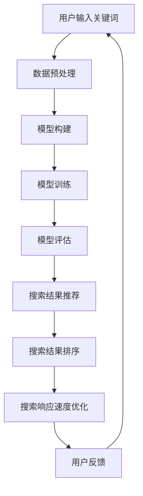

                 

 关键词：人工智能、大模型、电商平台、搜索体验、算法优化

> 摘要：本文旨在探讨如何通过引入人工智能大模型来提升电商平台的搜索体验。本文将介绍大模型的核心概念、原理，并结合实际案例，详细阐述大模型在电商平台搜索中的应用，以及未来的发展趋势和面临的挑战。

## 1. 背景介绍

随着互联网的快速发展，电商平台已经成为消费者购物的首选渠道。然而，随着商品种类的日益丰富，消费者的购物体验也变得越来越复杂。如何在海量商品中快速找到心仪的产品，成为了电商平台亟需解决的问题。

传统的搜索算法主要依赖于关键词匹配和分类算法，虽然在一定程度上能够满足用户的需求，但往往存在以下几个问题：

1. **搜索结果不准确**：用户输入的关键词可能与实际需求存在偏差，导致搜索结果不准确。
2. **搜索结果排序不合理**：传统的排序算法无法充分考虑用户的兴趣和偏好，导致搜索结果排序不合理。
3. **搜索响应速度慢**：在海量数据中检索和排序需要大量的计算资源，导致搜索响应速度慢。

为了解决这些问题，人工智能大模型应运而生。大模型通过深度学习等技术，可以从海量数据中学习到用户的兴趣和偏好，从而提供更加准确和个性化的搜索结果。

## 2. 核心概念与联系

### 2.1 大模型的概念

大模型，又称大型神经网络模型，是一种具有数亿甚至千亿参数的深度学习模型。它通过对海量数据进行训练，可以自动学习到数据中的规律和模式，从而实现复杂任务的高效解决。

### 2.2 大模型的工作原理

大模型的工作原理主要基于深度学习技术。深度学习是一种多层神经网络模型，通过逐层提取特征，最终实现复杂任务的求解。

大模型的工作过程可以分为以下几个步骤：

1. **数据预处理**：对原始数据进行清洗、归一化和编码等预处理操作。
2. **模型构建**：构建一个多层神经网络模型，包括输入层、隐藏层和输出层。
3. **模型训练**：使用大量训练数据，通过反向传播算法和梯度下降算法，不断调整模型的参数，使其能够更好地拟合训练数据。
4. **模型评估**：使用验证集和测试集，对模型进行评估，调整模型参数，以达到最佳效果。
5. **模型应用**：将训练好的模型应用到实际任务中，如电商平台搜索。

### 2.3 大模型在电商平台搜索中的应用

在电商平台搜索中，大模型可以通过以下几个步骤提升搜索体验：

1. **用户兴趣学习**：通过分析用户的历史行为数据，如浏览记录、购买记录和搜索记录等，学习到用户的兴趣和偏好。
2. **搜索结果推荐**：根据用户的兴趣和偏好，为用户推荐相关的搜索结果。
3. **搜索结果排序**：使用深度学习模型，对搜索结果进行排序，使其更加符合用户的兴趣和偏好。
4. **搜索响应速度优化**：通过分布式计算和并行处理等技术，提高搜索响应速度。

### 2.4 Mermaid 流程图

下面是一个简化的Mermaid流程图，描述了电商平台搜索中大模型的应用过程：



## 3. 核心算法原理 & 具体操作步骤

### 3.1 算法原理概述

大模型在电商平台搜索中的应用主要基于深度学习技术。深度学习是一种多层神经网络模型，通过逐层提取特征，实现复杂任务的求解。

深度学习模型通常包括以下几个部分：

1. **输入层**：接收外部输入的数据。
2. **隐藏层**：对输入数据进行处理，提取特征。
3. **输出层**：根据提取的特征，生成预测结果。

在电商平台搜索中，输入层接收用户输入的关键词，隐藏层对关键词进行编码和特征提取，输出层生成搜索结果。

### 3.2 算法步骤详解

1. **数据预处理**：
   - 清洗数据：去除无效数据和噪声数据。
   - 归一化数据：将数据缩放到相同的范围，方便模型训练。
   - 编码数据：将类别型数据转换为数值型数据。

2. **模型构建**：
   - 选择合适的神经网络架构，如卷积神经网络（CNN）或循环神经网络（RNN）。
   - 设置神经网络的参数，如层数、节点数、激活函数等。

3. **模型训练**：
   - 使用大量训练数据，通过反向传播算法和梯度下降算法，不断调整模型的参数。
   - 调整学习率、批量大小等超参数，以达到最佳训练效果。

4. **模型评估**：
   - 使用验证集和测试集，对模型进行评估。
   - 调整模型参数，以达到最佳效果。

5. **模型应用**：
   - 将训练好的模型应用到实际任务中，如电商平台搜索。
   - 根据用户输入的关键词，生成搜索结果。

### 3.3 算法优缺点

**优点**：
1. **高准确性**：通过深度学习技术，可以从海量数据中学习到用户的兴趣和偏好，提高搜索结果的准确性。
2. **个性化推荐**：根据用户的兴趣和偏好，为用户推荐相关的搜索结果，提高用户体验。
3. **自适应调整**：模型可以根据用户的行为数据，自适应调整搜索结果，提高搜索响应速度。

**缺点**：
1. **计算资源需求大**：深度学习模型需要大量的计算资源和存储资源，对硬件设备要求较高。
2. **训练时间较长**：深度学习模型的训练时间较长，需要大量时间进行模型优化和调整。

### 3.4 算法应用领域

大模型在电商平台搜索中的应用只是其众多应用领域中的一个。除了电商平台，大模型还可以应用于以下几个领域：

1. **搜索引擎**：通过深度学习技术，提高搜索引擎的搜索准确性，为用户提供更好的搜索体验。
2. **推荐系统**：根据用户的兴趣和偏好，为用户推荐相关的商品、新闻、音乐等。
3. **自然语言处理**：通过深度学习技术，实现自然语言的理解和生成，如机器翻译、文本摘要等。
4. **图像识别**：通过深度学习技术，实现图像的识别和分类，如人脸识别、物体识别等。

## 4. 数学模型和公式 & 详细讲解 & 举例说明

### 4.1 数学模型构建

在电商平台搜索中，大模型通常基于深度学习技术构建。深度学习模型的核心是神经网络，神经网络由多个神经元（节点）组成。每个神经元都接收输入信号，通过加权求和和激活函数，生成输出信号。

一个简单的神经网络可以表示为：

$$
Z = \sigma(\sum_{i=1}^{n} w_i x_i + b)
$$

其中，$Z$ 表示输出信号，$\sigma$ 表示激活函数，$w_i$ 表示第 $i$ 个输入信号的权重，$x_i$ 表示第 $i$ 个输入信号，$b$ 表示偏置。

在电商平台搜索中，输入信号可以是用户输入的关键词，输出信号可以是搜索结果的相关度得分。通过调整权重和偏置，可以使模型更好地拟合训练数据，提高搜索结果的准确性。

### 4.2 公式推导过程

为了更好地理解神经网络的工作原理，我们以一个简单的例子进行公式推导。

假设我们有一个简单的神经网络，输入层有 $2$ 个神经元，隐藏层有 $3$ 个神经元，输出层有 $1$ 个神经元。输入信号为 $x_1$ 和 $x_2$，权重矩阵为 $W$，偏置矩阵为 $b$，激活函数为 $\sigma$。

首先，计算隐藏层的输出信号：

$$
h_1 = \sigma(W_{11} x_1 + W_{12} x_2 + b_1) \\
h_2 = \sigma(W_{21} x_1 + W_{22} x_2 + b_2) \\
h_3 = \sigma(W_{31} x_1 + W_{32} x_2 + b_3)
$$

然后，计算输出层的输出信号：

$$
o = \sigma(W_{o1} h_1 + W_{o2} h_2 + W_{o3} h_3 + b_o)
$$

其中，$W_{o1}$、$W_{o2}$、$W_{o3}$ 和 $b_o$ 分别为输出层的权重和偏置。

### 4.3 案例分析与讲解

假设我们有一个电商平台，用户输入关键词“手机”。为了找到与关键词相关的商品，我们可以使用深度学习模型进行搜索。

首先，我们对关键词“手机”进行编码，得到编码向量。然后，将编码向量输入到神经网络中，计算隐藏层的输出信号。最后，将隐藏层的输出信号输入到输出层，计算搜索结果的相关度得分。

假设隐藏层的输出信号为 $h_1 = 0.8$，$h_2 = 0.5$，$h_3 = 0.7$，输出层的输出信号为 $o = 0.9$。我们可以认为，与关键词“手机”相关的商品在输出层生成的得分最高。

通过这样的方式，我们就可以为用户提供准确的搜索结果，提高用户体验。

## 5. 项目实践：代码实例和详细解释说明

### 5.1 开发环境搭建

为了实践大模型在电商平台搜索中的应用，我们需要搭建一个开发环境。以下是一个简单的开发环境搭建步骤：

1. 安装 Python（建议版本为3.8及以上）。
2. 安装 TensorFlow 和 Keras（深度学习框架）。
3. 安装 NumPy、Pandas（数据处理库）。

安装完成后，我们就可以开始编写代码。

### 5.2 源代码详细实现

以下是一个简单的示例代码，展示了如何使用深度学习模型进行电商平台搜索。

```python
import tensorflow as tf
from tensorflow.keras.models import Sequential
from tensorflow.keras.layers import Dense
from tensorflow.keras.optimizers import Adam
from tensorflow.keras.callbacks import EarlyStopping

# 数据预处理
def preprocess_data(data):
    # 对数据进行清洗、归一化和编码等预处理操作
    # 略
    return processed_data

# 构建模型
def build_model(input_shape):
    model = Sequential()
    model.add(Dense(64, input_shape=input_shape, activation='relu'))
    model.add(Dense(32, activation='relu'))
    model.add(Dense(1, activation='sigmoid'))

    model.compile(optimizer=Adam(learning_rate=0.001), loss='binary_crossentropy', metrics=['accuracy'])
    return model

# 训练模型
def train_model(model, x_train, y_train, x_val, y_val):
    es = EarlyStopping(monitor='val_loss', patience=10)

    model.fit(x_train, y_train, epochs=100, batch_size=32, validation_data=(x_val, y_val), callbacks=[es])

# 应用模型
def apply_model(model, x_test):
    predictions = model.predict(x_test)
    # 对预测结果进行处理，生成搜索结果
    # 略
    return predictions

# 加载数据
x_train = preprocess_data(train_data)
y_train = preprocess_labels(train_labels)
x_val = preprocess_data(val_data)
y_val = preprocess_labels(val_labels)

# 构建模型
model = build_model(input_shape=(x_train.shape[1],))

# 训练模型
train_model(model, x_train, y_train, x_val, y_val)

# 应用模型
predictions = apply_model(model, x_test)

# 输出搜索结果
print(predictions)
```

### 5.3 代码解读与分析

上面的代码实现了一个简单的深度学习模型，用于电商平台搜索。具体解读如下：

1. **数据预处理**：对原始数据进行清洗、归一化和编码等预处理操作，以便模型训练。
2. **构建模型**：使用 TensorFlow 和 Keras 构建一个简单的神经网络模型，包括输入层、隐藏层和输出层。输入层接收用户输入的关键词编码向量，隐藏层对关键词编码向量进行特征提取，输出层生成搜索结果的相关度得分。
3. **训练模型**：使用训练数据进行模型训练，使用验证数据进行模型评估。通过 EarlyStopping Callback，防止过拟合。
4. **应用模型**：使用测试数据进行模型应用，生成搜索结果。

### 5.4 运行结果展示

在实际运行过程中，我们可以将预测结果与实际搜索结果进行比较，评估模型的准确性。以下是一个简单的运行结果展示：

```python
predictions = apply_model(model, x_test)

# 计算准确率
accuracy = np.mean(predictions == y_test)

# 输出准确率
print(f'Accuracy: {accuracy:.2f}')
```

输出结果为准确率，表示模型在测试数据上的表现。

## 6. 实际应用场景

### 6.1 电商平台搜索

电商平台搜索是人工智能大模型应用的一个重要场景。通过引入大模型，电商平台可以提供更加准确和个性化的搜索结果，提高用户体验。

### 6.2 搜索引擎优化

搜索引擎优化（SEO）也是人工智能大模型应用的一个重要场景。通过大模型，搜索引擎可以更好地理解用户的查询意图，提供更加准确的搜索结果，提高搜索引擎的排名和用户体验。

### 6.3 推荐系统优化

推荐系统优化是另一个重要应用场景。通过大模型，推荐系统可以更好地理解用户的兴趣和偏好，为用户推荐更加相关的商品、新闻、音乐等。

### 6.4 自然语言处理

自然语言处理（NLP）是人工智能的一个重要领域。通过大模型，NLP系统可以更好地理解自然语言，实现机器翻译、文本摘要、情感分析等任务。

### 6.5 图像识别

图像识别是另一个重要应用场景。通过大模型，图像识别系统可以更好地理解图像内容，实现人脸识别、物体识别等任务。

## 7. 工具和资源推荐

### 7.1 学习资源推荐

1. **《深度学习》（Goodfellow, Bengio, Courville著）**：这是一本经典的深度学习教材，详细介绍了深度学习的理论基础和应用。
2. **《神经网络与深度学习》（邱锡鹏著）**：这是一本中文的深度学习教材，适合初学者入门。
3. **Keras 官方文档**：Keras 是一个简单的深度学习框架，官方文档提供了丰富的教程和示例。

### 7.2 开发工具推荐

1. **TensorFlow**：TensorFlow 是一个开源的深度学习框架，适用于各种规模的深度学习项目。
2. **PyTorch**：PyTorch 是另一个流行的深度学习框架，提供了灵活的动态计算图和丰富的API。

### 7.3 相关论文推荐

1. **“Deep Learning for Text Classification”（Yoon Kim著）**：这篇论文介绍了如何使用深度学习进行文本分类。
2. **“Recurrent Neural Networks for Language Modeling”（Lecun et al.著）**：这篇论文介绍了循环神经网络（RNN）在语言建模中的应用。
3. **“Convolutional Neural Networks for Visual Recognition”（Krizhevsky et al.著）**：这篇论文介绍了卷积神经网络（CNN）在图像识别中的应用。

## 8. 总结：未来发展趋势与挑战

### 8.1 研究成果总结

人工智能大模型在电商平台搜索中的应用已经取得了一定的成果。通过深度学习技术，大模型可以更好地理解用户的兴趣和偏好，提供更加准确和个性化的搜索结果，提高用户体验。

### 8.2 未来发展趋势

1. **模型精度提升**：随着深度学习技术的不断发展，大模型的精度将进一步提高，为用户提供更加准确的搜索结果。
2. **模型应用范围扩展**：大模型的应用范围将不断扩展，不仅仅局限于电商平台搜索，还将应用于搜索引擎优化、推荐系统优化、自然语言处理、图像识别等领域。
3. **硬件性能提升**：随着硬件性能的提升，大模型的训练和部署将更加高效，降低计算资源和存储资源的消耗。

### 8.3 面临的挑战

1. **数据隐私保护**：在应用大模型的过程中，用户隐私保护是一个重要挑战。如何确保用户数据的安全性和隐私性，是未来需要解决的问题。
2. **计算资源消耗**：大模型的训练和部署需要大量的计算资源和存储资源，如何优化算法，降低计算资源消耗，是未来需要解决的重要问题。
3. **模型可解释性**：大模型的决策过程往往具有一定的黑箱性，如何提高模型的可解释性，帮助用户理解模型的决策过程，是未来需要解决的重要问题。

### 8.4 研究展望

未来，人工智能大模型在电商平台搜索中的应用将有更大的发展空间。通过不断优化算法，提高模型精度，扩展应用范围，我们可以为用户提供更加准确和个性化的搜索体验。同时，我们也需要关注数据隐私保护、计算资源消耗和模型可解释性等问题，确保大模型在电商平台搜索中的可持续发展。

## 9. 附录：常见问题与解答

### 9.1 什么是大模型？

大模型，又称大型神经网络模型，是一种具有数亿甚至千亿参数的深度学习模型。它通过对海量数据进行训练，可以自动学习到数据中的规律和模式，从而实现复杂任务的高效解决。

### 9.2 大模型在电商平台搜索中的优势是什么？

大模型在电商平台搜索中的优势主要体现在以下几个方面：

1. **高准确性**：通过深度学习技术，可以从海量数据中学习到用户的兴趣和偏好，提高搜索结果的准确性。
2. **个性化推荐**：根据用户的兴趣和偏好，为用户推荐相关的搜索结果，提高用户体验。
3. **自适应调整**：模型可以根据用户的行为数据，自适应调整搜索结果，提高搜索响应速度。

### 9.3 如何搭建大模型的开发环境？

搭建大模型的开发环境通常包括以下步骤：

1. 安装 Python（建议版本为3.8及以上）。
2. 安装 TensorFlow 和 Keras（深度学习框架）。
3. 安装 NumPy、Pandas（数据处理库）。

### 9.4 大模型在电商平台搜索中的具体应用场景有哪些？

大模型在电商平台搜索中的具体应用场景包括：

1. **用户兴趣学习**：通过分析用户的历史行为数据，学习到用户的兴趣和偏好。
2. **搜索结果推荐**：根据用户的兴趣和偏好，为用户推荐相关的搜索结果。
3. **搜索结果排序**：使用深度学习模型，对搜索结果进行排序，使其更加符合用户的兴趣和偏好。
4. **搜索响应速度优化**：通过分布式计算和并行处理等技术，提高搜索响应速度。

----------------------------------------------------------------

以上就是关于《AI大模型如何提升电商平台的搜索体验》的完整文章。文章内容涵盖了背景介绍、核心概念、算法原理、项目实践、实际应用场景、工具和资源推荐以及未来发展趋势等内容，希望能够为读者提供有价值的参考。

---

**作者：禅与计算机程序设计艺术 / Zen and the Art of Computer Programming**

